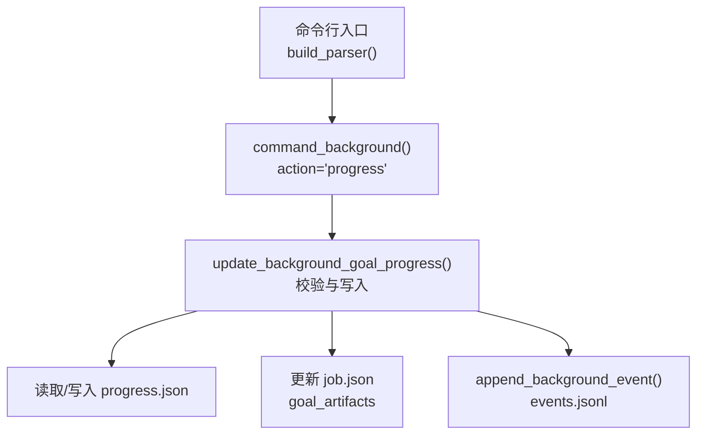
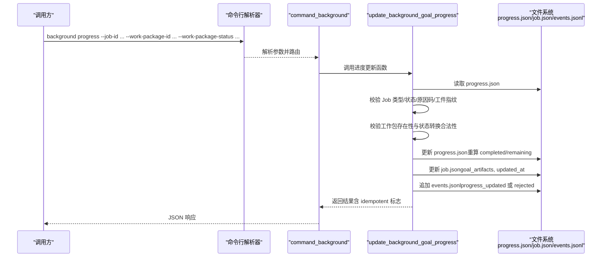
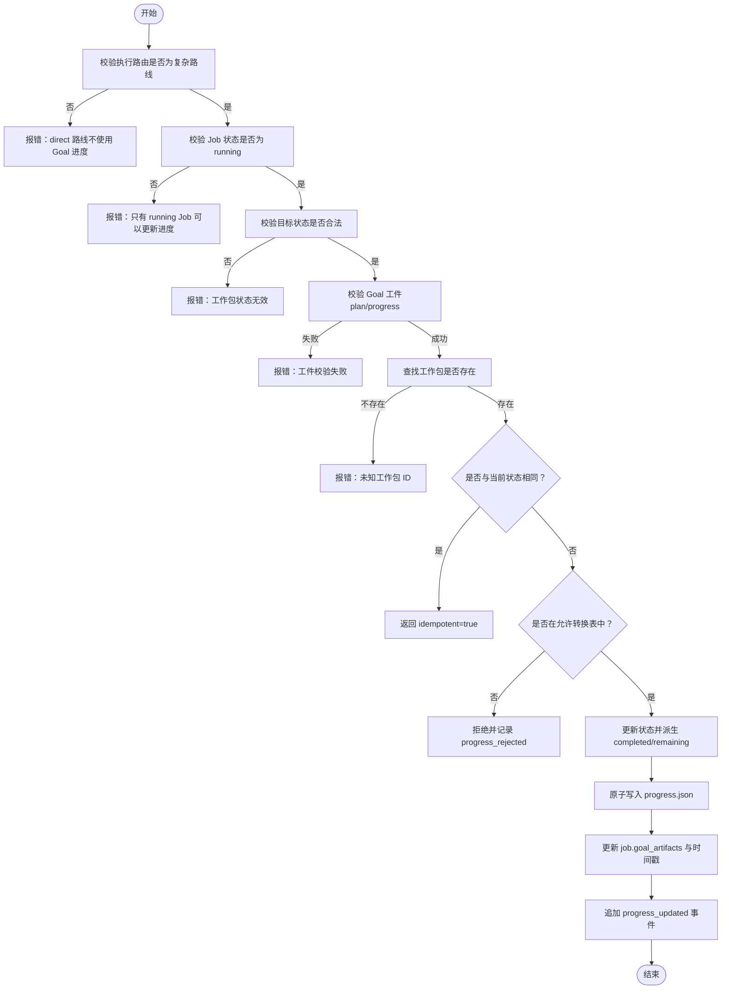
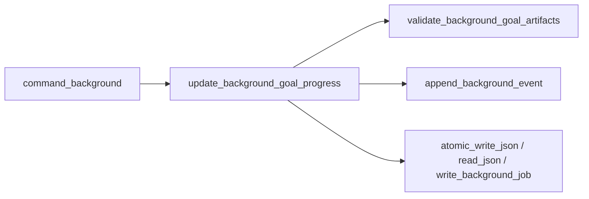

# 进度命令

<cite>
**本文引用的文件**   
- [scripts/harness.py](file://scripts/harness.py)
- [tests/test_harness.py](file://tests/test_harness.py)
</cite>

## 目录
1. [简介](#简介)
2. [项目结构](#项目结构)
3. [核心组件](#核心组件)
4. [架构总览](#架构总览)
5. [详细组件分析](#详细组件分析)
6. [依赖关系分析](#依赖关系分析)
7. [性能考量](#性能考量)
8. [故障排查指南](#故障排查指南)
9. [结论](#结论)
10. [附录](#附录)

## 简介
本文件围绕 background progress 命令，系统化说明其使用限制、状态转换规则、进度更新格式与校验逻辑、幂等与错误处理策略，以及完成状态与剩余列表的自动派生机制。该能力仅适用于“复杂后台 Job”（即执行路由为 background_goal 或 background_goal_phased）且处于 running 状态的 Job。通过严格的契约校验与事件记录，确保进度更新的可靠性与可审计性。

## 项目结构
- 命令行入口与参数解析：在脚本中定义 background 子命令及 progress 动作的参数，包括 --job-id、--work-package-id、--work-package-status、--reason-code 等。
- 后台控制面：background 子命令将请求分发到 command_background，再根据 action=progress 调用 update_background_goal_progress 实现进度更新。
- 工件与状态：progress.json 保存工作包状态集合；job.json 保存 Job 元数据与 goal_artifacts 引用；events.jsonl 持久化所有关键事件。
- 测试用例：覆盖从准备工件到推进/完成工作包的典型流程，验证状态转换与派生列表一致性。

**图表来源** 
- [scripts/harness.py:10455-10469](file://scripts/harness.py#L10455-L10469)
- [scripts/harness.py:8926-8933](file://scripts/harness.py#L8926-L8933)
- [scripts/harness.py:8528-8586](file://scripts/harness.py#L8528-L8586)

**章节来源**
- [scripts/harness.py:10455-10469](file://scripts/harness.py#L10455-L10469)
- [scripts/harness.py:8926-8933](file://scripts/harness.py#L8926-L8933)

## 核心组件
- 参数与路由
  - background subcommand 支持 action=progress，需要 --job-id、--work-package-id、--work-package-status，可选 --reason-code。
  - 路由到 command_background，再进入 update_background_goal_progress。
- 状态机与约束
  - 仅允许 execution_route 属于 BACKGROUND_COMPLEX_ROUTES 的 Job 使用 progress。
  - 仅当 job.status == "running" 时允许更新工作包进度。
  - 工作包状态集：pending、in_progress、completed、blocked。
  - 合法转换：pending→in_progress|blocked；in_progress→completed|blocked；其他转换拒绝。
- 进度工件与校验
  - progress.json 必须包含 schema_version、job_id、idempotency_key、artifact_revision、attempt、generated_by、work_package_states 等字段。
  - work_package_states 为对象数组，每项含 id 与 status，且顺序与冻结方案一致，值必须在允许的状态集中。
  - completed_work_packages 与 remaining_work_packages 由 work_package_states 自动派生，必须与当前状态一致。
- 事件与幂等
  - 成功更新会追加 progress_updated 事件；重复相同状态返回 idempotent=true 并直接成功。
  - 拒绝类操作会追加 progress_rejected 或 transition_rejected 事件，便于审计与排障。

**章节来源**
- [scripts/harness.py:10455-10469](file://scripts/harness.py#L10455-L10469)
- [scripts/harness.py:8926-8933](file://scripts/harness.py#L8926-L8933)
- [scripts/harness.py:8528-8586](file://scripts/harness.py#L8528-L8586)
- [scripts/harness.py:7500-7551](file://scripts/harness.py#L7500-L7551)

## 架构总览
下图展示了 background progress 的端到端调用链与数据流，包括参数校验、工件校验、状态转换、派生列表计算与事件落盘。

**图表来源** 
- [scripts/harness.py:10455-10469](file://scripts/harness.py#L10455-L10469)
- [scripts/harness.py:8926-8933](file://scripts/harness.py#L8926-L8933)
- [scripts/harness.py:8528-8586](file://scripts/harness.py#L8528-L8586)
- [scripts/harness.py:7500-7551](file://scripts/harness.py#L7500-L7551)

## 详细组件分析

### 命令参数与路由
- background 子命令支持 progress 动作，要求提供 --job-id、--work-package-id、--work-package-status，--reason-code 可选。
- 路由到 command_background，若 action=progress 则调用 update_background_goal_progress。

**章节来源**
- [scripts/harness.py:10455-10469](file://scripts/harness.py#L10455-L10469)
- [scripts/harness.py:8926-8933](file://scripts/harness.py#L8926-L8933)

### 进度更新主流程（update_background_goal_progress）
- 前置条件检查
  - 仅 complex route（background_goal / background_goal_phased）允许使用 progress。
  - 仅 job.status == "running" 允许更新。
  - requested_status 必须为 in_progress/completed/blocked。
  - reason_code 若提供，必须符合受控标识符正则。
- 工件校验
  - 调用 validate_background_goal_artifacts 校验 plan/progress 的 schema、绑定、attempt、artifact_revision 等。
- 状态转换与幂等
  - 若 current == requested_status，直接返回 idempotent=true。
  - 仅允许 pending→in_progress|blocked 与 in_progress→completed|blocked。
  - 非法转换拒绝并记录 progress_rejected 事件。
- 派生列表自动计算
  - completed_work_packages = 所有 status==completed 的工作包 id 列表。
  - remaining_work_packages = 所有 status!=completed 的工作包 id 列表。
- 持久化与事件
  - 原子写入 progress.json。
  - 更新 job.goal_artifacts 与 updated_at。
  - 追加 progress_updated 事件，携带 work_package_id、work_package_status、reason_code。

**图表来源** 
- [scripts/harness.py:8528-8586](file://scripts/harness.py#L8528-L8586)
- [scripts/harness.py:7500-7551](file://scripts/harness.py#L7500-L7551)

**章节来源**
- [scripts/harness.py:8528-8586](file://scripts/harness.py#L8528-L8586)
- [scripts/harness.py:7500-7551](file://scripts/harness.py#L7500-L7551)

### 进度工件与格式校验（validate_background_goal_artifacts）
- 校验 plan/progress 的 schema_version 与 artifact_revision。
- 校验 job_id 与 idempotency_key 绑定一致性。
- v2 工件要求：
  - generated_by 必须为 docs-harness。
  - attempt 与 job.attempt 一致。
  - work_package_states 为对象数组，每项仅含 id/status，且顺序与冻结方案一致。
  - completed_work_packages 与 remaining_work_packages 必须由 states 派生，保持一致。
- 旧格式兼容：
  - 允许 legacy 工件但需满足特定条件，否则拒绝。

**章节来源**
- [scripts/harness.py:7500-7551](file://scripts/harness.py#L7500-L7551)

### 事件与审计（append_background_event）
- 支持的事件类型包括 status、transition_rejected、progress_rejected、progress_updated 等。
- 对重复的 transition_rejected 进行去重，避免冗余日志。
- 事件包含 job_id、attempt、at 时间戳，以及业务相关字段（如 work_package_id、reason_code）。

**章节来源**
- [scripts/harness.py:7554-7577](file://scripts/harness.py#L7554-L7577)

### 测试覆盖与行为验证
- 测试用例演示了 prepare → progress(in_progress) → progress(completed) 的标准流程。
- 验证了复杂 Job 的 work_packages 生成与进度推进的一致性。

**章节来源**
- [tests/test_harness.py:165-196](file://tests/test_harness.py#L165-L196)
- [tests/test_harness.py:170-182](file://tests/test_harness.py#L170-L182)

## 依赖关系分析
- 模块内依赖
  - command_background 依赖 update_background_goal_progress。
  - update_background_goal_progress 依赖 validate_background_goal_artifacts、append_background_event、atomic_write_json、utc_now 等工具函数。
- 外部依赖
  - Git 与文件系统读写用于定位与持久化工件。
  - JSON/JSONL 序列化用于状态与事件存储。

**图表来源** 
- [scripts/harness.py:8926-8933](file://scripts/harness.py#L8926-L8933)
- [scripts/harness.py:8528-8586](file://scripts/harness.py#L8528-L8586)
- [scripts/harness.py:7500-7551](file://scripts/harness.py#L7500-L7551)
- [scripts/harness.py:7554-7577](file://scripts/harness.py#L7554-L7577)

**章节来源**
- [scripts/harness.py:8926-8933](file://scripts/harness.py#L8926-L8933)
- [scripts/harness.py:8528-8586](file://scripts/harness.py#L8528-L8586)
- [scripts/harness.py:7500-7551](file://scripts/harness.py#L7500-L7551)
- [scripts/harness.py:7554-7577](file://scripts/harness.py#L7554-L7577)

## 性能考量
- 原子写入与锁：progress.json 采用原子写入，避免并发写导致的损坏。
- 事件去重：transition_rejected 事件去重，降低日志膨胀。
- 派生列表计算：completed/remaining 列表基于内存遍历 states 计算，复杂度 O(n)，n 为工作包数量，通常较小。
- 工件校验：v2 工件校验包含指纹与 attempt 比对，开销可控。

[本节为通用指导，不直接分析具体文件]

## 故障排查指南
- 常见错误与原因
  - invalid_background_progress_transition：状态转换不在允许表内（如 blocked→in_progress、completed→in_progress）。
  - unknown_background_work_package：工作包 ID 不在冻结方案中。
  - invalid_background_progress：progress 工件 schema/字段不一致或状态值非法。
  - background_progress_binding_mismatch：progress 未绑定当前 Job（job_id/idempotency_key 不一致）。
  - background_progress_attempt_mismatch：attempt 与 Job.attempt 不一致。
  - invalid_background_reason_code：--reason-code 不符合受控标识符正则。
  - background_progress_not_required：非复杂路线（direct）不允许使用 progress。
  - invalid_background_job_transition：Job 不是 running 状态。
- 排查步骤
  - 检查 Job 状态与执行路由是否符合复杂路线且为 running。
  - 核对 progress.json 的 schema_version、artifact_revision、attempt、work_package_states 是否与冻结方案一致。
  - 确认 work_package_id 存在于 work_package_states，且转换符合规则。
  - 查看 events.jsonl 中的 progress_rejected/progress_updated 事件，定位问题根因。
  - 如需重试，确保工件未被篡改，必要时先 prepare 修复工件。

**章节来源**
- [scripts/harness.py:8528-8586](file://scripts/harness.py#L8528-L8586)
- [scripts/harness.py:7500-7551](file://scripts/harness.py#L7500-L7551)
- [scripts/harness.py:7554-7577](file://scripts/harness.py#L7554-L7577)

## 结论
background progress 命令为复杂后台 Job 提供了严格的状态机与工件校验机制，确保进度更新的可追溯性与一致性。通过幂等处理、受限的原因码、自动派生的完成/剩余列表以及完善的事件审计，系统能够在高并发与多阶段场景中保持稳健运行。建议在生产环境中结合事件监控与工件指纹校验，及时发现并处理异常。

[本节为总结性内容，不直接分析具体文件]

## 附录
- 最佳实践
  - 仅在 Job 进入 running 后推进工作包进度。
  - 使用受控原因码（小写字母、数字、下划线，长度有界），避免自由文本。
  - 每次推进后检查 events.jsonl 以确认 progress_updated。
  - 遇到工件漂移或 attempt 不一致时，优先执行 prepare 修复。
- 监控方法
  - 监听 events.jsonl 中的 progress_updated/progress_rejected/transition_rejected 事件。
  - 定期校验 progress.json 的 completed/remaining 列表与 states 的一致性。
  - 关注 job.goal_artifacts 的 fingerprint 变化，确保工件未被篡改。

[本节为通用指导，不直接分析具体文件]