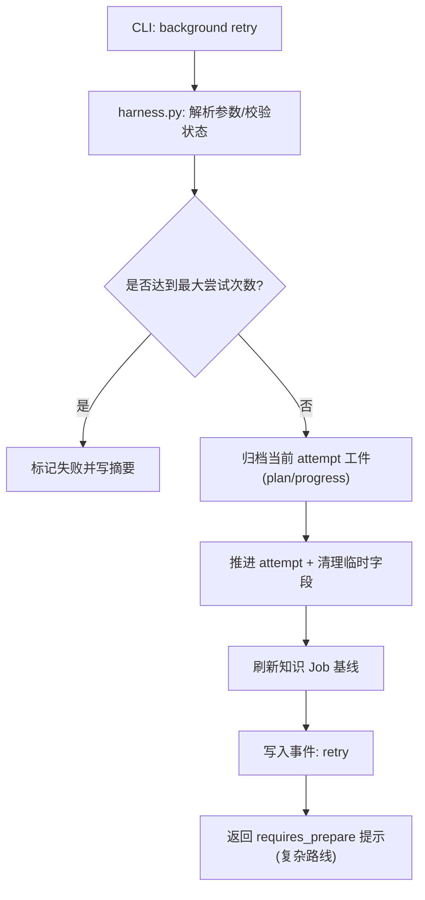
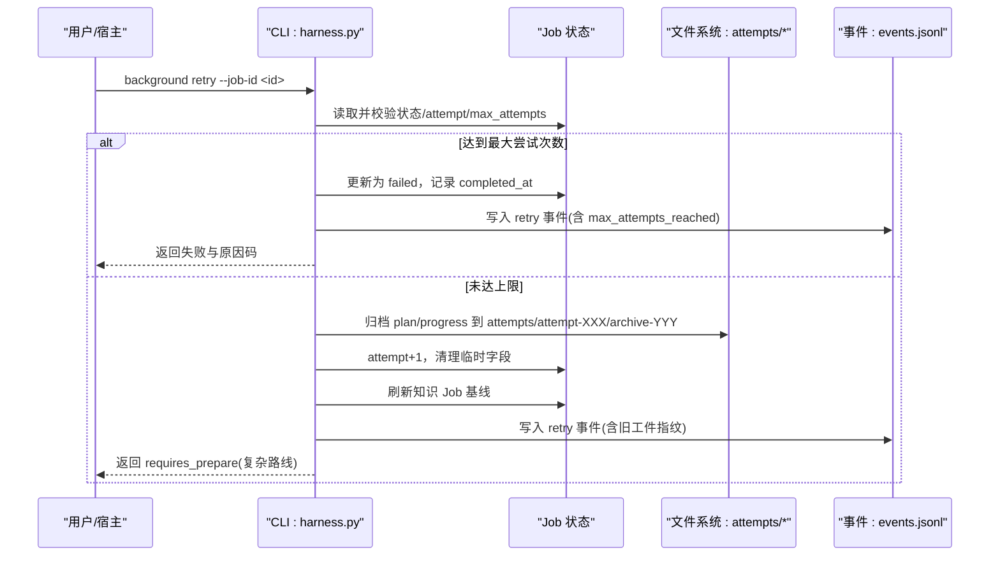
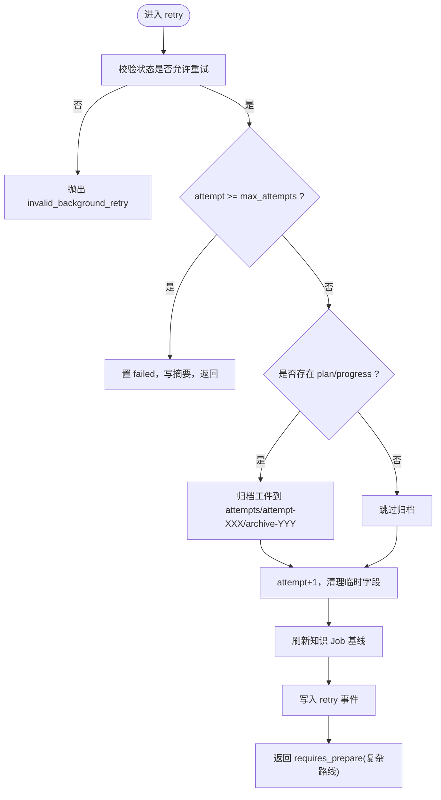
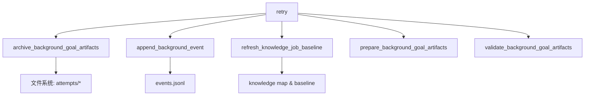

# 重试命令

<cite>
**本文引用的文件**
- [harness.py](file://scripts/harness.py)
- [test_harness.py](file://tests/test_harness.py)
- [SKILL.md](file://SKILL.md)
</cite>

## 目录
1. [简介](#简介)
2. [项目结构](#项目结构)
3. [核心组件](#核心组件)
4. [架构总览](#架构总览)
5. [详细组件分析](#详细组件分析)
6. [依赖关系分析](#依赖关系分析)
7. [性能考量](#性能考量)
8. [故障排查指南](#故障排查指南)
9. [结论](#结论)
10. [附录](#附录)

## 简介
本文件围绕 background retry 命令的重试机制进行系统化说明，覆盖以下关键点：
- 当前 attempt 工件归档、attempt 推进、准备引用清空与基线刷新
- 不生成新工件的设计原则与幂等性保证
- 后台事件记录规范（有界状态、attempt、工作包ID、原因码、指纹）
- 连续相同拒绝的幂等去重机制
- 终态摘要以 (job_id, attempt, status) 为键的组织方式
- 重试操作的注意事项与最佳实践

## 项目结构
- 控制器入口与核心逻辑集中在 scripts/harness.py，包含 background 子命令实现、工件归档、事件写入、基线刷新等。
- 行为与边界通过 tests/test_harness.py 中的用例验证，包括最大尝试次数、重试归档与摘要索引保持每个 attempt 的行为。
- SKILL.md 提供背景治理流程与 CLI 使用约定，明确 retry 会归档旧 attempt 工件并要求重新 prepare，不继承完成进度。

图表来源
- [harness.py:9012-9053](file://scripts/harness.py#L9012-L9053)
- [harness.py:8432-8458](file://scripts/harness.py#L8432-L8458)
- [harness.py:7332-7369](file://scripts/harness.py#L7332-L7369)

章节来源
- [SKILL.md:60-91](file://SKILL.md#L60-L91)
- [harness.py:98-126](file://scripts/harness.py#L98-L126)

## 核心组件
- 重试入口与状态机
  - 仅允许可重试状态或 failed 状态进入 retry；否则抛出无效重试错误。
  - 若 attempt 已达上限，直接置为 failed，记录摘要并返回。
  - 对非 direct 路线且存在 plan/progress 时，执行工件归档。
  - 推进 attempt，清理 rebase_reason_code、rebase_changed_paths、completed_at、goal_artifacts、prepared_at、legacy_goal_artifacts_accepted 等字段。
  - 刷新知识 Job 基线，确保后续 prepare/dispatch/running 前复验绑定、attempt、工作包全集与指纹。
  - 写入 retry 事件，附带旧工件指纹信息。
  - 对于复杂路线返回 requires_prepare=true，要求宿主先调用 background prepare。

- 工件归档
  - 将当前 attempt 的 plan.json 与 progress.json 拷贝到 attempts/attempt-XXX/archive-YYY 目录，并删除原文件。
  - 生成 archive.json 记录 job_id、attempt、reason_code、plan_fingerprint、progress_fingerprint。

- 基线刷新
  - 针对知识类 Job，在 retry 后刷新基线，避免后续验收误判。

- 事件记录
  - 统一通过 append_background_event 写入 events.jsonl，携带 reason_code、status、attempt、指纹等关键上下文。

章节来源
- [harness.py:9012-9053](file://scripts/harness.py#L9012-L9053)
- [harness.py:8432-8458](file://scripts/harness.py#L8432-L8458)
- [harness.py:7332-7369](file://scripts/harness.py#L7332-L7369)
- [harness.py:7554-7570](file://scripts/harness.py#L7554-L7570)

## 架构总览
下图展示 background retry 的整体交互与控制流，映射到具体源码位置。

图表来源
- [harness.py:9012-9053](file://scripts/harness.py#L9012-L9053)
- [harness.py:8432-8458](file://scripts/harness.py#L8432-L8458)
- [harness.py:7332-7369](file://scripts/harness.py#L7332-L7369)

## 详细组件分析

### 重试入口与状态机
- 可重试状态集合：needs_user_input、needs_rebase、queued_manual，以及 failed。
- 治理 Job 的特殊分支：当存在 document_route_contract 时，走重建文档路由合同的流程。
- 最大尝试次数：默认 BACKGROUND_MAX_ATTEMPTS=3，达到则直接失败。
- 工件归档条件：存在 plan.json 或 progress.json 时才归档。
- 字段清理：清理 rebase_reason_code、rebase_changed_paths、completed_at、goal_artifacts、prepared_at、legacy_goal_artifacts_accepted。
- 基线刷新：refresh_knowledge_job_baseline(target, job)。
- 事件写入：append_background_event(root, job, "retry", ...)。

图表来源
- [harness.py:9012-9053](file://scripts/harness.py#L9012-L9053)
- [harness.py:8432-8458](file://scripts/harness.py#L8432-L8458)
- [harness.py:7332-7369](file://scripts/harness.py#L7332-L7369)

章节来源
- [harness.py:9012-9053](file://scripts/harness.py#L9012-L9053)
- [harness.py:98-126](file://scripts/harness.py#L98-L126)

### 工件归档与幂等性
- 归档目标路径：attempts/attempt-{NNN}/archive-{NNN}，按序号递增创建。
- 归档内容：plan.json、progress.json 的副本，同时记录两者的指纹。
- 幂等性：
  - 重复 retry 同一 attempt 不会重复生成新工件，因为每次都会基于当前 attempt 目录归档，且后续 prepare 会校验工件完整性与绑定。
  - 若工件损坏或被篡改，仅允许显式 background prepare --repair 修复，防止静默降级。
- 设计原则：
  - 不生成新工件：retry 仅归档旧工件并推进 attempt，不产生新的业务产物，确保幂等与可审计。
  - 准备引用清空：清理 goal_artifacts、prepared_at 等，强制重新 prepare，确保后续阶段从干净状态开始。

章节来源
- [harness.py:8432-8458](file://scripts/harness.py#L8432-L8458)
- [harness.py:8461-8525](file://scripts/harness.py#L8461-L8525)
- [SKILL.md:86](file://SKILL.md#L86)

### 基线刷新与准备引用清空
- 基线刷新：refresh_knowledge_job_baseline(target, job) 用于刷新知识 Job 的基线，避免后续验收误判。
- 准备引用清空：清理 goal_artifacts、prepared_at、legacy_goal_artifacts_accepted 等字段，确保下一次 prepare 从零开始。
- 影响范围：prepare 阶段会校验工件完整性与绑定，若冲突或缺失需显式 --repair。

章节来源
- [harness.py:7332-7369](file://scripts/harness.py#L7332-L7369)
- [harness.py:9038-9043](file://scripts/harness.py#L9038-L9043)
- [harness.py:8461-8525](file://scripts/harness.py#L8461-L8525)

### 后台事件记录规范
- 事件写入：append_background_event(root, job, event, **fields)
- 关键字段：
  - 有界状态：status（如 contract_ready、dispatched、running、updated、no_change、failed、cancelled 等）
  - attempt：当前尝试编号
  - 工作包ID：work_package_id（在 progress_updated 事件中）
  - 原因码：reason_code（如 invalid_background_retry、max_attempts_reached、background_goal_artifacts_tampered 等）
  - 指纹：plan_fingerprint、progress_fingerprint（在 retry 事件中记录旧工件指纹）
- 幂等去重：
  - 连续相同拒绝（如 verify_rejected、prepare_rejected、progress_rejected）通过事件中的 reason_code 与上下文进行幂等识别，避免重复告警或处理。
  - 测试用例覆盖了“连续相同拒绝的幂等去重”场景。

章节来源
- [harness.py:7554-7570](file://scripts/harness.py#L7554-L7570)
- [harness.py:9045-9049](file://scripts/harness.py#L9045-L9049)
- [test_harness.py:2177-2186](file://tests/test_harness.py#L2177-L2186)

### 终态摘要组织
- 摘要键：以 (job_id, attempt, status) 为唯一键组织终态摘要，确保每个 attempt 的终态可追溯。
- 触发时机：当状态进入终态（updated、no_change、completed_with_finding、failed、cancelled）时，记录摘要。
- 作用：便于查询与审计，支持按 attempt 维度回溯历史。

章节来源
- [harness.py:9006-9010](file://scripts/harness.py#L9006-L9010)
- [test_harness.py:2177-2186](file://tests/test_harness.py#L2177-L2186)

### 重试操作注意事项与最佳实践
- 前置条件：
  - 仅允许可重试状态或 failed 状态进入 retry。
  - 复杂路线（background_goal、background_goal_phased）需要重新 prepare。
- 工件完整性：
  - 若工件损坏或被篡改，必须显式 background prepare --repair。
- 最大尝试次数：
  - 达到上限后自动失败，不再允许重试。
- 事件与审计：
  - 关注 retry 事件中的 reason_code 与旧工件指纹，便于定位问题。
- 幂等性：
  - 重复 retry 同一 attempt 不会重复生成工件，但会推进 attempt 并清理准备引用。
- 基线刷新：
  - 知识 Job 在 retry 后会刷新基线，确保后续验收正确。

章节来源
- [harness.py:9012-9053](file://scripts/harness.py#L9012-L9053)
- [harness.py:8432-8458](file://scripts/harness.py#L8432-L8458)
- [harness.py:7332-7369](file://scripts/harness.py#L7332-L7369)
- [SKILL.md:86](file://SKILL.md#L86)

## 依赖关系分析
- 模块耦合：
  - retry 依赖工件归档、事件写入、基线刷新等辅助函数。
  - 与 prepare、verify、progress 等命令共享工件校验与事件记录逻辑。
- 外部依赖：
  - Git 操作（如 git_preflight_contract、git_postcheck）用于环境预检与后置检查。
  - 文件系统原子写入（atomic_write_json）确保状态一致性。
- 潜在循环依赖：
  - 通过函数拆分与职责分离避免循环依赖。

图表来源
- [harness.py:9012-9053](file://scripts/harness.py#L9012-L9053)
- [harness.py:8432-8458](file://scripts/harness.py#L8432-L8458)
- [harness.py:7332-7369](file://scripts/harness.py#L7332-L7369)

章节来源
- [harness.py:9012-9053](file://scripts/harness.py#L9012-L9053)
- [harness.py:8432-8458](file://scripts/harness.py#L8432-L8458)
- [harness.py:7332-7369](file://scripts/harness.py#L7332-L7369)

## 性能考量
- 工件归档：仅复制 plan/progress，避免大对象处理，提升重试效率。
- 事件写入：追加模式写入 events.jsonl，低开销且可审计。
- 基线刷新：仅在知识 Job 上执行，减少不必要的计算。
- 幂等性：避免重复工件生成与事件冗余，降低系统负载。

[本节为通用指导，无需特定文件引用]

## 故障排查指南
- 常见错误码：
  - invalid_background_retry：状态不允许重试。
  - max_attempts_reached：达到最大尝试次数。
  - background_goal_artifacts_tampered：工件被篡改。
  - incomplete_background_work_packages：工作包未完成。
- 排查步骤：
  - 检查 events.jsonl 中的 retry 事件与 reason_code。
  - 查看 attempts/attempt-XXX/archive-YYY 下的工件指纹。
  - 确认 prepare 是否成功，必要时使用 --repair。
  - 验证 knowledge map 与基线是否刷新。

章节来源
- [harness.py:9012-9053](file://scripts/harness.py#L9012-L9053)
- [harness.py:8432-8458](file://scripts/harness.py#L8432-L8458)
- [harness.py:7554-7570](file://scripts/harness.py#L7554-L7570)

## 结论
background retry 命令通过严格的工件归档、attempt 推进、准备引用清空与基线刷新，确保了重试过程的幂等性与可审计性。结合有界状态、原因码与指纹的事件记录，以及终态摘要的规范化组织，形成了健壮的重试机制。遵循最佳实践可有效避免常见问题，提升系统稳定性。

[本节为总结，无需特定文件引用]

## 附录
- CLI 使用示例参考 SKILL.md 中的 background 子命令列表。
- 测试用例覆盖最大尝试次数、重试归档与摘要索引等行为。

章节来源
- [SKILL.md:72-82](file://SKILL.md#L72-L82)
- [test_harness.py:1922-1939](file://tests/test_harness.py#L1922-L1939)
- [test_harness.py:2177-2186](file://tests/test_harness.py#L2177-L2186)