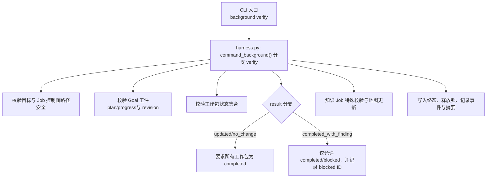
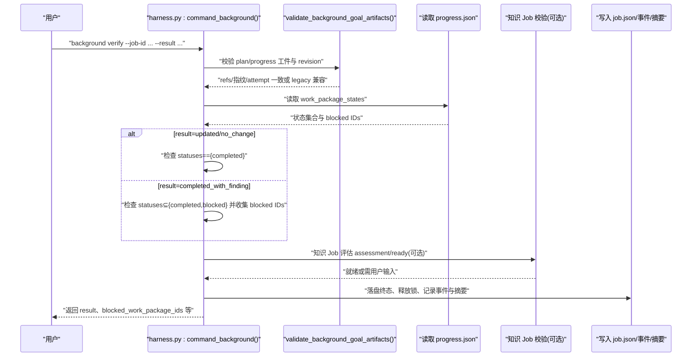
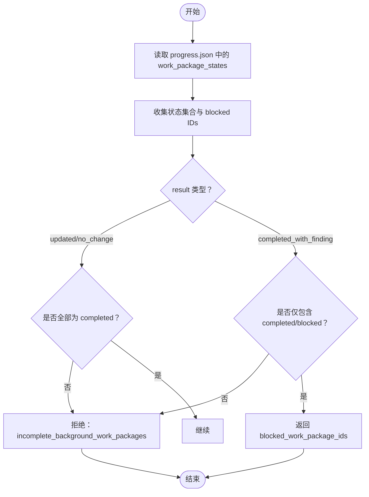
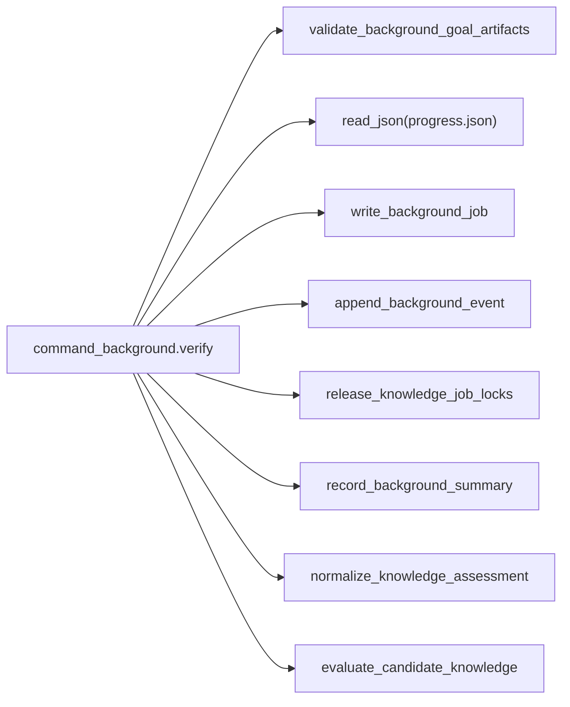

# 验证命令

<cite>
**本文引用的文件**   
- [scripts/harness.py](file://scripts/harness.py)
- [docs/contracts.md](file://docs/contracts.md)
- [SKILL.md](file://SKILL.md)
</cite>

## 目录
1. [简介](#简介)
2. [项目结构](#项目结构)
3. [核心组件](#核心组件)
4. [架构总览](#架构总览)
5. [详细组件分析](#详细组件分析)
6. [依赖关系分析](#依赖关系分析)
7. [性能考量](#性能考量)
8. [故障排查指南](#故障排查指南)
9. [结论](#结论)

## 简介
本文件围绕 background verify 命令的验收规则与行为进行系统化说明，重点覆盖：
- updated/no_change 状态下对“全部工作包 completed”的强制要求
- completed_with_finding 状态的准入条件与 blocked ID 返回逻辑
- revision 2 工件漂移失败关闭的安全机制
- 升级前已在 running 且有绑定指纹的旧工件 legacy verify 一次性支持
- retry 后必须重新 prepare 的强制要求
- 验证失败的诊断方法与解决策略

## 项目结构
- 控制面实现位于 scripts/harness.py，包含后台 Job 状态机、prepare/progress/verify/retry 等命令处理逻辑。
- 合同与验收语义在 docs/contracts.md 中定义，包括证据收据、验证命令缓存、Git 状态与交付层等。
- SKILL.md 提供高层使用说明与背景治理流程概述。

图表来源 
- [scripts/harness.py:9060-9176](file://scripts/harness.py#L9060-L9176)

章节来源
- [scripts/harness.py:8400-8599](file://scripts/harness.py#L8400-L8599)
- [docs/contracts.md:303-345](file://docs/contracts.md#L303-L345)
- [SKILL.md:60-91](file://SKILL.md#L60-L91)

## 核心组件
- 后台 Job 状态机与转换约束：确保 verify 仅在合法状态进入，且结果符合终态集合。
- Goal 工件校验：revision 2 工件完整性、attempt 一致性、指纹绑定与防篡改。
- 工作包状态聚合：统计各工作包状态，判定是否满足 result 的准入条件。
- 知识 Job 特殊路径：assessment 校验、knowledge map 更新与 ready 复算。
- 事件与摘要：记录 verify 事件、blocked 工作包、released waiting jobs 等关键信息。

章节来源
- [scripts/harness.py:8404-8416](file://scripts/harness.py#L8404-L8416)
- [scripts/harness.py:9060-9176](file://scripts/harness.py#L9060-L9176)

## 架构总览
下图展示 background verify 的关键调用链与数据流，映射到实际源码位置。

图表来源 
- [scripts/harness.py:9060-9176](file://scripts/harness.py#L9060-L9176)

## 详细组件分析

### 工作包状态验收规则
- updated/no_change：要求所有工作包状态均为 completed；否则拒绝并返回需要重试的错误码。
- completed_with_finding：仅允许工作包状态为 completed 或 blocked；若存在 blocked 工作包，需在响应中返回其 ID 列表，便于后续处置。

图表来源 
- [scripts/harness.py:9065-9068](file://scripts/harness.py#L9065-L9068)

章节来源
- [scripts/harness.py:9060-9070](file://scripts/harness.py#L9060-L9070)

### completed_with_finding 的阻断与 blocked ID 返回
- 当 result=completed_with_finding 时，控制器会：
  - 校验是否存在未终结的工作包（非 completed/blocked），若有则拒绝。
  - 收集 blocked 工作包的 ID 并在响应中返回，供宿主进行后续处理。
- 该逻辑确保重大发现场景下，阻塞项被显式暴露，避免误报完成。

章节来源
- [scripts/harness.py:9067-9068](file://scripts/harness.py#L9067-L9068)
- [scripts/harness.py:9118-9126](file://scripts/harness.py#L9118-L9126)

### revision 2 工件漂移失败关闭
- 对于 revision 2 工件（plan/progress），控制器严格校验：
  - artifact_revision 与 attempt 一致性
  - plan_fingerprint/progress_fingerprint 与当前文件指纹一致
- 若检测到工件漂移或被篡改，将直接拒绝 verify 并返回错误码，防止不安全状态推进。

章节来源
- [scripts/harness.py:9060-9094](file://scripts/harness.py#L9060-L9094)

### 旧工件 legacy verify 一次性支持
- 若 Job 的 goal_artifacts 为 v1 或未设置 artifact_revision，且 attempt 与当前 attempt 一致，则允许一次 legacy verify。
- 若 plan/progress 指纹与记录不一致，视为篡改，拒绝 verify。
- 接受 legacy 工件后，控制器标记 legacy_goal_artifacts_accepted=true，并记录事件。

章节来源
- [scripts/harness.py:9071-9096](file://scripts/harness.py#L9071-L9096)

### retry 后必须重新 prepare
- retry 操作会归档当前 attempt 工件、推进 attempt、清空准备引用并刷新基线。
- 因此 retry 之后，必须先执行 background prepare 生成新的 plan/progress 工件，才能继续 dispatch/running/verify。

章节来源
- [SKILL.md:86](file://SKILL.md#L86)
- [scripts/harness.py:8432-8458](file://scripts/harness.py#L8432-L8458)

### 知识 Job 的特殊路径
- 当 result=updated 且 task_kind 属于 knowledge_* 时，必须提供 assessment，并校验其 status=ready。
- 控制器会复算 candidate_knowledge 状态，若不 ready，则置 needs_user_input 并返回 gaps。
- 通过后，更新 knowledge-map.json 并记录 fingerprint。

章节来源
- [scripts/harness.py:9127-9157](file://scripts/harness.py#L9127-L9157)

### 最终落盘与事件记录
- verify 成功后，控制器会：
  - 写入 job.json 的终态与时间戳
  - 释放知识 Job 锁
  - 追加 verify 事件
  - 记录背景摘要（包含 blocked_work_package_ids、released_waiting_jobs 等）

章节来源
- [scripts/harness.py:9158-9175](file://scripts/harness.py#L9158-L9175)

## 依赖关系分析
- command_background.verify 依赖：
  - validate_background_goal_artifacts：校验工件与指纹
  - read_json：读取 progress.json
  - write_background_job：落盘 job.json
  - append_background_event：追加事件
  - release_knowledge_job_locks：释放锁
  - record_background_summary：记录摘要
  - evaluate_candidate_knowledge/normalize_knowledge_assessment：知识 Job 专用

图表来源 
- [scripts/harness.py:9060-9176](file://scripts/harness.py#L9060-L9176)

章节来源
- [scripts/harness.py:9060-9176](file://scripts/harness.py#L9060-L9176)

## 性能考量
- 验证过程以 JSON 读取/写入为主，复杂度受工作包数量线性影响。
- 指纹计算基于文件内容哈希，避免重复执行已通过缓存的命令（见 contracts 关于 verification-command-receipt 的缓存）。
- 建议批量处理 large work packages 以减少 IO 次数。

[本节为通用指导，不直接分析具体文件]

## 故障排查指南
常见错误与处理建议：
- incomplete_background_work_packages
  - 现象：updated/no_change 但并非全部工作包 completed；或 completed_with_finding 存在非 completed/blocked 的工作包。
  - 处理：补齐工作包进度至 completed，或修正 blocked 原因后重新 verify。
- background_goal_artifacts_tampered
  - 现象：plan/progress 指纹与记录不一致。
  - 处理：恢复工件或使用 --repair 重新 prepare 后再继续。
- invalid_background_progress_transition
  - 现象：工作包状态倒退或跳过执行。
  - 处理：按允许的状态转换序列推进（pending→in_progress→completed/blocked）。
- knowledge_no_change_without_ready_knowledge / candidate_knowledge_not_ready
  - 现象：知识 Job 的 no_change 或 updated 未满足 ready。
  - 处理：完善知识评估与知识地图，使状态达到 ready。

章节来源
- [scripts/harness.py:9065-9094](file://scripts/harness.py#L9065-L9094)
- [scripts/harness.py:9127-9157](file://scripts/harness.py#L9127-L9157)

## 结论
background verify 通过严格的工件校验与工作包状态聚合，确保后台治理的可审计性与安全性。revision 2 工件防篡改、legacy 一次性兼容、retry 后强制 prepare 以及知识 Job 的 ready 复算共同构成稳健的验收闭环。遇到验证失败时，依据错误码定位问题根因并按建议修复，可高效恢复流程。