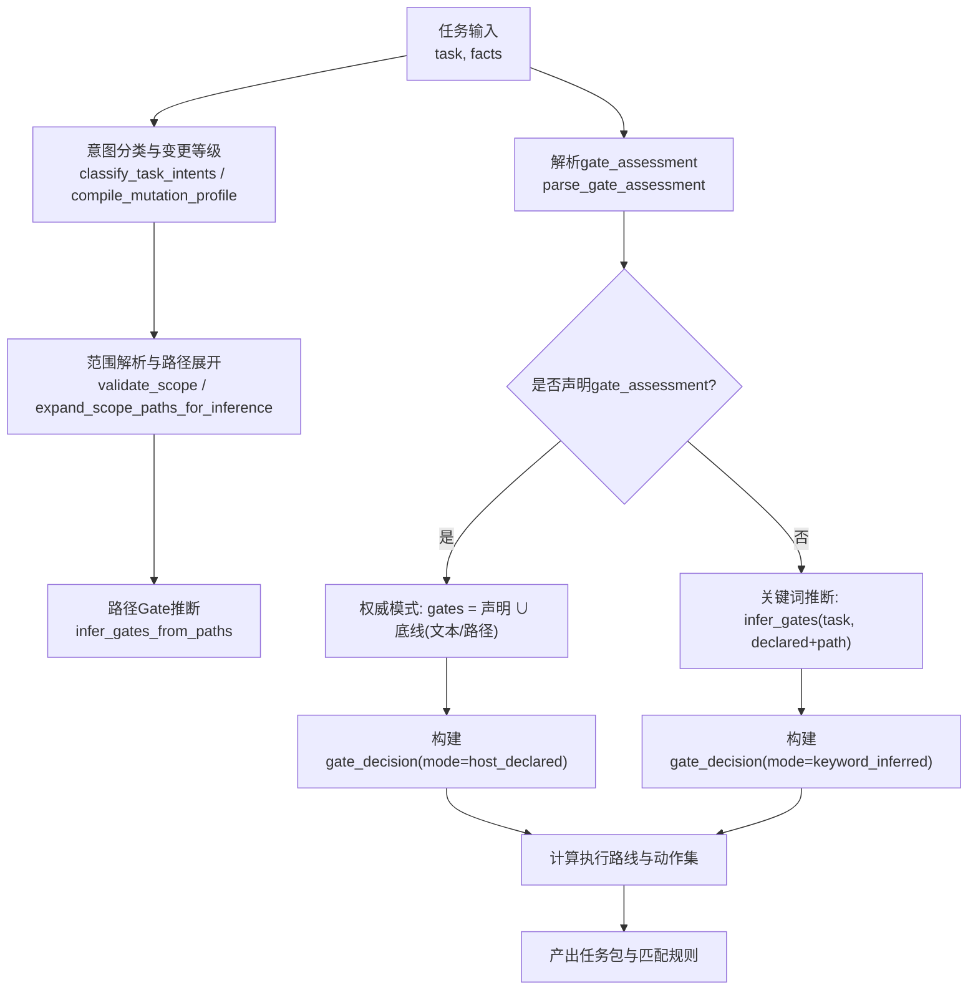
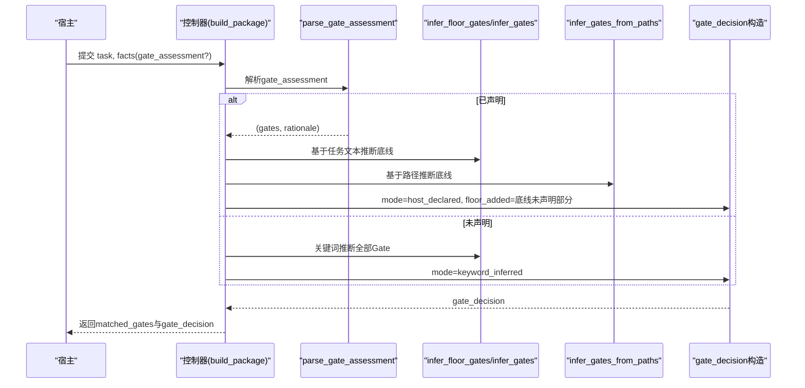
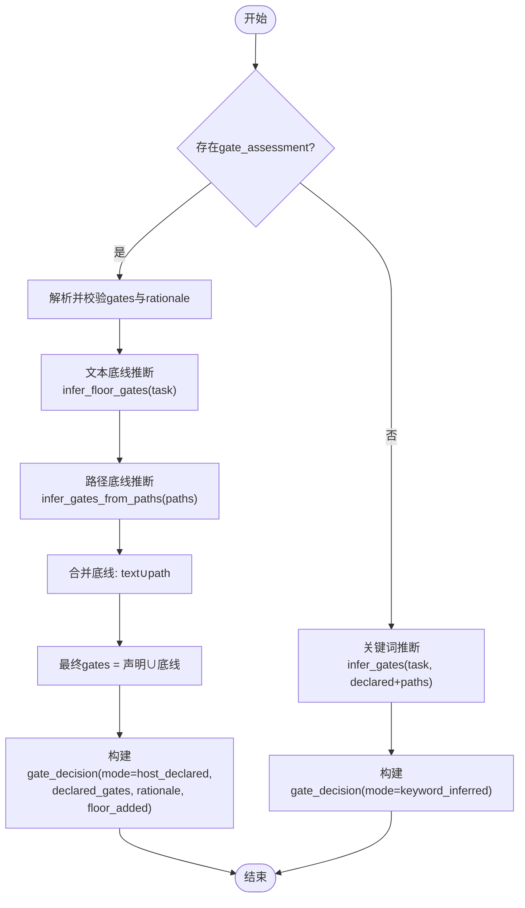
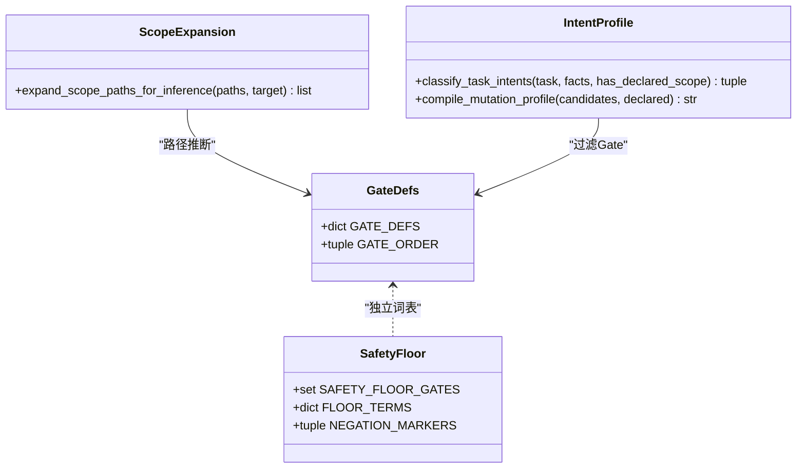
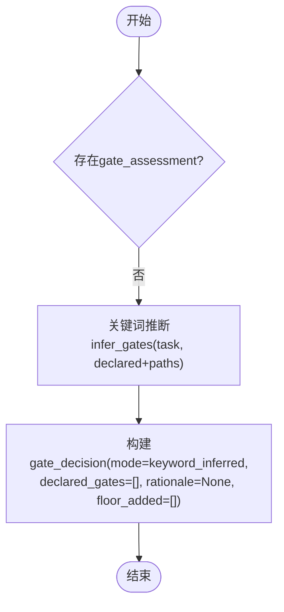

# Gate决策引擎

<cite>
**本文引用的文件**
- [harness.py](file://scripts/harness.py)
- [test_harness.py](file://tests/test_harness.py)
- [SKILL.md](file://SKILL.md)
- [INDEX.md](file://harness-home/rules/INDEX.md)
</cite>

## 更新摘要
**已进行的变更**
- 更新了gate_assessment权威声明机制的实现细节
- 增强了安全底线Gate的强制并入机制说明
- 完善了gate_decision对象的完整结构描述
- 添加了详细的配置示例和决策流程图
- 强化了关键词推断回退逻辑的解释

## 目录
1. [简介](#简介)
2. [项目结构](#项目结构)
3. [核心组件](#核心组件)
4. [架构总览](#架构总览)
5. [详细组件分析](#详细组件分析)
6. [依赖关系分析](#依赖关系分析)
7. [性能考量](#性能考量)
8. [故障排查指南](#故障排查指南)
9. [结论](#结论)
10. [附录：配置示例与流程图](#附录配置示例与流程图)

## 简介
本文件面向Docs Harness的Gate决策引擎，系统化阐述gate_assessment声明机制、安全底线Gate强制并入逻辑、关键词推断回退策略，以及gate_decision对象的结构与作用。目标是帮助开发者理解"宿主权威声明 + 代码强制兜底"的双轨评估流程，确保高风险操作（安全敏感、破坏性数据、对外发布）始终受控。

## 项目结构
- 控制器主程序位于 scripts/harness.py，集中实现Gate定义、推断、评估与决策输出。
- 测试用例位于 tests/test_harness.py，覆盖权威声明、底线强制、关键词回退等关键路径。
- 技能说明 SKILL.md 对任务入口、事实提交、证据与验收进行高层描述，强调 gate_assessment 的必要性。
- 规则索引 harness-home/rules/INDEX.md 描述规则加载与生效条件，Gate与规则联动决定准入与执行路线。



**图表来源**
- [harness.py:2779-3049](file://scripts/harness.py#L2779-L3049)
- [harness.py:2411-2452](file://scripts/harness.py#L2411-L2452)
- [harness.py:2762-2776](file://scripts/harness.py#L2762-L2776)

**章节来源**
- [SKILL.md:25-44](file://SKILL.md#L25-L44)
- [INDEX.md:1-41](file://harness-home/rules/INDEX.md#L1-L41)

## 核心组件
- Gate定义与顺序：GATE_DEFS 与 GATE_ORDER 定义了所有Gate及其术语、事实引用、计划字段、证据类型与执行顺序。
- 安全底线集合：SAFETY_FLOOR_GATES 固定为 security-sensitive、destructive-data、release-external，不可移除。
- 底线词表与否定守卫：FLOOR_TERMS 与 NEGATION_MARKERS 用于精确触发底线Gate并抑制误报。
- 权威声明解析：parse_gate_assessment 校验 gates 数组与 rationale 字段，拒绝未知Gate与无效rationale。
- 关键词推断：infer_gates 基于任务文本与已声明gates进行宽泛匹配；infer_gates_from_paths 基于路径特征推断。
- 决策构建：build_package 中根据是否声明gate_assessment选择权威或推断模式，生成 gate_decision 对象。

**章节来源**
- [harness.py:263-345](file://scripts/harness.py#L263-L345)
- [harness.py:385-392](file://scripts/harness.py#L385-L392)
- [harness.py:2762-2776](file://scripts/harness.py#L2762-L2776)
- [harness.py:2411-2452](file://scripts/harness.py#L2411-L2452)
- [harness.py:2859-2891](file://scripts/harness.py#L2859-L2891)

## 架构总览
Gate决策引擎在任务构建阶段完成Gate判定，形成最终 matched_gates 与 gate_decision，驱动后续规则匹配、知识上下文装载、验证命令与执行路线选择。



**图表来源**
- [harness.py:2779-3049](file://scripts/harness.py#L2779-L3049)
- [harness.py:2315-2317](file://scripts/harness.py#L2315-L2317)
- [harness.py:2411-2452](file://scripts/harness.py#L2411-L2452)

## 详细组件分析

### gate_assessment声明机制与权威语义
- **gates数组**：必须为字符串数组，元素需属于GATE_DEFS定义的Gate集合；否则抛出 invalid_gate。
- **rationale字段**：必须为非空字符串且长度不超过500字符；缺失或超长将导致 invalid_gate_assessment。
- **权威语义**：一旦提供gate_assessment，控制器以声明为准，不再叠加非安全类的关键词推断Gate，避免简单任务被拖入重流程。
- **解析验证**：parse_gate_assessment函数负责完整的格式校验和语义验证。

**章节来源**
- [harness.py:2762-2776](file://scripts/harness.py#L2762-L2776)
- [harness.py:2859-2891](file://scripts/harness.py#L2859-L2891)
- [SKILL.md:41-44](file://SKILL.md#L41-L44)

### 安全底线Gate的强制并入机制
- **安全底线集合**：security-sensitive、destructive-data、release-external 由代码强制保障，宿主声明不可豁免。
- **文本触发**：使用FLOOR_TERMS精确词表与NEGATION_MARKERS否定守卫，仅当明确表达时才命中，避免误报。
- **路径触发**：若write/read scope包含安全相关路径（如auth、security），则自动并入security-sensitive。
- **floor_added记录**：未被声明但由文本或路径触发的底线Gate会记录到floor_added，便于审计与回溯。
- **精确匹配**：infer_floor_gates函数使用专用词表而非宽泛的GATE_DEFS术语，确保确定性触发。

**章节来源**
- [harness.py:385-392](file://scripts/harness.py#L385-L392)
- [harness.py:2315-2317](file://scripts/harness.py#L2315-L2317)
- [harness.py:2427-2452](file://scripts/harness.py#L2427-L2452)
- [harness.py:2859-2891](file://scripts/harness.py#L2859-L2891)

### 关键词推断回退逻辑
- **触发条件**：当未提供gate_assessment时，控制器回退到关键词推断。
- **文本匹配**：基于任务文本的宽泛术语匹配（GATE_DEFS.terms）。
- **路径推断**：基于路径特征的启发式推断（文档、前端、测试、代码、架构契约等）。
- **过滤机制**：根据mutation_profile过滤不相关Gate（如read_only下排除code-edit/document-edit）。
- **决策模式**：该模式生成的gate_decision.mode为keyword_inferred，declared_gates为空，rationale为None，floor_added为空。

**章节来源**
- [harness.py:2411-2452](file://scripts/harness.py#L2411-L2452)
- [harness.py:2885-2891](file://scripts/harness.py#L2885-L2891)

### gate_decision对象的完整结构
- **mode**：标识决策来源，host_declared表示宿主权威声明，keyword_inferred表示关键词推断。
- **declared_gates**：宿主通过gate_assessment.gates声明的Gate列表（权威模式下有效）。
- **rationale**：宿主提供的理由摘要（权威模式下必填，限制长度与格式）。
- **floor_added**：由代码强制并入的安全底线Gate列表（文本或路径触发但未声明的部分）。

**章节来源**
- [harness.py:2879-2891](file://scripts/harness.py#L2879-L2891)

### 决策流程图（权威模式）


**图表来源**
- [harness.py:2779-3049](file://scripts/harness.py#L2779-L3049)
- [harness.py:2315-2317](file://scripts/harness.py#L2315-L2317)
- [harness.py:2411-2452](file://scripts/harness.py#L2411-L2452)

## 依赖关系分析
- **Gate定义依赖**：GATE_DEFS与GATE_ORDER共同决定术语匹配、事实引用、计划字段、证据类型与排序。
- **安全底线依赖**：SAFETY_FLOOR_GATES与FLOOR_TERMS解耦于宽泛术语，确保确定性触发。
- **范围与路径依赖**：expand_scope_paths_for_inference将目录型scope展开为文件级路径，供路径Gate推断使用。
- **意图与变更等级依赖**：classify_task_intents与compile_mutation_profile影响Gate过滤（如read_only排除编辑类Gate）。



**图表来源**
- [harness.py:263-345](file://scripts/harness.py#L263-L345)
- [harness.py:385-392](file://scripts/harness.py#L385-L392)
- [harness.py:2455-2476](file://scripts/harness.py#L2455-L2476)
- [harness.py:2320-2408](file://scripts/harness.py#L2320-L2408)

**章节来源**
- [harness.py:2455-2476](file://scripts/harness.py#L2455-L2476)
- [harness.py:2320-2408](file://scripts/harness.py#L2320-L2408)

## 性能考量
- **路径展开有界**：expand_scope_paths_for_inference限制最大展开文件数，避免巨型目录扫描。
- **关键词匹配优化**：短语匹配与否定守卫采用正则与大小写归一化，减少误判开销。
- **权威模式短路**：一旦声明gate_assessment，跳过宽泛关键词推断，降低不必要的匹配成本。
- **精确底线触发**：使用专用词表而非通用术语匹配，提高准确性并减少误报。

## 故障排查指南
- **未知Gate错误**：当gates数组包含不在GATE_DEFS中的值时，抛出invalid_gate。检查gate_assessment.gates或legacy gates字段。
- **无效rationale**：缺失、非字符串或超过500字符将触发invalid_gate_assessment。确保提供简洁明确的理由。
- **底线误报**：若因文本触发底线Gate但不期望，检查是否包含否定标记（如"不要部署"），必要时调整任务表述。
- **路径误触发**：若write/read scope包含安全相关路径导致security-sensitive，确认scope是否过宽。
- **权威模式失效**：如果声明了gate_assessment但仍出现关键词推断的Gate，检查gates数组格式是否正确。

**章节来源**
- [harness.py:2762-2776](file://scripts/harness.py#L2762-L2776)
- [harness.py:2315-2317](file://scripts/harness.py#L2315-L2317)
- [test_harness.py:5690-5707](file://tests/test_harness.py#L5690-L5707)

## 结论
Docs Harness的Gate决策引擎通过"宿主权威声明 + 代码强制底线"双轨机制，既尊重宿主的业务判断，又确保安全风险不可绕过。gate_assessment的严谨校验与rationale的必要性保障了可审计性与可追溯性；关键词推断回退为无声明场景提供合理默认。开发者应优先使用gate_assessment明确风险边界，并在必要时依赖floor_added了解系统强制并入的底线Gate。

## 附录：配置示例与流程图

### 配置示例（权威模式）
- **目标**：修复单文件空指针并补测试，不涉及接口契约、安全与发布。
- **事实提交**：
  ```json
  {
    "allowed_scope": ["src/**"],
    "gate_assessment": {
      "gates": ["code-edit"],
      "rationale": "单文件空指针修复，不涉及接口契约、安全与发布"
    }
  }
  ```
- **预期结果**：
  - matched_gates: ["code-edit"]
  - gate_decision.mode: "host_declared"
  - gate_decision.declared_gates: ["code-edit"]
  - gate_decision.rationale: "单文件空指针修复，不涉及接口契约、安全与发布"
  - gate_decision.floor_added: []

**章节来源**
- [test_harness.py:5629-5648](file://tests/test_harness.py#L5629-L5648)

### 配置示例（底线强制并入）
- **目标**：修复缓存逻辑并推送到远端。
- **事实提交**：
  ```json
  {
    "allowed_scope": ["src/**"],
    "gate_assessment": {
      "gates": ["code-edit"],
      "rationale": "修复缓存逻辑，但任务包含远端推送"
    }
  }
  ```
- **预期结果**：
  - matched_gates: ["code-edit", "release-external"]
  - gate_decision.floor_added: ["release-external"]

**章节来源**
- [test_harness.py:5650-5668](file://tests/test_harness.py#L5650-L5668)

### 配置示例（路径触发底线）
- **目标**：调整登录页展示逻辑。
- **事实提交**：
  ```json
  {
    "write_scope": ["src/auth/**"],
    "gate_assessment": {
      "gates": ["code-edit"],
      "rationale": "调整登录页展示逻辑"
    }
  }
  ```
- **预期结果**：
  - matched_gates: ["code-edit", "security-sensitive"]
  - gate_decision.floor_added: ["security-sensitive"]

**章节来源**
- [test_harness.py:5670-5688](file://tests/test_harness.py#L5670-L5688)

### 配置示例（关键词推断回退）
- **目标**：实现接口的缓存逻辑。
- **事实提交**：
  ```json
  {
    "allowed_scope": ["src/**"]
  }
  ```
  （不提供gate_assessment）
- **预期结果**：
  - matched_gates: ["architecture-contract", "code-edit"]
  - gate_decision.mode: "keyword_inferred"

**章节来源**
- [test_harness.py:5709-5718](file://tests/test_harness.py#L5709-L5718)

### 决策流程图（无声明回退）


**图表来源**
- [harness.py:2885-2891](file://scripts/harness.py#L2885-L2891)