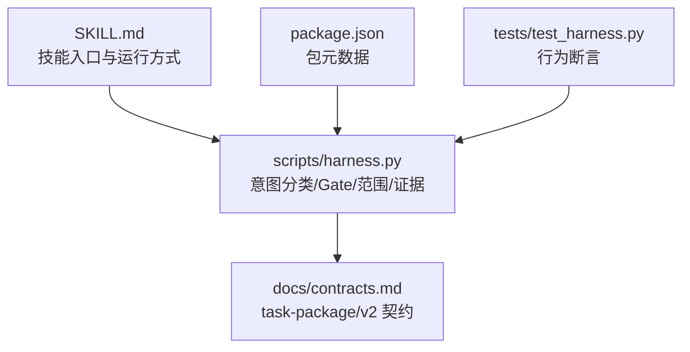
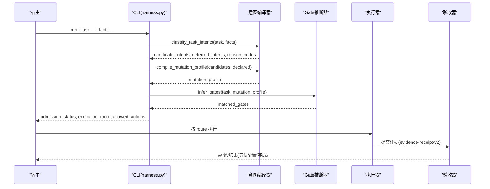
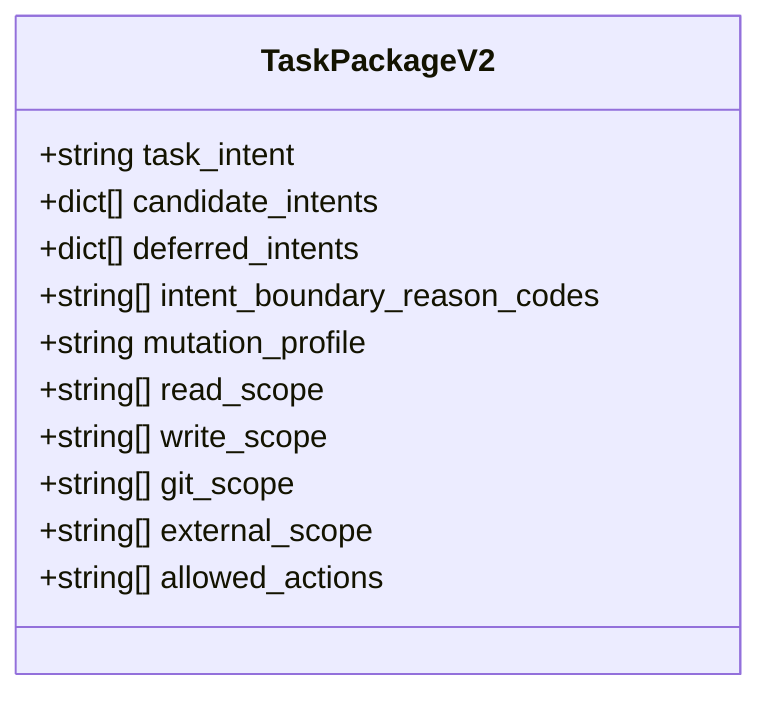
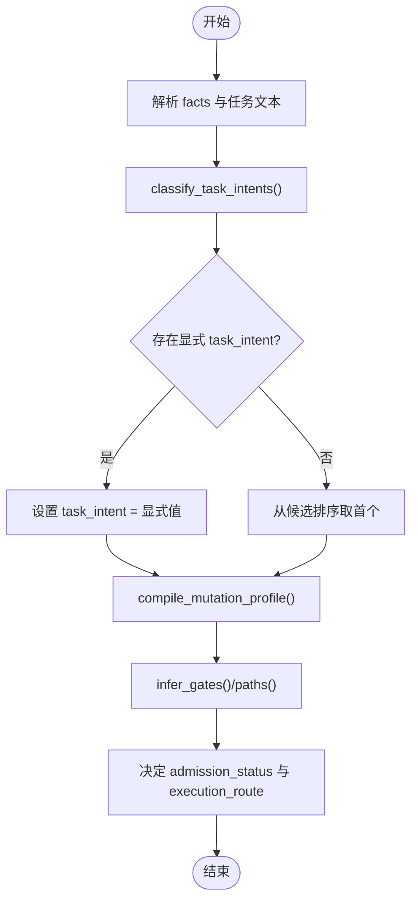
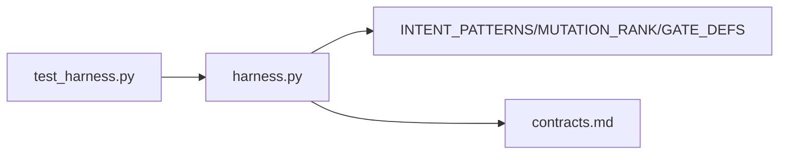

# 任务包v2规范

<cite>
**本文引用的文件**   
- [SKILL.md](file://SKILL.md)
- [package.json](file://package.json)
- [contracts.md](file://docs/contracts.md)
- [harness.py](file://scripts/harness.py)
- [test_harness.py](file://tests/test_harness.py)
</cite>

## 目录
1. [简介](#简介)
2. [项目结构](#项目结构)
3. [核心组件](#核心组件)
4. [架构总览](#架构总览)
5. [详细组件分析](#详细组件分析)
6. [依赖关系分析](#依赖关系分析)
7. [性能考量](#性能考量)
8. [故障排查指南](#故障排查指南)
9. [结论](#结论)
10. [附录](#附录)

## 简介
本规范面向 Docs Harness 的“任务包 v2”（task-package/v2），系统化阐述其数据结构、意图分类与路由策略、混合意图处理规则、Gate 判定与风险边界、以及证据与验收流程。文档同时给出受控意图类型的默认变更面与路由策略对比，解释 allowed_actions 字段与 mutation_profile 的关系，并提供标准 JSON 配置示例与最佳实践建议，帮助宿主与控制器在准入、执行与验收阶段保持一致语义与可审计性。

## 项目结构
Docs Harness 以 Python CLI 为核心，配合合同与规则文档共同定义行为：
- scripts/harness.py：实现任务意图分类、Gate 推断、范围校验、证据与验收等核心逻辑
- docs/contracts.md：对外契约与 task-package/v2 完整规范说明
- SKILL.md：技能入口、运行方式、后台治理与质量账本等高层说明
- package.json：包元数据与脚本入口
- tests/test_harness.py：覆盖关键路径的行为断言，用于验证意图分类、Git 操作与验收流程

**图表来源** 
- [harness.py](file://scripts/harness.py)
- [contracts.md](file://docs/contracts.md)
- [SKILL.md](file://SKILL.md)
- [package.json](file://package.json)
- [test_harness.py](file://tests/test_harness.py)

**章节来源**
- [SKILL.md](file://SKILL.md)
- [package.json](file://package.json)
- [contracts.md](file://docs/contracts.md)

## 核心组件
- 任务包 schema：docs-harness/task-package/v2
- 受控意图类型：query、audit、git_inspect、git_fetch、git_sync、modify、external_write
- 变更面（mutation_profile）：read_only、git_metadata_write、workspace_write、external_write
- Gate 体系：product-change、architecture-contract、security-sensitive、destructive-data、release-external、frontend-design、diagnosis-fix、testing-acceptance、review-audit、code-edit、document-edit
- 证据与验收：evidence-receipt/v2、verification-command-receipt/v1、completion-manifest/v1
- Git 状态合同：git_state_snapshot、git_sync_landed_scope
- 工作区漂移归因：task_write_set、read_set、concurrent_drift、unattributed_drift

**章节来源**
- [contracts.md](file://docs/contracts.md)
- [harness.py](file://scripts/harness.py)

## 架构总览
任务包 v2 的端到端流程如下：
- 输入：原始任务文本 + facts（含 task_intent、candidate_intents、deferred_intents、intent_boundary_reason_codes、allowed_actions、gate_assessment 等）
- 编译：classify_task_intents 生成候选意图与延迟意图；compile_mutation_profile 确定最高变更面；infer_gates/infer_gates_from_paths 推导 Gate
- 准入：根据 mutation_profile、scope、Gate 决定 admission_status 与 execution_route
- 执行：按 route 执行（direct/planned/extended/background_*），产出证据与交付物
- 验收：verify 基于 completion-manifest 与 evidence-receipt/v2 进行五级处置

**图表来源** 
- [harness.py](file://scripts/harness.py)
- [contracts.md](file://docs/contracts.md)

**章节来源**
- [contracts.md](file://docs/contracts.md)
- [harness.py](file://scripts/harness.py)

## 详细组件分析

### 任务包 v2 数据结构
- task_intent：当前任务主意图（受控意图之一）
- candidate_intents：候选意图数组，每项包含 intent 与 mutation_profile
- deferred_intents：未来子句或已完成动作的意图集合，仅作为上下文
- intent_boundary_reason_codes：边界原因码（如 future_clause_deferred、completed_action_is_context）
- mutation_profile：最终变更面（由候选意图与显式声明取最高）
- read_scope/write_scope/git_scope/external_scope：读写与 Git/外部作用域
- allowed_actions：允许的动作集合（由意图与 mutation_profile 推导）

**图表来源** 
- [contracts.md](file://docs/contracts.md)
- [harness.py](file://scripts/harness.py)

**章节来源**
- [contracts.md](file://docs/contracts.md)
- [harness.py](file://scripts/harness.py)

### 受控意图类型：默认变更面与路由策略
| 意图 | 默认变更面 | 默认路线 | 行为差异要点 |
|---|---|---|---|
| query | read_only | direct | 只读查询，不要求写范围，直接执行 |
| audit | read_only | direct（高风险可升级） | 审查/评审类，可能触发 review-audit 等 Gate |
| git_inspect | read_only | direct | 只读查看 Git 历史/状态，无需逐文件写入范围 |
| git_fetch | git_metadata_write | direct | 仅允许声明远端 refs/objects 变化，HEAD/索引/工作区不变 |
| git_sync | workspace_write | planned | 绑定预检 OID，自动生成新增/修改/删除/重命名范围，需方案 |
| modify | workspace_write | 按 Gate 决定 | 代码/文档编辑，Gate 决定是否需要计划或扩展路线 |
| external_write | external_write | 至少 planned | 发布/上线/推送等外部写入，至少需要计划与授权 |

**章节来源**
- [contracts.md](file://docs/contracts.md)
- [harness.py](file://scripts/harness.py)

### 混合意图处理规则与最终意图选择算法
- 保留策略：全部 candidate_intents 保留，未来子句进入 deferred_intents，完成体仅作为审查上下文
- 最终意图选择：task_intent 优先来自显式 facts.task_intent；否则从候选中按顺序选择首个；若为空则按 has_declared_scope 回退为 modify 或 query
- 变更面编译：从候选意图的 mutation_profile 与显式声明中取最高者（MUTATION_RANK）
- Gate 编译：结合任务文本、路径与 mutation_profile 推断，安全底线 Gate 强制并入

**图表来源** 
- [harness.py](file://scripts/harness.py)

**章节来源**
- [harness.py](file://scripts/harness.py)
- [contracts.md](file://docs/contracts.md)

### allowed_actions 与 mutation_profile 的关系
- allowed_actions 由意图与 mutation_profile 推导，例如：
  - read_only 通常允许 ["read"]
  - git_metadata_write 允许 ["git_fetch"]
  - workspace_write 允许 ["git_inspect", "git_sync"] 等
  - external_write 允许 ["external_write"]
- 测试用例覆盖了不同意图下的 allowed_actions 推导结果

**章节来源**
- [harness.py](file://scripts/harness.py)
- [test_harness.py](file://tests/test_harness.py)

### Gate 判定与安全底线
- 安全底线 Gate：security-sensitive、destructive-data、release-external 由控制器按任务文本与路径确定性强制并入，宿主只能加不能减
- 宿主可通过 gate_assessment 提供权威语义判断，跳过非安全 Gate 的关键词与 scope 路径推断
- 未声明时回退关键词推断（mode=keyword_inferred）

**章节来源**
- [contracts.md](file://docs/contracts.md)
- [harness.py](file://scripts/harness.py)

### Git 状态合同与漂移处理
- git_state_snapshot 绑定 repo_identity、remote、preflight_target_oid、head、index_tree、worktree_fingerprint、controlled_refs_namespace、lfs_available、submodule_available、git_sync_scope
- git_fetch：仅允许声明远端 refs/objects 变化
- git_sync：绑定单一预检 OID，自动生成变更范围；远端漂移重新准入时，pull 已落盘文件记入 git_sync_landed_scope 并自动归因

**章节来源**
- [contracts.md](file://docs/contracts.md)
- [harness.py](file://scripts/harness.py)

### 工作区漂移归因与验收处置
- 输出：task_write_set、read_set、concurrent_drift、unattributed_drift
- 阻断规则：超出 write_scope、读取事实漂移、重叠高风险边界等
- 五级处置：provide_evidence、refresh_evidence、retry_verification、incremental_admission、full_readmission

**章节来源**
- [contracts.md](file://docs/contracts.md)
- [harness.py](file://scripts/harness.py)

### 证据与验收
- evidence-receipt/v2：必填绑定字段包括 task_id、target_identity、package_fingerprint、producer、command_argv_digest、cwd、时间戳、ttl、exit_code、digests、read_set、write_set
- verification-command-receipt/v1：命令级收据，支持缓存复用
- completion-manifest/v1：收尾真源，固定 required_evidence_types、required_receipts、conditional_reviews/evidence、verification_commands、completion_blockers、completion_protocol

**章节来源**
- [contracts.md](file://docs/contracts.md)
- [harness.py](file://scripts/harness.py)

## 依赖关系分析
- harness.py 依赖 INTENT_PATTERNS、INTENT_MUTATION、MUTATION_RANK、GATE_DEFS、DELIVERY_READ_ONLY_INTENTS 等常量
- contracts.md 定义 task-package/v2、git_state_snapshot、evidence-receipt/v2 等契约
- test_harness.py 覆盖意图分类、Git 操作、验收流程等行为断言

**图表来源** 
- [harness.py](file://scripts/harness.py)
- [contracts.md](file://docs/contracts.md)
- [test_harness.py](file://tests/test_harness.py)

**章节来源**
- [harness.py](file://scripts/harness.py)
- [contracts.md](file://docs/contracts.md)
- [test_harness.py](file://tests/test_harness.py)

## 性能考量
- 意图分类与 Gate 推断为 O(n) 字符串匹配，避免巨型目录展开（限制 200 文件）
- 证据收据缓存与命令缓存减少重复执行
- 知识 bootstrap 与增量 Job 等待机制避免阻塞

[本节为通用指导，不直接分析具体文件]

## 故障排查指南
- 常见错误码：
  - invalid_task_intent：candidate_intents 非数组或未知意图
  - invalid_mutation_profile：mutation_profile 无效
  - invalid_gate：未知 Gate
  - invalid_scope_description：自然语言约束伪装成路径
- 调试步骤：
  - 检查 facts 中的 task_intent/candidate_intents/gate_assessment
  - 确认 write_scope/git_scope 合法且不过界
  - 查看 verify 返回的五级处置原因码

**章节来源**
- [harness.py](file://scripts/harness.py)
- [contracts.md](file://docs/contracts.md)

## 结论
任务包 v2 通过结构化意图、变更面与 Gate 体系，实现了意图优先、证据可复用且失败关闭的控制流。宿主只需提供最小 facts，控制器即可自动推导路由、授权与验收要求，确保一致性与可审计性。

[本节为总结，不直接分析具体文件]

## 附录

### 标准 JSON 配置示例（task-package/v2）
以下为各意图类型的标准定义格式参考（字段名与取值遵循契约）：
- query：read_only 变更面，direct 路线，allowed_actions=["read"]
- audit：read_only 变更面，direct 路线，可能触发 review-audit Gate
- git_inspect：read_only 变更面，direct 路线，allowed_actions 包含 git_inspect
- git_fetch：git_metadata_write 变更面，direct 路线，allowed_actions 包含 git_fetch
- git_sync：workspace_write 变更面，planned 路线，需方案与预检 OID
- modify：workspace_write 变更面，按 Gate 决定路线
- external_write：external_write 变更面，至少 planned 路线，需授权

最佳实践：
- 显式声明 task_intent 与 candidate_intents，避免歧义
- 使用 gate_assessment 提供权威 Gate 判断，减少误判
- 合理划分 read_scope/write_scope/git_scope，避免越界
- 使用 evidence-declaration/v1 简化证据提交，控制器代铸 v2 收据

**章节来源**
- [contracts.md](file://docs/contracts.md)
- [harness.py](file://scripts/harness.py)