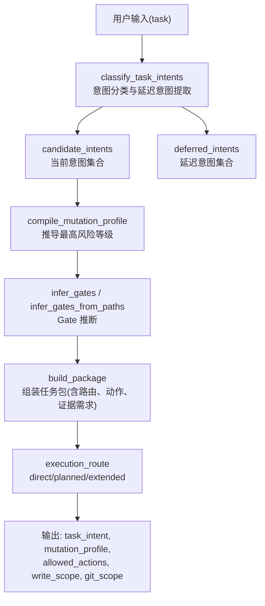
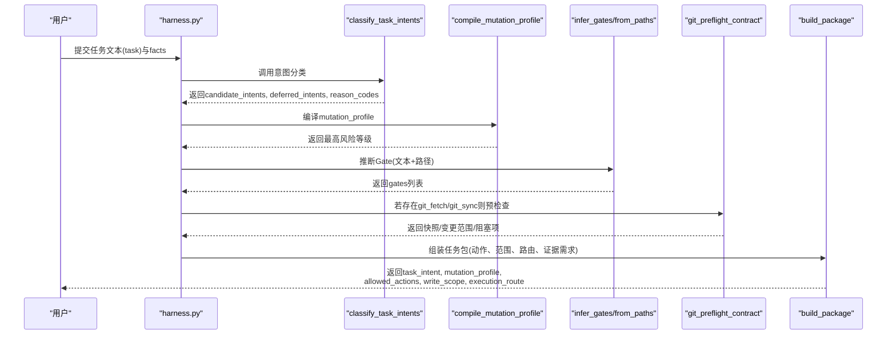
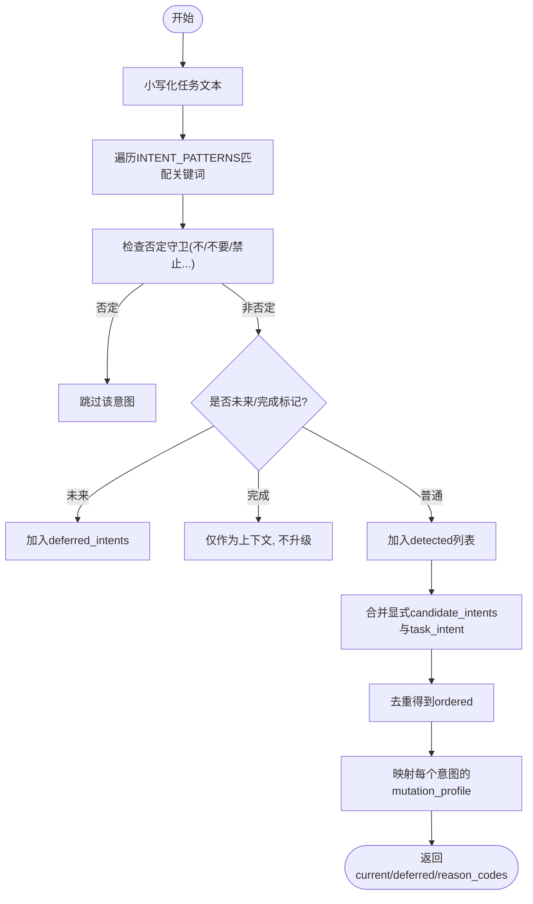
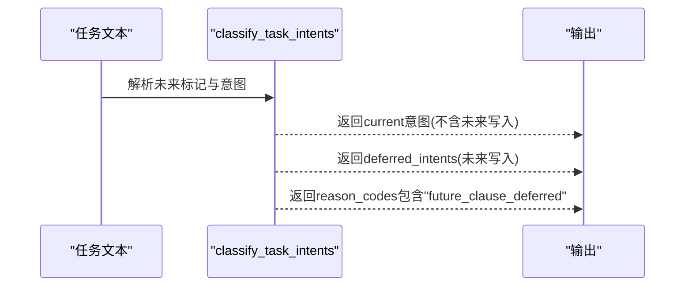
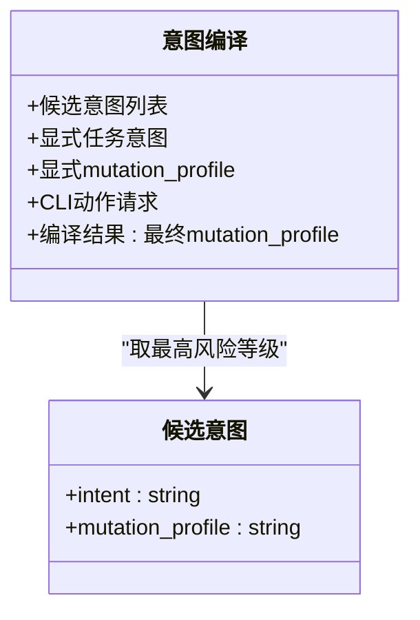
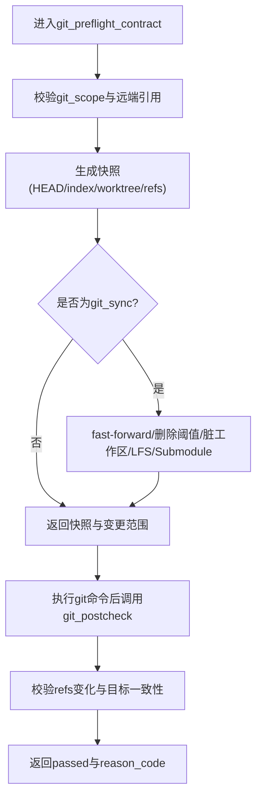
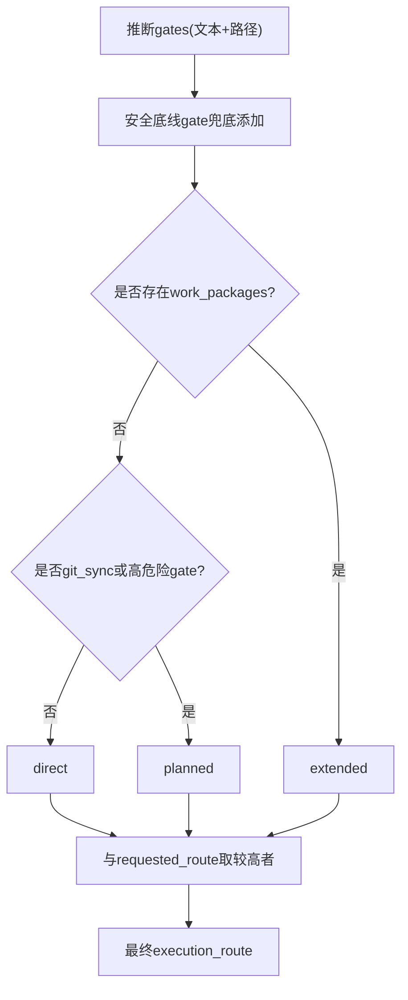
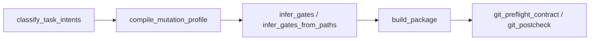

# 意图编译机制

<cite>
**本文引用的文件**   
- [scripts/harness.py](file://scripts/harness.py)
- [tests/test_harness.py](file://tests/test_harness.py)
</cite>

## 目录
1. [简介](#简介)
2. [项目结构](#项目结构)
3. [核心组件](#核心组件)
4. [架构总览](#架构总览)
5. [详细组件分析](#详细组件分析)
6. [依赖关系分析](#依赖关系分析)
7. [性能考量](#性能考量)
8. [故障排查指南](#故障排查指南)
9. [结论](#结论)
10. [附录：JSON配置示例与路由策略](#附录json配置示例与路由策略)

## 简介
本文件系统性阐述 Docs Harness 的“意图编译机制”，覆盖候选意图识别、延迟意图处理、混合意图管理策略，以及最终意图选择与路由决策。重点解释受控意图类型（query、audit、git_inspect、git_fetch、git_sync、modify、external_write）如何从用户输入中提取与匹配；说明 deferred_intents 的工作流程与 future clause 的处理逻辑；给出 candidate_intents 数组的保留规则与最终 mutation_profile 推导；并提供 JSON 配置示例与不同意图类型的默认 mutation_profile 与路由策略，帮助开发者理解从任务文本到可执行包的全流程。

## 项目结构
- 核心实现位于 scripts/harness.py，包含意图分类、延迟意图、mutation_profile 编译、Gate 推断、Git 预检查/后检查、路由选择等关键逻辑。
- tests/test_harness.py 提供大量端到端用例，验证意图识别、延迟意图、混合意图、Git 操作与路由选择的正确性。

**图表来源** 
- [scripts/harness.py:2154-2228](file://scripts/harness.py#L2154-L2228)
- [scripts/harness.py:2236-2243](file://scripts/harness.py#L2236-L2243)
- [scripts/harness.py:2245-2286](file://scripts/harness.py#L2245-L2286)
- [scripts/harness.py:2613-2799](file://scripts/harness.py#L2613-L2799)

**章节来源**
- [scripts/harness.py:197-230](file://scripts/harness.py#L197-L230)
- [scripts/harness.py:2154-2228](file://scripts/harness.py#L2154-L2228)
- [scripts/harness.py:2613-2799](file://scripts/harness.py#L2613-L2799)

## 核心组件
- 受控意图类型与模式映射
  - TASK_INTENTS：定义受控意图枚举。
  - INTENT_MUTATION：将意图映射为 mutation_profile（read_only、git_metadata_write、workspace_write、external_write）。
  - MUTATION_RANK：对 mutation_profile 进行风险排序，用于“取最高”策略。
- 意图识别与延迟处理
  - classify_task_intents：基于关键词模式匹配，区分当前意图与延迟意图，并记录边界原因码。
  - future clause 检测：当 modify/external_write/git_sync 出现在“后续/以后/后面/另行/单独/另开任务/下一任务”等标记前缀时，归入 deferred_intents。
  - completed action 语义：若出现“已经/此前/上次/曾经/已完成”等标记，视为上下文信息，不升级意图。
- 混合意图管理与最终选择
  - compile_mutation_profile：在候选意图与显式声明之间取最高风险等级。
  - build_package：根据任务文本、facts、CLI 参数综合决定 mutation_profile、allowed_actions、write_scope、git_scope、execution_route 等。
- Gate 推断
  - infer_gates/infer_gates_from_paths：基于任务文本与路径特征推断 Gate，并在 read_only/git_metadata_write 下剔除代码/文档编辑 Gate。
- Git 预检查/后检查
  - git_preflight_contract/git_postcheck：针对 git_fetch/git_sync 生成快照与约束，确保变更范围与目标一致。

**章节来源**
- [scripts/harness.py:197-230](file://scripts/harness.py#L197-L230)
- [scripts/harness.py:2154-2228](file://scripts/harness.py#L2154-L2228)
- [scripts/harness.py:2236-2243](file://scripts/harness.py#L2236-L2243)
- [scripts/harness.py:2245-2286](file://scripts/harness.py#L2245-L2286)
- [scripts/harness.py:2613-2799](file://scripts/harness.py#L2613-L2799)
- [scripts/harness.py:677-791](file://scripts/harness.py#L677-L791)
- [scripts/harness.py:793-875](file://scripts/harness.py#L793-L875)

## 架构总览
下图展示从用户输入到最终任务包的完整流程，包括意图分类、延迟意图、mutation_profile 编译、Gate 推断、Git 预检查与路由选择。

**图表来源** 
- [scripts/harness.py:2154-2228](file://scripts/harness.py#L2154-L2228)
- [scripts/harness.py:2236-2243](file://scripts/harness.py#L2236-L2243)
- [scripts/harness.py:2245-2286](file://scripts/harness.py#L2245-L2286)
- [scripts/harness.py:2613-2799](file://scripts/harness.py#L2613-L2799)
- [scripts/harness.py:677-791](file://scripts/harness.py#L677-L791)

## 详细组件分析

### 候选意图识别算法
- 关键词匹配
  - INTENT_PATTERNS 为每个受控意图维护一组中英文关键词，按位置匹配并考虑词界与否定守卫。
  - 支持“是否/能否/要不要”等疑问句式抑制 modify 意图，避免误判。
- 显式候选与主意图
  - facts.candidate_intents 允许显式指定候选意图数组；facts.task_intent 可指定主意图，优先级高于自动识别。
- 延迟意图与完成语义
  - 当 modify/external_write/git_sync 出现在未来标记前缀时，归入 deferred_intents，并记录 reason_code="future_clause_deferred"。
  - 出现完成标记时，视为上下文信息，不升级当前意图。
- 结果构造
  - 去重后的 ordered 列表作为 current 候选，并为每个候选附加对应的 mutation_profile。

**图表来源** 
- [scripts/harness.py:2154-2228](file://scripts/harness.py#L2154-L2228)

**章节来源**
- [scripts/harness.py:2154-2228](file://scripts/harness.py#L2154-L2228)

### 延迟意图处理机制（deferred_intents 与 future clause）
- 触发条件
  - 仅在 modify、external_write、git_sync 三类意图上生效。
  - 当这些意图出现在“后续/以后/后面/另行/单独/另开任务/下一任务”等标记前缀时，被推迟到 deferred_intents。
- 作用
  - 当前任务保持只读或较低风险等级，避免误执行写入。
  - 通过 reason_codes 中的 "future_clause_deferred" 明确边界。
- 测试验证
  - 用例表明：当任务包含“本次只排查，后面另开任务实现”时，当前 mutation_profile 为 read_only，且 deferred_intents 包含 modify（workspace_write）。

**图表来源** 
- [scripts/harness.py:2154-2228](file://scripts/harness.py#L2154-L2228)

**章节来源**
- [scripts/harness.py:2154-2228](file://scripts/harness.py#L2154-L2228)
- [tests/test_harness.py:4676-4683](file://tests/test_harness.py#L4676-L4683)

### 混合意图管理策略（candidate_intents 与最终选择）
- 候选保留规则
  - 显式 task_intent 优先；其次为显式 candidate_intents；最后为自动识别结果。
  - 去重并保持顺序，保证显式声明优先于自动推断。
- mutation_profile 编译
  - 从候选意图的 mutation_profile 中取最高风险等级；若存在显式 mutation_profile，则与其比较取更高者。
  - CLI 的 allowed_actions 也可提升风险等级（如 external_write、write/git_sync）。
- 最终意图选择
  - 若最终 mutation_profile 不在候选中出现，则追加对应意图（例如 workspace_write -> modify）。
  - 对于 git_sync 场景，write_scope 会被强制对齐为预检得到的变化清单。

**图表来源** 
- [scripts/harness.py:2236-2243](file://scripts/harness.py#L2236-L2243)
- [scripts/harness.py:2613-2799](file://scripts/harness.py#L2613-L2799)

**章节来源**
- [scripts/harness.py:2236-2243](file://scripts/harness.py#L2236-L2243)
- [scripts/harness.py:2613-2799](file://scripts/harness.py#L2613-L2799)

### Git 预检查与后检查（git_fetch/git_sync）
- 预检查
  - 校验远端引用、HEAD、索引与工作区指纹，生成快照与变更范围。
  - 对 git_sync 额外检查 fast-forward、删除数量阈值、脏工作区重叠、LFS/Submodule 可用性。
- 后检查
  - 对比前后 refs 与目标 OID，确认变更范围是否在合同内，失败时返回 reason_code（如 git_remote_drift、git_ref_scope_violation）。

**图表来源** 
- [scripts/harness.py:677-791](file://scripts/harness.py#L677-L791)
- [scripts/harness.py:793-875](file://scripts/harness.py#L793-L875)

**章节来源**
- [scripts/harness.py:677-791](file://scripts/harness.py#L677-L791)
- [scripts/harness.py:793-875](file://scripts/harness.py#L793-L875)

### Gate 推断与路由选择
- Gate 推断
  - 基于任务文本关键词与路径特征推断 Gate；在 read_only/git_metadata_write 下剔除 code-edit/document-edit。
  - 安全底线 Gate（security-sensitive、destructive-data、release-external）由精确词表与路径特征兜底添加。
- 路由选择
  - inferred_route：work_packages 存在时为 extended；否则若涉及 git_sync 或高危险 Gate 则为 planned；其余为 direct。
  - requested_route 与 inferred_route 取较高者（extended > planned > direct），但 extended 若无 work_packages 会降级为 planned。

**图表来源** 
- [scripts/harness.py:2245-2286](file://scripts/harness.py#L2245-L2286)
- [scripts/harness.py:2613-2799](file://scripts/harness.py#L2613-L2799)

**章节来源**
- [scripts/harness.py:2245-2286](file://scripts/harness.py#L2245-L2286)
- [scripts/harness.py:2613-2799](file://scripts/harness.py#L2613-L2799)

## 依赖关系分析
- 模块内依赖
  - classify_task_intents 依赖 INTENT_PATTERNS、TASK_INTENTS、NEGATION_MARKERS、FUTURE/COMPLETED 标记。
  - compile_mutation_profile 依赖 MUTATION_RANK、INTENT_MUTATION。
  - infer_gates/infer_gates_from_paths 依赖 GATE_DEFS、GATE_ORDER、SAFETY_FLOOR_GATES、FLOOR_TERMS。
  - build_package 整合上述所有组件，并调用 git_preflight_contract/git_postcheck。
- 外部依赖
  - Git 子进程命令（git_command）、文件系统访问、JSON 读写。

**图表来源** 
- [scripts/harness.py:2154-2228](file://scripts/harness.py#L2154-L2228)
- [scripts/harness.py:2236-2243](file://scripts/harness.py#L2236-L2243)
- [scripts/harness.py:2245-2286](file://scripts/harness.py#L2245-L2286)
- [scripts/harness.py:2613-2799](file://scripts/harness.py#L2613-L2799)
- [scripts/harness.py:677-791](file://scripts/harness.py#L677-L791)
- [scripts/harness.py:793-875](file://scripts/harness.py#L793-L875)

**章节来源**
- [scripts/harness.py:2154-2228](file://scripts/harness.py#L2154-L2228)
- [scripts/harness.py:2236-2243](file://scripts/harness.py#L2236-L2243)
- [scripts/harness.py:2245-2286](file://scripts/harness.py#L2245-L2286)
- [scripts/harness.py:2613-2799](file://scripts/harness.py#L2613-L2799)
- [scripts/harness.py:677-791](file://scripts/harness.py#L677-L791)
- [scripts/harness.py:793-875](file://scripts/harness.py#L793-L875)

## 性能考量
- 关键词匹配采用线性扫描与正则边界检查，复杂度与任务长度和关键词数量成正比。
- 目录展开用于 Gate 推断时限制最大文件数（200），避免巨型目录导致性能问题。
- Git 快照与指纹计算对大仓库可能耗时，建议合理控制 scope 与避免全量扫描。
- 事件与证据索引使用 JSONL 追加写入，I/O 开销可控。

[本节为通用指导，无需源码引用]

## 故障排查指南
- 常见错误码
  - invalid_task_intent：candidate_intents/task_intent 值不在 TASK_INTENTS 中。
  - invalid_mutation_profile：mutation_profile 不在受控列表中。
  - invalid_gate：gates 包含未知 Gate。
  - invalid_scope_description：scope 包含自然语言描述而非结构化路径。
  - invalid_external_scope：external_scope 不符合标识规范。
  - git_preflight_failed/git_remote_unavailable/git_target_object_missing：Git 预检查失败。
  - git_remote_drift/git_ref_scope_violation：Git 后检查发现远端漂移或越权变更。
- 定位方法
  - 查看 reason_codes 与 blockers 字段，结合 intent_boundary_reason_codes 判断意图边界。
  - 检查 git_preflight_contract 返回的 snapshot 与 blockers，确认远端引用与工作区状态。
  - 核对 facts 中的 read_scope/write_scope/git_scope/external_scope 是否符合规范。

**章节来源**
- [scripts/harness.py:2154-2228](file://scripts/harness.py#L2154-L2228)
- [scripts/harness.py:2236-2243](file://scripts/harness.py#L2236-L2243)
- [scripts/harness.py:2245-2286](file://scripts/harness.py#L2245-L2286)
- [scripts/harness.py:2613-2799](file://scripts/harness.py#L2613-L2799)
- [scripts/harness.py:677-791](file://scripts/harness.py#L677-L791)
- [scripts/harness.py:793-875](file://scripts/harness.py#L793-L875)

## 结论
Docs Harness 的意图编译机制通过严格的受控意图类型、关键词匹配与否定守卫、延迟意图分离、最高风险等级编译、Gate 推断与 Git 预/后检查，实现了从自然语言到安全可执行任务包的稳健转换。开发者可通过显式 candidate_intents 与 task_intent 精准控制行为，同时利用 deferred_intents 表达未来计划，确保当前任务的安全性与可审计性。

[本节为总结，无需源码引用]

## 附录：JSON配置示例与路由策略
以下为不同意图类型的 mutation_profile 默认值与路由策略说明（以事实 facts 为例）：

- query（查询）
  - mutation_profile: read_only
  - allowed_actions: ["read"]
  - execution_route: direct（除非有显式 higher route）
  - 示例 facts: {"task_intent": "query", "read_scope": ["README.md"]}

- audit（审计）
  - mutation_profile: read_only
  - allowed_actions: ["read"]
  - execution_route: direct
  - 示例 facts: {"task_intent": "audit", "read_scope": ["docs/architecture.md"]}

- git_inspect（Git 检查）
  - mutation_profile: read_only
  - allowed_actions: ["read", "git_inspect"]
  - execution_route: direct
  - 示例 facts: {"task_intent": "git_inspect", "git_scope": [".git:history"]}

- git_fetch（获取远端引用）
  - mutation_profile: git_metadata_write
  - allowed_actions: ["read", "git_fetch"]
  - execution_route: direct（无写入工作树）
  - 示例 facts: {"task_intent": "git_fetch", "git_scope": [".git:refs/remotes/origin/*"]}

- git_sync（同步远端）
  - mutation_profile: workspace_write
  - allowed_actions: ["read", "write", "local_verify", "git_fetch", "git_sync"]
  - execution_route: planned（需要计划）
  - 示例 facts: {"task_intent": "git_sync", "git_scope": [".git:refs/remotes/origin/main"]}

- modify（修改）
  - mutation_profile: workspace_write
  - allowed_actions: ["read", "write", "local_verify"]
  - execution_route: direct 或 planned（取决于 Gate）
  - 示例 facts: {"task_intent": "modify", "write_scope": ["src/core.py"]}

- external_write（外部写入）
  - mutation_profile: external_write
  - allowed_actions: ["read", "write", "local_verify", "external_write"]
  - execution_route: planned 或 extended（取决于 Gate 与 work_packages）
  - 示例 facts: {"task_intent": "external_write", "external_scope": ["deploy-target"]}

注意：
- 若 facts.allowed_actions 包含 external_write，则 mutation_profile 至少为 external_write。
- 若 facts.allowed_actions 包含 write 或 git_sync，则 mutation_profile 至少为 workspace_write。
- 若 facts.allowed_actions 包含 git_fetch，则 mutation_profile 至少为 git_metadata_write。
- 若存在 work_packages，则 mutation_profile 至少为 workspace_write。

**章节来源**
- [scripts/harness.py:197-230](file://scripts/harness.py#L197-L230)
- [scripts/harness.py:2236-2243](file://scripts/harness.py#L2236-L2243)
- [scripts/harness.py:2613-2799](file://scripts/harness.py#L2613-L2799)
- [tests/test_harness.py:503-536](file://tests/test_harness.py#L503-L536)
- [tests/test_harness.py:577-596](file://tests/test_harness.py#L577-L596)
- [tests/test_harness.py:597-618](file://tests/test_harness.py#L597-L618)