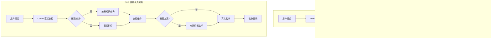

# 直接优先架构

<cite>
**本文引用的文件**   
- [scripts/harness.py](file://scripts/harness.py)
- [SKILL.md](file://SKILL.md)
- [tests/test_v2_direct.py](file://tests/test_v2_direct.py)
- [docs/migrations/v2.0.0.md](file://docs/migrations/v2.0.0.md)
- [docs/plans/docs-harness-v2.0.0-direct-first-plan.md](file://docs/plans/docs-harness-v2.0.0-direct-first-plan.md)
</cite>

## 更新摘要
**变更内容**   
- 完全移除了意图驱动架构（Intent → Gate → Plan → Evidence → Verify 流水线）
- 实现了直接优先方法，Codex 默认直接执行任务
- 保留了按需知识查询、方案模板选择和真实验收记录作为独立辅助能力
- 删除了所有旧的控制流程命令（run、context、progress、verify、task、background、authorization）
- 更新了项目配置结构为 v6，移除了所有旧规则和管理功能

## 目录
1. [引言](#引言)
2. [架构迁移概述](#架构迁移概述)
3. [直接优先模式](#直接优先模式)
4. [按需辅助能力](#按需辅助能力)
5. [真实验收系统](#真实验收系统)
6. [项目迁移指南](#项目迁移指南)
7. [CLI 接口变更](#cli-接口变更)
8. [测试验证](#测试验证)
9. [结论](#结论)

## 引言

Docs Harness 2.0.0 是一次重大架构重构，完全移除了原有的意图驱动架构，转向直接优先方法。新版本不再将 Harness 作为每个任务的强制入口，而是让 Codex 直接理解、执行和验收任务，仅在需要时启用辅助能力。

**重要变更**：从 1.x 的 "所有任务必须经过 Intent、Gate、Plan、Evidence、Verify" 转变为 "默认不调用 Harness，Codex 直接完成任务"。

## 架构迁移概述

### 1.x 到 2.0.0 的核心差异



**图表来源** 
- [docs/plans/docs-harness-v2.0.0-direct-first-plan.md:31-45](file://docs/plans/docs-harness-v2.0.0-direct-first-plan.md#L31-L45)
- [docs/plans/docs-harness-v2.0.0-direct-first-plan.md:215-249](file://docs/plans/docs-harness-v2.0.0-direct-first-plan.md#L215-L249)

### 移除的组件

以下组件在 2.0.0 中完全移除：

| 组件 | 1.x 状态 | 2.0.0 状态 | 替代方案 |
|------|----------|------------|----------|
| Intent | 强制意图分类 | 内建于任务理解 | Codex 直接理解 |
| Gate | 任务级安全门控 | 完全移除 | Codex 原生安全 |
| Run | 任务运行器 | 删除 CLI | 直接执行 |
| Context | 自动上下文注入 | 拆分为按需知识 | `knowledge query` |
| Plan | 通用计划生成 | 简化为复杂任务方案 | `plan select/create` |
| Evidence | 控制收据系统 | 仅真实验收证据 | `acceptance record` |
| Verify | 合同核验 | 删除 CLI | 真实行为验收 |
| Readmission | 重准入循环 | 取消常规重准入 | 实质变化才暂停 |

**章节来源**
- [docs/plans/docs-harness-v2.0.0-direct-first-plan.md:639-654](file://docs/plans/docs-harness-v2.0.0-direct-first-plan.md#L639-L654)

## 直接优先模式

### 默认执行流程

2.0.0 的默认模式是 Codex 直接执行任务，不创建任何 Harness 状态：

```text
用户提出任务
↓
Codex 直接理解任务
↓
读取必要文件
↓
修改或回答
↓
最小真实验收
↓
回复用户
```

### 直接模式的适用场景

直接模式适用于以下任务类型：

- 普通问答
- 只读检查  
- Git 状态和历史查询
- 已知文件或符号的小范围修改
- 明确 Bug 修复
- 单文件文档修改
- Codex 已拥有足够上下文的任务

### 直接模式的核心指标

```text
direct_mode_false_escalation_rate = 本可直接完成却启用辅助或治理的比例
time_to_first_productive_action_ms = 从任务开始到首次有效读取、修改或执行的时间
unnecessary_harness_call_count = 直接任务中的 Harness 调用次数，目标为 0
scope_drift_path_count = 范围外修改路径数量，目标为 0
```

**章节来源**
- [docs/plans/docs-harness-v2.0.0-direct-first-plan.md:215-249](file://docs/plans/docs-harness-v2.0.0-direct-first-plan.md#L215-L249)

## 按需辅助能力

### 知识查询

当 Codex 缺少关键项目事实时，可以启用按需知识查询：

```bash
python3 scripts/harness.py knowledge query --target . \
  --query "需要确认的项目事实" --json
```

#### 知识查询特点

- **状态无关**：不创建任务状态或控制记录
- **边界限制**：支持 `--limit` 和 `--max-chars` 参数控制输出大小
- **范围过滤**：可通过 `--scope` 限定搜索范围
- **优先级**：当前源码 > 相关 ADR/架构文档 > 项目知识摘要 > 历史记录

#### 知识查询输出格式

```json
{
  "mode": "knowledge_assist",
  "facts": ["与当前任务直接相关的事实"],
  "refs": ["文件、符号或知识引用"],
  "constraints": ["必须遵守的项目约束"],
  "conflicts": ["冲突信息"],
  "omitted": {"count": 省略数量, "reason": "limit_or_character_budget"}
}
```

**章节来源**
- [SKILL.md:20-31](file://SKILL.md#L20-L31)
- [scripts/harness.py:439-506](file://scripts/harness.py#L439-L506)

### 方案模板

对于复杂、跨模块、高风险或用户明确要求方案的任务，可以使用方案模板：

```bash
python3 scripts/harness.py plan select --target . \
  --complexity complex --surface backend_service --json
```

#### 方案层级

| 层级 | 适用情况 | 输出 |
|------|----------|------|
| `none` | 普通问答、只读检查、明确单点修改 | 不生成方案 |
| `brief` | 用户要求简单方案、范围明确但需要列步骤 | 目标、范围、关键步骤、验收 |
| `full` | 跨模块、多阶段、架构、复杂产品或高风险任务 | 全面通用模板 + 必要领域字段 |

#### 领域 Profile

- `general`：不属于明确专用领域的复杂任务
- `frontend_ui`：前端、桌面界面、产品交互和视觉状态
- `backend_service`：API、服务端、任务系统和数据处理
- `bugfix`：已有功能行为偏离、回归和故障修复
- `architecture`：架构调整、公共合同和跨模块重构
- `migration_release`：数据迁移、版本升级、打包发布和外部交付

**章节来源**
- [SKILL.md:32-56](file://SKILL.md#L32-L56)
- [docs/plans/docs-harness-v2.0.0-direct-first-plan.md:406-476](file://docs/plans/docs-harness-v2.0.0-direct-first-plan.md#L406-L476)

## 真实验收系统

### 验收层级

2.0.0 的验收系统围绕真实功能而非控制合同：

```text
L1 源码一致性：lint、类型、编译、静态合同
L2 聚焦行为：单元、接口、组件或命令测试
L3 本地运行态：真实应用或服务流程
L4 构建/包/安装：真实产物层
L5 用户可见验收：主观体验、权限、硬件和最终业务结果
```

### 验收记录

```bash
python3 scripts/harness.py acceptance record --target . \
  --input acceptance.json --json
```

#### 验收类型

- **Contract Check**：检查范围、格式、授权和记录一致性
- **Behavior Acceptance**：运行测试、真实接口、应用流程等
- **User Acceptance**：由用户判断主观体验、权限、硬件等

#### 验收输入格式

```json
{
  "schema_version": "docs-harness/acceptance-input/v2",
  "objective": "验证退出流程",
  "acceptance_type": "behavior_acceptance",
  "status": "passed",
  "layer": "L3",
  "method": "启动应用并验证退出逻辑",
  "evidence_refs": ["test-output.txt"]
}
```

**章节来源**
- [SKILL.md:62-78](file://SKILL.md#L62-L78)
- [scripts/harness.py:705-800](file://scripts/harness.py#L705-L800)

## 项目迁移指南

### 迁移原则

2.0.0 迁移遵循四条数据边界：

1. **受管旧工件清理**：能通过安装指纹、Schema 或受管标记证明属于 Docs Harness 的旧工件删除或剥离
2. **项目内容保留**：业务文档、ADR、TODO、方案、代码和用户修改不因路径位于 `docs/` 而被删除
3. **归属不明不猜**：指纹不匹配、额外文件、符号链接或标记损坏时不自动覆盖
4. **先预览再应用**：`upgrade` 默认只读；只有显式 `--apply` 才写入和清理

### 迁移步骤

#### 第一步：预览

```bash
python3 <docs-harness-2.0.0-source>/scripts/harness.py project upgrade --target <project> --json
```

预览返回：
- `from_version` 与 `to_version=2.0.0`
- 将创建、更新或删除的路径
- `legacy_document_cleanup.remove_files`
- `legacy_document_cleanup.remove_directories`
- `legacy_document_cleanup.strip_managed_blocks`
- `legacy_document_cleanup.preserved_paths`
- `legacy_document_cleanup.conflicts`
- `write_performed=false`

#### 第二步：应用

```bash
python3 <docs-harness-2.0.0-source>/scripts/harness.py project upgrade --target <project> --apply --json
```

应用会安装：
- direct-first 的 `AGENTS.md` 受管区块
- 只负责转发 `AGENTS.md` 的 `CLAUDE.md` 受管区块
- 2.0.0 `scripts/harness.py`
- `plan-templates/`
- `docs-harness/project-config/v6` 配置

**章节来源**
- [docs/migrations/v2.0.0.md:15-67](file://docs/migrations/v2.0.0.md#L15-L67)

### 自动清理的旧工件

| 旧工件 | 清理条件 | 2.0.0 动作 |
|--------|----------|------------|
| `.docs-harness/harness-home/rules/*.md` | 文件名和 SHA-256 与旧配置一致 | 删除文件；目录为空后删除目录 |
| `docs/knowledge-map.json` | Schema 以 `docs-harness/knowledge-map/` 开头 | 删除旧控制地图，保留其引用的项目正文 |
| `docs/INDEX.md`、`docs/modules/INDEX.md` 的版本区块 | 存在完整 `docs-harness:managed-version` 标记 | 只移除受管区块，保留其余正文 |
| `runs/` | 位于 Harness Runtime 根下且为常规目录 | 删除旧任务状态 |
| `knowledge/`、`knowledge-jobs/`、`task-inputs/` | 位于 Harness Runtime 根下且为常规目录 | 删除旧知识状态、Job 和任务输入暂存 |
| `background/` | 位于 Harness Runtime 根下且为常规目录 | 删除旧后台治理状态 |

**章节来源**
- [docs/migrations/v2.0.0.md:68-82](file://docs/migrations/v2.0.0.md#L68-L82)

## CLI 接口变更

### 新增的 CLI 命令

2.0.0 提供以下核心命令：

| 命令 | 子命令 | 功能 |
|------|--------|------|
| `knowledge` | `query` | 按需知识查询 |
| `plan` | `select`, `create` | 方案模板选择和创建 |
| `acceptance` | `record` | 验收记录 |
| `project` | `init`, `upgrade`, `check`, `diff`, `uninstall` | 项目管理 |
| `release` | - | 发布管理 |
| `self-test` | - | 自测工具 |

### 删除的 CLI 命令

以下命令在 2.0.0 中完全移除：

- `run` - 任务运行器
- `context` - 上下文管理
- `progress` - 进度跟踪
- `verify` - 合同核验
- `task` - 任务管理
- `background` - 后台治理
- `authorization` - 授权管理

### 配置结构变更

v6 配置结构移除了所有旧的管理功能：

```json
{
  "schema_version": "docs-harness/project-config/v6",
  "version": "2.0.0",
  "installed_script_fingerprint": "sha256:...",
  "installed_plan_template_fingerprints": {...},
  "direct_mode": {"default": true},
  "knowledge": {
    "mode": "on_demand",
    "read_only": true,
    "docs_preexisting_at_install": true
  },
  "migration": {...},
  "installed_at": "2026-08-08T00:00:00Z"
}
```

**章节来源**
- [tests/test_v2_direct.py:20-35](file://tests/test_v2_direct.py#L20-L35)
- [tests/test_v2_direct.py:330-349](file://tests/test_v2_direct.py#L330-L349)

## 测试验证

### 核心测试用例

2.0.0 的测试覆盖了新架构的关键特性：

#### 旧命令移除验证

```python
def test_removed_v1_commands_are_absent_from_cli(self):
    # 验证旧命令不存在
    for command in ("run", "context", "progress", "verify", "task", "background", "authorization"):
        result = subprocess.run(
            [sys.executable, str(HARNESS), command],
            cwd=ROOT, capture_output=True, text=True, check=False
        )
        self.assertEqual(result.returncode, 2)
        self.assertIn("invalid choice", result.stderr)
```

#### 知识查询验证

```python
def test_knowledge_query_is_explicit_bounded_and_stateless(self):
    payload = self.run_cli(
        "knowledge", "query", "--target", str(self.project),
        "--query", "VoiceCoordinator 退出", "--limit", "1", "--max-chars", "500"
    )
    self.assertEqual(payload["mode"], "knowledge_assist")
    self.assertEqual(len(payload["facts"]), 1)
    self.assertFalse((self.project / ".docs-harness").exists())
```

#### 方案模板验证

```python
def test_plan_select_uses_effects_not_task_text(self):
    none = self.run_cli("plan", "select", "--target", str(self.project))
    self.assertEqual(none["plan_level"], "none")
    
    full = self.run_cli(
        "plan", "select", "--target", str(self.project),
        "--complexity", "complex", "--surface", "architecture"
    )
    self.assertEqual(full["plan_level"], "full")
    self.assertEqual(full["plan_profile"], "architecture")
```

**章节来源**
- [tests/test_v2_direct.py:110-133](file://tests/test_v2_direct.py#L110-L133)
- [tests/test_v2_direct.py:135-149](file://tests/test_v2_direct.py#L135-L149)
- [tests/test_v2_direct.py:235-247](file://tests/test_v2_direct.py#L235-L247)

## 结论

Docs Harness 2.0.0 的架构重构代表了从强制治理到灵活辅助的根本性转变。通过移除意图驱动架构并实现直接优先方法，新版本提供了：

### 主要优势

1. **更高的效率**：普通任务无需经过复杂的控制流程
2. **更好的用户体验**：减少不必要的中断和确认
3. **更清晰的职责分离**：安全知识由 Codex 原生处理，Harness 专注于辅助能力
4. **更强的灵活性**：知识、方案和验收作为独立可选能力

### 迁移建议

1. **立即开始使用直接模式**：大多数任务可以直接执行
2. **逐步引入辅助能力**：根据实际需要启用知识查询和方案模板
3. **建立真实验收习惯**：关注功能正确性而非控制流程完整性
4. **谨慎进行项目迁移**：使用预览模式评估影响，确保项目内容得到保护

### 未来方向

2.0.0 的设计为未来的改进奠定了基础：

- 任何辅助能力都可以独立关闭，不影响基本工作
- 新的能力需要自己证明增量价值才能扩大默认启用范围
- 保持对用户体验和生产力的持续优化
- 维护与现有项目的兼容性边界

这次重构不仅改变了技术实现，更重要的是重新定义了 Docs Harness 在产品生态中的定位：从任务控制者转变为生产力增强器。