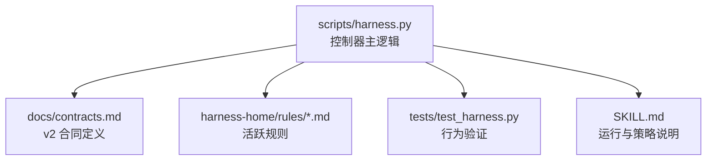
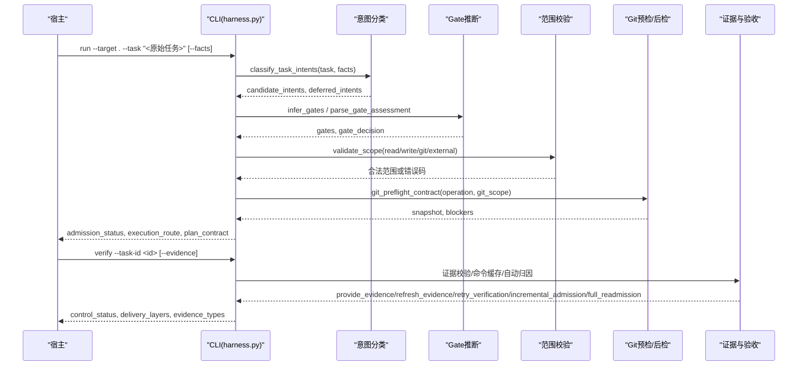
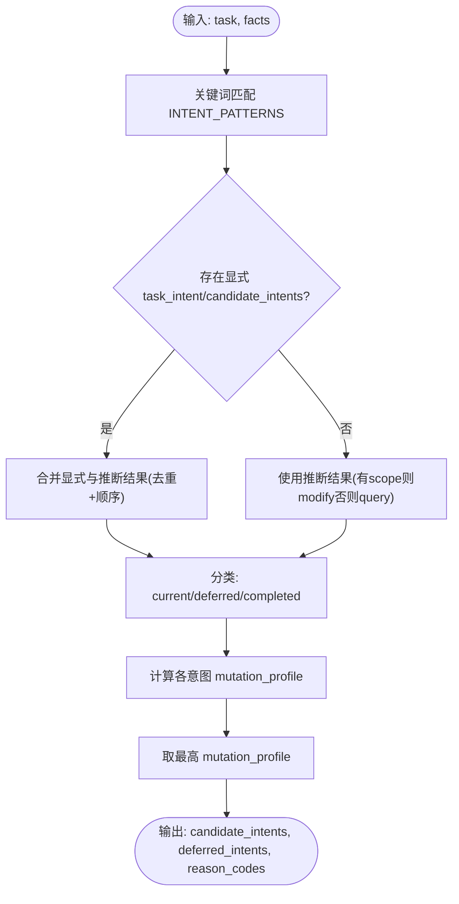
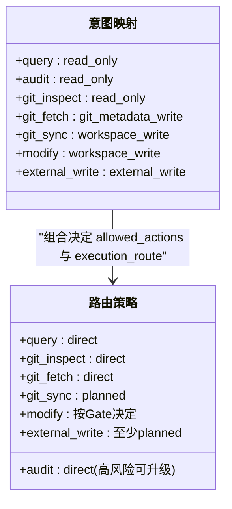
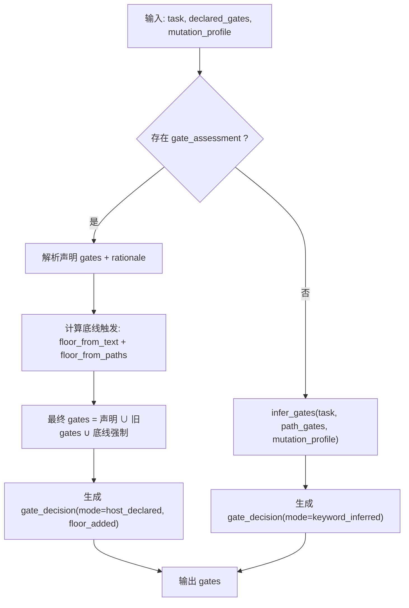
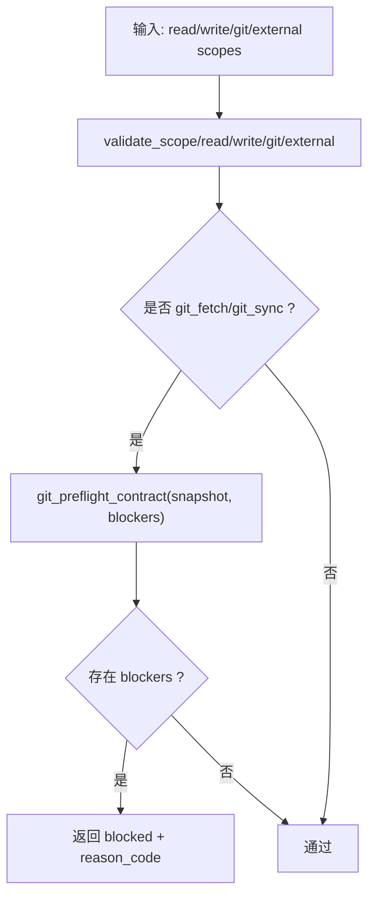
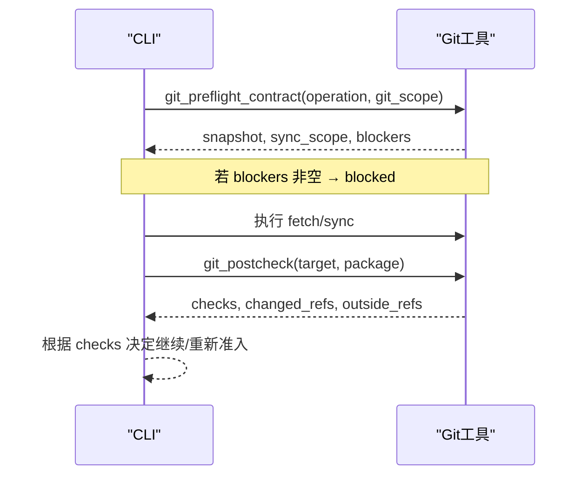
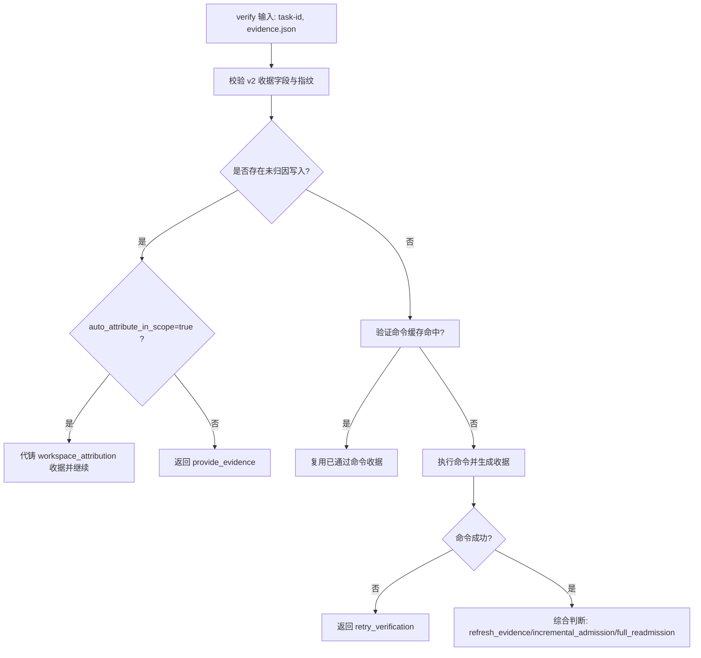
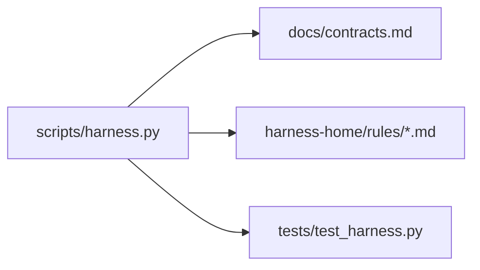

# 意图驱动架构

<cite>
**本文引用的文件**   
- [scripts/harness.py](file://scripts/harness.py)
- [docs/contracts.md](file://docs/contracts.md)
- [SKILL.md](file://SKILL.md)
- [tests/test_harness.py](file://tests/test_harness.py)
- [harness-home/rules/scope-change-readmission.md](file://harness-home/rules/scope-change-readmission.md)
- [harness-home/rules/api-compatibility.md](file://harness-home/rules/api-compatibility.md)
- [harness-home/rules/release-authorization-rollback.md](file://harness-home/rules/release-authorization-rollback.md)
- [harness-home/rules/testing-release.md](file://harness-home/rules/testing-release.md)
</cite>

## 目录
1. [引言](#引言)
2. [项目结构](#项目结构)
3. [核心组件](#核心组件)
4. [架构总览](#架构总览)
5. [详细组件分析](#详细组件分析)
6. [依赖关系分析](#依赖关系分析)
7. [性能考量](#性能考量)
8. [故障排查指南](#故障排查指南)
9. [结论](#结论)
10. [附录：JSON 配置与示例](#附录json-配置与示例)

## 引言
本文件面向 Docs Harness 的“意图驱动架构”，系统性阐述任务意图编译机制、受控意图类型及其默认变更面与路由策略、意图边界评估（read_scope/write_scope/git_scope/external_scope）的工作原理，以及 gate_assessment 声明对 Gate 决策的影响与安全底线强制并入机制。文档同时提供关键流程的可视化图示与具体 JSON 配置示例，帮助开发者理解从 run 入口到 verify 收尾的完整编译与执行链路。

## 项目结构
Docs Harness 以单一控制器脚本为核心，配合合同文档、规则集与测试用例共同构成完整的意图驱动控制面：
- scripts/harness.py：主控制器，实现意图分类、Gate 推断、范围校验、Git 预检/后检、证据与验收、后台治理等核心逻辑。
- docs/contracts.md：v2 合同定义，包括 task-package/v2、完成清单、Git 状态合同、工作区漂移归因、证据收据、验证命令缓存、Runtime 与交付层等。
- harness-home/rules/*.md：活跃规则，按 gates/keywords/plan_fields/evidence_types/failure_mode 驱动 Gate 匹配与方案字段要求。
- tests/test_harness.py：覆盖意图分类、混合意图、Git fetch/sync、漂移处理、自动归因、验证命令缓存等关键路径。
- SKILL.md：运行入口、幂等复用、gate_assessment 语义、verify 五级处置、自动归因开关等高层说明。

**图表来源** 
- [scripts/harness.py:1-120](file://scripts/harness.py#L1-L120)
- [docs/contracts.md:1-120](file://docs/contracts.md#L1-L120)
- [harness-home/rules/scope-change-readmission.md:1-29](file://harness-home/rules/scope-change-readmission.md#L1-L29)
- [tests/test_harness.py:1-120](file://tests/test_harness.py#L1-L120)
- [SKILL.md:1-60](file://SKILL.md#L1-L60)

**章节来源**
- [scripts/harness.py:1-120](file://scripts/harness.py#L1-L120)
- [docs/contracts.md:1-120](file://docs/contracts.md#L1-L120)
- [SKILL.md:1-60](file://SKILL.md#L1-L60)

## 核心组件
- 意图分类与候选管理：基于关键词模式与显式 facts 识别当前意图与候选意图，未来子句进入延迟意图，完成体仅作为审计上下文。
- 变更面与路由策略：根据最高 mutation_profile 决定 allowed_actions 与 execution_route（direct/planned/extended）。
- Gate 推断与 gate_assessment：宿主权威声明 + 安全底线强制兜底；未声明时回退关键词推断。
- 范围边界评估：read_scope/write_scope/git_scope/external_scope 严格校验，支持受控 Git 资源与 glob。
- Git 预检/后检：git_fetch/git_sync 的快照、变更范围、远端漂移、ref 越界、非 fast-forward 等检查。
- 证据与验收：evidence-receipt/v2、验证命令逐项缓存、自动归因、五级处置。
- 后台治理：background job 生命周期与复杂路线约束。

**章节来源**
- [scripts/harness.py:2154-2234](file://scripts/harness.py#L2154-L2234)
- [scripts/harness.py:2236-2243](file://scripts/harness.py#L2236-L2243)
- [scripts/harness.py:2245-2258](file://scripts/harness.py#L2245-L2258)
- [scripts/harness.py:2334-2381](file://scripts/harness.py#L2334-L2381)
- [scripts/harness.py:677-876](file://scripts/harness.py#L677-L876)
- [docs/contracts.md:165-221](file://docs/contracts.md#L165-L221)
- [docs/contracts.md:97-133](file://docs/contracts.md#L97-L133)

## 架构总览
下图展示 run 入口到 verify 收尾的关键调用链路与数据流转，涵盖意图编译、Gate 决策、Git 预检/后检与证据验收。

**图表来源** 
- [scripts/harness.py:2154-2234](file://scripts/harness.py#L2154-L2234)
- [scripts/harness.py:2245-2258](file://scripts/harness.py#L2245-L2258)
- [scripts/harness.py:2334-2381](file://scripts/harness.py#L2334-L2381)
- [scripts/harness.py:677-876](file://scripts/harness.py#L677-L876)
- [docs/contracts.md:153-164](file://docs/contracts.md#L153-L164)

## 详细组件分析

### 意图分类与候选/延迟意图管理
- 关键词匹配：INTENT_PATTERNS 为每个受控意图定义匹配词表，区分英文单词边界与自然语言片段。
- 显式优先级：facts.task_intent 与 facts.candidate_intents 优先于自动推断，且只能升级不能降级。
- 延迟意图：包含“后续/以后”等标记的 modify/external_write/git_sync 进入 deferred_intents，不授权当前写入。
- 完成体：包含“已经/此前”等标记的动作仅作为审查上下文，不改变准入。
- 混合意图：保留全部 candidate_intents，mutation_profile 取最高值，allowed_actions 合并。

**图表来源** 
- [scripts/harness.py:2154-2234](file://scripts/harness.py#L2154-L2234)
- [scripts/harness.py:2236-2243](file://scripts/harness.py#L2236-L2243)

**章节来源**
- [scripts/harness.py:2154-2234](file://scripts/harness.py#L2154-L2234)
- [docs/contracts.md:42-46](file://docs/contracts.md#L42-L46)

### 受控意图类型与默认变更面/路由策略
- 受控意图集合：query、audit、git_inspect、git_fetch、git_sync、modify、external_write。
- 默认变更面映射：read_only、git_metadata_write、workspace_write、external_write。
- 默认路由策略：
  - query/audit/git_inspect → direct（高风险可升级）
  - git_fetch → direct
  - git_sync → planned
  - modify → 按 Gate 决定
  - external_write → 至少 planned

**图表来源** 
- [scripts/harness.py:197-230](file://scripts/harness.py#L197-L230)
- [docs/contracts.md:30-41](file://docs/contracts.md#L30-L41)

**章节来源**
- [scripts/harness.py:197-230](file://scripts/harness.py#L197-L230)
- [docs/contracts.md:30-41](file://docs/contracts.md#L30-L41)

### Gate 推断与 gate_assessment 声明
- 宿主权威声明：facts.gate_assessment = {"gates": [...], "rationale": "..."}，跳过非安全 Gate 的关键词与 scope 路径推断。
- 安全底线强制并入：security-sensitive、destructive-data、release-external 由控制器按任务文本与路径确定性强制并入，记录 floor_added。
- 未声明回退：keyword_inferred 模式，沿用旧行为。
- 路径分词与否定守卫：避免误命中（如 authors/auth），对底线词带否定守卫（不要部署/先不推送）。

**图表来源** 
- [scripts/harness.py:2596-2611](file://scripts/harness.py#L2596-L2611)
- [scripts/harness.py:2245-2258](file://scripts/harness.py#L2245-L2258)
- [scripts/harness.py:2149-2152](file://scripts/harness.py#L2149-L2152)

**章节来源**
- [docs/contracts.md:44-46](file://docs/contracts.md#L44-L46)
- [SKILL.md:37-41](file://SKILL.md#L37-L41)

### 意图边界评估：read_scope/write_scope/git_scope/external_scope
- read_scope：允许项目内相对路径、glob 或受控 Git 资源（.git:history/.git:refs/remotes/*）。
- write_scope：禁止自然语言描述，必须结构化路径；若为空且 mutation_profile=read_only 仍允许。
- git_scope：git_fetch/git_sync 必需，格式 .git:refs/remotes/<remote>/<branch>，git_sync 要求精确分支。
- external_scope：受控目标标识符，长度与字符限制严格。
- 冲突与阻断：脏工作区重叠、非 fast-forward、危险删除、LFS/Submodule 不可用等均失败关闭。

**图表来源** 
- [scripts/harness.py:2334-2381](file://scripts/harness.py#L2334-L2381)
- [scripts/harness.py:677-876](file://scripts/harness.py#L677-L876)

**章节来源**
- [docs/contracts.md:46-46](file://docs/contracts.md#L46-L46)
- [docs/contracts.md:97-133](file://docs/contracts.md#L97-L133)

### Git 预检与后检：fetch/sync 的快照与漂移处理
- preflight：捕获 repo_identity、remote refspec、index_tree、worktree_fingerprint、controlled_refs_namespace、lfs/submodule 可用性、fast-forward 判定、git_sync_scope。
- postcheck：比较 refs 变化、HEAD/index/worktree 一致性、controlled_ref 匹配、分支分歧、LFS/Submodule 有效性。
- 漂移处理：origin/HEAD 更新不再误判越界；pull 落盘文件经 git_sync_landed_scope 自动归因并入 write_scope。

**图表来源** 
- [scripts/harness.py:677-876](file://scripts/harness.py#L677-L876)
- [scripts/harness.py:793-876](file://scripts/harness.py#L793-L876)

**章节来源**
- [docs/contracts.md:97-133](file://docs/contracts.md#L97-L133)

### 证据收据与验证命令缓存
- evidence-receipt/v2：绑定 task_id/target/package fingerprint/producer/command_digest/cwd/ttl/exit_code/read_set/write_set。
- 验证命令缓存：按 argv/produces/输入指纹缓存，失败或输入变化才重跑，支持整体关闭。
- 自动归因：write_scope 内未归因写入默认代铸 workspace_attribution 收据并记录 auto_attributed_paths，可通过配置恢复补证据流程。
- 五级处置：provide_evidence/refresh_evidence/retry_verification/incremental_admission/full_readmission。

**图表来源** 
- [docs/contracts.md:165-221](file://docs/contracts.md#L165-L221)
- [docs/contracts.md:153-164](file://docs/contracts.md#L153-L164)
- [scripts/harness.py:1188-1214](file://scripts/harness.py#L1188-L1214)

**章节来源**
- [docs/contracts.md:165-221](file://docs/contracts.md#L165-L221)
- [SKILL.md:53-57](file://SKILL.md#L53-L57)

## 依赖关系分析
- 控制器与合同：harness.py 严格遵循 contracts.md 定义的 v2 对象结构与校验规则。
- 控制器与规则：load_active_rules 读取 harness-home/rules/*.md 的 frontmatter 与正文结构，按 gates/keywords 匹配并派生 plan_fields/evidence_types。
- 控制器与测试：tests/test_harness.py 覆盖意图分类、混合意图、Git fetch/sync、漂移、自动归因、验证命令缓存等关键路径。

**图表来源** 
- [scripts/harness.py:2057-2124](file://scripts/harness.py#L2057-L2124)
- [docs/contracts.md:1-120](file://docs/contracts.md#L1-L120)
- [tests/test_harness.py:1-120](file://tests/test_harness.py#L1-L120)

**章节来源**
- [scripts/harness.py:2057-2124](file://scripts/harness.py#L2057-L2124)
- [docs/contracts.md:1-120](file://docs/contracts.md#L1-L120)

## 性能考量
- 验证命令逐项缓存：减少重复执行，仅失败或输入变化时重跑，支持整体关闭。
- 上下文正文跨阶段复用：按 task/target/compiler contract/content fingerprint 复用，避免重复加载。
- 包修订增量准入：普通 Gate 追加且合同稳定时走 incremental_admission，不增 package revision。
- 工作区快照截断保护：非 Git 工作区超过文件限制拒绝截断基线，保证一致性。

[本节为通用指导，无需引用具体文件]

## 故障排查指南
- invalid_scope_description：read/write/git/external scope 包含自然语言描述或非法字符。
- git_preflight_failed/blockers：脏工作区、非 fast-forward、LFS/Submodule 不可用、危险删除等。
- invalid_gate_assessment：gate_assessment 非对象或 rationale 无效。
- unknown_gate：declared_gates 包含未知 Gate。
- missing_file/invalid_json：输入文件缺失或 JSON 无效。
- state_locked/stale_lock：并发锁冲突或过期锁。

**章节来源**
- [scripts/harness.py:2334-2381](file://scripts/harness.py#L2334-L2381)
- [scripts/harness.py:677-876](file://scripts/harness.py#L677-L876)
- [scripts/harness.py:2596-2611](file://scripts/harness.py#L2596-L2611)
- [scripts/harness.py:1008-1029](file://scripts/harness.py#L1008-L1029)

## 结论
Docs Harness 的意图驱动架构通过严格的意图分类、Gate 权威声明与安全底线强制、受控范围边界与 Git 预检/后检、证据收据与验证命令缓存，构建了高可信、可审计、可复用的任务控制面。开发者只需按合同提交 facts 与证据，即可在最小权限与明确边界下完成从查询到外部写入的全链路治理。

[本节为总结性内容，无需引用具体文件]

## 附录：JSON 配置与示例
- task-package/v2 示例（query 只读）：
  - 字段：task_intent、candidate_intents、deferred_intents、intent_boundary_reason_codes、mutation_profile、read_scope、write_scope、git_scope、external_scope、allowed_actions。
  - 参考路径：[docs/contracts.md:13-28](file://docs/contracts.md#L13-L28)
- gate_assessment 示例：
  - 字段：gates（数组）、rationale（500 字符内非空字符串）。
  - 参考路径：[docs/contracts.md:44-46](file://docs/contracts.md#L44-L46)
- verification.commands 示例：
  - 字段：argv（数组）、produces（证据白名单）。
  - 参考路径：[docs/contracts.md:190-200](file://docs/contracts.md#L190-L200)
- evidence-declaration/v1 草案示例：
  - 字段：type、write_set、read_set、concurrent_drift、conclusion。
  - 参考路径：[docs/contracts.md:203-216](file://docs/contracts.md#L203-L216)

**章节来源**
- [docs/contracts.md:13-28](file://docs/contracts.md#L13-L28)
- [docs/contracts.md:44-46](file://docs/contracts.md#L44-L46)
- [docs/contracts.md:190-200](file://docs/contracts.md#L190-L200)
- [docs/contracts.md:203-216](file://docs/contracts.md#L203-L216)