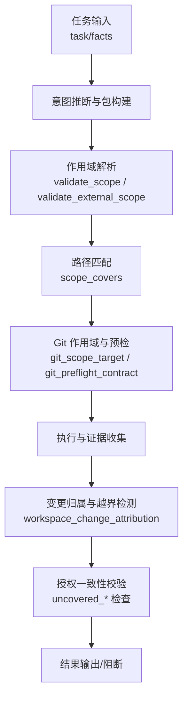
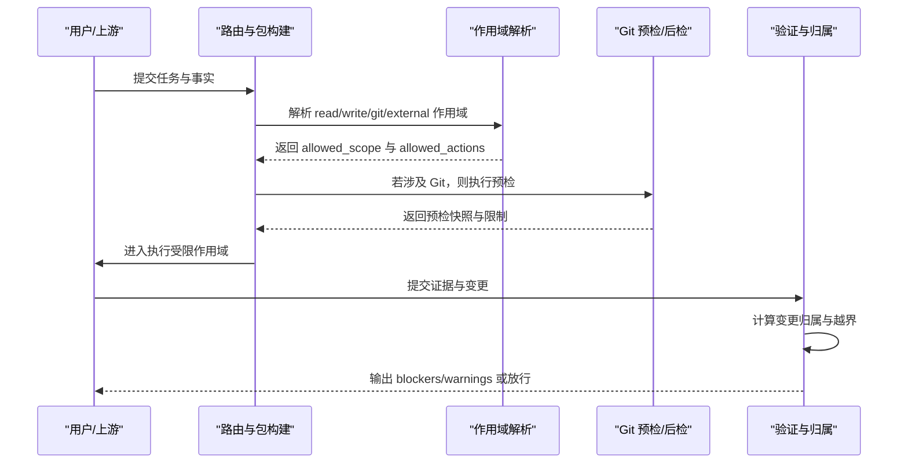
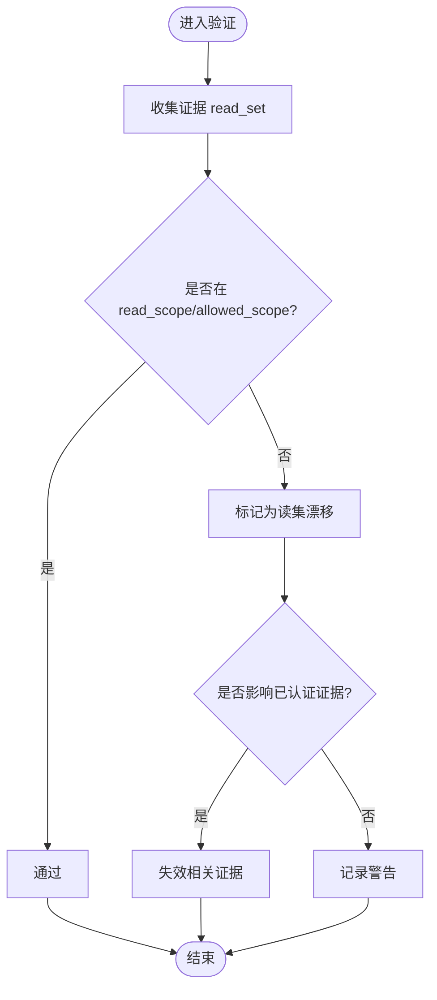
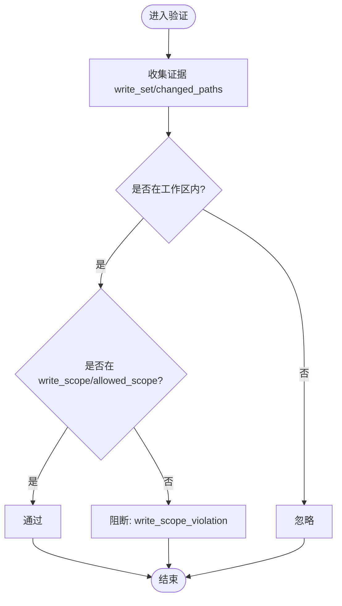
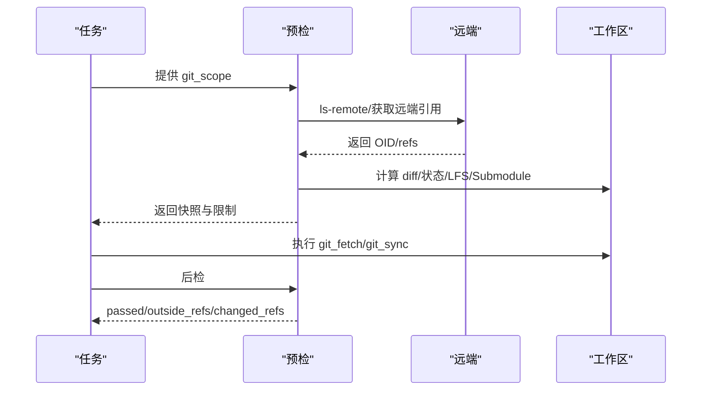
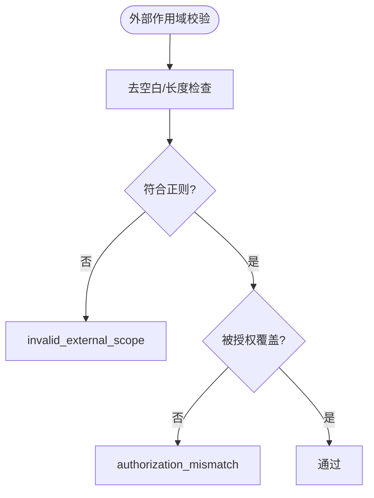
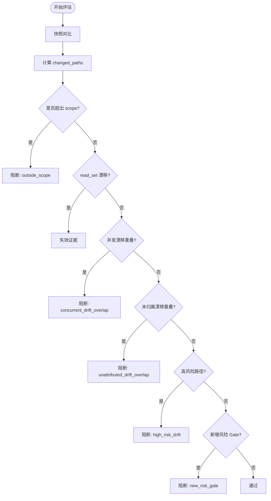
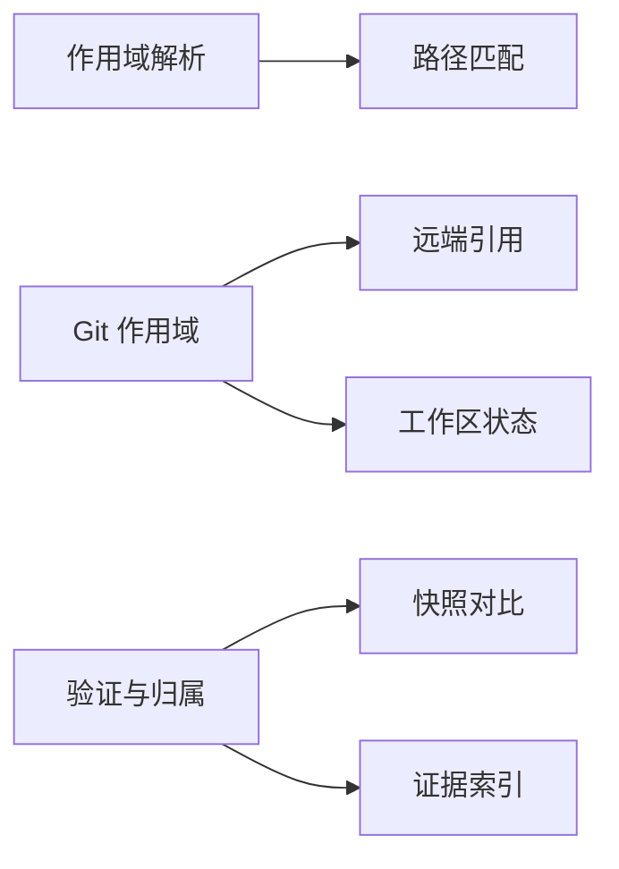

# 范围评估系统

<cite>
**本文引用的文件**   
- [harness.py](file://scripts/harness.py)
- [test_harness.py](file://tests/test_harness.py)
- [INDEX.md](file://harness-home/rules/INDEX.md)
- [scope-change-readmission.md](file://harness-home/rules/scope-change-readmission.md)
</cite>

## 目录
1. [简介](#简介)
2. [项目结构](#项目结构)
3. [核心组件](#核心组件)
4. [架构总览](#架构总览)
5. [详细组件分析](#详细组件分析)
6. [依赖关系分析](#依赖关系分析)
7. [性能考量](#性能考量)
8. [故障排查指南](#故障排查指南)
9. [结论](#结论)
10. [附录：配置示例与规则要点](#附录配置示例与规则要点)

## 简介
本文件面向 Docs Harness 的范围评估系统，系统性阐述四种作用域类型的工作原理与边界约束：read_scope（读取权限控制）、write_scope（写入权限控制）、git_scope（Git 操作边界）与 external_scope（外部资源访问限制）。文档覆盖路径匹配规则（glob、项目内相对路径校验、受控 Git 资源检查）、边界评估算法（越界检测与风险判定）、错误处理机制（如 invalid_scope_description 等），并提供可操作的配置示例与最佳实践。

## 项目结构
Docs Harness 的核心逻辑集中在脚本文件中，测试用例位于 tests 目录，通用规则快照位于 harness-home/rules。范围评估的关键实现包括：
- 作用域解析与校验：validate_scope、scope_covers、validate_external_scope
- Git 作用域与预检/后检：git_scope_target、git_preflight_contract、git_postcheck
- 变更归属与越界检测：actual_scope_change、workspace_change_attribution
- 授权与范围一致性校验：authorization 相关流程中的 uncovered_scope/uncovered_git/uncovered_external 检查

图表来源
- [harness.py:2334-2381](file://scripts/harness.py#L2334-L2381)
- [harness.py:661-791](file://scripts/harness.py#L661-L791)
- [harness.py:5231-5340](file://scripts/harness.py#L5231-L5340)
- [harness.py:4290-4328](file://scripts/harness.py#L4290-L4328)

章节来源
- [harness.py:2334-2381](file://scripts/harness.py#L2334-L2381)
- [harness.py:661-791](file://scripts/harness.py#L661-L791)
- [harness.py:5231-5340](file://scripts/harness.py#L5231-L5340)
- [harness.py:4290-4328](file://scripts/harness.py#L4290-L4328)

## 核心组件
- read_scope：声明允许读取的路径集合，用于证据读集漂移检测与并发冲突判断。
- write_scope：声明允许写入的路径集合，越界写入将触发阻断。
- git_scope：限定 Git 操作的作用域，支持 .git:history 与 .git:refs/remotes/<remote>/<branch> 模式；git_sync 要求精确分支且需 fast-forward。
- external_scope：限定外部目标标识，严格白名单校验，禁止敏感字符与空格。

关键函数与职责：
- validate_scope：规范化路径、拒绝描述性文本、校验相对路径安全（无“..”、无前缀“/”、无“:”），支持受控 Git 资源。
- scope_covers：基于 glob 与路径前缀匹配，支持 “*”、“**” 通配符。
- validate_external_scope：对字符串进行强正则校验，长度与字符集限制。
- git_scope_target/git_preflight_contract/git_postcheck：解析并约束远端 refs，生成预检快照，执行后校验变化与一致性。
- workspace_change_attribution：对比冻结快照与实际工作区，识别未归属变更、读集漂移、并发漂移与高风险路径，产出 blockers/warnings。

章节来源
- [harness.py:2334-2381](file://scripts/harness.py#L2334-L2381)
- [harness.py:661-791](file://scripts/harness.py#L661-L791)
- [harness.py:5231-5340](file://scripts/harness.py#L5231-L5340)

## 架构总览
范围评估贯穿任务准入、执行与验证阶段：
- 准入阶段：根据 facts 与 CLI 参数构建任务包，解析 allowed_scope/read_scope/write_scope/git_scope/external_scope，生成 allowed_actions 与 mutation_profile。
- 执行阶段：按作用域限制实际读写与 Git 操作，记录证据的 read_set/write_set/concurrent_drift。
- 验证阶段：通过 workspace_change_attribution 计算变更归属，结合授权一致性检查，决定是否放行或阻断。

图表来源
- [harness.py:2334-2381](file://scripts/harness.py#L2334-L2381)
- [harness.py:661-791](file://scripts/harness.py#L661-L791)
- [harness.py:5231-5340](file://scripts/harness.py#L5231-L5340)

## 详细组件分析

### read_scope：读取权限控制
- 用途：限定任务可读取的文件集合，配合证据 read_set 检测读集漂移与并发冲突。
- 匹配规则：使用 scope_covers 进行 glob/前缀匹配，支持 “*”、“**” 与目录前缀。
- 越界检测：当证据中 read_set 指向的路径不在 read_scope 或 allowed_scope 时，视为漂移，可能触发证据失效或重新准入。
- 典型错误：若 read_scope 包含非结构化描述文本，将被 reject，抛出 invalid_scope_description。

图表来源
- [harness.py:5231-5340](file://scripts/harness.py#L5231-L5340)
- [harness.py:2356-2363](file://scripts/harness.py#L2356-L2363)

章节来源
- [harness.py:5231-5340](file://scripts/harness.py#L5231-L5340)
- [harness.py:2356-2363](file://scripts/harness.py#L2356-L2363)

### write_scope：写入权限控制
- 用途：限定任务可写入的文件集合，越界写入直接阻断。
- 匹配规则：同 scope_covers，支持 glob 与前缀匹配。
- 越界检测：在 workspace_change_attribution 中，reported_writes 若不在 write_scope，将产生 write_scope_violation 阻断。
- 典型错误：write_scope 包含自然语言描述会被 reject，抛出 invalid_scope_description。

图表来源
- [harness.py:5231-5340](file://scripts/harness.py#L5231-L5340)
- [harness.py:2334-2353](file://scripts/harness.py#L2334-L2353)

章节来源
- [harness.py:5231-5340](file://scripts/harness.py#L5231-L5340)
- [harness.py:2334-2353](file://scripts/harness.py#L2334-L2353)

### git_scope：Git 操作边界
- 受控资源模式：
  - .git:history：只读历史查看（git_inspect）。
  - .git:refs/remotes/<remote>/<branch-or-glob>：限定远端引用范围；git_sync 必须精确分支（不允许 *?[]）。
- 预检流程：
  - 校验目标为独立 Git 根目录。
  - 解析 remote/ref，获取远端 OID 与 refs 快照。
  - 计算 diff 范围、删除数量阈值、fast-forward 可行性、LFS/Submodule 可用性。
  - 生成 controlled_refs_namespace 与 controlled_ref 以约束后续变化。
- 后检流程：
  - 校验受控 ref 仅发生预期变化，outside_refs 为空。
  - 报告 changed_refs 与一致性检查结果。

图表来源
- [harness.py:661-791](file://scripts/harness.py#L661-L791)
- [harness.py:793-800](file://scripts/harness.py#L793-L800)

章节来源
- [harness.py:661-791](file://scripts/harness.py#L661-L791)
- [harness.py:793-800](file://scripts/harness.py#L793-L800)

### external_scope：外部资源访问限制
- 用途：限定外部目标标识（如远程服务、发布目标），采用严格白名单。
- 校验规则：
  - 去除首尾空白，长度不超过 128。
  - 禁止空格、@、? 等字符，必须符合字母数字及有限符号的正则。
  - 不合法将抛出 invalid_external_scope。
- 授权一致性：authorized_external_scope 必须覆盖 package.external_scope，否则 authorization_mismatch。

图表来源
- [harness.py:2366-2381](file://scripts/harness.py#L2366-L2381)
- [harness.py:4290-4328](file://scripts/harness.py#L4290-L4328)

章节来源
- [harness.py:2366-2381](file://scripts/harness.py#L2366-L2381)
- [harness.py:4290-4328](file://scripts/harness.py#L4290-L4328)

### 路径匹配规则与边界评估算法
- 路径匹配：
  - 支持 “*”、“**” 与 fnmatch 模式。
  - 支持目录前缀匹配（pattern.rstrip("/") + "/"）。
  - 支持 exact 相等匹配。
- 边界评估：
  - actual_scope_change：比较冻结快照与实际工作区，计算 outside 与新增 gates。
  - workspace_change_attribution：综合 reported_writes、concurrent_drift、read_set 漂移，计算 task_outside、concurrent_overlap、unattributed_overlap、risky_concurrent，并生成 blockers 与 warnings。
  - 高风险路径：基于 SAFETY_FLOOR_GATES 与 inferred gates 判定。

图表来源
- [harness.py:5231-5340](file://scripts/harness.py#L5231-L5340)
- [harness.py:2356-2363](file://scripts/harness.py#L2356-L2363)

章节来源
- [harness.py:5231-5340](file://scripts/harness.py#L5231-L5340)
- [harness.py:2356-2363](file://scripts/harness.py#L2356-L2363)

## 依赖关系分析
- 模块耦合：
  - 作用域解析依赖路径匹配与正则校验。
  - Git 作用域依赖远端引用解析与工作区状态探测。
  - 验证阶段依赖快照对比与证据索引。
- 外部依赖：
  - Git 命令（ls-remote、diff、status、lfs、submodule）。
  - JSON 文件读写与原子写入。
- 潜在循环依赖：无直接循环，但存在多阶段数据传递（包构建→预检→执行→验证）。

图表来源
- [harness.py:2334-2381](file://scripts/harness.py#L2334-L2381)
- [harness.py:661-791](file://scripts/harness.py#L661-L791)
- [harness.py:5231-5340](file://scripts/harness.py#L5231-L5340)

章节来源
- [harness.py:2334-2381](file://scripts/harness.py#L2334-L2381)
- [harness.py:661-791](file://scripts/harness.py#L661-L791)
- [harness.py:5231-5340](file://scripts/harness.py#L5231-L5340)

## 性能考量
- 快照对比与 diff：避免全量扫描大目录，优先使用 Git 命令与增量对比。
- LFS/Submodule：预检时快速失败，减少无效执行。
- 证据索引：按需失效与重写，避免全量重建。
- 正则与匹配：尽量使用简单模式，减少复杂 glob 开销。

[本节为通用指导，无需特定文件来源]

## 故障排查指南
常见错误与触发条件：
- invalid_scope_description：read_scope/write_scope/git_scope 中包含描述性文本或非结构化路径。
- invalid_scope：路径不是项目内相对路径（含“..”、前缀“/”、包含“:”）。
- invalid_external_scope：external_scope 不符合白名单规范。
- authorization_mismatch：授权动作或范围未覆盖任务包。
- git_scope_required：Git 操作缺少远端 refs 范围。
- git_remote_unavailable/git_remote_ref_missing：远端不可用或引用不存在。
- git_preflight_failed：预检失败（索引冻结、diff 生成失败等）。
- git_target_object_missing：git_sync 目标对象尚未获取。
- git_sync_scope_ambiguous：git_sync 绑定分支模糊（含通配符）。
- write_scope_violation：写入超出 write_scope。
- read_set_drift：读集指纹不一致。
- concurrent_drift_overlap/unattributed_drift_overlap：并发或未归属漂移与范围重叠。
- high_risk_drift：高风险路径漂移。
- new_risk_gate：新增风险 Gate 需要重新准入。

章节来源
- [harness.py:2334-2381](file://scripts/harness.py#L2334-L2381)
- [harness.py:661-791](file://scripts/harness.py#L661-L791)
- [harness.py:5231-5340](file://scripts/harness.py#L5231-L5340)
- [harness.py:4290-4328](file://scripts/harness.py#L4290-L4328)

## 结论
Docs Harness 的范围评估系统通过严格的四元作用域模型（read/write/git/external）与路径匹配算法，确保任务在执行与验证阶段的边界可控、风险可见、越界可阻断。Git 作用域的预检/后检机制进一步保障远端引用与工作区的一致性。建议在实际使用中遵循最小权限原则，明确声明作用域，避免描述性文本，及时响应 blockers 与 warnings，必要时触发重新准入。

[本节为总结，无需特定文件来源]

## 附录：配置示例与规则要点
- read_scope 示例：
  - 使用 glob 与目录前缀，例如 ["docs/**", "src/core.py"]。
  - 避免自然语言描述，否则会触发 invalid_scope_description。
- write_scope 示例：
  - 限定修改路径，例如 ["README.md", "src/**/*.py"]。
  - 越界写入将阻断并报告 write_scope_violation。
- git_scope 示例：
  - 只读历史：[".git:history"]。
  - 指定远端分支：[".git:refs/remotes/origin/main"]（git_sync 必须精确）。
  - 模糊匹配 fetch：[".git:refs/remotes/origin/*"]（仅 fetch 允许）。
- external_scope 示例：
  - 白名单标识，例如 ["release-target-v1", "deploy.prod.example.com"]。
  - 禁止空格与敏感字符，否则 invalid_external_scope。

规则要点：
- 范围变化重新判断：当实际改动超出已冻结范围时，立即停止并从 run 入口重新准入。
- 安全底线 Gate：security-sensitive、destructive-data、release-external 强制触发，不可降级。
- 证据质量：verified 证据可降低误报，但未归属漂移仍需谨慎处理。

章节来源
- [scope-change-readmission.md:1-29](file://harness-home/rules/scope-change-readmission.md#L1-L29)
- [INDEX.md:1-41](file://harness-home/rules/INDEX.md#L1-L41)
- [test_harness.py:485-502](file://tests/test_harness.py#L485-L502)
- [test_harness.py:503-576](file://tests/test_harness.py#L503-L576)
- [test_harness.py:597-757](file://tests/test_harness.py#L597-L757)