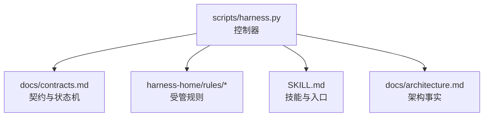
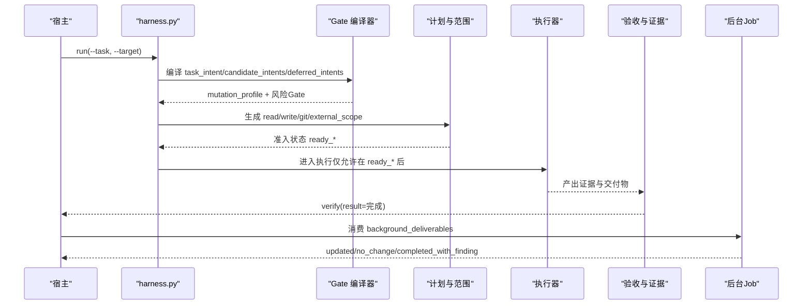
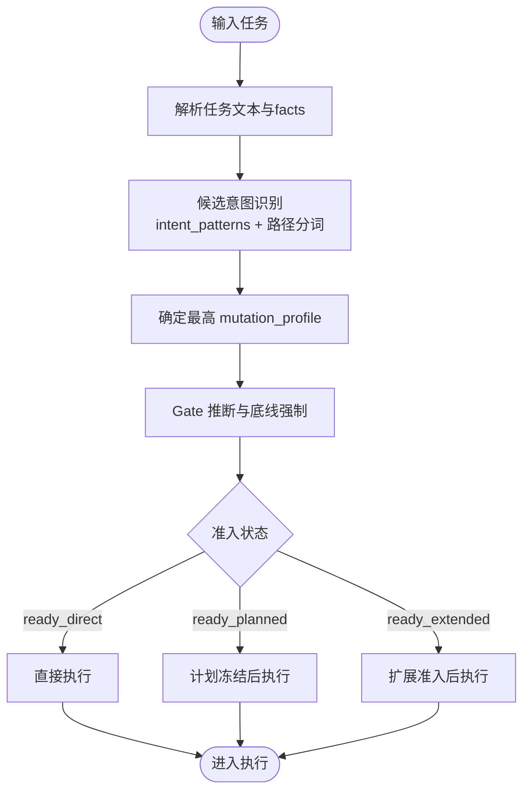
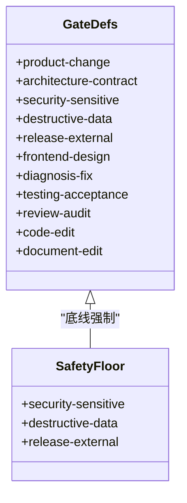
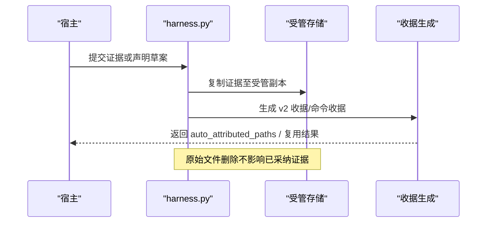
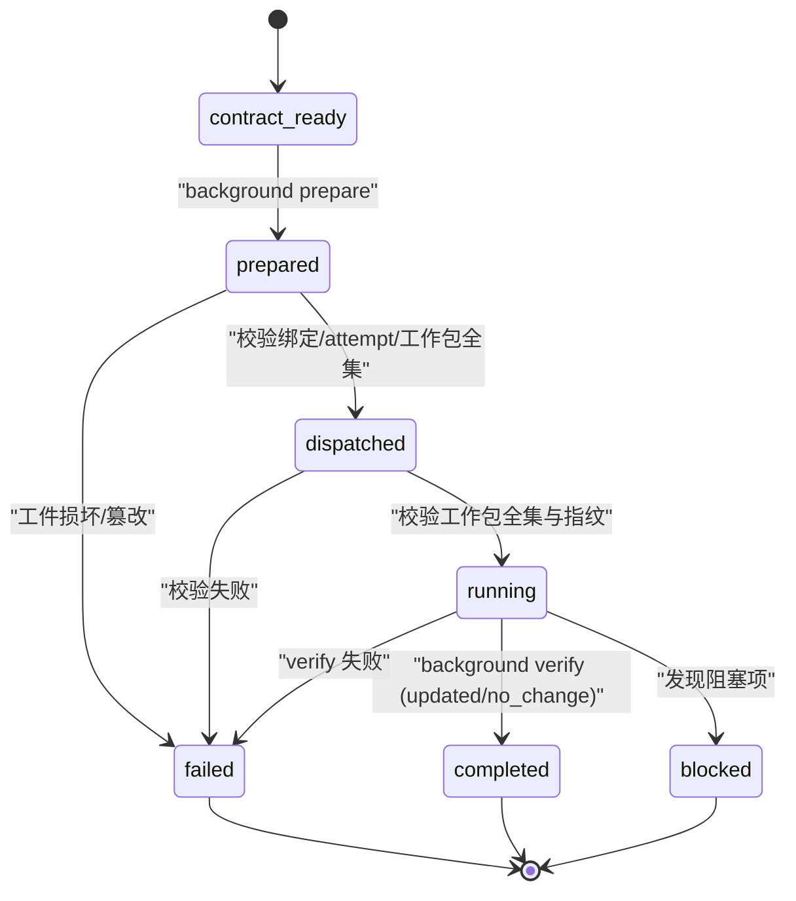
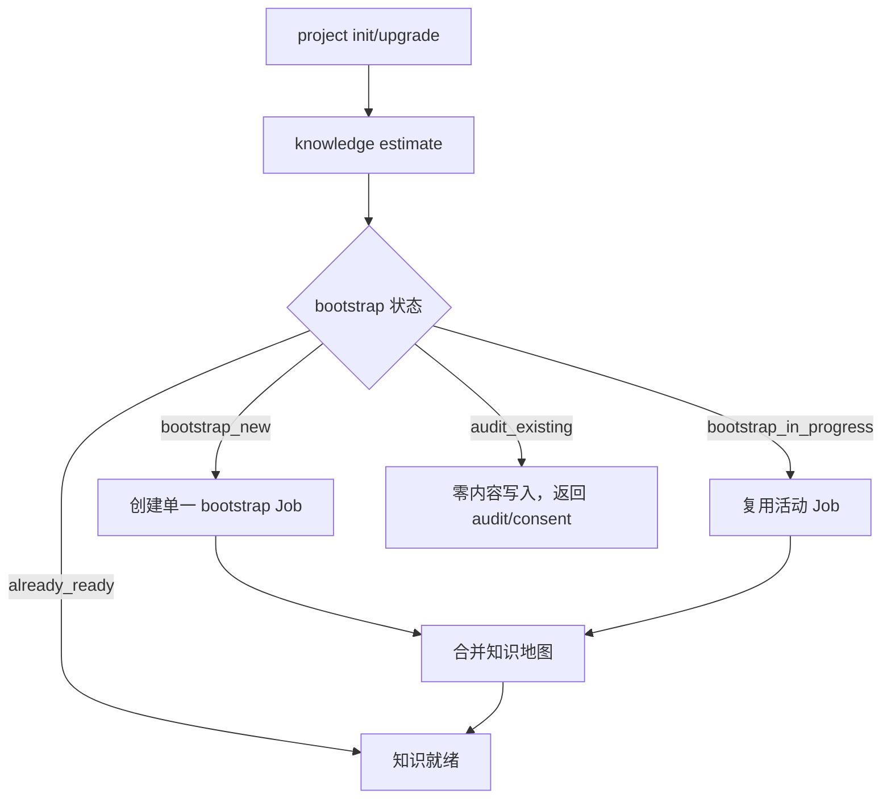
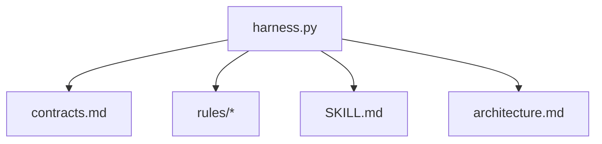

# 核心概念

<cite>
**本文引用的文件**   
- [SKILL.md](file://SKILL.md)
- [architecture.md](file://docs/architecture.md)
- [contracts.md](file://docs/contracts.md)
- [harness.py](file://scripts/harness.py)
- [INDEX.md](file://harness-home/rules/INDEX.md)
- [api-compatibility.md](file://harness-home/rules/api-compatibility.md)
- [external-input-security.md](file://harness-home/rules/external-input-security.md)
- [testing-release.md](file://harness-home/rules/testing-release.md)
- [release-authorization-rollback.md](file://harness-home/rules/release-authorization-rollback.md)
- [v1.6.4-minimal-systemic-flow-efficiency-plan.md](file://docs/plans/v1.6.4-minimal-systemic-flow-efficiency-plan.md)
</cite>

## 目录
1. [引言](#引言)
2. [项目结构](#项目结构)
3. [核心组件](#核心组件)
4. [架构总览](#架构总览)
5. [详细组件分析](#详细组件分析)
6. [依赖关系分析](#依赖关系分析)
7. [性能考量](#性能考量)
8. [故障排查指南](#故障排查指南)
9. [结论](#结论)
10. [附录](#附录)

## 引言
本文件面向开发者与使用者，系统化阐述 Docs Harness 的核心概念与实现要点，包括：
- 意图驱动架构：任务意图编译、候选意图识别、延迟意图处理机制
- 风险门控（Gate）多层防护：安全敏感、数据破坏性、外部发布等关键类型及处理策略
- 证据链管理：从证据收集、验证到收据生成的完整流程
- 后台任务模型：状态机设计与工作包管理机制
- 知识图谱构建与维护、上下文自动生成原理
- 实践示例与配置选项，帮助落地应用

## 项目结构
Docs Harness 以独立控制器为核心，围绕“合同 + 规则 + 运行时”的治理体系组织。关键位置与职责如下：
- scripts/harness.py：控制器源码真源，负责项目安装与升级、任务准入、上下文、验收、知识生命周期与后台 Job 状态机
- harness-home/rules/*：受管规则快照，随项目安装并校验指纹一致性
- docs/contracts.md：对外行为、契约与状态机定义
- SKILL.md：技能说明、安装与使用入口
- docs/architecture.md：架构事实与边界说明

图表来源
- [architecture.md:1-26](file://docs/architecture.md#L1-L26)
- [contracts.md:1-30](file://docs/contracts.md#L1-L30)

章节来源
- [architecture.md:1-26](file://docs/architecture.md#L1-L26)
- [SKILL.md:1-35](file://SKILL.md#L1-L35)

## 核心组件
- 意图驱动执行面：基于 task-package/v2 的意图集合与变更面（mutation_profile），按 Gate 决定路由与准入
- 风险门控系统：GATE_ORDER 与 GATE_DEFS 定义优先级与触发词表，安全底线 Gate 不可豁免
- 证据链系统：evidence-receipt/v2 与 verification-command-receipt/v1 形成可审计、可复用的证据与命令收据
- 后台任务模型：background-job/v2，支持 direct/goal/phased 三种路线与工作包进度
- 知识与上下文：knowledge-map/v1、context-receipt/v2 与增量复用策略

章节来源
- [contracts.md:9-80](file://docs/contracts.md#L9-L80)
- [harness.py:197-230](file://scripts/harness.py#L197-L230)
- [harness.py:260-342](file://scripts/harness.py#L260-L342)
- [harness.py:240-257](file://scripts/harness.py#L240-L257)

## 架构总览
Docs Harness 通过“控制器 + 契约 + 规则 + 运行时”的分层治理，将用户任务转化为受控的执行计划，并在每个阶段进行 Gate 校验与证据采集。

图表来源
- [SKILL.md:25-55](file://SKILL.md#L25-L55)
- [contracts.md:9-80](file://docs/contracts.md#L9-L80)
- [contracts.md:303-348](file://docs/contracts.md#L303-L348)

## 详细组件分析

### 意图驱动架构：任务意图编译、候选意图识别与延迟意图处理
- 意图集合与变更面映射：query/audit/git_inspect/git_fetch/git_sync/modify/external_write 对应 read_only/git_metadata_write/workspace_write/external_write
- 候选意图识别：基于关键词与路径分词匹配，区分只读与写入意图，避免误命中
- 延迟意图处理：未来子句进入 deferred_intents，完成体仅作为审查上下文，不授权当前写入
- 幂等复用：同一 target、归一化任务文本、事实指纹与工作区快照命中活动任务时返回 active_task_reused

图表来源
- [harness.py:197-230](file://scripts/harness.py#L197-L230)
- [contracts.md:9-48](file://docs/contracts.md#L9-L48)

章节来源
- [harness.py:197-230](file://scripts/harness.py#L197-L230)
- [contracts.md:9-48](file://docs/contracts.md#L9-L48)

### 风险门控系统：多层防护与底线强制
- Gate 顺序与定义：GATE_ORDER 与 GATE_DEFS 规定优先级、事实来源、方案字段与证据类型
- 安全底线 Gate：security-sensitive、destructive-data、release-external 由控制器强制兜底，宿主只能加不能减
- 文本触发精确词表与否定守卫：避免“不要部署”“删除注释”等误命中
- 声明式 gate_assessment：宿主提交权威语义判断，跳过非安全 Gate 的关键词与路径推断

图表来源
- [harness.py:260-342](file://scripts/harness.py#L260-L342)
- [harness.py:381-389](file://scripts/harness.py#L381-L389)

章节来源
- [harness.py:260-342](file://scripts/harness.py#L260-L342)
- [harness.py:381-389](file://scripts/harness.py#L381-L389)
- [api-compatibility.md:1-29](file://harness-home/rules/api-compatibility.md#L1-L29)
- [external-input-security.md:1-29](file://harness-home/rules/external-input-security.md#L1-L29)
- [testing-release.md:1-29](file://harness-home/rules/testing-release.md#L1-L29)
- [release-authorization-rollback.md:1-29](file://harness-home/rules/release-authorization-rollback.md#L1-L29)

### 证据链管理：收集、验证与收据生成
- evidence-receipt/v2：绑定 task_id、target_identity、package_fingerprint、producer、时间戳、TTL、exit_code、digest、read_set/write_set
- 验证命令收据：verification-command-receipt/v1，逐项缓存与复用，失败或输入变化才重跑
- 自动归因：write_scope 内未归因写入默认代铸 workspace_attribution 收据，可通过配置恢复补证据流程
- 受管副本：证据文件复制进受管 artifact store，原始文件删除不影响已采纳证据

图表来源
- [contracts.md:165-221](file://docs/contracts.md#L165-L221)

章节来源
- [contracts.md:165-221](file://docs/contracts.md#L165-L221)

### 后台任务模型：状态机与工作包管理
- 背景 Job 合同：background-job/v2，固定 may_mutate_parent=false、may_spawn_child_jobs=false、suppress_post_completion_dispatch=true
- 复杂路线：background_goal/background_goal_phased，需 prepare → dispatched → running → progress → verify
- 工作包状态：pending/in_progress/completed/blocked，严格转换与幂等
- 等待 bootstrap：非终态初始化期间进入 waiting_for_bootstrap_merge，bootstrap 成功且知识 ready 才释放

图表来源
- [contracts.md:303-348](file://docs/contracts.md#L303-L348)
- [SKILL.md:59-90](file://SKILL.md#L59-L90)

章节来源
- [contracts.md:303-348](file://docs/contracts.md#L303-L348)
- [SKILL.md:59-90](file://SKILL.md#L59-L90)

### 知识图谱构建与维护、上下文自动生成
- knowledge-map/v1：约束功能文档与类别，支持 project_wide/change_scoped 估算
- context-receipt/v2：跨阶段复用上下文正文，按 stage/compiler_contract/content_set_fingerprint 判定命中
- 增量与冻结：首次 freeze.json.workspace_snapshot 为基线，后续漂移按五级处置处理
- 自动候选与治理：未显式配置的文档类别扫描项目根与 docs/，唯一可信候选才能解析

图表来源
- [contracts.md:340-348](file://docs/contracts.md#L340-L348)
- [contracts.md:222-234](file://docs/contracts.md#L222-L234)

章节来源
- [contracts.md:340-348](file://docs/contracts.md#L340-L348)
- [contracts.md:222-234](file://docs/contracts.md#L222-L234)

## 依赖关系分析
- 控制器对契约与规则的强依赖：所有 Gate、范围、证据与后台 Job 均受 contracts.md 与 rules/* 约束
- 运行时隔离：Git 与非 Git 项目的运行态写入不同目录，确保控制面与业务面分离
- 幂等与去重：active_task_key、command_cache、context_receipt 等多维度去重减少重复工作

图表来源
- [architecture.md:1-26](file://docs/architecture.md#L1-L26)
- [contracts.md:1-30](file://docs/contracts.md#L1-L30)

章节来源
- [architecture.md:1-26](file://docs/architecture.md#L1-L26)
- [contracts.md:1-30](file://docs/contracts.md#L1-L30)

## 性能考量
- 最小系统性原则：只有发生变化的合同分段失效；不变的内容、计划、授权、上下文与验证收据继续复用
- 验证命令逐项缓存：输入不变则复用收据，失败或输入变化才重跑
- 活动任务幂等：active_task_key 避免重复创建任务
- 增量准入：普通新增 Gate 且合同稳定时走 incremental_admission，继承同轮证据

章节来源
- [v1.6.4-minimal-systemic-flow-efficiency-plan.md:13-609](file://docs/plans/v1.6.4-minimal-systemic-flow-efficiency-plan.md#L13-L609)
- [contracts.md:153-163](file://docs/contracts.md#L153-L163)

## 故障排查指南
- 常见退出码含义：0 成功；1 项目检查失败；2 输入/合同无效；3 需要方案/授权/证据/迁移；4 范围/Gate/规则变化需重新准入
- Git 预检失败：远端不可用、ref 越界、非 fast-forward、脏工作区重叠、删除阈值超限、LFS/Submodule 不可验证
- 证据与收据问题：过期、跨任务/目标、不可信生产者、非零退出、摘要无效
- 后台 Job 失败：工件损坏/篡改需 repair；retry 归档旧 attempt 并推进 attempt

章节来源
- [contracts.md:359-370](file://docs/contracts.md#L359-L370)
- [contracts.md:97-133](file://docs/contracts.md#L97-L133)
- [contracts.md:165-221](file://docs/contracts.md#L165-L221)
- [contracts.md:332-348](file://docs/contracts.md#L332-L348)

## 结论
Docs Harness 通过意图驱动、风险门控、证据链与后台任务模型的协同，实现了高可控、可审计、可扩展的任务治理体系。其分层设计确保了安全底线不被绕过，同时通过幂等、缓存与增量准入提升效率。开发者应遵循契约与规则，合理声明意图与范围，利用证据与收据保障可追溯性，借助后台 Job 完成异步治理。

## 附录
- 安装与入口：参考 SKILL.md 的安装命令与 run/verify/background 系列 CLI
- 规则激活：harness-home/rules/INDEX.md 列出 active_rules 与加载约定
- 配置项：verification.volatile_paths、verification.auto_attribute_in_scope、verification.command_cache_enabled 等

章节来源
- [SKILL.md:13-35](file://SKILL.md#L13-L35)
- [INDEX.md:1-41](file://harness-home/rules/INDEX.md#L1-L41)
- [contracts.md:190-221](file://docs/contracts.md#L190-L221)