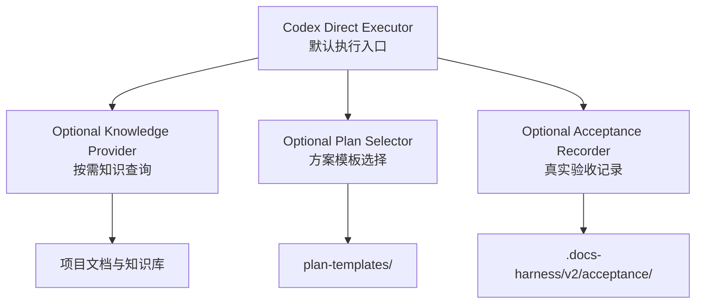
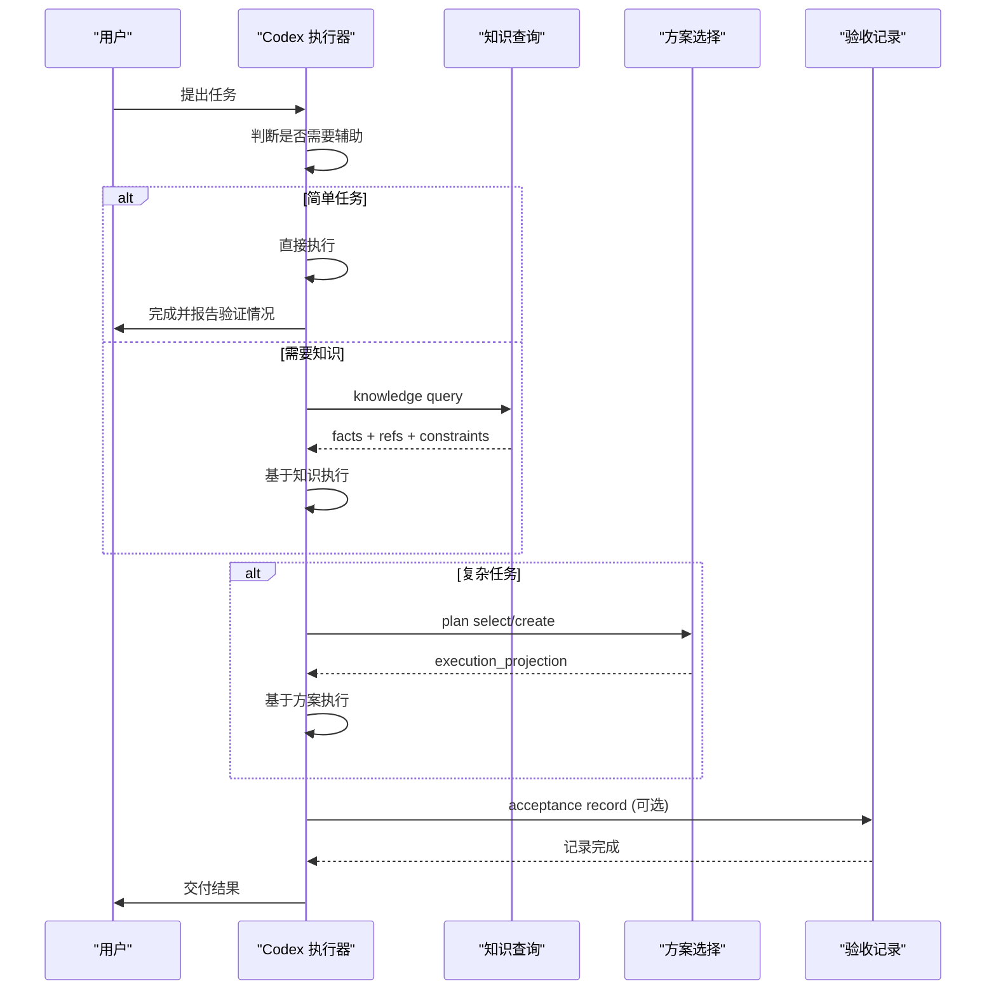
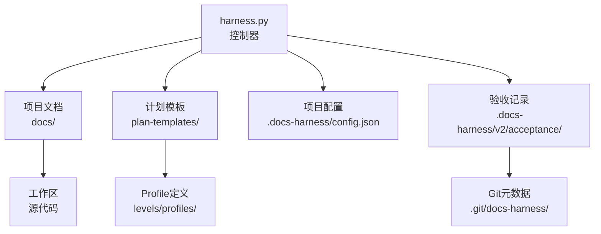

# 核心概念

<cite>
**本文引用的文件**   
- [SKILL.md](file://SKILL.md)
- [architecture.md](file://docs/architecture.md)
- [harness.py](file://scripts/harness.py)
- [v2.0.0迁移指南](file://docs/migrations/v2.0.0.md)
- [2.0.0直接执行方案](file://docs/plans/docs-harness-v2.0.0-direct-first-plan.md)
- [package.json](file://package.json)
- [test_v2_direct.py](file://tests/test_v2_direct.py)
</cite>

## 更新摘要
**所做更改**
- 完全重写核心概念以反映从1.x到2.0.0的根本性架构转变
- 移除所有关于意图驱动架构、风险门控、证据链、后台任务和知识图谱的内容
- 新增直接执行模型、按需知识、方案模板和真实验收的核心概念
- 更新架构图和流程图以反映新的工作流程
- 添加迁移边界和兼容性说明

## 目录
1. [引言](#引言)
2. [项目结构](#项目结构)
3. [核心组件](#核心组件)
4. [架构总览](#架构总览)
5. [详细组件分析](#详细组件分析)
6. [依赖关系分析](#依赖关系分析)
7. [性能考量](#性能考量)
8. [故障排查指南](#故障排查指南)
9. [结论](#结论)
10. [附录](#附录)

## 引言
Docs Harness 2.0.0 是一个根本性的产品重构，从强制性的任务治理系统转变为默认直接执行的辅助工具。新版本不再要求每个任务都经过复杂的审批流程，而是让 Codex 直接处理普通任务，仅在需要时提供知识、方案和验收记录等辅助能力。

**主要变更：**
- **移除**：意图驱动架构、风险门控系统、证据链管理、后台任务模型、知识图谱系统
- **新增**：直接执行模型、按需知识查询、方案模板选择、真实验收记录
- **简化**：高风险动作直接使用 Codex 原生授权，不再建立第二套控制系统

## 项目结构
Docs Harness 2.0.0 采用极简设计，只包含必要的辅助能力：



**关键位置与职责：**
- `scripts/harness.py`：控制器源码，实现知识查询、方案选择和验收记录功能
- `plan-templates/`：方案模板注册表，定义不同复杂度任务的模板结构
- `.docs-harness/config.json`：项目配置，记录安装状态和迁移信息
- `docs/migrations/v2.0.0.md`：单向迁移指南，清理旧版本工件

**章节来源**
- [architecture.md:5-18](file://docs/architecture.md#L5-L18)
- [SKILL.md:11-18](file://SKILL.md#L11-L18)

## 核心组件
Docs Harness 2.0.0 由三个独立的可选组件构成：

### 1. 直接执行模型（默认）
- 普通任务直接由 Codex 执行，不调用任何 Harness 功能
- 支持问答、只读检查、代码修改、构建测试等常见任务
- 零调用开销，无任务控制状态，无运行时遥测

### 2. 按需知识提供者
- 显式只读查询器，不自动注入或维护知识
- 返回短事实、引用、约束和冲突信息
- 当前源码和运行态始终优先于知识摘要

### 3. 方案模板选择器
- 按复杂度和领域选择合适模板
- 简单任务不生成方案，复杂任务使用最小充分方案
- 冻结方案后只传递执行投影给 Codex

### 4. 真实验收记录器
- 记录已发生的真实测试、运行、构建、安装和用户验收
- 区分 L1-L5 五个验收层级
- 不替 Codex 决定测试，不自动启动环境

**章节来源**
- [harness.py:22-31](file://scripts/harness.py#L22-L31)
- [harness.py:439-506](file://scripts/harness.py#L439-L506)
- [harness.py:526-696](file://scripts/harness.py#L526-L696)
- [harness.py:705-800](file://scripts/harness.py#L705-L800)

## 架构总览
2.0.0 架构采用"默认直跑，按需辅助"的设计原则：



**图表来源**
- [architecture.md:20-55](file://docs/architecture.md#L20-L55)
- [harness.py:439-506](file://scripts/harness.py#L439-L506)
- [harness.py:526-696](file://scripts/harness.py#L526-L696)

## 详细组件分析

### 直接执行模型：默认行为与边界
2.0.0 的核心设计理念是让 Codex 直接处理大多数任务，只在确实需要时才启用辅助功能。

**默认行为：**
- 不调用 Harness CLI
- 不创建任务控制状态
- 不生成 Gate、Evidence、Receipt
- 不加载知识库或方案
- 不调用旧版 Verify

**适用场景：**
- 普通问答和解释
- 只读检查和信息查询
- Git 状态和历史查询
- 已知文件的简单修改
- 明确 Bug 修复
- Codex 已有足够上下文的任务

**安全边界：**
- 高风险动作（删除、发布、部署等）仍受 Codex 原生权限保护
- Harness 不建立第二套授权系统
- 所有不可逆操作都需要明确的宿主授权

**章节来源**
- [SKILL.md:13-18](file://SKILL.md#L13-L18)
- [architecture.md:14-18](file://docs/architecture.md#L14-L18)
- [2.0.0直接执行方案:215-248](file://docs/plans/docs-harness-v2.0.0-direct-first-plan.md#L215-L248)

### 按需知识查询：有界只读检索
知识查询是显式的、有界的、无状态的只读操作，不会改变项目状态。

**查询机制：**
- 必须提供具体的 `--query` 参数
- 限制结果数量（`--limit`，默认10）
- 限制字符预算（`--max-chars`，默认500-12000）
- 支持路径范围过滤（`--scope`）

**返回内容：**
- `facts`：相关的事实片段
- `refs`：引用路径和行号
- `constraints`：必须遵守的约束
- `conflicts`：冲突检测
- `omitted`：被省略的原因

**优先级规则：**
- 当前源码和运行态 > 项目知识摘要 > 历史记录
- 排除 `docs/history/`、`docs/plans/`、`docs/reviews/`
- 不跟随外部符号链接

**章节来源**
- [harness.py:439-506](file://scripts/harness.py#L439-L506)
- [SKILL.md:20-30](file://SKILL.md#L20-L30)

### 方案模板选择：结构化复杂度评估
方案选择基于任务的复杂度和修改面，而不是任务文本本身。

**选择逻辑：**
- `none`：简单任务，直接执行
- `brief`：中等复杂度，目标、范围、步骤、验收
- `full`：复杂任务，完整模板加领域 Profile

**领域 Profile：**
- `general`：通用任务
- `frontend_ui`：前端界面修改
- `backend_service`：后端服务开发
- `bugfix`：Bug 修复
- `architecture`：架构决策
- `migration_release`：迁移发布

**方案冻结：**
- 验证字段完整性
- 计算指纹确保一致性
- 只传递 `execution_projection` 给执行阶段
- 拒绝未注册字段和篡改的选择

**章节来源**
- [harness.py:526-696](file://scripts/harness.py#L526-L696)
- [SKILL.md:32-56](file://SKILL.md#L32-L56)

### 真实验收记录：分层验证体系
验收记录器记录已经发生的真实验证活动，不替 Codex 做决定。

**五个验收层级：**
- **L1**：源码合同检查（lint、类型、编译）
- **L2**：聚焦行为验证（单元、接口、组件）
- **L3**：本地运行时验证（应用、服务流程）
- **L4**：包或安装产物验证
- **L5**：用户可见体验验证

**验收类型：**
- `contract_check`：源码与合同一致性
- `behavior_acceptance`：行为正确性验证
- `user_acceptance`：用户最终接受

**约束规则：**
- Contract Check 通过必须是 L1
- Behavior Acceptance 通过必须是 L2-L4
- 独立 CLI 不能声明用户已验收
- 失败验收必须提供原因和下一步

**章节来源**
- [harness.py:705-800](file://scripts/harness.py#L705-L800)
- [SKILL.md:62-78](file://SKILL.md#L62-L78)

### 迁移边界：从1.x到2.0.0的单向升级
2.0.0 不是兼容升级，而是一次彻底的架构替换。

**清理的旧工件：**
- 规则文件（`.docs-harness/harness-home/rules/`）
- 知识地图（`docs/knowledge-map.json`）
- 任务状态（`runs/`、`knowledge/`、`background/`）
- 旧 Runtime 数据

**保留的项目内容：**
- 业务文档和 ADR
- 用户自定义的方案模板
- 质量账本和测试结果
- 归属不明的文件

**迁移原则：**
- 先预览再应用
- 机器可验证所有权
- 不覆盖用户修改
- 失败关闭保证安全

**章节来源**
- [v2.0.0迁移指南:15-23](file://docs/migrations/v2.0.0.md#L15-L23)
- [v2.0.0迁移指南:68-95](file://docs/migrations/v2.0.0.md#L68-L95)

## 依赖关系分析
2.0.0 架构的依赖关系更加清晰和简单：



**关键依赖：**
- 控制器对模板注册表的强依赖
- 知识查询对项目文档结构的约定
- 验收记录对 Git 或非 Git 项目的适配
- 配置文件的 Schema 版本管理

**隔离特性：**
- 各组件独立可用，互不影响
- 无全局状态，无任务间共享数据
- 幂等操作，重复执行安全

**章节来源**
- [architecture.md:57-68](file://docs/architecture.md#L57-L68)
- [package.json:6-23](file://package.json#L6-L23)

## 性能考量
2.0.0 的性能优化主要体现在减少不必要的调用和简化流程：

**直接模式优势：**
- 零 Harness 调用开销
- 无任务状态管理
- 无规则加载和校验
- 无知识索引和维护

**按需模式优化：**
- 知识查询有界且快速
- 方案选择基于结构化输入
- 验收记录轻量级存储
- 无后台任务调度

**资源使用：**
- 内存占用显著降低
- CPU 使用集中在实际执行
- 磁盘空间用于必要配置
- 网络调用仅用于外部依赖

**章节来源**
- [2.0.0直接执行方案:135-211](file://docs/plans/docs-harness-v2.0.0-direct-first-plan.md#L135-L211)

## 故障排查指南
2.0.0 的故障排查更加直接和透明：

**常见错误类型：**
- `invalid_target`：项目目录不存在或无效
- `invalid_json`：配置文件格式错误
- `install_conflict`：安装冲突或权限问题
- `legacy_document_cleanup_conflict`：迁移过程中的冲突

**知识查询问题：**
- 查询结果为空：检查查询关键词和文档结构
- 字符预算不足：调整 `--max-chars` 参数
- 路径越界：确认 `--scope` 参数在项目内

**方案选择问题：**
- 字段缺失：检查必填字段和模板版本
- 指纹不匹配：重新生成选择文件
- 未注册字段：移除自定义字段

**验收记录问题：**
- 证据缺失：确保证据文件存在
- 层级不匹配：检查验收类型和层级对应关系
- 用户验收：需要真实用户确认，不能自动声明

**章节来源**
- [test_v2_direct.py:110-133](file://tests/test_v2_direct.py#L110-L133)
- [test_v2_direct.py:606-768](file://tests/test_v2_direct.py#L606-L768)

## 结论
Docs Harness 2.0.0 代表了产品哲学的根本转变：从"所有任务都必须经过治理"到"默认直接执行，按需辅助增强"。这种设计既保留了有价值的辅助能力，又消除了不必要的复杂性，让 Codex 能够更高效地处理大多数任务。

**核心价值：**
- 简化默认流程，提升生产力
- 保留按需辅助能力，应对复杂场景
- 明确的安全边界，使用原生授权
- 清晰的迁移路径，保护现有投资

**适用场景：**
- 个人项目和小型团队
- 快速迭代的开发环境
- 对治理复杂度敏感的组织
- 需要灵活性的创新项目

## 附录
**安装与初始化：**
```bash
python3 scripts/harness.py project init --target <project> --json
python3 scripts/harness.py project upgrade --target <project> --apply --json
```

**常用命令：**
```bash
# 知识查询
python3 scripts/harness.py knowledge query --target . --query "具体事实" --json

# 方案选择
python3 scripts/harness.py plan select --target . --complexity complex --json

# 验收记录
python3 scripts/harness.py acceptance record --target . --input acceptance.json --json
```

**配置选项：**
- `direct_mode.default`：是否默认直接执行
- `knowledge.mode`：知识模式（on_demand）
- `knowledge.read_only`：知识查询是否只读

**章节来源**
- [SKILL.md:89-97](file://SKILL.md#L89-L97)
- [v2.0.0迁移指南:120-143](file://docs/migrations/v2.0.0.md#L120-L143)