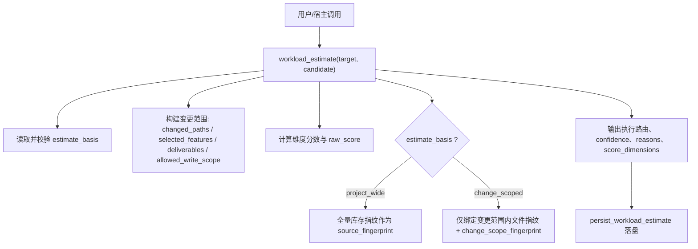
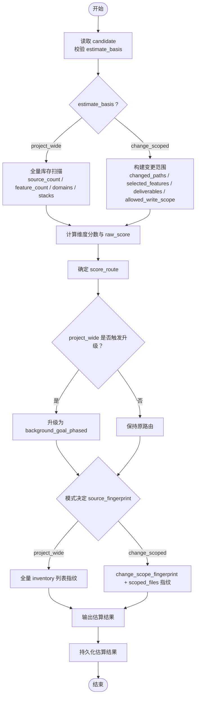
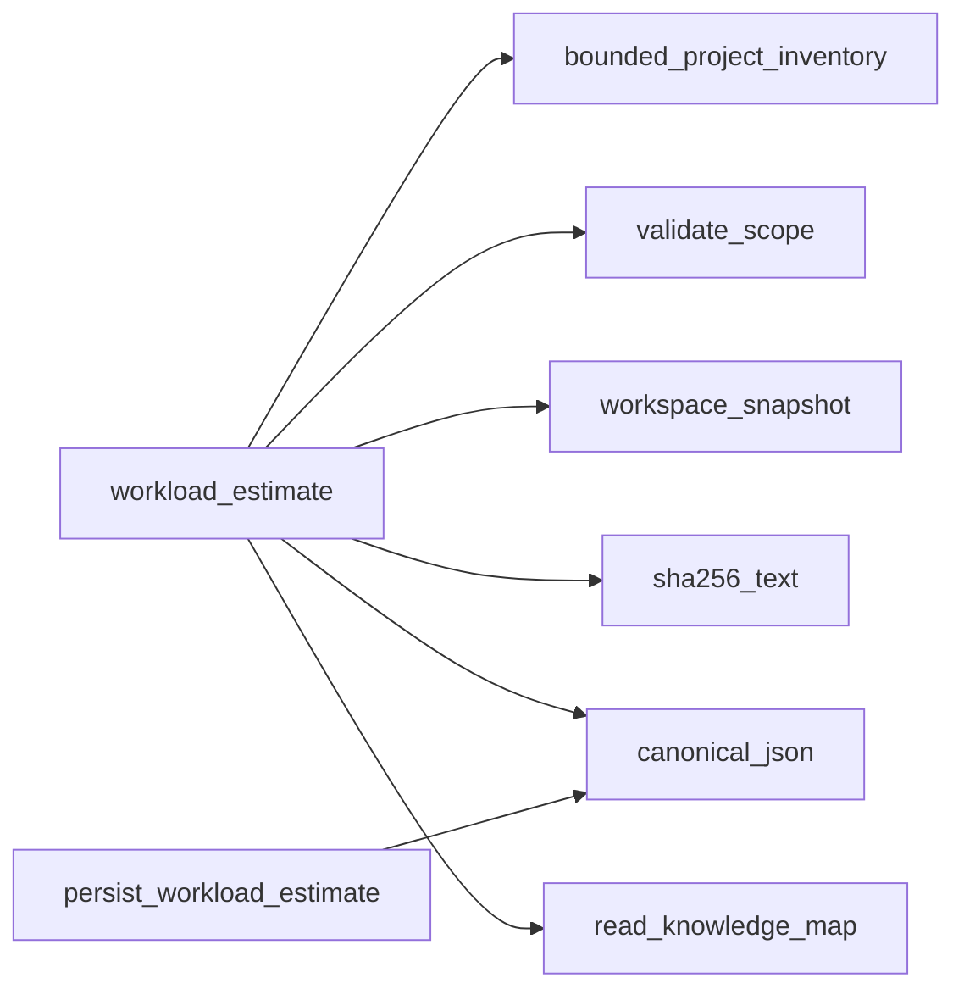

# 工作量估算

<cite>
**本文引用的文件**   
- [scripts/harness.py](file://scripts/harness.py)
- [docs/contracts.md](file://docs/contracts.md)
- [tests/test_harness.py](file://tests/test_harness.py)
</cite>

## 目录
1. [简介](#简介)
2. [项目结构](#项目结构)
3. [核心组件](#核心组件)
4. [架构总览](#架构总览)
5. [详细组件分析](#详细组件分析)
6. [依赖关系分析](#依赖关系分析)
7. [性能考量](#性能考量)
8. [故障排查指南](#故障排查指南)
9. [结论](#结论)
10. [附录](#附录)

## 简介
本文件面向 Docs Harness 的工作量估算系统，系统性阐述两种估算模式（project_wide 与 change_scoped）的差异、适用场景与配置方法；解释 estimate_basis 的作用与输入约束；说明 change_scoped 模式下范围限定机制（changed_paths、selected features、deliverables 与允许写入范围）如何影响路由与幂等键；给出 confidence 评分的计算逻辑与影响因素；明确 source_fingerprint 在不同模式下的绑定策略；并提供估算配置示例与性能调优建议。

## 项目结构
- 估算核心实现位于脚本主程序 scripts/harness.py，包含 workload_estimate 函数及持久化、指纹计算、范围校验等辅助逻辑。
- 契约与行为约定在 docs/contracts.md 中统一描述，包括 estimate_basis 默认值、change_scoped 的幂等语义与置信度降级规则。
- 测试用例 tests/test_harness.py 覆盖关键路径与边界条件，用于验证估算结果、路由选择与幂等键稳定性。

**图表来源** 
- [scripts/harness.py:7948-8154](file://scripts/harness.py#L7948-L8154)
- [scripts/harness.py:8157-8166](file://scripts/harness.py#L8157-L8166)

**章节来源**
- [scripts/harness.py:7948-8154](file://scripts/harness.py#L7948-L8154)
- [docs/contracts.md:346](file://docs/contracts.md#L346)

## 核心组件
- workload_estimate：估算入口，负责模式选择、范围限定、维度打分、路由决策、置信度判定与指纹生成。
- persist_workload_estimate：基于关键字段生成估计 ID 并持久化估算结果，保证幂等。
- 范围与指纹工具：validate_scope、workspace_snapshot、sha256_text、canonical_json 等。

关键职责与交互：
- 接收 candidate 参数，解析 estimate_basis 与变更范围字段，进行长度与类型校验。
- 根据模式选择有效统计口径（源码文件数、功能候选、架构域、技术栈、知识缺口、跨功能依赖）。
- 计算 raw_score 并映射到 score_route，再按 project_wide 的额外规则决定是否升级至 phased。
- 生成 change_scope_fingerprint（仅在 change_scoped 模式），并按模式决定 source_fingerprint 的组成。
- 输出 confidence、execution_route、requires_plan、score_dimensions 等结构化结果。

**章节来源**
- [scripts/harness.py:7948-8154](file://scripts/harness.py#L7948-L8154)
- [scripts/harness.py:8157-8166](file://scripts/harness.py#L8157-L8166)

## 架构总览
下图展示估算流程从输入到输出的关键步骤，以及两种模式的分支差异。

**图表来源** 
- [scripts/harness.py:7948-8154](file://scripts/harness.py#L7948-L8154)
- [scripts/harness.py:8157-8166](file://scripts/harness.py#L8157-L8166)

## 详细组件分析

### 估算模式与应用场景
- project_wide：适用于知识 bootstrap、全项目审查与明确要求全量 preserve-and-merge 的任务。该模式使用全仓库库存进行统计与指纹计算，并在满足特定条件时强制升级到 phased 路由。
- change_scoped：适用于知识增量同步与交付治理。通过传入有界的 changed_paths、selected features、deliverables 与 allowed_write_scope，将估算范围严格限定在变更面内，整仓扫描截断仅降低 confidence，不单独强制 phased。

适用性对比：
- 大仓单文件增量：优先使用 change_scoped，避免被文档数量或全仓规模驱动为 phased。
- 全量 bootstrap：保持 project_wide，保留 phased 能力以应对大规模任务。

**章节来源**
- [docs/contracts.md:346](file://docs/contracts.md#L346)
- [scripts/harness.py:7948-8154](file://scripts/harness.py#L7948-L8154)

### estimate_basis 的作用与配置
- 作用：控制估算范围与幂等键绑定策略，决定 source_fingerprint 的组成与路由升级规则。
- 配置方法：在 candidate 对象中设置 estimate_basis 为 "project_wide" 或 "change_scoped"；未声明时默认为 "project_wide"。
- 输入校验：change_scoped 模式下对 changed_paths、selected_features、deliverables、allowed_write_scope 进行长度与元素长度限制，非法输入会抛出错误。

典型用法：
- 内部增量调用点传入受控的 estimate_basis=change_scoped 与变更范围字段。
- 后台 estimate --candidate <file> 使用同一字段并通过路径、数量与长度校验。

**章节来源**
- [docs/contracts.md:346](file://docs/contracts.md#L346)
- [scripts/harness.py:7948-8154](file://scripts/harness.py#L7948-L8154)

### change_scoped 的范围限定机制
- changed_paths：实际变更的文件路径集合，用于筛选源码文件、推导技术栈与架构域。
- selected_features：显式指定的功能集合；若未提供，则基于 changed_paths 的前两级目录推断。
- deliverables：交付物清单，影响知识缺口分数的上限与背景治理策略。
- allowed_write_scope：允许写入范围，参与 scoped_files 的指纹计算，确保幂等键不受范围外无关文件变化影响。

处理流程要点：
- 变更范围内的源码文件数、功能候选数、架构域与技术栈用于重新计算维度分数。
- knowledge_gap 与 cross_feature_dependencies 分数在 change_scoped 下取上限，避免高估。
- change_scope_fingerprint 由 changed_paths、selected_features、deliverables、allowed_write_scope 的规范化 JSON 计算得出。

**章节来源**
- [scripts/harness.py:7948-8154](file://scripts/harness.py#L7948-L8154)

### confidence 评分的计算逻辑与影响因素
- 基本规则：
  - 若整仓扫描被截断（scan_truncated=True），confidence 为 low。
  - 否则，若有效源码文件数为 0，confidence 为 low；否则为 medium。
- 影响因素：
  - scan_truncated：来自 bounded_project_inventory 的返回，表示文件数量超过阈值导致截断。
  - effective_source_count：在 change_scoped 模式下为变更范围内的源码文件数；在 project_wide 模式下为全量源码文件数。

注意：在 change_scoped 模式下，即使整仓扫描被截断，也不会单独强制 phased，只会降低 confidence。

**章节来源**
- [scripts/harness.py:7948-8154](file://scripts/harness.py#L7948-L8154)

### source_fingerprint 的绑定策略
- project_wide 模式：source_fingerprint 基于全量 inventory 列表（path、size）计算，反映整个项目的源码资产状态。
- change_scoped 模式：source_fingerprint 由两部分组成：
  - change_scope_fingerprint：变更范围的规范化指纹。
  - scoped_files：当前工作区快照中属于 changed_paths 或被 allowed_write_scope 覆盖的文件指纹。
- 幂等性保障：范围外无关文件变化不会改变 change_scoped 的 source_fingerprint，从而避免 Job 重复创建。

**章节来源**
- [scripts/harness.py:7948-8154](file://scripts/harness.py#L7948-L8154)

### 路由决策与升级规则
- 基础路由：
  - raw_score ≤ 24 → background_direct
  - 24 < raw_score ≤ 59 → background_goal
  - raw_score > 59 → background_goal_phased
- project_wide 升级条件（任一满足即升级）：
  - 扫描文件限制被触发（scan_truncated）
  - 独立架构域 ≥ 5
  - 存在循环或无主依赖
  - 已有文档数量 ≥ 50（preserve-and-merge）
  - 已有文档数量 ≥ 10 且原路由为 direct（升级为 goal）
- change_scoped 升级：不因整仓文档数强制 phased，仅当实际变化面无法有界时才硬升级。

**章节来源**
- [scripts/harness.py:7948-8154](file://scripts/harness.py#L7948-L8154)

### 估算配置示例与代码演示
以下为常见配置与调用方式（以伪代码形式示意，具体实现参考源文件）：
- project_wide 估算（默认）：
  - 调用 workload_estimate(target)
  - 或使用 candidate={} 显式指定 estimate_basis="project_wide"
- change_scoped 估算：
  - 构造 candidate={
      "estimate_basis": "change_scoped",
      "changed_paths": ["src/core.py", "docs/features/project-core/development.md"],
      "selected_features": ["project-core"],
      "deliverables": ["feature_knowledge_incremental_sync"],
      "allowed_write_scope": ["src/core.py"]
    }
  - 调用 workload_estimate(target, candidate=candidate)

验证与回退：
- 测试用例覆盖了 change_scoped 的 estimate_basis、change_scope_fingerprint 与幂等键稳定性。
- 当 candidate.requires_plan=True 且原路由为 direct 时，强制升级为 goal。

**章节来源**
- [scripts/harness.py:7948-8154](file://scripts/harness.py#L7948-L8154)
- [tests/test_harness.py:2233-2247](file://tests/test_harness.py#L2233-L2247)

## 依赖关系分析
- 模块内依赖：
  - workload_estimate 依赖 bounded_project_inventory、validate_scope、workspace_snapshot、sha256_text、canonical_json 等工具函数。
  - persist_workload_estimate 依赖 canonical_json 与原子写入逻辑。
- 外部集成：
  - Git 操作通过 git_command 封装，用于工作区快照与变更检测。
  - 知识地图读取用于依赖分析与知识缺口评估。

**图表来源** 
- [scripts/harness.py:7948-8154](file://scripts/harness.py#L7948-L8154)
- [scripts/harness.py:8157-8166](file://scripts/harness.py#L8157-L8166)

**章节来源**
- [scripts/harness.py:7948-8154](file://scripts/harness.py#L7948-L8154)
- [scripts/harness.py:8157-8166](file://scripts/harness.py#L8157-L8166)

## 性能考量
- 文件扫描限制：非 Git 工作区快照超过阈值会拒绝使用截断基线，避免内存与时间开销过大。
- 变更范围限定：change_scoped 模式显著减少统计与指纹计算范围，提升大仓增量效率。
- 缓存与幂等：context-receipts 与估算持久化减少重复计算与 Job 创建。
- 建议：
  - 大仓增量优先使用 change_scoped，并精确提供 changed_paths 与 allowed_write_scope。
  - 合理划分功能目录结构，降低 feature_candidates 与 architecture_domains 的复杂度。
  - 控制 deliverables 数量，避免不必要的背景治理任务。

[本节为通用指导，无需引用具体文件]

## 故障排查指南
- 常见错误码与原因：
  - invalid_background_candidate：estimate_basis 或变更范围字段格式/长度非法。
  - workspace_snapshot_truncated：非 Git 工作区快照文件过多，拒绝截断基线。
  - git_preflight_failed / git_remote_drift：Git 预检失败或远端漂移导致重新准入。
- 排查步骤：
  - 检查 candidate 字段类型与长度限制。
  - 确认 Git 状态与 LFS/Submodule 可用性。
  - 查看 events.jsonl 中的 context 与 verification 事件，定位上下文加载与证据验证问题。

**章节来源**
- [scripts/harness.py:7948-8154](file://scripts/harness.py#L7948-L8154)
- [tests/test_harness.py:736-756](file://tests/test_harness.py#L736-L756)

## 结论
Docs Harness 的工作量估算系统通过 project_wide 与 change_scoped 两种模式，兼顾全量治理与增量效率。estimate_basis 控制估算范围与幂等键绑定，change_scoped 模式通过变更范围限定显著提升大仓增量性能。confidence 与路由决策结合扫描截断、架构复杂度与依赖关系，确保任务编排合理。遵循本文的配置与调优建议，可在不同场景下获得稳定、高效的估算与执行效果。

[本节为总结，无需引用具体文件]

## 附录
- 估算输出关键字段：
  - schema_version、estimate_basis、project_scale_context、change_scope_fingerprint
  - workload_class、raw_score、score_route、route_override_reason
  - confidence、reasons、score_dimensions、execution_route、requires_plan
  - source_file_count、feature_candidate_count、architecture_domain_count、technology_stack_count
  - scan_truncated、source_fingerprint、suggested_work_packages

- 参考实现位置：
  - 估算核心：scripts/harness.py 的 workload_estimate 与 persist_workload_estimate
  - 契约约定：docs/contracts.md 第 346 行
  - 测试覆盖：tests/test_harness.py 相关用例

**章节来源**
- [scripts/harness.py:7948-8154](file://scripts/harness.py#L7948-L8154)
- [scripts/harness.py:8157-8166](file://scripts/harness.py#L8157-L8166)
- [docs/contracts.md:346](file://docs/contracts.md#L346)
- [tests/test_harness.py:2233-2247](file://tests/test_harness.py#L2233-L2247)