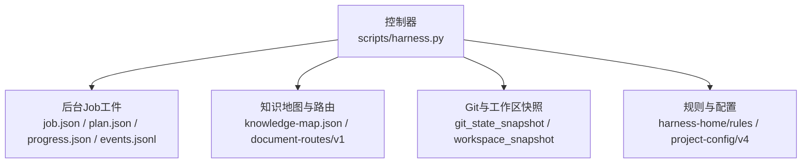
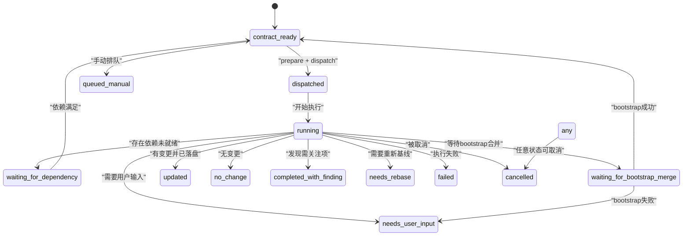
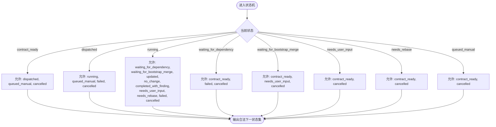
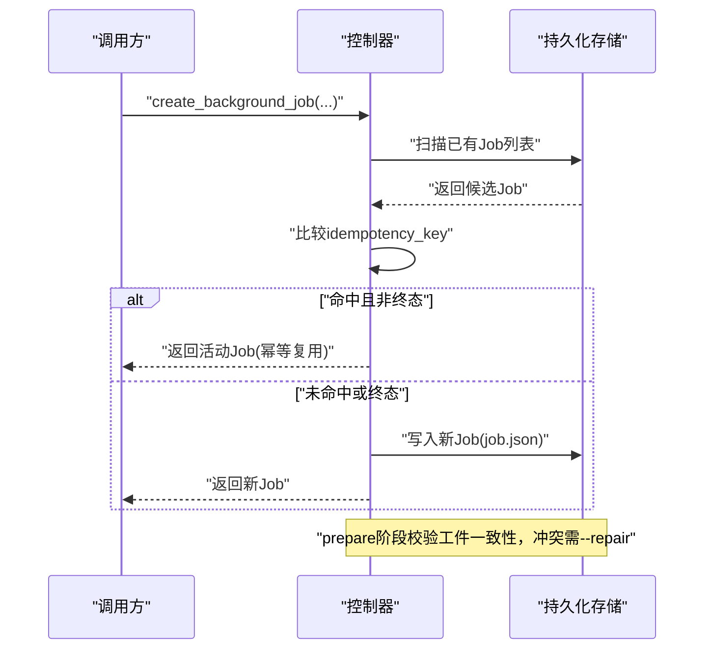
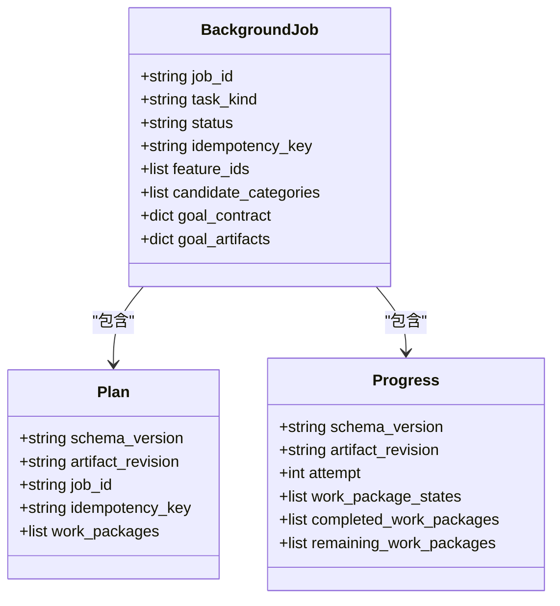
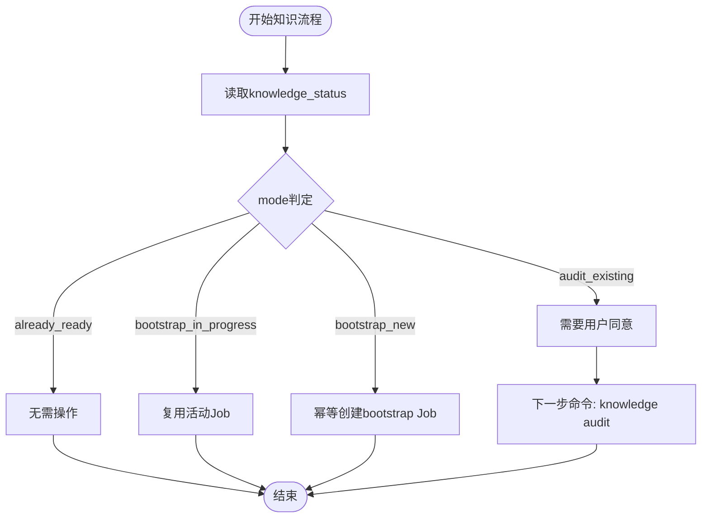
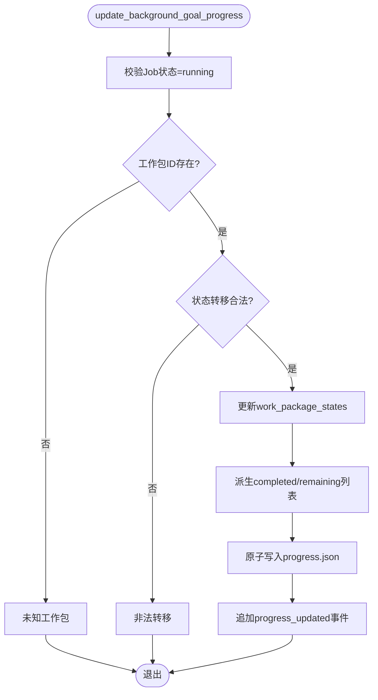
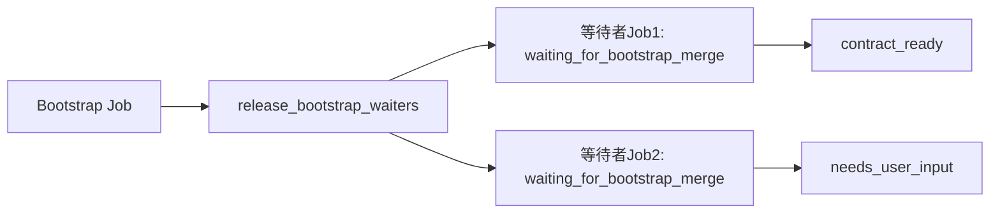

# 知识Job管理

<cite>
**本文引用的文件**
- [scripts/harness.py](file://scripts/harness.py)
- [docs/architecture.md](file://docs/architecture.md)
- [docs/contracts.md](file://docs/contracts.md)
</cite>

## 目录
1. [简介](#简介)
2. [项目结构](#项目结构)
3. [核心组件](#核心组件)
4. [架构总览](#架构总览)
5. [详细组件分析](#详细组件分析)
6. [依赖关系分析](#依赖关系分析)
7. [性能考量](#性能考量)
8. [故障排查指南](#故障排查指南)
9. [结论](#结论)
10. [附录：API参考与错误码](#附录api参考与错误码)

## 简介
本文件面向Docs Harness的知识Job管理系统，聚焦后台治理与知识生命周期中的Job状态机、幂等创建机制、活动Job复用策略、审计现有内容的处理流程，以及API与错误处理最佳实践。内容基于控制器源码与产品合同文档进行系统化梳理，帮助读者在复杂工程环境中正确设计、部署和运维知识Job。

## 项目结构
- 控制器真源位于 scripts/harness.py，负责任务准入、上下文、验收、知识生命周期与后台Job状态机。
- 产品边界、状态与交付边界、退出码等由 docs/contracts.md 定义；架构事实与运行时位置由 docs/architecture.md 描述。
- 知识Job属于后台治理范畴，遵循 background-job/v2 合同，工件包括 job.json、plan.json、progress.json、events.jsonl 及锁与索引，均由CLI在受管Runtime内维护。

**图表来源**
- [scripts/harness.py:100-126](file://scripts/harness.py#L100-L126)
- [docs/architecture.md:1-26](file://docs/architecture.md#L1-L26)
- [docs/contracts.md:303-345](file://docs/contracts.md#L303-L345)

**章节来源**
- [docs/architecture.md:1-26](file://docs/architecture.md#L1-L26)
- [docs/contracts.md:303-345](file://docs/contracts.md#L303-L345)

## 核心组件
- 后台Job状态机：定义已知状态集合、终态集合、可重试状态与转换表，确保状态迁移安全且可审计。
- 幂等键生成：基于任务类型、父任务、功能ID、候选类别与范围指纹计算稳定键，避免重复创建。
- 活动Job复用：通过idempotency_key匹配已有Job，若为失败或取消则允许复用；否则直接返回活动Job。
- 工件准备与校验：prepare生成冻结的Plan/Progress并记录指纹；validate校验绑定、全集、attempt与指纹一致性。
- 进度更新：仅running状态允许更新工作包状态，严格限制状态转移方向，保证不可倒退与跳过执行。
- 依赖释放：bootstrap完成后按结果释放等待者，成功则回退依赖并进入contract_ready，失败则转入needs_user_input。

**章节来源**
- [scripts/harness.py:8404-8416](file://scripts/harness.py#L8404-L8416)
- [scripts/harness.py:7379-7396](file://scripts/harness.py#L7379-L7396)
- [scripts/harness.py:8671-8685](file://scripts/harness.py#L8671-L8685)
- [scripts/harness.py:8461-8525](file://scripts/harness.py#L8461-L8525)
- [scripts/harness.py:8528-8586](file://scripts/harness.py#L8528-L8586)
- [scripts/harness.py:8786-8818](file://scripts/harness.py#L8786-L8818)

## 架构总览
知识Job的生命周期围绕“准备—派发—运行—验证—终态”展开，关键路径如下：
- contract_ready → dispatched → running → updated/no_change/completed_with_finding/failed/cancelled
- 复杂路线需先prepare生成Plan/Progress，再dispatch进入running
- 依赖型Job在waiting_for_dependency或waiting_for_bootstrap_merge中等待上游完成

**图表来源**
- [scripts/harness.py:8404-8416](file://scripts/harness.py#L8404-L8416)
- [docs/contracts.md:325-341](file://docs/contracts.md#L325-L341)

## 详细组件分析

### Job状态机设计与转换逻辑
- 已知状态集合包含contract_ready、dispatched、running、waiting_for_dependency、waiting_for_bootstrap_merge、needs_user_input、needs_rebase、queued_manual以及终态updated、no_change、completed_with_finding、failed、cancelled。
- 转换表限定每个状态的合法下一状态，防止非法跳转；例如running可进入多种中间态或终态，但不得直接跳至contract_ready。
- 可重试状态集合用于retry语义：needs_user_input、needs_rebase、queued_manual可通过重试推进。

**图表来源**
- [scripts/harness.py:8404-8416](file://scripts/harness.py#L8404-L8416)

**章节来源**
- [scripts/harness.py:8404-8416](file://scripts/harness.py#L8404-L8416)

### 幂等创建机制与冲突处理
- idempotency_key由task_kind、parent_task_id、feature_ids、candidate_categories与scope_fingerprint组合计算，确保相同意图与范围产生相同键。
- create_background_job在遍历已有Job时，若找到相同idempotency_key且状态非failed/cancelled，则直接复用；否则生成新Job。
- prepare阶段对已存在工件进行校验：若工件与期望不一致且未显式--repair，则拒绝并提示冲突；repair模式会归档旧工件后重建。

**图表来源**
- [scripts/harness.py:7379-7396](file://scripts/harness.py#L7379-L7396)
- [scripts/harness.py:8671-8685](file://scripts/harness.py#L8671-L8685)
- [scripts/harness.py:8461-8525](file://scripts/harness.py#L8461-L8525)

**章节来源**
- [scripts/harness.py:7379-7396](file://scripts/harness.py#L7379-L7396)
- [scripts/harness.py:8671-8685](file://scripts/harness.py#L8671-L8685)
- [scripts/harness.py:8461-8525](file://scripts/harness.py#L8461-L8525)

### 活动Job复用策略（状态检查、工件验证、兼容性判断）
- 活动Job复用首先检查是否存在相同idempotency_key的Job，若状态为failed或cancelled则视为可复用，否则直接返回活动Job。
- 对于knowledge_bootstrap类型，若存在active bootstrap且状态为contract_ready，则合并feature_ids、categories与读写范围，刷新基线后复用。
- 工件验证要求plan与progress的schema_version、artifact_revision、generated_by、job_id、idempotency_key与attempt一致，且指纹未漂移。

**图表来源**
- [scripts/harness.py:8671-8685](file://scripts/harness.py#L8671-L8685)
- [scripts/harness.py:8485-8551](file://scripts/harness.py#L8485-L8551)

**章节来源**
- [scripts/harness.py:8671-8685](file://scripts/harness.py#L8671-L8685)
- [scripts/harness.py:8485-8551](file://scripts/harness.py#L8485-L8551)

### 审计现有内容的处理流程（增量更新 vs 全量重建）
- knowledge_flow根据当前知识状态决定mode：already_ready、bootstrap_in_progress、bootstrap_new、audit_existing。
- audit_existing模式下requires_user_consent_before_update为true，next_command_argv指向knowledge audit，表示需用户确认后再继续。
- 增量与全量选择取决于knowledge_status与pending_knowledge_jobs：若status为ready/partial且无阻塞Job，则走增量；若absent或quarantined/new_feature，则触发bootstrap_new或audit_existing。

**图表来源**
- [scripts/harness.py:1780-1818](file://scripts/harness.py#L1780-L1818)
- [docs/contracts.md:342-345](file://docs/contracts.md#L342-L345)

**章节来源**
- [scripts/harness.py:1780-1818](file://scripts/harness.py#L1780-L1818)
- [docs/contracts.md:342-345](file://docs/contracts.md#L342-L345)

### 进度更新与工作包状态机
- 仅running状态的Job允许更新工作包进度，请求状态必须在{in_progress, completed, blocked}中。
- 状态转移严格受限：pending→in_progress/blocked，in_progress→completed/blocked，completed与blocked不可再变。
- 更新成功后派生completed_work_packages与remaining_work_packages，并记录事件。

**图表来源**
- [scripts/harness.py:8528-8586](file://scripts/harness.py#L8528-L8586)

**章节来源**
- [scripts/harness.py:8528-8586](file://scripts/harness.py#L8528-L8586)

## 依赖关系分析
- 知识Job依赖bootstrap Job：当task_kind为knowledge_incremental_sync且存在dependencies时，初始状态为waiting_for_bootstrap_merge或waiting_for_dependency。
- bootstrap完成后release_bootstrap_waiters会检查outcome，成功则移除依赖并进入contract_ready，失败则转入needs_user_input。
- 文档路由合同document_route_contract影响initial_status与allowed_write_scope：未解析时需零写权限。

**图表来源**
- [scripts/harness.py:8786-8818](file://scripts/harness.py#L8786-L8818)
- [scripts/harness.py:8691-8700](file://scripts/harness.py#L8691-L8700)

**章节来源**
- [scripts/harness.py:8786-8818](file://scripts/harness.py#L8786-L8818)
- [scripts/harness.py:8691-8700](file://scripts/harness.py#L8691-L8700)

## 性能考量
- 幂等键计算使用SHA256与规范化JSON，时间复杂度O(n)，空间复杂度O(1)，适合高频调用。
- 工件校验涉及文件指纹计算，建议缓存fingerprint以减少重复I/O。
- 进度更新采用原子写入与事件追加，避免并发竞争，提升可靠性。
- 知识流程中repowiki模式短路返回ready，减少不必要的扫描与构建开销。

[本节提供通用指导，不直接分析具体文件]

## 故障排查指南
- 常见错误码：invalid_background_job_transition、background_plan_binding_mismatch、background_progress_attempt_mismatch、background_goal_artifacts_tampered等。
- 排查步骤：
  - 检查job.json状态与idempotency_key是否与预期一致。
  - 验证plan.json与progress.json的schema_version、artifact_revision与fingerprints。
  - 查看events.jsonl定位最近一次transition_rejected或progress_rejected事件。
  - 对于prepare冲突，使用--repair归档旧工件后重试。

**章节来源**
- [scripts/harness.py:8461-8525](file://scripts/harness.py#L8461-L8525)
- [scripts/harness.py:8485-8551](file://scripts/harness.py#L8485-L8551)
- [scripts/harness.py:7554-7569](file://scripts/harness.py#L7554-L7569)

## 结论
知识Job管理系统通过严谨的状态机、幂等键机制与工件校验，确保了后台治理的可预测性与安全性。在实际部署中，应充分利用活动Job复用、增量更新与依赖释放机制，结合错误码与事件日志快速定位问题。遵循本文档的最佳实践，可有效降低运维复杂度并提升系统稳定性。

[本节总结性内容，不直接分析具体文件]

## 附录：API参考与错误码

### 后台Job API概览
- prepare：生成冻结的Plan/Progress，支持--repair修复冲突工件。
- progress：更新工作包状态，仅running状态允许。
- dispatch：将Job从contract_ready/dispatched推进至running。
- verify：验证Job结果，要求全部工作包completed或符合特定条件。
- retry：归档当前attempt工件，推进attempt并刷新基线。

**章节来源**
- [docs/contracts.md:325-341](file://docs/contracts.md#L325-L341)

### 错误码与退出码
- 退出码0：命令成功；verify.result=完成表示父任务完成。
- 退出码1：项目检查、自检或完整性读取失败。
- 退出码2：输入、合同、绑定或状态无效。
- 退出码3：需要方案、授权、证据、迁移、用户输入或Git交付。
- 退出码4：范围、漂移、Gate、远端、授权或规则变化，必须重新准入。

**章节来源**
- [docs/contracts.md:361-372](file://docs/contracts.md#L361-L372)