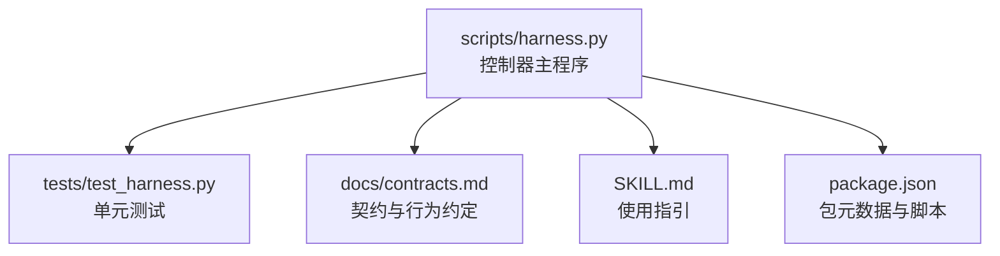
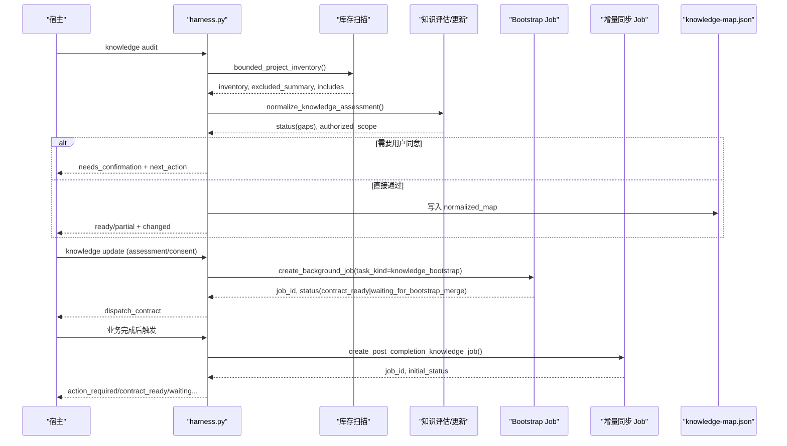
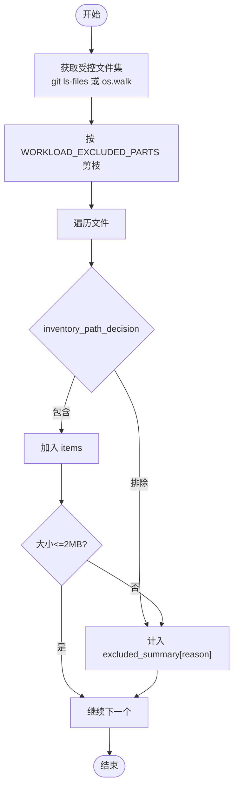
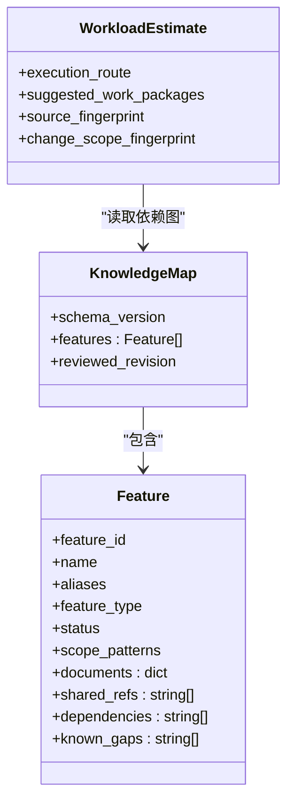
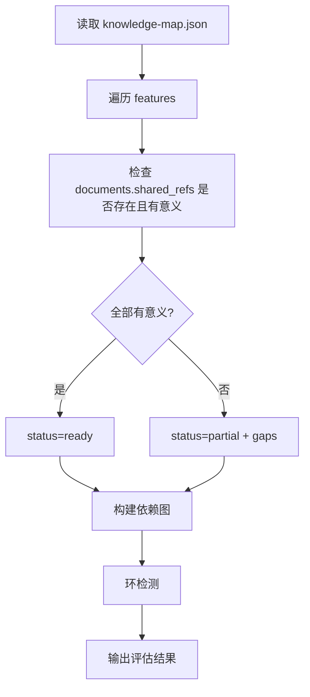
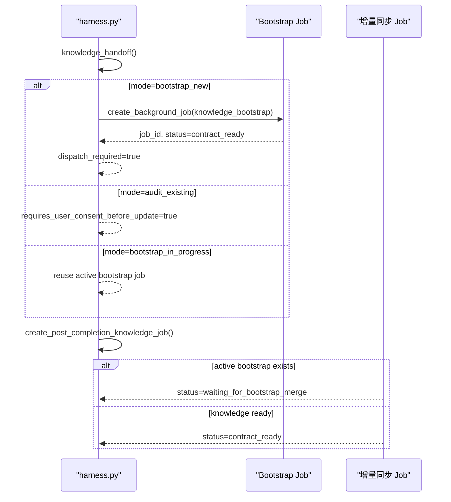
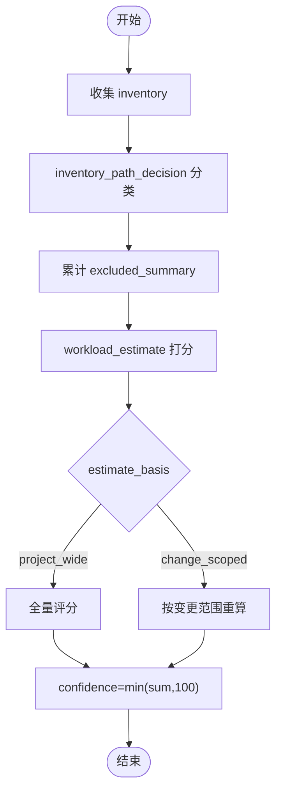
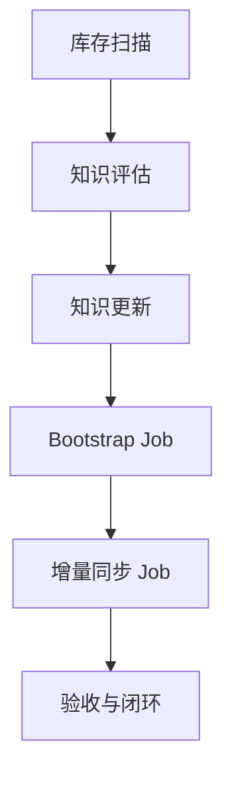

# 知识图谱构建

<cite>
**本文引用的文件**   
- [scripts/harness.py](file://scripts/harness.py)
- [tests/test_harness.py](file://tests/test_harness.py)
- [docs/contracts.md](file://docs/contracts.md)
- [SKILL.md](file://SKILL.md)
- [package.json](file://package.json)
</cite>

## 目录
1. [简介](#简介)
2. [项目结构](#项目结构)
3. [核心组件](#核心组件)
4. [架构总览](#架构总览)
5. [详细组件分析](#详细组件分析)
6. [依赖关系分析](#依赖关系分析)
7. [性能考虑](#性能考虑)
8. [故障排除指南](#故障排除指南)
9. [结论](#结论)
10. [附录](#附录)

## 简介
本文件面向 Docs Harness 的知识图谱构建系统，聚焦以下目标：
- 深入解释项目扫描机制：文件分类算法、目录结构识别与依赖关系分析。
- 详细说明知识映射过程：文档类型识别、内容提取与关系建立。
- 阐述 bootstrap 流程实现细节：幂等创建、活动 Job 复用与审计现有内容的处理策略。
- 解释知识库存生成机制：excluded_summary 的过滤规则与 confidence 计算。
- 提供配置选项与性能优化建议，并给出实际代码示例路径与故障排除指南。

## 项目结构
- scripts/harness.py：控制器主程序，包含任务编排、Git 预检/后检、后台治理、知识评估与更新、工作负载估算、知识库存扫描与指纹、知识状态判定、增量同步 Job 创建等核心逻辑。
- tests/test_harness.py：覆盖安装、准入、Git 操作、知识审计与更新、后台 Job 等关键场景的单元测试。
- docs/contracts.md：产品边界、任务包 v2、准入与完成清单、Git 状态合同、证据收据、上下文与授权、v1→v2 迁移、双通道与后台治理、Runtime 与交付层、退出码等规范。
- SKILL.md：技能说明、安装与运行入口、后台治理命令、质量账本、按需读取等使用指引。
- package.json：包元数据与脚本（含 self-test）。

**图表来源**
- [scripts/harness.py](file://scripts/harness.py)
- [tests/test_harness.py](file://tests/test_harness.py)
- [docs/contracts.md](file://docs/contracts.md)
- [SKILL.md](file://SKILL.md)
- [package.json](file://package.json)

**章节来源**
- [scripts/harness.py](file://scripts/harness.py)
- [tests/test_harness.py](file://tests/test_harness.py)
- [docs/contracts.md](file://docs/contracts.md)
- [SKILL.md](file://SKILL.md)
- [package.json](file://package.json)

## 核心组件
- 项目扫描与库存
  - bounded_project_inventory：基于 Git ls-files 或 os.walk 收集受控文件，按 WORKLOAD_EXCLUDED_PARTS、二进制资产、敏感词、控制/临时后缀等规则过滤，统计 excluded_summary。
  - inventory_path_decision：对每个相对路径做包含/排除决策，返回原因码（如 generated_or_runtime、sensitive、binary_or_packaged 等）。
  - knowledge_scan_inventory_details / knowledge_inventory_fingerprint：输出非 docs/ 的文件清单、excluded_summary 与显式 include patterns，并生成库存指纹。
- 知识地图与状态
  - knowledge_status：读取 docs/knowledge-map.json，判断 absent/needs_audit/building/ready/partial/quarantined 等状态，统计 features/gaps/map_fingerprint/reviewed_revision。
  - evaluate_candidate_knowledge：依据候选地图与实际文档内容，判定 ready/partial 并列出 gaps。
- 知识评估与更新
  - knowledge audit/update：产出 assessment，必要时请求用户同意；写入 last-assessment.json；若通过则持久化 normalized_map 到 knowledge-map.json，或创建 knowledge_bootstrap 后台 Job。
- 工作负载估算与 confidence
  - workload_estimate：综合源码数量、技术栈、架构域、功能候选、知识缺口、跨功能依赖等维度打分，支持 project_wide 与 change_scoped 两种模式，输出 execution_route、suggested_work_packages、source_fingerprint、change_scope_fingerprint 等。
- 增量同步与依赖
  - create_post_completion_knowledge_job：根据父任务变更与知识就绪情况，创建 knowledge_incremental_sync Job，设置 waiting_for_bootstrap_merge 或 contract_ready，绑定 dependency_job_ids。
  - active_knowledge_bootstrap / knowledge_dependency_outcome：复用活动 bootstrap Job，并依据其终态决定等待者释放或阻塞。
- 背景治理与文档路由
  - create_post_completion_governance_job：根据 deliverables 解析 document_routes，估算工作量并创建 delivery_governance Job。

**章节来源**
- [scripts/harness.py:7643-7692](file://scripts/harness.py#L7643-L7692)
- [scripts/harness.py:7695-7764](file://scripts/harness.py#L7695-L7692)
- [scripts/harness.py:7702-7714](file://scripts/harness.py#L7702-L7714)
- [scripts/harness.py:7774-7889](file://scripts/harness.py#L7774-L7889)
- [scripts/harness.py:1610-1651](file://scripts/harness.py#L1610-L1651)
- [scripts/harness.py:1653-1684](file://scripts/harness.py#L1653-L1684)
- [scripts/harness.py:7504-7595](file://scripts/harness.py#L7504-L7595)
- [scripts/harness.py:7598-7640](file://scripts/harness.py#L7598-L7640)

## 架构总览
下图展示知识图谱构建的关键流程：从项目扫描、知识评估、bootstrap 创建与执行，到增量同步与验收闭环。

**图表来源**
- [scripts/harness.py:7695-7764](file://scripts/harness.py#L7695-L7764)
- [scripts/harness.py:9055-9171](file://scripts/harness.py#L9055-L9171)
- [scripts/harness.py:7504-7595](file://scripts/harness.py#L7504-L7595)

## 详细组件分析

### 项目扫描与文件分类算法
- 文件收集策略
  - 优先使用 git ls-files --cached --others --exclude-standard 获取受控文件集合；回退到 os.walk，并按 WORKLOAD_EXCLUDED_PARTS 剪枝。
  - 限制文件大小上限（>2MB）与文件总数上限（FALLBACK_SNAPSHOT_FILE_LIMIT），避免大仓库卡顿。
- 分类与过滤规则
  - 控制/临时文件：AGENTS.md、CLAUDE.md、scripts/harness.py、.DS_Store 以及以 .~/.# 开头或 ~/.tmp/.temp 结尾的文件。
  - 敏感路径：包含 .env、credential、secret、private、token、password、keychain 等关键词。
  - 二进制/打包资产：BINARY_ASSET_EXTENSIONS 中的扩展名。
  - 生成/运行时目录：WORKLOAD_EXCLUDED_PARTS（如 .git、node_modules、dist、build 等）。
  - 显式 include：通过 knowledge.inventory_include 白名单可强制包含特定路径。
- 输出
  - inventory：非 docs/ 的文件路径列表。
  - excluded_summary：按原因码统计被排除的文件数量（如 generated_or_runtime、sensitive、binary_or_packaged、oversized_or_unreadable 等）。
  - explicit_includes：当前生效的 include patterns。

**图表来源**
- [scripts/harness.py:7677-7692](file://scripts/harness.py#L7677-L7692)
- [scripts/harness.py:7717-7764](file://scripts/harness.py#L7717-L7764)

**章节来源**
- [scripts/harness.py:7643-7692](file://scripts/harness.py#L7643-L7692)
- [scripts/harness.py:7695-7764](file://scripts/harness.py#L7695-L7764)

### 目录结构识别与依赖关系分析
- 目录结构识别
  - 通过 knowledge_status 读取 docs/knowledge-map.json，解析 features 列表与 documents/shared_refs，结合 meaningful_knowledge_doc 判定文档是否“有意义”（去除占位文本后正文长度阈值）。
- 依赖关系分析
  - 在 workload_estimate 中，读取 knowledge-map.json 的 dependencies 边数，估算跨功能依赖复杂度，并检测环（DFS 回溯法）。
  - 支持 change_scoped 模式下的依赖范围限定，仅对 changed_paths 内的源文件进行依赖估算。

**图表来源**
- [scripts/harness.py:7774-7889](file://scripts/harness.py#L7774-L7889)
- [scripts/harness.py:1653-1684](file://scripts/harness.py#L1653-L1684)

**章节来源**
- [scripts/harness.py:7774-7889](file://scripts/harness.py#L7774-L7889)
- [scripts/harness.py:1653-1684](file://scripts/harness.py#L1653-L1684)

### 知识映射过程：文档类型识别、内容提取与关系建立
- 文档类型识别
  - 通过 knowledge-map.json 的 documents 字段将 feature 与 product/development/testing/design 四类文档关联；shared_refs 引用公共事实文档。
- 内容提取
  - meaningful_knowledge_doc：去除注释与占位文本（待项目遍历后补全、待确认、TODO、TBD），统计有效正文长度≥20 字符即认为“有意义”。
- 关系建立
  - 通过 dependencies 字段建立 feature 间的依赖关系；workload_estimate 据此计算依赖复杂度与环检测。

**图表来源**
- [scripts/harness.py:1600-1608](file://scripts/harness.py#L1600-L1608)
- [scripts/harness.py:1621-1635](file://scripts/harness.py#L1621-L1635)
- [scripts/harness.py:7774-7889](file://scripts/harness.py#L7774-L7889)

**章节来源**
- [scripts/harness.py:1600-1608](file://scripts/harness.py#L1600-L1608)
- [scripts/harness.py:1621-1635](file://scripts/harness.py#L1621-L1635)
- [scripts/harness.py:7774-7889](file://scripts/harness.py#L7774-L7889)

### Bootstrap 流程：幂等创建、活动 Job 复用与审计现有内容
- 幂等创建
  - create_background_job 使用 idempotency_key 保证重复调用返回同一 Job；knowledge update 在 consent/approved 时创建 knowledge_bootstrap Job。
- 活动 Job 复用
  - active_knowledge_bootstrap 返回最后一个非终态 bootstrap Job；create_post_completion_knowledge_job 将其设为 dependency_job_ids，初始状态为 waiting_for_bootstrap_merge。
- 审计现有内容
  - knowledge_handoff 根据 knowledge_status 与 docs_preexisting_at_install 决定 mode（already_ready/bootstrap_in_progress/bootstrap_new/audit_existing），并在 audit_existing 模式下要求用户同意。

**图表来源**
- [scripts/harness.py:1687-1728](file://scripts/harness.py#L1687-L1728)
- [scripts/harness.py:1610-1618](file://scripts/harness.py#L1610-L1618)
- [scripts/harness.py:7504-7595](file://scripts/harness.py#L7504-L7595)

**章节来源**
- [scripts/harness.py:1687-1728](file://scripts/harness.py#L1687-L1728)
- [scripts/harness.py:1610-1618](file://scripts/harness.py#L1610-L1618)
- [scripts/harness.py:7504-7595](file://scripts/harness.py#L7504-L7595)

### 知识库存生成机制：excluded_summary 过滤规则与 confidence 计算
- excluded_summary 过滤规则
  - generated_or_runtime：命中 WORKLOAD_EXCLUDED_PARTS。
  - sensitive：命中敏感关键词。
  - binary_or_packaged：命中二进制/打包扩展名。
  - control_or_temporary：控制/临时文件。
  - oversized_or_unreadable：超过 2MB 或不可读。
- confidence 计算
  - workload_estimate 汇总 source_files、feature_candidates、architecture_domains、technology_stacks、knowledge_gap、cross_feature_dependencies 得分，取 min(sum, 100)。
  - change_scoped 模式下，仅对 changed_paths 范围内的源文件与特征重新估算，降低 confidence 但不强制 phased。

**图表来源**
- [scripts/harness.py:7677-7692](file://scripts/harness.py#L7677-L7692)
- [scripts/harness.py:7774-7889](file://scripts/harness.py#L7774-L7889)

**章节来源**
- [scripts/harness.py:7677-7692](file://scripts/harness.py#L7677-L7692)
- [scripts/harness.py:7774-7889](file://scripts/harness.py#L7774-L7889)

### 知识图谱构建的配置选项与性能优化建议
- 配置选项
  - knowledge.inventory_include：显式包含路径的 glob 白名单。
  - verification.volatile_paths：验证命令期间允许的新建临时副产物白名单。
  - verification.auto_attribute_in_scope：是否在 write_scope 内自动归因未声明写入。
  - verification.command_cache_enabled：是否启用验证命令收据缓存。
- 性能优化建议
  - 使用 change_scoped 模式减少扫描范围与估算开销。
  - 合理设置 inventory_include 缩小扫描面。
  - 关闭不必要的 command cache 以避免误用旧收据。
  - 利用 knowledge_status 快速判断是否需要 bootstrap 或增量同步。

**章节来源**
- [docs/contracts.md:200-221](file://docs/contracts.md#L200-L221)
- [scripts/harness.py:7774-7889](file://scripts/harness.py#L7774-L7889)

## 依赖关系分析
- 组件耦合与内聚
  - harness.py 内部模块高度内聚：扫描、评估、估算、Job 管理相互协作，通过清晰的输入输出契约解耦。
- 外部依赖
  - Git 子进程调用用于文件收集、远端探测与状态快照。
  - JSON 文件读写用于 knowledge-map.json、last-assessment.json、job.json 等。
- 潜在循环依赖
  - 无直接循环导入；通过函数参数与返回值传递状态，避免循环。
- 接口契约
  - knowledge audit/update 的输入输出遵循 contracts.md 定义；background job 的 schema 与状态机严格约束。

**图表来源**
- [scripts/harness.py:7695-7764](file://scripts/harness.py#L7695-L7764)
- [scripts/harness.py:9055-9171](file://scripts/harness.py#L9055-L9171)
- [scripts/harness.py:7504-7595](file://scripts/harness.py#L7504-L7595)

**章节来源**
- [scripts/harness.py:7695-7764](file://scripts/harness.py#L7695-L7764)
- [scripts/harness.py:9055-9171](file://scripts/harness.py#L9055-L9171)
- [scripts/harness.py:7504-7595](file://scripts/harness.py#L7504-L7595)

## 性能考虑
- 扫描阶段
  - 使用 git ls-files 加速文件收集；限制最大文件数与单文件大小。
- 评估阶段
  - meaningful_knowledge_doc 快速剔除占位文档；knowledge_status 短路判断。
- 估算阶段
  - change_scoped 模式显著降低计算量；依赖环检测采用 DFS 线性时间。
- 验证阶段
  - 命令收据缓存避免重复执行；volatile 白名单减少误报。

[本节为通用指导，不直接分析具体文件]

## 故障排除指南
- 常见错误与定位
  - missing_file/invalid_json：JSON 文件缺失或格式错误，检查 knowledge-map.json、last-assessment.json、job.json。
  - invalid_scope_description：范围描述包含自然语言，需改为路径或 glob。
  - git_preflight_failed/git_remote_unavailable：Git 环境异常或远端不可达，检查网络与权限。
  - blocked by dirty worktree/non-fast-forward：工作区有未提交更改或无法 fast-forward，先清理或合并。
  - knowledge_not_ready：知识尚未就绪，需先完成 bootstrap。
- 调试步骤
  - 运行 self-test 校验规则与版本一致性。
  - 查看 excluded_summary 定位被排除的文件类别。
  - 使用 knowledge audit 的 next_action 与 reason_code 明确下一步。

**章节来源**
- [tests/test_harness.py:339-354](file://tests/test_harness.py#L339-L354)
- [tests/test_harness.py:377-406](file://tests/test_harness.py#L377-L406)
- [tests/test_harness.py:685-756](file://tests/test_harness.py#L685-L756)
- [scripts/harness.py:7504-7595](file://scripts/harness.py#L7504-L7595)

## 结论
Docs Harness 的知识图谱构建系统通过严格的扫描、评估、估算与 Job 编排，实现了幂等、可审计、可扩展的知识库自动化。excluded_summary 与 confidence 提供了透明性与可控性，bootstrap 与增量同步确保了持续演进。配合契约与测试，系统在复杂项目中仍能保持高可靠性与高性能。

[本节为总结，不直接分析具体文件]

## 附录
- 使用指引参考 SKILL.md 的安装与后台治理命令。
- 契约参考 docs/contracts.md 的任务包、证据收据、Git 状态合同等。
- 测试用例参考 tests/test_harness.py 的典型场景与断言。

[本节为补充信息，不直接分析具体文件]