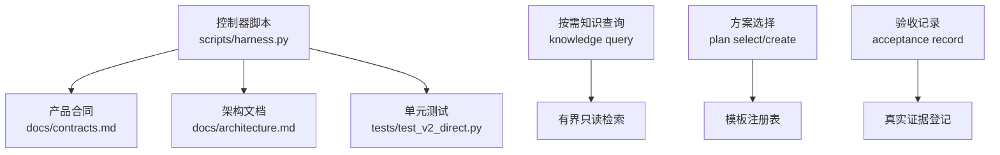
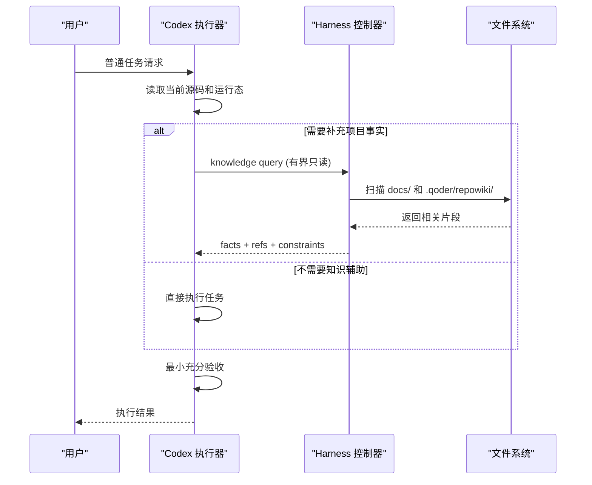
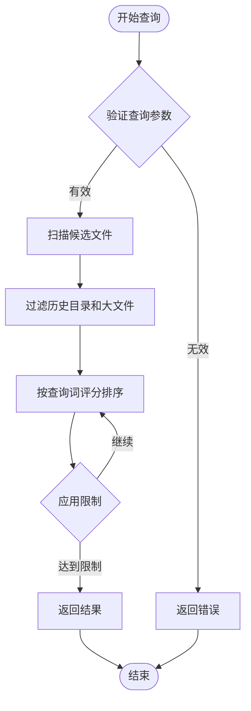
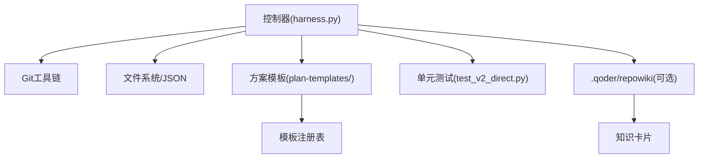

# 知识图谱系统

<cite>
**本文引用的文件**   
- [scripts/harness.py](file://scripts/harness.py)
- [docs/contracts.md](file://docs/contracts.md)
- [docs/architecture.md](file://docs/architecture.md)
- [tests/test_v2_direct.py](file://tests/test_v2_direct.py)
</cite>

## 更新摘要
**变更内容**   
- **重大重构**：知识系统从自动注入模式重新设计为按需检索模式，移除了所有自动加载和维护机制
- **简化合同结构**：采用极简的 knowledge query、plan select/create、acceptance record 三项独立能力
- **新的优先级顺序**：当前源码和运行态始终优先于知识摘要，不再自动注入知识上下文
- **移除旧功能**：删除了 run/context/progress/verify/task/background/authorization 等命令和知识维护 Job
- **配置简化**：knowledge 配置简化为 mode=on_demand、read_only=True 的只读模式

## 目录
1. [引言](#引言)
2. [项目结构](#项目结构)
3. [核心组件](#核心组件)
4. [架构总览](#架构总览)
5. [详细组件分析](#详细组件分析)
6. [依赖关系分析](#依赖关系分析)
7. [性能考量](#性能考量)
8. [故障排查指南](#故障排查指南)
9. [结论](#结论)
10. [附录](#附录)

## 引言
Docs Harness 2.0.0 的知识系统经历了根本性重构，从传统的自动注入模式转变为按需检索模式。新系统遵循"直接执行优先"原则，只有在缺少的项目事实会改变目标、范围、方案或验收时，才调用知识查询。这一设计确保了系统的简洁性和性能，避免了不必要的知识加载和维护开销。

**最新更新**：系统已完全移除自动知识注入、知识地图维护、bootstrap 流程等复杂机制，专注于提供简单、可控、可预测的知识检索能力。

## 项目结构
Docs Harness 2.0.0 的核心控制器位于 scripts/harness.py，对外行为与合同定义在 docs/contracts.md，架构事实与边界在 docs/architecture.md，测试覆盖在 tests/test_v2_direct.py。

**图表来源** 
- [scripts/harness.py:1-800](file://scripts/harness.py#L1-L800)
- [docs/contracts.md:1-122](file://docs/contracts.md#L1-L122)
- [docs/architecture.md:1-84](file://docs/architecture.md#L1-L84)

**章节来源**
- [scripts/harness.py:1-800](file://scripts/harness.py#L1-L800)
- [docs/contracts.md:1-122](file://docs/contracts.md#L1-L122)
- [docs/architecture.md:1-84](file://docs/architecture.md#L1-L84)
- [tests/test_v2_direct.py:1-200](file://tests/test_v2_direct.py#L1-L200)

## 核心组件
- **按需知识查询**：通过 `knowledge query` 命令提供有界、只读的知识检索，支持查询限制和字符预算控制
- **方案选择与创建**：基于任务复杂度、修改面和领域 Profile 智能选择方案模板，支持 brief/full 两个层级
- **真实验收记录**：仅登记已经发生的验收事实，不自动执行测试或决定验证流程
- **安装与迁移**：提供 v6 配置管理，支持从 1.x 版本的单向迁移，清理旧运行时和规则
- **直接执行模式**：默认模式下 Codex 直接执行任务，Harness 仅在需要时作为可选工具被调用

**章节来源**
- [scripts/harness.py:439-507](file://scripts/harness.py#L439-L507)
- [scripts/harness.py:526-697](file://scripts/harness.py#L526-L697)
- [scripts/harness.py:705-843](file://scripts/harness.py#L705-L843)
- [scripts/harness.py:1085-1389](file://scripts/harness.py#L1085-L1389)

## 架构总览
2.0.0 架构围绕"Codex Direct Executor + 可选能力提供者"展开，消除了复杂的任务状态机和后台作业系统。

**图表来源** 
- [scripts/harness.py:439-507](file://scripts/harness.py#L439-L507)
- [docs/architecture.md:20-56](file://docs/architecture.md#L20-L56)

## 详细组件分析

### 按需知识查询系统

**重大变更**：系统已从自动注入模式完全转换为按需检索模式，移除了所有知识地图、bootstrap 流程和状态管理机制。

#### 查询触发条件
- 只有缺少的项目事实会改变目标、范围、方案或验收时才调用
- 当前源码、符号、运行态和真实产物优先于知识摘要
- 已经能从当前真源回答时立即停止

#### 查询参数约束
- `--query`：具体缺失事实，必填
- `--scope`：可选项目内范围，支持 glob 模式匹配
- `--limit`：1–10 条事实限制
- `--max-chars`：500–12000 字符预算控制

#### 候选文件扫描
- 优先扫描 `docs/` 目录下的 `.md`、`.txt`、`.json` 文件
- 支持 `.qoder/repowiki/` 外部知识库
- 排除 `docs/history/`、`docs/plans/`、`docs/reviews/` 历史目录
- 文件大小限制 512KB，避免大文件影响性能

**图表来源** 
- [scripts/harness.py:439-507](file://scripts/harness.py#L439-L507)
- [scripts/harness.py:398-427](file://scripts/harness.py#L398-L427)

**章节来源**
- [scripts/harness.py:439-507](file://scripts/harness.py#L439-L507)
- [scripts/harness.py:398-427](file://scripts/harness.py#L398-L427)
- [docs/contracts.md:19-50](file://docs/contracts.md#L19-L50)

### 方案选择与创建系统

**简化设计**：移除了复杂的方案模板选择逻辑，采用基于任务特征的智能选择策略。

#### 选择维度
- `plan_level`：none（直接执行）、brief（基础方案）、full（全面方案）
- `plan_profile`：general、frontend_ui、backend_service、bugfix、architecture、migration_release
- 次级 Profile：最多两个，用于补充主领域的特定需求

#### 自动选择逻辑
- 用户明确指定优先
- 根据任务复杂度、修改面、跨模块程度判断
- 高风险或复杂任务自动升级为 full 级别
- 无法可靠判断时使用 brief/general 降级策略

#### 方案冻结机制
- 严格验证 schema_version 和字段完整性
- 防止未授权字段和篡改内容
- 生成不可变的 plan_fingerprint 确保一致性

**章节来源**
- [scripts/harness.py:526-697](file://scripts/harness.py#L526-L697)
- [docs/contracts.md:51-75](file://docs/contracts.md#L51-L75)

### 真实验收记录系统

**职责明确**：仅登记已经发生的验收事实，不替代测试执行或环境准备。

#### 验收类型
- `contract_check`：范围、格式和记录一致性检查（L1 层级）
- `behavior_acceptance`：测试、接口、应用等行为验证（L2-L4 层级）
- `user_acceptance`：主观体验、权限、硬件等最终确认（L5 层级）

#### 验证规则
- L1 不能声明行为正确
- Behavior Acceptance 只能记录 L2-L4 层级
- L5 必须由用户确认，CLI 不接受 user_acceptance + passed
- 通过必须提供实际方法和项目内已存在的证据文件

**章节来源**
- [scripts/harness.py:705-843](file://scripts/harness.py#L705-L843)
- [docs/contracts.md:76-99](file://docs/contracts.md#L76-L99)

### 安装与迁移系统

**单向迁移**：支持从 1.x 版本升级到 2.0.0，清理旧运行时和规则，保留项目正文。

#### 配置管理
- v6 配置格式：schema_version、version、direct_mode、knowledge、migration
- knowledge 配置：mode=on_demand、read_only=True、docs_preexisting_at_install
- direct_mode：default=True，启用直接执行模式

#### 迁移流程
- 检测并清理旧规则目录、知识地图、受管区块
- 识别并保留项目正文和归属不明文件
- 验证 Git 忽略配置，确保必需文件不被忽略
- 生成迁移报告，记录保留和删除的文件

**章节来源**
- [scripts/harness.py:1085-1389](file://scripts/harness.py#L1085-L1389)
- [scripts/harness.py:1391-1552](file://scripts/harness.py#L1391-L1552)

## 依赖关系分析
- **核心依赖**：Git 工具链、文件系统操作、JSON 读写、哈希计算
- **文档依赖**：AGENTS.md、CLAUDE.md 中的受管区块，plan-templates/ 模板注册表
- **测试依赖**：unittest 框架，临时目录管理，子进程调用
- **外部依赖**：.qoder/repowiki 外部知识库（可选）

**图表来源** 
- [scripts/harness.py:1-800](file://scripts/harness.py#L1-L800)
- [tests/test_v2_direct.py:1-200](file://tests/test_v2_direct.py#L1-L200)

**章节来源**
- [scripts/harness.py:1-800](file://scripts/harness.py#L1-L800)
- [tests/test_v2_direct.py:1-200](file://tests/test_v2_direct.py#L1-L200)

## 性能考量
- **有界检索**：limit 和 max_chars 参数严格控制知识检索范围和大小
- **文件过滤**：排除历史目录，限制文件大小，避免符号链接
- **增量扫描**：仅扫描必要的文档目录，不递归处理整个仓库
- **内存优化**：流式处理文件内容，避免一次性加载大文件
- **缓存策略**：查询结果不缓存，每次都是新鲜扫描

## 故障排查指南
- **查询无结果**：检查 --query 是否具体，--scope 是否正确，确认文件不在排除目录
- **配置错误**：验证 .docs-harness/config.json 的 schema_version 和 knowledge 配置
- **迁移失败**：检查 Git 忽略配置，确认不受管文件未被意外删除
- **模板问题**：验证 plan-templates/ 目录完整性，检查模板指纹匹配

**章节来源**
- [scripts/harness.py:439-507](file://scripts/harness.py#L439-L507)
- [scripts/harness.py:1391-1552](file://scripts/harness.py#L1391-L1552)
- [tests/test_v2_direct.py:135-178](file://tests/test_v2_direct.py#L135-L178)

## 结论
Docs Harness 2.0.0 的知识系统通过彻底的重构，实现了从复杂的状态机驱动模式向简单的按需检索模式的转变。新系统遵循"直接执行优先"原则，只在真正需要时提供知识辅助，大幅降低了系统复杂性和维护成本。这种设计确保了更好的性能和可预测性，同时保持了足够的灵活性来应对各种项目场景。

**关键改进**：
- 移除了所有自动注入和维护机制
- 简化了配置和操作流程
- 提供了更明确的责任边界
- 增强了性能和安全性
- 保持了向后兼容性

## 附录
- **配置示例**：参考 v6 配置格式，重点关注 knowledge.mode=on_demand 和 knowledge.read_only=True
- **查询最佳实践**：使用具体的查询词，合理设置 limit 和 max_chars，利用 scope 精确限定范围
- **迁移指南**：遵循单向升级流程，备份重要数据，逐步验证迁移结果
- **故障诊断**：优先检查配置完整性、文件权限和 Git 状态