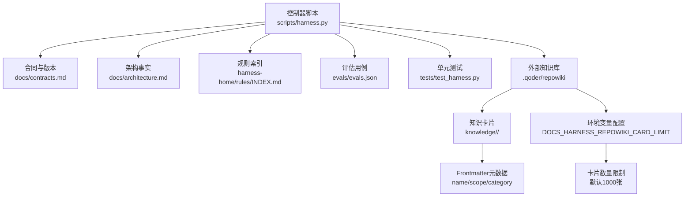
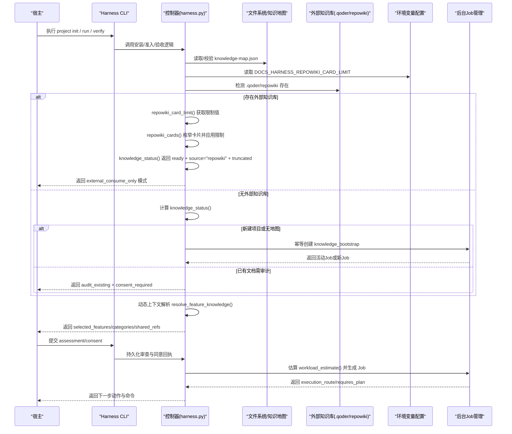
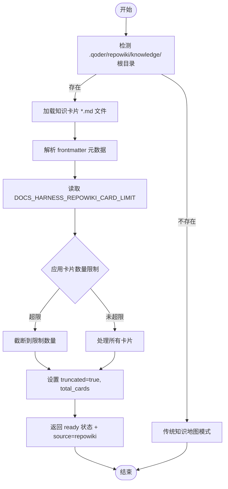
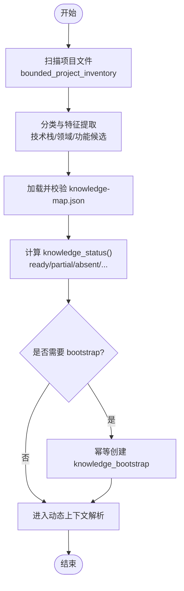
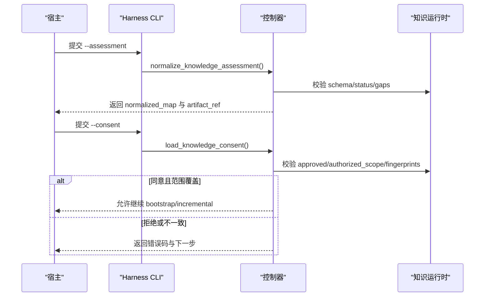
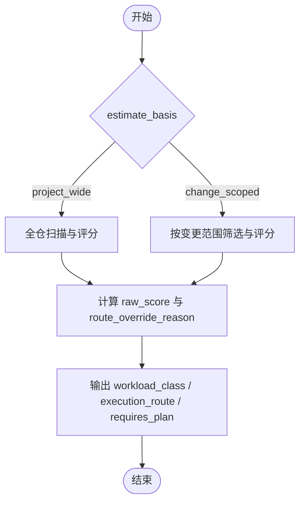
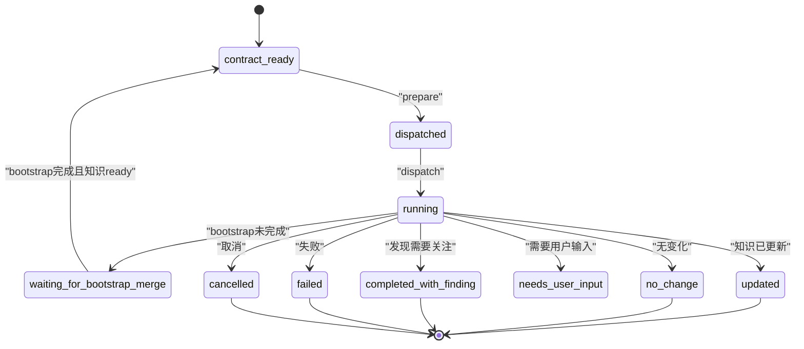
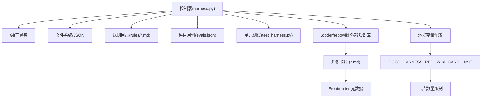

# 知识图谱系统

<cite>
**本文引用的文件**   
- [scripts/harness.py](file://scripts/harness.py)
- [docs/contracts.md](file://docs/contracts.md)
- [docs/architecture.md](file://docs/architecture.md)
- [harness-home/rules/INDEX.md](file://harness-home/rules/INDEX.md)
- [evals/evals.json](file://evals/evals.json)
- [tests/test_harness.py](file://tests/test_harness.py)
</cite>

## 更新摘要
**变更内容**   
- 新增外部知识库集成支持，特别是 .qoder/repowiki 的 consume-only 模式
- 实现知识卡片处理机制，支持最多 1000 张卡片的限制（可通过环境变量配置）
- **新增**：增强的 repowiki 知识卡片枚举功能，支持可配置的 DOCS_HARNESS_REPOWIKI_CARD_LIMIT 环境变量和截断报告
- 增强知识状态检测，自动识别外部知识库源并调整处理逻辑
- 优化知识上下文解析，支持按任务文本和范围匹配知识卡片
- 完善错误处理和边界情况处理，确保外部知识库模式的稳定性

## 目录
1. [引言](#引言)
2. [项目结构](#项目结构)
3. [核心组件](#核心组件)
4. [架构总览](#架构总览)
5. [详细组件分析](#详细组件分析)
6. [依赖关系分析](#依赖关系分析)
7. [性能考量](#性能考量)
8. [故障排查指南](#故障排查指南)
9. [结论](#结论)
10. [附录](#附录)

## 引言
本文件面向 Docs Harness 的知识图谱子系统，系统性阐述其构建与维护机制、知识审查与同意流程、工作量估算模式、知识缺失对业务准入的影响、以及知识 Job 的状态管理与 bootstrap 流程。文档同时提供配置示例与性能优化建议，帮助读者在不深入源码的情况下也能正确理解并高效使用该系统。

**最新更新**：系统现已支持外部知识库集成，特别是 .qoder/repowiki 的 consume-only 模式，允许项目直接使用现有的知识库而不需要重新构建。**新增功能**：增强了 repowiki 知识卡片枚举的可配置性和截断报告能力，通过 DOCS_HARNESS_REPOWIKI_CARD_LIMIT 环境变量控制卡片数量限制。

## 项目结构
Docs Harness 的核心控制器位于 scripts/harness.py，对外行为与合同定义在 docs/contracts.md，架构事实与边界在 docs/architecture.md，规则索引在 harness-home/rules/INDEX.md，评估用例在 evals/evals.json，测试覆盖在 tests/test_harness.py。

**图表来源** 
- [scripts/harness.py:90-100](file://scripts/harness.py#L90-L100)
- [scripts/harness.py:1629-1705](file://scripts/harness.py#L1629-L1705)
- [docs/contracts.md:340-345](file://docs/contracts.md#L340-L345)

**章节来源**
- [scripts/harness.py:1-120](file://scripts/harness.py#L1-L120)
- [docs/contracts.md:1-120](file://docs/contracts.md#L1-L120)
- [docs/architecture.md:1-26](file://docs/architecture.md#L1-L26)
- [harness-home/rules/INDEX.md:1-41](file://harness-home/rules/INDEX.md#L1-L41)
- [evals/evals.json:1-175](file://evals/evals.json#L1-L175)
- [tests/test_harness.py:1-120](file://tests/test_harness.py#L1-L120)

## 核心组件
- 知识地图与功能清单：以 docs/knowledge-map.json 为中心，约束 features、shared_refs、scope_patterns、known_gaps 等字段，确保四类文档（product/development/testing/design）完整且受控。
- **新增**：外部知识库支持：自动检测 .qoder/repowiki 目录结构，支持 consume-only 模式，不创建任何知识动作。
- **增强**：可配置的知识卡片限制：通过 DOCS_HARNESS_REPOWIKI_CARD_LIMIT 环境变量控制最大卡片数量，支持动态配置和截断报告。
- 知识状态计算：根据 knowledge-map 与文档内容质量判定 ready/partial/absent/needs_audit/building/quarantined 等状态，外部知识库直接返回 ready 状态。
- 动态上下文解析：按任务文本、范围与 Gate 类别选择相关 feature 与 category 引用，缺失时降级 context_quality=degraded；外部知识库模式下按知识卡片 frontmatter 匹配。
- 工作负载估算：支持 project_wide 与 change_scoped 两种模式，输出 workload_class、execution_route、requires_plan 等关键指标。
- 后台 Job 管理：统一通过 background_* 接口创建、准备、派发、进度更新与验收；knowledge_bootstrap 幂等复用活动 Job，增量 Job 等待 bootstrap 合并。

**章节来源**
- [scripts/harness.py:1476-1599](file://scripts/harness.py#L1476-L1599)
- [scripts/harness.py:1610-1685](file://scripts/harness.py#L1610-L1685)
- [scripts/harness.py:1784-1886](file://scripts/harness.py#L1784-L1886)
- [scripts/harness.py:7759-7966](file://scripts/harness.py#L7759-7966)
- [scripts/harness.py:8405-8499](file://scripts/harness.py#L8405-8499)

## 架构总览
知识图谱系统围绕"扫描—分类—映射—审查—估算—Job 编排"的流水线展开，控制器负责协调各阶段，保证幂等、可审计与失败关闭。**新增外部知识库路径**：当检测到 .qoder/repowiki 时，系统直接进入 consume-only 模式，跳过传统的知识构建流程。**新增可配置限制**：通过环境变量控制知识卡片枚举上限，支持截断报告。

**图表来源** 
- [scripts/harness.py:1629-1705](file://scripts/harness.py#L1629-L1705)
- [scripts/harness.py:1784-1886](file://scripts/harness.py#L1784-L1886)
- [scripts/harness.py:7759-7966](file://scripts/harness.py#L7759-7966)
- [scripts/harness.py:8405-8499](file://scripts/harness.py#L8405-8499)

## 详细组件分析

### 外部知识库集成与 .qoder/repowiki 支持

**新增功能**：系统现已完全支持 .qoder/repowiki 外部知识库的 consume-only 模式。当项目包含 `.qoder/repowiki/knowledge/<locale>/` 目录且包含知识卡片时，系统将自动切换到外部知识库模式。

#### 外部知识库检测与状态管理
- **自动检测**：`repowiki_knowledge_root()` 函数检查 `.qoder/repowiki/knowledge/` 目录结构，支持多语言环境（优先 zh，然后其他语言）
- **状态返回**：`knowledge_status()` 检测到外部知识库时直接返回 `status="ready"` 且 `source="repowiki"`，不再检查 `docs/` 与 `knowledge-map.json`
- **交付状态**：`project_delivery_summary()` 设置 `delivery_status="external_repowiki"`，不参与 `clone_ready` 判定

#### 增强的知识卡片处理机制
- **卡片枚举**：`repowiki_cards()` 函数递归扫描所有 `.md` 文件，提取 frontmatter 元数据
- **前缀解析**：`parse_repowiki_frontmatter()` 支持简单的 YAML 格式，包括 name、scope、category 等字段
- **数量限制**：默认限制 1000 张卡片，可通过环境变量 `DOCS_HARNESS_REPOWIKI_CARD_LIMIT` 覆盖
- **截断处理**：超过限制时设置 `truncated=true`，并返回 `total_cards` 暴露实际数量
- **智能限制**：`repowiki_card_limit()` 函数从环境变量读取限制值，默认为 REPOWIKI_CARD_LIMIT (1000)

**图表来源** 
- [scripts/harness.py:1629-1705](file://scripts/harness.py#L1629-L1705)
- [scripts/harness.py:1762-1774](file://scripts/harness.py#L1762-L1774)

#### 知识上下文解析增强
- **智能匹配**：`resolve_repowiki_knowledge()` 支持按任务文本和 scope 模式匹配知识卡片
- **优先级**：显式请求的 feature_id 优先，否则按名称匹配或 scope 模式匹配
- **质量评估**：命中即返回 `context_quality="complete"`，未命中沿用 `unresolved` 降级语义
- **只读模式**：绝不产生写动作，仅消费现有知识内容
- **截断信息传递**：将 truncated 和 total_cards 信息传递到知识上下文中

**章节来源**
- [scripts/harness.py:1629-1705](file://scripts/harness.py#L1629-L1705)
- [scripts/harness.py:1762-1774](file://scripts/harness.py#L1762-L1774)
- [scripts/harness.py:1917-1984](file://scripts/harness.py#L1917-L1984)
- [docs/contracts.md:344](file://docs/contracts.md#L344)

### 可配置的知识卡片限制机制

**新增功能**：系统现在支持通过环境变量 `DOCS_HARNESS_REPOWIKI_CARD_LIMIT` 动态配置知识卡片枚举的上限。

#### 环境变量配置
- **默认值**：REPOWIKI_CARD_LIMIT = 1000
- **环境变量**：DOCS_HARNESS_REPOWIKI_CARD_LIMIT 可以覆盖默认值
- **验证规则**：必须是正整数，否则回退到默认值
- **实时生效**：每次调用 repowiki_card_limit() 都会读取最新的环境变量值

#### 截断报告机制
- **截断标志**：当 total > limit 时设置 truncated=true
- **总数统计**：total_cards 字段显示磁盘上的实际卡片总数
- **上下文传递**：截断信息会传递到 knowledge_context 中
- **测试覆盖**：完整的单元测试验证截断行为的正确性

**章节来源**
- [scripts/harness.py:1629-1635](file://scripts/harness.py#L1629-L1635)
- [scripts/harness.py:1683-1705](file://scripts/harness.py#L1683-L1705)
- [tests/test_harness.py:3675-3691](file://tests/test_harness.py#L3675-L3691)

### 知识图谱构建与维护机制
- 项目扫描：bounded_project_inventory 收集受控路径与元数据，限制文件大小与数量，避免巨型仓库拖慢流程。
- 文件分类：按扩展名识别技术栈，按目录结构推断领域与功能候选，结合 knowledge-map 中的 scope_patterns 进行匹配。
- 关系映射：features 声明 documents、shared_refs、dependencies、known_gaps；控制器校验路径合法性、非符号链接、不越界。
- 状态维护：knowledge_status 综合 features 数量与 gap 比例判定 ready/partial；active_knowledge_bootstrap 共享活动 bootstrap 判定。

**图表来源** 
- [scripts/harness.py:7702-7750](file://scripts/harness.py#L7702-7750)
- [scripts/harness.py:1526-1599](file://scripts/harness.py#L1526-L1599)
- [scripts/harness.py:1653-1685](file://scripts/harness.py#L1653-L1685)
- [scripts/harness.py:1610-1619](file://scripts/harness.py#L1610-L1619)

**章节来源**
- [scripts/harness.py:7702-7750](file://scripts/harness.py#L7702-7750)
- [scripts/harness.py:1526-1599](file://scripts/harness.py#L1526-L1599)
- [scripts/harness.py:1653-1685](file://scripts/harness.py#L1653-L1685)
- [scripts/harness.py:1610-1619](file://scripts/harness.py#L1610-L1619)

### 知识审查工作流程（assessment、consent、decline）
- assessment：由宿主提交审查报告，控制器校验 schema_version、status（ready/partial）、gaps 一致性，并归一化为 knowledge-map。
- consent：宿主提交同意回执，绑定 assessment_fingerprint 与 inventory_fingerprint，授权范围必须覆盖允许范围，否则拒绝。
- decline：若不同意或范围不一致，控制器保持零写入，要求用户重新提交或调整范围。

**图表来源** 
- [scripts/harness.py:8014-8037](file://scripts/harness.py#L8014-8037)
- [scripts/harness.py:8039-8063](file://scripts/harness.py#L8039-8063)

**章节来源**
- [scripts/harness.py:8014-8037](file://scripts/harness.py#L8014-8037)
- [scripts/harness.py:8039-8063](file://scripts/harness.py#L8039-8063)

### 工作量估算机制（project_wide vs change_scoped）
- project_wide：全仓扫描，基于源码数量、功能候选数、架构域与技术栈、知识缺口与跨功能依赖评分，决定 workload_class 与 execution_route。
- change_scoped：仅考虑 changed_paths、selected_features、deliverables 与 allowed_write_scope，source_fingerprint 绑定变更范围指纹，无关文件变化不影响幂等键。
- 路由策略：简单任务走 background_direct，复杂任务走 background_goal，超大或存在循环依赖/多独立域/大量现有文档时强制 background_goal_phased。

**图表来源** 
- [scripts/harness.py:7759-7966](file://scripts/harness.py#L7759-7966)

**章节来源**
- [scripts/harness.py:7759-7966](file://scripts/harness.py#L7759-7966)

### 知识缺失对业务准入的影响与 context_quality
- 当 knowledge_status 不在 ready/partial 时，resolve_feature_knowledge 返回 context_quality=degraded，coverage=partial/absent，并标记 fallback_required。
- 知识缺失不会自动阻断业务准入，但控制规则、授权、安全、范围与必要证据仍失败关闭；宿主需从允许范围内的代码、测试、配置与有效文档核实事实，记录 fallback_fact_refs。

**章节来源**
- [scripts/harness.py:1784-1886](file://scripts/harness.py#L1784-L1886)
- [docs/contracts.md:1-120](file://docs/contracts.md#L1-L120)

### 知识 Job 的状态管理与 bootstrap 流程
- 幂等创建：create_background_job 对 knowledge_bootstrap 检测活动 Job，若存在则合并 feature_ids 与 categories，不重复创建。
- 活动 Job 复用：active_knowledge_bootstrap 返回最后一个非终态 bootstrap，所有调用点共享同一判定。
- 增量 Job 等待：pending_knowledge_jobs 汇总未终态 Job，dependency_outcome 判断是否阻塞；只有 bootstrap updated/no_change 且知识 ready 才释放等待者。
- 状态机：BACKGROUND_TRANSITIONS 定义 contract_ready→dispatched→running→updated/no_change 等迁移，支持 waiting_for_bootstrap_merge 与 needs_user_input。

**图表来源** 
- [scripts/harness.py:8212-8224](file://scripts/harness.py#L8212-8224)
- [scripts/harness.py:1642-1651](file://scripts/harness.py#L1642-L1651)
- [scripts/harness.py:8405-8499](file://scripts/harness.py#L8405-8499)

**章节来源**
- [scripts/harness.py:8212-8224](file://scripts/harness.py#L8212-8224)
- [scripts/harness.py:1642-1651](file://scripts/harness.py#L1642-L1651)
- [scripts/harness.py:8405-8499](file://scripts/harness.py#L8405-8499)

### 知识图谱配置示例与最佳实践
- 知识地图最小结构：schema_version=docs-harness/knowledge-map/v1，knowledge_level=L2，features 数组包含 feature_id/name/documents/shared_refs/dependencies/known_gaps。
- 验证配置：verification.volatile_paths 追加带固定根目录的 glob 白名单，禁止 *|**、越界、绝对路径与控制面路径。
- 自动归因开关：verification.auto_attribute_in_scope=false 恢复补证据流程；verification.command_cache_enabled=false 关闭验证命令缓存。
- **新增**：外部知识库配置：确保 `.qoder/repowiki/knowledge/<locale>/` 目录结构正确，知识卡片包含必要的 frontmatter 元数据。
- **新增**：环境变量配置：通过 DOCS_HARNESS_REPOWIKI_CARD_LIMIT 设置知识卡片枚举上限，默认值为 1000。

**章节来源**
- [scripts/harness.py:1526-1599](file://scripts/harness.py#L1526-L1599)
- [scripts/harness.py:1178-1214](file://scripts/harness.py#L1178-L1214)
- [docs/contracts.md:165-221](file://docs/contracts.md#L165-L221)

## 依赖关系分析
- 控制器依赖：Git 工具链、文件系统、JSON 读写、哈希与原子写入、子进程调用。
- 规则系统：harness-home/rules/*.md 作为 active 规则源，按 gate_terms/keywords 匹配，content_fingerprint 校验完整性。
- 评估与测试：evals.json 定义用例期望，tests/test_harness.py 覆盖安装、准入、验收、Git 预检/后检、证据收据等场景。
- **新增**：外部知识库依赖：`.qoder/repowiki` 目录结构、知识卡片文件格式、frontmatter 解析。
- **新增**：环境变量依赖：DOCS_HARNESS_REPOWIKI_CARD_LIMIT 环境变量用于配置卡片限制。

**图表来源** 
- [scripts/harness.py:1-120](file://scripts/harness.py#L1-L120)
- [harness-home/rules/INDEX.md:1-41](file://harness-home/rules/INDEX.md#L1-L41)
- [evals/evals.json:1-175](file://evals/evals.json#L1-L175)
- [tests/test_harness.py:1-120](file://tests/test_harness.py#L1-L120)

**章节来源**
- [scripts/harness.py:1-120](file://scripts/harness.py#L1-L120)
- [harness-home/rules/INDEX.md:1-41](file://harness-home/rules/INDEX.md#L1-L41)
- [evals/evals.json:1-175](file://evals/evals.json#L1-L175)
- [tests/test_harness.py:1-120](file://tests/test_harness.py#L1-L120)

## 性能考量
- 扫描限制：bounded_project_inventory 限制文件数量与大小，避免巨型仓库导致超时或内存压力。
- 快照基线：workspace_snapshot 对大文件采用 size:mtime 指纹，减少 I/O 开销。
- 验证命令缓存：verification_command_cache_enabled 默认开启，逐项收据复用，减少重复执行。
- 自动归因：write_scope 内未归因写入默认 auto_attribute_in_scope=true，降低补证成本。
- **新增**：外部知识库优化：知识卡片枚举限制默认 1000 张，支持环境变量配置；前缀解析限制读取 4096 字节，避免大文件影响。
- **新增**：截断保护：当卡片数量超过限制时，系统会设置 truncated 标志并返回实际总数，避免性能问题。

[本节为通用指导，无需引用具体文件]

## 故障排查指南
- 知识地图无效：normalize_knowledge_map 抛出 invalid_knowledge_map，检查 schema_version、knowledge_level、feature_id 格式与文件存在性。
- 同意回执失效：load_knowledge_consent 校验 assessment/inventory fingerprint 漂移，返回 stale 错误码，需重新提交。
- Git 预检失败：git_preflight_contract 检查 LFS/Submodule/脏工作区/非 fast-forward，返回 blockers 列表。
- 验证命令失败：verify 返回 retry_verification，检查命令退出码、cwd、produces 白名单与 volatile 副产物。
- **新增**：外部知识库问题：检查 `.qoder/repowiki/knowledge/<locale>/` 目录结构，确认知识卡片包含有效的 frontmatter 元数据，验证 DOCS_HARNESS_REPOWIKI_CARD_LIMIT 环境变量设置。
- **新增**：卡片限制问题：如果 truncated=true，检查 DOCS_HARNESS_REPOWIKI_CARD_LIMIT 环境变量是否正确设置，确认 total_cards 与实际卡片数量一致。

**章节来源**
- [scripts/harness.py:1526-1599](file://scripts/harness.py#L1526-L1599)
- [scripts/harness.py:8039-8063](file://scripts/harness.py#L8039-8063)
- [scripts/harness.py:677-791](file://scripts/harness.py#L677-L791)
- [docs/contracts.md:165-221](file://docs/contracts.md#L165-L221)

## 结论
Docs Harness 的知识图谱系统通过严格的合同与状态机，实现了从扫描、分类、映射到审查、估算与 Job 编排的闭环。其幂等创建、活动 Job 复用与增量等待机制确保了高可靠与高效率；context_quality 的降级策略保障了业务连续性。**最新的外部知识库集成**进一步增强了系统的灵活性，允许项目直接使用现有的知识库资源，减少了重复构建的成本。**新增的可配置卡片限制机制**提供了更好的性能和资源管理能力，通过 DOCS_HARNESS_REPOWIKI_CARD_LIMIT 环境变量支持动态配置，并通过截断报告机制确保透明性。合理配置与遵循最佳实践可显著提升知识治理效率与稳定性。

[本节为总结，无需引用具体文件]

## 附录
- 配置示例：参考 knowledge-map.json 的最小结构与 verification.* 开关。
- 性能优化：启用验证命令缓存、合理设置 volatile_paths、避免巨型仓库全量扫描。
- 故障定位：优先检查 knowledge_status、consent 指纹漂移、Git 预检 blockers 与 verify 处置码。
- **新增**：外部知识库配置：确保 `.qoder/repowiki/knowledge/<locale>/` 目录结构正确，知识卡片包含 name、scope、category 等必要元数据，合理设置 DOCS_HARNESS_REPOWIKI_CARD_LIMIT 环境变量。
- **新增**：环境变量配置：DOCS_HARNESS_REPOWIKI_CARD_LIMIT 用于控制知识卡片枚举上限，默认值为 1000，必须是正整数。

[本节为补充信息，无需引用具体文件]