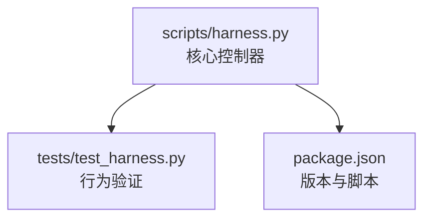
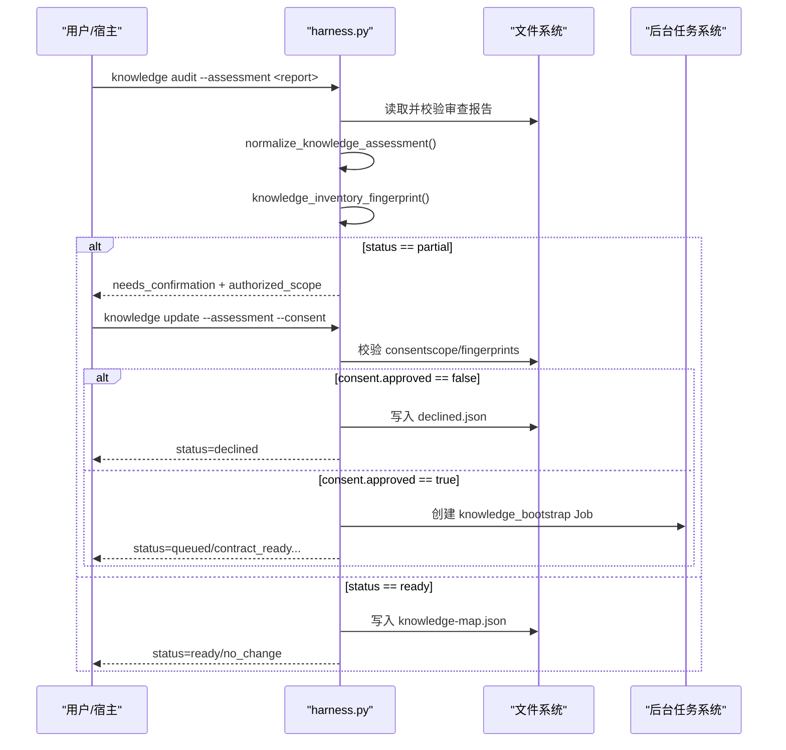
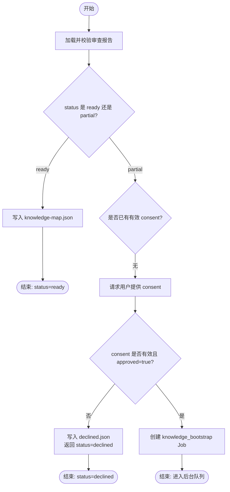
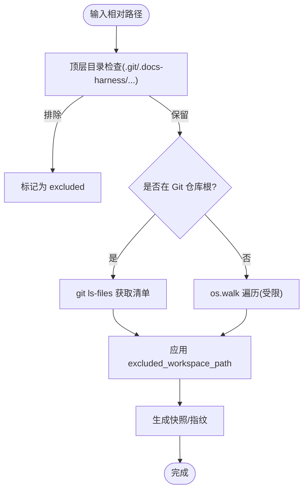
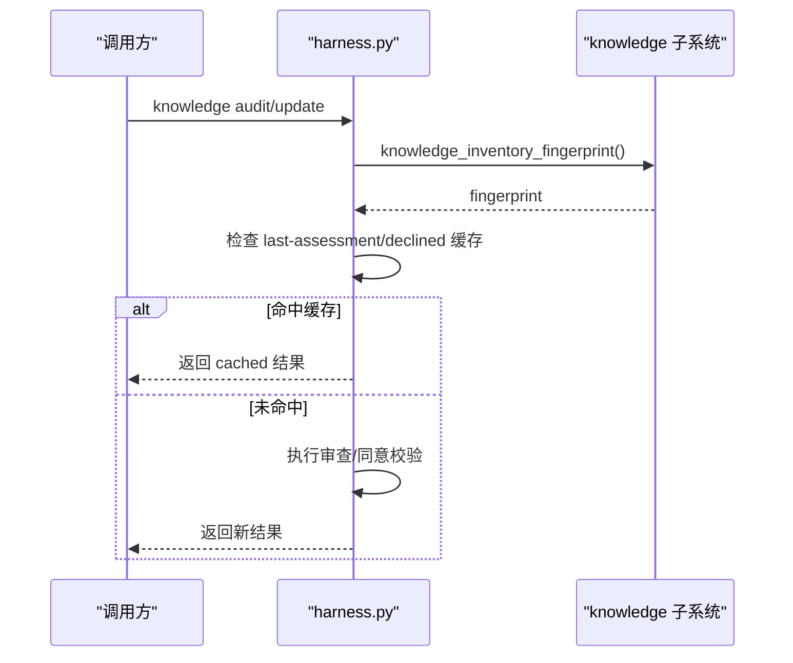
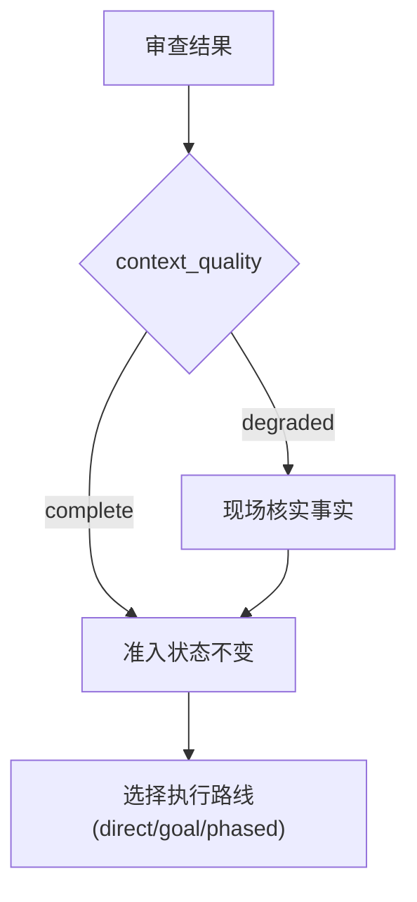
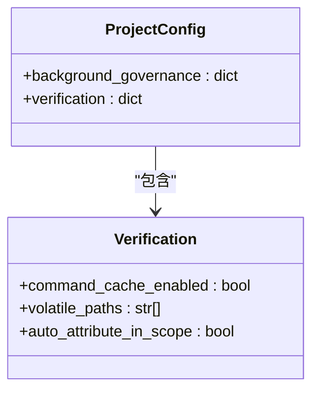
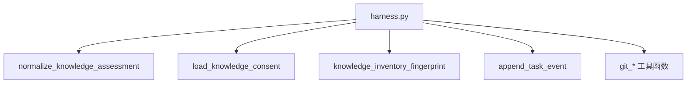

# 知识审查流程

<cite>
**本文引用的文件**   
- [scripts/harness.py](file://scripts/harness.py)
- [tests/test_harness.py](file://tests/test_harness.py)
- [package.json](file://package.json)
</cite>

## 目录
1. [简介](#简介)
2. [项目结构](#项目结构)
3. [核心组件](#核心组件)
4. [架构总览](#架构总览)
5. [详细组件分析](#详细组件分析)
6. [依赖关系分析](#依赖关系分析)
7. [性能考量](#性能考量)
8. [故障排查指南](#故障排查指南)
9. [结论](#结论)
10. [附录：配置与自定义规则示例](#附录配置与自定义规则示例)

## 简介
本文件面向 Docs Harness 的“知识审查”工作流，系统性阐述以下主题：
- 三种审查状态（assessment、consent、decline）的处理逻辑与转换条件
- 审查过滤器的工作机制与默认排除规则（.git、.docs-harness、依赖目录、构建缓存等）
- 审查缓存机制，包括 knowledge_inventory_fingerprint 绑定与 cache_hit 判断
- 审查结果对业务准入的影响，以及 context_quality 的计算方法与影响范围
- 审查配置示例与自定义过滤规则开发指南

该流程以“证据可复用、失败关闭”为核心原则，通过结构化审查报告与用户同意回执，驱动知识库从“审计/增量更新”到“就绪”的受控演进。

## 项目结构
- 控制脚本位于 scripts/harness.py，实现命令解析、知识扫描、审查校验、同意回执处理、后台任务派发与事件记录等核心能力
- 测试用例位于 tests/test_harness.py，覆盖知识审计、同意/拒绝、缓存命中、Git 预检/后检等关键路径
- package.json 提供版本信息与脚本入口，便于统一打包与自测

**图表来源** 
- [scripts/harness.py:1-120](file://scripts/harness.py#L1-L120)
- [package.json:1-23](file://package.json#L1-L23)

**章节来源**
- [scripts/harness.py:1-120](file://scripts/harness.py#L1-L120)
- [package.json:1-23](file://package.json#L1-L23)

## 核心组件
- 知识库存与指纹
  - bounded_project_inventory：按包含模式与排除规则收集项目文件元数据，支持 Git 优先与非 Git 回退，限制上限避免过大快照
  - knowledge_inventory_fingerprint：基于库存与显式 includes 生成稳定指纹，用于缓存与一致性校验
- 审查报告与同意回执
  - normalize_knowledge_assessment：校验 schema_version、status（ready/partial）、gaps 合法性，并归一化为知识地图
  - load_knowledge_consent：校验 approved、authorized_scope、assessment_fingerprint、inventory_fingerprint 的一致性
- 运行时与工件
  - knowledge_runtime_root：知识相关工件根目录（runs/knowledge）
  - last-assessment.json、declined.json：记录最近一次审查与拒绝回执
- 事件与遥测
  - append_task_event：记录 context_cache_hit、context_load_count、readmission_count 等指标
  - verification_command_cache_enabled/auto_attribute_in_scope：验证命令缓存与自动归因开关

**章节来源**
- [scripts/harness.py:7700-7715](file://scripts/harness.py#L7700-L7715)
- [scripts/harness.py:8029-8077](file://scripts/harness.py#L8029-L8077)
- [scripts/harness.py:9050-9200](file://scripts/harness.py#L9050-L9200)
- [scripts/harness.py:1031-1071](file://scripts/harness.py#L1031-L1071)

## 架构总览
知识审查流程围绕“审计→同意/拒绝→更新→就绪”的主干展开，结合库存指纹与缓存命中，确保幂等与可追溯。

**图表来源** 
- [scripts/harness.py:9055-9171](file://scripts/harness.py#L9055-L9171)
- [scripts/harness.py:8029-8077](file://scripts/harness.py#L8029-L8077)
- [scripts/harness.py:7707-7714](file://scripts/harness.py#L7707-L7714)

## 详细组件分析

### 审查状态与转换条件（assessment、consent、decline）
- assessment（审查报告）
  - 必须为 docs-harness/knowledge-assessment/v1，status 仅允许 ready 或 partial
  - ready 不得声明 gaps；partial 需携带 gaps 列表
  - 归一化后生成知识地图（features、shared_refs、documents），ready 时要求文件存在
- consent（同意回执）
  - 必须为 docs-harness/knowledge-consent/v1，approved 布尔值
  - authorized_scope 必须覆盖 allowed_scope；否则报错
  - 必须绑定 assessment_fingerprint 与 inventory_fingerprint，任一不匹配视为过期
- decline（拒绝回执）
  - 当 consent.approved 为 false 时，写入 declined.json，包含 assessment/inventory 指纹与授权范围
  - 后续相同指纹的 partial 审查可直接返回 cached 拒绝，避免重复交互

**图表来源** 
- [scripts/harness.py:9055-9171](file://scripts/harness.py#L9055-L9171)
- [scripts/harness.py:8029-8077](file://scripts/harness.py#L8029-L8077)

**章节来源**
- [scripts/harness.py:8029-8077](file://scripts/harness.py#L8029-L8077)
- [scripts/harness.py:9055-9171](file://scripts/harness.py#L9055-L9171)

### 审查过滤器与默认排除规则
- 工作区快照与扫描排除
  - excluded_workspace_path：排除 .git、node_modules、.venv，以及 .docs-harness/runs、quality-ledger、knowledge、knowledge-jobs、background
  - git_workspace_paths：优先使用 Git ls-files，非 Git 回退 os.walk，并应用排除规则
  - workspace_snapshot：对大文件采用 size+mtime 指纹，小文件计算 sha256；超过阈值直接拒绝截断基线
- 验证命令缓存与易变路径
  - VOLATILE_VERIFICATION_DIR_PARTS/SUFFIXES/FILENAMES：内置常见缓存与临时文件后缀
  - configured_volatile_verification_patterns：从 project_config.verification.volatile_paths 读取额外模式
  - verification_command_cache_enabled：默认开启，可通过配置关闭
- 文档路由与治理范围
  - document_route_candidates/resolution：自动发现 architecture/changelog/todo/adr/reviews 路由，严格校验类型与安全
  - governance_route_scopes：根据路由生成 reads/writes 作用域

**图表来源** 
- [scripts/harness.py:1073-1135](file://scripts/harness.py#L1073-L1135)
- [scripts/harness.py:1142-1234](file://scripts/harness.py#L1142-L1234)
- [scripts/harness.py:1287-1456](file://scripts/harness.py#L1287-L1456)

**章节来源**
- [scripts/harness.py:1073-1135](file://scripts/harness.py#L1073-L1135)
- [scripts/harness.py:1142-1234](file://scripts/harness.py#L1142-L1234)
- [scripts/harness.py:1287-1456](file://scripts/harness.py#L1287-L1456)

### 审查缓存机制（knowledge_inventory_fingerprint 与 cache_hit）
- 库存指纹
  - knowledge_inventory_fingerprint：基于 inventory 与 explicit_includes 生成稳定哈希，作为审查与同意的绑定键
- 上下文缓存命中
  - append_task_event 记录 context_cache_hit、context_load_count
  - 在 context 阶段若命中缓存 receipt，则事件中标记 cache_hit=true，减少重复加载
- 拒绝缓存
  - declined.json 绑定 assessment_fingerprint 与 inventory_fingerprint，相同指纹的 partial 审查直接返回 cached 拒绝

**图表来源** 
- [scripts/harness.py:7707-7714](file://scripts/harness.py#L7707-L7714)
- [scripts/harness.py:9055-9171](file://scripts/harness.py#L9055-L9171)
- [scripts/harness.py:1031-1071](file://scripts/harness.py#L1031-L1071)

**章节来源**
- [scripts/harness.py:7707-7714](file://scripts/harness.py#L7707-L7714)
- [scripts/harness.py:9055-9171](file://scripts/harness.py#L9055-L9171)
- [scripts/harness.py:1031-1071](file://scripts/harness.py#L1031-L1071)

### 审查结果对业务准入的影响与 context_quality
- 准入状态
  - 只有 ready_direct、ready_planned、ready_extended 允许进入对应执行阶段
  - context_quality=degraded 表示知识不完整，但不改变准入状态；必须在现场核实事实
- 质量评估
  - workload_estimate 综合源码规模、特性候选、架构域、技术栈、知识缺口、跨特性依赖等打分，决定执行路线（direct/goal/phased）
  - 知识缺口比例与依赖复杂度直接影响复杂度分类与资源分配

**图表来源** 
- [scripts/harness.py:9174-9200](file://scripts/harness.py#L9174-L9200)
- [scripts/harness.py:7774-7899](file://scripts/harness.py#L7774-L7899)

**章节来源**
- [scripts/harness.py:9174-9200](file://scripts/harness.py#L9174-L9200)
- [scripts/harness.py:7774-7899](file://scripts/harness.py#L7774-L7899)

### 审查配置与自定义过滤规则开发指南
- 项目配置位置
  - .docs-harness/config.json，包含 background_governance.document_routes、verification.* 等
- 文档路由配置
  - 显式声明 architecture/changelog/todo/adr_root/reviews_root 的路径，严格校验安全与类型
- 验证命令缓存与易变路径
  - verification.command_cache_enabled：整体开关
  - verification.volatile_paths：追加易变路径模式（需满足固定根、长度与字符限制）
- 自定义过滤扩展点
  - 在 excluded_workspace_path 与 volatile_verification_path 的基础上，通过 project_config 注入额外模式
  - 注意禁止将 .git/.docs-harness 作为 volatile_paths 前缀，防止误排

**图表来源** 
- [scripts/harness.py:1279-1346](file://scripts/harness.py#L1279-L1346)
- [scripts/harness.py:1178-1234](file://scripts/harness.py#L1178-L1234)

**章节来源**
- [scripts/harness.py:1279-1346](file://scripts/harness.py#L1279-L1346)
- [scripts/harness.py:1178-1234](file://scripts/harness.py#L1178-L1234)

## 依赖关系分析
- 模块内依赖
  - 知识审计/更新依赖 normalize_knowledge_assessment、load_knowledge_consent、knowledge_inventory_fingerprint
  - 事件记录依赖 append_task_event，统计 context_cache_hit、readmission_count 等
- 外部依赖
  - Git 子进程调用用于仓库探测、ls-files、diff、refs 快照等
  - 文件系统原子写入与 JSON 读写

**图表来源** 
- [scripts/harness.py:8029-8077](file://scripts/harness.py#L8029-L8077)
- [scripts/harness.py:7707-7714](file://scripts/harness.py#L7707-L7714)
- [scripts/harness.py:1031-1071](file://scripts/harness.py#L1031-L1071)

**章节来源**
- [scripts/harness.py:8029-8077](file://scripts/harness.py#L8029-L8077)
- [scripts/harness.py:7707-7714](file://scripts/harness.py#L7707-L7714)
- [scripts/harness.py:1031-1071](file://scripts/harness.py#L1031-L1071)

## 性能考量
- 库存扫描限制
  - FALLBACK_SNAPSHOT_FILE_LIMIT 限制非 Git 遍历的文件数量，避免 OOM 与超时
  - 大文件采用 size+mtime 指纹，降低 I/O 压力
- 缓存命中
  - 上下文缓存与验证命令缓存显著减少重复计算与命令执行
- Git 操作优化
  - 优先使用 git ls-files 与 diff，避免全量遍历
  - 预检/后检集中校验，减少往返

[本节为通用指导，无需特定文件引用]

## 故障排查指南
- 常见错误码与原因
  - invalid_knowledge_assessment：审查报告 schema/status/gaps 非法
  - invalid_knowledge_consent：同意回执 schema/approved/scope/fingerprints 非法或不匹配
  - knowledge_consent_stale：指纹过期（assessment/inventory）
  - workspace_snapshot_truncated：非 Git 快照过大被截断
  - git_preflight_failed/git_remote_drift：Git 预检失败或远端漂移
- 定位步骤
  - 查看 last-assessment.json 与 declined.json 确认最近审查与拒绝状态
  - 检查 events.jsonl 中 context_cache_hit、readmission_count、evidence_round_count 等指标
  - 核对 project_config 中的 verification 与 document_routes 配置

**章节来源**
- [scripts/harness.py:8029-8077](file://scripts/harness.py#L8029-L8077)
- [scripts/harness.py:9055-9171](file://scripts/harness.py#L9055-L9171)
- [scripts/harness.py:1031-1071](file://scripts/harness.py#L1031-L1071)
- [scripts/harness.py:1178-1234](file://scripts/harness.py#L1178-L1234)

## 结论
Docs Harness 的知识审查流程通过严格的审查报告与同意回执校验、稳定的库存指纹与缓存机制，实现了可控、可追溯、幂等的知识库演进。审查结果直接影响业务准入与执行路线，而 context_quality 的降级提示确保在知识不完整时仍能安全推进。借助灵活的过滤与配置扩展点，团队可按需定制审查策略与排除规则，平衡效率与安全性。

[本节为总结性内容，无需特定文件引用]

## 附录：配置与自定义规则示例
- 项目配置示例（.docs-harness/config.json）
  - background_governance.document_routes：显式声明文档路由
  - verification.command_cache_enabled：关闭/开启验证命令缓存
  - verification.volatile_paths：追加易变路径模式（如 build/dist 输出）
- 自定义过滤规则建议
  - 在 project_config.verification.volatile_paths 中添加项目特有缓存目录
  - 避免将 .git/.docs-harness 纳入 volatile_paths 前缀
  - 使用绝对安全的 glob（固定根、无通配符前缀、长度与字符限制）

**章节来源**
- [scripts/harness.py:1279-1346](file://scripts/harness.py#L1279-L1346)
- [scripts/harness.py:1178-1234](file://scripts/harness.py#L1178-L1234)