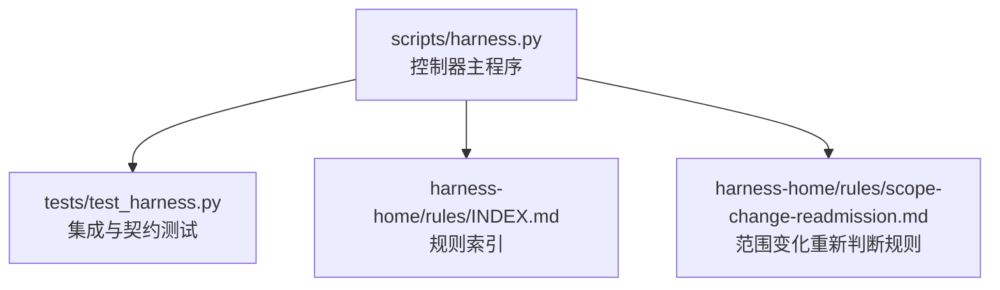
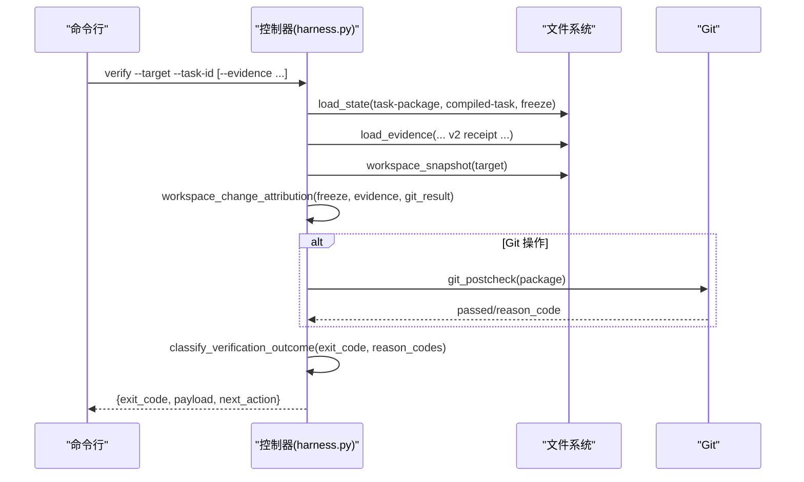
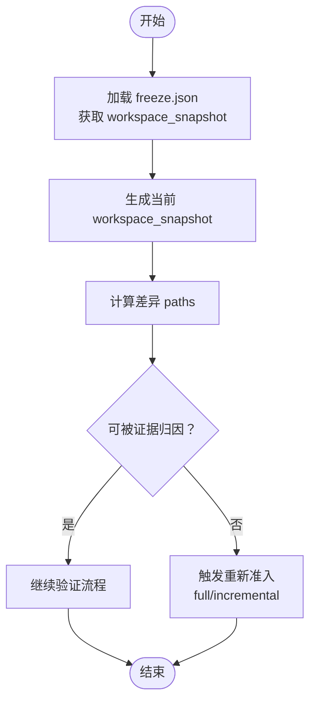
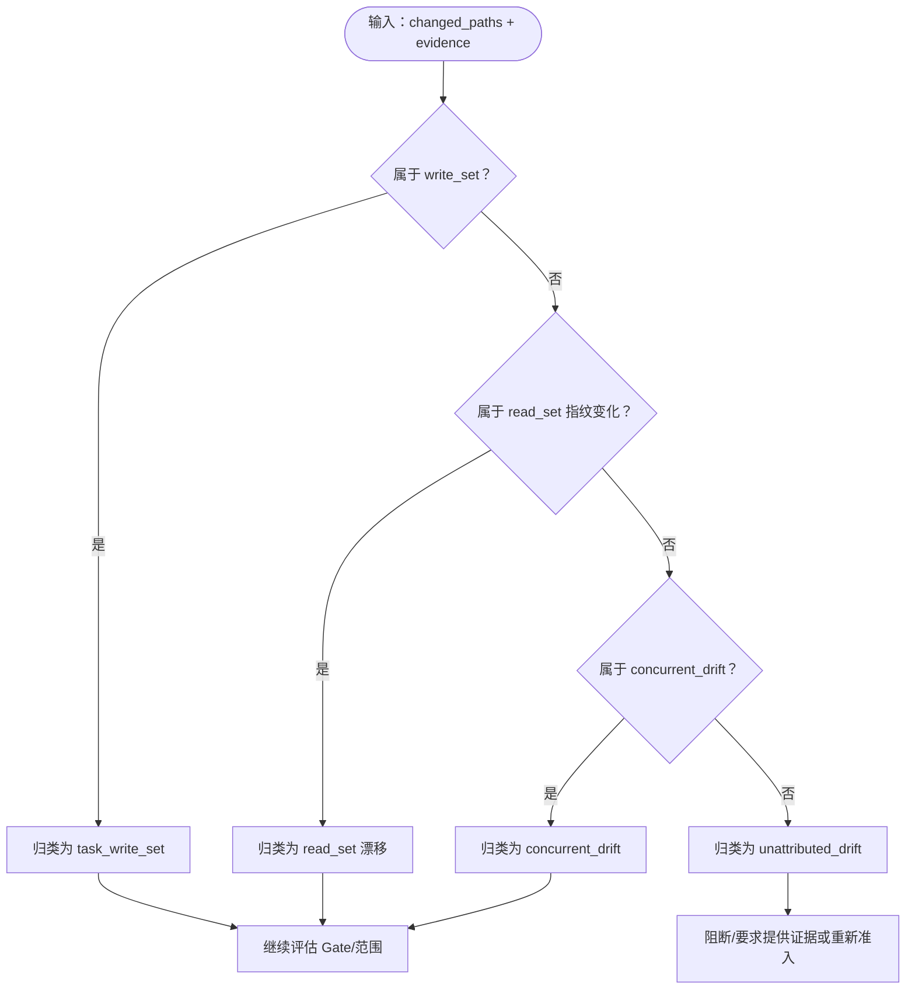
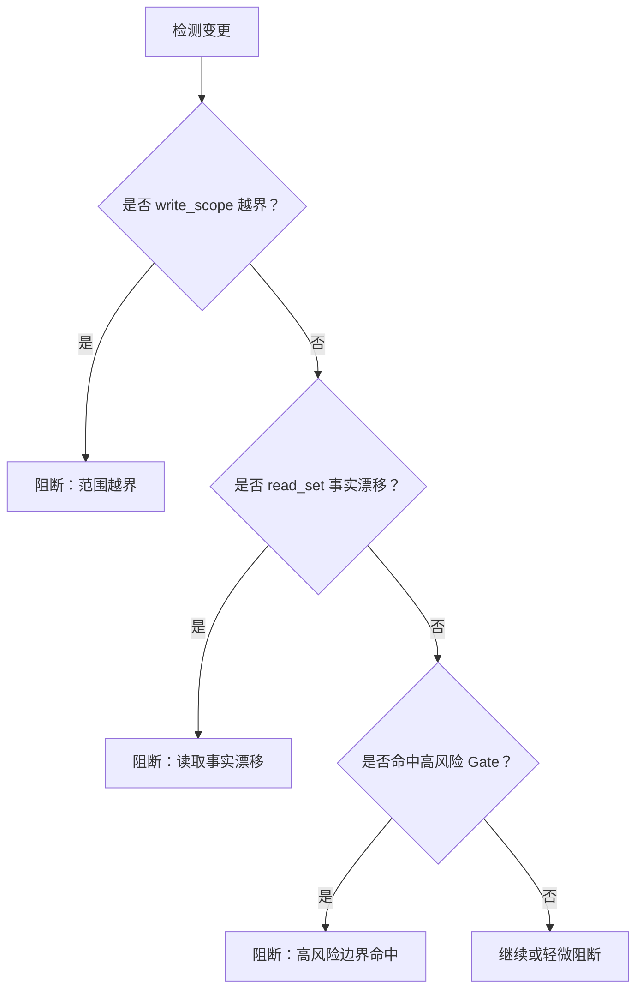
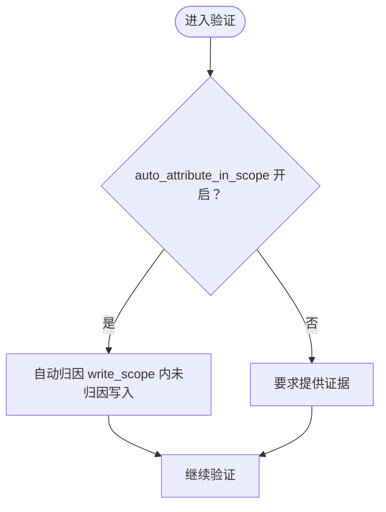
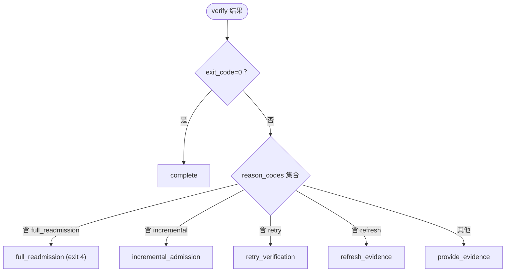
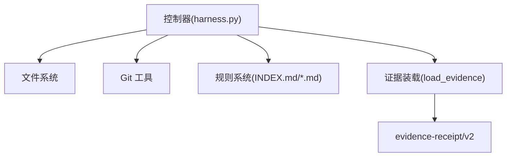

# 工作区漂移归因

<cite>
**本文引用的文件**   
- [harness.py](file://scripts/harness.py)
- [test_harness.py](file://tests/test_harness.py)
- [INDEX.md](file://harness-home/rules/INDEX.md)
- [scope-change-readmission.md](file://harness-home/rules/scope-change-readmission.md)
</cite>

## 目录
1. [简介](#简介)
2. [项目结构](#项目结构)
3. [核心组件](#核心组件)
4. [架构总览](#架构总览)
5. [详细组件分析](#详细组件分析)
6. [依赖关系分析](#依赖关系分析)
7. [性能考量](#性能考量)
8. [故障排查指南](#故障排查指南)
9. [结论](#结论)
10. [附录](#附录)

## 简介
本文件系统化阐述 Docs Harness 的工作区漂移归因机制，重点包括：
- freeze.json.workspace_snapshot 基线的作用与重新准入行为
- 四种漂移分类的判断逻辑与处置：task_write_set（可信任务写入）、read_set（读取集）、concurrent_drift（并发进程变化）、unattributed_drift（未归因变化）
- 阻断规则优先级与冲突解决：write_scope 越界、读取事实漂移、高风险边界命中等
- 自动归因 auto_attribute_in_scope 的工作原理与配置
- 五级处置策略：provide_evidence、refresh_evidence、retry_verification、incremental_admission、full_readmission 的应用场景与退出码
- 漂移检测与归因的实际案例

## 项目结构
- scripts/harness.py：控制器主程序，包含工作区快照、证据装载、漂移归因、验证流程、Git 预检/后检、合同与处置判定等核心实现
- tests/test_harness.py：覆盖关键路径的测试用例，用于验证 Git 同步漂移、只读审计、意图推断、范围变更等
- harness-home/rules/*：通用规则快照与索引，约束生效规则清单与加载约定

**图表来源** 
- [harness.py:3229-3262](file://scripts/harness.py#L3229-L3262)
- [test_harness.py:620-650](file://tests/test_harness.py#L620-L650)
- [INDEX.md:1-41](file://harness-home/rules/INDEX.md#L1-L41)
- [scope-change-readmission.md:1-29](file://harness-home/rules/scope-change-readmission.md#L1-L29)

**章节来源**
- [harness.py:1-120](file://scripts/harness.py#L1-L120)
- [INDEX.md:1-41](file://harness-home/rules/INDEX.md#L1-L41)

## 核心组件
- 工作区快照与基线
  - workspace_snapshot(target)：生成当前工作区文件指纹映射；大文件使用大小+时间戳摘要；非 Git 工作区有文件数量上限保护
  - create_task_state(...)：创建任务状态时写入 freeze.json，包含 workspace_snapshot、workspace_fingerprint、git_state_snapshot、environment 等
- 证据装载与归因
  - load_evidence(...)：校验并标准化 evidence-receipt/v2，规范化 read_set、write_set、concurrent_drift，设置 attribution_quality 与 trust_level
  - mint_evidence_receipt(...)：将声明式证据装订为收据，填充 read_set 指纹、concurrent_drift 等
- 漂移归因与阻断
  - workspace_change_attribution(...)：对比 freeze.workspace_snapshot 与当前快照，结合证据中的 write_set/read_set/concurrent_drift，输出 changed_paths、outside_scope、new_gates、blockers
  - classify_verification_outcome(...)：根据 exit_code 与 reason_codes 映射到五级处置策略
- Git 预检/后检
  - git_preflight_contract(...)：对 git_fetch/git_sync 进行前置检查，记录 worktree_fingerprint、controlled_refs_namespace、fast_forward、deletion_count 等
  - git_postcheck(...)：执行后校验远端目标是否变化、受控引用是否一致、脏工作区是否与同步范围重叠等

**章节来源**
- [harness.py:1115-1138](file://scripts/harness.py#L1115-L1138)
- [harness.py:3229-3262](file://scripts/harness.py#L3229-L3262)
- [harness.py:5203-5240](file://scripts/harness.py#L5203-L5240)
- [harness.py:5243-5395](file://scripts/harness.py#L5243-L5395)
- [harness.py:6382-6394](file://scripts/harness.py#L6382-L6394)
- [harness.py:680-794](file://scripts/harness.py#L680-L794)

## 架构总览
下图展示 verify 入口的关键调用链与数据流，体现从任务状态加载、证据装载、工作区漂移归因到处置决策的全过程。

**图表来源** 
- [harness.py:6468-6579](file://scripts/harness.py#L6468-L6579)
- [harness.py:5243-5395](file://scripts/harness.py#L5243-L5395)
- [harness.py:1115-1138](file://scripts/harness.py#L1115-L1138)
- [harness.py:6382-6394](file://scripts/harness.py#L6382-L6394)

## 详细组件分析

### 基线与重新准入：freeze.json.workspace_snapshot
- 作用
  - 冻结任务包创建时的完整工作区快照，作为后续漂移检测的基准
  - 与 workspace_fingerprint 共同确保基线一致性
  - 在 Git 操作中记录 git_state_snapshot，辅助远端/本地一致性校验
- 重新准入触发
  - 当 workspace_snapshot 发生变化且无法被证据归因覆盖时，进入需要重新准入的流程
  - 若涉及范围/授权/路由等合同字段变化，直接 full_readmission

**图表来源** 
- [harness.py:3229-3262](file://scripts/harness.py#L3229-L3262)
- [harness.py:1115-1138](file://scripts/harness.py#L1115-L1138)

**章节来源**
- [harness.py:3229-3262](file://scripts/harness.py#L3229-L3262)
- [harness.py:1115-1138](file://scripts/harness.py#L1115-L1138)

### 漂移分类与处理逻辑
- task_write_set（可信任务写入）
  - 来自证据 write_set 或 changed_paths，且生产者可信（如 docs-harness/host_declaration、codex-host/file_receipt 等）
  - 视为任务自身产生的变更，允许通过
- read_set（读取集）
  - 证据中声明的 read_set 用于证明读取了哪些事实文件及其指纹
  - 若 read_set 中文件指纹与基线不一致，可能触发“读取事实漂移”阻断
- concurrent_drift（并发进程变化）
  - 由其他进程在工作区产生的变更，证据中声明 concurrent_drift 列表
  - 控制器将其排除在任务归因之外，但仍需评估是否影响 Gate/范围
- unattributed_drift（未归因变化）
  - 不在 write_set/read_set/concurrent_drift 中的变化
  - 通常导致阻断并要求提供证据或重新准入

**图表来源** 
- [harness.py:5243-5395](file://scripts/harness.py#L5243-L5395)
- [harness.py:5203-5240](file://scripts/harness.py#L5203-L5240)

**章节来源**
- [harness.py:5243-5395](file://scripts/harness.py#L5243-L5395)
- [harness.py:5203-5240](file://scripts/harness.py#L5203-L5240)

### 阻断规则优先级与冲突解决
- write_scope 越界
  - 任何超出 write_scope 的变更将被阻断，要求缩小范围或重新准入
- 读取事实漂移
  - read_set 中声明的事实文件指纹与基线不一致，触发阻断
- 高风险边界命中
  - 新匹配的高风险 Gate（如 security-sensitive、destructive-data、release-external）会强制 full_readmission
- 优先级
  - 高风险 Gate > 范围越界 > 读取事实漂移 > 其他阻断
  - 若同时存在多个原因，按上述顺序选择最严格的处置

**图表来源** 
- [harness.py:6468-6579](file://scripts/harness.py#L6468-L6579)
- [harness.py:6382-6394](file://scripts/harness.py#L6382-L6394)

**章节来源**
- [harness.py:6468-6579](file://scripts/harness.py#L6468-L6579)
- [harness.py:6382-6394](file://scripts/harness.py#L6382-L6394)

### 自动归因 auto_attribute_in_scope
- 工作原理
  - 默认启用：write_scope 内的未归因写入会被控制器自动归因为任务写入
  - 可通过 verification.auto_attribute_in_scope=false 关闭，关闭后未归因写入将要求 provide_evidence
- 配置位置
  - .docs-harness/config.json 中 verification.auto_attribute_in_scope 布尔值

**图表来源** 
- [harness.py:1205-1216](file://scripts/harness.py#L1205-L1216)
- [harness.py:6616-6618](file://scripts/harness.py#L6616-L6618)

**章节来源**
- [harness.py:1205-1216](file://scripts/harness.py#L1205-L1216)
- [harness.py:6616-6618](file://scripts/harness.py#L6616-L6618)

### 五级处置策略与应用场景
- provide_evidence
  - 需要补充证据才能继续验证
- refresh_evidence
  - 现有证据过期或绑定不匹配，需要刷新
- retry_verification
  - 验证命令失败但可重试（如临时资源不可用）
- incremental_admission
  - 仅新增 Gate/上下文/证据类型变化，增量重新准入
- full_readmission
  - 范围/授权/路由等合同变化，或高风险 Gate 命中，必须完全重新准入

**图表来源** 
- [harness.py:6382-6394](file://scripts/harness.py#L6382-L6394)

**章节来源**
- [harness.py:6382-6394](file://scripts/harness.py#L6382-L6394)

### 实际案例
- Git 远端漂移触发重新准入
  - 场景：计划 git_sync 后，远端 main 分支被推送新提交，verify 返回 reason_code=git_remote_drift，exit_code=4
  - 处置：full_readmission，需重新准入
- 脏工作区与同步范围重叠
  - 场景：README.md 本地修改与 git_sync 同步范围重叠，preflight 阶段阻断
  - 处置：blocked，需清理工作区或调整范围
- 只读审计保持高风险 Gate
  - 场景：查询类任务仍匹配 security-sensitive，保留高风险 Gate 约束
  - 处置：继续验证，不升级 mutation_profile

**章节来源**
- [test_harness.py:620-650](file://tests/test_harness.py#L620-L650)
- [test_harness.py:685-709](file://tests/test_harness.py#L685-L709)
- [test_harness.py:795-800](file://tests/test_harness.py#L795-L800)

## 依赖关系分析
- 控制器依赖
  - 文件系统：读写任务状态、证据、freeze.json、事件日志
  - Git：执行 preflight/postcheck，捕获 refs、diff、status
  - 规则系统：基于 INDEX.md 与具体规则文件进行 Gate 匹配与约束
- 证据依赖
  - evidence-receipt/v2 强绑定 package_fingerprint、target_identity、producer 白名单
  - read_set/write_set/concurrent_drift 用于漂移归因与阻断判定

**图表来源** 
- [harness.py:5243-5395](file://scripts/harness.py#L5243-L5395)
- [INDEX.md:1-41](file://harness-home/rules/INDEX.md#L1-L41)

**章节来源**
- [harness.py:5243-5395](file://scripts/harness.py#L5243-L5395)
- [INDEX.md:1-41](file://harness-home/rules/INDEX.md#L1-L41)

## 性能考量
- 工作区快照
  - 大文件使用 size+mtime 摘要避免哈希开销
  - 非 Git 工作区限制文件数量上限，防止截断基线
- 验证命令缓存
  - 默认开启 verification.command_cache_enabled，减少重复执行
- 上下文加载计数
  - 统计 full/delta 加载次数，辅助优化上下文调度

[本节为通用指导，无需特定文件来源]

## 故障排查指南
- 常见错误码与含义
  - invalid_evidence/evidence_binding_mismatch：证据格式或绑定不匹配
  - workspace_snapshot_truncated：非 Git 工作区快照过大
  - git_preflight_failed/git_remote_unavailable：Git 预检失败或远端不可用
  - plan_contract_drift/authorization_contract_drift：方案或授权合同漂移
- 定位步骤
  - 检查 freeze.json 与当前 workspace_snapshot 差异
  - 核对 evidence.read_set 指纹与基线一致性
  - 查看 git_postcheck 结果与 blockers
  - 确认 auto_attribute_in_scope 配置是否符合预期

**章节来源**
- [harness.py:1115-1138](file://scripts/harness.py#L1115-L1138)
- [harness.py:680-794](file://scripts/harness.py#L680-L794)
- [harness.py:5243-5395](file://scripts/harness.py#L5243-L5395)

## 结论
Docs Harness 的工作区漂移归因机制以 freeze.json.workspace_snapshot 为核心基线，结合证据声明与 Git 预检/后检，实现对任务写入、读取事实、并发变化与未归因变化的精细分类与处置。通过 auto_attribute_in_scope 的灵活配置与五级处置策略，系统在安全性与效率之间取得平衡。实际使用中应重点关注 write_scope 越界、读取事实漂移与高风险 Gate 命中等关键阻断点，确保任务执行的合规性与可追溯性。

[本节为总结，无需特定文件来源]

## 附录
- 相关规则
  - scope-change-readmission.md：范围变化重新判断规则，明确失败处理方式与验收条件

**章节来源**
- [scope-change-readmission.md:1-29](file://harness-home/rules/scope-change-readmission.md#L1-L29)