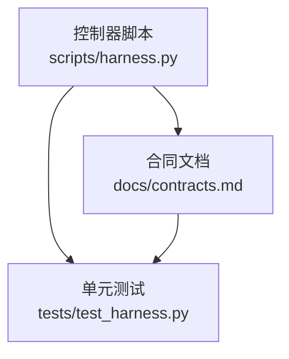
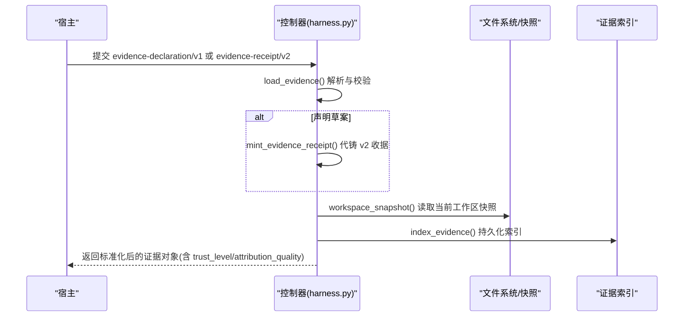
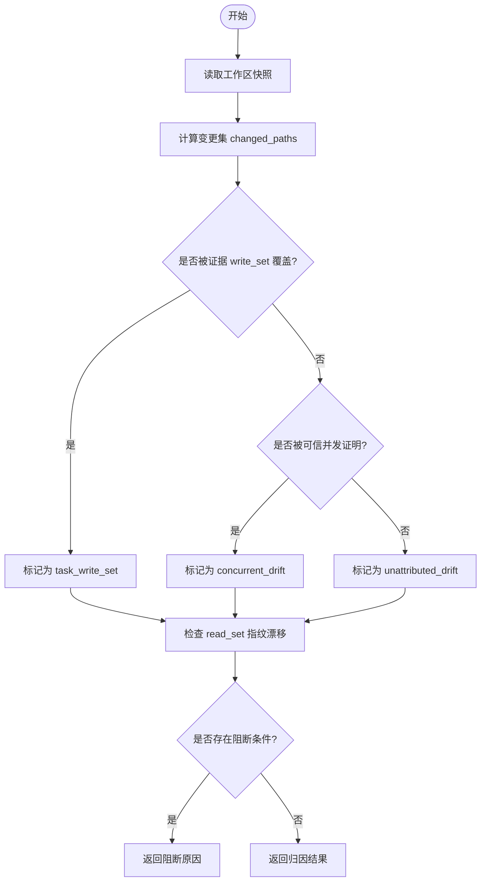
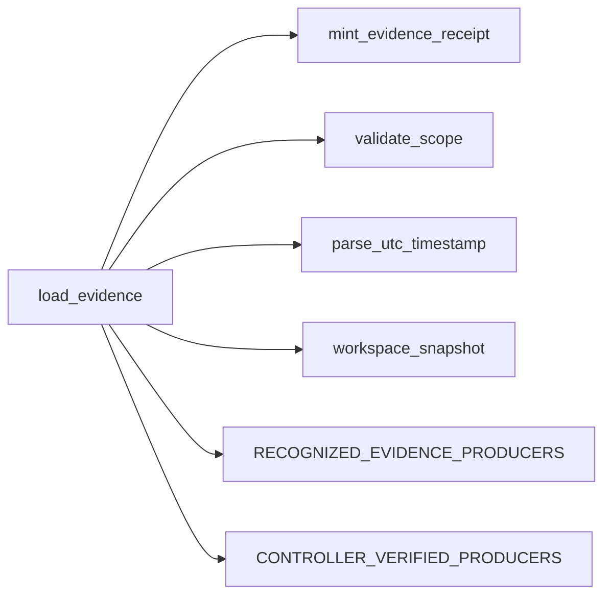

# 证据收据格式

<cite>
**本文引用的文件**   
- [scripts/harness.py](file://scripts/harness.py)
- [docs/contracts.md](file://docs/contracts.md)
- [tests/test_harness.py](file://tests/test_harness.py)
</cite>

## 更新摘要
**变更内容**   
- 更新了证据信任机制说明，反映新的解耦设计
- 修正了生产者认证机制的描述，明确宿主提交证据的统一处理
- 更新了可信生产者和报告型生产者的区别定义
- 完善了trust_level字段的计算逻辑说明

## 目录
1. [简介](#简介)
2. [项目结构](#项目结构)
3. [核心组件](#核心组件)
4. [架构总览](#架构总览)
5. [详细组件分析](#详细组件分析)
6. [依赖关系分析](#依赖关系分析)
7. [性能考虑](#性能考虑)
8. [故障排查指南](#故障排查指南)
9. [结论](#结论)
10. [附录](#附录)

## 简介
本文件面向 Docs Harness v1.6.5 的"证据收据 v2"（schema: docs-harness/evidence-receipt/v2）提供完整、可操作的规范说明。重点覆盖：
- 必填绑定字段与校验规则：task_id、target_identity、package_fingerprint、content_set_fingerprint
- **更新的** 生产者认证机制：证据信任机制已与生产者名称解耦，所有宿主提交的证据统一标记为'reported'，只有受控内部入口才能产生'verified'状态
- 时间戳管理：started_at、ended_at、ttl 的使用场景与过期判定
- 命令参数摘要 digest 的计算方法与 cwd 工作目录的安全约束
- 输出或工件摘要 output_or_artifact_digest 的生成规则
- read_set 与 write_set 的路径验证与指纹计算
- 完整的 JSON 示例与常见错误处理场景

## 项目结构
与证据收据 v2 直接相关的实现集中在控制器脚本与合同文档中：
- 控制器脚本负责装载、代铸、校验与索引证据收据
- 合同文档定义 v2 收据的字段语义、准入规则与迁移策略
- 测试用例覆盖了关键路径与边界条件

图表来源
- [scripts/harness.py](file://scripts/harness.py)
- [docs/contracts.md](file://docs/contracts.md)
- [tests/test_harness.py](file://tests/test_harness.py)

章节来源
- [scripts/harness.py](file://scripts/harness.py)
- [docs/contracts.md](file://docs/contracts.md)
- [tests/test_harness.py](file://tests/test_harness.py)

## 核心组件
- 证据装载与校验：load_evidence 负责解析输入、区分声明草案与完整收据、执行 v2 绑定与信任校验
- 证据代铸：mint_evidence_receipt 将宿主提交的声明草案装配为完整 v2 收据，由控制器填充绑定字段与摘要
- 工作区漂移归因：workspace_change_attribution 基于证据与快照计算 task_write_set、read_set、concurrent_drift、unattributed_drift 并产出阻断/告警
- 常量与工具：EVIDENCE_RECEIPT_SCHEMA、RECOGNIZED_EVIDENCE_PRODUCERS、CONTROLLER_VERIFIED_PRODUCERS、sha256_text、utc_now、workspace_snapshot 等

章节来源
- [scripts/harness.py:5076-5228](file://scripts/harness.py#L5076-L5228)
- [scripts/harness.py:5036-5073](file://scripts/harness.py#L5036-L5073)
- [scripts/harness.py:5238-5340](file://scripts/harness.py#L5238-L5340)
- [scripts/harness.py:270-284](file://scripts/harness.py#L270-L284)
- [scripts/harness.py:403-416](file://scripts/harness.py#L403-L416)

## 架构总览
证据收据 v2 的生命周期包括：宿主提交声明或完整收据 → 控制器装载与校验 → 必要时代铸 → 索引归档 → 验收阶段结合快照进行漂移归因与 Gate 判定。

图表来源
- [scripts/harness.py:5076-5228](file://scripts/harness.py#L5076-L5228)
- [scripts/harness.py:5036-5073](file://scripts/harness.py#L5036-L5073)
- [scripts/harness.py:5343-5348](file://scripts/harness.py#L5343-L5348)

## 详细组件分析

### 必填绑定字段与校验规则
- task_id：必须与当前任务包一致，否则拒绝（evidence_binding_mismatch）
- target_identity：必须与目标仓库身份一致，否则拒绝（evidence_binding_mismatch）
- package_fingerprint：必须与当前任务包指纹一致，否则拒绝（evidence_binding_mismatch）
- content_set_fingerprint：可选；若存在则必须是 sha256:... 格式，否则拒绝（invalid_evidence_receipt）
- producer：必须为包含 adapter 与 capability 的对象，且 (adapter, capability) 必须在可信生产者白名单中，否则拒绝（untrusted_evidence_producer）
- command_argv_digest：sha256:... 格式的字符串，用于绑定命令参数摘要
- cwd：必须等于目标根目录的绝对路径，否则拒绝（evidence_binding_mismatch）
- started_at / ended_at：UTC ISO 时间戳，ended_at 不得早于 started_at
- ttl：正整数，范围 1..604800；当前时间不得晚于 ended_at + ttl，否则拒绝（evidence_expired）
- exit_code：v2 要求为 0，否则拒绝（evidence_binding_mismatch）
- output_or_artifact_digest：sha256:... 格式的字符串，代表输出或工件摘要
- read_set：数组，元素可为字符串或 {path, fingerprint}；fingerprint 若存在须为 sha256:... 格式
- write_set：数组，路径需通过 validate_scope 校验（项目内相对路径/glob/受控 Git 资源）

章节来源
- [scripts/harness.py:6358-6407](file://scripts/harness.py#L6358-L6407)
- [scripts/harness.py:6380-6392](file://scripts/harness.py#L6380-L6392)
- [docs/contracts.md:183-204](file://docs/contracts.md#L183-L204)

### 生产者认证机制
**已更新** 证据信任机制现已与生产者名称解耦，采用更严格的控制策略：

- **受控内部入口**：只有 `docs-harness/git_postcheck`、`docs-harness/verification_command`、`docs-harness/auto_attribution` 这三个受控内部入口能够产生 `verified` 状态的证据
- **宿主提交证据**：所有宿主提交的证据（包括使用 `host_declaration` producer 的证据）统一标记为 `reported` 状态，无论其声称的生产者是什么
- **外部证据限制**：外部证据不得冒充控制器 producer，否则会触发 `forged_evidence_producer` 错误
- **生产者识别**：producer 字段仅用于识别证据来源，不再作为信任判断依据

这种设计确保了只有经过严格控制的系统内部流程才能产生高信任级别的证据，而宿主自行生成的证据始终处于较低信任级别。

章节来源
- [scripts/harness.py:270-284](file://scripts/harness.py#L270-L284)
- [scripts/harness.py:6384-6392](file://scripts/harness.py#L6384-L6392)
- [scripts/harness.py:6408-6410](file://scripts/harness.py#L6408-L6410)
- [docs/contracts.md:204](file://docs/contracts.md#L204)

### 时间戳管理
- started_at：证据开始时间（UTC ISO）
- ended_at：证据结束时间（UTC ISO），不得早于 started_at
- ttl：以秒为单位的有效期；证据在 ended_at + ttl 后视为过期
- 过期判定：当前 UTC 时间超过 ended_at + ttl 即拒绝（evidence_expired）

章节来源
- [scripts/harness.py:6393-6399](file://scripts/harness.py#L6393-L6399)
- [docs/contracts.md:183-204](file://docs/contracts.md#L183-L204)

### 命令参数摘要 digest 与 cwd 安全约束
- command_argv_digest：对声明正文进行规范化 JSON 序列化后计算 sha256，确保命令参数不可篡改
- cwd：必须等于目标根目录的绝对路径，防止跨目录冒用证据

章节来源
- [scripts/harness.py:6244-6273](file://scripts/harness.py#L6244-L6273)
- [scripts/harness.py:6403](file://scripts/harness.py#L6403)

### 输出或工件摘要 output_or_artifact_digest
- 对于声明草案代铸的场景，output_or_artifact_digest 与 command_argv_digest 均使用声明正文的 sha256
- 对于完整 v2 收据，该字段应为 sha256:... 格式，代表实际输出或工件内容摘要

章节来源
- [scripts/harness.py:6250-6273](file://scripts/harness.py#L6250-L6273)
- [scripts/harness.py:6400-6402](file://scripts/harness.py#L6400-L6402)

### read_set 与 write_set 的路径验证与指纹计算
- read_set：
  - 支持字符串或 {path, fingerprint} 两种形式
  - path 必须通过 validate_scope 校验（允许受控 Git 资源）
  - fingerprint 若存在，必须为 sha256:... 格式
- write_set：
  - 若未显式提供，默认回退到 changed_paths
  - 所有路径必须通过 validate_scope 校验（项目内相对路径/glob/受控 Git 资源）
- 指纹计算：
  - 工作区快照 workspace_snapshot(target) 提供每个文件的 sha256 指纹
  - 当 read_set 中的指纹与当前快照不一致时，触发 read_set_drift 阻断

章节来源
- [scripts/harness.py:6246-6249](file://scripts/harness.py#L6246-L6249)
- [scripts/harness.py:6484-6501](file://scripts/harness.py#L6484-L6501)
- [scripts/harness.py:1112-1120](file://scripts/harness.py#L1112-L1120)

### 工作区漂移归因流程

图表来源
- [scripts/harness.py:6449-6549](file://scripts/harness.py#L6449-L6549)

## 依赖关系分析
- 控制器依赖：
  - 工具函数：sha256_text、utc_now、workspace_snapshot、validate_scope、parse_utc_timestamp
  - 常量：EVIDENCE_RECEIPT_SCHEMA、RECOGNIZED_EVIDENCE_PRODUCERS、CONTROLLER_VERIFIED_PRODUCERS
- 合同文档定义了字段语义与准入规则，测试用例覆盖关键路径

图表来源
- [scripts/harness.py:6350-6439](file://scripts/harness.py#L6350-L6439)
- [scripts/harness.py:6236-6273](file://scripts/harness.py#L6236-L6273)
- [scripts/harness.py:270-284](file://scripts/harness.py#L270-L284)

章节来源
- [scripts/harness.py:6350-6439](file://scripts/harness.py#L6350-L6439)
- [scripts/harness.py:6236-6273](file://scripts/harness.py#L6236-L6273)
- [scripts/harness.py:270-284](file://scripts/harness.py#L270-L284)

## 性能考虑
- 指纹计算采用流式读取，避免一次性加载大文件到内存
- 事件与索引写入采用原子操作，减少并发竞争
- 证据缓存与命令复用可减少重复执行成本（见合同文档关于 verification.command_cache_enabled）

[本节为通用指导，无需引用具体文件]

## 故障排查指南
常见错误码与处理建议：
- invalid_evidence_receipt：缺少必填字段或字段格式无效，检查 schema_version、task_id、target_identity、package_fingerprint、producer、digests、cwd、时间戳与 ttl
- evidence_binding_mismatch：证据未绑定当前任务包或目标，核对 task_id、target_identity、package_fingerprint、cwd
- untrusted_evidence_producer：生产者不在白名单，确认 adapter 与 capability 组合是否在 RECOGNIZED_EVIDENCE_PRODUCERS
- evidence_ingress_mismatch：受控证据入口与 producer 不匹配，检查 trusted_ingress 标志与 producer 类型
- forged_evidence_producer：外部证据冒充控制器 producer，确认是否为受控内部入口
- evidence_expired：证据已过期，检查 ended_at 与 ttl
- invalid_evidence_type：type 不在白名单，核对 known_evidence_types
- evidence_not_passed：result 不为 passed 或 exit_code 非 0
- invalid_scope_description：路径描述非法，确保使用项目内相对路径/glob/受控 Git 资源

章节来源
- [scripts/harness.py:6387-6392](file://scripts/harness.py#L6387-L6392)
- [scripts/harness.py:6398-6404](file://scripts/harness.py#L6398-L6404)
- [docs/contracts.md:183-204](file://docs/contracts.md#L183-L204)

## 结论
证据收据 v2 通过严格的绑定字段、生产者白名单、时间戳与摘要校验，确保证据的可信性与可追溯性。**最新的信任机制设计将证据信任与生产者名称解耦**，所有宿主提交的证据统一标记为'reported'，只有受控内部入口（git_postcheck、verification_command、auto_attribution）才能产生'verified'状态。控制器在装载与代铸过程中统一了宿主与系统的职责边界，配合工作区快照与漂移归因，形成闭环的验收体系。遵循本文规范可有效避免常见错误，提升证据质量与验收效率。

[本节为总结，无需引用具体文件]

## 附录

### 完整 JSON 示例（v2 收据）
以下为符合 v2 规范的证据收据字段清单与示例值（仅展示字段结构与取值示意，不含敏感信息）：
- schema_version: "docs-harness/evidence-receipt/v2"
- id: 任意唯一标识
- type: 白名单内的证据类型
- result: "passed"
- covers: ["<task_id>"]
- task_id: "<dh-...>"
- conclusion: "验收通过"
- changed_paths: ["src/core.py"]
- write_set: ["src/core.py"]
- read_set: [{"path": "docs/architecture.md", "fingerprint": "sha256:..."}]
- concurrent_drift: []
- producer: {"adapter": "codex-host", "capability": "review_receipt"}
- command_argv_digest: "sha256:<64位十六进制>"
- cwd: "/bounded/project/path"
- started_at: "2024-01-01T00:00:00Z"
- ended_at: "2024-01-01T00:01:00Z"
- ttl: 3600
- exit_code: 0
- output_or_artifact_digest: "sha256:<64位十六进制>"
- content_set_fingerprint: null 或 "sha256:<64位十六进制>"
- trust_level: "reported"（宿主提交）或 "verified"（受控内部入口）

章节来源
- [docs/contracts.md:183-204](file://docs/contracts.md#L183-L204)
- [tests/test_harness.py:278-304](file://tests/test_harness.py#L278-L304)