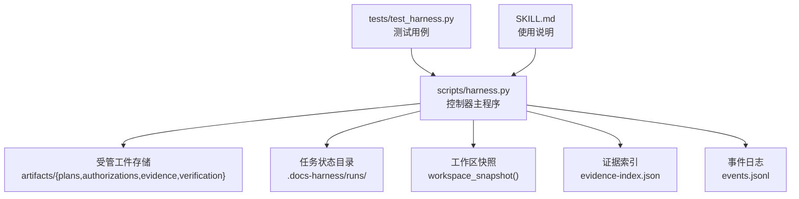
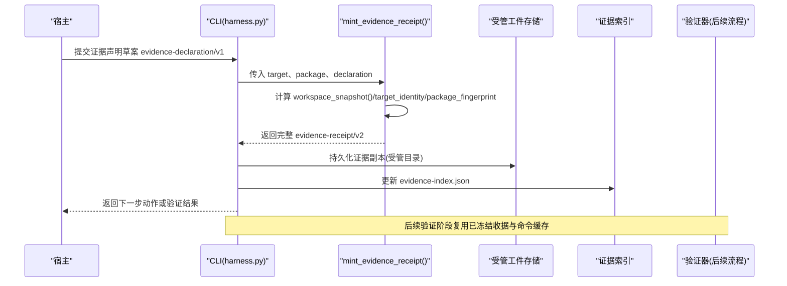
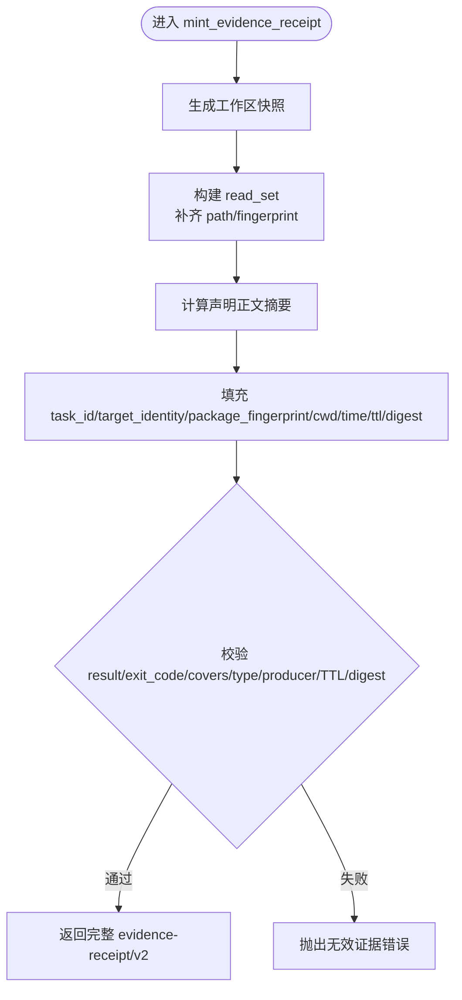
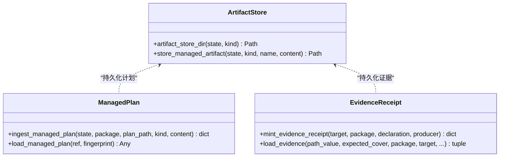
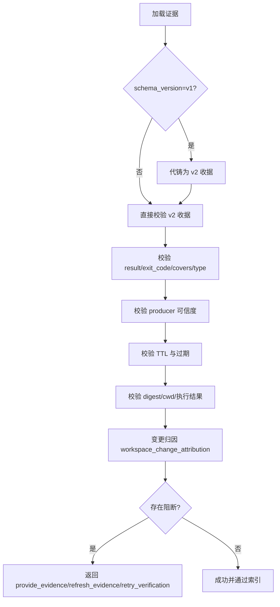
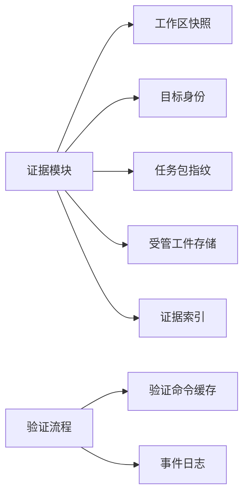

# 证据收集流程

<cite>
**本文引用的文件**   
- [harness.py](file://scripts/harness.py)
- [test_harness.py](file://tests/test_harness.py)
- [SKILL.md](file://SKILL.md)
- [package.json](file://package.json)
</cite>

## 目录
1. [简介](#简介)
2. [项目结构](#项目结构)
3. [核心组件](#核心组件)
4. [架构总览](#架构总览)
5. [详细组件分析](#详细组件分析)
6. [依赖关系分析](#依赖关系分析)
7. [性能考量](#性能考量)
8. [故障排查指南](#故障排查指南)
9. [结论](#结论)
10. [附录](#附录)

## 简介
本文件系统化阐述 Docs Harness 的证据收集流程，覆盖从宿主提交证据声明草案到控制器代铸完整收据、验证与索引的端到端过程。重点包括：
- 证据声明草案 evidence-declaration/v1 的简化格式与使用场景
- 控制器代铸证据收据 v2 的字段填充逻辑（task_id、target_identity、package_fingerprint 等）
- 证据文件的复制与受管 artifact store 管理机制
- 证据验证规则（过期检查、跨任务绑定、生产者可信度、读集漂移等）
- 最佳实践与常见错误处理

## 项目结构
- scripts/harness.py：独立任务控制器主实现，包含证据声明/收据、工件存储、工作区快照、验证命令缓存、事件记录等核心逻辑
- tests/test_harness.py：单元测试用例，覆盖证据收据 schema 与关键路径
- SKILL.md：面向使用者的技能说明，含 run/verify 命令与证据策略要点
- package.json：包元数据与脚本入口

图表来源 
- [harness.py:3855-3890](file://scripts/harness.py#L3855-L3890)
- [harness.py:5036-5228](file://scripts/harness.py#L5036-L5228)
- [harness.py:5343-5369](file://scripts/harness.py#L5343-L5369)

章节来源
- [harness.py:1-120](file://scripts/harness.py#L1-L120)
- [package.json:1-23](file://package.json#L1-L23)

## 核心组件
- 证据声明与收据
  - 支持证据声明草案 evidence-declaration/v1 简化输入，由控制器代铸为完整的 evidence-receipt/v2 收据
  - 严格校验 v2 收据字段、时间戳、TTL、摘要、cwd、执行结果等
- 受管工件存储
  - artifacts/plans、authorizations、evidence、verification 四类受管目录
  - 原子写入与指纹校验，保证不可变性与可追溯性
- 工作区快照与变更归因
  - workspace_snapshot() 生成稳定基线；snapshot_changes() 计算差异
  - workspace_change_attribution() 将变更归因到证据 write_set/read_set/concurrent_drift
- 证据索引与失效
  - evidence-index.json 去重索引；read_set 漂移时按路径失效相关证据
- 验证命令缓存与自动归因
  - verification.command_cache_enabled 控制逐项缓存
  - verification.auto_attribute_in_scope 控制写范围自动归因

章节来源
- [harness.py:3855-3890](file://scripts/harness.py#L3855-L3890)
- [harness.py:5036-5228](file://scripts/harness.py#L5036-L5228)
- [harness.py:5238-5340](file://scripts/harness.py#L5238-L5340)
- [harness.py:5343-5369](file://scripts/harness.py#L5343-L5369)
- [harness.py:1188-1213](file://scripts/harness.py#L1188-L1213)

## 架构总览
证据收集的整体调用链如下：

图表来源 
- [harness.py:5036-5228](file://scripts/harness.py#L5036-L5228)
- [harness.py:3855-3890](file://scripts/harness.py#L3855-L3890)
- [harness.py:5343-5369](file://scripts/harness.py#L5343-L5369)

## 详细组件分析

### 证据声明草案 evidence-declaration/v1 的简化格式与使用场景
- 适用场景
  - 宿主快速提交最小证据意图，无需构造完整 v2 收据
  - 在 verify 阶段由控制器统一代铸，确保一致性、可审计性
- 简化字段
  - type：证据类型（需白名单）
  - write_set：写入路径集合（可选，未提供则回退 changed_paths）
  - read_set：读取路径集合（字符串或对象 {path, fingerprint?}）
  - concurrent_drift：并发漂移路径集合
  - conclusion：结论文本
- 控制器代铸行为
  - 自动生成 task_id、target_identity、package_fingerprint、cwd、started_at/ended_at、ttl、exit_code、command_argv_digest、output_or_artifact_digest 等字段
  - 规范化 read_set 并补齐指纹（若缺失则为 None）
  - 设置 producer={"adapter":"docs-harness","capability":"host_declaration"}

章节来源
- [harness.py:5036-5073](file://scripts/harness.py#L5036-L5073)
- [harness.py:5076-5105](file://scripts/harness.py#L5076-L5105)

### 控制器代铸证据收据 v2 的字段填充逻辑
- 关键字段来源
  - task_id：来自当前任务包 package.task_id
  - target_identity：基于 Git 远端信息或本地路径计算的唯一标识
  - package_fingerprint：对任务包进行规范化哈希
  - cwd：目标工作区绝对路径
  - started_at/ended_at/ttl：当前 UTC 时间与有效期（秒）
  - command_argv_digest/output_or_artifact_digest：对声明正文的规范化哈希
  - read_set：遍历声明中的 read_set，补齐 path 与指纹
- 校验与约束
  - result 必须为 passed（或 exit_code=0）
  - covers 必须包含当前任务 ID（兼容旧版 task_id 回填）
  - type 必须在已知证据类型白名单中
  - attribution_quality/trust_level：v2 可信生产者标记为 verified
  - TTL 合法且未过期；digest 符合 sha256 格式；cwd 与执行结果匹配

图表来源 
- [harness.py:5036-5228](file://scripts/harness.py#L5036-L5228)

章节来源
- [harness.py:5036-5228](file://scripts/harness.py#L5036-L5228)

### 证据文件的复制与受管 artifact store 管理
- 受管目录
  - artifacts/plans、authorizations、evidence、verification
- 复制与持久化
  - 原子写入文本内容，生成不可变副本
  - 记录 artifact_ref 与 artifact_fingerprint，便于后续校验与复用
- 计划与证据的统一管理
  - 计划与证据均通过 ingest_managed_plan/store_managed_artifact 纳入受管体系
  - 支持引用校验与指纹比对，防止篡改或丢失

图表来源 
- [harness.py:3855-3890](file://scripts/harness.py#L3855-L3890)
- [harness.py:5036-5228](file://scripts/harness.py#L5036-L5228)

章节来源
- [harness.py:3855-3890](file://scripts/harness.py#L3855-L3890)
- [harness.py:5036-5228](file://scripts/harness.py#L5036-L5228)

### 证据验证规则与变更归因
- 过期检查
  - 校验 ended_at + ttl 是否超过当前时间，过期即拒绝
- 跨任务绑定
  - task_id、package_fingerprint、target_identity 必须与当前任务包一致
- 生产者可信度
  - producer.adapter/capability 必须在可信列表 TRUSTED_EVIDENCE_PRODUCERS
- 读集漂移与并发冲突
  - read_set 中指纹变化触发“刷新证据”分支
  - concurrent_drift 与 write/read scope 重叠会阻断
  - 未归因变更与高风险漂移触发阻断或警告
- 自动归因
  - write_scope 内未归因写入默认由控制器自动归因，可通过配置关闭

图表来源 
- [harness.py:5076-5228](file://scripts/harness.py#L5076-L5228)
- [harness.py:5238-5340](file://scripts/harness.py#L5238-L5340)

章节来源
- [harness.py:5076-5228](file://scripts/harness.py#L5076-L5228)
- [harness.py:5238-5340](file://scripts/harness.py#L5238-L5340)

### 证据索引与失效机制
- 索引结构
  - evidence-index.json 维护证据条目数组，按 source_fingerprint 去重
- 失效策略
  - 当 read_set 发生漂移时，仅失效引用了漂移路径的证据，返回被失效的 id 列表
  - 支持增量刷新，避免全量重新验证

章节来源
- [harness.py:5343-5369](file://scripts/harness.py#L5343-L5369)

### 验证命令缓存与自动归因配置
- 验证命令缓存
  - 默认开启，可通过 project config verification.command_cache_enabled 整体关闭
  - 逐项缓存 receipts，失败或输入变化才重跑
- 自动归因
  - 默认开启，write_scope 内未归因写入自动归因
  - 可通过 verification.auto_attribute_in_scope 关闭以恢复补证据流程

章节来源
- [harness.py:1188-1213](file://scripts/harness.py#L1188-L1213)
- [harness.py:5914](file://scripts/harness.py#L5914)

## 依赖关系分析
- 模块耦合
  - 证据代铸依赖工作区快照、目标身份与任务包指纹
  - 验证阶段依赖事件日志、证据索引与验证命令缓存
- 外部依赖
  - Git 操作用于目标身份与快照
  - 文件系统原子写入与 JSON 序列化
- 潜在循环依赖
  - 无直接循环；证据与计划均通过受管工件解耦

图表来源 
- [harness.py:5036-5228](file://scripts/harness.py#L5036-L5228)
- [harness.py:5343-5369](file://scripts/harness.py#L5343-L5369)

章节来源
- [harness.py:5036-5228](file://scripts/harness.py#L5036-L5228)
- [harness.py:5343-5369](file://scripts/harness.py#L5343-L5369)

## 性能考量
- 工作区快照限制
  - 非 Git 工作区快照文件数上限，超限拒绝截断基线
- 大文件指纹优化
  - 大于阈值的大文件采用 size:mtime 指纹，降低 IO 压力
- 验证命令缓存
  - 逐项缓存减少重复执行，提升吞吐
- 原子写入与 fsync
  - 保证持久化安全，但可能带来一定延迟

[本节为通用指导，不直接分析具体文件]

## 故障排查指南
- 常见错误码与含义
  - invalid_evidence/evidence_not_passed：证据未通过或未声明 passed
  - invalid_evidence_type：type 不在白名单
  - untrusted_evidence_producer：生产者不可信
  - evidence_expired：证据已过期
  - evidence_binding_mismatch：任务/目标/包指纹不匹配
  - invalid_evidence_receipt：字段缺失或格式错误
  - state_locked/stale_lock：状态锁冲突或过期
- 定位步骤
  - 查看 events.jsonl 获取阶段与原因码
  - 检查 evidence-index.json 确认证据是否被索引或失效
  - 核对 .docs-harness/config.json 的 verification.* 配置项
  - 检查工作区快照与 read_set 指纹是否漂移

章节来源
- [harness.py:5076-5228](file://scripts/harness.py#L5076-L5228)
- [harness.py:1008-1029](file://scripts/harness.py#L1008-L1029)
- [harness.py:5343-5369](file://scripts/harness.py#L5343-L5369)

## 结论
Docs Harness 的证据收集流程以“声明草案 + 控制器代铸”为核心，结合严格的 v2 收据校验、受管工件存储、工作区快照与变更归因、以及验证命令缓存与证据索引，形成高可靠、可审计、可复用的证据闭环。遵循本文的最佳实践与排错建议，可显著提升证据质量与系统稳定性。

## 附录
- 使用要点
  - 宿主优先提交 evidence-declaration/v1 简化草案，由控制器代铸 v2 收据
  - 合理声明 write_set/read_set/concurrent_drift，提高归因准确性
  - 利用验证命令缓存与自动归因配置，平衡效率与可控性
- 参考命令
  - run/verify/background 等命令见 SKILL.md

章节来源
- [SKILL.md:25-57](file://SKILL.md#L25-L57)
- [test_harness.py:281](file://tests/test_harness.py#L281)