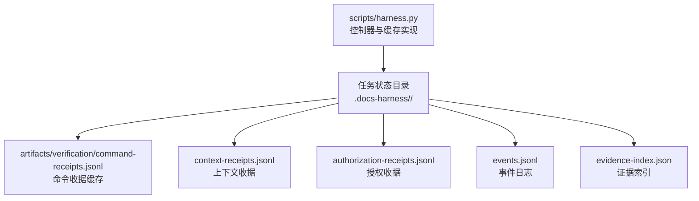
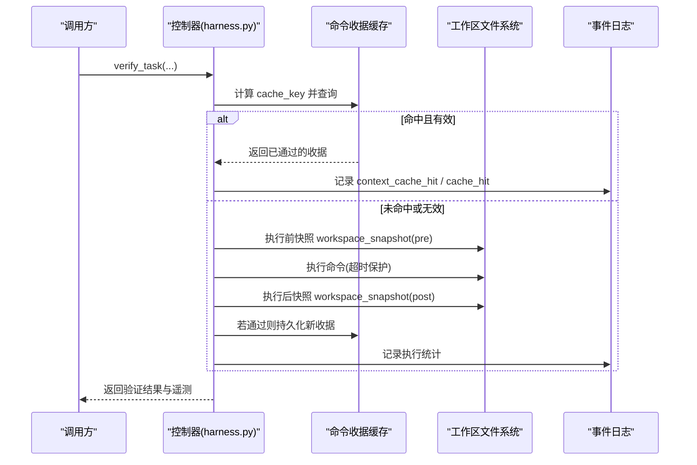
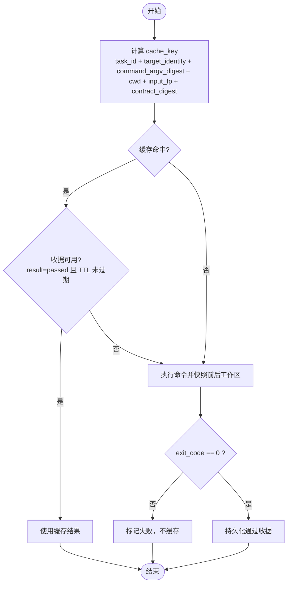
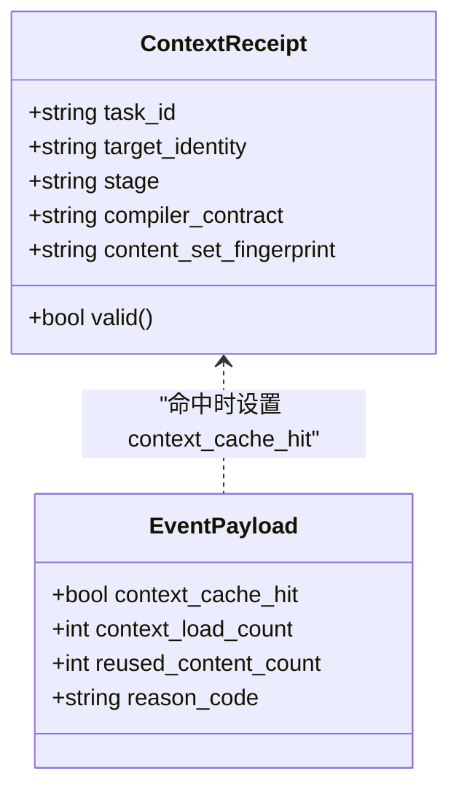
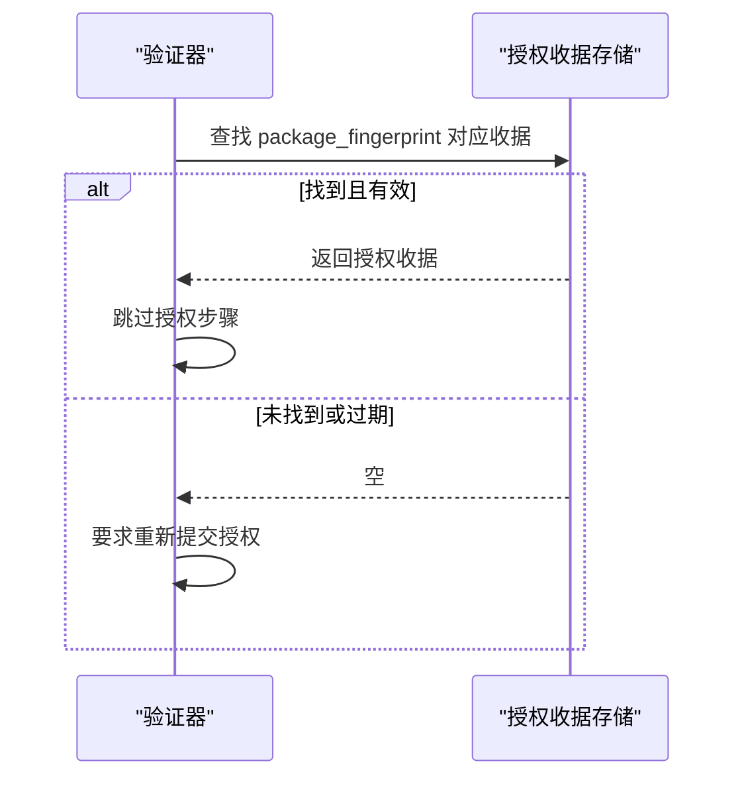
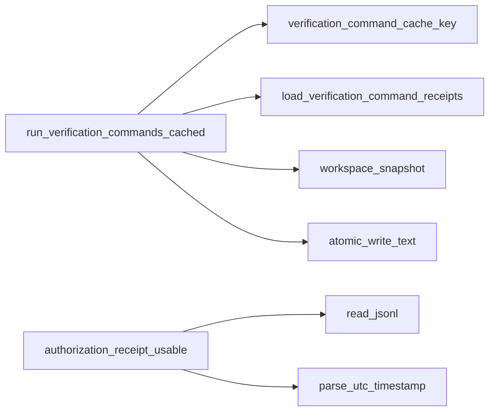

# 证据缓存机制

<cite>
**本文引用的文件**   
- [harness.py](file://scripts/harness.py)
- [test_harness.py](file://tests/test_harness.py)
</cite>

## 目录
1. [简介](#简介)
2. [项目结构](#项目结构)
3. [核心组件](#核心组件)
4. [架构总览](#架构总览)
5. [详细组件分析](#详细组件分析)
6. [依赖关系分析](#依赖关系分析)
7. [性能考量](#性能考量)
8. [故障排查指南](#故障排查指南)
9. [结论](#结论)
10. [附录](#附录)

## 简介
本文件系统化阐述 Docs Harness 的证据缓存机制，重点覆盖：
- 命令缓存的工作原理与命中条件（command_argv_digest、输入指纹、合约指纹等）
- 上下文缓存 context_cache_hit 的匹配规则（task_id、target_identity、stage、compiler_contract、content_set_fingerprint）
- 授权缓存 authorization-receipt/v2 的绑定与复用策略
- 缓存失效条件与处理逻辑（输入变化、失败重试、volatile 副产物改变等）
- 配置项 verification.command_cache_enabled 的使用方法与性能影响
- 监控与调试方法（事件指标、遥测字段、诊断路径）

## 项目结构
- 控制器主脚本位于 scripts/harness.py，包含所有缓存相关实现与流程控制。
- 测试用例位于 tests/test_harness.py，用于验证上下文缓存命中行为与关键约束。

**图表来源** 
- [harness.py:5936-5944](file://scripts/harness.py#L5936-L5944)
- [harness.py:6074-6083](file://scripts/harness.py#L6074-L6083)
- [harness.py:6165-6179](file://scripts/harness.py#L6165-L6179)

**章节来源**
- [harness.py:5936-5944](file://scripts/harness.py#L5936-L5944)
- [harness.py:6074-6083](file://scripts/harness.py#L6074-L6083)
- [harness.py:6165-6179](file://scripts/harness.py#L6165-L6179)

## 核心组件
- 命令缓存键生成与校验
  - verification_command_cache_key：基于 task_id、target_identity、command_argv_digest、cwd、verification_input_fingerprint、contract_digest 生成唯一键。
  - command_argv_digest：对命令参数规范化后的 JSON 进行哈希，确保相同命令语义产生相同摘要。
- 命令执行与缓存读写
  - run_verification_commands_cached：逐条执行验证命令；命中可复用收据则跳过执行；未命中则执行并持久化通过结果。
  - persist_verification_command_cache：原子写入新的通过收据到 command-receipts.jsonl。
- 上下文缓存
  - context_cache_hit：在加载阶段根据是否命中已有上下文收据设置，记录于事件与返回载荷中。
- 授权缓存
  - authorization_receipt_usable/find_authorization_receipt：按 package_fingerprint 查找可用授权收据，支持过期检查。
- 配置开关
  - verification_command_cache_enabled：读取 project config 中的 verification.command_cache_enabled，默认开启。

**章节来源**
- [harness.py:5913-5933](file://scripts/harness.py#L5913-L5933)
- [harness.py:5962-6071](file://scripts/harness.py#L5962-L6071)
- [harness.py:6074-6083](file://scripts/harness.py#L6074-L6083)
- [harness.py:4370-4390](file://scripts/harness.py#L4370-L4390)
- [harness.py:6144-6179](file://scripts/harness.py#L6144-L6179)
- [harness.py:1191-1202](file://scripts/harness.py#L1191-L1202)

## 架构总览
下图展示命令缓存与上下文/授权缓存的整体交互流程。

**图表来源** 
- [harness.py:5962-6071](file://scripts/harness.py#L5962-L6071)
- [harness.py:6074-6083](file://scripts/harness.py#L6074-L6083)
- [harness.py:6450-6465](file://scripts/harness.py#L6450-L6465)

## 详细组件分析

### 命令缓存：command_argv_digest 与命中条件
- 键组成
  - task_id：任务标识，保证跨任务隔离。
  - target_identity：目标仓库/工作区的稳定身份（Git 远端指纹或本地路径哈希）。
  - command_argv_digest：命令参数的规范化 JSON 哈希，避免空格/顺序差异导致误判。
  - cwd：当前工作目录，确保相对路径一致性。
  - verification_input_fingerprint：验证输入指纹（由 volatile 模式与输入内容决定），用于区分不同输入环境。
  - contract_digest：原始验证规范的哈希，确保规范变更触发重新执行。
- 命中判定
  - 存在同 key 的收据且 result=passed，且 TTL 未过期。
  - 若任一维度变化（如 input_fingerprint、contract_digest、target_identity），将视为未命中。
- 失败与重试
  - 仅当 result=passed 时才会写入缓存；失败不会缓存，允许下次重试。
  - 超时或异常会记录 output_or_artifact_digest 为“timeout”标记，不缓存。

**图表来源** 
- [harness.py:5913-5933](file://scripts/harness.py#L5913-L5933)
- [harness.py:5962-6071](file://scripts/harness.py#L5962-L6071)
- [harness.py:5947-5959](file://scripts/harness.py#L5947-L5959)

**章节来源**
- [harness.py:5913-5933](file://scripts/harness.py#L5913-L5933)
- [harness.py:5962-6071](file://scripts/harness.py#L5962-L6071)
- [harness.py:5947-5959](file://scripts/harness.py#L5947-L5959)

### 上下文缓存：context_cache_hit 的实现与匹配规则
- 匹配维度
  - task_id：同一任务。
  - target_identity：同一目标仓库/工作区身份。
  - stage：上下文阶段（plan/action/work_package/acceptance）。
  - compiler_contract：编译后的任务契约指纹。
  - content_set_fingerprint：内容集合指纹（由知识内容与规则集决定）。
- 命中标志
  - 若找到匹配的上下文收据，则 context_cache_hit=true，事件 reason_code=context_cache_hit。
  - 否则根据是否增量加载设置 context_delta_loaded 或 context_content_loaded。
- 事件与统计
  - events.jsonl 记录 context_cache_hit、context_load_count、reused_content_count 等指标。

**图表来源** 
- [harness.py:4370-4390](file://scripts/harness.py#L4370-L4390)
- [harness.py:1040-1073](file://scripts/harness.py#L1040-L1073)

**章节来源**
- [harness.py:4370-4390](file://scripts/harness.py#L4370-L4390)
- [harness.py:1040-1073](file://scripts/harness.py#L1040-L1073)
- [test_harness.py:962-963](file://tests/test_harness.py#L962-L963)

### 授权缓存：authorization-receipt/v2 的绑定与复用
- 绑定规则
  - 以 package_fingerprint 作为绑定键，确保授权与特定任务包版本绑定。
  - 支持 authorized_actions、authorized_scope、authorized_git_scope、authorized_external_scope 等范围校验。
- 可用性判断
  - authorization_receipt_usable：检查 approved、expires_at 等字段，过期即不可用。
  - find_authorization_receipt：从 authorization-receipts.jsonl 反向查找最近的有效收据。
- 复用策略
  - 若存在有效授权收据且与当前 package_fingerprint 一致，则无需重新提交授权。
  - 若授权缺失、过期或指纹变化，将触发重新准入（needs_readmission）。

**图表来源** 
- [harness.py:6144-6179](file://scripts/harness.py#L6144-L6179)
- [harness.py:4446-4495](file://scripts/harness.py#L4446-L4495)

**章节来源**
- [harness.py:6144-6179](file://scripts/harness.py#L6144-L6179)
- [harness.py:4446-4495](file://scripts/harness.py#L4446-L4495)

### 缓存失效条件与处理逻辑
- 输入变化
  - verification_input_fingerprint 变化（如 volatile 模式或输入内容变化）将导致命令缓存未命中。
- 失败重试
  - 仅 result=passed 的收据会被缓存；失败不会缓存，允许后续重试。
- volatile 副产物改变
  - 工作区快照会区分 volatile_write_set 与 blocking_write_set；仅 volatile 写入不影响缓存有效性，但 blocking 写入会导致验证失败。
- 授权/方案漂移
  - package_fingerprint 或 plan_contract 变化将触发重新准入，间接使旧缓存失效。

**章节来源**
- [harness.py:5962-6071](file://scripts/harness.py#L5962-L6071)
- [harness.py:6484-6489](file://scripts/harness.py#L6484-L6489)

### 配置选项：verification.command_cache_enabled
- 默认行为
  - 默认开启命令缓存，提升重复验证效率。
- 关闭方式
  - 在项目配置 .docs-harness/config.json 的 verification.command_cache_enabled=false 可整体关闭。
- 性能影响
  - 开启时显著减少重复命令执行时间；关闭时每次均真实执行，适合调试或强制刷新场景。

**章节来源**
- [harness.py:1191-1202](file://scripts/harness.py#L1191-L1202)

### 监控与调试
- 事件指标
  - events.jsonl 记录 context_cache_hit、context_load_count、command_executed_count、command_cache_hit_count、command_cache_enabled 等。
- 遥测字段
  - record_verification_attempt 汇总验证尝试的关键指标，便于外部监控。
- 调试建议
  - 临时关闭缓存（verification.command_cache_enabled=false）定位问题。
  - 查看 artifacts/verification/command-receipts.jsonl 确认缓存条目。
  - 检查 events.jsonl 中 reason_code 与 duration_ms 分析瓶颈。

**章节来源**
- [harness.py:6410-6446](file://scripts/harness.py#L6410-L6446)
- [harness.py:6450-6465](file://scripts/harness.py#L6450-L6465)

## 依赖关系分析
- 模块内依赖
  - run_verification_commands_cached 依赖 verification_command_cache_key、load_verification_command_receipts、workspace_snapshot、atomic_write_text 等工具函数。
  - authorization_receipt_usable/find_authorization_receipt 依赖 read_jsonl、parse_utc_timestamp 等基础能力。
- 外部依赖
  - Git 操作（git_command、git_root、target_identity）影响 target_identity 稳定性。
  - 文件系统原子写入（atomic_write_text）保障缓存一致性。

**图表来源** 
- [harness.py:5962-6071](file://scripts/harness.py#L5962-L6071)
- [harness.py:6144-6179](file://scripts/harness.py#L6144-L6179)

**章节来源**
- [harness.py:5962-6071](file://scripts/harness.py#L5962-L6071)
- [harness.py:6144-6179](file://scripts/harness.py#L6144-L6179)

## 性能考量
- 缓存命中率
  - 高命中率可显著降低重复验证耗时，尤其在 CI/CD 流水线中。
- 快照开销
  - workspace_snapshot 对大文件或大量文件有开销，需结合 git ls-files 优化。
- 并发与锁
  - 原子写入避免并发竞争，但需注意磁盘 IO 瓶颈。
- 配置调优
  - 在调试阶段可关闭缓存；生产环境建议保持开启以提升吞吐。

[本节为通用指导，不直接分析具体文件]

## 故障排查指南
- 常见问题
  - 缓存未命中：检查 input_fingerprint、contract_digest、target_identity 是否变化。
  - 授权过期：确认 expires_at 字段与系统时间。
  - 验证失败：查看 unexpected_write_set 与 volatile_write_set 区分问题类型。
- 诊断步骤
  - 查看 events.jsonl 的 reason_code 与 duration_ms。
  - 检查 artifacts/verification/command-receipts.jsonl 的缓存条目。
  - 临时关闭缓存验证是否为缓存相关问题。

**章节来源**
- [harness.py:5962-6071](file://scripts/harness.py#L5962-L6071)
- [harness.py:6144-6179](file://scripts/harness.py#L6144-L6179)
- [harness.py:6410-6446](file://scripts/harness.py#L6410-L6446)

## 结论
Docs Harness 的证据缓存机制通过精细化的键设计与严格的可用性检查，实现了命令级与上下文级的缓存复用，同时结合授权绑定与配置开关，兼顾了安全性与性能。通过事件与遥测指标，用户可高效监控与调试缓存行为，确保验证流程的稳定与高效。

[本节为总结性内容，不直接分析具体文件]

## 附录
- 关键常量与模式
  - VOLATILE_VERIFICATION_DIR_PARTS、VOLATILE_VERIFICATION_SUFFIXES、VOLATILE_VERIFICATION_FILENAMES 定义 volatile 路径过滤规则。
  - DELIVERY_LAYER_ORDER、TASK_INTENTS 等枚举辅助任务路由与意图识别。

**章节来源**
- [harness.py:1145-1151](file://scripts/harness.py#L1145-L1151)
- [harness.py:146-178](file://scripts/harness.py#L146-L178)
- [harness.py:200-233](file://scripts/harness.py#L200-L233)