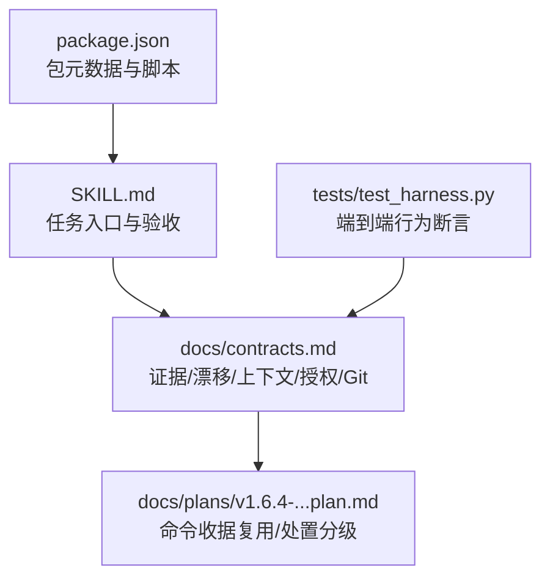
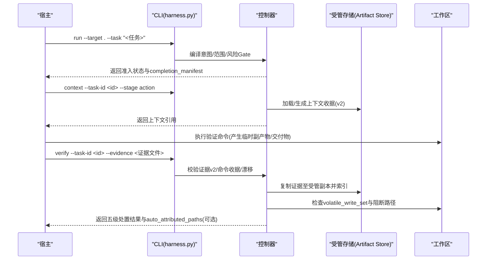
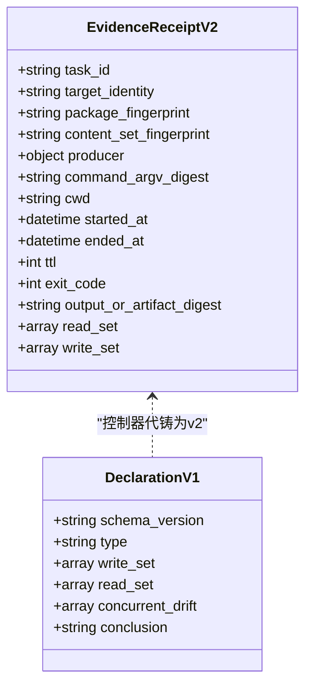
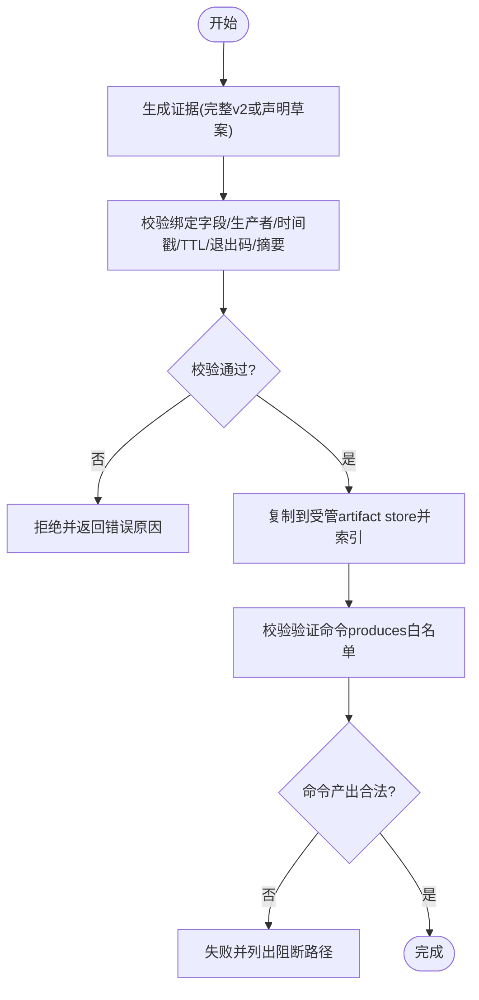
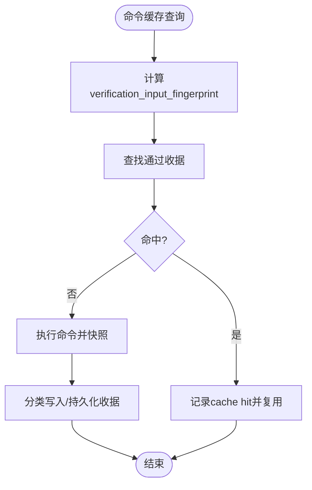
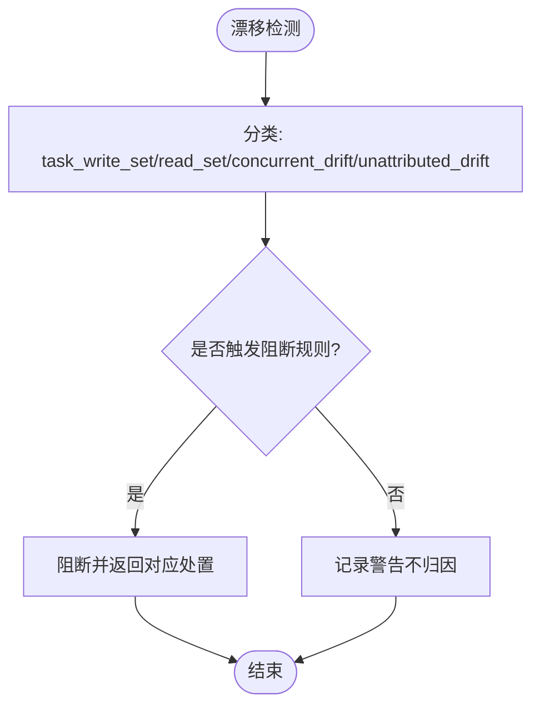
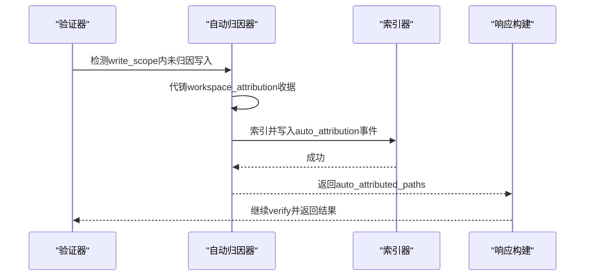
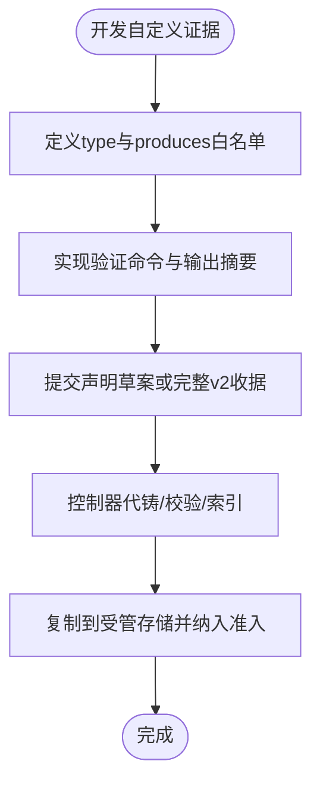
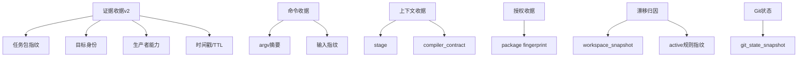

# 证据链管理

<cite>
**本文引用的文件**   
- [SKILL.md](file://SKILL.md)
- [package.json](file://package.json)
- [contracts.md](file://docs/contracts.md)
- [v1.6.4-minimal-systemic-flow-efficiency-plan.md](file://docs/plans/v1.6.4-minimal-systemic-flow-efficiency-plan.md)
- [test_harness.py](file://tests/test_harness.py)
</cite>

## 目录
1. [简介](#简介)
2. [项目结构](#项目结构)
3. [核心组件](#核心组件)
4. [架构总览](#架构总览)
5. [详细组件分析](#详细组件分析)
6. [依赖关系分析](#依赖关系分析)
7. [性能考量](#性能考量)
8. [故障排查指南](#故障排查指南)
9. [结论](#结论)
10. [附录](#附录)

## 简介
本文件面向 Docs Harness 的证据链管理系统，系统性阐述证据收据 v2 格式、验证与持久化流程、命令/上下文/授权缓存机制、工作区漂移归因与自动归因、以及证据适配器开发与自定义证据类型的实现要点。文档以仓库合同与计划为依据，辅以测试用例中的行为断言，确保读者既能把握整体设计，也能落地到具体实现细节。

## 项目结构
- 顶层说明与入口：SKILL.md 描述任务入口、验收命令、证据与规则约束；package.json 定义包元数据与脚本。
- 合同与计划：docs/contracts.md 定义 v2 证据收据、漂移归因、上下文与授权收据、Git 状态等；docs/plans 包含演进计划与效率优化方案。
- 测试：tests/test_harness.py 覆盖 run/verify 流程、Git 操作、证据构造与校验等行为。

**图表来源** 
- [SKILL.md:1-105](file://SKILL.md#L1-L105)
- [contracts.md:1-370](file://docs/contracts.md#L1-L370)
- [v1.6.4-minimal-systemic-flow-efficiency-plan.md:131-350](file://docs/plans/v1.6.4-minimal-systemic-flow-efficiency-plan.md#L131-L350)
- [test_harness.py:1-800](file://tests/test_harness.py#L1-L800)

**章节来源**
- [SKILL.md:1-105](file://SKILL.md#L1-L105)
- [package.json:1-23](file://package.json#L1-L23)

## 核心组件
- 证据收据 v2（evidence-receipt/v2）：绑定 task_id、target_identity、package_fingerprint、producer、时间戳、退出码、输出摘要、read_set/write_set 等，支持过期、跨任务/目标、不可信生产者拒绝。
- 验证命令收据（verification-command-receipt/v1）：按 argv、produces、输入指纹绑定，支持逐项复用与重跑。
- 上下文收据（context-receipt/v2）：基于 task_id、target_identity、stage、compiler_contract、content_set_fingerprint 复用。
- 授权收据（authorization-receipt/v2）：始终绑定当前 package fingerprint，不跨修订复用。
- 工作区漂移归因：task_write_set、read_set、concurrent_drift、unattributed_drift 分类与阻断规则。
- 自动归因：workspace_attribution 收据在 write_scope 内未归因写入时自动生成。

**章节来源**
- [contracts.md:134-218](file://docs/contracts.md#L134-L218)
- [contracts.md:222-234](file://docs/contracts.md#L222-L234)
- [v1.6.4-minimal-systemic-flow-efficiency-plan.md:261-314](file://docs/plans/v1.6.4-minimal-systemic-flow-efficiency-plan.md#L261-L314)

## 架构总览
证据链管理的控制流围绕“run → context → verify”展开，控制器负责意图编译、Gate 判定、范围与授权、证据索引与持久化、命令缓存与漂移归因。

**图表来源** 
- [SKILL.md:25-57](file://SKILL.md#L25-L57)
- [contracts.md:165-220](file://docs/contracts.md#L165-L220)
- [v1.6.4-minimal-systemic-flow-efficiency-plan.md:261-314](file://docs/plans/v1.6.4-minimal-systemic-flow-efficiency-plan.md#L261-L314)

## 详细组件分析

### 证据收据 v2 结构与验证机制
- 必填绑定字段
  - task_id、target_identity、package_fingerprint、content_set_fingerprint、producer、command_argv_digest、cwd、started_at、ended_at、ttl、exit_code、output_or_artifact_digest、read_set、write_set。
- 验证规则
  - 过期、跨任务/目标/包指纹、不可信生产者、非零退出或摘要无效均拒绝；高风险证据必须来自可信 v2 生产者。
- 声明草案简化
  - 使用 evidence-declaration/v1 仅提交 type、write_set、read_set、concurrent_drift、conclusion，其余装订字段由控制器代铸，信任等级等同自铸收据。

**图表来源** 
- [contracts.md:165-218](file://docs/contracts.md#L165-L218)

**章节来源**
- [contracts.md:165-218](file://docs/contracts.md#L165-L218)

### 证据收集流程：生成、验证与持久化
- 生成
  - 宿主可提交完整 v2 收据或声明草案；控制器对声明进行代铸与校验。
- 验证
  - 校验绑定字段、生产者可信度、时间戳与 TTL、退出码、输出摘要有效性；命令 produces 白名单限制语义证据类型。
- 持久化
  - 首次通过即复制到受管 artifact store，后续准入依赖受管副本；原始文件删除不影响已采纳证据；收据保留 artifact_ref。

**图表来源** 
- [contracts.md:165-201](file://docs/contracts.md#L165-L201)
- [v1.6.4-minimal-systemic-flow-efficiency-plan.md:254-273](file://docs/plans/v1.6.4-minimal-systemic-flow-efficiency-plan.md#L254-L273)

**章节来源**
- [contracts.md:165-201](file://docs/contracts.md#L165-L201)
- [v1.6.4-minimal-systemic-flow-efficiency-plan.md:254-273](file://docs/plans/v1.6.4-minimal-systemic-flow-efficiency-plan.md#L254-L273)

### 证据缓存与复用机制
- 命令缓存（verification-command-receipt/v1）
  - 键包含 task_id、target_identity、argv digest、cwd、verification_input_fingerprint、declared produces、相关合同指纹、producer capability、ttl。
  - 命中则 cache_hit=true 且跳过执行；输入变化或上次失败则重跑；可通过配置关闭整体复用。
- 上下文缓存（context-receipt/v2）
  - 复用条件：同一 task_id、target_identity、stage、compiler_contract、content_set_fingerprint；命中则不重复返回正文。
- 授权缓存（authorization-receipt/v2）
  - 始终绑定当前 package fingerprint，不跨修订复用。

**图表来源** 
- [contracts.md:220-234](file://docs/contracts.md#L220-L234)
- [v1.6.4-minimal-systemic-flow-efficiency-plan.md:261-314](file://docs/plans/v1.6.4-minimal-systemic-flow-efficiency-plan.md#L261-L314)

**章节来源**
- [contracts.md:220-234](file://docs/contracts.md#L220-L234)
- [v1.6.4-minimal-systemic-flow-efficiency-plan.md:261-314](file://docs/plans/v1.6.4-minimal-systemic-flow-efficiency-plan.md#L261-L314)

### 工作区漂移归因机制
- 分类
  - task_write_set：有可信或报告型任务写入收据支持的变化。
  - read_set：用于结论的路径/受控资源及读取指纹。
  - concurrent_drift：可信生产者证明来自并发进程的变化。
  - unattributed_drift：来源不能证明的变化。
- 阻断规则
  - 超出 write_scope、读取事实漂移、concurrent/unattributed 与读写范围重叠、命中安全/数据/发布或不可逆边界、新增风险 Gate 或规则指纹变化。
- 五级处置
  - provide_evidence、refresh_evidence、retry_verification、incremental_admission、full_readmission。

**图表来源** 
- [contracts.md:134-163](file://docs/contracts.md#L134-L163)

**章节来源**
- [contracts.md:134-163](file://docs/contracts.md#L134-L163)

### 自动归因与 workspace_attribution 收据
- 触发条件：合同稳定且唯一阻断为 write_scope 内未归因写入。
- 处理逻辑：控制器代铸 workspace_attribution 收据（producer 为 auto_attribution），索引后写入 auto_attribution 事件，继续本次 verify，响应包含 auto_attributed_paths。
- 开关：verification.auto_attribute_in_scope=false 恢复 provide_evidence 补证据流程。

**图表来源** 
- [contracts.md:216-218](file://docs/contracts.md#L216-L218)
- [SKILL.md:53-57](file://SKILL.md#L53-L57)

**章节来源**
- [contracts.md:216-218](file://docs/contracts.md#L216-L218)
- [SKILL.md:53-57](file://SKILL.md#L53-L57)

### 证据适配器开发与自定义证据类型指南
- 适配器标识
  - producer.adapter 与 producer.capability 用于标识证据来源与能力；高风险证据需来自可信 v2 生产者。
- 自定义证据类型
  - 使用 evidence-declaration/v1 声明 type，控制器代铸其余字段并按 v2 校验；type 必须在白名单中，否则失败关闭。
- 开发步骤
  - 明确证据类型与语义；在验证命令中声明 produces 白名单；确保输出摘要与工作区无额外交付写入；提交声明草案或完整 v2 收据；控制器将复制证据至受管存储并索引。

**图表来源** 
- [contracts.md:203-218](file://docs/contracts.md#L203-L218)
- [v1.6.4-minimal-systemic-flow-efficiency-plan.md:261-314](file://docs/plans/v1.6.4-minimal-systemic-flow-efficiency-plan.md#L261-L314)

**章节来源**
- [contracts.md:203-218](file://docs/contracts.md#L203-L218)
- [v1.6.4-minimal-systemic-flow-efficiency-plan.md:261-314](file://docs/plans/v1.6.4-minimal-systemic-flow-efficiency-plan.md#L261-L314)

## 依赖关系分析
- 证据收据 v2 依赖任务包指纹、目标身份、生产者能力与时间戳；命令收据依赖 argv 与输入指纹；上下文与授权收据分别依赖 stage/compiler contract 与 package fingerprint。
- 漂移归因依赖 freeze.json.workspace_snapshot 基线与 active 规则指纹；Git 状态依赖 git_state_snapshot 与 controlled_refs_namespace。

**图表来源** 
- [contracts.md:134-234](file://docs/contracts.md#L134-L234)

**章节来源**
- [contracts.md:134-234](file://docs/contracts.md#L134-L234)

## 性能考量
- 命令收据复用显著减少重复执行，仅在输入变化或失败时重跑；可通过配置关闭整体复用。
- 上下文与授权收据的精准复用避免重复加载与重新授权，降低冷启动开销。
- 受管存储只依赖副本，允许调用方清理临时文件，提升磁盘利用率。

[本节为通用指导，无需特定文件来源]

## 故障排查指南
- 常见阻断
  - 证据过期/跨任务/目标/包指纹、不可信生产者、非零退出、输出摘要无效。
  - 验证命令 produces 不在白名单、工作区出现额外交付写入。
  - 漂移与读写范围重叠、命中安全/数据/发布边界。
- 处置建议
  - provide_evidence：补充证据或启用自动归因开关。
  - refresh_evidence：重读漂移路径并更新指纹。
  - retry_verification：重试失败的验证命令。
  - incremental_admission：仅追加普通 Gate 时增量准入。
  - full_readmission：范围/高风险合同/规则变化时完整重新准入。

**章节来源**
- [contracts.md:134-163](file://docs/contracts.md#L134-L163)
- [contracts.md:165-218](file://docs/contracts.md#L165-L218)

## 结论
Docs Harness 的证据链管理以 v2 收据为核心，结合命令/上下文/授权缓存与工作区漂移归因，构建了高可靠、可复用的证据体系。自动归因与声明草案简化了宿主负担，Git 状态与受管存储保障了安全性与一致性。遵循本文档的结构与流程，可实现稳定的证据生产、验证与持久化。

[本节为总结性内容，无需特定文件来源]

## 附录
- 关键命令参考
  - run：任务入口与准入。
  - context：阶段上下文加载。
  - verify：证据验收与五级处置。
- 配置项
  - verification.volatile_paths：容忍临时副产物的 glob 白名单。
  - verification.command_cache_enabled：关闭命令收据复用。
  - verification.auto_attribute_in_scope：切换自动归因行为。

**章节来源**
- [SKILL.md:25-57](file://SKILL.md#L25-L57)
- [contracts.md:199-220](file://docs/contracts.md#L199-L220)