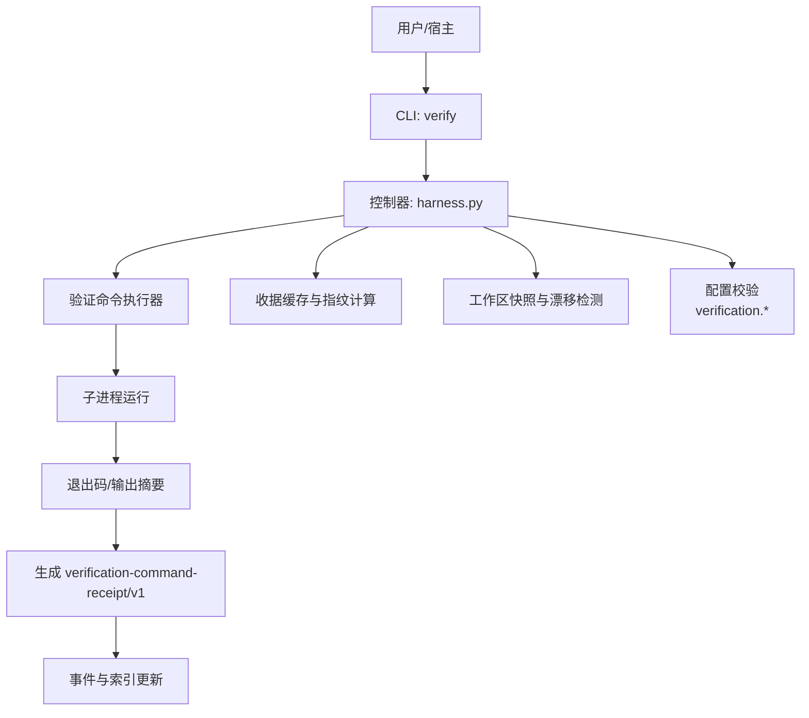
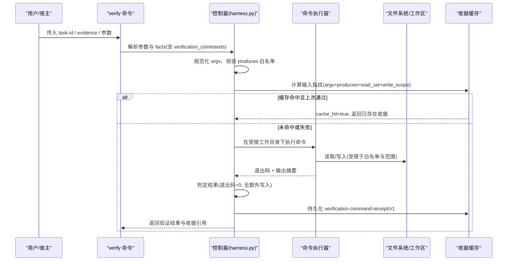
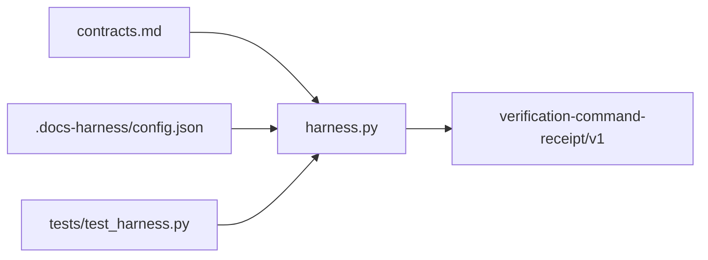

# 验证命令系统

<cite>
**本文引用的文件**
- [harness.py](file://scripts/harness.py)
- [contracts.md](file://docs/contracts.md)
- [test_harness.py](file://tests/test_harness.py)
</cite>

## 更新摘要
**所做更改**
- 增强了 stale_evidence 错误处理，添加了 scope_diff 详细信息和 stale_write_paths、actual_changed_paths 列表
- 改进了 readmission_hint 对象，包含可执行示例用于范围相关失败
- 更新了验证命令系统的错误处理和调试指南

## 目录
1. [简介](#简介)
2. [项目结构](#项目结构)
3. [核心组件](#核心组件)
4. [架构总览](#架构总览)
5. [详细组件分析](#详细组件分析)
6. [依赖关系分析](#依赖关系分析)
7. [性能考量](#性能考量)
8. [故障排查指南](#故障排查指南)
9. [结论](#结论)
10. [附录](#附录)

## 简介
本文件系统性阐述 Docs Harness 的"验证命令系统"，聚焦以下要点：
- verification-command-receipt/v1 的结构与使用方式，包括 argv 定义、produces 字段与输入指纹绑定。
- 验证命令的执行环境与安全约束（工作目录限制、环境变量隔离、命令白名单等）。
- 验证结果的判定标准（退出码 0、输出摘要校验、工作区无额外交入写入等）。
- 临时副产物的容忍机制（内置白名单与 verification.volatile_paths 自定义配置）。
- 验证命令的缓存策略与增量执行逻辑。
- 验证命令开发的最佳实践与调试技巧。

## 项目结构
与验证命令系统直接相关的实现集中在控制器脚本与合同文档中：
- scripts/harness.py：控制器主程序，包含验证命令规范化、执行、收据生成、缓存与配置校验等核心逻辑。
- docs/contracts.md：对外契约说明，明确 verification-command-receipt/v1 的使用规则、缓存策略与 volatile 路径配置。
- tests/test_harness.py：覆盖验收流程、Git 后检、证据与收据相关行为，可作为理解系统行为的参考用例。

**图表来源**
- [harness.py:5856-5899](file://scripts/harness.py#L5856-L5899)
- [harness.py:6768-6775](file://scripts/harness.py#L6768-L6775)
- [contracts.md:190-221](file://docs/contracts.md#L190-L221)

**章节来源**
- [harness.py:5856-5899](file://scripts/harness.py#L5856-L5899)
- [contracts.md:190-221](file://docs/contracts.md#L190-L221)

## 核心组件
- 验证命令规范化与白名单校验
  - 对 argv 进行标准化处理，并限制可执行的命令类型（如测试/检查类脚本），拒绝内联代码与不受控的 Node/Python 执行方式。
- 输入指纹与收据绑定
  - 以 argv、声明的 produces、读取集与工作区相关写入为输入指纹，用于缓存命中判断与重跑决策。
- 执行环境与安全约束
  - 在受控工作目录下执行，禁止越界写入；仅允许通过白名单的临时副产物；原始 stdout/stderr 不进入 Runtime。
- 结果判定与收据生成
  - 退出码必须为 0；输出摘要需稳定；工作区不得产生未声明的交付写入；满足条件后生成 v1 收据。
- 缓存与增量执行
  - 输入不变且上次通过的命令直接复用收据（cache_hit=true）；失败或输入变化时重跑；支持整体关闭缓存开关。

**章节来源**
- [harness.py:5856-5899](file://scripts/harness.py#L5856-L5899)
- [harness.py:6768-6775](file://scripts/harness.py#L6768-L6775)
- [contracts.md:190-221](file://docs/contracts.md#L190-L221)

## 架构总览
下图展示验证命令从 CLI 到收据落盘的完整调用链，以及关键的安全与缓存控制点。

**图表来源**
- [harness.py:5856-5899](file://scripts/harness.py#L5856-L5899)
- [harness.py:6768-6775](file://scripts/harness.py#L6768-L6775)
- [contracts.md:190-221](file://docs/contracts.md#L190-L221)

## 详细组件分析

### 验证命令规范与白名单
- argv 规范化
  - 仅允许特定类型的本地测试/检查命令；拒绝 Python/Node 内联代码与不受控的包管理器用法。
- produces 白名单
  - 仅允许使用证据白名单中的类型；命令产生的语义证据必须显式声明。
- 安全约束
  - 拒绝不安全命令模式，防止任意代码执行与越权操作。

**章节来源**
- [harness.py:5856-5899](file://scripts/harness.py#L5856-L5899)
- [contracts.md:190-221](file://docs/contracts.md#L190-L221)

### 输入指纹与收据绑定
- 指纹组成
  - argv 标准化后的内容、produces 列表、读取集（read_set）与工作区相关写入（write_scope 或 git_sync_landed_scope 等）。
- 绑定与复用
  - 指纹一致且上次通过则直接复用收据（cache_hit=true），避免重复执行；指纹变化或上次失败则重跑。
- 关闭缓存
  - 可通过配置项整体禁用缓存，此时不读不写收据缓存，并在验证事件中记录该状态。

**章节来源**
- [harness.py:6768-6775](file://scripts/harness.py#L6768-L6775)
- [contracts.md:190-221](file://docs/contracts.md#L190-L221)

### 执行环境与安全约束
- 工作目录限制
  - 在任务目标工作树下执行，禁止越界写入；所有写入需落在受控范围内。
- 环境变量隔离
  - 控制器在执行前注入必要的环境变量，但不透传敏感信息；stdout/stderr 不进入 Runtime。
- 命令白名单
  - 仅允许经过规范化的测试/检查命令；拒绝内联代码与不受控的脚本执行。

**章节来源**
- [harness.py:5856-5899](file://scripts/harness.py#L5856-L5899)
- [contracts.md:190-221](file://docs/contracts.md#L190-L221)

### 验证结果判定与收据生成
- 判定条件
  - 退出码必须为 0；输出摘要需稳定；工作区不得产生未声明的交付写入。
- 收据生成
  - 满足条件后生成 verification-command-receipt/v1，包含 argv、produces、exit_code、output_or_artifact_digest、changed_paths、read_set 等关键字段。
- 事件与索引
  - 将收据写入事件流与索引，供后续验收与审计使用。

**章节来源**
- [contracts.md:190-221](file://docs/contracts.md#L190-L221)

### 临时副产物容忍机制
- 内置白名单
  - 容忍验证期间新建的已知临时副产物（如 __pycache__、.pytest_cache、.mypy_cache、.ruff_cache、.tox、.nox、.hypothesis、.cache、.nyc_output、htmlcov 等缓存目录，以及 .pyc|.pyo|.tmp|.temp|.swp|.bak|.log 后缀，.coverage、.DS_Store、Thumbs.db、.eslintcache 和编辑器临时文件）。
- 自定义配置
  - 项目可在 .docs-harness/config.json 的 verification.volatile_paths 追加带固定根目录的 glob 白名单；禁止全局或越界模式（如 *|**）、绝对路径与控制面路径。
- 可见性与阻断
  - 被容忍的新建写入进入 volatile_write_set 保持可见；同名已有文件的修改或删除仍阻断。

**章节来源**
- [contracts.md:190-221](file://docs/contracts.md#L190-L221)
- [harness.py:1157-1188](file://scripts/harness.py#L1157-L1188)

### 缓存策略与增量执行
- 缓存命中
  - 输入指纹不变且上次通过则直接复用收据（cache_hit=true），不重复执行。
- 重跑条件
  - 输入变化、上次失败或 volatile 副产物改变输入时重跑；只重跑失败或输入变化的命令，其余沿用通过收据。
- 整体开关
  - 可通过 verification.command_cache_enabled=false 关闭缓存；关闭时不读不写收据缓存，验证事件记录 command_cache_enabled=false。

**章节来源**
- [harness.py:6768-6775](file://scripts/harness.py#L6768-L6775)
- [contracts.md:190-221](file://docs/contracts.md#L190-L221)

### 增强的错误处理机制

**新增功能** 系统现在提供了更详细的错误信息和修复指导：

#### stale_evidence 错误增强
当证据包含未实际变化的路径时，系统现在提供精确的错误信息：
- `stale_write_paths`：列出证据中声明但未实际变化的路径
- `actual_changed_paths`：显示当前工作区的实际变化路径
- `missing_items`：包含每个无效路径的具体原因和建议

#### scope_diff 详细信息
在方案范围不匹配时，系统提供详细的差异信息：
- `only_in_task`：仅在任务中声明的路径
- `only_in_plan`：仅在计划中声明的路径

#### readmission_hint 改进
对于范围相关失败，系统现在提供可执行的修复建议：
- `facts_template`：预填充的 facts 模板
- `example_argv`：可直接执行的修复命令示例
- `options`：针对并发冲突的多选项解决方案

**章节来源**
- [harness.py:5572-5582](file://scripts/harness.py#L5572-L5582)
- [harness.py:6395-6412](file://scripts/harness.py#L6395-L6412)
- [harness.py:7738-7778](file://scripts/harness.py#L7738-L7778)

### 最佳实践与调试技巧
- 最佳实践
  - 将验证命令拆分为独立的测试/检查脚本，避免内联代码；显式声明 produces 白名单；尽量只读项目资源，减少工作区写入。
  - 使用可控的包管理器命令（如 npm test、npm run <检查脚本>、bun test/run、本地 test/check/build）；避免不受控的脚本执行。
  - 合理配置 volatile_paths，限定在工作区内且带固定根目录，避免全局匹配与越界。
- 调试技巧
  - 先以 dry-run 或最小范围验证命令确认退出码与输出摘要稳定性；逐步扩大范围并观察 volatile_write_set。
  - 若出现重跑频繁，检查输入指纹是否稳定（argv、produces、read_set、write_scope 是否变化）。
  - 遇到阻断写入时，核对是否命中白名单或是否存在同名已有文件被修改/删除。
  - **新增**：利用 enhanced error handling 提供的 `stale_write_paths` 和 `actual_changed_paths` 快速定位问题路径。
  - **新增**：使用 `readmission_hint.example_argv` 中的可执行命令进行快速修复。

**章节来源**
- [harness.py:5856-5899](file://scripts/harness.py#L5856-L5899)
- [contracts.md:190-221](file://docs/contracts.md#L190-L221)

## 依赖关系分析
- 控制器与契约
  - 控制器严格遵循 contracts.md 中对 verification-command-receipt/v1 的定义与行为约定。
- 控制器与配置
  - 控制器读取 .docs-harness/config.json 中的 verification.* 配置项，进行校验与生效控制。
- 控制器与测试
  - tests/test_harness.py 提供端到端用例，覆盖 Git 后检、证据与收据行为，有助于理解验证命令系统的实际表现。

**图表来源**
- [contracts.md:190-221](file://docs/contracts.md#L190-L221)
- [harness.py:1157-1188](file://scripts/harness.py#L1157-L1188)
- [test_harness.py:1-800](file://tests/test_harness.py#L1-L800)

**章节来源**
- [contracts.md:190-221](file://docs/contracts.md#L190-L221)
- [harness.py:1157-1188](file://scripts/harness.py#L1157-L1188)
- [test_harness.py:1-800](file://tests/test_harness.py#L1-L800)

## 性能考量
- 缓存命中显著降低重复执行成本，建议保持 argv 与 produces 稳定，避免不必要的输入指纹变化。
- 合理配置 volatile_paths，减少误判导致的阻断与重跑。
- 将验证命令设计为幂等与快速反馈，提升整体验证效率。

## 故障排查指南
- 常见错误
  - 命令不被允许：检查 argv 是否符合白名单规范，避免内联代码与不受控脚本。
  - 输出摘要不稳定：确保命令输出确定性，或使用稳定的摘要计算方式。
  - 工作区阻断写入：核对是否命中 volatile 白名单，是否存在同名已有文件被修改/删除。
  - 缓存失效：检查输入指纹是否变化（argv、produces、read_set、write_scope）。
- 定位方法
  - 查看验证事件与收据，确认 cache_hit、exit_code、output_or_artifact_digest、changed_paths、volatile_write_set。
  - 使用最小范围命令逐步验证，缩小问题域。
  - **新增**：利用 `stale_evidence` 错误的 `stale_write_paths` 和 `actual_changed_paths` 快速识别证据与实际变更的差异。
  - **新增**：使用 `readmission_hint` 中的 `example_argv` 直接执行推荐的修复命令。
  - **新增**：通过 `scope_diff` 了解任务范围与计划范围的差异，精确定位范围不一致的问题。

**章节来源**
- [harness.py:5856-5899](file://scripts/harness.py#L5856-L5899)
- [contracts.md:190-221](file://docs/contracts.md#L190-L221)

## 结论
Docs Harness 的验证命令系统通过严格的命令白名单、输入指纹绑定、临时副产物容忍与缓存策略，提供了安全、高效且可审计的验证能力。最新的增强错误处理机制进一步提升了调试效率和用户体验，开发者应遵循最佳实践，合理利用新的错误信息工具，以获得稳定可靠的验证体验。

## 附录
- 关键术语
  - argv：验证命令的参数数组，需经规范化处理。
  - produces：声明的命令产出证据类型，必须在白名单内。
  - 输入指纹：由 argv、produces、read_set 与工作区相关写入组合而成，用于缓存命中与重跑决策。
  - volatile_write_set：被容忍的临时副产物写入集合，保持可见但不视为额外交付写入。
  - cache_hit：缓存命中标志，表示无需重复执行命令。
  - stale_evidence：证据中包含未实际变化的路径时的错误类型。
  - readmission_hint：范围相关失败时的修复指导，包含可执行命令示例。