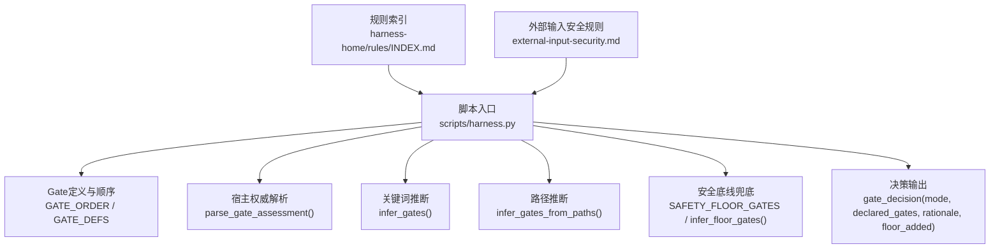
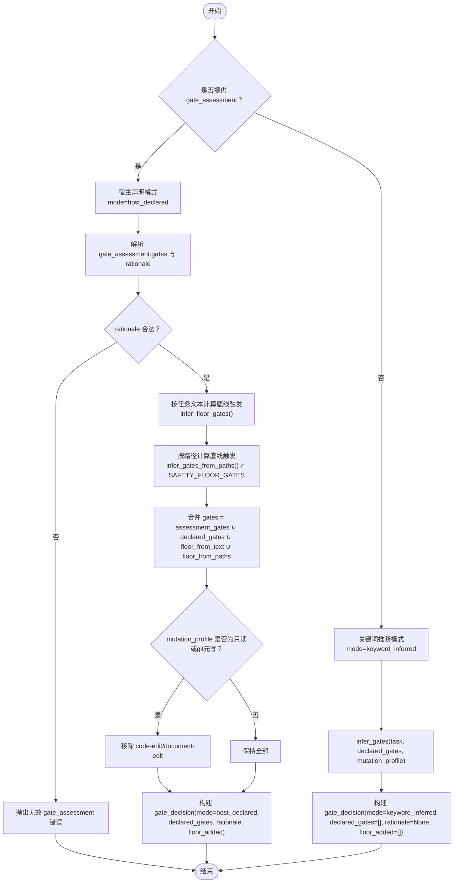
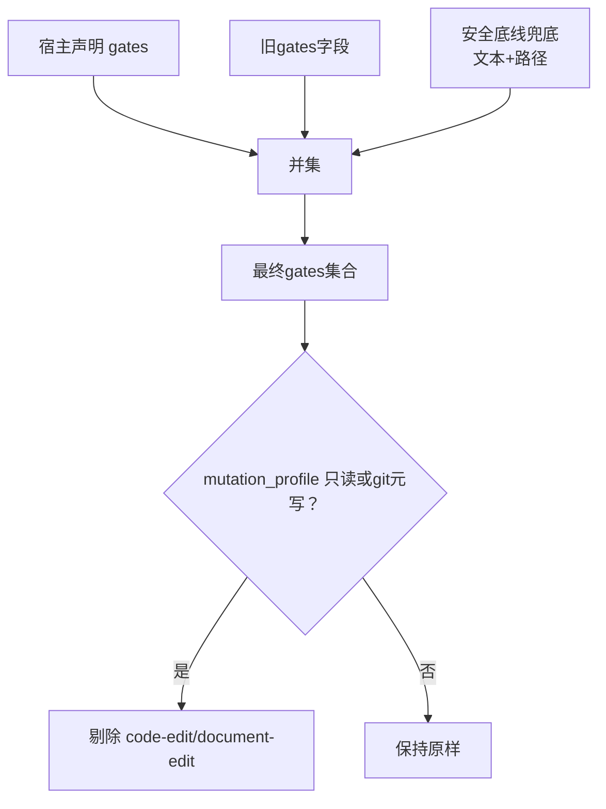
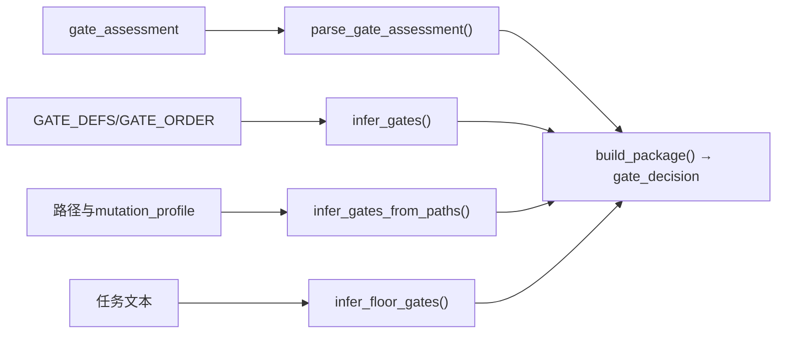

# Gate决策模式

<cite>
**本文引用的文件**   
- [harness.py](file://scripts/harness.py)
- [external-input-security.md](file://harness-home/rules/external-input-security.md)
- [INDEX.md](file://harness-home/rules/INDEX.md)
- [test_harness.py](file://tests/test_harness.py)
</cite>

## 目录
1. [简介](#简介)
2. [项目结构](#项目结构)
3. [核心组件](#核心组件)
4. [架构总览](#架构总览)
5. [详细组件分析](#详细组件分析)
6. [依赖关系分析](#依赖关系分析)
7. [性能考量](#性能考量)
8. [故障排查指南](#故障排查指南)
9. [结论](#结论)
10. [附录](#附录)

## 简介
本文件面向Docs Harness的Gate决策机制，重点说明两种决策模式：关键词推断模式（keyword_inferred）与宿主声明模式（host_declared，即“declared”）。文档将解释gate_assessment字段的结构与约束、权威语义判断如何跳过非安全Gate的关键词与scope路径推断、gate_decision字段的完整结构与含义，以及Gate合并逻辑的优先级。同时提供不同模式下的任务包结构与评估结果示例，帮助读者快速理解并正确使用。

## 项目结构
- scripts/harness.py：控制器实现，包含Gate定义、推断、解析、决策与打包等核心逻辑。
- harness-home/rules/*.md：规则快照与生效规则索引，用于Gate与规则的治理。
- tests/test_harness.py：覆盖Gate决策相关行为与边界用例。

**图表来源** 
- [harness.py:260-342](file://scripts/harness.py#L260-L342)
- [harness.py:2596-2726](file://scripts/harness.py#L2596-L2726)
- [harness.py:2149-2152](file://scripts/harness.py#L2149-L2152)
- [INDEX.md:1-41](file://harness-home/rules/INDEX.md#L1-L41)
- [external-input-security.md:1-29](file://harness-home/rules/external-input-security.md#L1-L29)

**章节来源**
- [harness.py:260-342](file://scripts/harness.py#L260-L342)
- [INDEX.md:1-41](file://harness-home/rules/INDEX.md#L1-L41)

## 核心组件
- Gate定义与顺序：GATE_ORDER与GATE_DEFS定义了Gate集合、匹配词表、事实引用、方案字段与证据类型。
- 宿主权威解析：parse_gate_assessment负责校验gate_assessment.gates与rationale，确保仅允许已知Gate且rationale为500字符内非空字符串。
- 关键词推断：infer_gates基于任务文本与mutation_profile进行Gate推断，受GATE_DEFS词表驱动。
- 路径推断：infer_gates_from_paths基于读写范围路径特征推断Gate（如代码、文档、前端、测试等）。
- 安全底线兜底：SAFETY_FLOOR_GATES限定必须兜底的Gate集合；infer_floor_gates使用专用精确词表与否定守卫触发。
- 决策输出：build_package根据是否存在gate_assessment决定mode，并生成gate_decision对象。

**章节来源**
- [harness.py:260-342](file://scripts/harness.py#L260-L342)
- [harness.py:2596-2610](file://scripts/harness.py#L2596-L2610)
- [harness.py:2245-2286](file://scripts/harness.py#L2245-L2286)
- [harness.py:2149-2152](file://scripts/harness.py#L2149-L2152)
- [harness.py:380-389](file://scripts/harness.py#L380-L389)
- [harness.py:2693-2726](file://scripts/harness.py#L2693-L2726)

## 架构总览
下图展示从输入facts到最终gate_decision的决策流程，包括两种模式的分支与安全底线兜底。

**图表来源** 
- [harness.py:2596-2610](file://scripts/harness.py#L2596-L2610)
- [harness.py:2245-2286](file://scripts/harness.py#L2245-L2286)
- [harness.py:2149-2152](file://scripts/harness.py#L2149-L2152)
- [harness.py:2693-2726](file://scripts/harness.py#L2693-L2726)

## 详细组件分析

### 关键词推断模式（keyword_inferred）
- 触发条件：未提供gate_assessment时进入该模式。
- 推断依据：
  - 任务文本清洗后与GATE_DEFS各Gate的词表匹配。
  - 若mutation_profile为read_only或git_metadata_write，则排除code-edit与document-edit。
- 输出：
  - mode=keyword_inferred
  - declared_gates=[]
  - rationale=null
  - floor_added=[]

适用场景：
- 普通任务由系统自动推断Gate，无需宿主额外声明。
- 适合常规修改、查询、审计等常见操作。

**章节来源**
- [harness.py:2245-2258](file://scripts/harness.py#L2245-L2258)
- [harness.py:2720-2726](file://scripts/harness.py#L2720-L2726)

### 宿主声明模式（host_declared，即“declared”）
- 触发条件：提供了gate_assessment字段。
- 解析与约束：
  - gate_assessment.gates必须是已知Gate集合的子集。
  - gate_assessment.rationale必须是非空字符串且长度不超过500字符。
- 权威语义判断：
  - 以宿主声明为准，跳过非安全Gate的关键词与scope路径推断。
  - 仅对安全底线Gate执行确定性兜底（只能加不能减）。
- 输出：
  - mode=host_declared
  - declared_gates=assessment_gates
  - rationale=assessment_rationale
  - floor_added=被强制追加的安全底线Gate列表

适用场景：
- 宿主具备更强上下文，能准确声明Gate集合。
- 需要绕过默认推断以避免误报或过度推断。

**章节来源**
- [harness.py:2596-2610](file://scripts/harness.py#L2596-L2610)
- [harness.py:2693-2718](file://scripts/harness.py#L2693-L2718)

### gate_assessment字段结构与约束
- gates：数组，元素为已知的Gate ID；未知ID会报错。
- rationale：字符串，非空且≤500字符；否则报错。
- 作用：在宿主声明模式下作为权威Gate来源，配合安全底线兜底形成最终gates。

**章节来源**
- [harness.py:2596-2610](file://scripts/harness.py#L2596-L2610)

### 权威语义判断机制
- 当存在gate_assessment时：
  - 不执行非安全Gate的关键词与路径推断（即跳过infer_gates与infer_gates_from_paths对非底线Gate的影响）。
  - 仅对安全底线Gate（security-sensitive、destructive-data、release-external）进行确定性触发检查。
- 底线触发：
  - 文本层：infer_floor_gates使用FLOOR_TERMS精确词表与否定守卫。
  - 路径层：infer_gates_from_paths结果与SAFETY_FLOOR_GATES交集。

**章节来源**
- [harness.py:380-389](file://scripts/harness.py#L380-L389)
- [harness.py:2149-2152](file://scripts/harness.py#L2149-L2152)
- [harness.py:2693-2710](file://scripts/harness.py#L2693-L2710)

### gate_decision字段完整结构
- mode：枚举值，keyword_inferred或host_declared。
- declared_gates：在宿主声明模式下为assessment_gates；在关键词推断模式下为空数组。
- rationale：仅在宿主声明模式下提供，承载宿主的理由说明。
- floor_added：被强制追加的安全底线Gate列表（仅宿主声明模式可能非空）。

**章节来源**
- [harness.py:2693-2726](file://scripts/harness.py#L2693-L2726)

### Gate合并逻辑与优先级
- 最终gates集合来源于以下三者的并集：
  - gate_assessment.gates（宿主声明）
  - facts.gates（旧gates字段）
  - 安全底线兜底（floor_from_text ∪ floor_from_paths）
- 优先级关系：
  - 宿主声明优先于关键词与路径推断（在宿主声明模式下）。
  - 安全底线兜底不可被宿主删除（只能增加），确保高风险Gate不被遗漏。
  - 对于只读或git元写mutation_profile，会剔除code-edit与document-edit。

**图表来源** 
- [harness.py:2693-2712](file://scripts/harness.py#L2693-L2712)

**章节来源**
- [harness.py:2693-2712](file://scripts/harness.py#L2693-L2712)

### JSON示例（不同决策模式的任务包结构与Gate评估结果）
以下为概念性示例，展示两种模式下task-package.json中gate_decision与matched_gates的典型结构差异。实际字段请以运行时输出为准。

- 关键词推断模式示例（概念）
  - task-package.json
    - schema_version: "docs-harness/task-package/v2"
    - task_id: "dh-YYYYMMDDTHHMMSS-xxxxxxxxxx"
    - admission_status: "ready_direct" 或 "needs_plan"
    - execution_route: "direct" 或 "planned"
    - task_intent: "query"/"audit"/"modify" 等
    - mutation_profile: "read_only"/"workspace_write" 等
    - matched_gates: ["code-edit", "testing-acceptance"]（由关键词与路径推断得到）
    - gate_decision:
      - mode: "keyword_inferred"
      - declared_gates: []
      - rationale: null
      - floor_added: []

- 宿主声明模式示例（概念）
  - task-package.json
    - schema_version: "docs-harness/task-package/v2"
    - task_id: "dh-YYYYMMDDTHHMMSS-xxxxxxxxxx"
    - admission_status: "ready_direct" 或 "needs_plan"
    - execution_route: "direct" 或 "planned"
    - task_intent: "modify"
    - mutation_profile: "workspace_write"
    - matched_gates: ["security-sensitive", "destructive-data", "release-external"]（宿主声明 + 安全底线兜底）
    - gate_decision:
      - mode: "host_declared"
      - declared_gates: ["security-sensitive", "destructive-data"]
      - rationale: "涉及鉴权与数据删除，需严格验收"
      - floor_added: ["release-external"]（因任务文本命中发布关键词被强制追加）

注意：以上示例仅为概念演示，具体字段与取值以运行时的真实输出为准。

[本节为概念性内容，不直接分析具体文件]

## 依赖关系分析
- Gate定义与顺序：GATE_ORDER与GATE_DEFS影响推断与过滤。
- 宿主权威解析：parse_gate_assessment依赖GATE_DEFS校验gates合法性。
- 底线触发：infer_floor_gates依赖FLOOR_TERMS与NEGATION_MARKERS。
- 路径推断：infer_gates_from_paths依赖mutation_profile与路径特征。
- 决策输出：build_package整合上述结果生成gate_decision与matched_gates。

**图表来源** 
- [harness.py:260-342](file://scripts/harness.py#L260-L342)
- [harness.py:2596-2610](file://scripts/harness.py#L2596-L2610)
- [harness.py:2149-2152](file://scripts/harness.py#L2149-L2152)
- [harness.py:2245-2286](file://scripts/harness.py#L2245-L2286)
- [harness.py:2693-2726](file://scripts/harness.py#L2693-L2726)

**章节来源**
- [harness.py:260-342](file://scripts/harness.py#L260-L342)
- [harness.py:2596-2610](file://scripts/harness.py#L2596-L2610)
- [harness.py:2149-2152](file://scripts/harness.py#L2149-L2152)
- [harness.py:2245-2286](file://scripts/harness.py#L2245-L2286)
- [harness.py:2693-2726](file://scripts/harness.py#L2693-L2726)

## 性能考量
- 路径展开限制：expand_scope_paths_for_inference对目录遍历有上限（最多200个文件），避免巨型目录导致性能问题。
- 词表匹配：phrase_matches与infer_floor_gates使用精简词表与否定守卫，减少误匹配开销。
- 决策分支：在宿主声明模式下跳过非安全Gate的推断，降低不必要的计算。

[本节为一般性指导，不直接分析具体文件]

## 故障排查指南
- gate_assessment无效：
  - 现象：抛出invalid_gate_assessment错误。
  - 原因：gates包含未知Gate或rationale不符合约束（非空且≤500字符）。
  - 处理：修正gates为已知Gate集合子集，并确保rationale满足长度与非空要求。
- 未知Gate：
  - 现象：抛出invalid_gate错误。
  - 原因：gates中包含不在GATE_DEFS中的ID。
  - 处理：核对GATE_DEFS，修正为有效Gate ID。
- 安全底线兜底未生效：
  - 现象：预期的高风险Gate未被加入。
  - 原因：任务文本未命中FLOOR_TERMS或路径未落入SAFETY_FLOOR_GATES。
  - 处理：补充明确关键词或在宿主声明中显式添加对应Gate。

**章节来源**
- [harness.py:2596-2610](file://scripts/harness.py#L2596-L2610)
- [harness.py:2245-2251](file://scripts/harness.py#L2245-L2251)
- [harness.py:2149-2152](file://scripts/harness.py#L2149-L2152)

## 结论
Docs Harness的Gate决策模式通过关键词推断与宿主声明两种路径，结合安全底线兜底，既保证了灵活性又确保了安全性。在宿主声明模式下，系统尊重宿主的权威判断，同时以代码强制兜底高风险Gate，避免误删。合理选择模式与正确填写gate_assessment，可显著提升任务包的准确性与可控性。

[本节为总结性内容，不直接分析具体文件]

## 附录
- 规则索引与激活条件：参见harness-home/rules/INDEX.md，了解生效规则与加载约定。
- 外部输入安全规则：参见harness-home/rules/external-input-security.md，了解security-sensitive Gate的适用条件与验收要求。
- 测试覆盖：tests/test_harness.py包含大量关于Gate决策与底线兜底的断言，可作为行为参考。

**章节来源**
- [INDEX.md:1-41](file://harness-home/rules/INDEX.md#L1-L41)
- [external-input-security.md:1-29](file://harness-home/rules/external-input-security.md#L1-L29)
- [test_harness.py:5563-5725](file://tests/test_harness.py#L5563-L5725)