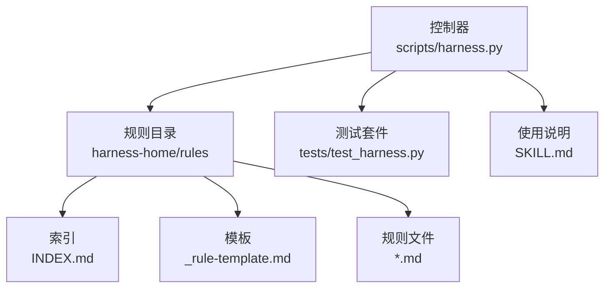
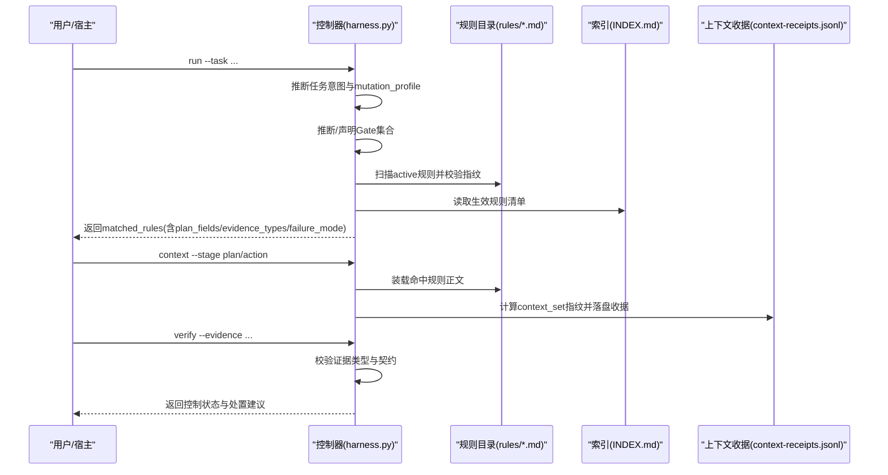
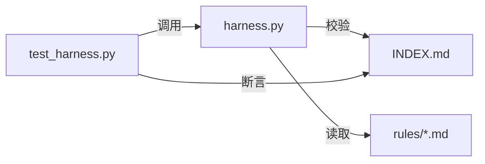

# 规则引擎集成

<cite>
**本文引用的文件**   
- [harness.py](file://scripts/harness.py)
- [INDEX.md](file://harness-home/rules/INDEX.md)
- [_rule-template.md](file://harness-home/rules/_rule-template.md)
- [api-compatibility.md](file://harness-home/rules/api-compatibility.md)
- [external-input-security.md](file://harness-home/rules/external-input-security.md)
- [testing-release.md](file://harness-home/rules/testing-release.md)
- [documentation-changes.md](file://harness-home/rules/documentation-changes.md)
- [release-authorization-rollback.md](file://harness-home/rules/release-authorization-rollback.md)
- [scope-change-readmission.md](file://harness-home/rules/scope-change-readmission.md)
- [ui-complete-states.md](file://harness-home/rules/ui-complete-states.md)
- [SKILL.md](file://SKILL.md)
- [test_harness.py](file://tests/test_harness.py)
</cite>

## 目录
1. [简介](#简介)
2. [项目结构](#项目结构)
3. [核心组件](#核心组件)
4. [架构总览](#架构总览)
5. [详细组件分析](#详细组件分析)
6. [依赖关系分析](#依赖关系分析)
7. [性能考量](#性能考量)
8. [故障排查指南](#故障排查指南)
9. [结论](#结论)
10. [附录](#附录)

## 简介
本文件为 Docs Harness 的规则引擎集成系统提供系统化、可操作的文档。内容覆盖：
- 规则文件结构与语法（Frontmatter、正文章节、指纹校验）
- 内置规则的功能与用法（API 兼容性、外部输入安全、测试发布规范等）
- 规则激活机制与优先级管理（Gate 匹配、关键词匹配、只读保护）
- INDEX.md 的作用与加载约定
- 自定义规则开发流程（模板使用、测试方法、调试技巧）
- 业务特定风险检查示例
- 规则与风险 Gate 的协作关系及输出对 Gate 决策的影响

## 项目结构
规则引擎由“控制器脚本 + 规则目录 + 索引与模板”构成：
- scripts/harness.py：控制器，负责任务意图推断、Gate 判定、规则加载与上下文装配、证据校验等
- harness-home/rules：规则快照目录，包含 INDEX.md、_rule-template.md 与各具体规则 .md 文件
- tests/test_harness.py：验证规则安装、激活、指纹一致性、自测等
- SKILL.md：面向使用者的快速上手说明

图表来源 
- [harness.py:2049-2248](file://scripts/harness.py#L2049-L2248)
- [INDEX.md:1-41](file://harness-home/rules/INDEX.md#L1-L41)

章节来源
- [harness.py:2049-2248](file://scripts/harness.py#L2049-L2248)
- [INDEX.md:1-41](file://harness-home/rules/INDEX.md#L1-L41)

## 核心组件
- 规则定义与结构
  - Frontmatter 字段：status、rule_id、content_fingerprint、gates、keywords、plan_fields、evidence_types、failure_mode
  - 正文必须包含四个固定标题：适用条件、必需的方案字段、验收条件、失败处理方式
  - content_fingerprint 用于正文完整性校验，禁止运行时篡改
- 规则激活与匹配
  - 仅 status=active 的规则参与匹配
  - 匹配策略：Gate 命中优先；否则按 keywords 在任务文本中匹配（受 mutation_profile 限制）
  - read_only/git_metadata_write 下禁止 code-edit/document-edit 关键词匹配，防止误触发文档类规则
- 上下文装配与缓存
  - 控制器将命中的规则与项目事实引用组合为 context_set，生成指纹并持久化收据，避免重复加载
- Gate 体系与底线
  - GATE_ORDER 定义 Gate 顺序；GATE_DEFS 定义词表、事实源、方案字段与证据类型
  - SAFETY_FLOOR_GATES 强制底线 Gate（security-sensitive、destructive-data、release-external），不可豁免
  - floor_term_matches 带否定守卫，避免“不要部署”等误判

章节来源
- [harness.py:2223-2422](file://scripts/harness.py#L2223-L2422)
- [harness.py:4182-4381](file://scripts/harness.py#L4182-L4381)
- [INDEX.md:1-41](file://harness-home/rules/INDEX.md#L1-L41)

## 架构总览
规则引擎在任务生命周期中的关键交互如下：

图表来源 
- [harness.py:2223-2422](file://scripts/harness.py#L2223-L2422)
- [harness.py:4182-4381](file://scripts/harness.py#L4182-L4381)
- [INDEX.md:1-41](file://harness-home/rules/INDEX.md#L1-L41)

## 详细组件分析

### 规则文件结构与语法
- Frontmatter 关键字段
  - status: 规则状态，仅 active 参与匹配
  - rule_id: 唯一标识，如 DH-API-COMPATIBILITY
  - content_fingerprint: 正文 sha256 指纹，防篡改
  - gates: 逗号分隔的 Gate 名称，用于精确命中
  - keywords: 逗号分隔的任务关键词，用于模糊匹配
  - plan_fields: 必需的方案字段列表
  - evidence_types: 必需的证据类型列表
  - failure_mode: 失败处理策略描述
- 正文章节要求
  - ## 适用条件
  - ## 必需的方案字段
  - ## 验收条件
  - ## 失败处理方式
- 指纹校验
  - 控制器读取正文后计算 sha256，与 declared fingerprint 比较，不一致即报错

章节来源
- [_rule-template.md:1-21](file://harness-home/rules/_rule-template.md#L1-L21)
- [harness.py:2223-2290](file://scripts/harness.py#L2223-L2290)

### 内置规则功能与使用方法
- API 兼容性检查（DH-API-COMPATIBILITY）
  - 触发：修改 API/Schema/协议/数据库/迁移路径
  - 必需方案字段：兼容策略、迁移与回滚
  - 必需证据：contract_acceptance
  - 失败处理：未声明消费者或回滚不可执行时停止并重新准入
- 外部输入安全验证（DH-EXTERNAL-INPUT-SECURITY）
  - 触发：触及鉴权、权限、密钥、隐私、文件解析、供应链边界
  - 必需方案字段：安全边界、负向路径
  - 必需证据：security_acceptance
  - 失败处理：无法证明边界或失败关闭时不得继续
- 测试发布规范（DH-TESTING-RELEASE）
  - 触发：测试、回归、验收、构建放行
  - 必需方案字段：验收结果（区分静态检查、源码测试、运行时验证、产物验证、真实产品验收）
  - 必需证据：test_result
  - 失败处理：测试未运行或证据过期不得宣称完成
- 文档修改规则（DH-DOCUMENTATION-CHANGES）
  - 触发：新增/修改/迁移/重命名/删除文档或运行时入口
  - 必需方案字段：文档真源、索引与残留
  - 必需证据：document_review
  - 失败处理：旧引用未闭合时停止补齐
- 发布授权和回滚（DH-RELEASE-AUTHORIZATION-ROLLBACK）
  - 触发：推送/发布/部署/上传或改变第三方外部状态
  - 必需方案字段：外部目标、发布与回滚
  - 必需证据：external_state
  - 失败处理：授权不新鲜或不可回滚时停止
- 范围变化重新判断（DH-SCOPE-CHANGE-READMISSION）
  - 触发：实际改动超出已冻结范围
  - 必需方案字段：影响范围
  - 必需证据：review_result
  - 失败处理：未声明变化立即停止并重新准入
- UI 完整状态（DH-UI-COMPLETE-STATES）
  - 触发：页面/组件/视觉/交互/响应式布局变更
  - 必需方案字段：设计状态、真实页面验收
  - 必需证据：ui_acceptance
  - 失败处理：缺少完整状态或不可操作不得宣称完成

章节来源
- [api-compatibility.md:1-29](file://harness-home/rules/api-compatibility.md#L1-L29)
- [external-input-security.md:1-29](file://harness-home/rules/external-input-security.md#L1-L29)
- [testing-release.md:1-29](file://harness-home/rules/testing-release.md#L1-L29)
- [documentation-changes.md:1-29](file://harness-home/rules/documentation-changes.md#L1-L29)
- [release-authorization-rollback.md:1-29](file://harness-home/rules/release-authorization-rollback.md#L1-L29)
- [scope-change-readmission.md:1-29](file://harness-home/rules/scope-change-readmission.md#L1-L29)
- [ui-complete-states.md:1-29](file://harness-home/rules/ui-complete-states.md#L1-L29)

### 规则的激活机制与优先级管理
- 激活条件
  - 仅 status=active 的规则进入匹配
  - 必须包含 rule_id 与正确的 content_fingerprint
  - 必须包含 gates 或 keywords，且正文具备四个固定标题
- 匹配优先级
  - 若 rules_root_for 指向的项目内规则目录存在，则优先使用项目内规则
  - 匹配顺序：Gate 命中 > 关键词命中（read_only/git_metadata_write 下禁用文档类关键词）
  - 同一轮匹配去重 rule_id，重复即报错
- INDEX.md 的作用
  - 记录当前安装的规则快照与生效规则 ID 列表
  - 控制器通过 installed_rule_names 与 portable_install_paths 校验交付完整性
  - 缺失、增加或变化均导致失败关闭，需通过升级或人工 preserve-and-merge
- 加载约定
  - 安装时复制固定规则快照，并在配置中记录逐文件指纹
  - 运行时不得依赖源码目录绝对路径

章节来源
- [harness.py:2049-2097](file://scripts/harness.py#L2049-L2097)
- [harness.py:2223-2290](file://scripts/harness.py#L2223-L2290)
- [INDEX.md:1-41](file://harness-home/rules/INDEX.md#L1-L41)

### 自定义规则开发流程
- 使用模板
  - 基于 _rule-template.md 创建新规则 .md，填写 Frontmatter 与四个固定标题
  - 确保 rule_id 唯一、content_fingerprint 正确（正文 sha256）
- 测试方法
  - 使用 tests/test_harness.py 中的断言模式：检查 ACTIVE_RULE_FILES/ACTIVE_RULE_IDS 与 INDEX.md 一致
  - 通过 self-test 命令验证规则集完整性
- 调试技巧
  - 查看 load_active_rules 的错误列表，定位 missing rule_id/content_fingerprint、fingerprint 不匹配、重复 rule_id、正文结构不完整等问题
  - 使用 project check 检查 rules_root 是否存在、是否越界、是否被忽略
  - 通过 context 阶段收据观察 context_set 指纹与内容复用情况

章节来源
- [_rule-template.md:1-21](file://harness-home/rules/_rule-template.md#L1-L21)
- [test_harness.py:339-354](file://tests/test_harness.py#L339-L354)
- [harness.py:2223-2290](file://scripts/harness.py#L2223-L2290)

### 规则与风险 Gate 的协作关系
- Gate 推断与底线
  - 控制器根据任务文本与 facts.gate_assessment 推断 Gate；SAFETY_FLOOR_GATES 强制合并底线 Gate
  - floor_term_matches 使用精确词表与否定守卫，避免误报
- 规则对 Gate 的影响
  - 规则通过 evidence_types 指定所需证据类型，verify 阶段据此校验
  - 规则通过 plan_fields 约束方案字段，context 阶段装配到上下文
  - 规则通过 failure_mode 指导失败处置（如重新准入、停止实现）
- 输出如何影响 Gate 决策
  - 证据不足或类型不匹配将导致 verify 返回 provide_evidence/retry_verification/incremental_admission/full_readmission 等处置
  - 高风险 Gate（安全、破坏性数据、外部发布）变更会触发完整重新准入

章节来源
- [harness.py:2411-2422](file://scripts/harness.py#L2411-L2422)
- [harness.py:4182-4381](file://scripts/harness.py#L4182-L4381)
- [SKILL.md:1-106](file://SKILL.md#L1-L106)

### 业务特定风险检查示例（思路与要点）
- 示例一：敏感配置泄露检查
  - 适用条件：任务涉及配置文件、环境变量、密钥注入
  - 必需方案字段：敏感项清单、最小权限、替换策略
  - 验收条件：扫描命令与退出码、覆盖率、失败项；禁止硬编码
  - 失败处理：发现明文密钥或未覆盖路径时停止
- 示例二：跨服务接口变更风险评估
  - 适用条件：调用上游/下游接口、消息协议变更
  - 必需方案字段：版本兼容矩阵、降级策略、灰度计划
  - 验收条件：契约验收、端到端回归、错误路径演练
  - 失败处理：未提供回滚或降级方案时停止
- 示例三：数据迁移幂等性与回滚
  - 适用条件：批量写库、DDL/DML 变更
  - 必需方案字段：幂等键、分批策略、回滚脚本
  - 验收条件：预演环境验证、数据一致性校验
  - 失败处理：回滚脚本不可执行时停止

[本节为概念性说明，不直接分析具体文件]

## 依赖关系分析
- 控制器与规则目录耦合点
  - rules_root_for：从项目配置读取 rules_root，默认回退到 source_root/harness-home/rules
  - rule_file_fingerprints：遍历 *.md 计算指纹
  - installed_rule_names：结合配置与文件系统确定已安装规则名
- 控制器与索引
  - INDEX.md 声明生效规则 ID 列表，测试与安装流程依赖其一致性
- 控制器与测试
  - test_harness.py 断言 ACTIVE_RULE_FILES/ACTIVE_RULE_IDS 与 INDEX.md 一致，并执行 self-test

图表来源 
- [harness.py:2049-2097](file://scripts/harness.py#L2049-L2097)
- [test_harness.py:339-354](file://tests/test_harness.py#L339-L354)

章节来源
- [harness.py:2049-2097](file://scripts/harness.py#L2049-L2097)
- [test_harness.py:339-354](file://tests/test_harness.py#L339-L354)

## 性能考量
- 规则加载
  - 仅扫描 active 规则，跳过非 active 文件
  - 指纹校验一次计算，后续通过 context receipt 复用
- 上下文缓存
  - context_set_fingerprint 对规则与项目事实进行哈希，避免重复加载
  - prior_context_content_fingerprints 支持增量加载，减少 IO
- 关键词匹配
  - 小写化与正则优化，read_only/git_metadata_write 下提前过滤文档类规则
- 安装与交付
  - install_delivery_status 使用 git diff 比对，尊重行尾转换，避免误判

[本节提供一般性指导，不直接分析具体文件]

## 故障排查指南
- 常见错误与定位
  - 缺少 rules_root 或越界：检查项目配置 rules_root 是否为相对路径且不越出项目目录
  - active 规则缺少 rule_id 或 content_fingerprint：补全 Frontmatter 并确保指纹与正文一致
  - content_fingerprint 与正文不匹配：重新计算指纹或恢复原始正文
  - rule_id 重复：修正规则 ID 保证唯一
  - 正文结构不完整：补齐四个固定标题
  - 没有可执行的 active 规则：确认至少一条规则 status=active 且满足所有前置条件
- 调试步骤
  - 使用 project check 检查 rules_root 与交付状态
  - 使用 context 阶段收据观察 context_set 指纹与内容复用
  - 使用 self-test 验证规则集完整性
  - 查看 load_active_rules 返回的错误列表定位具体问题

章节来源
- [harness.py:2223-2290](file://scripts/harness.py#L2223-L2290)
- [test_harness.py:356-376](file://tests/test_harness.py#L356-L376)

## 结论
Docs Harness 的规则引擎以“文件即规则、指纹即契约”为核心，通过严格的激活与匹配机制、Gate 协同与上下文缓存，实现了高可靠、可审计、可扩展的规则治理体系。遵循本文档的结构与流程，可在项目中稳定集成与扩展规则，保障 API 兼容性、外部输入安全、测试发布规范与文档治理的一致性。

[本节总结性内容，不直接分析具体文件]

## 附录
- 快速上手
  - 项目初始化：python3 scripts/harness.py project init --target <project> --json
  - 任务入口：python3 scripts/harness.py run --target . --task "<原始用户任务>" --json
  - 最终验收：python3 scripts/harness.py verify --target . --task-id <task-id> --evidence <evidence.json> --json
- 后台治理
  - background prepare/status/dispatch/progress/verify/retry 等命令参考 SKILL.md

章节来源
- [SKILL.md:1-106](file://SKILL.md#L1-L106)