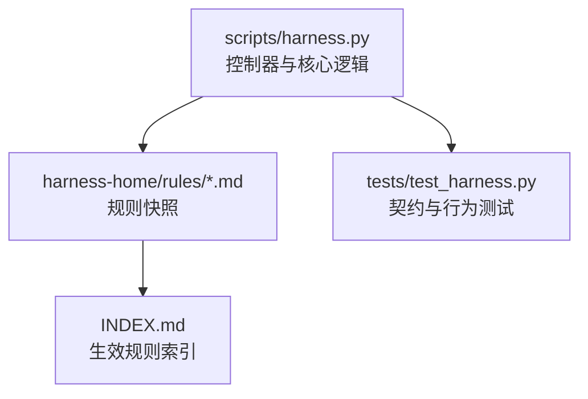
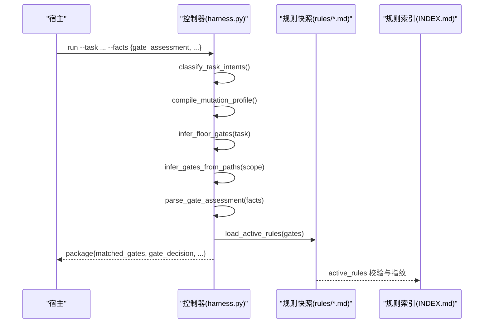
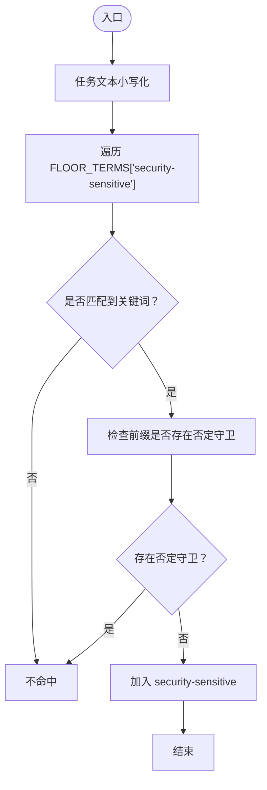
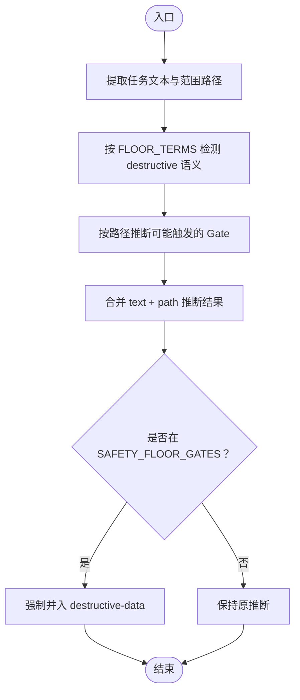
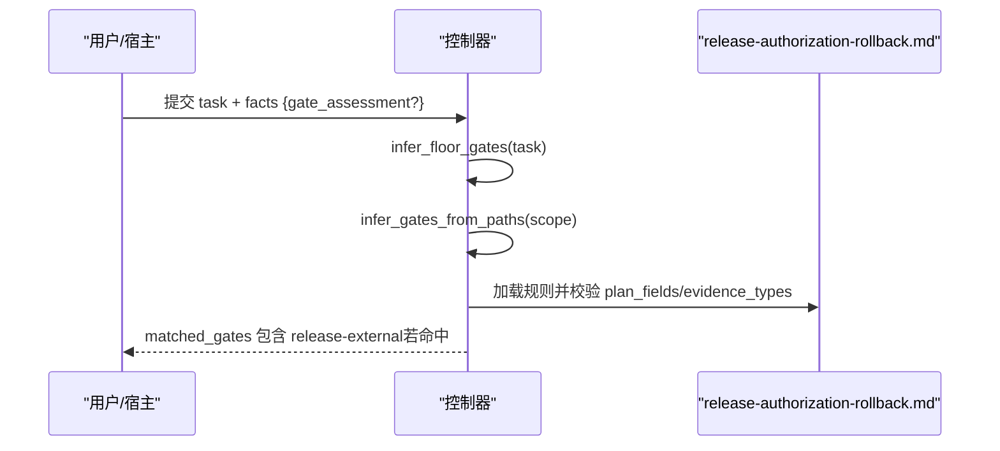
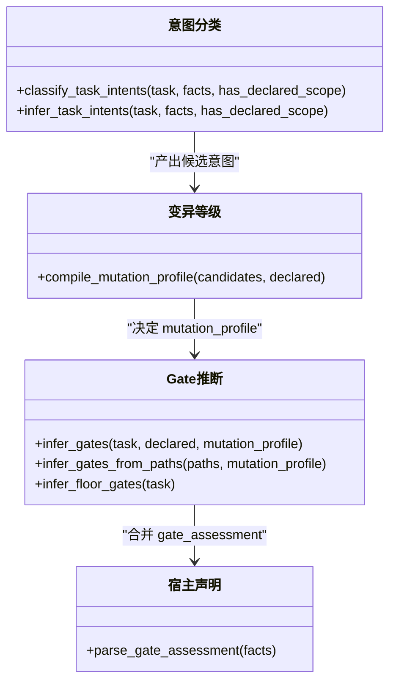
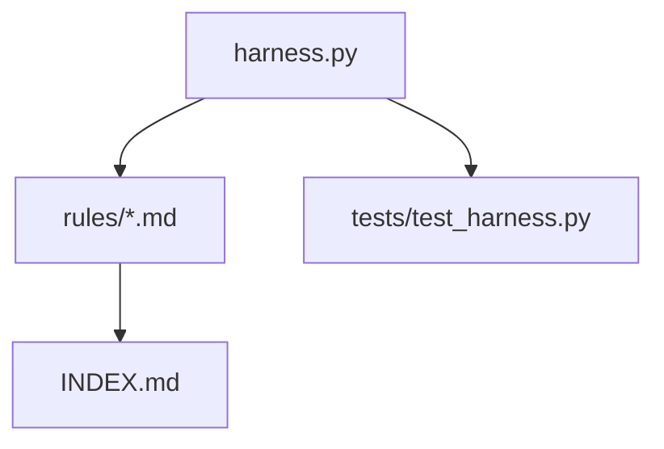

# 风险类型识别

<cite>
**本文引用的文件**   
- [harness.py](file://scripts/harness.py)
- [INDEX.md](file://harness-home/rules/INDEX.md)
- [external-input-security.md](file://harness-home/rules/external-input-security.md)
- [release-authorization-rollback.md](file://harness-home/rules/release-authorization-rollback.md)
- [api-compatibility.md](file://harness-home/rules/api-compatibility.md)
- [testing-release.md](file://harness-home/rules/testing-release.md)
- [documentation-changes.md](file://harness-home/rules/documentation-changes.md)
- [scope-change-readmission.md](file://harness-home/rules/scope-change-readmission.md)
- [ui-complete-states.md](file://harness-home/rules/ui-complete-states.md)
- [test_harness.py](file://tests/test_harness.py)
</cite>

## 目录
1. [引言](#引言)
2. [项目结构](#项目结构)
3. [核心组件](#核心组件)
4. [架构总览](#架构总览)
5. [详细组件分析](#详细组件分析)
6. [依赖关系分析](#依赖关系分析)
7. [性能考量](#性能考量)
8. [故障排查指南](#故障排查指南)
9. [结论](#结论)
10. [附录](#附录)

## 引言
本文件面向 Docs Harness 的风险类型识别系统，聚焦三种强制安全底线 Gate：security-sensitive（安全敏感）、destructive-data（数据破坏性）、release-external（外部发布）。文档将解释其识别机制、精确词表匹配与否定守卫规则、与任务意图的关系及优先级影响，并通过实际用例展示 API 兼容性检查、外部输入验证、数据操作风险评估等场景。最后给出自定义风险类型的扩展方法与最佳实践。

## 项目结构
- 控制器与核心逻辑位于 scripts/harness.py，包含 Gate 定义、意图分类、路径推断、底线 Gate 触发、宿主声明解析与合并等关键实现。
- 通用规则快照位于 harness-home/rules，以 Markdown 描述各规则的适用条件、必需方案字段、验收证据与失败处理模式。
- tests/test_harness.py 提供契约与行为测试，覆盖 gate_assessment 权威模式、底线 Gate 强制兜底、Git 预检/后检等。

**图表来源** 
- [harness.py:260-342](file://scripts/harness.py#L260-L342)
- [INDEX.md:1-41](file://harness-home/rules/INDEX.md#L1-L41)

**章节来源**
- [harness.py:260-342](file://scripts/harness.py#L260-L342)
- [INDEX.md:1-41](file://harness-home/rules/INDEX.md#L1-L41)

## 核心组件
- 安全底线 Gate 集合：SAFETY_FLOOR_GATES = {"security-sensitive", "destructive-data", "release-external"}
- 底线精确词表 FLOOR_TERMS：为三个底线 Gate 分别定义专用词表，与 GATE_DEFS 宽泛词表解耦。
- 否定守卫 NEGATION_MARKERS：如「不要」「不用」「先不」「无需」「不许」「禁止」「别」「非」「不」以及英文 without/don't/do not/no 等，用于修剪误报。
- 底线触发函数 infer_floor_gates：仅使用 FLOOR_TERMS 进行确定性触发，忽略宽泛词表。
- 宿主权威 gate 声明 parse_gate_assessment：允许宿主提交 gate_assessment，但代码仍对底线 Gate 做强制兜底。
- 路径推断 infer_gates_from_paths：根据读写范围路径推断 Gate，若命中 SAFETY_FLOOR_GATES 则强制并入。

**章节来源**
- [harness.py:382-389](file://scripts/harness.py#L382-L389)
- [harness.py:2149-2151](file://scripts/harness.py#L2149-L2151)
- [harness.py:2596-2610](file://scripts/harness.py#L2596-L2610)
- [harness.py:2692-2710](file://scripts/harness.py#L2692-L2710)

## 架构总览
下图展示了风险类型识别在任务包构建流程中的位置与交互：宿主通过 facts 提交 gate_assessment；控制器解析并合并；同时基于任务文本与路径推断底线 Gate；最终输出 matched_gates 与 gate_decision。

**图表来源** 
- [harness.py:2629-2680](file://scripts/harness.py#L2629-L2680)
- [harness.py:2692-2710](file://scripts/harness.py#L2692-L2710)
- [harness.py:2797-2802](file://scripts/harness.py#L2797-L2802)
- [INDEX.md:34-41](file://harness-home/rules/INDEX.md#L34-L41)

## 详细组件分析

### 安全敏感 Gate（security-sensitive）
- 精确词表：包括“安全”“鉴权”“权限”“密钥”“隐私”及其英文对应词。
- 否定守卫：若关键词前缀存在否定标记（如「不要部署」「先不推送」），则不命中。
- 路径推断：当写范围涉及 security/auth/secret/permission 相关路径或文件名时，可能触发该 Gate。
- 规则约束：external-input-security.md 要求说明信任边界、最小权限、秘密处理、数据留存与负向路径；验收需覆盖未授权、畸形输入、敏感信息泄露与失败关闭。

**图表来源** 
- [harness.py:2140-2151](file://scripts/harness.py#L2140-L2151)
- [harness.py:384-389](file://scripts/harness.py#L384-L389)

**章节来源**
- [harness.py:2140-2151](file://scripts/harness.py#L2140-L2151)
- [external-input-security.md:1-29](file://harness-home/rules/external-input-security.md#L1-L29)

### 数据破坏性 Gate（destructive-data）
- 精确词表：包括“清空”“覆盖”“删除数据”“迁移数据”“删库”及 drop/truncate/delete data 等。
- 否定守卫：同上，关键词前缀的否定标记会阻止命中。
- 路径推断：当写范围涉及数据库/schema/migration 等路径或文件时，可能触发 architecture-contract；若明确出现 destructive 语义，则触发 destructive-data。
- 规则约束：需要备份与恢复策略、影响范围评估；验收需提供 recovery_acceptance。

**图表来源** 
- [harness.py:2692-2710](file://scripts/harness.py#L2692-L2710)
- [harness.py:382-389](file://scripts/harness.py#L382-L389)

**章节来源**
- [harness.py:2692-2710](file://scripts/harness.py#L2692-L2710)

### 外部发布 Gate（release-external）
- 精确词表：包括“发布”“上线”“部署”“推送到远端”“推送远端”“git push”及 publish/deploy/release 等。
- 否定守卫：同样受否定守卫保护，避免误判只读查询或计划性动作。
- 路径推断：当 mutation_profile 为 external_write 或 write_scope 包含远端交付相关路径时，可能触发 release-external。
- 规则约束：release-authorization-rollback.md 要求冻结外部目标、产物身份、授权范围、发布步骤、观测窗口与回滚路径；验收必须以目标系统真实状态证明结果。

**图表来源** 
- [harness.py:2149-2151](file://scripts/harness.py#L2149-L2151)
- [harness.py:2692-2710](file://scripts/harness.py#L2692-L2710)
- [release-authorization-rollback.md:1-29](file://harness-home/rules/release-authorization-rollback.md#L1-L29)

**章节来源**
- [harness.py:2149-2151](file://scripts/harness.py#L2149-L2151)
- [release-authorization-rollback.md:1-29](file://harness-home/rules/release-authorization-rollback.md#L1-L29)

### 与任务意图的关系与优先级
- 意图分类 classify_task_intents：从任务文本与 facts 中提取当前意图、候选意图与延后意图，考虑否定与未来/完成标记。
- 变异等级 compile_mutation_profile：依据意图与 actions 推导最高 mutation_profile（read_only/git_metadata_write/workspace_write/external_write）。
- Gate 推断顺序：GATE_ORDER 定义了优先级，高优先级 Gate（product-change、architecture-contract、security-sensitive、destructive-data、release-external、frontend-design）会影响执行路由（direct/planned/extended）。
- 宿主权威 gate_assessment：可声明 gates 与 rationale，但底线 Gate 不受豁免；漏判会被 floor_added 强制并入。

**图表来源** 
- [harness.py:2154-2233](file://scripts/harness.py#L2154-L2233)
- [harness.py:2236-2243](file://scripts/harness.py#L2236-L2243)
- [harness.py:2245-2258](file://scripts/harness.py#L2245-L2258)
- [harness.py:2596-2610](file://scripts/harness.py#L2596-L2610)

**章节来源**
- [harness.py:2154-2233](file://scripts/harness.py#L2154-L2233)
- [harness.py:2236-2243](file://scripts/harness.py#L2236-L2243)
- [harness.py:2245-2258](file://scripts/harness.py#L2245-L2258)
- [harness.py:2596-2610](file://scripts/harness.py#L2596-L2610)

### 具体用例与识别过程
- API 兼容性检查：当修改 API/schema/协议/数据库时，architecture-contract 被触发；若同时涉及 destructive 语义，destructive-data 也会被强制并入。验收需 contract_acceptance。
- 外部输入验证：触及外部输入、鉴权、秘密、隐私时，security-sensitive 被触发；规则要求负向路径与最小权限证明。
- 数据操作风险评估：明确“清空/覆盖/删除数据/迁移数据”等语义时，destructive-data 被触发；需备份与恢复策略与 recovery_acceptance。
- 外部发布流程：包含“发布/上线/部署/推送”等语义或 mutation_profile=external_write 时，release-external 被触发；需外部状态证据 external_state。

**章节来源**
- [api-compatibility.md:1-29](file://harness-home/rules/api-compatibility.md#L1-L29)
- [external-input-security.md:1-29](file://harness-home/rules/external-input-security.md#L1-L29)
- [release-authorization-rollback.md:1-29](file://harness-home/rules/release-authorization-rollback.md#L1-L29)
- [testing-release.md:1-29](file://harness-home/rules/testing-release.md#L1-L29)

## 依赖关系分析
- 控制器依赖规则快照与索引进行激活与指纹校验。
- 底线 Gate 触发独立于宽泛词表，确保不可豁免。
- 宿主声明与路径推断共同决定最终 matched_gates，且底线 Gate 强制兜底。

**图表来源** 
- [harness.py:2797-2802](file://scripts/harness.py#L2797-L2802)
- [INDEX.md:1-41](file://harness-home/rules/INDEX.md#L1-L41)

**章节来源**
- [harness.py:2797-2802](file://scripts/harness.py#L2797-L2802)
- [INDEX.md:1-41](file://harness-home/rules/INDEX.md#L1-L41)

## 性能考量
- 词表匹配采用正则与子串扫描，复杂度与任务长度线性相关；否定守卫仅在匹配成功后检查前缀，开销可控。
- 路径推断对目录展开有界（最多 200 文件），避免巨型目录导致的性能问题。
- 规则加载与指纹校验在启动阶段完成，运行时仅做快速匹配与合并。

[本节为一般性指导，不直接分析具体文件]

## 故障排查指南
- 若 gate_assessment 未提交或格式无效，控制器将回退到关键词推断；底线 Gate 仍会被强制兜底。
- 若 matched_gates 与预期不符，检查任务文本是否包含否定守卫、路径推断是否命中 SAFETY_FLOOR_GATES。
- 若规则缺失或指纹不一致，check 命令会返回 missing_harness_home 或指纹错误，需通过升级或人工 preserve-and-merge。

**章节来源**
- [harness.py:2596-2610](file://scripts/harness.py#L2596-L2610)
- [harness.py:2692-2710](file://scripts/harness.py#L2692-L2710)
- [test_harness.py:356-375](file://tests/test_harness.py#L356-L375)

## 结论
Docs Harness 的风险类型识别系统通过精确词表与否定守卫确保底线 Gate 的确定性触发，结合宿主权威声明与路径推断实现灵活而安全的 Gate 决策。三条安全底线（security-sensitive、destructive-data、release-external）不可豁免，保障高风险操作的审计与验收。通过规则快照与索引机制，系统具备可移植性与一致性。

[本节为总结性内容，不直接分析具体文件]

## 附录
- 自定义风险类型扩展方法：
  - 在 rules/*.md 新增规则文件，声明 status、rule_id、content_fingerprint、gates、keywords、plan_fields、evidence_types、failure_mode。
  - 在 INDEX.md 中注册 rule_id 并确保 content_fingerprint 正确。
  - 如需新增底线 Gate，需在 SAFETY_FLOOR_GATES 与 FLOOR_TERMS 中扩展，并更新否定守卫策略。
- 最佳实践：
  - 任务文本尽量明确意图与范围，避免模糊表述导致误判。
  - 对于高风险操作，优先提交 gate_assessment 并提供充分 rationale。
  - 使用 write_scope/read_scope/git_scope 精确限定范围，减少路径推断带来的额外 Gate。

**章节来源**
- [INDEX.md:23-41](file://harness-home/rules/INDEX.md#L23-L41)
- [harness.py:382-389](file://scripts/harness.py#L382-L389)