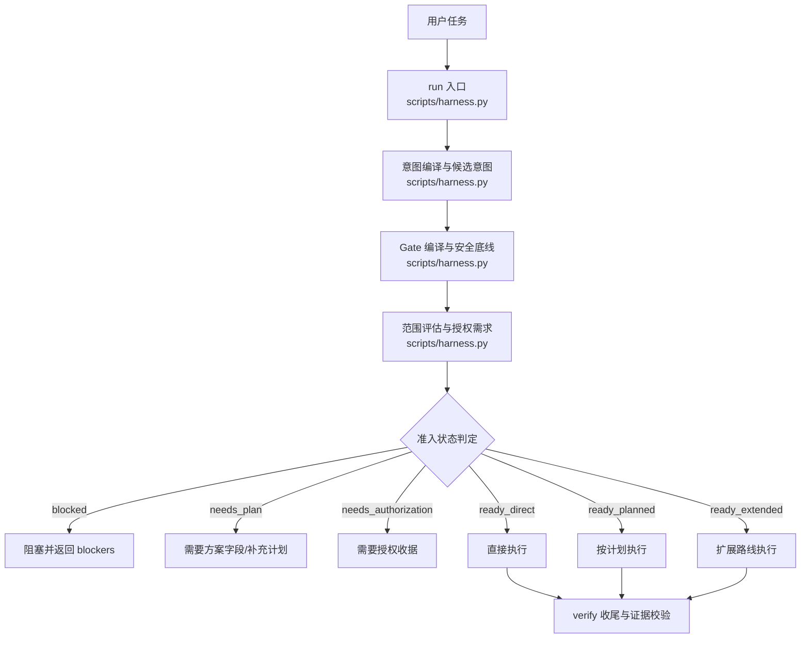
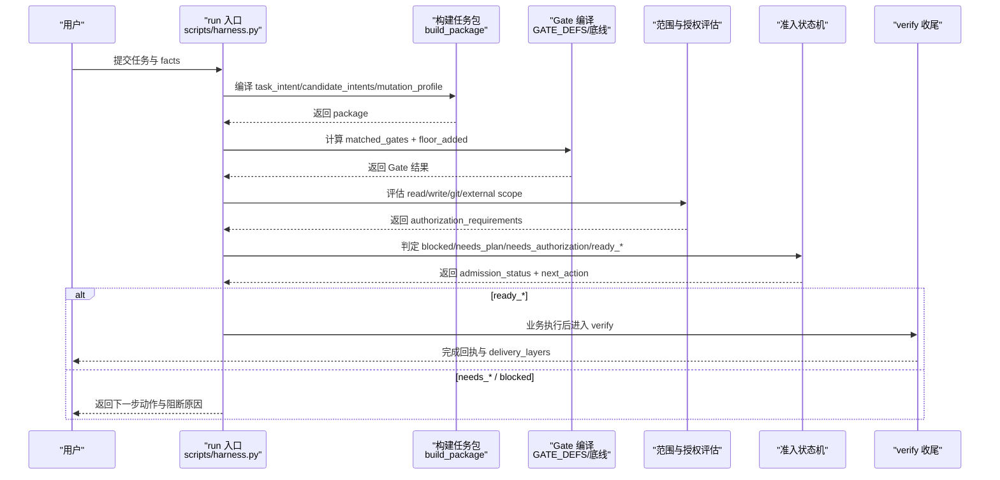
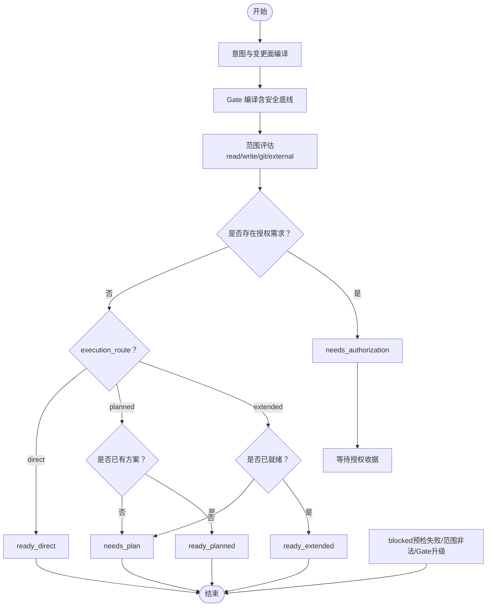
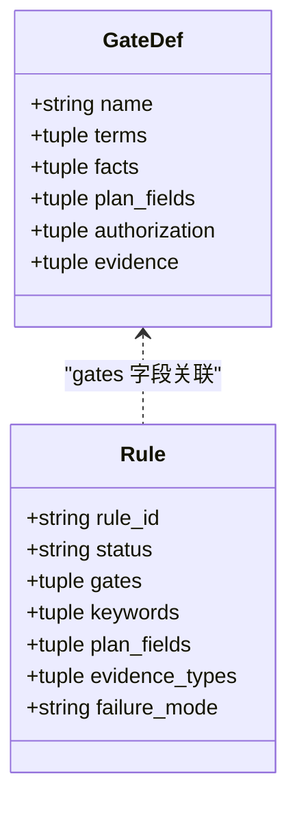
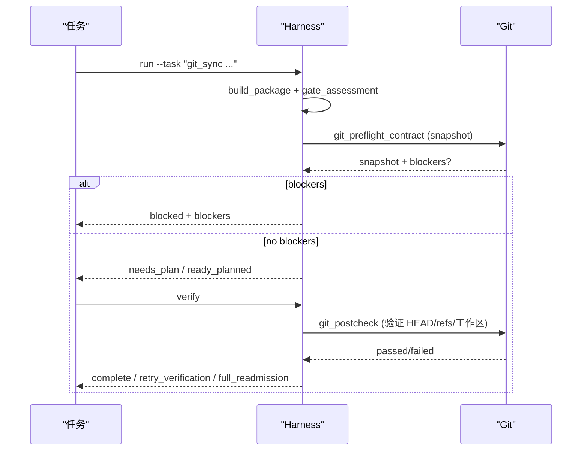
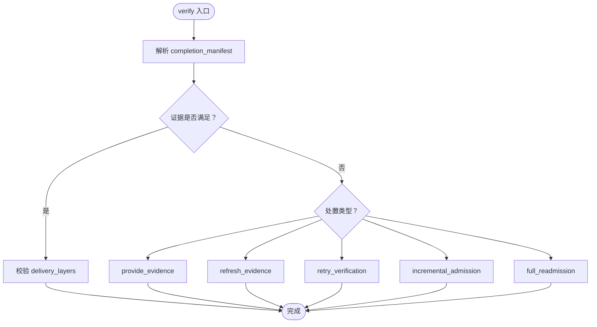
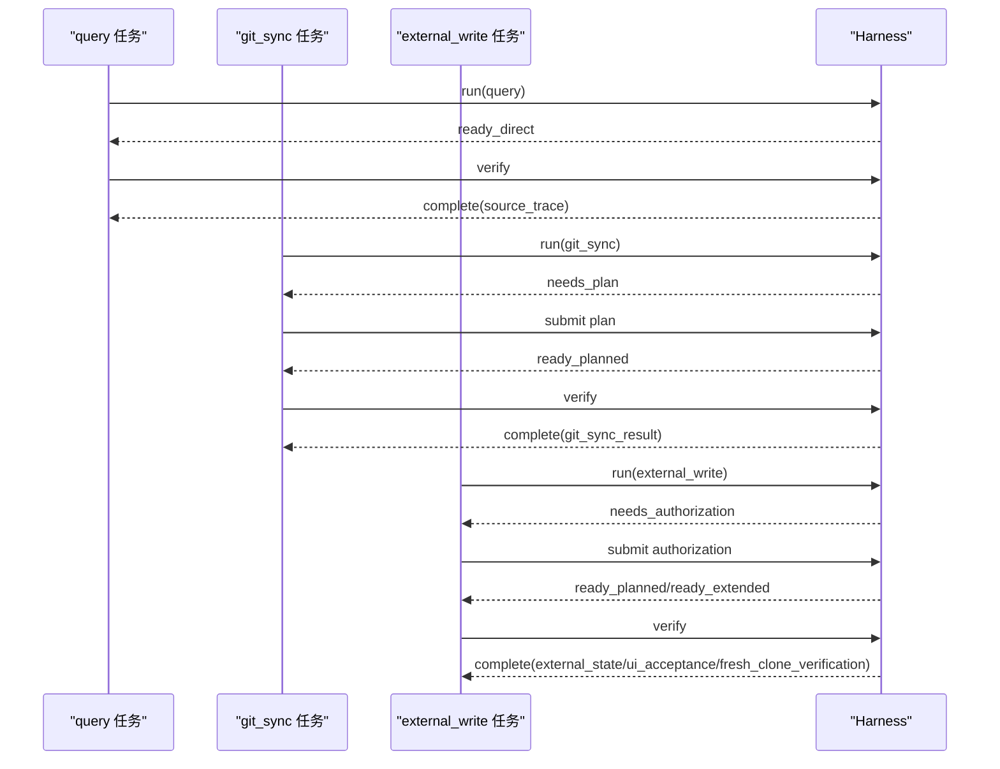
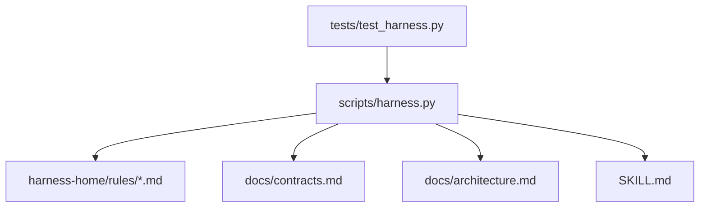

# 风险路由集成

<cite>
**本文引用的文件**   
- [scripts/harness.py](file://scripts/harness.py)
- [tests/test_harness.py](file://tests/test_harness.py)
- [harness-home/rules/INDEX.md](file://harness-home/rules/INDEX.md)
- [harness-home/rules/external-input-security.md](file://harness-home/rules/external-input-security.md)
- [harness-home/rules/release-authorization-rollback.md](file://harness-home/rules/release-authorization-rollback.md)
- [docs/contracts.md](file://docs/contracts.md)
- [docs/architecture.md](file://docs/architecture.md)
- [SKILL.md](file://SKILL.md)
</cite>

## 目录
1. [引言](#引言)
2. [项目结构](#项目结构)
3. [核心组件](#核心组件)
4. [架构总览](#架构总览)
5. [详细组件分析](#详细组件分析)
6. [依赖关系分析](#依赖关系分析)
7. [性能考量](#性能考量)
8. [故障排查指南](#故障排查指南)
9. [结论](#结论)
10. [附录](#附录)

## 引言
本文件面向 Docs Harness 的风险路由集成系统，系统性阐述不同风险级别如何影响任务执行路径选择（direct、planned、extended），Gate 与任务准入状态（blocked、needs_plan、needs_authorization、ready_direct、ready_planned、ready_extended）的转换逻辑，以及 Gate 在意图编译、范围评估、授权验证等生命周期阶段的作用点。同时解释高风险 Gate 对任务路由的强制升级机制，并给出从低风险 query 到高风险 external_write 的完整工作流示例。

## 项目结构
- 控制器源码位于 scripts/harness.py，负责任务入口、意图识别、Gate 编译、读写范围、上下文、授权、证据、验收与后台治理。
- 规则集位于 harness-home/rules/，以快照形式随项目安装，按 Gate 或关键词匹配生效。
- 合同与架构说明位于 docs/contracts.md 与 docs/architecture.md，定义 v2 任务包、证据收据、Git 状态合同、完成清单与退出码等。
- SKILL.md 描述 CLI 入口、幂等复用、Gate 声明与回退策略、verify 处置与后台 Job 流程。

**图表来源** 
- [scripts/harness.py:4707-5100](file://scripts/harness.py#L4707-L5100)
- [docs/contracts.md:10-80](file://docs/contracts.md#L10-L80)

**章节来源**
- [docs/architecture.md:1-26](file://docs/architecture.md#L1-L26)
- [SKILL.md:25-57](file://SKILL.md#L25-L57)

## 核心组件
- 意图与变更面：受控 task_intent（query、audit、git_inspect、git_fetch、git_sync、modify、external_write）与 mutation_profile（read_only、git_metadata_write、workspace_write、external_write）。混合意图保留全部 candidate_intents，Gate 编译取最高变更面与最高风险 Gate。
- Gate 体系：GATE_ORDER 与 GATE_DEFS 定义产品、架构、安全、数据破坏、发布外部、前端设计、诊断修复、测试验收、审查审计、代码编辑、文档编辑等 Gate；SAFETY_FLOOR_GATES 强制安全底线（security-sensitive、destructive-data、release-external），文本触发使用精确词表与否定守卫。
- 准入状态机：blocked、needs_plan、needs_authorization、ready_direct、ready_planned、ready_extended。只读任务允许空 write_scope 不升级为 planned。
- 范围与授权：read_scope/write_scope/git_scope/external_scope 分离；authorization_requirements 决定是否需要 authorization-receipt/v2。
- 证据与验收：evidence-receipt/v2 统一类型化证据；completion_manifest 冻结收尾要求；verify 支持五级处置（provide_evidence、refresh_evidence、retry_verification、incremental_admission、full_readmission）。
- Git 状态合同：git_state_snapshot 绑定预检目标 OID 与可控 refs 命名空间；git_fetch/git_sync 分别有独立约束与后检。

**章节来源**
- [scripts/harness.py:200-233](file://scripts/harness.py#L200-L233)
- [scripts/harness.py:263-345](file://scripts/harness.py#L263-L345)
- [scripts/harness.py:384-392](file://scripts/harness.py#L384-L392)
- [docs/contracts.md:10-80](file://docs/contracts.md#L10-L80)
- [docs/contracts.md:97-133](file://docs/contracts.md#L97-L133)
- [docs/contracts.md:165-221](file://docs/contracts.md#L165-L221)

## 架构总览
下图展示 run 命令的关键调用链与 Gate 决策点：意图编译 → Gate 编译 → 范围评估 → 授权需求 → 准入状态 → 执行路线 → verify 收尾。

**图表来源** 
- [scripts/harness.py:4707-5100](file://scripts/harness.py#L4707-L5100)
- [docs/contracts.md:50-80](file://docs/contracts.md#L50-L80)

## 详细组件分析

### Gate 与准入状态转换
- 意图优先：先确定 task_intent 与 mutation_profile，再按 GATE_ORDER 匹配 Gate；显式 gate_assessment 可权威声明 Gate，但安全底线不可豁免。
- 范围驱动：read_scope 仅用于事实读取；write_scope 为空时不自动升级 planned；git_scope 控制远端引用操作；external_scope 控制外部写入。
- 授权门控：当 authorization_requirements 非空且未提供有效 authorization-receipt/v2，则进入 needs_authorization；通过后根据 execution_route 决定 ready_planned 或 ready_extended。
- 状态转换要点：
  - blocked：预检失败（如 git_sync 脏工作区、非 fast-forward、LFS/Submodule 不可用）、范围非法、规则指纹漂移、新增高风险 Gate 等。
  - needs_plan：缺少 plan_fields 或范围扩展导致新增 Gate 需补充计划字段；支持 plan_delta_contract 增量补全。
  - needs_authorization：存在授权需求但未提交授权收据。
  - ready_direct：无方案与授权需求，直接执行。
  - ready_planned：已冻结方案且无额外授权需求。
  - ready_extended：需要工作包编排或扩展上下文。

**图表来源** 
- [scripts/harness.py:4707-5100](file://scripts/harness.py#L4707-L5100)
- [docs/contracts.md:50-80](file://docs/contracts.md#L50-L80)

**章节来源**
- [scripts/harness.py:263-345](file://scripts/harness.py#L263-L345)
- [scripts/harness.py:384-392](file://scripts/harness.py#L384-L392)
- [docs/contracts.md:10-80](file://docs/contracts.md#L10-L80)

### 风险 Gate 的定义与规则映射
- Gate 定义包含 terms（关键词）、facts（事实来源）、plan_fields（方案字段）、authorization（授权类型）、evidence（证据类型）。
- 规则文件通过 gates 字段与 Gate 关联，例如 DH-EXTERNAL-INPUT-SECURITY 对应 security-sensitive，DH-RELEASE-AUTHORIZATION-ROLLBACK 对应 release-external。
- 规则激活条件：status: active、ID 唯一、正文指纹正确、合同字段完整。

**图表来源** 
- [scripts/harness.py:276-345](file://scripts/harness.py#L276-L345)
- [harness-home/rules/external-input-security.md:1-29](file://harness-home/rules/external-input-security.md#L1-L29)
- [harness-home/rules/release-authorization-rollback.md:1-29](file://harness-home/rules/release-authorization-rollback.md#L1-L29)
- [harness-home/rules/INDEX.md:1-41](file://harness-home/rules/INDEX.md#L1-L41)

**章节来源**
- [harness-home/rules/INDEX.md:1-41](file://harness-home/rules/INDEX.md#L1-L41)
- [harness-home/rules/external-input-security.md:1-29](file://harness-home/rules/external-input-security.md#L1-L29)
- [harness-home/rules/release-authorization-rollback.md:1-29](file://harness-home/rules/release-authorization-rollback.md#L1-L29)

### Git 操作与 Gate 交互
- git_inspect：只读，不要求逐文件写入范围，默认 direct。
- git_fetch：元数据写入，绑定 git_state_snapshot，限制 controlled_refs_namespace 内变化，默认 direct。
- git_sync：工作区写入，自动生成变更范围，默认 planned；预检失败（脏工作区、非 fast-forward、远端漂移、删除阈值、LFS/Submodule 不可用）将 blocked。

**图表来源** 
- [scripts/harness.py:680-794](file://scripts/harness.py#L680-L794)
- [docs/contracts.md:97-133](file://docs/contracts.md#L97-L133)

**章节来源**
- [tests/test_harness.py:597-735](file://tests/test_harness.py#L597-L735)
- [docs/contracts.md:97-133](file://docs/contracts.md#L97-L133)

### 证据与完成清单
- evidence-receipt/v2：绑定 task_id、target_identity、package_fingerprint、producer、command_argv_digest、cwd、时间戳、exit_code、digest、read_set/write_set。
- completion_manifest：冻结 required_evidence_types、required_receipts、conditional_reviews/evidence、verification_commands、completion_blockers。
- verify 五级处置：provide_evidence、refresh_evidence、retry_verification、incremental_admission、full_readmission。

**图表来源** 
- [docs/contracts.md:165-221](file://docs/contracts.md#L165-L221)
- [docs/contracts.md:50-80](file://docs/contracts.md#L50-L80)

**章节来源**
- [docs/contracts.md:165-221](file://docs/contracts.md#L165-L221)
- [docs/contracts.md:50-80](file://docs/contracts.md#L50-L80)

### 高风险 Gate 的强制升级机制
- SAFETY_FLOOR_GATES（security-sensitive、destructive-data、release-external）由控制器按任务文本与路径确定性强制并入，宿主只能加不能减。
- 文本触发使用专用精确词表与否定守卫（如“不要部署”“删除注释”不命中）。
- 被强制并入的 Gate 记录在 gate_decision.floor_added，确保审计可追溯。
- 中途实际变更命中新路径 Gate 时，绊线与重新准入不受声明影响。

**章节来源**
- [scripts/harness.py:384-392](file://scripts/harness.py#L384-L392)
- [docs/contracts.md:44-46](file://docs/contracts.md#L44-L46)

### 工作流示例：从 query 到 external_write
- 低风险 query：
  - 意图：query，变更面：read_only，路线：direct。
  - Gate：通常不命中高风险 Gate；admission_status=ready_direct。
  - 执行：load_action_context 或直接 execute；verify 仅需 source_trace。
- 中风险 git_sync：
  - 意图：git_sync，变更面：workspace_write，路线：planned。
  - Gate：可能命中 code-edit/testing-acceptance；admission_status=needs_plan。
  - 执行：冻结方案后 ready_planned；verify 校验 git_state_snapshot 与变更范围。
- 高风险 external_write：
  - 意图：external_write，变更面：external_write，路线：至少 planned。
  - Gate：release-external/security-sensitive 强制；admission_status=needs_authorization。
  - 执行：提交 authorization-receipt/v2 后进入 ready_planned/ready_extended；verify 要求 external_state/ui_acceptance/fresh_clone_verification 等分层证据。

**图表来源** 
- [tests/test_harness.py:429-448](file://tests/test_harness.py#L429-L448)
- [tests/test_harness.py:597-684](file://tests/test_harness.py#L597-L684)
- [docs/contracts.md:10-80](file://docs/contracts.md#L10-L80)

**章节来源**
- [tests/test_harness.py:429-448](file://tests/test_harness.py#L429-L448)
- [tests/test_harness.py:597-684](file://tests/test_harness.py#L597-L684)
- [docs/contracts.md:10-80](file://docs/contracts.md#L10-L80)

## 依赖关系分析
- 控制器依赖：
  - 规则索引与具体规则文件（gates 字段关联）。
  - 合同定义（task-package/v2、evidence-receipt/v2、background-job/v2、project-config/v4）。
  - Git 工具（preflight/postcheck、refs 快照、LFS/Submodule 可用性）。
- 测试依赖：
  - 覆盖只读查询、Git 操作、漂移归因、证据复用、准入状态转换等关键路径。

**图表来源** 
- [scripts/harness.py:1-100](file://scripts/harness.py#L1-L100)
- [harness-home/rules/INDEX.md:1-41](file://harness-home/rules/INDEX.md#L1-L41)
- [docs/contracts.md:1-370](file://docs/contracts.md#L1-L370)
- [docs/architecture.md:1-26](file://docs/architecture.md#L1-L26)
- [SKILL.md:1-105](file://SKILL.md#L1-L105)
- [tests/test_harness.py:1-800](file://tests/test_harness.py#L1-L800)

**章节来源**
- [scripts/harness.py:1-100](file://scripts/harness.py#L1-L100)
- [tests/test_harness.py:1-800](file://tests/test_harness.py#L1-L800)

## 性能考量
- 幂等复用：同一 target、任务文本、事实与工作区快照重复 run 时返回 active_task_reused，避免重复建立上下文与授权。
- 上下文收据复用：content_set_fingerprint 限定同一 task/target/stage/compiler contract，减少重复加载。
- 验证命令缓存：verification.command_cache_enabled=false 可整体关闭；输入不变且上次通过的命令直接复用收据。
- Git 预检/后检：锁定 controlled_refs_namespace，避免无关变化干扰；远端漂移触发增量重新准入而非全量重跑。

[本节为通用指导，不直接分析具体文件]

## 故障排查指南
- blocked：检查 blockers 列表（脏工作区、非 fast-forward、LFS/Submodule 不可用、范围非法、新增高风险 Gate）。
- needs_plan：确认 plan_fields 是否完整；若范围扩展新增 Gate，使用 plan_delta_contract 增量补全。
- needs_authorization：提交有效的 authorization-receipt/v2，确保 producer 可信、package_fingerprint 绑定当前包。
- verify 失败：根据处置类型处理（provide_evidence 补证、refresh_evidence 刷新基线、retry_verification 重跑命令、incremental_admission 追加普通 Gate、full_readmission 范围/高风险变化）。
- Git 漂移：重新 run --task-id 进行 readmission，继承已冻结方案（合同除范围外未变时复用 plan_ref）。

**章节来源**
- [docs/contracts.md:153-163](file://docs/contracts.md#L153-L163)
- [scripts/harness.py:4707-5100](file://scripts/harness.py#L4707-L5100)

## 结论
Docs Harness 的风险路由集成以意图优先、Gate 后置为核心，通过严格的范围与授权门控，确保低开销只读任务稳定走 direct 路线，而高风险操作必须经过 planned/extended 路线与分层证据验收。安全底线 Gate 不可豁免，中途变更触发重新准入，保障任务生命周期的可控性与可审计性。

[本节为总结，不直接分析具体文件]

## 附录
- CLI 入口：run、context、verify、background、ledger 等命令的使用与退出码含义。
- 后台治理：background_direct、background_goal、background_goal_phased 的执行序列与工件管理。
- 质量账本：仅在用户明确要求时记录，读取历史按任务编号或关键词检索。

**章节来源**
- [SKILL.md:59-105](file://SKILL.md#L59-L105)
- [docs/contracts.md:303-348](file://docs/contracts.md#L303-L348)