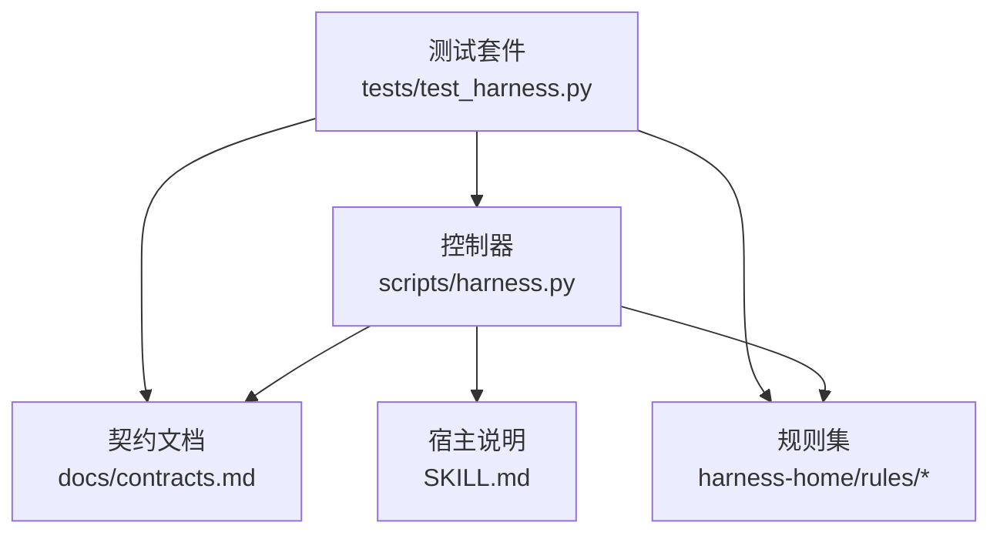
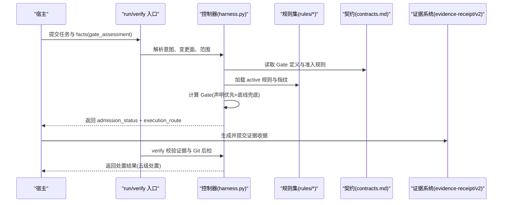
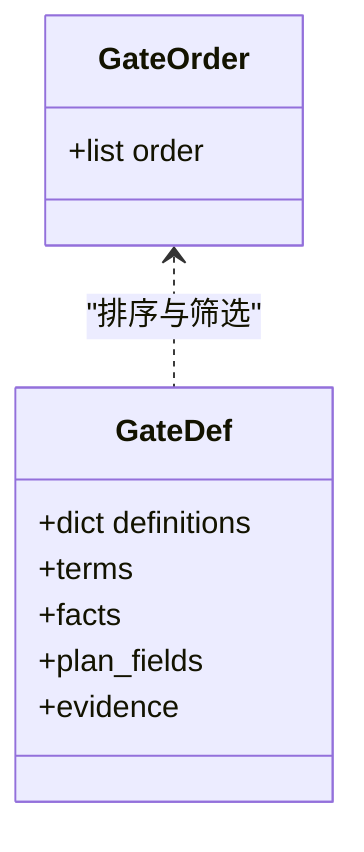
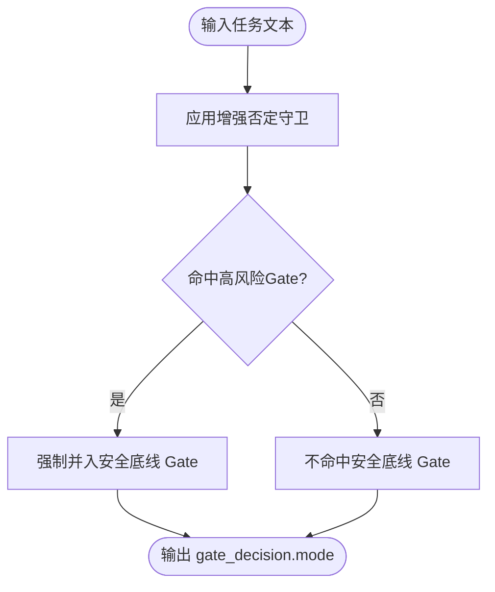
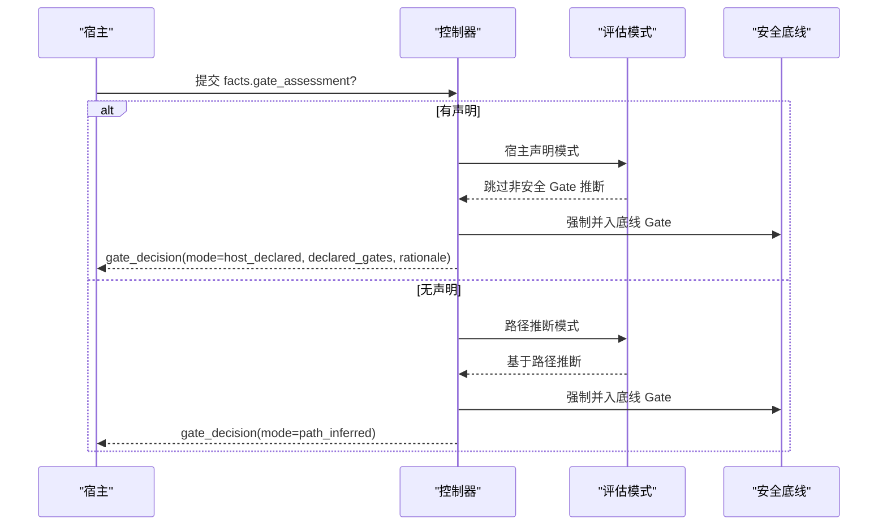
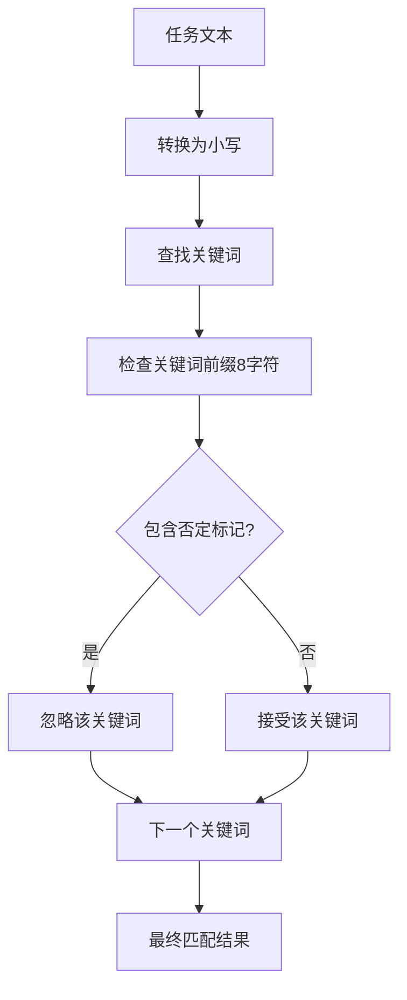
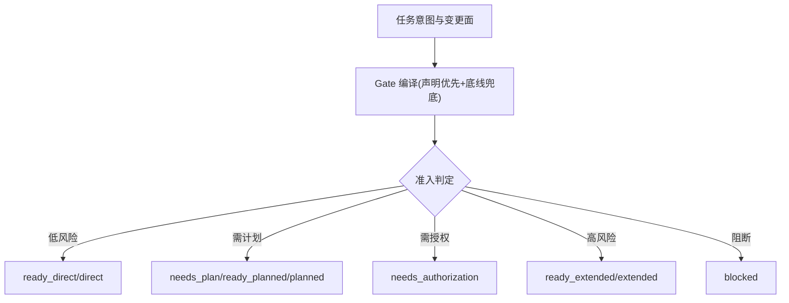
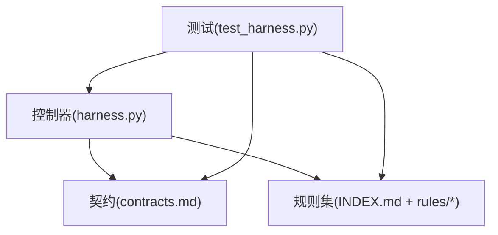

# 风险门控系统

<cite>
**本文引用的文件**   
- [scripts/harness.py](file://scripts/harness.py)
- [SKILL.md](file://SKILL.md)
- [docs/contracts.md](file://docs/contracts.md)
- [harness-home/rules/INDEX.md](file://harness-home/rules/INDEX.md)
- [harness-home/rules/external-input-security.md](file://harness-home/rules/external-input-security.md)
- [harness-home/rules/release-authorization-rollback.md](file://harness-home/rules/release-authorization-rollback.md)
- [tests/test_harness.py](file://tests/test_harness.py)
</cite>

## 更新摘要
**所做更改**   
- 简化了安全底线逻辑，移除了单独的 SAFETY_FLOOR_GATES 和 FLOOR_TERMS，统一使用 HIGH_RISK_GATE_NAMES
- 增强了否定守卫系统，通过 _keyword_not_negated() 和 delivery_requirement_matches() 函数提高上下文感知能力
- 更新了Gate决策结构，移除了 floor_added 字段，mode 使用 path_inferred 替代 keyword_inferred
- 改进了任务文本关键词不再参与Gate分类的机制

## 目录
1. [引言](#引言)
2. [项目结构](#项目结构)
3. [核心组件](#核心组件)
4. [架构总览](#架构总览)
5. [详细组件分析](#详细组件分析)
6. [依赖关系分析](#依赖关系分析)
7. [性能与可观测性](#性能与可观测性)
8. [故障排查指南](#故障排查指南)
9. [结论](#结论)
10. [附录：风险评估示例与自定义规则开发指南](#附录：风险评估示例与自定义规则开发指南)

## 引言
本文件面向 Docs Harness 的风险门控系统，系统性阐述多层风险防护机制、Gate 决策模式（路径推断与宿主声明）、风险门控与任务路由的关系、Gate 评估的权威语义判断机制（gate_assessment 字段与安全底线 Gate 强制并入逻辑），并提供风险评估示例与自定义规则开发指南。目标是帮助读者在不深入源码的情况下，也能准确理解并正确使用风险门控能力。

**更新** 简化了安全底线逻辑，移除了单独的 SAFETY_FLOOR_GATES 和 FLOOR_TERMS，统一使用 HIGH_RISK_GATE_NAMES；增强了否定守卫系统的上下文感知能力；更新了Gate决策结构以支持更精确的模式识别。

## 项目结构
Docs Harness 的风险门控由控制器脚本、契约文档、规则集与测试用例共同构成：
- 控制器脚本 scripts/harness.py：实现 Gate 定义、安全底线、评估流程、任务路由与证据校验等核心逻辑。
- 契约文档 docs/contracts.md：描述 task-package/v2、准入状态、Git 状态合同、证据收据、验证命令与验收层等规范。
- 规则集 harness-home/rules/*：以 Markdown 形式声明 active 规则及其触发的 Gate、关键词、方案字段、证据类型与失败处理策略。
- SKILL.md：面向宿主的运行说明，包括 run/verify 入口、gate_assessment 提交方式、幂等复用与背景治理等。
- tests/test_harness.py：覆盖关键路径与边界行为，用于回归与自测。



**图表来源**
- [scripts/harness.py:1-120](file://scripts/harness.py#L1-L120)
- [docs/contracts.md:1-200](file://docs/contracts.md#L1-L200)
- [harness-home/rules/INDEX.md:1-41](file://harness-home/rules/INDEX.md#L1-L41)
- [SKILL.md:1-105](file://SKILL.md#L1-L105)
- [tests/test_harness.py:1-120](file://tests/test_harness.py#L1-L120)

**章节来源**
- [scripts/harness.py:1-120](file://scripts/harness.py#L1-L120)
- [docs/contracts.md:1-200](file://docs/contracts.md#L1-L200)
- [harness-home/rules/INDEX.md:1-41](file://harness-home/rules/INDEX.md#L1-L41)
- [SKILL.md:1-105](file://SKILL.md#L1-L105)
- [tests/test_harness.py:1-120](file://tests/test_harness.py#L1-L120)

## 核心组件
- Gate 定义与顺序：GATE_ORDER 与 GATE_DEFS 定义了 Gate 种类、匹配术语、事实引用、方案字段与证据类型；顺序决定优先级与编译次序。
- **简化后的** 安全底线 Gate：HIGH_RISK_GATE_NAMES 固定为 security-sensitive、destructive-data、release-external；使用增强的否定守卫机制进行确定性触发，不可被宿主声明豁免。
- **更新的** Gate 评估模式：支持"路径推断"和"宿主声明"两种模式。未提供 gate_assessment 时回退路径推断；提供后跳过非安全 Gate 的关键词与 scope 路径推断，最终 Gate = 声明集合 ∪ 旧 gates 字段 ∪ 安全底线兜底。
- 准入与路由：根据意图、变更面与 Gate 组合确定 admission_status（blocked/needs_plan/needs_authorization/ready_direct/ready_planned/ready_extended）与 execution_route（direct/planned/extended）。
- 证据与验收：不同 Gate 要求特定证据类型（如 security_acceptance、recovery_acceptance、external_state、test_result 等），verify 阶段按五级处置策略处理漂移与失败。

**章节来源**
- [scripts/harness.py:260-389](file://scripts/harness.py#L260-L389)
- [docs/contracts.md:1-200](file://docs/contracts.md#L1-L200)
- [SKILL.md:37-44](file://SKILL.md#L37-L44)

## 架构总览
下图展示风险门控在任务生命周期中的位置与交互：



**图表来源**
- [scripts/harness.py:2596-2773](file://scripts/harness.py#L2596-L2773)
- [docs/contracts.md:1-200](file://docs/contracts.md#L1-L200)
- [harness-home/rules/INDEX.md:1-41](file://harness-home/rules/INDEX.md#L1-L41)

## 详细组件分析

### Gate 定义与顺序
- GATE_ORDER 规定了 Gate 的优先级顺序，确保高风险 Gate 先于普通编辑类 Gate 参与编译。
- GATE_DEFS 为每个 Gate 配置术语、事实引用、方案字段与证据类型，形成 Gate 到知识上下文与验收要求的映射。



**图表来源**
- [scripts/harness.py:260-342](file://scripts/harness.py#L260-L342)

**章节来源**
- [scripts/harness.py:260-342](file://scripts/harness.py#L260-L342)

### 简化后的安全底线 Gate 机制
- **更新** HIGH_RISK_GATE_NAMES 固定包含 security-sensitive、destructive-data、release-external。
- **增强** 否定守卫机制：通过 _keyword_not_negated() 和 delivery_requirement_matches() 函数提供更精确的上下文感知，避免误报。
- 安全底线 Gate 由控制器代码强制并入，宿主只能加不能减；漏判会记录在 gate_decision.mode 中。



**图表来源**
- [scripts/harness.py:376-377](file://scripts/harness.py#L376-L377)
- [scripts/harness.py:2508-2527](file://scripts/harness.py#L2508-L2527)

**章节来源**
- [scripts/harness.py:376-377](file://scripts/harness.py#L376-L377)
- [scripts/harness.py:2508-2527](file://scripts/harness.py#L2508-L2527)

### Gate 评估模式：路径推断 vs 宿主声明
- **更新** 路径推断模式：未提供 gate_assessment 时，基于任务文本与 scope 路径推断 Gate，记录 mode=path_inferred。
- **更新** 宿主声明模式：提供 gate_assessment.gates 与 rationale，跳过非安全 Gate 的关键词与路径推断；最终 Gate = 声明集合 ∪ 旧 gates 字段 ∪ 安全底线兜底。
- **更新** gate_decision.mode 记录模式（path_inferred 或 host_declared），declared_gates 与 rationale 审计留痕。



**图表来源**
- [docs/contracts.md:42-46](file://docs/contracts.md#L42-L46)
- [scripts/harness.py:3230-3250](file://scripts/harness.py#L3230-L3250)

**章节来源**
- [docs/contracts.md:42-46](file://docs/contracts.md#L42-L46)
- [scripts/harness.py:3230-3250](file://scripts/harness.py#L3230-L3250)

### 增强的否定守卫系统
- **新增** _keyword_not_negated() 函数：提供上下文感知的关键词否定检测，检查关键词前8个字符内是否包含否定标记。
- **新增** delivery_requirement_matches() 函数：带否定守卫的交付层需求匹配，防止"不推送""无需部署"等场景误触发远端交付要求。
- **改进** 任务文本关键词不再参与Gate分类，避免误报。



**图表来源**
- [scripts/harness.py:2508-2527](file://scripts/harness.py#L2508-L2527)

**章节来源**
- [scripts/harness.py:2508-2527](file://scripts/harness.py#L2508-L2527)

### 风险门控与任务路由的关系
- 意图与变更面：query/audit/git_inspect/git_fetch/git_sync/modify/external_write 对应 read_only/git_metadata_write/workspace_write/external_write 变更面。
- Gate 影响准入状态与执行路线：
  - ready_direct：低风险只读或受控操作可直接执行。
  - needs_plan/needs_authorization：需要计划或授权。
  - ready_planned/ready_extended：中高风险需计划或扩展流程。
  - blocked：存在阻断条件（如范围越界、证据缺失、Git 预检失败）。
- 混合意图保留全部 candidate_intents，未来子句进入 deferred_intents，完成体仅作为审查上下文；Gate 编译取当前任务最高变更面与风险结果。



**图表来源**
- [docs/contracts.md:1-200](file://docs/contracts.md#L1-L200)
- [scripts/harness.py:212-230](file://scripts/harness.py#L212-L230)

**章节来源**
- [docs/contracts.md:1-200](file://docs/contracts.md#L1-L200)
- [scripts/harness.py:212-230](file://scripts/harness.py#L212-L230)

### Gate 评估的权威语义判断机制
- **更新** gate_assessment 字段作用：宿主对 Gate 做权威语义判断，声明即全部，简单任务不会被拖入重流程。
- **简化** 安全底线 Gate 的强制并入逻辑：security-sensitive、destructive-data、release-external 由控制器代码强制并入，宿主不可豁免；使用增强的否定守卫避免误报。
- **更新** 审计留痕：gate_decision 记录 mode、declared_gates、rationale，供后续审计与回溯。

**章节来源**
- [SKILL.md:37-44](file://SKILL.md#L37-L44)
- [docs/contracts.md:42-46](file://docs/contracts.md#L42-L46)
- [scripts/harness.py:3230-3250](file://scripts/harness.py#L3230-L3250)

### 规则集与 Gate 绑定
- INDEX.md 维护 active 规则清单与指纹，运行时不得依赖源码目录绝对路径，安装快照必须完整且指纹一致。
- 外部输入安全规则（DH-EXTERNAL-INPUT-SECURITY）绑定 security-sensitive Gate，要求安全边界、负向路径与验收证据。
- 发布授权与回滚规则（DH-RELEASE-AUTHORIZATION-ROLLBACK）绑定 release-external Gate，要求外部目标、产物身份、授权范围与回滚能力。

**章节来源**
- [harness-home/rules/INDEX.md:1-41](file://harness-home/rules/INDEX.md#L1-L41)
- [harness-home/rules/external-input-security.md:1-29](file://harness-home/rules/external-input-security.md#L1-L29)
- [harness-home/rules/release-authorization-rollback.md:1-29](file://harness-home/rules/release-authorization-rollback.md#L1-L29)

## 依赖关系分析
- 控制器依赖契约文档定义的数据结构与验收层，确保 Gate、证据与 Git 状态的一致性。
- 规则集通过 INDEX.md 与内容指纹约束，保证规则完整性与一致性。
- 测试套件覆盖关键路径（如 git_fetch/git_sync、negated write、read-only security audit），保障 Gate 与路由的正确性。



**图表来源**
- [scripts/harness.py:1-120](file://scripts/harness.py#L1-L120)
- [docs/contracts.md:1-200](file://docs/contracts.md#L1-L200)
- [harness-home/rules/INDEX.md:1-41](file://harness-home/rules/INDEX.md#L1-L41)
- [tests/test_harness.py:1-120](file://tests/test_harness.py#L1-L120)

**章节来源**
- [scripts/harness.py:1-120](file://scripts/harness.py#L1-L120)
- [docs/contracts.md:1-200](file://docs/contracts.md#L1-L200)
- [harness-home/rules/INDEX.md:1-41](file://harness-home/rules/INDEX.md#L1-L41)
- [tests/test_harness.py:1-120](file://tests/test_harness.py#L1-L120)

## 性能与可观测性
- Gate 编译前置：在 run 早期完成 Gate 推断，减少后续重复计算。
- 幂等复用：同一 target、任务文本、事实与工作区快照命中活动任务时直接复用，避免重复建立上下文与授权。
- 证据缓存：已通过的验证命令带逐项收据复用，仅失败或输入变化时重跑。
- 可观测性：gate_decision、delivery_layers、known_limit_codes 等字段提供审计与诊断依据。

**章节来源**
- [SKILL.md:25-56](file://SKILL.md#L25-L56)
- [docs/contracts.md:1-200](file://docs/contracts.md#L1-L200)

## 故障排查指南
- 常见阻断原因：
  - 范围越界或自然语言边界伪装成路径：返回 invalid_scope_description。
  - Git 预检失败：脏工作区、非 fast-forward、LFS/Submodule 不可用等。
  - 证据缺失或过期：需补证或刷新证据。
  - 远端漂移或 ref 越界：触发 full_readmission。
- 处置策略：
  - provide_evidence：补归因收据。
  - refresh_evidence：失效引用漂移路径的证据后重读。
  - retry_verification：验证命令失败重试。
  - incremental_admission：仅追加普通 Gate 且合同不变。
  - full_readmission：范围、高风险合同或规则变化。

**章节来源**
- [docs/contracts.md:134-200](file://docs/contracts.md#L134-L200)
- [tests/test_harness.py:685-757](file://tests/test_harness.py#L685-L757)

## 结论
Docs Harness 的风险门控系统通过简化的安全底线逻辑、增强的否定守卫机制、宿主权威声明与严格的证据验收，构建了多层次、可审计、可扩展的风险防护体系。结合任务路由与准入状态，能够有效区分低风险快速通道与高风险严格流程，确保交付质量与安全底线。

**更新** 简化后的安全底线逻辑和增强的否定守卫机制进一步提升了系统的准确性和可靠性，同时保持了安全底线的强制保护。

## 附录：风险评估示例与自定义规则开发指南

### 风险评估示例
- **更新** 安全敏感（security-sensitive）：涉及鉴权、权限、密钥、隐私数据或外部输入解析的任务，需提供安全边界、负向路径与 security_acceptance 证据。
- **更新** 数据破坏（destructive-data）：涉及删除、清空、覆盖、迁移数据的任务，需提供影响范围、备份与恢复策略及 recovery_acceptance 证据。
- **更新** 外部发布（release-external）：涉及发布、上线、部署、推送的任务，需冻结外部目标、产物身份、授权范围与回滚路径，并提供 external_state 证据。

**章节来源**
- [harness-home/rules/external-input-security.md:1-29](file://harness-home/rules/external-input-security.md#L1-L29)
- [harness-home/rules/release-authorization-rollback.md:1-29](file://harness-home/rules/release-authorization-rollback.md#L1-L29)
- [scripts/harness.py:273-342](file://scripts/harness.py#L273-L342)

### 自定义规则开发指南
- 规则文件结构：遵循 _rule-template.md 的 YAML 头与正文结构，声明 status、rule_id、content_fingerprint、gates、keywords、plan_fields、evidence_types、failure_mode。
- 激活条件：规则必须 status: active、ID 唯一、正文指纹正确且合同字段完整，才能进入任务包。
- 安装与升级：项目安装时复制固定规则快照，并在配置中记录逐文件指纹；规则缺失、增加或变化均失败关闭，需通过来源包升级或人工 preserve-and-merge。

**章节来源**
- [harness-home/rules/_rule-template.md:1-21](file://harness-home/rules/_rule-template.md#L1-L21)
- [harness-home/rules/INDEX.md:34-41](file://harness-home/rules/INDEX.md#L34-L41)

### Gate评估模式示例
- **更新** 宿主声明模式示例：
  ```json
  {
    "gate_assessment": {
      "gates": ["code-edit"],
      "rationale": "单文件空指针修复，不涉及接口契约、安全与发布"
    }
  }
  ```
- **更新** 路径推断模式：当不提供gate_assessment时，系统自动基于路径推断Gate，记录mode=path_inferred。
- **简化** 安全底线强制并入：即使宿主声明了其他Gate，security-sensitive、destructive-data、release-external仍会被强制并入。

### 增强的否定守卫示例
- **改进** 上下文感知的否定检测：
  - "推送到远端" → 触发 release-external
  - "清空缓存目录" → 触发 destructive-data  
  - "改造鉴权流程" → 触发 security-sensitive
- **增强** 否定守卫避免误报：
  - "修改文案，先不部署" → 不触发任何底线Gate
  - "修复样式，不要推送到远端" → 不触发 release-external
  - "删除冗余注释和死代码" → 不触发 destructive-data
- **改进** 任务文本关键词不再参与Gate分类，避免误报。

**章节来源**
- [tests/test_harness.py:7723-7740](file://tests/test_harness.py#L7723-L7740)
- [scripts/harness.py:2508-2527](file://scripts/harness.py#L2508-L2527)
- [scripts/harness.py:376-377](file://scripts/harness.py#L376-L377)