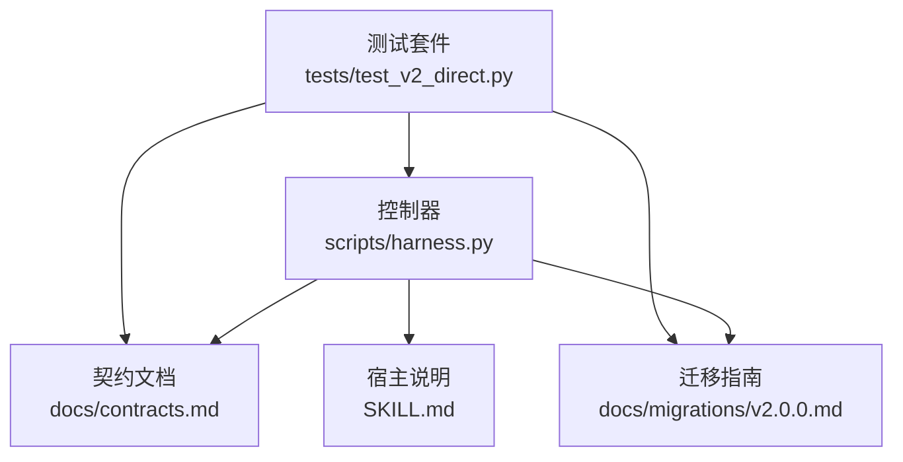
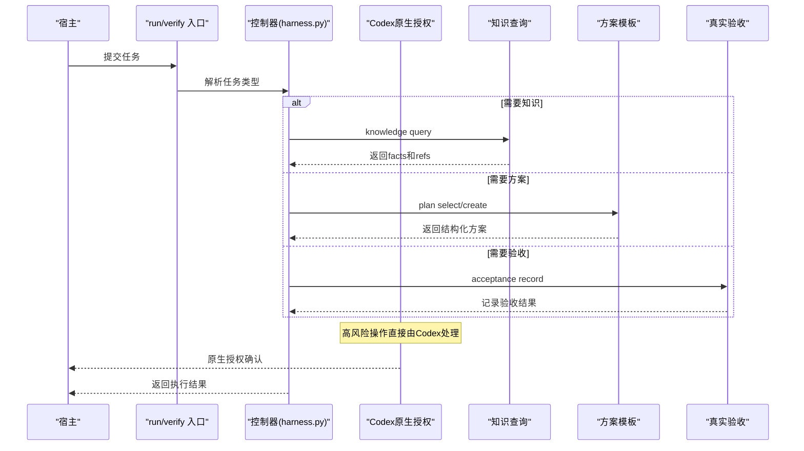
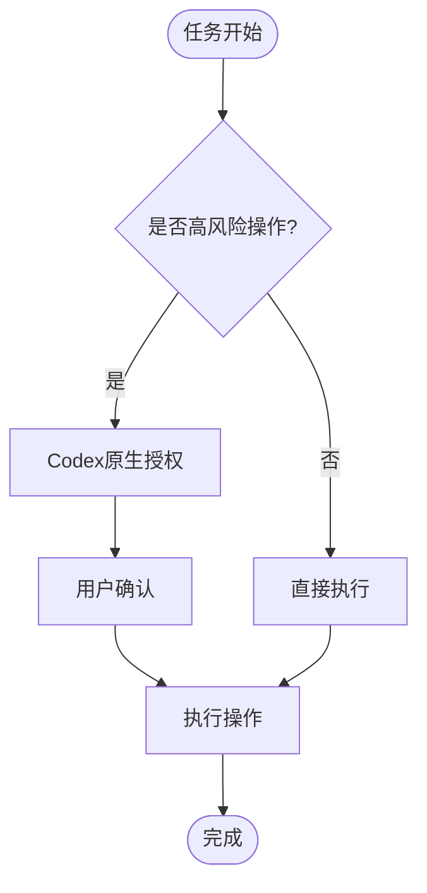
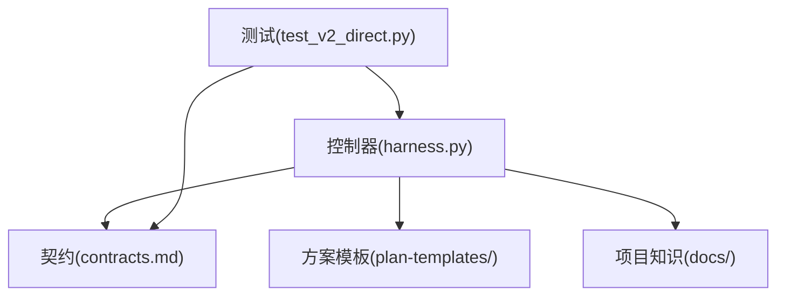

# 风险门控系统

<cite>
**本文引用的文件**   
- [scripts/harness.py](file://scripts/harness.py)
- [SKILL.md](file://SKILL.md)
- [docs/contracts.md](file://docs/contracts.md)
- [docs/migrations/v2.0.0.md](file://docs/migrations/v2.0.0.md)
- [tests/test_v2_direct.py](file://tests/test_v2_direct.py)
</cite>

## 更新摘要
**所做更改**   
- **重大变更**：完全移除了风险门控系统作为v2.0.0迁移的一部分
- 高风险操作现在使用Codex原生授权机制，不再通过Harness Gate决策
- 删除了所有Gate相关的命令、配置和实现逻辑
- 简化为直接执行模式，高风险动作由Codex原生安全层处理
- 更新了架构说明以反映新的授权边界和风险控制策略

## 目录
1. [引言](#引言)
2. [项目结构](#项目结构)
3. [核心组件](#核心组件)
4. [架构总览](#架构总览)
5. [详细组件分析](#详细组件分析)
6. [依赖关系分析](#依赖关系分析)
7. [性能与可观测性](#性能与可观测性)
8. [故障排查指南](#故障排查指南)
9. [结论](#结论)
10. [附录：风险评估示例与自定义规则开发指南](#附录：风险评估示例与自定义规则开发指南)

## 引言
**重要更新**：Docs Harness 2.0.0已完全移除风险门控系统。在v2.0.0迁移中，高风险操作（如Git写入、删除、发布、安装和外部系统写入）现在完全使用Codex原生授权与沙箱机制，不再通过Harness的Gate决策流程。

本文件现在主要记录迁移后的新架构，解释为什么移除Gate系统以及如何正确使用新的授权机制。

**更新** 完全移除了风险门控系统，高风险操作现在由Codex原生授权处理，Harness专注于知识查询、方案模板和真实验收功能。

## 项目结构
迁移后，Docs Harness 2.0.0的项目结构大幅简化：
- 控制器脚本 scripts/harness.py：仅包含knowledge query、plan select/create、acceptance record等核心功能
- 契约文档 docs/contracts.md：定义2.0.0能力合同，明确不包含Gate系统
- 迁移指南 docs/migrations/v2.0.0.md：详细说明从1.x到2.0.0的迁移过程
- SKILL.md：面向宿主的运行说明，强调默认直跑模式和授权边界
- tests/test_v2_direct.py：验证新架构的正确性和安全性

**图表来源**
- [scripts/harness.py:1-100](file://scripts/harness.py#L1-L100)
- [docs/contracts.md:1-50](file://docs/contracts.md#L1-L50)
- [docs/migrations/v2.0.0.md:1-50](file://docs/migrations/v2.0.0.md#L1-L50)
- [SKILL.md:1-50](file://SKILL.md#L1-L50)
- [tests/test_v2_direct.py:1-50](file://tests/test_v2_direct.py#L1-L50)

**章节来源**
- [scripts/harness.py:1-100](file://scripts/harness.py#L1-L100)
- [docs/contracts.md:1-50](file://docs/contracts.md#L1-L50)
- [docs/migrations/v2.0.0.md:1-50](file://docs/migrations/v2.0.0.md#L1-L50)
- [SKILL.md:1-50](file://SKILL.md#L1-L50)
- [tests/test_v2_direct.py:1-50](file://tests/test_v2_direct.py#L1-L50)

## 核心组件
迁移后的核心组件包括：
- **知识查询**：按需获取项目事实，支持范围限制和字符预算
- **方案模板**：复杂任务的结构化规划，支持不同复杂度和领域Profile
- **真实验收**：分层验收机制，从源码检查到用户确认
- **项目管理**：项目初始化、升级和卸载功能
- **授权边界**：明确的高风险操作由Codex原生处理

**更新** 移除了所有Gate相关组件，包括Gate定义、评估逻辑、路由机制和证据系统。

**章节来源**
- [scripts/harness.py:439-506](file://scripts/harness.py#L439-L506)
- [scripts/harness.py:560-696](file://scripts/harness.py#L560-L696)
- [scripts/harness.py:705-800](file://scripts/harness.py#L705-L800)

## 架构总览
下图展示迁移后的新架构，重点突出授权边界的重新设计：

**图表来源**
- [scripts/harness.py:439-506](file://scripts/harness.py#L439-L506)
- [scripts/harness.py:560-696](file://scripts/harness.py#L560-L696)
- [scripts/harness.py:705-800](file://scripts/harness.py#L705-L800)

## 详细组件分析

### 授权边界重新设计
**重大变更**：2.0.0版本完全移除了Harness的Gate系统，高风险操作的授权完全交给Codex原生机制。

- **删除的功能**：`run`、`context`、`progress`、`verify`、`task`、`background`、`authorization`命令
- **移除的配置**：`gate_path_rules`、`rules_root`、`installed_rule_fingerprints`等Gate相关配置
- **新的授权模型**：Git写入、删除、发布、安装和外部系统写入直接使用Codex原生授权与沙箱

**图表来源**
- [docs/contracts.md:100-105](file://docs/contracts.md#L100-L105)
- [SKILL.md:58-61](file://SKILL.md#L58-L61)

**章节来源**
- [docs/contracts.md:100-105](file://docs/contracts.md#L100-L105)
- [SKILL.md:58-61](file://SKILL.md#L58-L61)
- [docs/migrations/v2.0.0.md:109-118](file://docs/migrations/v2.0.0.md#L109-L118)

### 知识查询系统
迁移后的知识查询系统保持简洁和高效：
- 支持精确查询和范围限制
- 自动排除历史目录和外部符号链接
- 提供有界的事实输出，避免上下文过载
- 不创建任何状态或持久化数据

**章节来源**
- [scripts/harness.py:439-506](file://scripts/harness.py#L439-L506)
- [docs/contracts.md:19-49](file://docs/contracts.md#L19-L49)

### 方案模板系统
方案模板系统专注于复杂任务的规划：
- 支持none/brief/full三种复杂度级别
- 提供多个领域Profile适配不同场景
- 严格的字段验证和指纹保护
- 执行时只消费必要的投影信息

**章节来源**
- [scripts/harness.py:560-696](file://scripts/harness.py#L560-L696)
- [docs/contracts.md:51-75](file://docs/contracts.md#L51-L75)

### 真实验收机制
验收机制采用分层设计，确保质量保障：
- L1：源码、类型、编译或静态合同一致
- L2：聚焦行为成立
- L3：本地应用或服务真实流程成立
- L4：构建、包或安装产物成立
- L5：用户可见、权限、硬件或主观体验成立

**章节来源**
- [scripts/harness.py:705-800](file://scripts/harness.py#L705-L800)
- [docs/contracts.md:76-99](file://docs/contracts.md#L76-L99)

### 项目管理功能
项目管理功能支持完整的生命周期：
- 项目初始化：安装受管入口、控制器、方案模板和配置
- 项目升级：单向迁移，清理旧工件，保留项目内容
- 项目卸载：安全移除受管文件，保留项目文档
- 项目检查：验证安装状态和配置完整性

**章节来源**
- [docs/migrations/v2.0.0.md:24-67](file://docs/migrations/v2.0.0.md#L24-L67)
- [tests/test_v2_direct.py:330-349](file://tests/test_v2_direct.py#L330-L349)

## 依赖关系分析
迁移后的依赖关系更加清晰：
- 控制器依赖契约文档定义的数据结构
- 知识查询依赖项目文档和源码
- 方案模板依赖预定义的模板注册表
- 验收机制依赖实际的可执行文件和测试

**图表来源**
- [scripts/harness.py:1-100](file://scripts/harness.py#L1-L100)
- [docs/contracts.md:1-50](file://docs/contracts.md#L1-L50)
- [tests/test_v2_direct.py:1-50](file://tests/test_v2_direct.py#L1-L50)

**章节来源**
- [scripts/harness.py:1-100](file://scripts/harness.py#L1-L100)
- [docs/contracts.md:1-50](file://docs/contracts.md#L1-L50)
- [tests/test_v2_direct.py:1-50](file://tests/test_v2_direct.py#L1-L50)

## 性能与可观测性
迁移后的性能特征：
- **零开销**：直接模式下不产生任何Harness调用
- **按需加载**：只在必要时查询知识和生成方案
- **无状态**：不维护任务状态或长期记忆
- **有限上下文**：严格控制输入大小和复杂度

**章节来源**
- [docs/contracts.md:5-17](file://docs/contracts.md#L5-L17)
- [SKILL.md:13-18](file://SKILL.md#L13-L18)

## 故障排查指南
迁移后的常见问题：
- **旧命令不可用**：`run`、`verify`等命令已删除，需使用新功能
- **配置键不存在**：旧配置键如`gate_path_rules`不再支持
- **授权问题**：高风险操作由Codex原生处理，不在Harness范围内
- **迁移失败**：遵循迁移指南的预览和应用步骤

**章节来源**
- [docs/migrations/v2.0.0.md:109-118](file://docs/migrations/v2.0.0.md#L109-L118)
- [tests/test_v2_direct.py:110-133](file://tests/test_v2_direct.py#L110-L133)

## 结论
Docs Harness 2.0.0通过完全移除风险门控系统，实现了更简洁、更安全的设计。高风险操作现在由Codex原生授权机制处理，避免了第二套控制系统的复杂性和潜在误判。新的架构专注于知识查询、方案模板和真实验收三个核心价值点，提供了更高效、更可靠的文档辅助能力。

**更新** 完全移除了风险门控系统，采用更简洁的直接执行模式，高风险操作由Codex原生授权处理。

## 附录：风险评估示例与自定义规则开发指南

### 风险评估示例
**重要更新**：由于Gate系统已移除，以下示例主要用于理解迁移前后的差异：

- **迁移前**：涉及鉴权、权限、密钥的任务会触发security-sensitive Gate
- **迁移后**：同样的高风险操作直接由Codex原生授权处理，无需Gate判断

### 自定义规则开发指南
**重要更新**：自定义规则系统已完全移除，不再支持：
- 规则文件结构和激活条件
- 规则指纹验证和安装管理
- Gate绑定和风险评估逻辑

迁移后如需类似功能，应使用：
- 项目级配置文件
- 代码审查工具
- CI/CD流水线检查
- Codex原生授权提示

**章节来源**
- [docs/migrations/v2.0.0.md:68-95](file://docs/migrations/v2.0.0.md#L68-L95)
- [tests/test_v2_direct.py:211-233](file://tests/test_v2_direct.py#L211-L233)

### 迁移最佳实践
- **渐进式迁移**：先预览再应用，确保数据安全
- **保留项目内容**：业务文档和用户修改不会被删除
- **验证迁移结果**：使用project check和diff命令验证
- **回滚准备**：准备好工作区差异和版本控制恢复

**章节来源**
- [docs/migrations/v2.0.0.md:24-47](file://docs/migrations/v2.0.0.md#L24-L47)
- [docs/migrations/v2.0.0.md:151-171](file://docs/migrations/v2.0.0.md#L151-L171)