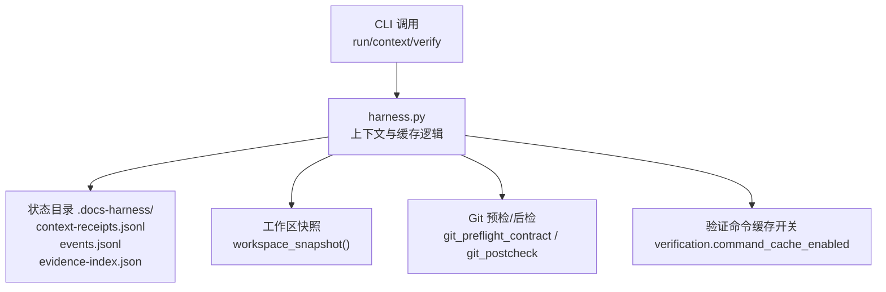
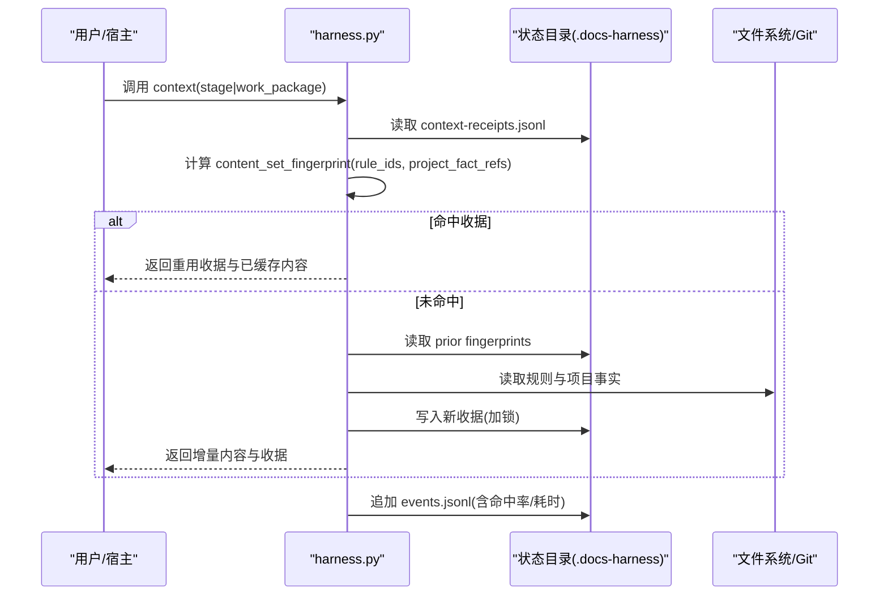
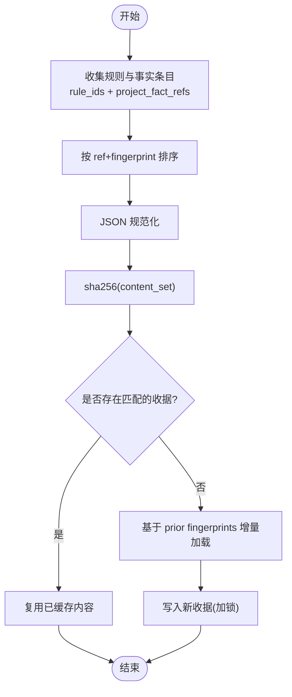
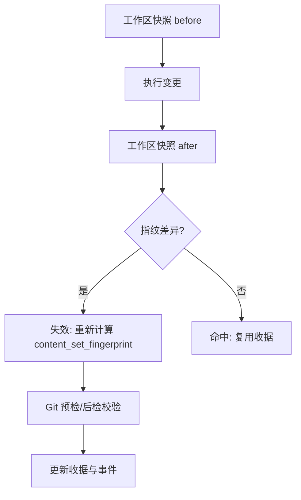
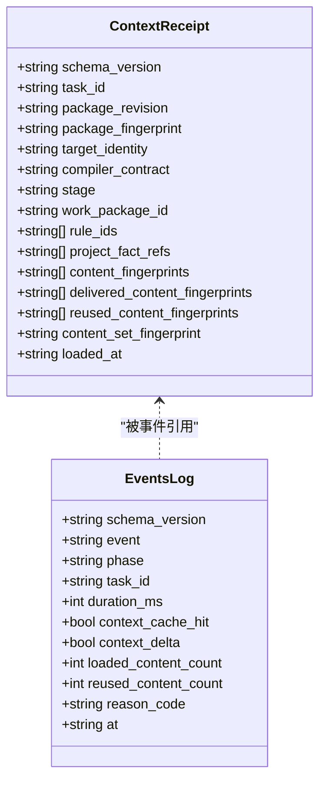
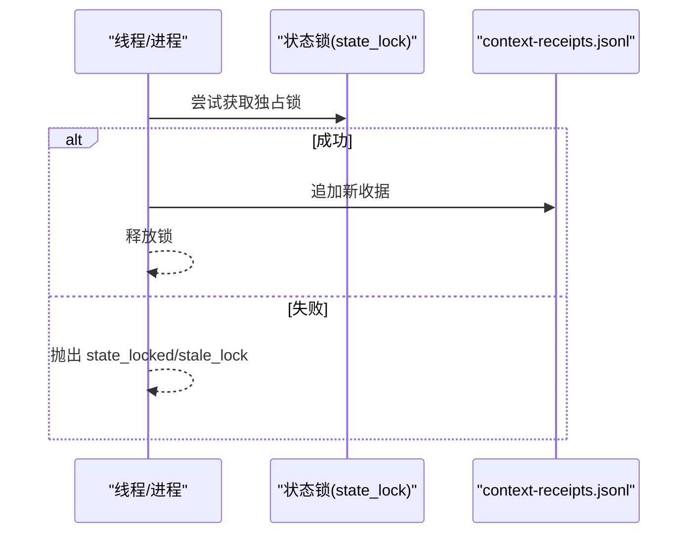
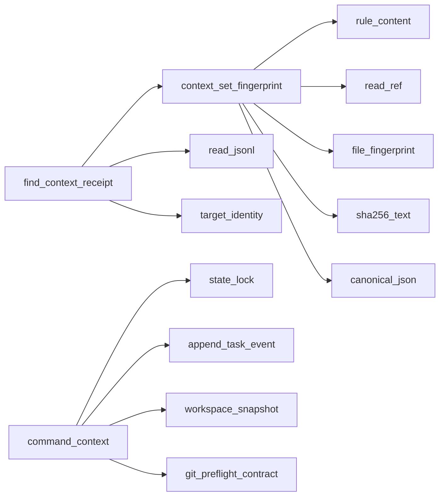

# 上下文缓存机制

<cite>
**本文引用的文件**   
- [scripts/harness.py](file://scripts/harness.py)
- [tests/test_harness.py](file://tests/test_harness.py)
- [package.json](file://package.json)
- [SKILL.md](file://SKILL.md)
- [docs/architecture.md](file://docs/architecture.md)
</cite>

## 目录
1. [简介](#简介)
2. [项目结构](#项目结构)
3. [核心组件](#核心组件)
4. [架构总览](#架构总览)
5. [详细组件分析](#详细组件分析)
6. [依赖关系分析](#依赖关系分析)
7. [性能考量](#性能考量)
8. [故障排查指南](#故障排查指南)
9. [结论](#结论)
10. [附录](#附录)

## 简介
本文件系统化阐述 Docs Harness 的“上下文缓存机制”，覆盖多级缓存设计、缓存键生成算法、失效检测、存储格式与元数据、一致性保障、性能优化、监控指标与故障恢复。该机制以任务（task）为中心，围绕规则与项目事实的“内容集指纹”进行命中判定，结合工作区快照与 Git 预检/后检，实现幂等、可审计、可回滚的上下文加载与复用。

## 项目结构
- 控制器源码位于 scripts/harness.py，集中实现上下文构建、缓存收据、事件记录、状态锁与验证命令缓存开关等能力。
- 测试用例 tests/test_harness.py 覆盖了命令缓存配置、Git 操作前置/后置校验、上下文阶段行为等关键路径。
- package.json 提供版本与脚本入口；SKILL.md 描述 CLI 使用与验收流程；docs/architecture.md 给出高层架构事实与边界。

**图表来源** 
- [scripts/harness.py:4297-4443](file://scripts/harness.py#L4297-L4443)
- [scripts/harness.py:1115-1138](file://scripts/harness.py#L1115-L1138)
- [scripts/harness.py:680-794](file://scripts/harness.py#L680-L794)
- [scripts/harness.py:1191-1201](file://scripts/harness.py#L1191-L1201)

**章节来源**
- [scripts/harness.py:4297-4443](file://scripts/harness.py#L4297-L4443)
- [tests/test_harness.py:3510-3518](file://tests/test_harness.py#L3510-L3518)
- [package.json:1-23](file://package.json#L1-L23)
- [SKILL.md:1-106](file://SKILL.md#L1-L106)
- [docs/architecture.md:1-26](file://docs/architecture.md#L1-L26)

## 核心组件
- 上下文收据（Context Receipt）：持久化于 context-receipts.jsonl，记录任务、目标身份、编译器契约、阶段、规则与项目事实引用、内容指纹集合与内容集指纹、时间戳等。
- 内容集指纹（Content Set Fingerprint）：对规则与项目事实按 ref+fingerprint 排序后序列化并哈希，作为缓存键的核心维度。
- 工作区快照（Workspace Snapshot）：对当前工作树进行轻量级指纹化，用于变更检测与一致性校验。
- 状态锁（State Lock）：基于独占文件锁保证同一任务的状态更新串行化，避免并发写冲突。
- 事件日志（Events Log）：记录上下文加载、重用、增量加载等事件，附带耗时与命中率等指标。
- 验证命令缓存开关：通过项目配置 verification.command_cache_enabled 控制是否逐项缓存验证命令结果。

**章节来源**
- [scripts/harness.py:4196-4211](file://scripts/harness.py#L4196-L4211)
- [scripts/harness.py:4213-4294](file://scripts/harness.py#L4213-L4294)
- [scripts/harness.py:1115-1138](file://scripts/harness.py#L1115-L1138)
- [scripts/harness.py:1012-1032](file://scripts/harness.py#L1012-L1032)
- [scripts/harness.py:1034-1074](file://scripts/harness.py#L1034-L1074)
- [scripts/harness.py:1191-1201](file://scripts/harness.py#L1191-L1201)

## 架构总览
上下文缓存采用“收据驱动 + 内容集指纹”的两级策略：
- 一级命中：根据 task_id、target_identity、compiler_contract、stage/work_package、content_set_fingerprint 精确匹配收据，命中则直接复用已交付内容。
- 二级增量：未命中时，依据 prior_context_content_fingerprints 去重，仅加载新增内容，形成增量上下文。

**图表来源** 
- [scripts/harness.py:4297-4443](file://scripts/harness.py#L4297-L4443)
- [scripts/harness.py:4196-4211](file://scripts/harness.py#L4196-L4211)
- [scripts/harness.py:1034-1074](file://scripts/harness.py#L1034-L1074)

## 详细组件分析

### 缓存键生成算法与层级划分
- 内容集指纹：将规则条目（rule_id -> ref+fingerprint）与项目事实引用（ref -> read_ref(ref).fingerprint）合并排序后 JSON 规范化并 sha256，得到稳定的 content_set_fingerprint。
- 收据匹配维度：task_id、target_identity、compiler_contract、stage/work_package、content_set_fingerprint。
- 层级划分：
  - 任务级：不同 task_id 不共享收据。
  - 阶段级：plan/action/verify/work_package 各自独立收据。
  - 内容级：prior_context_content_fingerprints 跨阶段去重，避免重复交付相同正文。

**图表来源** 
- [scripts/harness.py:4196-4211](file://scripts/harness.py#L4196-L4211)
- [scripts/harness.py:4213-4294](file://scripts/harness.py#L4213-L4294)
- [scripts/harness.py:4257-4277](file://scripts/harness.py#L4257-L4277)

**章节来源**
- [scripts/harness.py:4196-4211](file://scripts/harness.py#L4196-L4211)
- [scripts/harness.py:4213-4294](file://scripts/harness.py#L4213-L4294)
- [scripts/harness.py:4257-4277](file://scripts/harness.py#L4257-L4277)

### 缓存失效检测机制
- 文件监控与时间戳比较：工作区快照 workspace_snapshot 对每个文件取内容指纹或大文件的 size:mtime_ns 组合指纹，用于快速感知变更。
- 哈希验证：content_set_fingerprint 变化即触发重新加载；Git 预检/后检对比 preflight_target_oid、index_tree、head、controlled refs 等，确保远端与工作区一致性。
- 时间戳与生命周期：收据包含 loaded_at；事件记录 duration_ms、context_cache_hit、context_delta 等指标便于观测。

**图表来源** 
- [scripts/harness.py:1115-1138](file://scripts/harness.py#L1115-L1138)
- [scripts/harness.py:680-794](file://scripts/harness.py#L680-L794)
- [scripts/harness.py:1034-1074](file://scripts/harness.py#L1034-L1074)

**章节来源**
- [scripts/harness.py:1115-1138](file://scripts/harness.py#L1115-L1138)
- [scripts/harness.py:680-794](file://scripts/harness.py#L680-L794)
- [scripts/harness.py:1034-1074](file://scripts/harness.py#L1034-L1074)

### 缓存存储格式与元数据管理
- 存储介质：context-receipts.jsonl（追加式 JSON Lines），events.jsonl（事件日志），evidence-index.json（证据索引）。
- 收据字段：schema_version、task_id、package_revision、package_fingerprint、target_identity、compiler_contract、stage、work_package_id、rule_ids、project_fact_refs、content_fingerprints、delivered_content_fingerprints、reused_content_fingerprints、content_set_fingerprint、loaded_at。
- 原子写入：atomic_write_text/json 使用临时文件+fsync+os.replace，保证写入原子性。
- 压缩策略：代码中未启用压缩，采用纯文本 JSON/JSONL 存储，便于审计与调试。

**图表来源** 
- [scripts/harness.py:4344-4362](file://scripts/harness.py#L4344-L4362)
- [scripts/harness.py:1034-1074](file://scripts/harness.py#L1034-L1074)

**章节来源**
- [scripts/harness.py:4344-4362](file://scripts/harness.py#L4344-L4362)
- [scripts/harness.py:1034-1074](file://scripts/harness.py#L1034-L1074)
- [scripts/harness.py:422-438](file://scripts/harness.py#L422-L438)

### 缓存一致性保证
- 并发访问控制：state_lock 使用独占文件锁，失败时区分活动锁与陈旧锁（超过 5 分钟），抛出 state_locked 或 stale_lock。
- 事务支持：收据写入在 state_lock 保护下原子追加；事件与收据顺序由追加写入保证。
- 回滚机制：收据不可变追加，不支持就地修改；如需回滚，通过后续步骤覆盖语义（如重新准入）而非删除历史。

**图表来源** 
- [scripts/harness.py:1012-1032](file://scripts/harness.py#L1012-L1032)
- [scripts/harness.py:4364-4366](file://scripts/harness.py#L4364-L4366)

**章节来源**
- [scripts/harness.py:1012-1032](file://scripts/harness.py#L1012-L1032)
- [scripts/harness.py:4364-4366](file://scripts/harness.py#L4364-L4366)

### 缓存性能优化技巧
- 预加载策略：优先检查 prior_context_content_fingerprints，跳过已交付内容，减少 I/O 与解析开销。
- 批量操作：context-receipts.jsonl 与 events.jsonl 采用追加写入，避免随机写；read_jsonl 逐行解析，内存友好。
- 内存池管理：代码未显式实现内存池，但通过流式读取与集合去重降低峰值内存占用。
- 验证命令缓存：默认开启，可通过 verification.command_cache_enabled=false 关闭，避免重复执行验证命令。

**章节来源**
- [scripts/harness.py:4257-4277](file://scripts/harness.py#L4257-L4277)
- [scripts/harness.py:510-532](file://scripts/harness.py#L510-L532)
- [scripts/harness.py:1191-1201](file://scripts/harness.py#L1191-L1201)
- [tests/test_harness.py:3510-3518](file://tests/test_harness.py#L3510-L3518)

### 缓存监控指标与故障恢复
- 监控指标：
  - context_cache_hit：上下文命中标志
  - context_delta：是否增量加载
  - loaded_content_count/reused_content_count：加载与重用计数
  - duration_ms：上下文加载耗时
  - host_receipt_count：收据总数（上下文/授权/证据）
- 故障恢复：
  - 状态锁陈旧：超过 5 分钟自动视为 stale_lock，需人工清理。
  - Git 预检失败：返回 blockers 列表，要求修复环境（LFS/Submodule/脏工作区等）。
  - 验证命令缓存：可按需关闭以避免缓存污染。

**章节来源**
- [scripts/harness.py:1034-1074](file://scripts/harness.py#L1034-L1074)
- [scripts/harness.py:1012-1032](file://scripts/harness.py#L1012-L1032)
- [scripts/harness.py:680-794](file://scripts/harness.py#L680-L794)
- [scripts/harness.py:1191-1201](file://scripts/harness.py#L1191-L1201)

## 依赖关系分析
- 模块内依赖：
  - context_set_fingerprint 依赖 rule_content/read_ref/file_fingerprint/sha256_text/canonical_json。
  - find_context_receipt/prior_context_content_fingerprints 依赖 read_jsonl/context_set_fingerprint/target_identity。
  - command_context 依赖 load_state/state_lock/append_task_event/workspace_snapshot/git_preflight_contract。
- 外部依赖：
  - Git 子进程调用（git_command/git_preflight_contract/git_postcheck）。
  - 文件系统 I/O（atomic_write_text/append_jsonl/read_jsonl）。

**图表来源** 
- [scripts/harness.py:4196-4211](file://scripts/harness.py#L4196-L4211)
- [scripts/harness.py:4213-4294](file://scripts/harness.py#L4213-L4294)
- [scripts/harness.py:4297-4443](file://scripts/harness.py#L4297-L4443)

**章节来源**
- [scripts/harness.py:4196-4211](file://scripts/harness.py#L4196-L4211)
- [scripts/harness.py:4213-4294](file://scripts/harness.py#L4213-L4294)
- [scripts/harness.py:4297-4443](file://scripts/harness.py#L4297-L4443)

## 性能考量
- 指纹计算复杂度：content_set_fingerprint 为 O(N log N)（排序），N 为规则与事实条目数；适合中等规模知识图谱。
- I/O 模式：追加写入与逐行读取，避免全量加载；大文件使用 size:mtime 指纹降低哈希成本。
- 并发安全：单写锁避免竞争，读多写少场景下吞吐良好。
- 可扩展性：若需更高吞吐，可在上层引入内存级 LRU 缓存（注意与持久收据的一致性同步）。

[本节为通用指导，无需特定文件引用]

## 故障排查指南
- 常见错误码：
  - state_locked：并发写冲突，等待或清理锁。
  - stale_lock：锁超过 5 分钟，需人工确认。
  - invalid_project_config：verification.command_cache_enabled 类型错误。
  - git_remote_unavailable/git_preflight_failed：Git 环境异常。
- 排查步骤：
  - 查看 events.jsonl 中的 context_* 事件与 reason_code。
  - 检查 context-receipts.jsonl 最新收据的 loaded_at 与 content_set_fingerprint。
  - 运行 git_preflight_contract 获取 blockers 列表并修复。
  - 必要时关闭 verification.command_cache_enabled 排除缓存干扰。

**章节来源**
- [scripts/harness.py:1012-1032](file://scripts/harness.py#L1012-L1032)
- [scripts/harness.py:1191-1201](file://scripts/harness.py#L1191-L1201)
- [scripts/harness.py:680-794](file://scripts/harness.py#L680-L794)
- [scripts/harness.py:1034-1074](file://scripts/harness.py#L1034-L1074)

## 结论
Docs Harness 的上下文缓存以“收据 + 内容集指纹”为核心，结合工作区快照与 Git 一致性校验，实现了高可靠、可审计、可增量的上下文复用。通过状态锁与原子写入保证一致性，通过事件日志与指标支撑可观测性。建议在大规模场景中评估上层内存缓存与异步预加载，同时保持与持久收据的一致性约束。

[本节为总结，无需特定文件引用]

## 附录
- 相关文档：
  - SKILL.md：CLI 使用与验收流程说明。
  - docs/architecture.md：高层架构事实与边界。
  - package.json：版本与脚本定义。

**章节来源**
- [SKILL.md:1-106](file://SKILL.md#L1-L106)
- [docs/architecture.md:1-26](file://docs/architecture.md#L1-L26)
- [package.json:1-23](file://package.json#L1-L23)