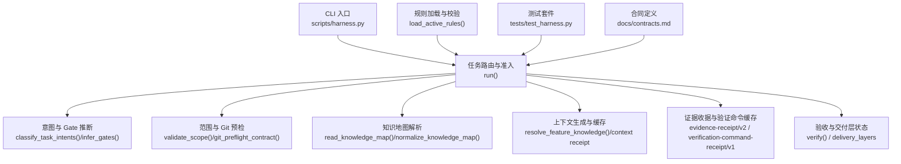
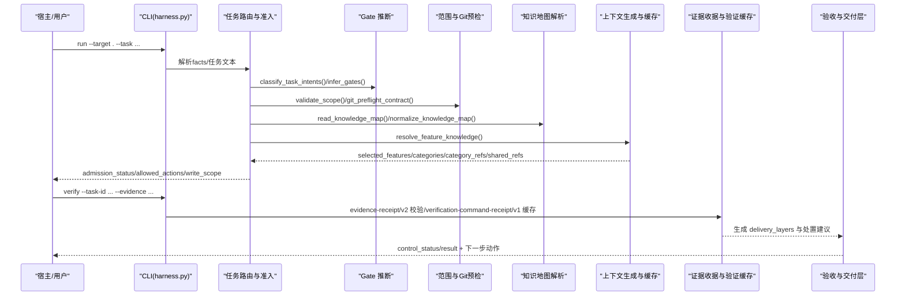
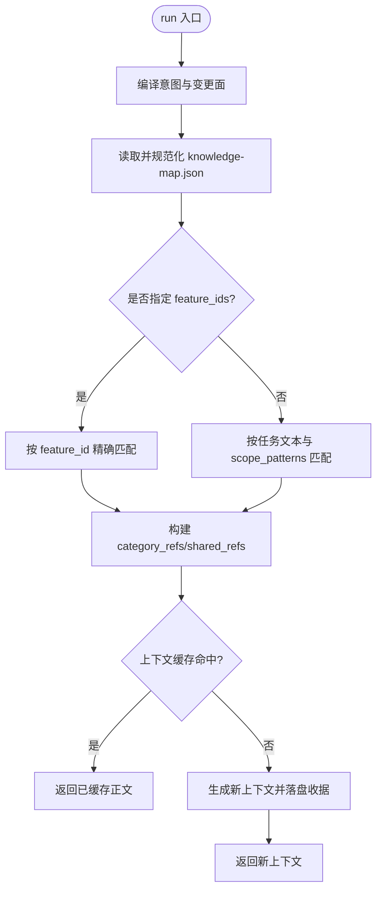
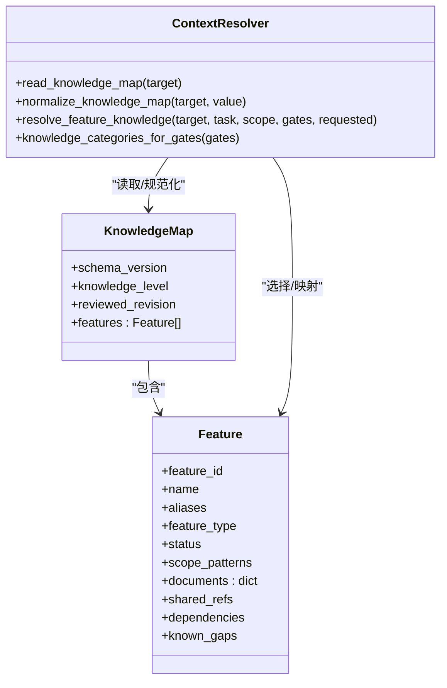
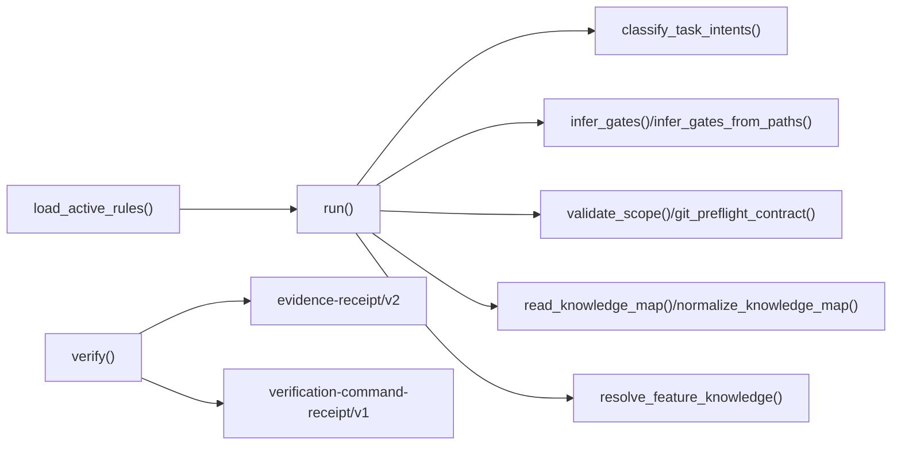

# 上下文自动生成

<cite>
**本文引用的文件**   
- [scripts/harness.py](file://scripts/harness.py)
- [tests/test_harness.py](file://tests/test_harness.py)
- [docs/contracts.md](file://docs/contracts.md)
- [harness-home/rules/INDEX.md](file://harness-home/rules/INDEX.md)
- [package.json](file://package.json)
- [SKILL.md](file://SKILL.md)
</cite>

## 目录
1. [简介](#简介)
2. [项目结构](#项目结构)
3. [核心组件](#核心组件)
4. [架构总览](#架构总览)
5. [详细组件分析](#详细组件分析)
6. [依赖分析](#依赖分析)
7. [性能考虑](#性能考虑)
8. [故障排查指南](#故障排查指南)
9. [结论](#结论)
10. [附录](#附录)

## 简介
本文件面向 Docs Harness 的“上下文自动生成系统”，系统性阐述任务启动时的上下文加载机制、依赖分析算法（文件依赖解析、模块关系映射、循环依赖检测）、引用解析过程（跨文件引用、外部链接处理、版本兼容性检查）、上下文缓存机制（策略、失效检测、性能优化）、上下文验证流程（完整性检查、一致性验证、错误处理），以及配置选项与自定义扩展方法。内容以仓库源码为依据，结合测试用例与合同文档进行说明。

## 项目结构
Docs Harness 是一个独立技能控制器，通过 CLI 驱动任务生命周期与知识治理。关键结构与职责：
- scripts/harness.py：控制器主程序，包含任务路由、Gate 推断、范围校验、Git 预检/后检、知识地图解析、规则加载、证据收据处理、验收命令缓存等核心逻辑。
- tests/test_harness.py：覆盖 run/context/verify/background/project 等关键路径的行为断言，用于验证意图分类、Gate 推断、Git 同步前置/后置、证据收据、验收命令缓存等。
- docs/contracts.md：v1.6.5 合同定义，涵盖 task-package/v2、evidence-receipt/v2、verification-command-receipt/v1、context-receipt/v2 等契约与行为约束。
- harness-home/rules/INDEX.md：随项目安装的规则快照索引，声明 active 规则清单与激活条件。
- package.json：包元数据与脚本入口，包含 self-test 与 pack:check。
- SKILL.md：技能使用说明与运行约定，包括 run/verify 命令、后台治理、质量账本、按需读取等。

**图表来源** 
- [scripts/harness.py:2154-2228](file://scripts/harness.py#L2154-L2228)
- [scripts/harness.py:2245-2286](file://scripts/harness.py#L2245-L2286)
- [scripts/harness.py:2334-2380](file://scripts/harness.py#L2334-L2380)
- [scripts/harness.py:1591-1596](file://scripts/harness.py#L1591-L1596)
- [scripts/harness.py:1784-1885](file://scripts/harness.py#L1784-L1885)
- [docs/contracts.md:165-221](file://docs/contracts.md#L165-L221)
- [docs/contracts.md:222-234](file://docs/contracts.md#L222-L234)

**章节来源**
- [scripts/harness.py:1-100](file://scripts/harness.py#L1-L100)
- [package.json:1-23](file://package.json#L1-L23)
- [SKILL.md:25-57](file://SKILL.md#L25-L57)

## 核心组件
- 任务意图与变更面编译：基于自然语言与 facts 中的显式意图，计算候选意图集合与最高 mutation_profile，决定 allowed_actions 与执行路线。
- Gate 推断与底线安全：按关键词与路径分词推断 Gate，并强制合并安全底线 Gate（security-sensitive、destructive-data、release-external）。
- 范围与 Git 预检：校验 scope/glob/Git 资源，对 git_fetch/git_sync 做前置快照与阻断检查（脏工作区、非 fast-forward、删除阈值、LFS/Submodule）。
- 知识地图与上下文选择：依据 knowledge-map.json 与 Gate 类别，选择 feature 与 category 文档，构建 category_refs/shared_refs。
- 上下文缓存与授权收据：按 task/target/stage/compiler contract/content fingerprint 复用上下文；授权绑定当前 package fingerprint。
- 证据收据与验证命令缓存：evidence-receipt/v2 强校验；verification-command-receipt/v1 支持输入指纹与 volatile 白名单，命中则跳过执行。
- 验收与交付层：delivery_layers 分层标记 expectation/status/evidence_refs，支持五级处置（provide_evidence/refresh_evidence/retry_verification/incremental_admission/full_readmission）。

**章节来源**
- [scripts/harness.py:2154-2228](file://scripts/harness.py#L2154-L2228)
- [scripts/harness.py:2245-2286](file://scripts/harness.py#L2245-L2286)
- [scripts/harness.py:2334-2380](file://scripts/harness.py#L2334-L2380)
- [scripts/harness.py:1591-1596](file://scripts/harness.py#L1591-L1596)
- [scripts/harness.py:1784-1885](file://scripts/harness.py#L1784-L1885)
- [docs/contracts.md:165-221](file://docs/contracts.md#L165-L221)
- [docs/contracts.md:222-234](file://docs/contracts.md#L222-L234)
- [docs/contracts.md:82-95](file://docs/contracts.md#L82-L95)

## 架构总览
下图展示从 run 到 verify 的关键调用链与数据流，体现上下文生成、依赖分析、引用解析、缓存与验证的协作关系。

**图表来源** 
- [scripts/harness.py:2154-2228](file://scripts/harness.py#L2154-L2228)
- [scripts/harness.py:2245-2286](file://scripts/harness.py#L2245-L2286)
- [scripts/harness.py:2334-2380](file://scripts/harness.py#L2334-L2380)
- [scripts/harness.py:1591-1596](file://scripts/harness.py#L1591-L1596)
- [scripts/harness.py:1784-1885](file://scripts/harness.py#L1784-L1885)
- [docs/contracts.md:165-221](file://docs/contracts.md#L165-L221)
- [docs/contracts.md:222-234](file://docs/contracts.md#L222-L234)

## 详细组件分析

### 任务启动时的上下文加载机制
- 触发条件：run 命令进入后，先编译 task_intent/candidate_intents/deferred_intents，再根据 mutation_profile 与 Gate 结果确定 execution_route 与 allowed_actions。
- 知识地图解析：读取 docs/knowledge-map.json，规范化 features、documents、shared_refs、dependencies，校验 L2 目标与文件存在性。
- 上下文选择：按 gates 推导 categories，匹配 feature（显式 requested、文本匹配、scope_patterns 匹配），仅加载命中 category 的文档与 shared_refs，未命中或文档无实质内容时降级为 degraded/partial。
- 上下文缓存：按 task_id/target_identity/stage/compiler_contract/content_set_fingerprint 复用 context-receipt/v2；授权收据绑定 package fingerprint，不跨修订复用。

**图表来源** 
- [scripts/harness.py:2154-2228](file://scripts/harness.py#L2154-L2228)
- [scripts/harness.py:1591-1596](file://scripts/harness.py#L1591-L1596)
- [scripts/harness.py:1784-1885](file://scripts/harness.py#L1784-L1885)
- [docs/contracts.md:222-234](file://docs/contracts.md#L222-L234)

**章节来源**
- [scripts/harness.py:1591-1596](file://scripts/harness.py#L1591-L1596)
- [scripts/harness.py:1784-1885](file://scripts/harness.py#L1784-L1885)
- [docs/contracts.md:222-234](file://docs/contracts.md#L222-L234)

### 依赖分析算法（文件依赖解析、模块关系映射、循环依赖检测）
- 文件依赖解析：knowledge-map.json 中每个 feature 声明 documents（四类）、shared_refs、dependencies；normalize_knowledge_map 校验路径合法性、相对性与符号链接限制，确保文件存在。
- 模块关系映射：由 dependencies 字段建立 feature 间依赖图；evaluate_candidate_knowledge 与 pending_knowledge_jobs 用于评估知识就绪度与增量 Job 关联。
- 循环依赖检测：在 work_packages 依赖图中使用拓扑排序检测环；对于 knowledge-map 的 dependencies，若出现未知 feature_id 直接报错，避免隐式环。

**图表来源** 
- [scripts/harness.py:1526-1588](file://scripts/harness.py#L1526-L1588)
- [scripts/harness.py:1784-1885](file://scripts/harness.py#L1784-L1885)
- [scripts/harness.py:2383-2425](file://scripts/harness.py#L2383-L2425)

**章节来源**
- [scripts/harness.py:1526-1588](file://scripts/harness.py#L1526-L1588)
- [scripts/harness.py:1784-1885](file://scripts/harness.py#L1784-L1885)
- [scripts/harness.py:2383-2425](file://scripts/harness.py#L2383-L2425)

### 引用解析过程（跨文件引用、外部链接处理、版本兼容性检查）
- 跨文件引用：category_refs 与 shared_refs 指向 docs/features/*/ 与 docs/shared/* 下的 Markdown；meaningful_knowledge_doc 过滤空占位与超大文件，确保只加载有效事实。
- 外部链接处理：external_scope 严格白名单格式（长度、字符集、禁止 @/? 等），用于受控外部目标标识；Git 远端 URL 指纹化去除凭据与查询参数。
- 版本兼容性检查：knowledge-map 要求 schema_version=docs-harness/knowledge-map/v1 且 knowledge_level=L2；rules 需 status=active、rule_id 唯一、content_fingerprint 匹配；task-package/evidence-receipt/verification-command-receipt 均按 v2/v1 契约校验。

**章节来源**
- [scripts/harness.py:1598-1608](file://scripts/harness.py#L1598-L1608)
- [scripts/harness.py:2366-2380](file://scripts/harness.py#L2366-L2380)
- [scripts/harness.py:2057-2123](file://scripts/harness.py#L2057-L2123)
- [docs/contracts.md:165-221](file://docs/contracts.md#L165-L221)

### 上下文缓存机制（策略、失效检测、性能优化）
- 缓存键：task_id、target_identity、stage、compiler_contract、content_set_fingerprint 必须完全一致才命中。
- 失效检测：stage 不同则重新确认阶段收据但只返回新增内容；content_set_fingerprint 变化或 compiler_contract 变化触发重载；跨 task/target 禁止复用。
- 性能优化：同一内容指纹正文仅交付一次；verification-command-receipt/v1 按 argv+produces+输入指纹缓存，命中则跳过执行；volatile_write_set 容忍临时副产物，减少误判。

**章节来源**
- [docs/contracts.md:222-234](file://docs/contracts.md#L222-L234)
- [docs/contracts.md:190-221](file://docs/contracts.md#L190-L221)

### 上下文验证流程（完整性检查、一致性验证、错误处理）
- 完整性检查：evidence-receipt/v2 必填字段校验（task_id、target_identity、package_fingerprint、producer、digests、cwd、时间戳、exit_code、read_set/write_set）；过期/跨任务/跨目标/不可信生产者拒绝。
- 一致性验证：verify 按 completion_manifest 固定项与预声明条件验收；delivery_layers 分层标记 expectation/status/evidence_refs；已知限制原因码派生自 required 但未验证层。
- 错误处理：五级处置（provide_evidence/refresh_evidence/retry_verification/incremental_admission/full_readmission）对应不同退出码与后续动作；Git 预检/后检失败关闭（脏工作区、非 fast-forward、删除阈值、LFS/Submodule 不可用）。

**章节来源**
- [docs/contracts.md:165-221](file://docs/contracts.md#L165-L221)
- [docs/contracts.md:82-95](file://docs/contracts.md#L82-L95)
- [scripts/harness.py:677-791](file://scripts/harness.py#L677-L791)

### 配置选项与自定义扩展方法
- 项目配置：.docs-harness/config.json 可设置 rules_root、verification.volatile_paths、verification.auto_attribute_in_scope、verification.command_cache_enabled 等；安装时复制规则快照并记录指纹。
- 规则扩展：harness-home/rules/*.md 为 active 规则，需满足 frontmatter 字段与正文结构（适用条件/必需方案字段/验收条件/失败处理方式）；load_active_rules 校验 rule_id/content_fingerprint/keywords/gates。
- 自定义能力：通过 background_job/v2 与 host_dispatch_contract 扩展后台治理；通过 evidence-declaration/v1 简化宿主提交证据；通过 plan_delta_contract 增量补充方案字段。

**章节来源**
- [harness-home/rules/INDEX.md:1-41](file://harness-home/rules/INDEX.md#L1-L41)
- [scripts/harness.py:2057-2123](file://scripts/harness.py#L2057-L2123)
- [docs/contracts.md:203-217](file://docs/contracts.md#L203-L217)
- [docs/contracts.md:307-348](file://docs/contracts.md#L307-L348)

## 依赖分析
- 组件耦合：run 依赖意图分类、Gate 推断、范围校验、Git 预检、知识地图解析、上下文缓存、证据收据、验收命令缓存；verify 依赖 evidence-receipt/v2 与 verification-command-receipt/v1。
- 外部依赖：Git 工具（lfs/submodule）、文件系统（glob/rglob）、JSON/正则表达式、子进程调用。
- 潜在循环：work_packages 依赖环检测；knowledge-map dependencies 未知 ID 直接报错，避免隐式环。
- 接口契约：task-package/v2、evidence-receipt/v2、verification-command-receipt/v1、context-receipt/v2 等契约保证跨组件一致性。

**图表来源** 
- [scripts/harness.py:2154-2228](file://scripts/harness.py#L2154-L2228)
- [scripts/harness.py:2245-2286](file://scripts/harness.py#L2245-L2286)
- [scripts/harness.py:2334-2380](file://scripts/harness.py#L2334-L2380)
- [scripts/harness.py:1591-1596](file://scripts/harness.py#L1591-L1596)
- [scripts/harness.py:1784-1885](file://scripts/harness.py#L1784-L1885)
- [docs/contracts.md:165-221](file://docs/contracts.md#L165-L221)

**章节来源**
- [scripts/harness.py:2154-2228](file://scripts/harness.py#L2154-L2228)
- [scripts/harness.py:2245-2286](file://scripts/harness.py#L2245-L2286)
- [scripts/harness.py:2334-2380](file://scripts/harness.py#L2334-L2380)
- [scripts/harness.py:1591-1596](file://scripts/harness.py#L1591-L1596)
- [scripts/harness.py:1784-1885](file://scripts/harness.py#L1784-L1885)
- [docs/contracts.md:165-221](file://docs/contracts.md#L165-L221)

## 性能考虑
- 上下文正文按 content_set_fingerprint 与 stage 复用，避免重复加载与传输。
- 验证命令缓存按 argv+produces+输入指纹命中，跳过重复执行；volatile_write_set 容忍临时副产物，降低误判开销。
- Git 预检一次性捕获 index_tree/worktree_fingerprint/refs，postcheck 仅比对差异与 ref 漂移，减少全量扫描。
- 规则加载与知识地图规范化有界遍历（如 rglob 上限 200），防止巨型目录拖慢。

[本节为通用指导，无需特定文件来源]

## 故障排查指南
- 常见错误码与含义：
  - invalid_scope_description：scope 包含自然语言描述而非结构化路径。
  - invalid_git_scope/git_remote_unavailable/git_target_object_missing：Git 范围或远端对象问题。
  - invalid_knowledge_map/missing_feature_knowledge：知识地图 schema 或文件缺失。
  - invalid_task_intent/invalid_gate：意图或 Gate 值无效。
  - missing_file/invalid_json：输入文件不存在或 JSON 无效。
- 调试步骤：
  - 检查 .docs-harness/config.json 的 rules_root 与 installed_rule_fingerprints。
  - 确认 docs/knowledge-map.json 的 schema_version 与 knowledge_level。
  - 使用 project check/self-test 定位规则与安装问题。
  - 查看 events.jsonl 与 context-receipts.jsonl 定位上下文与事件。

**章节来源**
- [scripts/harness.py:437-444](file://scripts/harness.py#L437-L444)
- [scripts/harness.py:532-538](file://scripts/harness.py#L532-L538)
- [scripts/harness.py:1526-1588](file://scripts/harness.py#L1526-L1588)
- [scripts/harness.py:2154-2228](file://scripts/harness.py#L2154-L2228)
- [tests/test_harness.py:356-375](file://tests/test_harness.py#L356-L375)

## 结论
Docs Harness 的上下文自动生成系统以契约为中心，通过严格的范围与 Gate 控制、知识地图驱动的上下文选择、强校验的证据收据与验证命令缓存，实现了高内聚、低耦合、可审计的任务执行环境。其设计兼顾安全性（底线 Gate、受控外部目标）、可维护性（规则快照与指纹校验）、可扩展性（后台治理与证据声明），并通过测试与合同文档保障行为一致性。

[本节为总结，无需特定文件来源]

## 附录
- 命令参考：run/verify/background/project/ledger 等命令见 SKILL.md 与 contracts.md。
- 规则清单：harness-home/rules/INDEX.md 列出 active 规则与激活条件。
- 包脚本：package.json 提供 self-test 与 pack:check 等便捷脚本。

**章节来源**
- [SKILL.md:25-57](file://SKILL.md#L25-L57)
- [harness-home/rules/INDEX.md:1-41](file://harness-home/rules/INDEX.md#L1-L41)
- [package.json:17-21](file://package.json#L17-L21)