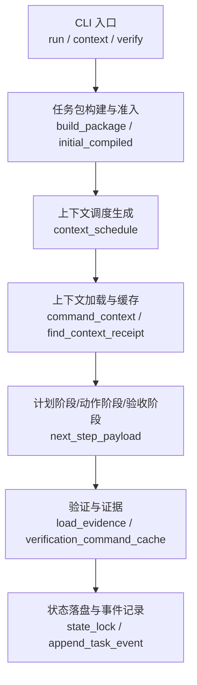
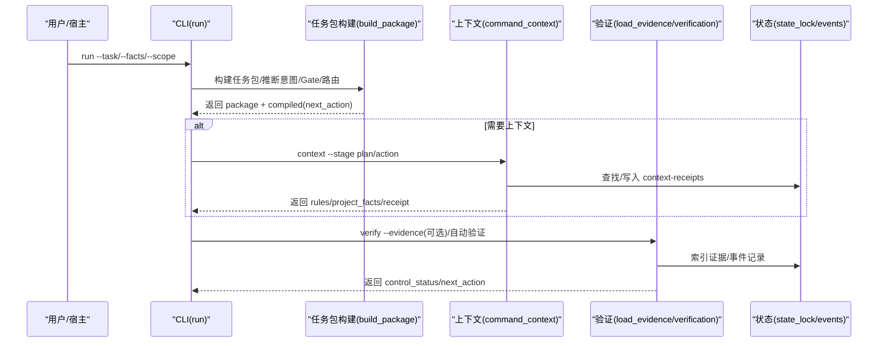
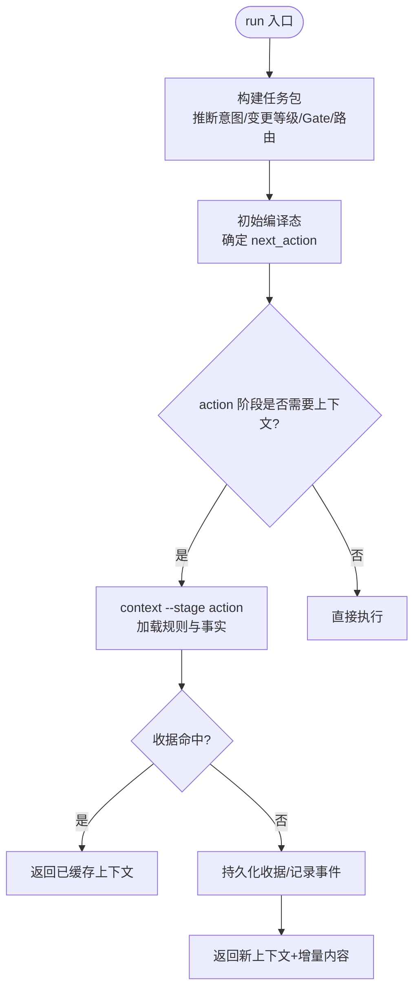
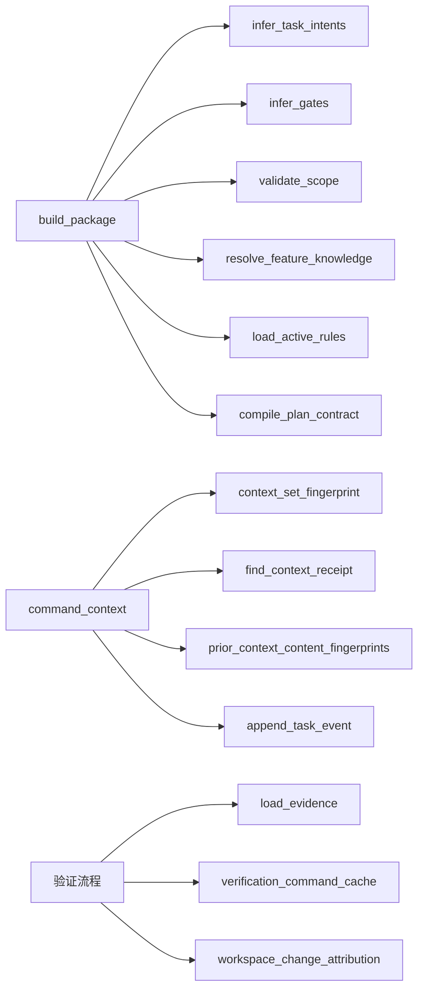

# 上下文触发机制

<cite>
**本文引用的文件**   
- [harness.py](file://scripts/harness.py)
- [test_harness.py](file://tests/test_harness.py)
- [package.json](file://package.json)
- [SKILL.md](file://SKILL.md)
</cite>

## 目录
1. [简介](#简介)
2. [项目结构](#项目结构)
3. [核心组件](#核心组件)
4. [架构总览](#架构总览)
5. [详细组件分析](#详细组件分析)
6. [依赖关系分析](#依赖关系分析)
7. [性能考量](#性能考量)
8. [故障排查指南](#故障排查指南)
9. [结论](#结论)
10. [附录](#附录)

## 简介
本文件系统化阐述 Docs Harness 的“上下文触发机制”，覆盖任务启动时的上下文加载、不同任务类型（query、audit、modify、git_inspect、git_fetch、git_sync、external_write）触发的差异化策略，以及上下文预检与验证流程（依赖文件存在性检查、权限/范围校验、格式校验）。同时说明上下文触发的优先级与冲突解决机制，并提供配置选项与扩展方法，辅以具体使用场景与代码片段路径。

## 项目结构
- scripts/harness.py：控制器主逻辑，包含任务包构建、意图推断、Gate 判定、上下文调度、上下文加载与缓存、验证命令执行、证据处理等。
- tests/test_harness.py：端到端与契约测试，覆盖动态上下文选择、Git 操作前置/后置校验、上下文缓存命中、增量准入等关键行为。
- package.json：包元信息与脚本入口。
- SKILL.md：技能说明，强调 run/context/verify 的工作流与失败关闭原则。

图表来源
- [harness.py:2613-2900](file://scripts/harness.py#L2613-L2900)
- [harness.py:4130-4276](file://scripts/harness.py#L4130-L4276)
- [harness.py:3033-3095](file://scripts/harness.py#L3033-L3095)

章节来源
- [package.json:1-23](file://package.json#L1-L23)
- [SKILL.md:1-105](file://SKILL.md#L1-L105)

## 核心组件
- 任务包构建器：根据任务文本、facts、CLI 参数推断意图、计算变更等级、匹配 Gate、生成上下文调度与准入状态。
- 上下文调度器：为 plan/action/acceptance/work_packages 各阶段生成 rule_ids 与 project_fact_refs。
- 上下文加载器：按阶段读取规则与事实，计算内容指纹，命中则复用收据，未命中则增量加载并持久化收据。
- 验证与证据：校验证据收据、运行验证命令（可缓存）、自动归因工作区写入、检测漂移与新增 Gate。
- 状态机与事件：维护 compiled-task 状态、冻结快照、事件日志、锁与并发控制。

章节来源
- [harness.py:2613-2900](file://scripts/harness.py#L2613-L2900)
- [harness.py:2963-3005](file://scripts/harness.py#L2963-L3005)
- [harness.py:4130-4276](file://scripts/harness.py#L4130-L4276)
- [harness.py:5076-5228](file://scripts/harness.py#L5076-L5228)
- [harness.py:3033-3095](file://scripts/harness.py#L3033-L3095)

## 架构总览
下图展示从 run 到 context 再到 verify 的关键调用链与数据流转，体现“意图优先、证据可复用、失败关闭”的设计原则。

图表来源
- [harness.py:4540-4929](file://scripts/harness.py#L4540-L4929)
- [harness.py:4130-4276](file://scripts/harness.py#L4130-L4276)
- [harness.py:5076-5228](file://scripts/harness.py#L5076-L5228)

## 详细组件分析

### 任务启动与上下文加载机制
- 首次 run：若未提供 task-id，则基于任务文本与 facts 构建任务包；若存在活动任务且键相同则幂等复用。
- 编译态：initial_compiled 决定 next_action，若 action 阶段有 rule_ids 或 project_fact_refs，则进入 load_action_context，否则直接 execute。
- 上下文阶段：plan/action/acceptance/work_packages 四阶段各自拥有 rule_ids 与 project_fact_refs 列表，由 build_package 生成。
- 上下文加载：command_context 按阶段收集规则与事实，计算 content_set 指纹，查找历史收据；命中则直接返回，未命中则追加收据并记录事件。

图表来源
- [harness.py:4540-4929](file://scripts/harness.py#L4540-L4929)
- [harness.py:3033-3095](file://scripts/harness.py#L3033-L3095)
- [harness.py:4130-4276](file://scripts/harness.py#L4130-L4276)

章节来源
- [harness.py:4540-4929](file://scripts/harness.py#L4540-L4929)
- [harness.py:3033-3095](file://scripts/harness.py#L3033-L3095)
- [harness.py:4130-4276](file://scripts/harness.py#L4130-L4276)

### 不同任务类型的上下文触发策略
- 意图推断与变更等级：
  - query/audit/git_inspect -> read_only
  - git_fetch -> git_metadata_write
  - git_sync/modify -> workspace_write
  - external_write -> external_write
- 上下文调度差异：
  - query/audit：通常不需要写操作，write_scope=[]，可能仅需要 source_trace 类证据。
  - git_inspect：允许 git_inspect 动作，只读。
  - git_fetch：允许 git_fetch，需 git_fetch_result 证据。
  - git_sync：需 preflight 生成 write_scope（远端变化清单），postcheck 校验 ref 越界与工作区一致性。
  - modify/external_write：需要正式方案（planned/extended），可能触发更多 Gate 与证据要求。
- 路由选择：
  - direct：无阻塞、无需方案。
  - planned：存在高风险 Gate 或 git_sync 时要求提交方案。
  - extended：定义 work_packages，多所有者协作。

章节来源
- [harness.py:2231-2430](file://scripts/harness.py#L2231-L2430)
- [harness.py:2613-2900](file://scripts/harness.py#L2613-L2900)
- [harness.py:2963-3005](file://scripts/harness.py#L2963-L3005)

### 上下文预检与验证过程
- 依赖文件存在性检查：
  - required_fact_refs 与 knowledge_map 中的文档必须存在且有效；缺失将导致 blockers。
- 权限与范围校验：
  - validate_scope 严格限制相对路径与受控资源（如 .git:refs/remotes/*），拒绝描述性文本。
  - external_scope 白名单校验目标标识。
- 格式校验：
  - JSON/JSONL 读取与解析错误抛出明确 code。
  - evidence-receipt/v2 字段完整性、生产者可信度、时间戳与 TTL、cwd 与 exit_code 校验。
- Git 前置/后置校验：
  - git_preflight_contract：校验 LFS/Submodule、脏工作区、fast-forward、删除数量阈值、可控 refs 命名空间。
  - git_postcheck：对比 remote_target_unchanged、controlled_ref 与 HEAD、refs 越界、LFS/Submodule 有效性。

章节来源
- [harness.py:2334-2380](file://scripts/harness.py#L2334-L2380)
- [harness.py:5076-5228](file://scripts/harness.py#L5076-L5228)
- [harness.py:677-791](file://scripts/harness.py#L677-L791)
- [harness.py:793-875](file://scripts/harness.py#L793-L875)

### 上下文触发的优先级与冲突解决
- 变更等级优先级：
  - mutation_profile 取推断与声明的最大值；workspace_write > git_metadata_write > read_only。
- Gate 优先级与底线：
  - SAFETY_FLOOR_GATES（security-sensitive、destructive-data、release-external）不可豁免，精确词表+否定守卫避免误报。
- 路由优先级：
  - route_rank: extended > planned > direct；work_packages 强制 extended，否则回退 planned。
- 冲突解决：
  - plan_scope 与 allowed_scope 不一致时，超集自动重编译，子集要求重新准入。
  - 新增 Gate 走增量准入（incremental_gate_readmission），继承同轮证据，必要时仅加载增量上下文。

章节来源
- [harness.py:2236-2243](file://scripts/harness.py#L2236-L2243)
- [harness.py:2693-2734](file://scripts/harness.py#L2693-L2734)
- [harness.py:5372-5512](file://scripts/harness.py#L5372-L5512)

### 配置选项与自定义扩展
- 项目配置（.docs-harness/config.json）：
  - verification.volatile_paths：验证期间忽略的临时路径 glob（需固定根目录，禁止危险前缀）。
  - verification.command_cache_enabled：是否启用验证命令逐项缓存（默认开启）。
  - verification.auto_attribute_in_scope：write_scope 内未归因写入是否自动归因（默认开启）。
  - background_governance.document_routes：显式文档路由配置，非法时不降级。
- 扩展点：
  - 规则文件（harness-home/rules/*.md）：通过 matched_rules 注入额外证据类型与计划字段。
  - 知识地图（docs/knowledge-map.json）：按 feature_id 组织四类文档，驱动 context_schedule 的 project_fact_refs。
  - 验证命令白名单与安全参数过滤：仅允许安全命令与受限参数，防止任意执行。

章节来源
- [harness.py:1150-1234](file://scripts/harness.py#L1150-L1234)
- [harness.py:1279-1345](file://scripts/harness.py#L1279-L1345)
- [harness.py:5685-5718](file://scripts/harness.py#L5685-L5718)

### 使用场景与代码示例路径
- 动态上下文选择（仅加载 Gate 相关类别）：
  - 参考测试用例中“动态上下文解析功能并仅加载 Gate 类别”。
- Git fetch/sync 前置/后置校验：
  - 参考测试用例中“git_fetch 独立元数据合同”“git_sync 预检范围与后置完整校验”。
- 上下文缓存命中与增量加载：
  - 参考测试用例中“同一阶段每阶段仅加载一次内容”“相同 plan 与 action 上下文仅交付一次”。
- 增量准入与证据继承：
  - 参考测试用例中“增量 Gate 上下文仅返回新增内容”。

章节来源
- [test_harness.py:408-428](file://tests/test_harness.py#L408-L428)
- [test_harness.py:503-536](file://tests/test_harness.py#L503-L536)
- [test_harness.py:651-684](file://tests/test_harness.py#L651-L684)
- [test_harness.py:950-970](file://tests/test_harness.py#L950-L970)
- [test_harness.py:2986-3000](file://tests/test_harness.py#L2986-L3000)
- [test_harness.py:3667-3680](file://tests/test_harness.py#L3667-L3680)

## 依赖关系分析
- 模块内依赖：
  - build_package 依赖 infer_task_intents、infer_gates、validate_scope、resolve_feature_knowledge、load_active_rules、compile_plan_contract。
  - command_context 依赖 context_set_fingerprint、find_context_receipt、prior_context_content_fingerprints、append_task_event。
  - 验证流程依赖 load_evidence、verification_command_cache、workspace_change_attribution。
- 外部依赖：
  - Git 工具链（ls-remote、for-each-ref、lfs、submodule）。
  - 文件系统（原子写入、JSON/JSONL 读写、锁文件）。
  - 时间与时区（UTC ISO 时间戳）。

图表来源
- [harness.py:2613-2900](file://scripts/harness.py#L2613-L2900)
- [harness.py:4130-4276](file://scripts/harness.py#L4130-L4276)
- [harness.py:5076-5228](file://scripts/harness.py#L5076-L5228)

章节来源
- [harness.py:2613-2900](file://scripts/harness.py#L2613-L2900)
- [harness.py:4130-4276](file://scripts/harness.py#L4130-L4276)
- [harness.py:5076-5228](file://scripts/harness.py#L5076-L5228)

## 性能考量
- 上下文缓存：content_set 指纹命中避免重复加载，减少 I/O 与解析开销。
- 验证命令缓存：按 cache_key（任务、目标、命令摘要、输入指纹、合同摘要）缓存结果，跳过重复执行。
- 工作区快照：Git 仓库下使用 ls-files 快速枚举，非 Git 模式有文件大小限制与截断保护。
- 事件与收据：追加写入 JSONL，顺序持久化，避免随机 IO。

[本节为通用指导，不直接分析具体文件]

## 故障排查指南
- 常见错误码与原因：
  - missing_file/invalid_json：配置文件或输入文件缺失/格式错误。
  - invalid_scope_description：scope 包含描述性文本而非结构化路径。
  - unauthorized/untrusted_evidence_producer：证据生产者不在受信列表。
  - git_remote_drift/git_ref_scope_violation：远端漂移或 ref 越界。
  - state_locked/stale_lock：状态锁冲突或过期。
- 定位步骤：
  - 查看 events.jsonl 与 context-receipts.jsonl 获取阶段与原因码。
  - 检查 freeze.json 的 workspace_snapshot 与 git_state_snapshot 是否一致。
  - 核对验证命令白名单与参数限制。
  - 确认 knowledge-map 与 required_fact_refs 指向的文件是否存在。

章节来源
- [harness.py:437-444](file://scripts/harness.py#L437-L444)
- [harness.py:2334-2380](file://scripts/harness.py#L2334-L2380)
- [harness.py:5076-5228](file://scripts/harness.py#L5076-L5228)
- [harness.py:793-875](file://scripts/harness.py#L793-L875)
- [harness.py:1008-1029](file://scripts/harness.py#L1008-L1029)

## 结论
Docs Harness 的上下文触发机制以“意图优先、证据可复用、失败关闭”为核心，通过严格的范围与 Gate 控制、Git 前置/后置校验、上下文指纹缓存与增量加载，确保任务在安全边界内高效执行。不同任务类型对应不同的变更等级与上下文策略，结合配置与扩展点，可实现灵活而可控的执行环境。

[本节为总结，不直接分析具体文件]

## 附录
- 关键常量与模式：
  - TASK_INTENTS、MUTATION_PROFILES、INTENT_MUTATION、INTENT_PATTERNS、GATE_DEFS、SAFETY_FLOOR_GATES。
- 重要函数路径：
  - build_package、command_context、load_evidence、git_preflight_contract、git_postcheck、contract_disposition、build_contract_delta。

章节来源
- [harness.py:197-231](file://scripts/harness.py#L197-L231)
- [harness.py:260-342](file://scripts/harness.py#L260-L342)
- [harness.py:2963-3005](file://scripts/harness.py#L2963-L3005)
- [harness.py:3008-3030](file://scripts/harness.py#L3008-L3030)