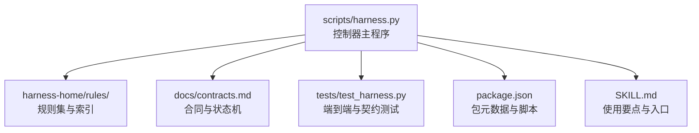
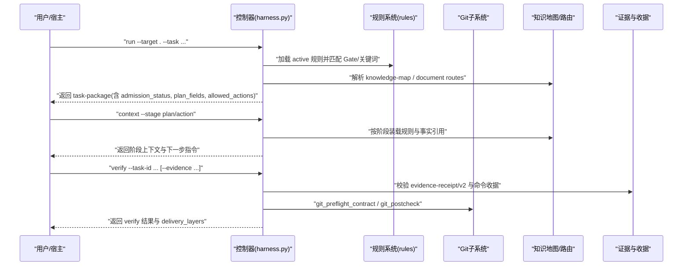
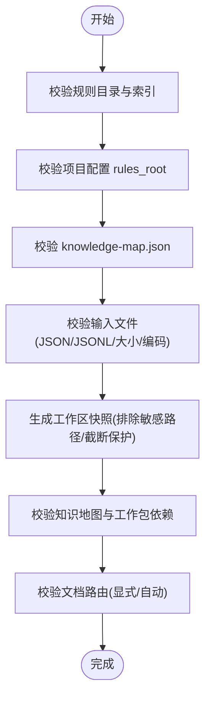
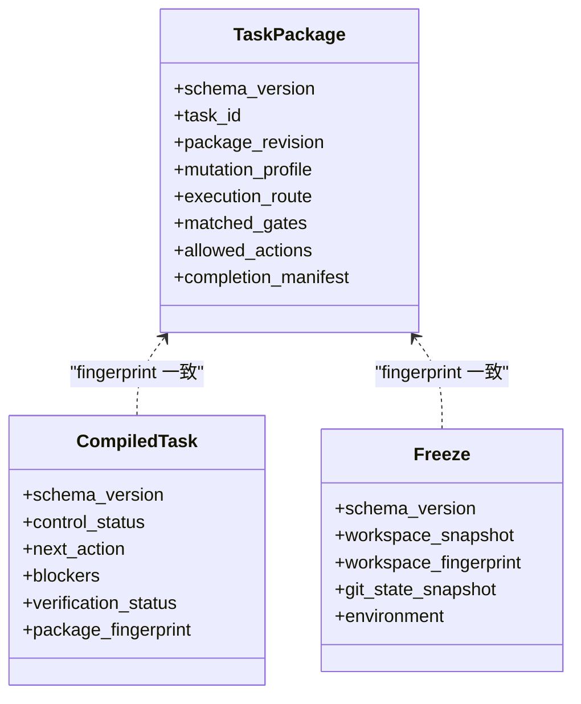
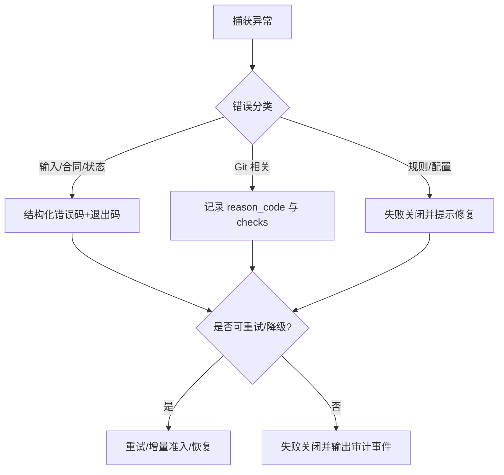
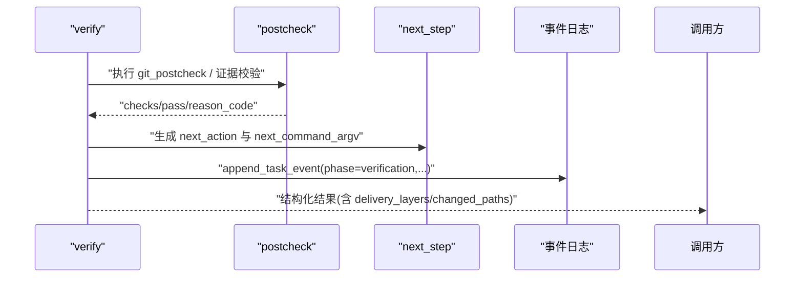
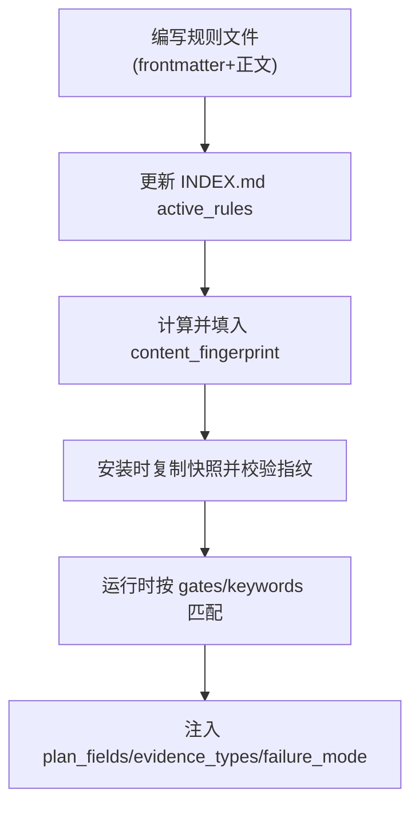
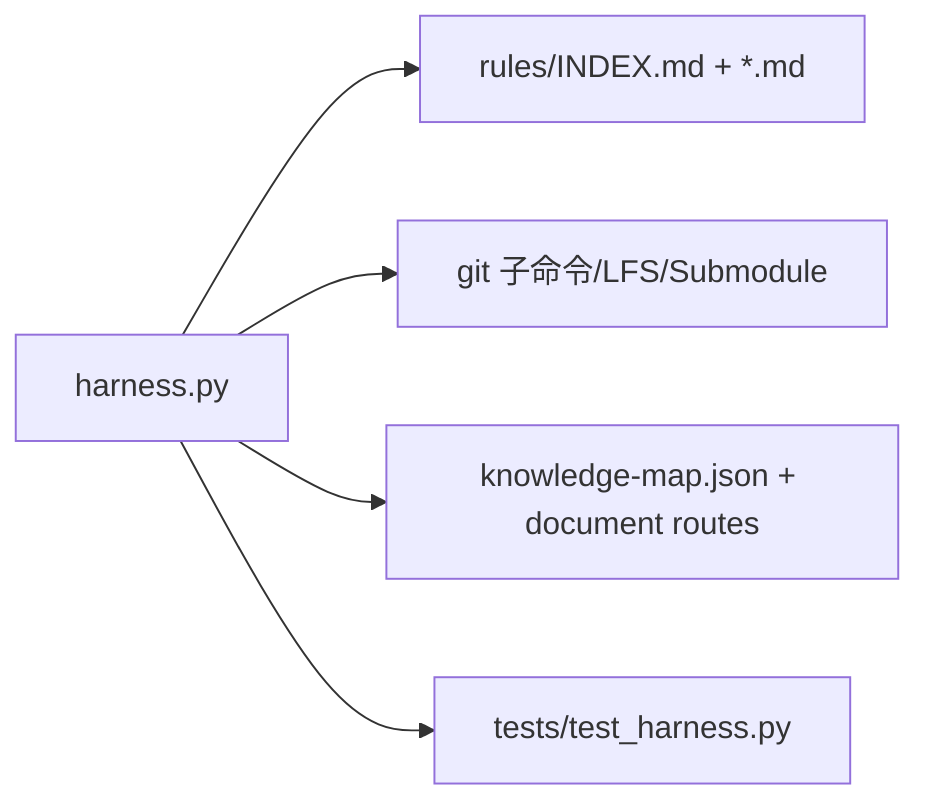

# 上下文验证流程

<cite>
**本文引用的文件**   
- [scripts/harness.py](file://scripts/harness.py)
- [tests/test_harness.py](file://tests/test_harness.py)
- [harness-home/rules/INDEX.md](file://harness-home/rules/INDEX.md)
- [harness-home/rules/_rule-template.md](file://harness-home/rules/_rule-template.md)
- [harness-home/rules/api-compatibility.md](file://harness-home/rules/api-compatibility.md)
- [docs/contracts.md](file://docs/contracts.md)
- [SKILL.md](file://SKILL.md)
- [package.json](file://package.json)
</cite>

## 目录
1. [简介](#简介)
2. [项目结构](#项目结构)
3. [核心组件](#核心组件)
4. [架构总览](#架构总览)
5. [详细组件分析](#详细组件分析)
6. [依赖关系分析](#依赖关系分析)
7. [性能与并行策略](#性能与并行策略)
8. [故障排查指南](#故障排查指南)
9. [结论](#结论)
10. [附录：自定义验证规则开发指南](#附录自定义验证规则开发指南)

## 简介
本文件系统化阐述 Docs Harness 的“上下文验证流程”，围绕完整性检查、一致性校验、错误处理策略、验证结果报告与可观测性，以及自定义验证规则开发与性能优化进行说明。内容以仓库中的控制器脚本、合同文档、规则索引与测试用例为依据，确保读者既能把握整体设计，也能落地到具体实现路径。

## 项目结构
- 控制器主程序位于 scripts/harness.py，承担任务准入、上下文装配、证据与验收、Git 预检/后检、后台治理、质量账本等核心职责。
- 规则集位于 harness-home/rules，通过 INDEX.md 声明生效规则及指纹约束，单个规则以 Markdown frontmatter + 正文结构描述适用条件、方案字段、验收条件与失败处理方式。
- 合同与行为约定见 docs/contracts.md；技能使用要点见 SKILL.md；包元数据见 package.json。
- 测试覆盖关键路径与边界，如 Git fetch/sync 契约、漂移检测、规则激活与自检等。

**图表来源** 
- [scripts/harness.py:1-120](file://scripts/harness.py#L1-L120)
- [harness-home/rules/INDEX.md:1-41](file://harness-home/rules/INDEX.md#L1-L41)
- [docs/contracts.md:1-120](file://docs/contracts.md#L1-L120)
- [tests/test_harness.py:1-120](file://tests/test_harness.py#L1-L120)
- [package.json:1-23](file://package.json#L1-L23)
- [SKILL.md:1-60](file://SKILL.md#L1-L60)

**章节来源**
- [scripts/harness.py:1-120](file://scripts/harness.py#L1-L120)
- [harness-home/rules/INDEX.md:1-41](file://harness-home/rules/INDEX.md#L1-L41)
- [docs/contracts.md:1-120](file://docs/contracts.md#L1-L120)
- [tests/test_harness.py:1-120](file://tests/test_harness.py#L1-L120)
- [package.json:1-23](file://package.json#L1-L23)
- [SKILL.md:1-60](file://SKILL.md#L1-L60)

## 核心组件
- 任务包与编译态：task-package/v2、compiled-task/v2、freeze.json、evidence-index/v2、context-receipts.jsonl、authorization-receipts.jsonl、events.jsonl。
- Git 契约：git_state_snapshot、preflight/postcheck、ref 受控范围、LFS/Submodule 可用性。
- 规则系统：active 规则、frontmatter 校验、content_fingerprint 一致性、Gate/关键词匹配、plan_fields/evidence_types/failure_mode。
- 知识地图与路由：knowledge-map.json、document routes、外部知识库只消费模式。
- 质量账本与事件：quality-ledger、脱敏效率事件（event/v2）。

**章节来源**
- [docs/contracts.md:1-200](file://docs/contracts.md#L1-L200)
- [scripts/harness.py:800-1200](file://scripts/harness.py#L800-L1200)
- [harness-home/rules/INDEX.md:1-41](file://harness-home/rules/INDEX.md#L1-L41)

## 架构总览
下图展示一次典型 run→context→verify 的调用链路与关键校验点。

**图表来源** 
- [scripts/harness.py:2779-3076](file://scripts/harness.py#L2779-L3076)
- [scripts/harness.py:680-878](file://scripts/harness.py#L680-L878)
- [docs/contracts.md:1-200](file://docs/contracts.md#L1-L200)

## 详细组件分析

### 完整性检查机制
- 文件结构验证
  - 规则目录与索引：要求 rules_root 存在且包含 active 规则，INDEX.md 声明生效规则 ID 列表，每个规则必须包含 rule_id、content_fingerprint、gates/keywords、plan_fields、evidence_types、failure_mode，正文需包含固定标题段。
  - 项目配置：.docs-harness/config.json 中 rules_root 必须为项目内相对路径，禁止越界与绝对路径。
  - 知识地图：knowledge-map.json 必须 schema_version=docs-harness/knowledge-map/v1、knowledge_level=L2，features 数组有界，feature_id 唯一且 kebab-case，四类文档必须位于独立功能目录，shared_refs 与 dependencies 必须指向项目内有效文件。
- 内容格式校验
  - JSON/JSONL 读取：read_json/read_jsonl 对缺失、类型、行号位置错误进行结构化报错。
  - 输入参数：load_input_file/load_json_object_file 限制大小、编码与类型，拒绝内联输入。
  - 工作区快照：workspace_snapshot 对非 Git 工作区限制文件数量上限，大文件采用 size+mtime 指纹，排除 .git/.docs-harness 等敏感路径。
- 依赖关系验证
  - 知识地图依赖：normalize_knowledge_map 校验 feature 间依赖闭环与未知依赖。
  - 工作包依赖：normalize_work_packages 校验 ID 唯一、依赖环、必填字段。
  - 文档路由：resolve_document_routes 校验显式配置合法性与自动候选安全性，冲突或缺失时失败关闭。

**图表来源** 
- [scripts/harness.py:2223-2290](file://scripts/harness.py#L2223-L2290)
- [scripts/harness.py:1282-1349](file://scripts/harness.py#L1282-L1349)
- [scripts/harness.py:1529-1592](file://scripts/harness.py#L1529-L1592)
- [scripts/harness.py:1115-1139](file://scripts/harness.py#L1115-L1139)
- [scripts/harness.py:2549-2592](file://scripts/harness.py#L2549-L2592)
- [scripts/harness.py:1403-1460](file://scripts/harness.py#L1403-L1460)

**章节来源**
- [scripts/harness.py:2223-2290](file://scripts/harness.py#L2223-L2290)
- [scripts/harness.py:1282-1349](file://scripts/harness.py#L1282-L1349)
- [scripts/harness.py:1529-1592](file://scripts/harness.py#L1529-L1592)
- [scripts/harness.py:1115-1139](file://scripts/harness.py#L1115-L1139)
- [scripts/harness.py:2549-2592](file://scripts/harness.py#L2549-L2592)
- [scripts/harness.py:1403-1460](file://scripts/harness.py#L1403-L1460)

### 一致性验证过程
- 引用完整性检查
  - 上下文收据复用：同一 task_id、target_identity、stage、compiler_contract、content_set_fingerprint 命中才复用，否则重载。
  - 证据收据绑定：evidence-receipt/v2 必须绑定 task_id、target_identity、package_fingerprint、可信 producer、时间戳与摘要，过期/跨任务/跨目标均拒绝。
- 版本一致性验证
  - 任务包与编译态/冻结态指纹一致：create_task_state/load_state 强制三者 fingerprint 一致，否则报 stale_state。
  - 规则指纹一致性：active 规则的 content_fingerprint 必须与正文计算值一致，否则视为篡改或污染。
- 状态同步检查
  - Git 预检/后检：git_preflight_contract 生成 snapshot（remote/refspec/head/index_tree/worktree_fingerprint/controlled_refs_namespace），git_postcheck 对比 refs 变化、index 与 worktree 是否变更、LFS/Submodule 可用性与 fast-forward 约束。
  - 工作区漂移归因：freeze.workspace_snapshot 作为基线，区分 task_write_set、read_set、concurrent_drift、unattributed_drift，阻断越界写入与高风险边界的漂移。

**图表来源** 
- [scripts/harness.py:3001-3076](file://scripts/harness.py#L3001-L3076)
- [scripts/harness.py:3229-3263](file://scripts/harness.py#L3229-L3263)
- [scripts/harness.py:3265-3281](file://scripts/harness.py#L3265-L3281)

**章节来源**
- [docs/contracts.md:1-220](file://docs/contracts.md#L1-L220)
- [scripts/harness.py:680-878](file://scripts/harness.py#L680-L878)
- [scripts/harness.py:3229-3281](file://scripts/harness.py#L3229-L3281)

### 错误处理策略
- 错误分类
  - 输入/合同/状态无效：invalid_scope_description、invalid_gate、invalid_state、stale_lock 等。
  - Git 相关：git_remote_unavailable、git_sync_scope_ambiguous、git_remote_drift、git_ref_scope_violation。
  - 规则/配置：missing_harness_home、invalid_project_config、archive_source_drift。
- 重试机制
  - 背景 Job：retry 归档当前 attempt、推进 attempt、清空准备引用并刷新基线，不继承进度。
  - 验证命令：verification.command_cache_enabled 控制逐项缓存；输入不变则复用通过收据，失败或输入变化重跑。
- 降级处理
  - 知识质量降级：context_quality=degraded 仅降低上下文置信度，不改变准入状态；允许从代码/测试/配置/有效文档核实事实并记录 fallback_fact_refs。
  - 外部知识库只消费：存在 .qoder/repowiki 时进入 external_consume_only，不创建知识动作，bootstrap 失败关闭。

**图表来源** 
- [scripts/harness.py:395-408](file://scripts/harness.py#L395-L408)
- [scripts/harness.py:800-878](file://scripts/harness.py#L800-L878)
- [docs/contracts.md:300-372](file://docs/contracts.md#L300-L372)

**章节来源**
- [scripts/harness.py:395-408](file://scripts/harness.py#L395-L408)
- [scripts/harness.py:800-878](file://scripts/harness.py#L800-L878)
- [docs/contracts.md:300-372](file://docs/contracts.md#L300-L372)

### 验证结果报告
- 错误详情
  - verify 响应包含 control_status、reason_code、delivery_layers、changed_paths、auto_attributed_paths、git_postcheck.checks 等结构化字段。
- 修复建议
  - next_step_payload 提供下一步 CLI 命令片段（load_plan_context/submit_plan/obtain_authorization/retry_verification 等）与 artifact_ref。
- 审计日志
  - events.jsonl 记录 phase、duration_ms、reason_code、package_revision、context_load_count、evidence_round_count 等脱敏指标；append_task_event 保证幂等与不可变追加。

**图表来源** 
- [scripts/harness.py:796-878](file://scripts/harness.py#L796-L878)
- [scripts/harness.py:939-1009](file://scripts/harness.py#L939-L1009)
- [scripts/harness.py:1034-1074](file://scripts/harness.py#L1034-L1074)

**章节来源**
- [scripts/harness.py:796-878](file://scripts/harness.py#L796-L878)
- [scripts/harness.py:939-1009](file://scripts/harness.py#L939-L1009)
- [scripts/harness.py:1034-1074](file://scripts/harness.py#L1034-L1074)

### 自定义验证规则开发指南
- 规则接口定义
  - frontmatter 字段：status、rule_id、content_fingerprint、gates、keywords、plan_fields、evidence_types、failure_mode。
  - 正文结构：必须包含“适用条件”“必需的方案字段”“验收条件”“失败处理方式”四个标题段。
- 插件注册机制
  - 控制器扫描 rules_root/*.md，仅 status=active 的规则参与匹配；INDEX.md 声明 active_rules 列表，安装时复制快照并记录指纹；任何缺失、新增或指纹漂移均失败关闭。
- 开发步骤
  - 基于 _rule-template.md 新建规则文件，填写 frontmatter 与正文四段；在 INDEX.md 的 active_rules 中添加 rule_id；提交前确保 content_fingerprint 与正文一致。

**图表来源** 
- [harness-home/rules/_rule-template.md:1-21](file://harness-home/rules/_rule-template.md#L1-L21)
- [harness-home/rules/INDEX.md:1-41](file://harness-home/rules/INDEX.md#L1-L41)
- [scripts/harness.py:2223-2290](file://scripts/harness.py#L2223-L2290)

**章节来源**
- [harness-home/rules/_rule-template.md:1-21](file://harness-home/rules/_rule-template.md#L1-L21)
- [harness-home/rules/INDEX.md:1-41](file://harness-home/rules/INDEX.md#L1-L41)
- [scripts/harness.py:2223-2290](file://scripts/harness.py#L2223-L2290)

## 依赖关系分析
- 控制器与规则：load_active_rules 依赖 rules_root 与 INDEX.md 声明；规则匹配受 mutation_profile 与 Gate 词表影响。
- 控制器与 Git：git_preflight_contract/git_postcheck 依赖 git 子命令与 LFS/Submodule 工具链；snapshot 包含 remote URL 指纹、refs 快照、index_tree、worktree_fingerprint。
- 控制器与知识系统：knowledge-map.json 与 document routes 决定上下文装载与交付物范围；外部 repowiki 模式短路知识构建。
- 控制器与测试：tests/test_harness.py 覆盖 run/context/verify、Git fetch/sync 契约、规则激活与自检、漂移与重新准入等关键路径。

**图表来源** 
- [scripts/harness.py:2223-2290](file://scripts/harness.py#L2223-L2290)
- [scripts/harness.py:680-878](file://scripts/harness.py#L680-L878)
- [scripts/harness.py:1403-1460](file://scripts/harness.py#L1403-L1460)
- [tests/test_harness.py:1-200](file://tests/test_harness.py#L1-L200)

**章节来源**
- [scripts/harness.py:2223-2290](file://scripts/harness.py#L2223-L2290)
- [scripts/harness.py:680-878](file://scripts/harness.py#L680-L878)
- [scripts/harness.py:1403-1460](file://scripts/harness.py#L1403-L1460)
- [tests/test_harness.py:1-200](file://tests/test_harness.py#L1-L200)

## 性能与并行策略
- 快照与指纹
  - workspace_snapshot 对非 Git 工作区限制文件数上限，避免巨型遍历；大文件采用 size+mtime 指纹减少 I/O。
- 命令缓存
  - verification.command_cache_enabled 默认开启，按 argv/produces/输入指纹缓存验证命令结果，避免重复执行。
- 增量准入
  - contract_disposition/build_contract_delta 识别 scope/authorization/plan/gate/evidence/context 的变化粒度，支持 incremental_admission 与 context_only 快速路径。
- 事件脱敏
  - events.jsonl 仅保存脱敏指标，避免日志膨胀与隐私泄露。

[本节为通用指导，无需特定文件来源]

## 故障排查指南
- 常见错误码与含义
  - invalid_scope_description：scope 包含自然语言描述而非结构化路径。
  - invalid_gate：声明了未知 Gate。
  - git_remote_unavailable：远端不可达或 ref 不存在。
  - git_remote_drift：远端目标 OID 变化导致重新准入。
  - archive_source_drift：归档源对象指纹漂移，归档失效。
- 定位方法
  - 查看 events.jsonl 的 phase、reason_code、duration_ms 与 package_revision。
  - 检查 git_postcheck.checks 与 changed_refs/outside_refs。
  - 核对 rules_root 下 active 规则指纹与 INDEX.md 声明。
- 修复建议
  - 修正 scope 为项目内相对路径或受控资源。
  - 补齐 Gate 声明或调整意图推断。
  - 解决 Git 环境（LFS/Submodule）可用性，确保 fast-forward。
  - 重新提交规则快照或恢复 INDEX.md 与规则指纹。

**章节来源**
- [scripts/harness.py:800-878](file://scripts/harness.py#L800-L878)
- [scripts/harness.py:1034-1074](file://scripts/harness.py#L1034-L1074)
- [docs/contracts.md:300-372](file://docs/contracts.md#L300-L372)

## 结论
Docs Harness 的上下文验证流程以强契约与强校验为核心，贯穿完整性检查、一致性校验、错误处理与可观测性，并通过规则系统与知识地图扩展能力。其设计强调失败关闭、最小授权、可审计与可回滚，同时提供增量准入与命令缓存等性能优化手段，适合在复杂工程环境中保障任务执行的确定性与安全性。

[本节为总结，无需特定文件来源]

## 附录：自定义验证规则开发指南
- 规则模板与必要字段
  - 使用 _rule-template.md 作为起点，确保 frontmatter 完整、正文四段齐全。
- 激活与指纹管理
  - 在 INDEX.md 的 active_rules 添加 rule_id；每次修改正文后重新计算 content_fingerprint 并回填。
- 集成与验证
  - 运行 self-test 与单元测试，确认规则被正确匹配与注入 plan_fields/evidence_types/failure_mode。
- 最佳实践
  - 明确适用条件与失败处理方式；避免宽泛关键词导致误触发；优先使用精确 Gate 与路径推断。

**章节来源**
- [harness-home/rules/_rule-template.md:1-21](file://harness-home/rules/_rule-template.md#L1-L21)
- [harness-home/rules/INDEX.md:1-41](file://harness-home/rules/INDEX.md#L1-L41)
- [tests/test_harness.py:339-354](file://tests/test_harness.py#L339-L354)