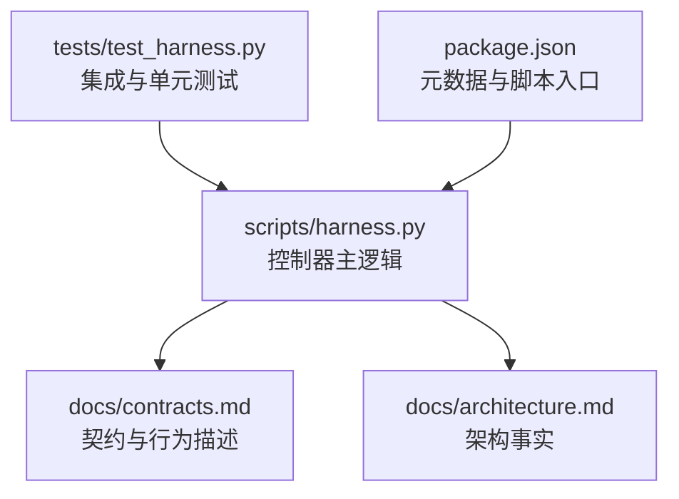
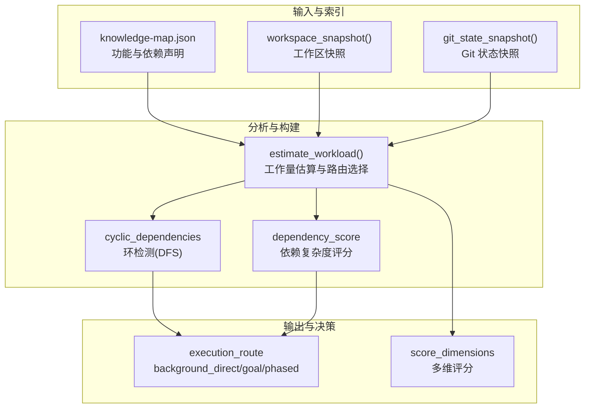
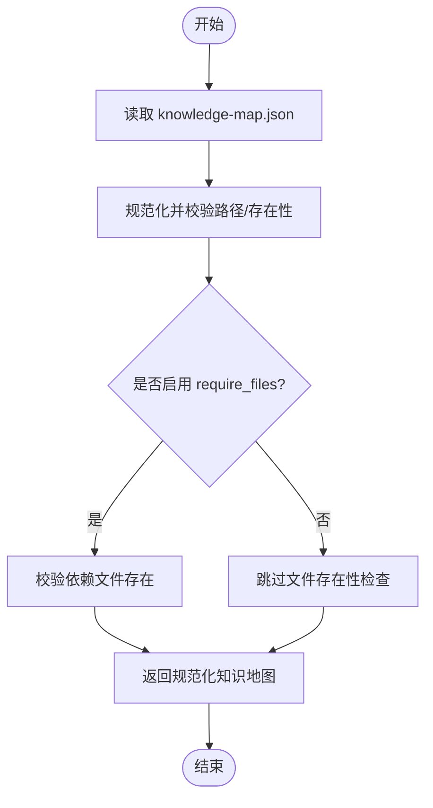
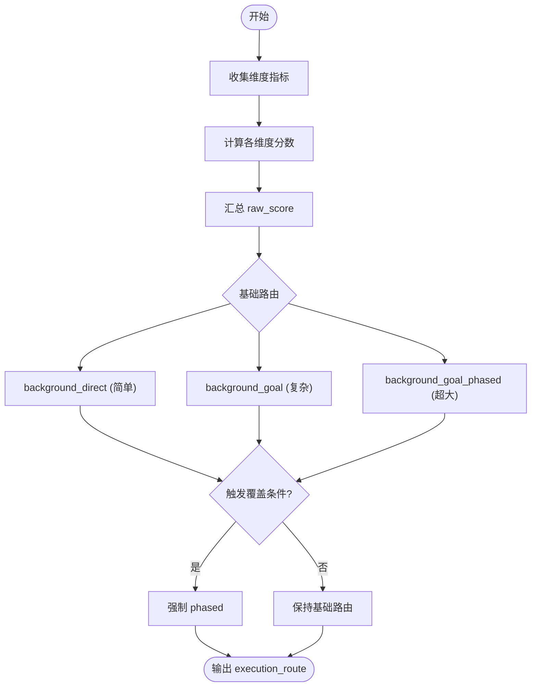
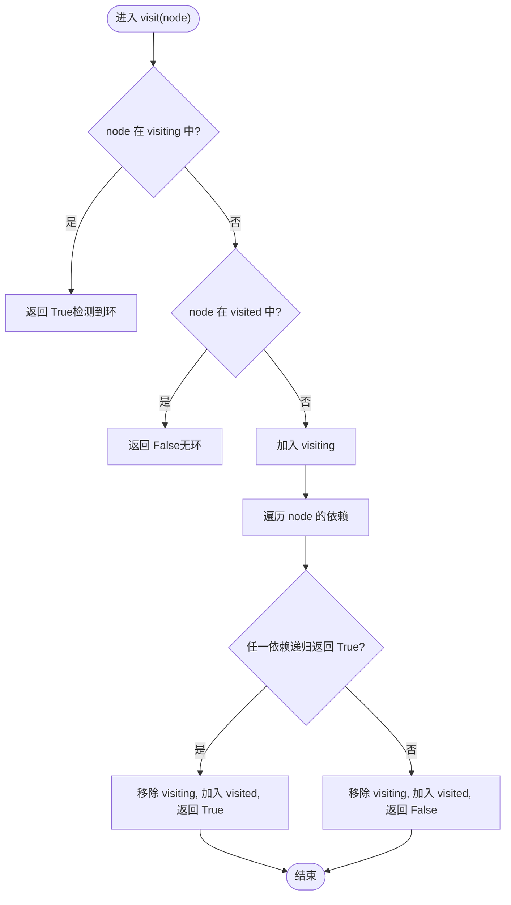
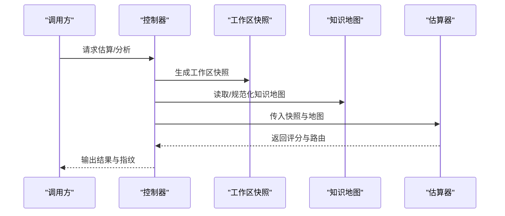
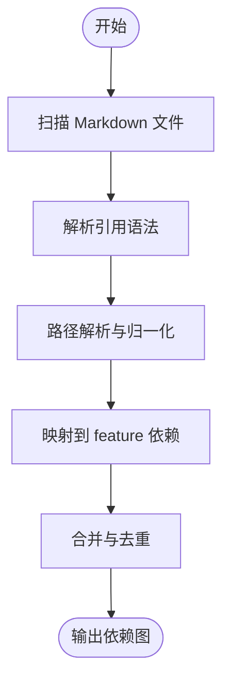
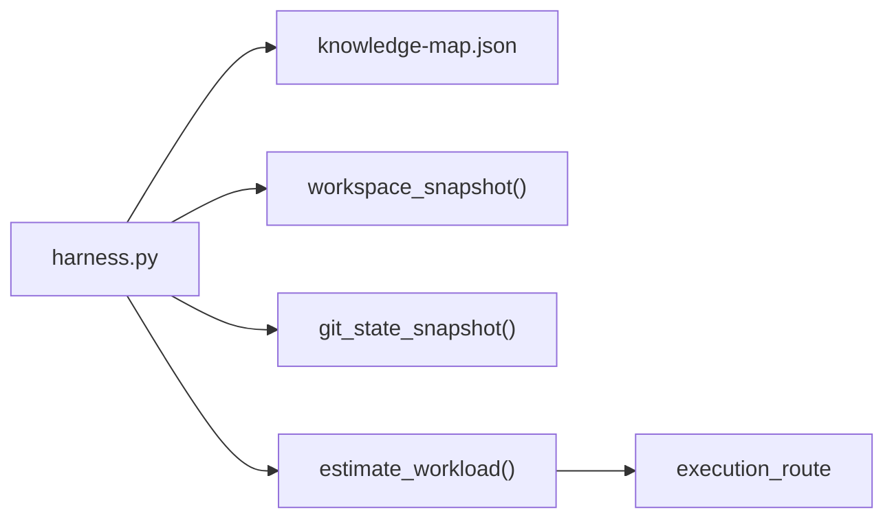

# 依赖分析算法

<cite>
**本文引用的文件**   
- [scripts/harness.py](file://scripts/harness.py)
- [tests/test_harness.py](file://tests/test_harness.py)
- [docs/contracts.md](file://docs/contracts.md)
- [docs/architecture.md](file://docs/architecture.md)
- [package.json](file://package.json)
</cite>

## 目录
1. [简介](#简介)
2. [项目结构](#项目结构)
3. [核心组件](#核心组件)
4. [架构总览](#架构总览)
5. [详细组件分析](#详细组件分析)
6. [依赖关系分析](#依赖关系分析)
7. [性能考量](#性能考量)
8. [故障排查指南](#故障排查指南)
9. [结论](#结论)
10. [附录](#附录)

## 简介
本文件系统化阐述 Docs Harness 的依赖分析算法，覆盖以下关键主题：
- 文件依赖解析：Markdown 引用、跨文件链接与模块关系映射
- 循环依赖检测：深度优先搜索（DFS）与环检测策略
- 依赖图构建：节点表示、边权重计算与拓扑排序
- 增量依赖更新：变更检测与最小化重建策略
- 优化技巧与性能调优
- 具体实现位置与测试用例指引

说明：当前仓库未包含 Markdown 引用解析与跨文件链接的具体实现代码。本节对“文件依赖解析”部分以概念性说明为主，并在需要处标注“概念性内容”。其余章节均基于仓库中的实际源码进行分析与图示。

## 项目结构
Docs Harness 的核心逻辑集中在单一控制器脚本中，配合文档合同与测试套件共同构成完整系统。

**图表来源**
- [scripts/harness.py:1-120](file://scripts/harness.py#L1-L120)
- [docs/contracts.md:1-120](file://docs/contracts.md#L1-L120)
- [docs/architecture.md:1-26](file://docs/architecture.md#L1-L26)
- [tests/test_harness.py:1-120](file://tests/test_harness.py#L1-L120)
- [package.json:1-23](file://package.json#L1-L23)

**章节来源**
- [scripts/harness.py:1-120](file://scripts/harness.py#L1-L120)
- [docs/contracts.md:1-120](file://docs/contracts.md#L1-L120)
- [docs/architecture.md:1-26](file://docs/architecture.md#L1-L26)
- [tests/test_harness.py:1-120](file://tests/test_harness.py#L1-L120)
- [package.json:1-23](file://package.json#L1-L23)

## 核心组件
围绕依赖分析的关键能力由控制器提供，主要包括：
- 知识地图读取与规范化：用于获取功能与依赖声明
- 工作量估算与路由选择：结合依赖复杂度决定执行路线
- 循环依赖检测：基于 DFS 的环发现
- 工作区快照与指纹：支持增量与幂等控制
- Git 状态快照与校验：保障同步与漂移检测

上述能力在控制器中以函数形式组织，并通过常量与配置驱动行为。

**章节来源**
- [scripts/harness.py:1476-1784](file://scripts/harness.py#L1476-L1784)
- [scripts/harness.py:7800-7999](file://scripts/harness.py#L7800-L7999)

## 架构总览
下图展示依赖分析相关组件的交互关系与数据流向。

**图表来源**
- [scripts/harness.py:1476-1784](file://scripts/harness.py#L1476-L1784)
- [scripts/harness.py:7800-7999](file://scripts/harness.py#L7800-L7999)

## 详细组件分析

### 知识地图与依赖声明
- 读取与规范化：从 knowledge-map.json 读取功能列表及其 dependencies 字段，生成特征 ID 到依赖列表的映射
- 路径与存在性校验：可选要求文件存在，确保依赖目标可解析
- 增量就绪判断：根据知识状态决定是否允许增量处理

**图表来源**
- [scripts/harness.py:1497-1598](file://scripts/harness.py#L1497-L1598)

**章节来源**
- [scripts/harness.py:1497-1598](file://scripts/harness.py#L1497-L1598)

### 工作量估算与路由选择
- 维度评分：源码数量、功能候选数、架构域数量、技术栈数量、知识缺口、跨功能依赖
- 依赖复杂度：统计 edges 数量与密度，划分低/中/高
- 路由选择：依据 raw_score 与额外条件（扫描截断、多域、循环依赖、已有文档规模）决定 background_direct / background_goal / background_goal_phased

**图表来源**
- [scripts/harness.py:7830-7928](file://scripts/harness.py#L7830-L7928)

**章节来源**
- [scripts/harness.py:7830-7928](file://scripts/harness.py#L7830-L7928)

### 循环依赖检测（DFS）
- 使用 visiting 与 visited 集合进行有向图环检测
- 若 DFS 过程中遇到已在 visiting 中的节点，则判定存在环
- 结果影响路由选择：当存在循环或不可控依赖时，倾向于选择 phased 路线

**图表来源**
- [scripts/harness.py:7842-7854](file://scripts/harness.py#L7842-L7854)

**章节来源**
- [scripts/harness.py:7842-7854](file://scripts/harness.py#L7842-L7854)

### 依赖图构建与拓扑排序（概念性）
- 节点表示：feature_id
- 边表示：dependencies 列表中的依赖关系
- 权重计算：可按 edges 密度、跨域比例、知识缺口等维度加权
- 拓扑排序：在有环情况下无法得到全序；无环时可进行拓扑排序以确定处理顺序

注意：当前仓库未提供显式的拓扑排序实现，此处为概念性说明。

[本节为概念性内容，不直接分析具体文件]

### 增量依赖更新机制
- 变更检测：通过 workspace_snapshot 与工作区指纹对比识别变化
- 最小化重建：仅对受影响的 feature 与依赖子图进行重建
- 幂等控制：基于 source_fingerprint 与 change_scope_fingerprint 保证重复调用幂等

**图表来源**
- [scripts/harness.py:1476-1598](file://scripts/harness.py#L1476-L1598)
- [scripts/harness.py:7800-7999](file://scripts/harness.py#L7800-L7999)

**章节来源**
- [scripts/harness.py:1476-1598](file://scripts/harness.py#L1476-L1598)
- [scripts/harness.py:7800-7999](file://scripts/harness.py#L7800-L7999)

### 文件依赖解析（概念性）
- Markdown 引用解析：识别 [[link]]、[text](path)、include 指令等
- 跨文件链接处理：相对路径解析、别名映射、根目录归一化
- 模块关系映射：将引用关系转换为 feature 级依赖图

注意：当前仓库未包含该部分的实现代码，以下为概念性流程。

[本节为概念性内容，不直接分析具体文件]

## 依赖关系分析
- 组件耦合：控制器集中管理知识地图、工作区快照、Git 状态与估算逻辑，内聚度高
- 外部依赖：Git CLI、文件系统、JSON 序列化
- 潜在循环：通过 DFS 检测并规避；路由选择对循环场景做降级处理

**图表来源**
- [scripts/harness.py:1476-1784](file://scripts/harness.py#L1476-L1784)
- [scripts/harness.py:7800-7999](file://scripts/harness.py#L7800-L7999)

**章节来源**
- [scripts/harness.py:1476-1784](file://scripts/harness.py#L1476-L1784)
- [scripts/harness.py:7800-7999](file://scripts/harness.py#L7800-L7999)

## 性能考量
- 扫描限制：文件扫描存在上限，超过阈值会触发 truncated 标志并调整路由
- 增量指纹：source_fingerprint 与 change_scope_fingerprint 减少不必要重建
- 缓存与复用：上下文与证据收据按指纹复用，避免重复加载与验证
- I/O 优化：原子写入与批量 JSON 操作降低磁盘压力

[本节为通用指导，不直接分析具体文件]

## 故障排查指南
- 常见错误码：输入无效、合同不一致、状态非法、需要方案/授权/证据、范围/漂移/Gate 变化
- Git 相关：远端漂移、非 fast-forward、LFS/Submodule 不可用
- 知识状态：缺失、审计中、构建中、无效、隔离

参考契约与架构文档中的退出码与约束说明。

**章节来源**
- [docs/contracts.md:350-370](file://docs/contracts.md#L350-L370)
- [docs/architecture.md:1-26](file://docs/architecture.md#L1-L26)

## 结论
Docs Harness 的依赖分析以知识地图为核心，结合工作区与 Git 快照进行多维度评估，通过 DFS 环检测与路由选择保障大规模项目的可控治理。增量指纹与幂等控制提升了效率与稳定性。未来可在 Markdown 引用解析与拓扑排序方面增强，以完善端到端的依赖分析闭环。

[本节为总结性内容，不直接分析具体文件]

## 附录
- 测试要点：任务准入、Git 预检/后检、证据收据、后台 Job 状态机
- 运行方式：通过 package.json 脚本与 unittest 框架执行

**章节来源**
- [tests/test_harness.py:1-120](file://tests/test_harness.py#L1-L120)
- [package.json:1-23](file://package.json#L1-L23)