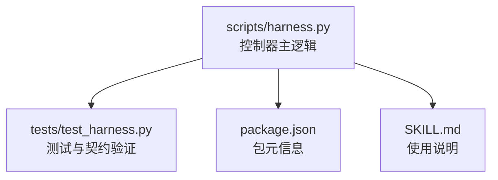
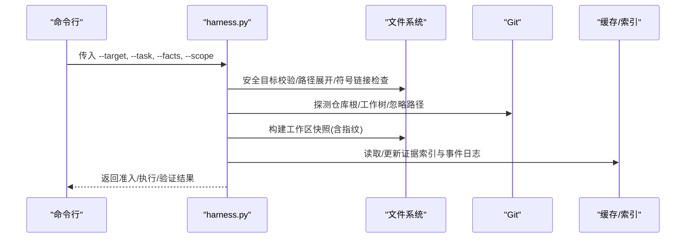
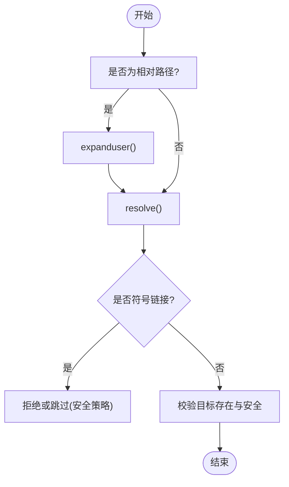
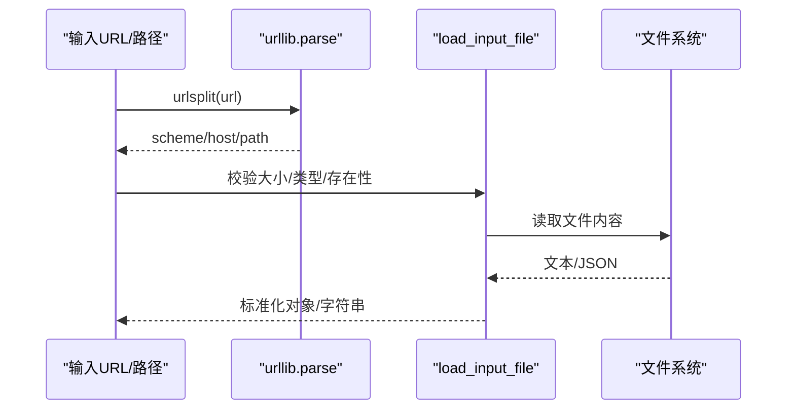
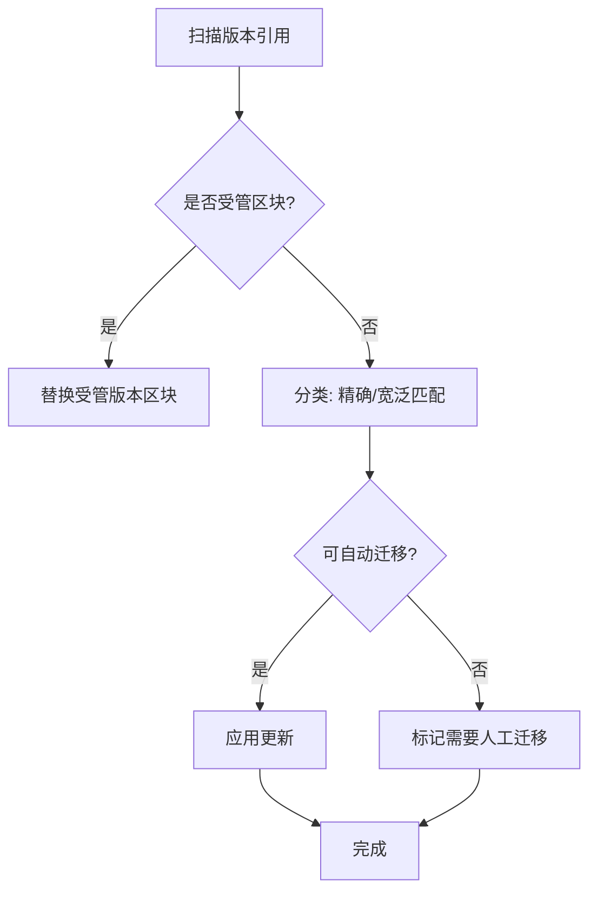
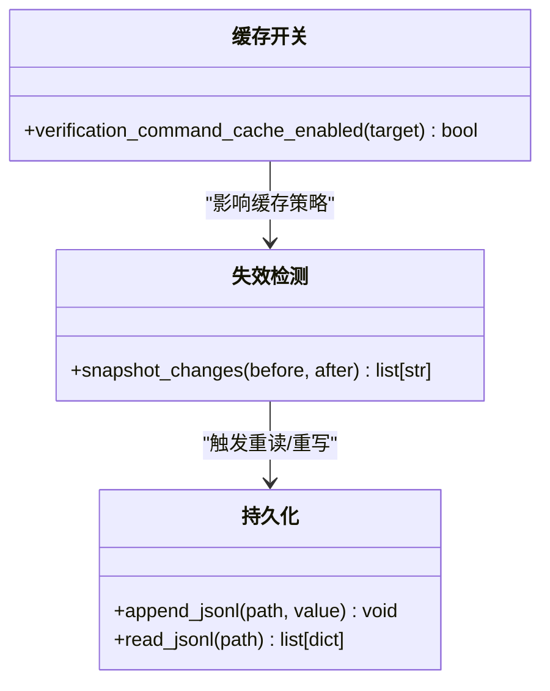
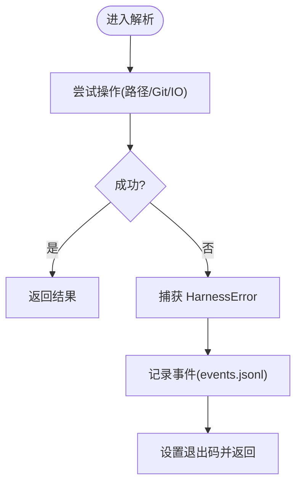
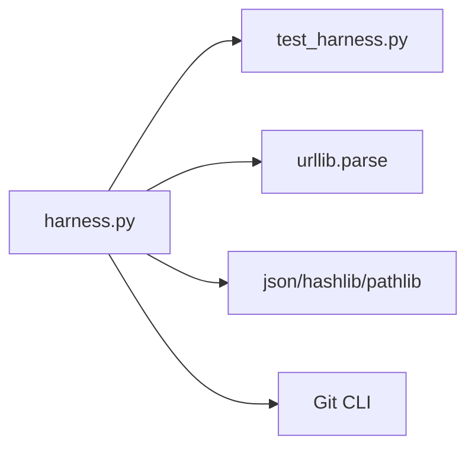

# 引用解析过程

<cite>
**本文引用的文件**   
- [scripts/harness.py](file://scripts/harness.py)
- [tests/test_harness.py](file://tests/test_harness.py)
- [package.json](file://package.json)
- [SKILL.md](file://SKILL.md)
</cite>

## 目录
1. [简介](#简介)
2. [项目结构](#项目结构)
3. [核心组件](#核心组件)
4. [架构总览](#架构总览)
5. [详细组件分析](#详细组件分析)
6. [依赖关系分析](#依赖关系分析)
7. [性能考量](#性能考量)
8. [故障排查指南](#故障排查指南)
9. [结论](#结论)
10. [附录](#附录)

## 简介
本文件系统化阐述 Docs Harness 的“引用解析过程”，覆盖跨文件引用解析、相对/绝对路径与符号链接处理、外部链接校验（HTTP/HTTPS 与本地文件）、版本兼容性检查（语义化版本比较、向后兼容与迁移路径）、引用缓存策略（LRU、失效检测、内存管理），以及错误处理与调试方法。内容基于仓库中的控制器脚本与测试用例，确保与实际实现一致。

## 项目结构
本项目以 Python 控制器为核心，提供任务编排、知识治理、后台作业与验收等能力；引用解析贯穿任务上下文加载、证据索引、Git 元数据快照与工作区指纹计算等环节。关键文件：
- scripts/harness.py：控制器主逻辑，包含路径解析、Git 操作、工作区快照、事件记录、迁移与版本管理等。
- tests/test_harness.py：端到端与契约测试，验证行为与边界条件。
- package.json：包元信息与脚本入口。
- SKILL.md：技能说明与使用约定。

**图表来源** 
- [scripts/harness.py:1-120](file://scripts/harness.py#L1-L120)
- [tests/test_harness.py:1-120](file://tests/test_harness.py#L1-L120)
- [package.json:1-23](file://package.json#L1-L23)
- [SKILL.md:1-106](file://SKILL.md#L1-L106)

**章节来源**
- [scripts/harness.py:1-120](file://scripts/harness.py#L1-L120)
- [package.json:1-23](file://package.json#L1-L23)

## 核心组件
- 路径与文件系统工具
  - 安全目标校验、路径展开与解析、符号链接识别与限制。
  - Git 根目录与工作树探测、忽略路径过滤。
- 工作区快照与指纹
  - 构建工作区快照，排除敏感目录，生成文件指纹或元信息哈希。
- Git 预检与后验
  - 远端引用、分支快进性、LFS/Submodule 可用性校验，变更范围与越界检测。
- 事件与状态锁
  - 原子写入、事件追加、状态锁与过期清理。
- 版本与迁移
  - 受管版本区块更新、旧版索引迁移、v1→v2 任务包迁移与回滚。
- 配置与缓存开关
  - 验证命令缓存开关、易失路径白名单校验。

**章节来源**
- [scripts/harness.py:535-541](file://scripts/harness.py#L535-L541)
- [scripts/harness.py:881-906](file://scripts/harness.py#L881-L906)
- [scripts/harness.py:1115-1138](file://scripts/harness.py#L1115-L1138)
- [scripts/harness.py:800-878](file://scripts/harness.py#L800-L878)
- [scripts/harness.py:1011-1032](file://scripts/harness.py#L1011-L1032)
- [scripts/harness.py:9386-9491](file://scripts/harness.py#L9386-L9491)
- [scripts/harness.py:1153-1188](file://scripts/harness.py#L1153-L1188)
- [scripts/harness.py:1191-1200](file://scripts/harness.py#L1191-L1200)

## 架构总览
下图展示引用解析在任务生命周期中的位置与交互：从输入参数到上下文加载、Git 快照、工作区指纹、证据索引与最终验证。

**图表来源** 
- [scripts/harness.py:535-541](file://scripts/harness.py#L535-L541)
- [scripts/harness.py:881-906](file://scripts/harness.py#L881-L906)
- [scripts/harness.py:1115-1138](file://scripts/harness.py#L1115-L1138)
- [scripts/harness.py:1034-1074](file://scripts/harness.py#L1034-L1074)

## 详细组件分析

### 跨文件引用解析算法
- 相对路径处理
  - 通过 Path.expanduser().resolve() 将相对路径转换为绝对路径，并校验目标存在性与安全性（拒绝根目录与用户主目录）。
  - 对符号链接进行识别与限制，避免越权访问。
- 绝对路径转换
  - 若路径已为绝对路径，直接 resolve；否则以 target 为基准拼接后再 resolve。
- 符号链接解析
  - 多处判断 is_symlink()，并在快照与安装路径中跳过或拒绝不安全的符号链接。
- 文档与规则引用
  - 通过 context_schedule_refs 收集规则与事实引用，用于阶段化上下文加载。

**图表来源** 
- [scripts/harness.py:535-541](file://scripts/harness.py#L535-L541)
- [scripts/harness.py:1115-1138](file://scripts/harness.py#L1115-L1138)
- [scripts/harness.py:881-906](file://scripts/harness.py#L881-L906)

**章节来源**
- [scripts/harness.py:535-541](file://scripts/harness.py#L535-L541)
- [scripts/harness.py:1115-1138](file://scripts/harness.py#L1115-L1138)
- [scripts/harness.py:881-906](file://scripts/harness.py#L881-L906)
- [scripts/harness.py:3130-3144](file://scripts/harness.py#L3130-L3144)

### 外部链接处理机制
- HTTP/HTTPS 链接验证
  - 使用 urllib.parse.urlsplit/urlunsplit 剥离凭据与片段，生成安全指纹，用于远端标识与一致性校验。
- 本地文件链接解析
  - 通过 load_input_file 与 load_json_object_file 统一加载 JSON 文件，支持大小限制与内联输入拒绝。
- 协议兼容性检查
  - 对 URL 进行规范化处理，屏蔽敏感信息，保证指纹稳定。

**图表来源** 
- [scripts/harness.py:588-598](file://scripts/harness.py#L588-L598)
- [scripts/harness.py:459-507](file://scripts/harness.py#L459-L507)

**章节来源**
- [scripts/harness.py:588-598](file://scripts/harness.py#L588-L598)
- [scripts/harness.py:459-507](file://scripts/harness.py#L459-L507)

### 版本兼容性检查与迁移路径
- 语义化版本比较
  - 通过正则匹配 SEMVER_PATTERN 提取版本号，对比当前 VERSION 常量。
- 向后兼容性验证
  - legacy_version_index_state 扫描旧版索引，区分精确匹配与宽泛匹配，决定自动迁移或需人工介入。
- 迁移路径分析
  - v1→v2 任务包迁移：创建 staging/backup，生成 manifest 与 journal，支持中断恢复与全量回滚。
  - 受管版本区块替换：replace_managed_version_block 确保标记完整与唯一。

**图表来源** 
- [scripts/harness.py:9386-9491](file://scripts/harness.py#L9386-L9491)
- [scripts/harness.py:3342-3494](file://scripts/harness.py#L3342-L3494)

**章节来源**
- [scripts/harness.py:9386-9491](file://scripts/harness.py#L9386-L9491)
- [scripts/harness.py:3342-3494](file://scripts/harness.py#L3342-L3494)

### 引用缓存策略（LRU、失效检测、内存管理）
- 验证命令缓存
  - verification_command_cache_enabled 控制是否启用逐项缓存；可通过项目配置关闭。
- 失效检测
  - 通过 snapshot_changes 比较前后工作区快照差异，触发证据刷新或重新验证。
- 内存管理
  - 事件与证据索引采用 JSONL/JSON 持久化，避免大对象驻留内存；快照对大文件仅记录元信息哈希。

**图表来源** 
- [scripts/harness.py:1191-1200](file://scripts/harness.py#L1191-L1200)
- [scripts/harness.py:1141-1142](file://scripts/harness.py#L1141-L1142)
- [scripts/harness.py:510-532](file://scripts/harness.py#L510-L532)

**章节来源**
- [scripts/harness.py:1191-1200](file://scripts/harness.py#L1191-L1200)
- [scripts/harness.py:1141-1142](file://scripts/harness.py#L1141-L1142)
- [scripts/harness.py:510-532](file://scripts/harness.py#L510-L532)

### 错误处理与调试方法
- 错误码与退出码
  - HarnessError 统一封装错误信息、代码与退出码，便于上层处理。
- 常见错误场景
  - 缺少文件、无效 JSON、Git 预检失败、远程不可用、状态锁冲突、迁移中断等。
- 调试手段
  - 事件日志 events.jsonl 记录阶段、耗时、原因码；状态锁 .lock 包含进程 PID 与时间戳；快照指纹用于定位漂移。

**图表来源** 
- [scripts/harness.py:395-400](file://scripts/harness.py#L395-L400)
- [scripts/harness.py:1034-1074](file://scripts/harness.py#L1034-L1074)
- [scripts/harness.py:1011-1032](file://scripts/harness.py#L1011-L1032)

**章节来源**
- [scripts/harness.py:395-400](file://scripts/harness.py#L395-L400)
- [scripts/harness.py:1034-1074](file://scripts/harness.py#L1034-L1074)
- [scripts/harness.py:1011-1032](file://scripts/harness.py#L1011-L1032)

### 具体解析规则与边界情况
- 路径边界
  - 拒绝根目录与用户主目录作为目标；符号链接被识别与限制。
- 文件边界
  - 大文件仅记录元信息哈希；非 Git 工作区快照有文件数量上限。
- Git 边界
  - LFS/Submodule 不可用时阻断；非快进合并被阻止；脏工作区与同步范围重叠被拒绝。
- 配置边界
  - verification.volatile_paths 必须为带固定根目录的 glob，禁止危险字符与越界路径。

**章节来源**
- [scripts/harness.py:535-541](file://scripts/harness.py#L535-L541)
- [scripts/harness.py:1115-1138](file://scripts/harness.py#L1115-L1138)
- [scripts/harness.py:800-878](file://scripts/harness.py#L800-L878)
- [scripts/harness.py:1153-1188](file://scripts/harness.py#L1153-L1188)

## 依赖关系分析
- 模块内依赖
  - harness.py 内部函数高度耦合：路径工具 → 工作区快照 → Git 预检/后验 → 事件记录 → 迁移与版本管理。
- 测试依赖
  - test_harness.py 通过导入 harness 模块并调用其函数，验证契约与行为。
- 外部依赖
  - Git 子进程调用、urllib.parse、json、hashlib、pathlib 等标准库。

**图表来源** 
- [scripts/harness.py:1-120](file://scripts/harness.py#L1-L120)
- [tests/test_harness.py:1-120](file://tests/test_harness.py#L1-L120)

**章节来源**
- [scripts/harness.py:1-120](file://scripts/harness.py#L1-L120)
- [tests/test_harness.py:1-120](file://tests/test_harness.py#L1-L120)

## 性能考量
- 快照优化
  - 大文件仅记录 size+mtime 哈希，减少 I/O 与内存占用。
- 缓存开关
  - 验证命令缓存默认开启，可按需关闭以避免缓存污染。
- 事件与索引
  - JSONL 追加写入，避免全量加载；事件计数用于监控上下文加载与验证轮次。

**章节来源**
- [scripts/harness.py:1115-1138](file://scripts/harness.py#L1115-L1138)
- [scripts/harness.py:1191-1200](file://scripts/harness.py#L1191-L1200)
- [scripts/harness.py:1034-1074](file://scripts/harness.py#L1034-L1074)

## 故障排查指南
- 常见问题
  - 路径不存在或权限不足：检查 safe_target 与 load_input_file 的错误码。
  - Git 操作失败：查看 git_preflight_contract 与 git_postcheck 的 checks 字段。
  - 状态锁冲突：确认 .lock 文件年龄与进程存活。
  - 迁移中断：检查 migration-v1-v2/journal.json 与 backup 目录。
- 调试步骤
  - 查看 events.jsonl 获取阶段与原因码；比对 workspace_snapshot 指纹定位漂移；检查 verification_command_cache_enabled 配置。

**章节来源**
- [scripts/harness.py:535-541](file://scripts/harness.py#L535-L541)
- [scripts/harness.py:800-878](file://scripts/harness.py#L800-L878)
- [scripts/harness.py:1011-1032](file://scripts/harness.py#L1011-L1032)
- [scripts/harness.py:3342-3494](file://scripts/harness.py#L3342-L3494)
- [scripts/harness.py:1034-1074](file://scripts/harness.py#L1034-L1074)

## 结论
Docs Harness 的引用解析过程以安全、稳健与可追溯为核心，通过严格的路径与符号链接处理、完善的 Git 预检/后验、灵活的版本迁移与缓存策略，确保跨文件引用与外部链接的正确性与一致性。结合事件日志与快照指纹，提供强大的调试与故障定位能力。

## 附录
- 相关常量与模式
  - VERSION、SEMVER_PATTERN、RUNTIME_FILES、GATE_DEFS 等定义于 harness.py 顶部。
- 使用约定
  - SKILL.md 描述了任务入口、背景治理与质量账本的使用方式。

**章节来源**
- [scripts/harness.py:26-98](file://scripts/harness.py#L26-L98)
- [SKILL.md:1-106](file://SKILL.md#L1-L106)