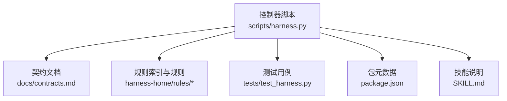
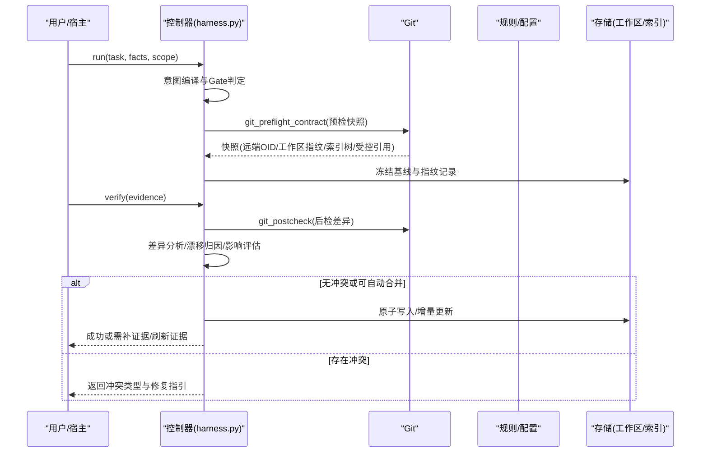
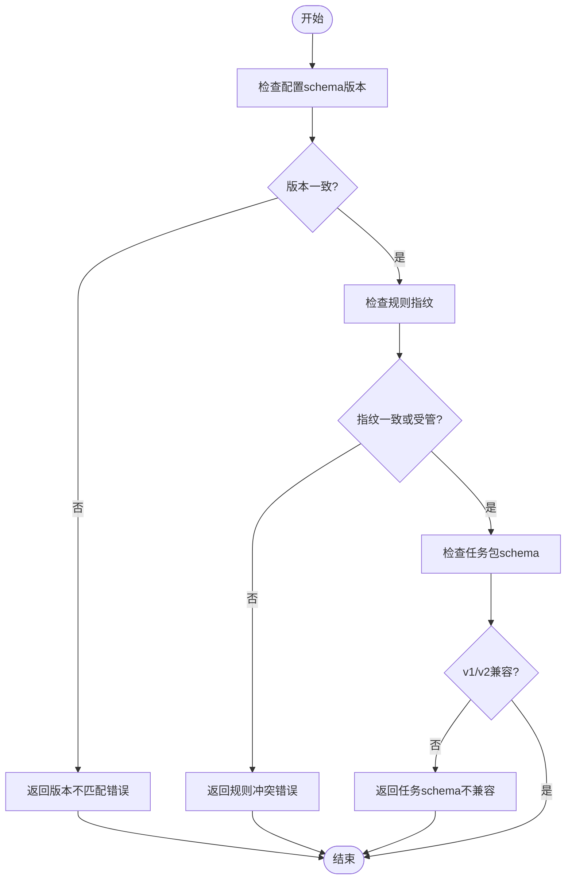
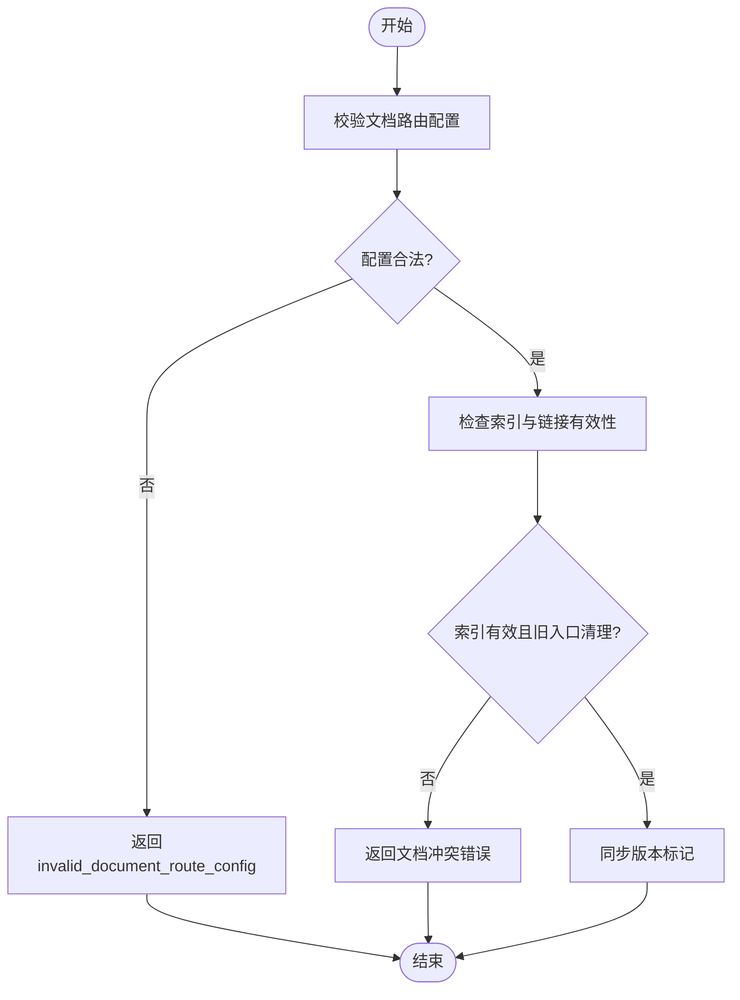
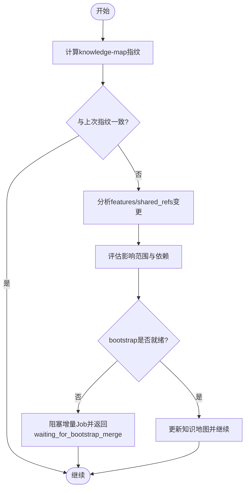
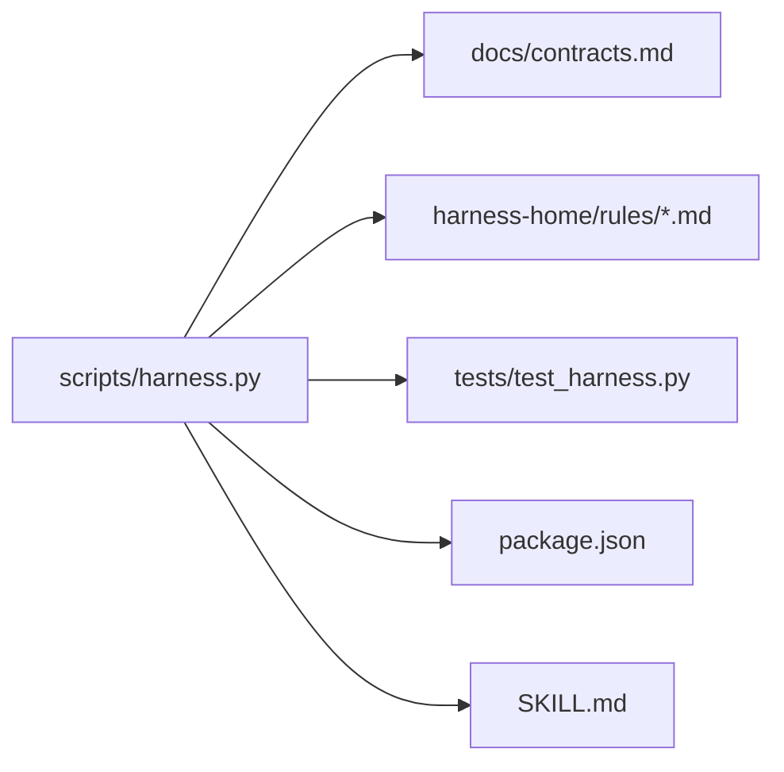

# 冲突解决策略

<cite>
**本文档引用的文件**
- [scripts/harness.py](file://scripts/harness.py)
- [tests/test_harness.py](file://tests/test_harness.py)
- [package.json](file://package.json)
- [SKILL.md](file://SKILL.md)
- [docs/contracts.md](file://docs/contracts.md)
- [harness-home/rules/INDEX.md](file://harness-home/rules/INDEX.md)
- [harness-home/rules/documentation-changes.md](file://harness-home/rules/documentation-changes.md)
</cite>

## 目录
1. [引言](#引言)
2. [项目结构](#项目结构)
3. [核心组件](#核心组件)
4. [架构总览](#架构总览)
5. [详细组件分析](#详细组件分析)
6. [依赖关系分析](#依赖关系分析)
7. [性能考量](#性能考量)
8. [故障排查指南](#故障排查指南)
9. [结论](#结论)
10. [附录](#附录)

## 引言
本文件面向 Docs Harness 的“冲突解决策略”，聚焦三类主要冲突：版本冲突（schema 不匹配）、内容冲突（文档内容不一致）与结构冲突（知识图谱结构变化）。文档从冲突检测算法（指纹比对、差异分析、影响范围评估）、自动合并策略（优先级规则、合并算法、冲突标记生成）、用户干预流程（冲突报告、手动解决指导、恢复机制）、幂等性保证，到预防最佳实践与常见问题解决方案进行系统化说明。所有技术细节均基于仓库中的控制器实现、合同规范与测试用例归纳而来。

## 项目结构
Docs Harness 的核心控制逻辑集中在脚本文件中，配合契约文档、规则索引与测试用例共同构成完整的冲突处理体系。关键位置包括：
- 控制器主脚本：负责任务准入、证据校验、Git 预检/后检、安装与升级、规则指纹管理、工作区漂移归因等
- 契约文档：定义任务包、证据收据、上下文收据、完成清单、Git 状态合同、退出码等
- 规则索引与规则文件：声明生效规则、指纹与 Gate 映射，驱动文档修改类冲突的处理
- 测试用例：覆盖 Git 同步漂移、非快进、脏工作区、LFS/Submodule 不可用、preserve-and-merge 等场景

**图表来源**
- [scripts/harness.py](file://scripts/harness.py)
- [docs/contracts.md](file://docs/contracts.md)
- [harness-home/rules/INDEX.md](file://harness-home/rules/INDEX.md)
- [tests/test_harness.py](file://tests/test_harness.py)
- [package.json](file://package.json)
- [SKILL.md](file://SKILL.md)

**章节来源**
- [scripts/harness.py](file://scripts/harness.py)
- [docs/contracts.md](file://docs/contracts.md)
- [harness-home/rules/INDEX.md](file://harness-home/rules/INDEX.md)
- [tests/test_harness.py](file://tests/test_harness.py)
- [package.json](file://package.json)
- [SKILL.md](file://SKILL.md)

## 核心组件
围绕冲突解决的三大核心能力：
- 指纹与快照：对文件、远程 URL、工作区、规则、配置等进行确定性指纹计算，用于版本与内容一致性校验
- 差异分析与影响评估：通过 Git diff、名称状态解析、受控引用命名空间、删除阈值、LFS/Submodule 可用性检查，识别变更范围与风险
- 自动合并与冲突标记：在可安全合并时执行原子写入；遇到用户改动或非法配置时拒绝覆盖并输出结构化错误与修复指引

关键实现要点：
- 文件指纹与原子写入：确保写入过程幂等且原子化，避免部分写入导致的状态不一致
- Git 预检/后检：锁定目标 OID、工作区指纹、索引树、远端引用，验证 fast-forward、删除数量、脏工作区重叠等
- 规则指纹与配置指纹：安装/升级时对比已安装指纹与当前指纹，发现用户改动即阻断覆盖
- 工作区漂移归因：区分可信写入、并发漂移、未归因漂移，结合 write_scope 判定是否阻断

**章节来源**
- [scripts/harness.py](file://scripts/harness.py)
- [docs/contracts.md](file://docs/contracts.md)

## 架构总览
下图展示冲突检测与处理的端到端流程：输入任务与事实经意图编译与 Gate 判定后进入准入阶段；随后进行 Git 预检与工作区快照；执行过程中产生证据与事件；验收阶段进行差异分析与漂移归因；最终根据冲突类型决定自动合并或要求用户干预。

**图表来源**
- [scripts/harness.py](file://scripts/harness.py)
- [docs/contracts.md](file://docs/contracts.md)

## 详细组件分析

### 版本冲突（schema 不匹配）
版本冲突主要发生在控制器版本、配置 schema 版本、任务包 schema 版本不一致时。控制器通过以下机制检测与处理：
- 控制器版本与配置版本比较：若不一致则报告失败关闭
- 配置 schema_version 校验：仅接受受支持的版本
- 任务包 schema_version 校验：v1/v2 兼容迁移路径明确，v1 在途任务只允许读取与显式迁移
- 规则指纹与安装指纹：安装/升级时对比 installed_rule_fingerprints 与当前规则指纹，发现用户改动即拒绝覆盖

处理策略：
- 失败关闭并返回结构化错误码（如 install_conflict、controller_version_mismatch）
- 提供 preserve-and-merge 指引，要求人工合并用户改动
- 对 v1→v2 迁移提供显式命令与回滚保障

**图表来源**
- [scripts/harness.py](file://scripts/harness.py)
- [docs/contracts.md](file://docs/contracts.md)

**章节来源**
- [scripts/harness.py](file://scripts/harness.py)
- [docs/contracts.md](file://docs/contracts.md)

### 内容冲突（文档内容不一致）
内容冲突体现在文档真源、索引、链接、旧入口清理等方面。规则 DH-DOCUMENTATION-CHANGES 定义了文档修改的适用条件、方案字段、验收条件与失败处理方式。控制器在以下环节检测内容冲突：
- 文档路由配置校验：未知键、错误类型、越界、glob、反斜杠、绝对路径或不存在目标统一报错
- 索引与链接有效性：要求事实有当前证据，索引和链接有效，旧入口不再参与路由
- 版本标记同步：对 docs/INDEX.md 的版本块进行受管替换，保持版本一致性

处理策略：
- 失败关闭并要求补齐迁移清单
- 禁止新旧体系同时生效，必须明确唯一真源
- 支持 preserve-and-merge 以保留用户改动并生成合并计划

**图表来源**
- [harness-home/rules/documentation-changes.md](file://harness-home/rules/documentation-changes.md)
- [scripts/harness.py](file://scripts/harness.py)

**章节来源**
- [harness-home/rules/documentation-changes.md](file://harness-home/rules/documentation-changes.md)
- [scripts/harness.py](file://scripts/harness.py)

### 结构冲突（知识图谱结构变化）
知识图谱结构变化主要体现在 knowledge-map.json 的 features、shared_refs、scope_patterns 等字段变更。控制器通过以下方式检测与处理：
- 知识地图指纹：计算 knowledge_map.json 的文件指纹，作为幂等键的一部分
- 功能文档与共享引用一致性：校验 features 中 documents 与 shared_refs 是否存在且可访问
- 增量 Job 与 bootstrap 依赖：任一非终态 bootstrap 会阻塞增量 Job，只有 bootstrap 成功且控制器复算知识 ready 才释放等待者

处理策略：
- 失败关闭并返回 needs_user_input 或 waiting_for_bootstrap_merge
- 要求先完成 bootstrap 或修正知识地图结构
- 支持 change_scoped 模式下的局部指纹绑定，降低无关变更的影响

**图表来源**
- [scripts/harness.py](file://scripts/harness.py)
- [docs/contracts.md](file://docs/contracts.md)

**章节来源**
- [scripts/harness.py](file://scripts/harness.py)
- [docs/contracts.md](file://docs/contracts.md)

### 冲突检测算法
- 指纹比对：使用 sha256 对文本、文件、JSON、远程 URL（脱敏）进行指纹计算，确保跨环境一致性
- 差异分析：通过 git diff --name-status -M 解析重命名前后的完整路径清单，统计删除数量，判断 fast-forward
- 影响范围评估：结合 write_scope、git_sync_scope、controlled_refs_namespace、高危 Gate（安全、数据破坏、外部发布）判定是否阻断

关键函数与行为：
- file_fingerprint：按块读取文件计算 SHA256
- sanitized_remote_fingerprint：去除用户名、密码、token、查询参数与 fragment 后再哈希
- git_preflight_contract：生成预检快照，包含 repo_identity、remote、preflight_target_oid、index_tree、worktree_fingerprint、controlled_refs_namespace、lfs_available、submodule_available、fast_forward、git_sync_scope、deletion_count 等
- git_postcheck：对比当前工作区指纹与快照指纹，验证 ref 变化是否在受控命名空间内

**章节来源**
- [scripts/harness.py](file://scripts/harness.py)
- [docs/contracts.md](file://docs/contracts.md)

### 自动合并策略
- 优先级规则：用户改动优先于自动覆盖；受管块（managed entry/version）允许自动替换；非法配置直接失败关闭
- 合并算法：对可安全合并的内容执行原子写入（atomic_write_text/atomic_write_json），对规则与脚本采用指纹比对决定是否覆盖
- 冲突标记生成：当检测到用户改动或非法配置时，抛出 HarnessError 并附带 code（如 install_conflict、invalid_document_route_config）与 exit_code，便于上层处理

典型场景：
- 安装/升级时 scripts/harness.py 与规则文件的指纹比对
- document_routes 配置非法时阻止静默保留或覆盖
- 版本标记块的受管替换

**章节来源**
- [scripts/harness.py](file://scripts/harness.py)

### 用户干预流程
- 冲突报告：通过结构化错误响应返回 reason_code、message、exit_code，明确指出冲突类型与位置
- 手动解决指导：提供 preserve-and-merge 指引，要求人工合并用户改动；对文档修改要求明确唯一真源与索引清理
- 恢复机制：支持回滚窗口检查（rollback-check）、v1→v2 迁移回滚、任务取消与归档、任务清理（prune）

关键行为：
- 失败关闭（exit_code=2/3/4）对应不同冲突级别
- 提供 task cancel、task archive、task prune 等受控操作
- 对后台 Job 的 retry、prepare --repair 等恢复手段

**章节来源**
- [docs/contracts.md](file://docs/contracts.md)
- [scripts/harness.py](file://scripts/harness.py)

### 幂等性保证
- 重复执行容错：同一 target、任务文本、事实指纹与工作区快照命中活动任务时返回 active_task_reused，不复建上下文与授权
- 状态一致性维护：冻结基线（freeze.json.workspace_snapshot）不随重新准入刷新；证据与上下文收据按多键复用（task_id、target_identity、stage、compiler_contract、content_set_fingerprint）
- 命令缓存：验证命令按 argv、produces 与输入指纹绑定，输入不变且上次通过则直接复用收据

**章节来源**
- [docs/contracts.md](file://docs/contracts.md)
- [scripts/harness.py](file://scripts/harness.py)

## 依赖关系分析
控制器与契约、规则、测试之间的依赖关系如下：

**图表来源**
- [scripts/harness.py](file://scripts/harness.py)
- [docs/contracts.md](file://docs/contracts.md)
- [harness-home/rules/INDEX.md](file://harness-home/rules/INDEX.md)
- [tests/test_harness.py](file://tests/test_harness.py)
- [package.json](file://package.json)
- [SKILL.md](file://SKILL.md)

**章节来源**
- [scripts/harness.py](file://scripts/harness.py)
- [docs/contracts.md](file://docs/contracts.md)
- [harness-home/rules/INDEX.md](file://harness-home/rules/INDEX.md)
- [tests/test_harness.py](file://tests/test_harness.py)
- [package.json](file://package.json)
- [SKILL.md](file://SKILL.md)

## 性能考量
- 指纹计算采用分块读取，避免大文件一次性加载内存
- Git 操作设置超时与失败快速返回，减少阻塞
- 证据与命令结果缓存减少重复执行开销
- 知识地图与规则指纹比较为 O(n) 线性扫描，n 为文件数量，通常较小

[本节为通用指导，无需特定文件来源]

## 故障排查指南
常见冲突与排查步骤：
- install_conflict：检查 scripts/harness.py 与规则文件是否被用户修改，执行 preserve-and-merge
- invalid_document_route_config：校验 document_routes 路径合法性，移除 glob、反斜杠、绝对路径等非法项
- git_remote_drift / non-fast-forward：确认远端分支状态，必要时重新准入或手动合并
- dirty worktree overlap：清理工作区脏改动，确保与 git_sync_scope 不重叠
- LFS/Submodule 不可用：安装 Git LFS 与 Submodule 工具，或在预检中跳过相关检查

参考测试用例：
- Git 同步漂移、非快进、脏工作区、LFS/Submodule 不可用场景
- preserve-and-merge 安装与升级流程

**章节来源**
- [tests/test_harness.py](file://tests/test_harness.py)
- [scripts/harness.py](file://scripts/harness.py)

## 结论
Docs Harness 的冲突解决策略以指纹比对为核心，结合 Git 差异分析与影响范围评估，实现对版本、内容与结构冲突的精准识别。自动合并策略在安全边界内执行原子写入，对用户改动与非法配置采取失败关闭与结构化错误报告。用户干预流程提供清晰的冲突报告、手动解决指导与恢复机制。幂等性保证确保重复执行的容错与状态一致性。遵循本文的最佳实践可有效预防冲突并提升系统稳定性。

[本节为总结性内容，无需特定文件来源]

## 附录
- 退出码含义：0 成功，1 检查失败，2 输入/合同无效，3 需要方案/证据/迁移，4 范围/漂移/Gate/授权变化需重新准入
- 关键常量与模式：VERSION、TASK_SCHEMA、COMPILED_SCHEMA、EVENT_SCHEMA、EVIDENCE_SCHEMA、FREEZE_SCHEMA、CONFIG_SCHEMA 等
- 规则索引与激活条件：active_rules、rule_id、content_fingerprint、gates、keywords、plan_fields、evidence_types、failure_mode

**章节来源**
- [docs/contracts.md](file://docs/contracts.md)
- [harness-home/rules/INDEX.md](file://harness-home/rules/INDEX.md)
- [scripts/harness.py](file://scripts/harness.py)