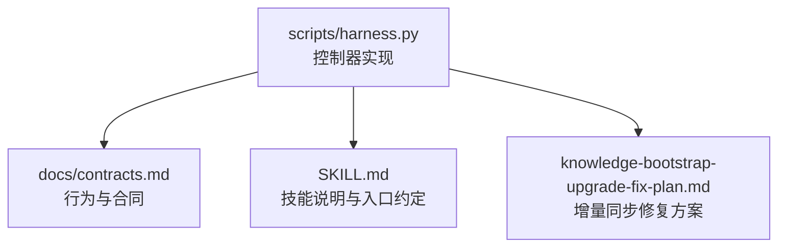
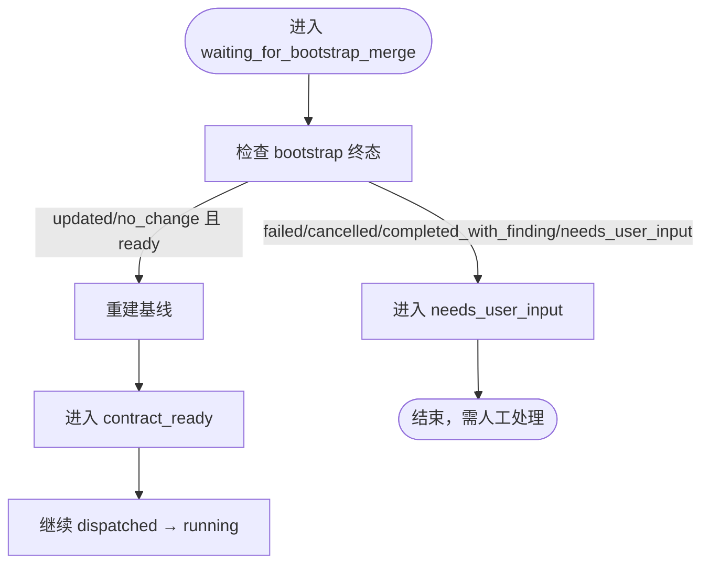
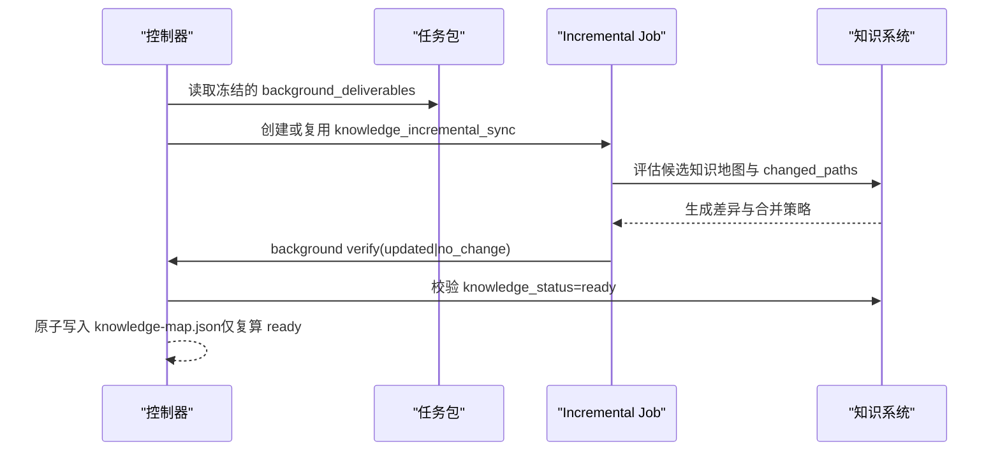
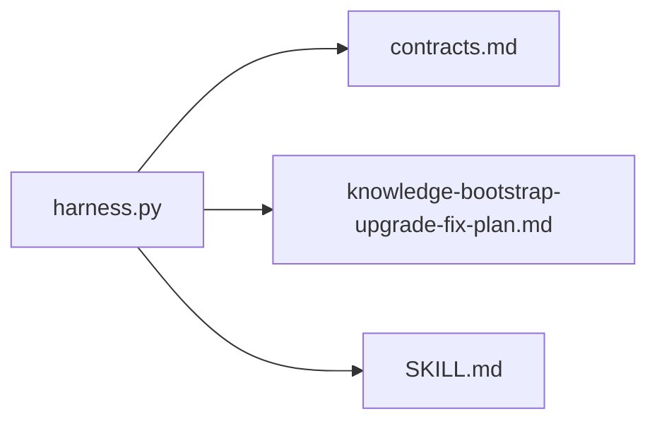

# 增量同步机制

<cite>
**本文引用的文件**   
- [scripts/harness.py](file://scripts/harness.py)
- [docs/contracts.md](file://docs/contracts.md)
- [SKILL.md](file://SKILL.md)
- [docs/plans/knowledge-bootstrap-upgrade-fix-plan.md](file://docs/plans/knowledge-bootstrap-upgrade-fix-plan.md)
</cite>

## 目录
1. [简介](#简介)
2. [项目结构](#项目结构)
3. [核心组件](#核心组件)
4. [架构总览](#架构总览)
5. [详细组件分析](#详细组件分析)
6. [依赖关系分析](#依赖关系分析)
7. [性能考量](#性能考量)
8. [故障排查指南](#故障排查指南)
9. [结论](#结论)
10. [附录](#附录)

## 简介
本文件系统性阐述 Docs Harness 的“增量同步机制”，聚焦 knowledge_incremental_sync 任务的执行流程、触发条件、等待状态处理、冲突解决与验收合同约束，并给出配置选项与调试方法。该机制确保在父任务完成后，仅对实际变更进行知识增量更新，避免不必要的初始化或全量重建；同时在知识库尚未就绪时通过等待与基线重建保证一致性。

## 项目结构
- 控制器源码位于 scripts/harness.py，负责任务准入、上下文、证据、验收、知识生命周期与后台 Job 状态机。
- 行为与合同定义集中于 docs/contracts.md 与 SKILL.md。
- 知识初始化与增量同步修复方案详见 docs/plans/knowledge-bootstrap-upgrade-fix-plan.md。



图表来源
- [scripts/harness.py:1-200](file://scripts/harness.py#L1-L200)
- [docs/contracts.md:1-120](file://docs/contracts.md#L1-L120)
- [SKILL.md:1-105](file://SKILL.md#L1-L105)
- [docs/plans/knowledge-bootstrap-upgrade-fix-plan.md:1-120](file://docs/plans/knowledge-bootstrap-upgrade-fix-plan.md#L1-L120)

章节来源
- [scripts/harness.py:1-200](file://scripts/harness.py#L1-L200)
- [docs/contracts.md:1-120](file://docs/contracts.md#L1-L120)
- [SKILL.md:1-105](file://SKILL.md#L1-L105)
- [docs/plans/knowledge-bootstrap-upgrade-fix-plan.md:1-120](file://docs/plans/knowledge-bootstrap-upgrade-fix-plan.md#L1-L120)

## 核心组件
- 任务包与交付物：父任务 run 阶段冻结 background_deliverables，verify 阶段按交付物逐项消费，未声明则不创建任何后台 Job。
- 知识生命周期：统一判定 bootstrap 活动态与 ready 状态；只有 ready 才允许以 updated/no_change 收尾。
- 增量同步 Job：knowledge_incremental_sync 仅在父任务声明了相应交付物且 changed_paths 非空时创建；若存在非终态 bootstrap，进入 waiting_for_bootstrap_merge 等待。
- 验收与证据：evidence-receipt/v2 与 verification-command-receipt/v1 支持幂等复用与自动归因（可配置）。

章节来源
- [docs/contracts.md:1-120](file://docs/contracts.md#L1-L120)
- [docs/contracts.md:165-221](file://docs/contracts.md#L165-L221)
- [docs/contracts.md:305-346](file://docs/contracts.md#L305-L346)
- [SKILL.md:51-87](file://SKILL.md#L51-L87)

## 架构总览
下图展示父任务完成到知识增量同步的整体流程，包括交付物消费、bootstrap 依赖等待、基线重建与最终验收。

```mermaid
sequenceDiagram
participant Host as "宿主"
participant Controller as "控制器(harness.py)"
participant Parent as "父任务"
participant Bootstrap as "Bootstrap Job"
participant IncSync as "Incremental Sync Job"
Host->>Controller : verify(父任务)
Controller->>Parent : 原子写入 complete
Controller->>Controller : 读取冻结的 background_deliverables
alt 包含 feature_knowledge_incremental_sync
Controller->>IncSync : 创建或复用 knowledge_incremental_sync
opt 存在非终态 bootstrap
IncSync->>IncSync : 进入 waiting_for_bootstrap_merge
Bootstrap-->>IncSync : 终态结果(updated/no_change/failed/cancelled/...)
IncSync->>IncSync : 依赖成功→重建基线→contract_ready
IncSync->>IncSync : 依赖失败→needs_user_input
else 无等待依赖
IncSync->>IncSync : contract_ready → dispatched → running
end
else 未声明或 changed_paths=[]
Controller-->>Host : post_completion=not_required 或 no_write_no_sync
end
IncSync->>Controller : background verify(updated|no_change)
Controller->>Controller : 校验 knowledge_status=ready
Controller-->>Host : 返回验收结果
```

图表来源
- [docs/contracts.md:305-346](file://docs/contracts.md#L305-L346)
- [docs/plans/knowledge-bootstrap-upgrade-fix-plan.md:149-193](file://docs/plans/knowledge-bootstrap-upgrade-fix-plan.md#L149-L193)
- [SKILL.md:87-87](file://SKILL.md#L87-L87)

## 详细组件分析

### 触发条件与变更检测
- 父任务交付物声明：background_deliverables 中显式声明 feature_knowledge_incremental_sync 才会创建增量 Job。
- changed_paths 检测：父任务 changed_paths 为空时返回 no_write_no_sync，不创建增量 Job。
- background_deliverables 消费：verify 先完成父任务，再逐项消费冻结的交付物；未声明则返回 not_required。

章节来源
- [docs/contracts.md:305-346](file://docs/contracts.md#L305-L346)
- [docs/plans/knowledge-bootstrap-upgrade-fix-plan.md:149-168](file://docs/plans/knowledge-bootstrap-upgrade-fix-plan.md#L149-L168)

### 等待状态 waiting_for_bootstrap_merge
- 触发：当存在任意非终态 bootstrap（如 contract_ready、dispatched、running、queued_manual、needs_rebase、needs_user_input）时，增量 Job 进入 waiting_for_bootstrap_merge。
- 依赖管理：等待者绑定同一 bootstrap；依赖成功（updated/no_change 且控制器复算 ready）后重建当前基线，释放为 contract_ready；依赖失败（failed/cancelled/completed_with_finding/needs_user_input）则进入 needs_user_input，不得直接运行。
- 状态转换规则：waiting_for_bootstrap_merge 不允许直接验收为 updated/no_change；必须经依赖成功并重建基线后方可继续。



图表来源
- [docs/plans/knowledge-bootstrap-upgrade-fix-plan.md:172-193](file://docs/plans/knowledge-bootstrap-upgrade-fix-plan.md#L172-L193)
- [SKILL.md:87-87](file://SKILL.md#L87-L87)

章节来源
- [docs/plans/knowledge-bootstrap-upgrade-fix-plan.md:172-193](file://docs/plans/knowledge-bootstrap-upgrade-fix-plan.md#L172-L193)
- [SKILL.md:87-87](file://SKILL.md#L87-L87)

### 增量同步执行流程
- 准入与冻结：run 阶段冻结 background_deliverables，记录 package fingerprint 与 idempotency key。
- 派发与复用：verify 阶段按交付物创建或复用 knowledge_incremental_sync；幂等键一致则复用，不一致则返回 needs_rebase。
- 执行路径：contract_ready → dispatched → running；running 阶段根据 changed_paths 与知识地图候选进行差异分析与合并。
- 验收要求：updated/no_change 均要求 knowledge_status=ready；否则进入 needs_user_input。



图表来源
- [docs/contracts.md:305-346](file://docs/contracts.md#L305-L346)
- [docs/plans/knowledge-bootstrap-upgrade-fix-plan.md:286-307](file://docs/plans/knowledge-bootstrap-upgrade-fix-plan.md#L286-L307)

章节来源
- [docs/contracts.md:305-346](file://docs/contracts.md#L305-L346)
- [docs/plans/knowledge-bootstrap-upgrade-fix-plan.md:286-307](file://docs/plans/knowledge-bootstrap-upgrade-fix-plan.md#L286-L307)

### 冲突解决算法
- 版本冲突：当父任务重新准入导致旧 Job 的 idempotency key 或 package fingerprint 不一致时，返回 needs_rebase，禁止静默复用陈旧 changed_paths。
- 内容冲突：基于 changed_paths 与候选知识地图进行差异分析；若复算为 partial，保留功能文档草稿，Job 进入 needs_user_input，避免中间态。
- 结构冲突：知识地图落盘前按实际功能文档纯读取复算；仅复算 ready 时才原子写入，防止结构漂移。

章节来源
- [docs/plans/knowledge-bootstrap-upgrade-fix-plan.md:286-307](file://docs/plans/knowledge-bootstrap-upgrade-fix-plan.md#L286-L307)
- [docs/contracts.md:305-346](file://docs/contracts.md#L305-L346)

### 验收合同要求
- knowledge_status=ready：所有 knowledge_* Job 的 updated/no_change 均要求最终知识状态为 ready；否则进入 needs_user_input。
- updated/no_change 约束：updated 需先复算候选地图并确认 ready 后才落盘；no_change 可直接收尾但同样要求 ready。
- 父任务完成顺序：verify 先原子写入父任务 complete，再逐项消费 background_deliverables；未声明交付物返回 not_required，changed_paths=[] 返回 no_write_no_sync。

章节来源
- [docs/contracts.md:305-346](file://docs/contracts.md#L305-L346)
- [docs/plans/knowledge-bootstrap-upgrade-fix-plan.md:296-307](file://docs/plans/knowledge-bootstrap-upgrade-fix-plan.md#L296-L307)

### 配置选项与调试方法
- 自动归因：verification.auto_attribute_in_scope=false 关闭自动归因，恢复 provide_evidence 补证据流程。
- 验证命令缓存：verification.command_cache_enabled=false 关闭命令收据缓存，强制重跑验证命令。
- 挥发路径白名单：.docs-harness/config.json 的 verification.volatile_paths 可追加带固定根目录的 glob 白名单，容忍验证期间新建的临时副产物。
- 调试建议：使用 background status/list 查看 Job 状态；project check 获取停滞提醒；run --task-id 单命令完成重新准入并复用已冻结方案。

章节来源
- [docs/contracts.md:165-221](file://docs/contracts.md#L165-L221)
- [SKILL.md:71-81](file://SKILL.md#L71-L81)

## 依赖关系分析
- 控制器与合同：scripts/harness.py 严格遵循 docs/contracts.md 的行为与状态机定义。
- 方案与实现：knowledge-bootstrap-upgrade-fix-plan.md 提供增量同步修复的具体实施范围与验收矩阵，指导控制器修改点。
- 技能说明：SKILL.md 描述入口约定、后台治理与质量账本，与控制器实现保持一致。



图表来源
- [scripts/harness.py:1-200](file://scripts/harness.py#L1-L200)
- [docs/contracts.md:1-120](file://docs/contracts.md#L1-L120)
- [docs/plans/knowledge-bootstrap-upgrade-fix-plan.md:1-120](file://docs/plans/knowledge-bootstrap-upgrade-fix-plan.md#L1-L120)
- [SKILL.md:1-105](file://SKILL.md#L1-L105)

章节来源
- [scripts/harness.py:1-200](file://scripts/harness.py#L1-L200)
- [docs/contracts.md:1-120](file://docs/contracts.md#L1-L120)
- [docs/plans/knowledge-bootstrap-upgrade-fix-plan.md:1-120](file://docs/plans/knowledge-bootstrap-upgrade-fix-plan.md#L1-L120)
- [SKILL.md:1-105](file://SKILL.md#L1-L105)

## 性能考量
- 幂等复用：同一 target、任务文本、事实指纹与工作区快照命中活动任务时返回 active_task_reused，避免重复建立上下文与授权。
- 证据与命令缓存：验证命令输入不变且上次通过则复用收据，减少重复执行；command_cache_enabled=false 可整体关闭。
- 增量扫描：change_scoped 模式下 source_fingerprint 仅绑定范围内文件指纹，降低无关变化影响。

章节来源
- [docs/contracts.md:1-120](file://docs/contracts.md#L1-L120)
- [docs/contracts.md:165-221](file://docs/contracts.md#L165-L221)
- [docs/contracts.md:346-347](file://docs/contracts.md#L346-L347)

## 故障排查指南
- 常见状态：
  - waiting_for_bootstrap_merge：检查 bootstrap 是否处于非终态；依赖失败需人工处理。
  - needs_user_input：知识未 ready 或依赖失败，需用户介入。
  - needs_rebase：父任务重新准入导致幂等键或指纹不一致，需重新准入。
- 诊断步骤：
  - 使用 background status/list 查看 Job 状态与事件。
  - 使用 project check 获取停滞提醒与下一步命令。
  - 检查 .docs-harness/config.json 的配置项（auto_attribute_in_scope、command_cache_enabled、volatile_paths）。
- 恢复策略：
  - 依赖成功：等待 bootstrap 终态并重建基线。
  - 依赖失败：进入 needs_user_input，修复后重试。
  - 幂等键不一致：重新准入并补证。

章节来源
- [docs/plans/knowledge-bootstrap-upgrade-fix-plan.md:172-193](file://docs/plans/knowledge-bootstrap-upgrade-fix-plan.md#L172-L193)
- [docs/contracts.md:305-346](file://docs/contracts.md#L305-L346)
- [SKILL.md:71-81](file://SKILL.md#L71-L81)

## 结论
Docs Harness 的增量同步机制通过严格的交付物声明、变更检测、等待状态管理与验收合同约束，确保知识更新的正确性与一致性。waiting_for_bootstrap_merge 状态有效隔离了 bootstrap 未完成时的风险，基线重建与复算 ready 保证了知识地图的可靠性。配合配置选项与调试方法，可在复杂场景下高效定位与解决问题。

## 附录
- 关键术语：
  - background_deliverables：父任务冻结的后台交付物清单。
  - changed_paths：父任务实际变更的文件路径集合。
  - knowledge_status：知识库状态（ready/needs_audit/needs_bootstrap/partial/failed/quarantined/invalid）。
  - waiting_for_bootstrap_merge：增量 Job 等待 bootstrap 合并的状态。
- 参考命令：
  - background list/status/prepare/dispatch/progress/verify/retry
  - project init/upgrade/check
  - run --task-id（重新准入）

章节来源
- [docs/contracts.md:305-346](file://docs/contracts.md#L305-L346)
- [SKILL.md:71-81](file://SKILL.md#L71-L81)