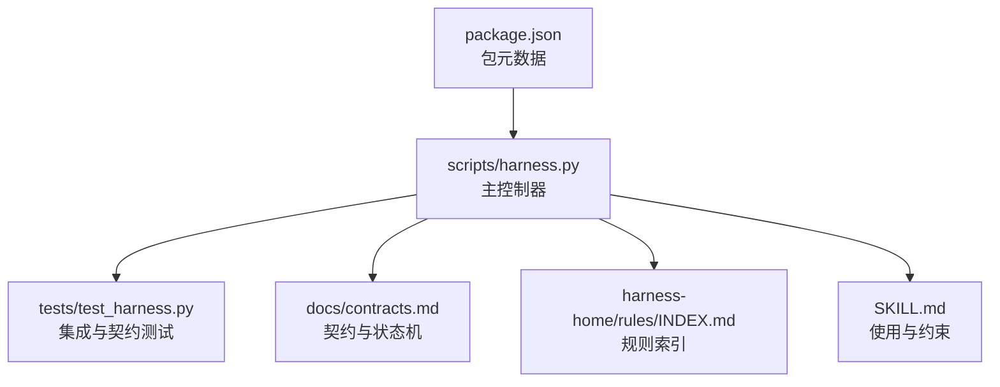
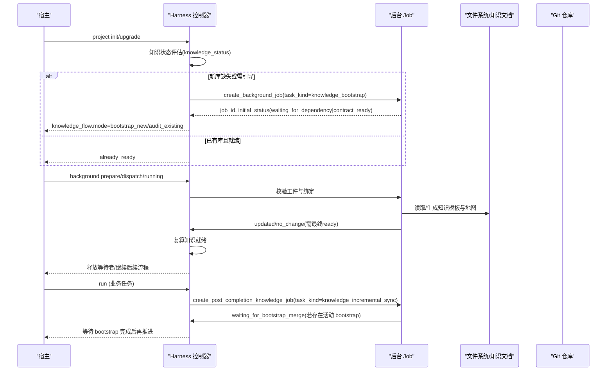
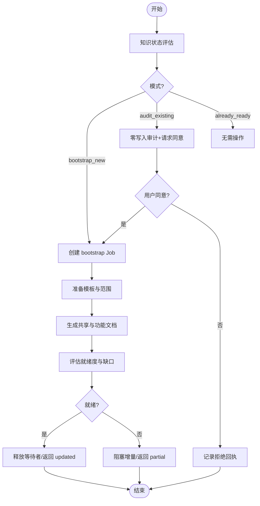
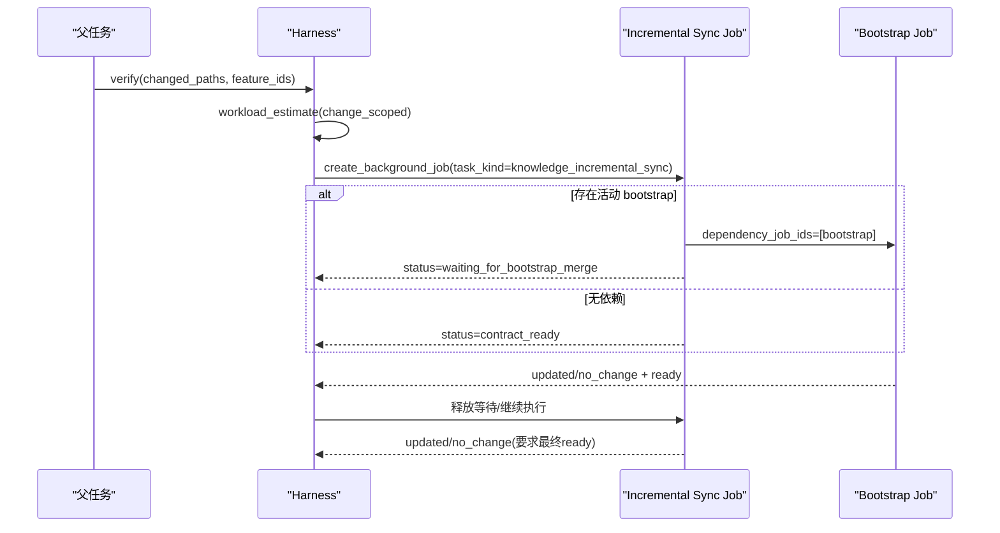
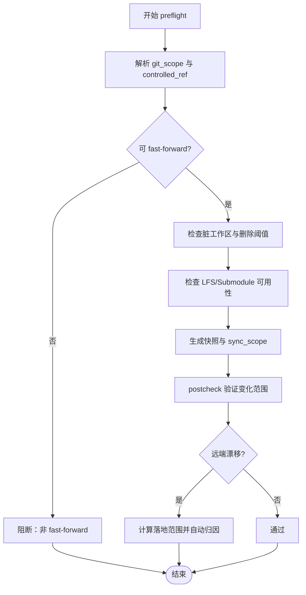
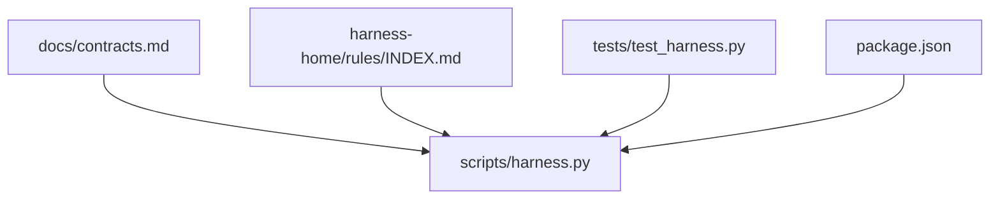

# 引导工作流

<cite>
**本文引用的文件**   
- [scripts/harness.py](file://scripts/harness.py)
- [tests/test_harness.py](file://tests/test_harness.py)
- [docs/contracts.md](file://docs/contracts.md)
- [SKILL.md](file://SKILL.md)
- [harness-home/rules/INDEX.md](file://harness-home/rules/INDEX.md)
- [package.json](file://package.json)
</cite>

## 目录
1. [引言](#引言)
2. [项目结构](#项目结构)
3. [核心组件](#核心组件)
4. [架构总览](#架构总览)
5. [详细组件分析](#详细组件分析)
6. [依赖关系分析](#依赖关系分析)
7. [性能考量](#性能考量)
8. [故障排除指南](#故障排除指南)
9. [结论](#结论)
10. [附录](#附录)

## 引言
本文件系统化阐述 Docs Harness 的“知识引导（knowledge_bootstrap）”与“增量同步（knowledge_incremental_sync）”工作流，覆盖新项目初始化与现有项目升级两种场景，详细说明环境检查、模板准备、内容生成与验证确认等阶段；解释增量同步的变更检测、差异分析与自动合并策略；说明冲突解决（版本冲突、内容冲突、结构冲突）和用户交互流程（确认提示、手动干预、错误恢复）；并提供引导配置的自定义选项与故障排除建议。

## 项目结构
Docs Harness 以独立 Python 控制器为核心，配合规则集、合同文档与测试用例共同构成完整的工作流控制面：
- scripts/harness.py：主控制器，实现任务编排、后台 Job、知识引导与增量同步、Git 交付校验、证据与上下文管理、CLI 命令解析等。
- tests/test_harness.py：覆盖安装、引导、审计、增量同步、Git 预检/后检、验收处置等关键路径。
- docs/contracts.md：契约定义，包括任务包、证据、验收层、Git 状态、Runtime、退出码等。
- harness-home/rules/INDEX.md：生效规则索引与加载约定。
- SKILL.md：技能使用说明与高层行为约束。
- package.json：包元数据与脚本入口。

**图表来源** 
- [scripts/harness.py:10200-10374](file://scripts/harness.py#L10200-L10374)
- [docs/contracts.md:1-120](file://docs/contracts.md#L1-L120)
- [harness-home/rules/INDEX.md:1-41](file://harness-home/rules/INDEX.md#L1-L41)
- [package.json:1-23](file://package.json#L1-L23)

**章节来源**
- [scripts/harness.py:10200-10374](file://scripts/harness.py#L10200-L10374)
- [docs/contracts.md:1-120](file://docs/contracts.md#L1-L120)
- [harness-home/rules/INDEX.md:1-41](file://harness-home/rules/INDEX.md#L1-L41)
- [package.json:1-23](file://package.json#L1-L23)

## 核心组件
- 知识状态评估与交接：负责判断是否已有知识库、是否需要审计或引导，并输出下一步动作与命令。
- 后台 Job 创建与管理：统一创建 knowledge_bootstrap/knowledge_incremental_sync/delivery_governance 等后台任务，维护幂等键、依赖与初始状态。
- Git 预检/后检与漂移处理：对 git_fetch/git_sync 进行范围锁定、快进校验、删除阈值、LFS/Submodule 可用性检查，并在远端漂移时触发重新准入与自动归因。
- 证据与上下文管理：v2 证据收据、声明草案、受管副本、命令缓存与逐项复用、上下文按 stage 与内容指纹复用。
- CLI 命令与路由：project/knowledge/background/task/verify/context/progress/ledger/self-test 等子命令解析与分发。

**章节来源**
- [scripts/harness.py:1600-1800](file://scripts/harness.py#L1600-L1800)
- [scripts/harness.py:7500-7700](file://scripts/harness.py#L7500-L7700)
- [scripts/harness.py:8400-8600](file://scripts/harness.py#L8400-L8600)
- [docs/contracts.md:165-221](file://docs/contracts.md#L165-L221)
- [docs/contracts.md:97-133](file://docs/contracts.md#L97-L133)
- [scripts/harness.py:10200-10374](file://scripts/harness.py#L10200-L10374)

## 架构总览
知识引导与增量同步通过“主任务 + 后台 Job”的双通道协作完成：
- 主任务负责意图识别、Gate 编译、范围绑定、方案冻结、执行与验收。
- 后台 Job 负责知识构建与增量同步，遵循 execution_route（direct/goal/goal_phased），由宿主桥接调度。

**图表来源** 
- [scripts/harness.py:1700-1743](file://scripts/harness.py#L1700-L1743)
- [scripts/harness.py:7500-7594](file://scripts/harness.py#L7500-L7594)
- [scripts/harness.py:8419-8572](file://scripts/harness.py#L8419-L8572)
- [docs/contracts.md:306-348](file://docs/contracts.md#L306-L348)

## 详细组件分析

### 知识引导（knowledge_bootstrap）
- 目标：为项目建立 L2 功能知识库，包含共享事实与按功能分类的产品/研发/测试/设计文档，以及 knowledge-map.json 索引。
- 触发条件：
  - 新项目安装：mode=bootstrap_new，幂等创建单一 bootstrap Job。
  - 已有 docs：mode=audit_existing，零写入审查，需要用户同意后才更新。
- 阶段流程：
  1) 环境检查：knowledge_status 判定 absent/needs_audit/building/partial/ready。
  2) 模板准备：根据 KNOWLEDGE_SCAFFOLD 与 FEATURE_DOC_TEMPLATES 生成骨架。
  3) 内容生成：遍历项目，填充 shared 与 features 文档，产出 knowledge-map.json。
  4) 验证确认：evaluate_candidate_knowledge 基于实际文档复算 ready/partial，并记录 gaps。
- 结果与下游：
  - 成功：updated/no_change 且知识 ready，释放等待的增量 Job。
  - 失败/需输入：进入 needs_user_input/failed/cancelled，阻塞增量同步。

**图表来源** 
- [scripts/harness.py:1667-1743](file://scripts/harness.py#L1667-L1743)
- [scripts/harness.py:9000-9170](file://scripts/harness.py#L9000-L9170)
- [scripts/harness.py:353-367](file://scripts/harness.py#L353-L367)

**章节来源**
- [scripts/harness.py:1667-1743](file://scripts/harness.py#L1667-L1743)
- [scripts/harness.py:9000-9170](file://scripts/harness.py#L9000-L9170)
- [scripts/harness.py:353-367](file://scripts/harness.py#L353-L367)

### 增量同步（knowledge_incremental_sync）
- 目标：在业务任务完成后，仅同步与本次变更相关的功能知识，避免全量重建。
- 触发时机：父任务 verify 后，create_post_completion_knowledge_job 根据 changed_paths 与 selected_features 估算工作量并创建 Job。
- 前置依赖：若存在活动 bootstrap，则初始状态为 waiting_for_bootstrap_merge，直到 bootstrap 成功且知识 ready。
- 变更检测与差异分析：
  - 基于 changed_paths、selected_features、deliverables、allowed_write_scope 计算 idempotency_key 与 source_fingerprint。
  - 过滤无关文件变化，确保 change_scoped 幂等性。
- 自动合并策略：
  - 若 Job 已存在且指纹一致，直接复用；否则新建 attempt。
  - 支持 rebase 与修复（needs_rebase/repair）。
- 完成条件：所有工作包 completed，且最终知识状态为 ready。

**图表来源** 
- [scripts/harness.py:7500-7594](file://scripts/harness.py#L7500-L7594)
- [scripts/harness.py:8419-8572](file://scripts/harness.py#L8419-L8572)

**章节来源**
- [scripts/harness.py:7500-7594](file://scripts/harness.py#L7500-L7594)
- [scripts/harness.py:8419-8572](file://scripts/harness.py#L8419-L8572)

### Git 预检/后检与漂移处理
- 预检（git_preflight_contract）：
  - 校验 fast-forward、删除数量阈值、LFS/Submodule 可用性、脏工作区重叠。
  - 生成 snapshot 与控制引用命名空间，锁定 controlled_ref。
- 后检（git_postcheck）：
  - 验证只允许声明的 refs/objects 变化，HEAD/索引/工作区不变（fetch）；或自动生成变更范围（sync）。
  - 远端漂移时，diff 旧 HEAD→新 HEAD 得到 pull 落盘文件，记入 git_sync_landed_scope 并自动归因。
- 失败关闭：非 fast-forward、分支分歧、危险删除、LFS/Submodule 不可用等均阻断。

**图表来源** 
- [scripts/harness.py:677-791](file://scripts/harness.py#L677-L791)
- [docs/contracts.md:97-133](file://docs/contracts.md#L97-L133)

**章节来源**
- [scripts/harness.py:677-791](file://scripts/harness.py#L677-L791)
- [docs/contracts.md:97-133](file://docs/contracts.md#L97-L133)

### 冲突解决算法
- 版本冲突：
  - v1→v2 迁移：仅允许有限操作，apply 前备份与 staging，中断回滚；存在活动 v2 任务时阻断回滚。
  - Job 幂等键与 attempt 递增：重复调用返回已存在对象，retry 归档当前 attempt 并推进。
- 内容冲突：
  - 证据与上下文按指纹复用；读基线漂移仅失效相关证据并刷新。
  - 验证命令逐项缓存，输入未变不重跑。
- 结构冲突：
  - 治理 Job 的 document_routes 合同漂移进入 needs_rebase/needs_user_input，禁止沿用旧 scope。
  - 后台 Job 业务范围不得覆盖控制面，越界失败关闭。

**章节来源**
- [docs/contracts.md:236-282](file://docs/contracts.md#L236-L282)
- [docs/contracts.md:306-348](file://docs/contracts.md#L306-L348)
- [scripts/harness.py:8419-8572](file://scripts/harness.py#L8419-L8572)

### 用户交互流程
- 确认提示：
  - audit_existing 模式需用户同意才能更新知识内容；declined 回执缓存避免重复询问。
- 手动干预：
  - 能力不足时 Job 置 queued_manual，保留原路线；repair 显式修复损坏工件。
- 错误恢复：
  - provide_evidence/refresh_evidence/retry_verification/incremental_admission/full_readmission 五级处置分层处理。
  - write_scope 内未归因写入默认自动认领（可配置关闭）。

**章节来源**
- [scripts/harness.py:9054-9170](file://scripts/harness.py#L9054-L9170)
- [docs/contracts.md:153-163](file://docs/contracts.md#L153-L163)
- [SKILL.md:53-57](file://SKILL.md#L53-L57)

### 引导配置的自定义选项
- 验证临时路径白名单：verification.volatile_paths 追加带固定根目录的 glob 白名单。
- 自动归因开关：verification.auto_attribute_in_scope=false 恢复补证据流程。
- 验证命令缓存：verification.command_cache_enabled=false 整体关闭复用。
- 知识库存包含：knowledge.inventory_include 显式包含特定路径。

**章节来源**
- [docs/contracts.md:199-221](file://docs/contracts.md#L199-L221)
- [scripts/harness.py:7668-7698](file://scripts/harness.py#L7668-L7698)

## 依赖关系分析
- 控制器与契约：所有状态机、证据类型、Git 状态、Runtime 位置与退出码均严格遵循 contracts.md。
- 规则系统：active rules 指纹与加载约定保证安全与兼容性 Gate 的正确触发。
- 测试覆盖：test_harness.py 覆盖安装、审计、引导、增量同步、Git 预检/后检、验收处置等关键路径。

**图表来源** 
- [docs/contracts.md:1-120](file://docs/contracts.md#L1-L120)
- [harness-home/rules/INDEX.md:1-41](file://harness-home/rules/INDEX.md#L1-L41)
- [tests/test_harness.py:1-120](file://tests/test_harness.py#L1-L120)
- [package.json:1-23](file://package.json#L1-L23)

**章节来源**
- [docs/contracts.md:1-120](file://docs/contracts.md#L1-L120)
- [harness-home/rules/INDEX.md:1-41](file://harness-home/rules/INDEX.md#L1-L41)
- [tests/test_harness.py:1-120](file://tests/test_harness.py#L1-L120)
- [package.json:1-23](file://package.json#L1-L23)

## 性能考量
- 一次计划冻结与上下文去重：范围绑定后同一事务内完成 Gate 编译与计划冻结，避免重复生成。
- 证据与命令缓存：逐项收据与输入指纹缓存，减少重复执行。
- 增量同步幂等：change_scoped 模式下仅绑定变更指纹，无关文件变化不影响幂等键。
- 失败事件结构化：每次 verify 尝试均可从事件复算，定位重复工作来源。

**章节来源**
- [docs/plans/v1.6.4-minimal-systemic-flow-efficiency-plan.md:131-175](file://docs/plans/v1.6.4-minimal-systemic-flow-efficiency-plan.md#L131-L175)
- [docs/contracts.md:199-221](file://docs/contracts.md#L199-L221)
- [scripts/harness.py:7500-7594](file://scripts/harness.py#L7500-L7594)

## 故障排除指南
- 常见错误码与含义：
  - 2：输入、合同、绑定或状态无效。
  - 3：需要方案、授权、证据、迁移、用户输入或 Git 交付。
  - 4：范围、漂移、Gate、远端、授权或规则变化，必须重新准入。
- 典型问题定位：
  - Git 预检失败：检查 fast-forward、删除阈值、LFS/Submodule 可用性。
  - 知识引导阻塞：确认 bootstrap 终态与知识 ready；查看 active bootstrap 与依赖关系。
  - 证据未归因：启用 auto_attribute_in_scope 或提供 v2 收据。
  - 治理 Job 合同漂移：rebase 或用户输入修正 document_routes。

**章节来源**
- [docs/contracts.md:359-370](file://docs/contracts.md#L359-L370)
- [scripts/harness.py:677-791](file://scripts/harness.py#L677-L791)
- [scripts/harness.py:9054-9170](file://scripts/harness.py#L9054-L9170)

## 结论
Docs Harness 的知识引导与增量同步通过严格的契约、幂等设计与分层处置机制，实现了安全、可控且高效的文档治理流水线。新项目初始化与现有项目升级均能在最小干预下完成知识库构建与持续同步，同时保障 Git 交付与证据链的可审计性与可恢复性。

## 附录
- CLI 命令速览：run、context、progress、verify、task、knowledge、background、project、ledger、self-test。
- 关键常量与模式：BACKGROUND_TASK_KINDS、BACKGROUND_TERMINAL_STATES、DELIVERY_LAYER_ORDER、GATE_DEFS。

**章节来源**
- [scripts/harness.py:10200-10374](file://scripts/harness.py#L10200-L10374)
- [scripts/harness.py:115-134](file://scripts/harness.py#L115-L134)
- [scripts/harness.py:260-342](file://scripts/harness.py#L260-L342)