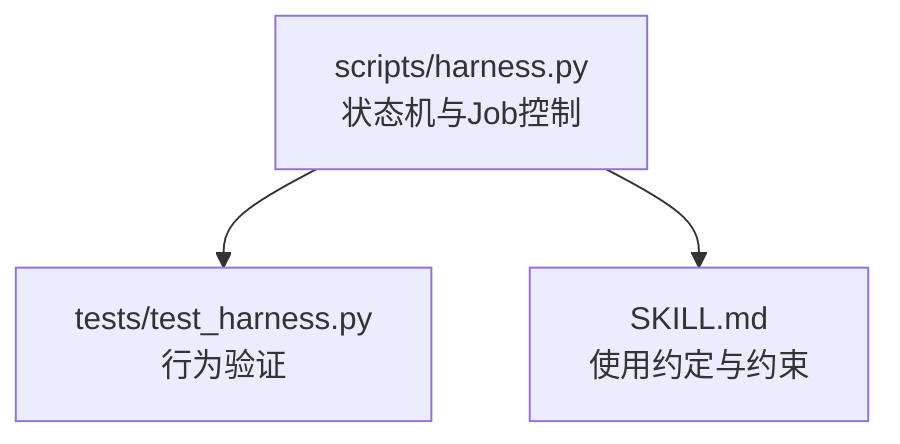
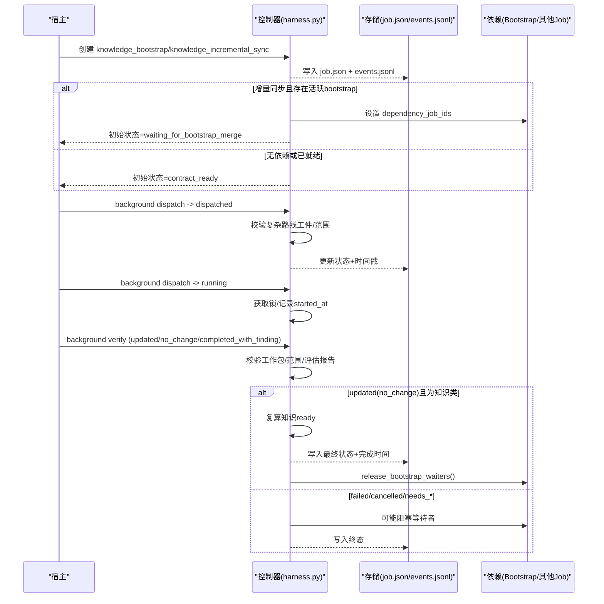
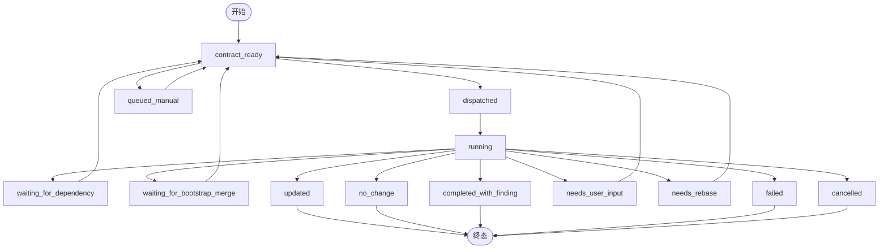
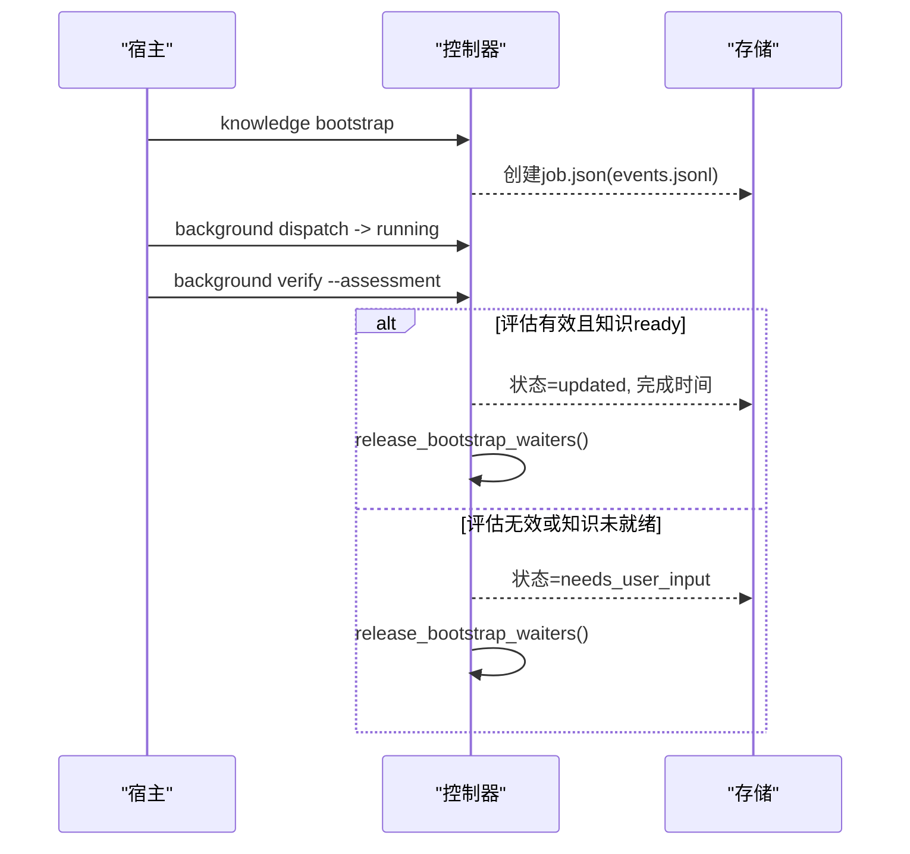
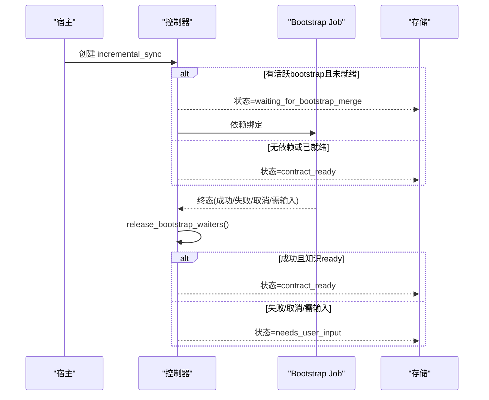
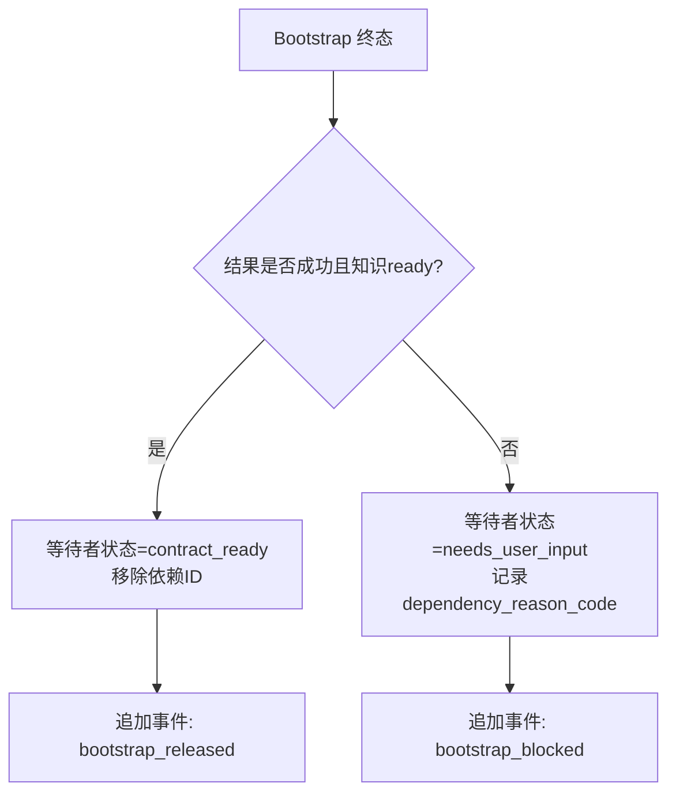
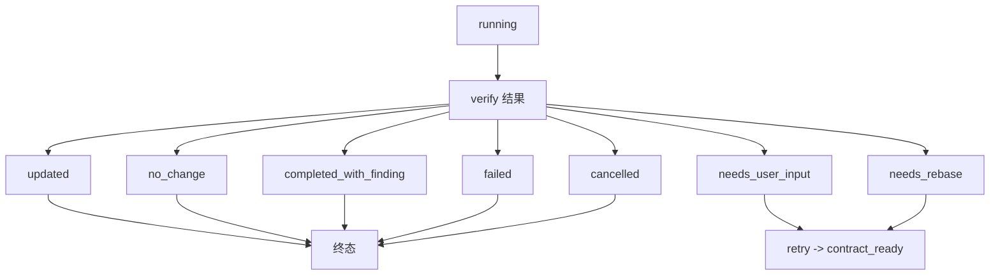
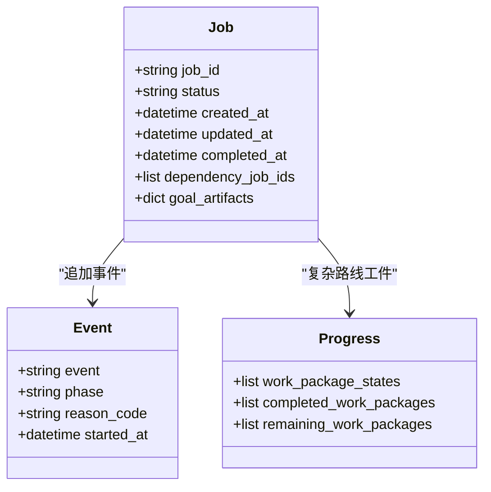
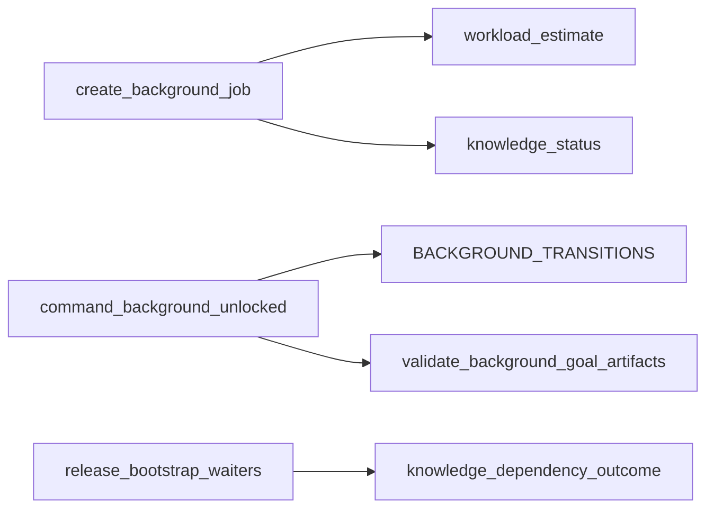

# 状态机管理

<cite>
**本文引用的文件**   
- [harness.py](file://scripts/harness.py)
- [test_harness.py](file://tests/test_harness.py)
- [SKILL.md](file://SKILL.md)
</cite>

## 目录
1. [简介](#简介)
2. [项目结构](#项目结构)
3. [核心组件](#核心组件)
4. [架构总览](#架构总览)
5. [详细组件分析](#详细组件分析)
6. [依赖关系分析](#依赖关系分析)
7. [性能考量](#性能考量)
8. [故障排查指南](#故障排查指南)
9. [结论](#结论)
10. [附录](#附录)

## 简介
本文件面向 Docs Harness 的“知识引导”任务，系统性梳理 knowledge_bootstrap 与 knowledge_incremental_sync 两种后台 Job 的状态机、转换规则、等待机制、终态处理、持久化与恢复能力，以及查询/监控/调试方法。文档以代码为依据，提供可视化图示与可操作的排障指引，帮助读者在不深入源码的情况下也能准确理解并正确使用该状态机。

## 项目结构
- 控制器主逻辑位于 scripts/harness.py，包含后台 Job 生命周期、状态转换、事件记录、锁与工件管理等全部实现。
- tests/test_harness.py 覆盖关键行为（如 waiting_for_bootstrap_merge 的创建与释放）。
- SKILL.md 给出高层使用约定与约束，包括知识模式、验收与治理交付物等。

**图表来源** 
- [harness.py:8404-8416](file://scripts/harness.py#L8404-L8416)
- [test_harness.py:1958](file://tests/test_harness.py#L1958)
- [SKILL.md:60-90](file://SKILL.md#L60-L90)

**章节来源**
- [harness.py:8404-8416](file://scripts/harness.py#L8404-L8416)
- [test_harness.py:1958](file://tests/test_harness.py#L1958)
- [SKILL.md:60-90](file://SKILL.md#L60-L90)

## 核心组件
- 后台任务类型：knowledge_bootstrap、knowledge_incremental_sync、delivery_governance、critical_followup。
- 已知状态集合：contract_ready、dispatched、running、waiting_for_dependency、waiting_for_bootstrap_merge、needs_user_input、needs_rebase、queued_manual、updated、no_change、completed_with_finding、failed、cancelled。
- 终态集合：updated、no_change、completed_with_finding、failed、cancelled。
- 重试允许状态：needs_user_input、needs_rebase、queued_manual。

这些常量与集合定义了状态机的边界与流转规则，是后续所有转换的基础。

**章节来源**
- [harness.py:100-126](file://scripts/harness.py#L100-L126)

## 架构总览
下图展示 knowledge_bootstrap 与 knowledge_incremental_sync 的核心流程与交互点：创建、派发、运行、等待、验收、终态与等待者释放。

**图表来源** 
- [harness.py:8697-8700](file://scripts/harness.py#L8697-L8700)
- [harness.py:8786-8818](file://scripts/harness.py#L8786-L8818)
- [harness.py:9000-9011](file://scripts/harness.py#L9000-L9011)
- [harness.py:9127-9175](file://scripts/harness.py#L9127-L9175)

## 详细组件分析

### 状态机定义与转换规则
- 状态集合与终态集合：定义于模块常量，限定了所有合法状态与终态。
- 转换表 BACKGROUND_TRANSITIONS：明确每个状态的允许下一状态集合。
- 关键约束：
  - 复杂路线（background_goal/background_goal_phased）在进入 dispatched/running 前必须 prepare 并通过工件校验。
  - running 阶段仅允许特定结果（updated/no_change/completed_with_finding/needs_user_input/needs_rebase/failed/cancelled）。
  - 需要用户输入或需变基时，状态转入 needs_user_input/needs_rebase，并保留原因码。

**图表来源** 
- [harness.py:8404-8416](file://scripts/harness.py#L8404-L8416)

**章节来源**
- [harness.py:100-126](file://scripts/harness.py#L100-L126)
- [harness.py:8404-8416](file://scripts/harness.py#L8404-L8416)

### knowledge_bootstrap 任务
- 创建：通过 knowledge bootstrap 命令创建，返回初始状态（通常为 contract_ready），支持幂等合并已有活动 bootstrap。
- 执行：宿主调用 background prepare（如需）、dispatched、running；完成后 verify 提交评估报告。
- 验收：
  - updated：要求评估报告有效且控制器复算知识地图后状态为 ready；否则转入 needs_user_input。
  - no_change：若知识未就绪则转入 needs_user_input。
  - completed_with_finding：生成 critical_followup 子任务。
- 等待者释放：当 bootstrap 失败/取消/需用户输入/需变基时，release_bootstrap_waiters 将依赖它的增量 Job 置为 needs_user_input 并记录原因。

**图表来源** 
- [harness.py:9185-9217](file://scripts/harness.py#L9185-L9217)
- [harness.py:9127-9175](file://scripts/harness.py#L9127-L9175)
- [harness.py:8786-8818](file://scripts/harness.py#L8786-L8818)

**章节来源**
- [harness.py:9185-9217](file://scripts/harness.py#L9185-L9217)
- [harness.py:9127-9175](file://scripts/harness.py#L9127-L9175)
- [harness.py:8786-8818](file://scripts/harness.py#L8786-L8818)

### knowledge_incremental_sync 任务
- 创建：由业务写操作触发，估算工作量后创建。若存在活跃的 bootstrap 且尚未就绪，初始状态设为 waiting_for_bootstrap_merge，并记录 dependency_job_ids。
- 等待机制：只有当依赖的 bootstrap 成功且控制器复算知识 ready，才会被释放为 contract_ready；否则转为 needs_user_input 并记录原因。
- 执行与验收：同 bootstrap 的 verify 流程，但额外检查 changed_paths 与 allowed_write_scope，确保变更在授权范围内。

**图表来源** 
- [harness.py:7714-7769](file://scripts/harness.py#L7714-L7769)
- [harness.py:8786-8818](file://scripts/harness.py#L8786-L8818)

**章节来源**
- [harness.py:7714-7769](file://scripts/harness.py#L7714-L7769)
- [harness.py:8786-8818](file://scripts/harness.py#L8786-L8818)

### 等待状态 waiting_for_bootstrap_merge 的管理
- 依赖监控：incremental_sync 在创建时记录 dependency_job_ids，指向活跃的 bootstrap。
- 自动释放：当 bootstrap 达到终态（成功/失败/取消/需输入/需变基），控制器调用 release_bootstrap_waiters 遍历所有等待者，按结果决定释放为 contract_ready 或阻塞为 needs_user_input。
- 事件追踪：每次释放都会追加事件（bootstrap_released/bootstrap_blocked），便于审计与调试。

**图表来源** 
- [harness.py:8786-8818](file://scripts/harness.py#L8786-L8818)

**章节来源**
- [harness.py:8786-8818](file://scripts/harness.py#L8786-L8818)

### 终态处理逻辑
- 成功完成：updated/no_change/completed_with_finding 均写入 completed_at，并记录背景摘要。
- 失败回滚：failed/cancelled 释放锁，必要时触发等待者阻塞。
- 用户输入请求：needs_user_input/needs_rebase 保留原因码，支持 retry 重新准备与派发。

**图表来源** 
- [harness.py:9000-9011](file://scripts/harness.py#L9000-L9011)
- [harness.py:9127-9175](file://scripts/harness.py#L9127-L9175)

**章节来源**
- [harness.py:9000-9011](file://scripts/harness.py#L9000-L9011)
- [harness.py:9127-9175](file://scripts/harness.py#L9127-L9175)

### 状态持久化机制
- 存储格式：
  - job.json：Job 元数据、状态、时间戳、工件指纹、依赖关系等。
  - events.jsonl：不可变事件日志，记录状态转换、错误、重试、验收等。
  - progress.json/plan.json：复杂路线的工作包进度与方案。
- 更新策略：
  - 原子写入：使用临时文件+替换保证一致性。
  - 锁机制：state_lock 防止并发冲突，超过阈值视为过期锁。
  - 事件追加：append_background_event 追加 JSONL 行，保持顺序与可追溯性。
- 恢复能力：
  - 重启后可从 job.json 与 events.jsonl 重建当前状态。
  - 复杂路线工件损坏可通过 prepare --repair 修复。

**图表来源** 
- [harness.py:1034-1073](file://scripts/harness.py#L1034-L1073)
- [harness.py:8461-8525](file://scripts/harness.py#L8461-L8525)

**章节来源**
- [harness.py:1034-1073](file://scripts/harness.py#L1034-L1073)
- [harness.py:8461-8525](file://scripts/harness.py#L8461-L8525)

### 状态查询、监控与调试
- 查询接口：
  - background list/status：列出/查看 Job 状态。
  - knowledge status：查看知识库状态与相关 Job。
- 监控要点：
  - 关注 events.jsonl 中的 transition_rejected/verify_rejected/bootstrap_blocked 等事件。
  - 检查 job.json 的 status、updated_at、completed_at 与 goal_artifacts 引用。
- 调试建议：
  - 使用 --json 输出结构化结果，便于自动化解析。
  - 对复杂路线，先 prepare 再 dispatch，避免工件不一致。
  - 遇到 waiting_for_bootstrap_merge，确认依赖 bootstrap 的最终状态与知识就绪情况。

**章节来源**
- [harness.py:8821-9176](file://scripts/harness.py#L8821-L9176)
- [test_harness.py:1958](file://tests/test_harness.py#L1958)

## 依赖关系分析
- 组件耦合：
  - create_background_job 负责 Job 创建与初始状态计算，依赖 workload_estimate 与 knowledge_status。
  - command_background_unlocked 处理 dispatch/verify/retry，依赖状态转换表与工件校验。
  - release_bootstrap_waiters 依赖 knowledge_dependency_outcome 判断依赖结果。
- 外部依赖：
  - Git 操作用于快照与校验（fetch/sync/postcheck）。
  - 文件系统原子写入与锁机制保障一致性。

**图表来源** 
- [harness.py:8597-8750](file://scripts/harness.py#L8597-L8750)
- [harness.py:8821-9176](file://scripts/harness.py#L8821-L9176)
- [harness.py:8786-8818](file://scripts/harness.py#L8786-L8818)

**章节来源**
- [harness.py:8597-8750](file://scripts/harness.py#L8597-L8750)
- [harness.py:8821-9176](file://scripts/harness.py#L8821-L9176)
- [harness.py:8786-8818](file://scripts/harness.py#L8786-L8818)

## 性能考量
- 事件追加采用 JSONL 追加写，避免全量重写，提升高并发下的写入性能。
- 快照与指纹计算限制文件大小与数量，防止大仓库导致超时。
- 锁机制设置超时阈值，避免死锁与长时间阻塞。
- 复杂路线工件归档与修复减少重复准备成本。

[本节为通用指导，无需引用具体文件]

## 故障排查指南
- 常见错误码：
  - invalid_background_job_transition：非法状态转换。
  - background_dependency_pending/failed：依赖未完成或失败。
  - knowledge_no_change_without_ready_knowledge：no_change 但知识未就绪。
  - background_goal_artifacts_tampered：工件被篡改。
- 排查步骤：
  - 检查 events.jsonl 中最近的事件，定位失败点。
  - 确认 job.json 的 status、attempt、goal_artifacts 是否与预期一致。
  - 对于 waiting_for_bootstrap_merge，检查依赖 bootstrap 的状态与知识就绪情况。
  - 复杂路线问题优先尝试 prepare --repair。

**章节来源**
- [harness.py:8934-9011](file://scripts/harness.py#L8934-L9011)
- [harness.py:9127-9175](file://scripts/harness.py#L9127-L9175)

## 结论
Docs Harness 的知识引导状态机通过严格的转换表、事件日志与工件校验，确保了 knowledge_bootstrap 与 knowledge_incremental_sync 的可预测性与可恢复性。waiting_for_bootstrap_merge 的依赖监控与自动释放机制，有效解耦了初始化与增量同步的生命周期。结合原子写入、锁机制与事件追踪，系统在高并发与大仓库场景下仍保持稳定。通过提供的查询与调试方法，用户可以快速定位问题并采取纠正措施。

[本节为总结，无需引用具体文件]

## 附录
- 术语表：
  - Bootstrap：知识库初始化任务。
  - Incremental Sync：基于变更的知识库增量同步任务。
  - 工件：plan.json、progress.json 等复杂路线所需文件。
  - 事件：events.jsonl 中的不可变记录。
- 参考命令：
  - background list/status/dispatch/progress/verify/retry
  - knowledge bootstrap/audit/update/status

[本节为补充信息，无需引用具体文件]