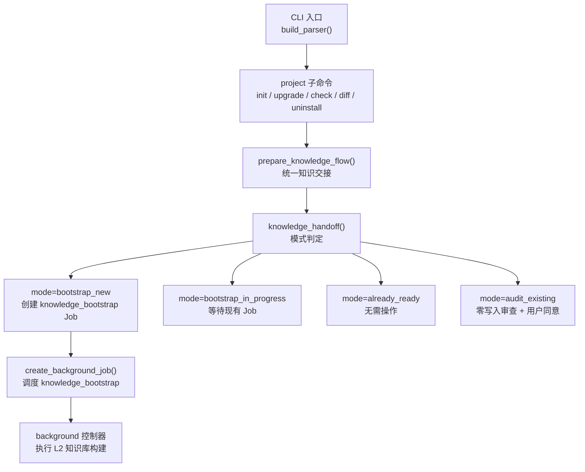
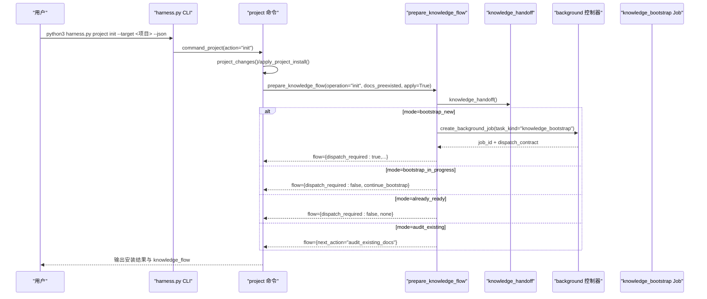
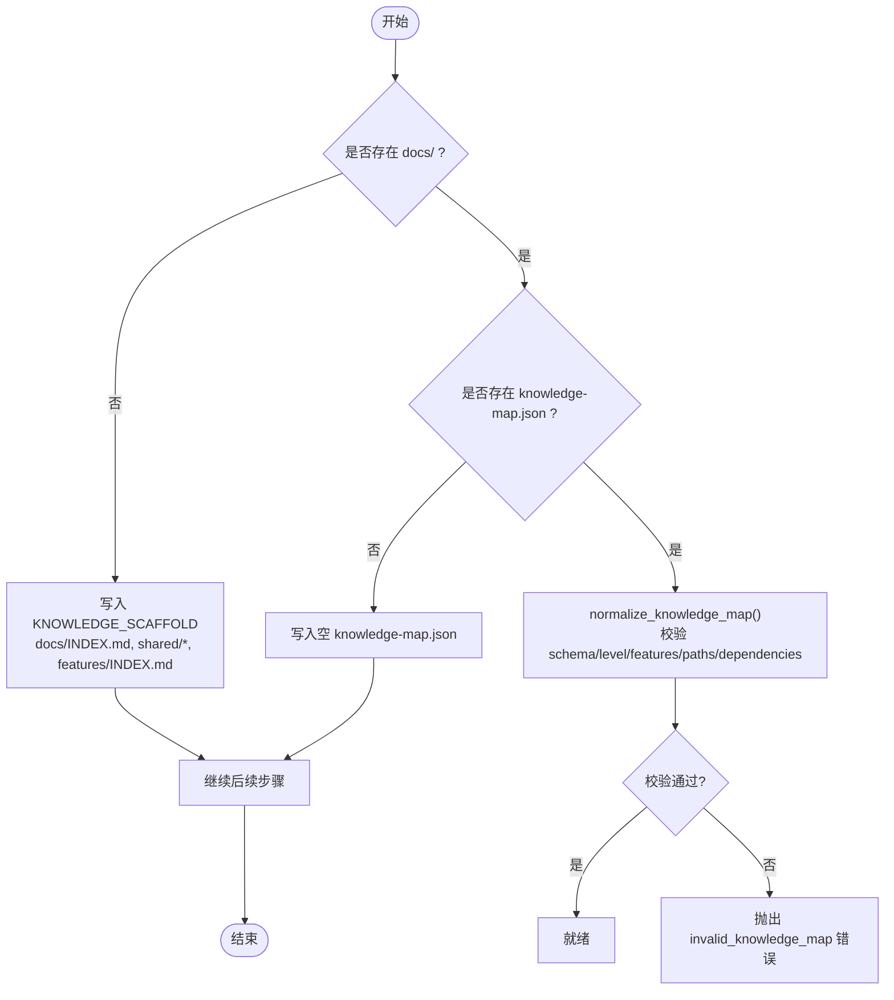
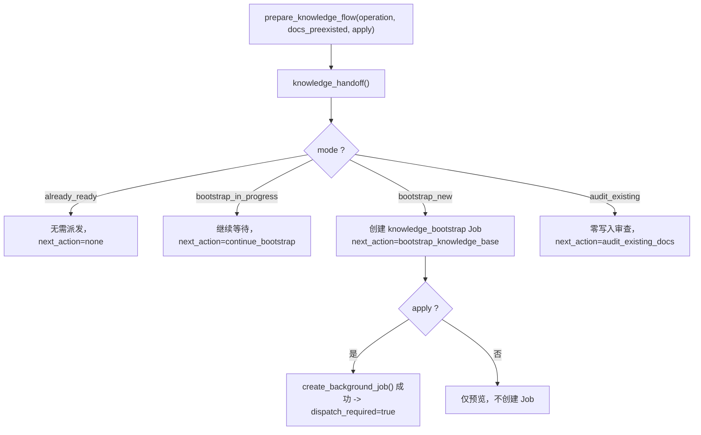
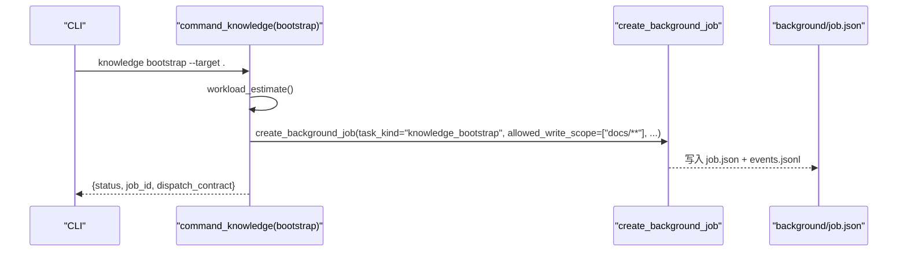
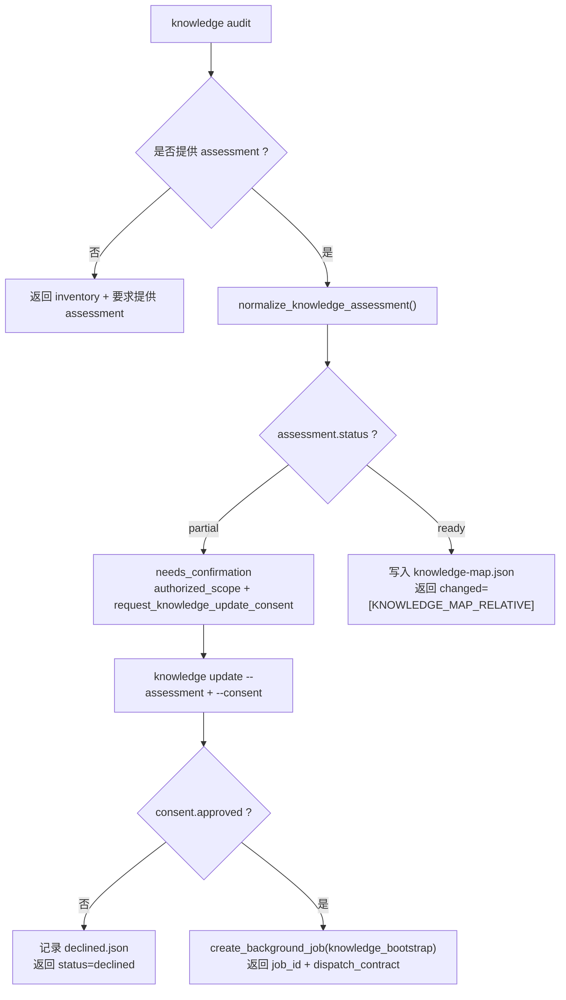
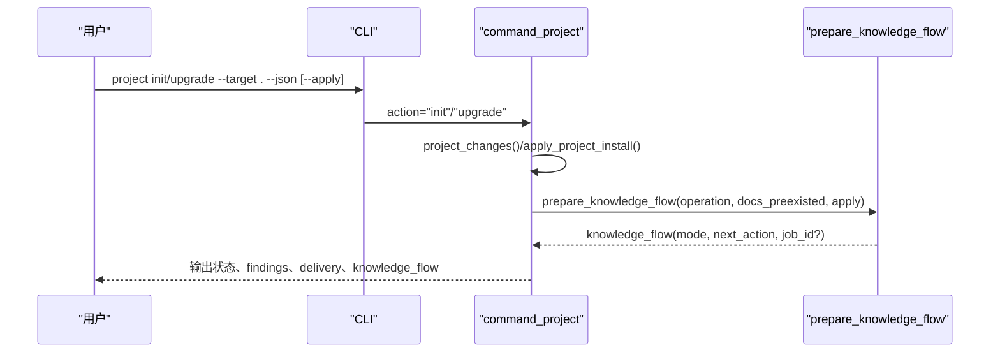
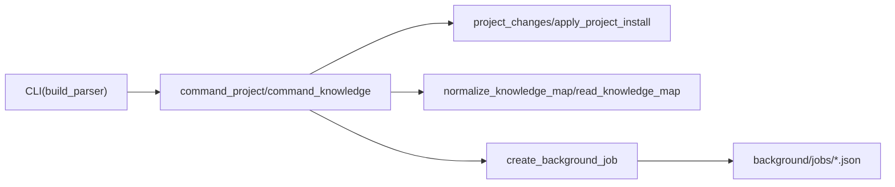

# 知识初始化流程

<cite>
**本文引用的文件**   
- [scripts/harness.py](file://scripts/harness.py)
- [SKILL.md](file://SKILL.md)
- [package.json](file://package.json)
</cite>

## 目录
1. [简介](#简介)
2. [项目结构](#项目结构)
3. [核心组件](#核心组件)
4. [架构总览](#架构总览)
5. [详细组件分析](#详细组件分析)
6. [依赖关系分析](#依赖关系分析)
7. [性能考量](#性能考量)
8. [故障排除指南](#故障排除指南)
9. [结论](#结论)
10. [附录](#附录)

## 简介
本文件系统化阐述 Docs Harness 的知识初始化流程，覆盖新项目安装、最小骨架创建、knowledge_bootstrap 后台任务派发、以及 init/upgrade 命令的统一知识交接机制。重点解释 knowledge_flow 模式判断（bootstrap_new、bootstrap_in_progress、already_ready、audit_existing）、项目状态检测逻辑（docs 目录存在性、knowledge_status 评估、knowledge_map.json 校验）、用户交互流程（审查确认与同意收集）和常见故障排查。

## 项目结构
- scripts/harness.py：控制器主程序，包含 CLI 解析、项目安装/升级、知识审计/引导、后台 Job 管理、Git 预检/后检、工作区快照等全部核心逻辑。
- SKILL.md：技能说明，给出安装与运行入口、行为约定与最佳实践。
- package.json：包元数据与脚本入口。

**图表来源** 
- [scripts/harness.py:9865-10036](file://scripts/harness.py#L9865-L10036)
- [scripts/harness.py:9800-9846](file://scripts/harness.py#L9800-L9846)
- [scripts/harness.py:9002-9171](file://scripts/harness.py#L9002-L9171)

**章节来源**
- [scripts/harness.py:9865-10036](file://scripts/harness.py#L9865-L10036)
- [SKILL.md:1-105](file://SKILL.md#L1-L105)
- [package.json:1-23](file://package.json#L1-L23)

## 核心组件
- 项目安装/升级
  - project_changes：计算需要创建的受管文件、版本标记、规则与配置变更。
  - apply_project_install：原子写入受管文件、复制规则、生成 .docs-harness/config.json，保留已有 docs。
- 知识交接与模式判定
  - prepare_knowledge_flow：根据 operation（init/upgrade）与 docs_preexisted 决定下一步动作，必要时创建 knowledge_bootstrap Job。
  - knowledge_handoff：返回 knowledge_flow.mode（bootstrap_new、bootstrap_in_progress、already_ready、audit_existing）。
- 知识审计与评估
  - command_knowledge(action="audit")：生成 inventory、excluded_summary、explicit_includes，要求宿主提供 assessment；若为 partial，则进入 needs_confirmation 并请求 consent。
  - command_knowledge(action="update")：在已有 docs 的情况下，强制要求 --consent，随后创建 knowledge_bootstrap Job。
- 后台 Job 控制
  - create_background_job：创建 knowledge_bootstrap 或 knowledge_incremental_sync 的后台任务，限定 allowed_read/write_scope。
  - background 控制器：prepare/dispatch/progress/verify/retry 全生命周期管理。

**章节来源**
- [scripts/harness.py:9370-9600](file://scripts/harness.py#L9370-L9600)
- [scripts/harness.py:9800-9846](file://scripts/harness.py#L9800-L9846)
- [scripts/harness.py:9002-9171](file://scripts/harness.py#L9002-L9171)
- [scripts/harness.py:9865-10036](file://scripts/harness.py#L9865-L10036)

## 架构总览
下图展示 init/upgrade 命令如何统一进入知识交接流程，并根据项目现状选择不同分支。

**图表来源** 
- [scripts/harness.py:9865-10036](file://scripts/harness.py#L9865-L10036)
- [scripts/harness.py:9800-9846](file://scripts/harness.py#L9800-L9846)
- [scripts/harness.py:9002-9171](file://scripts/harness.py#L9002-L9171)

## 详细组件分析

### 1) 项目状态检测与最小骨架创建
- docs 目录存在性检查：通过 (target / "docs").is_dir() 判断是否已有文档根。
- knowledge_map.json 校验：read_knowledge_map 读取并 normalize_knowledge_map，校验 schema_version、knowledge_level、features 数组、feature_id 唯一性与 kebab-case、四类文档路径、依赖存在性等。
- 最小骨架：当 docs 不存在或 knowledge-map.json 缺失时，写入 KNOWLEDGE_SCAFFOLD（INDEX.md、shared/*、features/INDEX.md），并创建空 knowledge-map.json。

**图表来源** 
- [scripts/harness.py:9370-9600](file://scripts/harness.py#L9370-L9600)
- [scripts/harness.py:1591-1588](file://scripts/harness.py#L1591-L1588)

**章节来源**
- [scripts/harness.py:9370-9600](file://scripts/harness.py#L9370-L9600)
- [scripts/harness.py:1591-1588](file://scripts/harness.py#L1591-L1588)

### 2) knowledge_flow 模式判断与统一交接
- prepare_knowledge_flow：根据 operation（init/upgrade）与 docs_preexisted 调用 knowledge_handoff 获取 mode，并在 bootstrap_new 模式下创建 knowledge_bootstrap Job。
- knowledge_handoff：依据 active_knowledge_bootstrap 与 knowledge_status 判定 mode：
  - already_ready：知识已 ready，无需操作。
  - bootstrap_in_progress：存在活动 bootstrap Job，继续等待。
  - bootstrap_new：无活动 Job 且未 ready，需派发 bootstrap。
  - audit_existing：已有 docs，先零写入审查，待用户同意后再更新。

**图表来源** 
- [scripts/harness.py:9800-9846](file://scripts/harness.py#L9800-L9846)
- [scripts/harness.py:1696-1724](file://scripts/harness.py#L1696-L1724)

**章节来源**
- [scripts/harness.py:9800-9846](file://scripts/harness.py#L9800-L9846)
- [scripts/harness.py:1696-1724](file://scripts/harness.py#L1696-L1724)

### 3) knowledge_bootstrap 任务创建与执行
- command_knowledge(action="bootstrap")：估算工作量，构造 allowed_write_scope（默认 docs/**），创建 knowledge_bootstrap Job，返回 dispatch_contract。
- create_background_job：设置 task_kind、categories、allowed_read/write_scope、objective、authorization_basis 等，幂等创建并返回 job_id。
- 后台控制器：prepare/dispatch/running/progress/verify/retry 全链路管理，确保最终状态为 ready 才能以 updated/no_change 完成。

**图表来源** 
- [scripts/harness.py:9002-9171](file://scripts/harness.py#L9002-L9171)
- [scripts/harness.py:9800-9846](file://scripts/harness.py#L9800-L9846)

**章节来源**
- [scripts/harness.py:9002-9171](file://scripts/harness.py#L9002-L9171)
- [scripts/harness.py:9800-9846](file://scripts/harness.py#L9800-L9846)

### 4) 知识审计与用户同意流程
- knowledge audit：若无 assessment，返回 inventory/excluded_summary/explicit_includes，并要求宿主提供 assessment 文件。
- 若 assessment.status="partial"，进入 needs_confirmation，返回 authorized_scope 与 next_command_argv=[]，要求宿主提交 consent。
- knowledge update：当 docs_preexisting_at_install=true 时，必须提供 --consent；否则拒绝更新。若 consent.approved=false，记录 declined 回执并返回 status=declined。

**图表来源** 
- [scripts/harness.py:9055-9171](file://scripts/harness.py#L9055-L9171)

**章节来源**
- [scripts/harness.py:9055-9171](file://scripts/harness.py#L9055-L9171)

### 5) init/upgrade 命令的统一知识交接
- init：
  - 检查 Git 忽略列表，阻止对必需文件的忽略。
  - 计算 changes 并应用安装（scripts/harness.py、AGENTS.md、CLAUDE.md、规则、config.json、docs 骨架、knowledge-map.json）。
  - prepare_knowledge_flow(init, docs_preexisted, apply=True)，按 mode 决定是否创建 knowledge_bootstrap Job。
  - 汇总 findings、delivery summary，返回 knowledge_flow 与 next_action。
- upgrade：
  - 支持 preview 与 apply；preview 仅返回 changes/manual_migrations/knowledge_flow。
  - apply 时校验 document_routes 合法性，迁移 v1 background jobs，同步版本标记，再调用 prepare_knowledge_flow(upgrade, docs_preexisted, apply=True)。
  - 根据 findings 与 delivery 状态返回 upgraded/upgraded_knowledge_pending/needs_manual_migration/needs_delivery 等。

**图表来源** 
- [scripts/harness.py:9865-10036](file://scripts/harness.py#L9865-L10036)
- [scripts/harness.py:9800-9846](file://scripts/harness.py#L9800-L9846)

**章节来源**
- [scripts/harness.py:9865-10036](file://scripts/harness.py#L9865-L10036)
- [scripts/harness.py:9800-9846](file://scripts/harness.py#L9800-L9846)

## 依赖关系分析
- 控制器与 CLI：build_parser 定义 run/context/progress/verify/task/ledger/knowledge/background/project/self-test 子命令。
- 项目安装依赖：validate_project_source 校验 VERSION/controller/skill/package 一致性；apply_project_install 写入受管文件与规则指纹。
- 知识地图依赖：normalize_knowledge_map 强校验 schema_version、knowledge_level、features 结构与路径安全。
- 后台 Job 依赖：create_background_job 限制 allowed_read/write_scope，禁止直接写 job.json/plan.json/progress.json/events.jsonl。

**图表来源** 
- [scripts/harness.py:10175-10294](file://scripts/harness.py#L10175-L10294)
- [scripts/harness.py:9370-9600](file://scripts/harness.py#L9370-L9600)
- [scripts/harness.py:1591-1588](file://scripts/harness.py#L1591-L1588)
- [scripts/harness.py:9800-9846](file://scripts/harness.py#L9800-L9846)

**章节来源**
- [scripts/harness.py:10175-10294](file://scripts/harness.py#L10175-L10294)
- [scripts/harness.py:9370-9600](file://scripts/harness.py#L9370-L9600)
- [scripts/harness.py:1591-1588](file://scripts/harness.py#L1591-L1588)
- [scripts/harness.py:9800-9846](file://scripts/harness.py#L9800-L9846)

## 性能考量
- 工作区快照：workspace_snapshot 对非 Git 工作区有文件数量上限（FALLBACK_SNAPSHOT_FILE_LIMIT），避免巨型目录导致性能问题。
- Git 预检/后检：git_preflight_contract/git_postcheck 使用只读命令与超时保护，减少阻塞风险。
- 事件日志：append_task_event/append_jsonl 采用追加写入与 fsync，保证可审计性与持久化。
- 规则加载：load_active_rules 遍历 rules_root/*.md，建议保持规则数量合理，避免过多匹配开销。

[本节为通用指导，不直接分析具体文件]

## 故障排除指南
- Git 忽略安装文件
  - 现象：install/diff/upgrade 报错 git_delivery_ignored。
  - 处理：从 .gitignore 中移除被忽略的必需文件路径，重新执行。
- 非法 document_routes 配置
  - 现象：upgrade/check 报 invalid_document_route_config。
  - 处理：修正 .docs-harness/config.json 中的 background_governance.document_routes，确保类型与路径合法。
- knowledge-map.json 无效
  - 现象：normalize_knowledge_map 抛出 invalid_knowledge_map。
  - 处理：检查 schema_version、knowledge_level、features 数组、feature_id 格式、四类文档路径与依赖。
- 知识审计需要同意
  - 现象：audit 返回 needs_confirmation，要求 --consent。
  - 处理：准备 assessment 与 consent 文件，确保 authorized_scope 与指纹一致。
- 版本标记不一致
  - 现象：findings 报告 managed_entry_version_mismatch 或 knowledge_index_version_mismatch。
  - 处理：执行 upgrade --apply 同步版本标记，或人工修复受管区块。

**章节来源**
- [scripts/harness.py:9865-10036](file://scripts/harness.py#L9865-L10036)
- [scripts/harness.py:9603-9747](file://scripts/harness.py#L9603-L9747)
- [scripts/harness.py:9055-9171](file://scripts/harness.py#L9055-L9171)
- [scripts/harness.py:1591-1588](file://scripts/harness.py#L1591-L1588)

## 结论
Docs Harness 的知识初始化通过统一的 prepare_knowledge_flow 将 init/upgrade 纳入同一交接流程，依据 knowledge_handoff 的模式判断自动派发 knowledge_bootstrap 后台任务或进入审计同意流程。严格的 knowledge-map.json 校验与安全的安装策略确保知识库构建的可控与可审计。遵循本文流程与排障建议，可实现稳定、幂等的知识初始化与升级。

[本节为总结，不直接分析具体文件]

## 附录
- 常用命令参考
  - 安装：python3 scripts/harness.py project init --target <项目> --json
  - 升级：python3 scripts/harness.py project upgrade --target <项目> --json [--apply]
  - 知识审计：python3 scripts/harness.py knowledge audit --target <项目> --assessment <评估文件> --json
  - 知识更新：python3 scripts/harness.py knowledge update --target <项目> --assessment <评估文件> --consent <同意文件> --json
  - 后台 Job：python3 scripts/harness.py background list/status/prepare/dispatch/progress/verify/retry --target <项目> --job-id <job-id> --json

**章节来源**
- [SKILL.md:1-105](file://SKILL.md#L1-L105)
- [scripts/harness.py:10175-10294](file://scripts/harness.py#L10175-L10294)