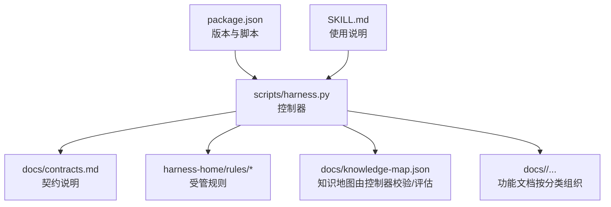
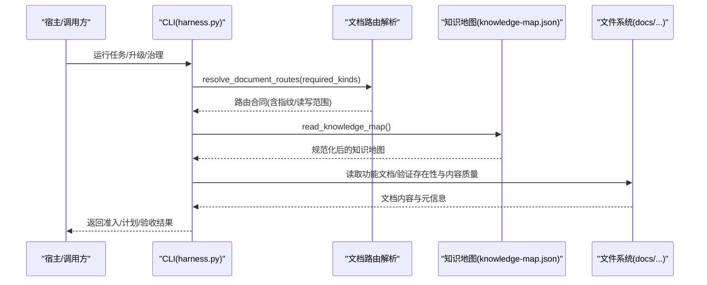
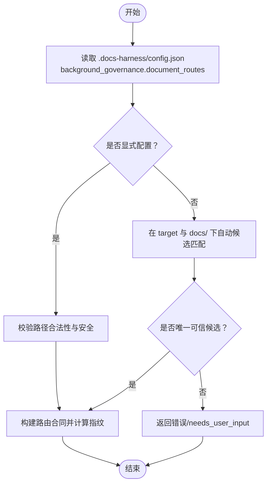
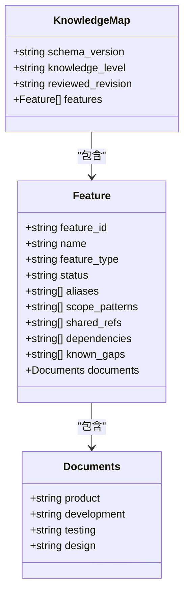
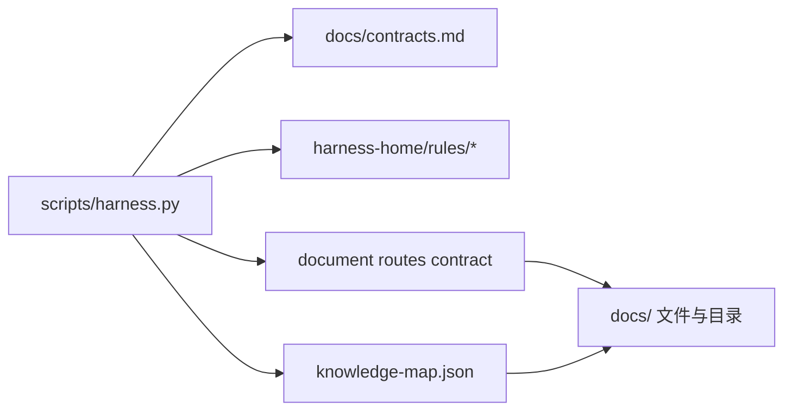

# 文档组织结构

<cite>
**本文引用的文件**   
- [scripts/harness.py](file://scripts/harness.py)
- [docs/contracts.md](file://docs/contracts.md)
- [SKILL.md](file://SKILL.md)
- [package.json](file://package.json)
- [docs/architecture.md](file://docs/architecture.md)
</cite>

## 目录
1. [简介](#简介)
2. [项目结构](#项目结构)
3. [核心组件](#核心组件)
4. [架构总览](#架构总览)
5. [详细组件分析](#详细组件分析)
6. [依赖关系分析](#依赖关系分析)
7. [性能考量](#性能考量)
8. [故障排查指南](#故障排查指南)
9. [结论](#结论)
10. [附录：配置示例与最佳实践](#附录配置示例与最佳实践)

## 简介
本文件系统化阐述 Docs Harness 的“文档组织结构”设计，覆盖以下要点：
- docs 根目录的组织策略、子目录划分逻辑与文件命名约定
- 知识地图 knowledge-map.json 的结构定义（实体类型、关系映射、层次结构维护机制）
- 文档路由系统的设计（DOCUMENT_ROUTE_SCHEMA、路由类型、目录类型的管理）
- 文档分类体系（product、development、testing、design）的应用场景与组织策略
- 实际配置示例与最佳实践建议

该文档面向需要理解并落地 Docs Harness 文档治理与知识管理的工程师与文档负责人。

## 项目结构
Docs Harness 将“控制面（Runtime/契约/CLI）”与“数据面（真实文档/知识地图）”解耦，通过受管合同驱动解析与治理。关键目录与职责如下：
- scripts/harness.py：控制器源码真源，负责任务准入、上下文装配、验收、知识生命周期、后台 Job 状态机与文档路由解析
- docs/：真实知识文档与契约说明所在；包含 contracts.md、architecture.md、testing.md 等
- harness-home/rules/：发布包内受管规则真源，随 project init/upgrade 同步到目标项目的 .docs-harness/harness-home/rules/
- package.json：版本与脚本入口声明
- SKILL.md：对外行为描述与使用指引

图表来源
- [scripts/harness.py:1-100](file://scripts/harness.py#L1-L100)
- [docs/contracts.md:1-120](file://docs/contracts.md#L1-L120)
- [package.json:1-23](file://package.json#L1-L23)
- [SKILL.md:1-105](file://SKILL.md#L1-L105)

章节来源
- [scripts/harness.py:1-120](file://scripts/harness.py#L1-L120)
- [docs/architecture.md:1-26](file://docs/architecture.md#L1-L26)
- [package.json:1-23](file://package.json#L1-L23)
- [SKILL.md:1-105](file://SKILL.md#L1-L105)

## 核心组件
- 文档路由系统：基于 DOCUMENT_ROUTE_SCHEMA 统一解析 architecture、changelog、todo、adr_root、reviews_root 五类路由，支持显式配置与自动候选解析，生成稳定指纹与读写范围
- 知识地图：knowledge-map.json 约束功能清单与四类文档路径，强制 L2 目标、kebab-case feature_id、独立功能目录与依赖一致性校验
- 文档分类体系：product、development、testing、design 四类，作为每个功能的文档维度，用于模板生成、Gate 关联与知识状态评估
- 后台治理与 Job：以 background_* 路线执行，严格区分控制面与数据面写入权限，确保幂等与可审计

章节来源
- [scripts/harness.py:61-124](file://scripts/harness.py#L61-L124)
- [scripts/harness.py:1287-1456](file://scripts/harness.py#L1287-L1456)
- [scripts/harness.py:1501-1588](file://scripts/harness.py#L1501-L1588)
- [docs/contracts.md:303-344](file://docs/contracts.md#L303-L344)

## 架构总览
下图展示控制器、契约、知识地图与文档路由之间的交互关系与数据流。

图表来源
- [scripts/harness.py:1400-1456](file://scripts/harness.py#L1400-L1456)
- [scripts/harness.py:1591-1684](file://scripts/harness.py#L1591-L1684)
- [docs/contracts.md:303-344](file://docs/contracts.md#L303-L344)

## 详细组件分析

### 文档路由系统（DOCUMENT_ROUTE_SCHEMA）
- 路由类型
  - 文件类：architecture、changelog、todo
  - 目录类：adr_root、reviews_root
- 解析流程
  - 优先读取 .docs-harness/config.json 中 background_governance.document_routes 显式配置
  - 未显式配置时，在 target 与 docs/ 下按约定名称自动候选匹配
  - 唯一可信候选方可解析成功；缺失、多候选或不安全（符号链接、越界）将报错或进入 needs_user_input
- 输出与指纹
  - 生成 schema_version=docs-harness/document-routes/v1 的合同对象
  - 计算 fingerprint，用于后续估算、读写 scope、路径锁与类别锁的稳定派生
- 读写范围
  - 文件类 route path 为写范围；目录类 route path/** 为读范围

图表来源
- [scripts/harness.py:1287-1345](file://scripts/harness.py#L1287-L1345)
- [scripts/harness.py:1348-1385](file://scripts/harness.py#L1348-L1385)
- [scripts/harness.py:1388-1456](file://scripts/harness.py#L1388-L1456)

章节来源
- [scripts/harness.py:61-67](file://scripts/harness.py#L61-L67)
- [scripts/harness.py:1287-1456](file://scripts/harness.py#L1287-L1456)
- [docs/contracts.md:303-344](file://docs/contracts.md#L303-L344)

### 知识地图（knowledge-map.json）结构与层次维护
- 顶层字段
  - schema_version：固定为 docs-harness/knowledge-map/v1
  - knowledge_level：必须为 L2
  - reviewed_revision：可选，用于记录审查版本
  - features：功能清单数组
- 功能实体（feature）
  - feature_id：稳定 kebab-case 标识
  - name：人类可读名称
  - documents：四类文档路径映射（product、development、testing、design），必须位于 docs/features/{feature_id}/ 下
  - aliases：别名列表
  - feature_type/status：功能类型与状态
  - scope_patterns/shared_refs/dependencies：作用域模式、共享引用与依赖
  - known_gaps：已知缺口
- 校验与评估
  - 路径安全校验（禁止越界、符号链接）
  - 四类文档必须齐全且存在（可选 require_files）
  - 依赖必须在 features 中存在
  - 评估函数 evaluate_candidate_knowledge 依据文档内容质量判定 ready/partial

图表来源
- [scripts/harness.py:1501-1588](file://scripts/harness.py#L1501-L1588)
- [scripts/harness.py:1621-1635](file://scripts/harness.py#L1621-L1635)

章节来源
- [scripts/harness.py:1501-1588](file://scripts/harness.py#L1501-L1588)
- [scripts/harness.py:1591-1684](file://scripts/harness.py#L1591-L1684)

### 文档分类体系（product、development、testing、design）
- 分类用途
  - 作为每个功能的文档维度，强制四份文档齐全
  - 与 Gate 关联，影响上下文加载与证据要求
  - 提供模板骨架，便于统一结构与内容完整性
- 应用场景
  - 产品事实：用户与场景、主流程、产品边界、事实来源
  - 研发事实：技术流程、模块与公共契约、数据与依赖、异常与恢复
  - 测试事实：验收标准、自动化测试、人工验收、边界与负向场景
  - 设计事实：交互入口与流程、完整状态、组件与文案、可访问性差异

章节来源
- [scripts/harness.py:93-93](file://scripts/harness.py#L93-L93)
- [scripts/harness.py:363-367](file://scripts/harness.py#L363-L367)
- [scripts/harness.py:369-379](file://scripts/harness.py#L369-L379)

### 目录设计与文件命名约定
- 根级文档
  - docs/architecture.md：架构事实
  - docs/testing.md：测试策略与验收
  - docs/contracts.md：契约说明
- 功能文档
  - docs/features/{feature_id}/{category}.md：四类文档分别存放于独立功能目录
- 计划与评审
  - docs/plans/*.md：实施计划
  - docs/reviews/*.md：评审记录
- 命名规范
  - 功能 ID：kebab-case，稳定不可变
  - 文档名：与分类一致（如 product.md、development.md、testing.md、design.md）
  - 路径不得越界、不得使用符号链接

章节来源
- [scripts/harness.py:1555-1557](file://scripts/harness.py#L1555-L1557)
- [docs/architecture.md:1-26](file://docs/architecture.md#L1-L26)

## 依赖关系分析
- 控制器对契约与规则的强依赖
  - 契约：docs/contracts.md 定义任务包、证据、Git 状态、后台治理等
  - 规则：harness-home/rules/* 决定 Gate、证据类型与失败处理
- 路由与知识地图的稳定性
  - 路由合同指纹用于锁定读写范围与锁粒度
  - 知识地图指纹用于增量评估与就绪判断
- 外部依赖
  - Git 操作与快照（fetch/sync/inspect）
  - 文件系统访问（docs/ 与 .docs-harness/）

图表来源
- [scripts/harness.py:1400-1456](file://scripts/harness.py#L1400-L1456)
- [scripts/harness.py:1591-1684](file://scripts/harness.py#L1591-L1684)
- [docs/contracts.md:303-344](file://docs/contracts.md#L303-L344)

章节来源
- [scripts/harness.py:1400-1456](file://scripts/harness.py#L1400-L1456)
- [docs/contracts.md:303-344](file://docs/contracts.md#L303-L344)

## 性能考量
- 路由解析与知识地图评估均为纯读取与轻量校验，复杂度与功能数量线性相关
- 指纹计算采用 SHA-256，避免重复工作区扫描与不必要重入
- 验证命令缓存与证据收据复用减少重复执行
- 变更有界化（change-scoped）降低无关文件变化对幂等键的影响

[本节为通用指导，不直接分析具体文件]

## 故障排查指南
- 文档路由无效或未解析
  - 检查 .docs-harness/config.json 中 background_governance.document_routes 是否合法
  - 确认路径非绝对、无反斜杠、无 glob、不在 .git/.docs-harness 下
  - 文件类需为常规文件，目录类需为目录，且不存在符号链接
- 知识地图校验失败
  - 确保 schema_version 与 knowledge_level=L2
  - 检查 feature_id 格式与唯一性
  - 四类文档路径必须位于 docs/features/{feature_id}/ 下且存在
  - 依赖的 feature_id 必须在 features 中声明
- 知识状态 partial/needs_bootstrap
  - 检查各分类文档内容质量（正文长度、占位符）
  - 若尚未建立功能清单，先创建 knowledge-map.json 并填充 features

章节来源
- [scripts/harness.py:1287-1345](file://scripts/harness.py#L1287-L1345)
- [scripts/harness.py:1526-1588](file://scripts/harness.py#L1526-L1588)
- [scripts/harness.py:1621-1635](file://scripts/harness.py#L1621-L1635)

## 结论
Docs Harness 通过严格的契约与受管规则，将文档路由与知识地图纳入统一的治理框架。文档分类体系与目录约定确保了知识的结构化与可演进；路由系统保证了对真实文档的唯一可信定位与稳定的读写范围。遵循本文档的组织策略与最佳实践，可在复杂项目中实现高可靠、可审计的文档治理与知识管理。

[本节为总结性内容，不直接分析具体文件]

## 附录：配置示例与最佳实践

### 文档路由配置示例
- 显式配置（推荐）
  - 在 .docs-harness/config.json 的 background_governance.document_routes 中声明 architecture、changelog、todo、adr_root、reviews_root 的路径
  - 路径必须是项目内相对 POSIX 路径，文件类为文件，目录类为目录，不允许符号链接与越界
- 自动候选（仅当未显式配置时）
  - 文件类匹配同名 Markdown（architecture.md、changelog.md、todo.md）
  - 目录类匹配 docs/adr、docs/reviews
  - 必须唯一可信候选，否则进入 needs_user_input

章节来源
- [scripts/harness.py:1287-1345](file://scripts/harness.py#L1287-L1345)
- [scripts/harness.py:1348-1385](file://scripts/harness.py#L1348-L1385)
- [docs/contracts.md:303-344](file://docs/contracts.md#L303-L344)

### 知识地图最小示例
- schema_version：docs-harness/knowledge-map/v1
- knowledge_level：L2
- features：至少一个 feature，包含 feature_id、name、documents（四类）、aliases、scope_patterns、shared_refs、dependencies、known_gaps
- 路径约束：所有文档路径必须位于 docs/features/{feature_id}/ 下

章节来源
- [scripts/harness.py:1501-1588](file://scripts/harness.py#L1501-L1588)

### 最佳实践建议
- 始终显式配置 document_routes，避免歧义与安全风险
- 保持 feature_id 稳定，避免历史断裂
- 四类文档齐全且内容充实，避免 placeholder 残留
- 使用 change-scoped 模式限制 Job 幂等键范围，提升增量效率
- 定期审查 knowledge-map.json 的 reviewed_revision 与 gaps，确保知识持续更新

[本节为通用指导，不直接分析具体文件]