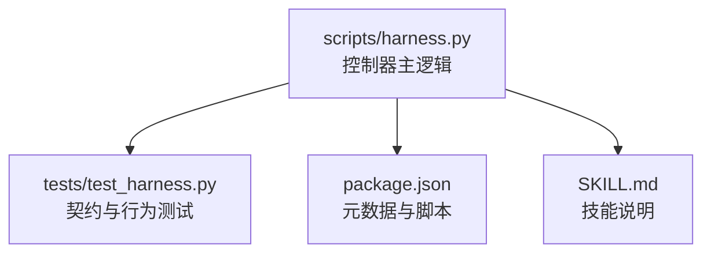
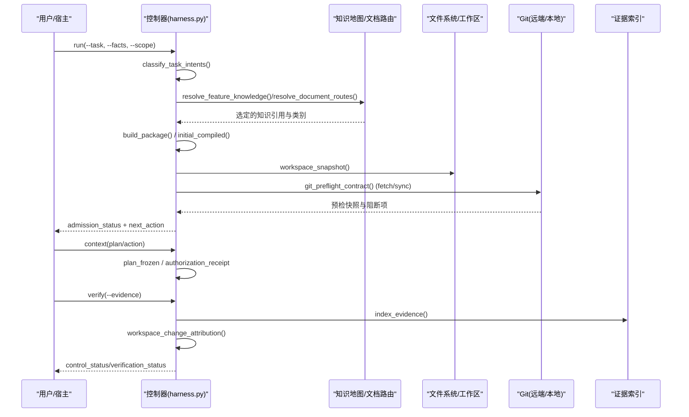
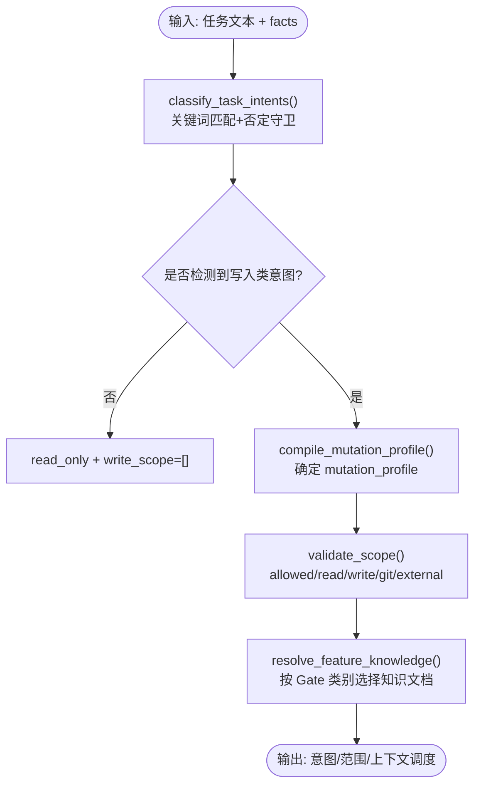
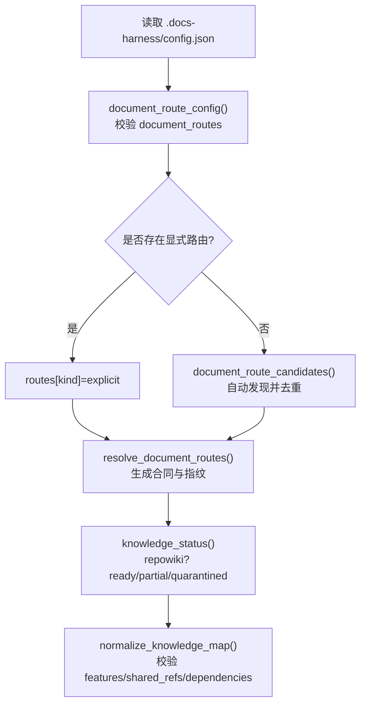
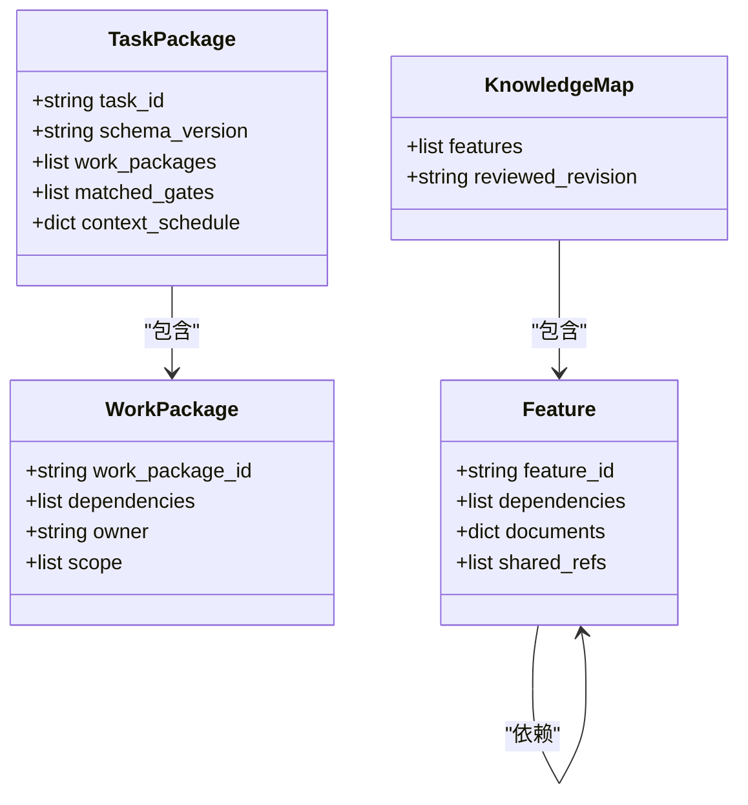
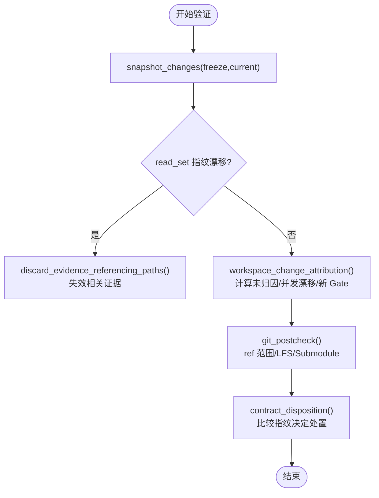
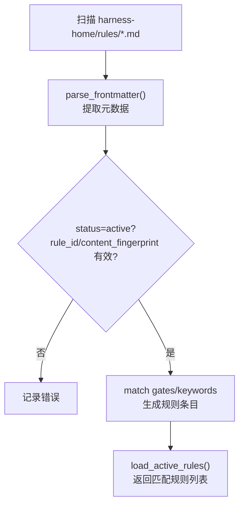
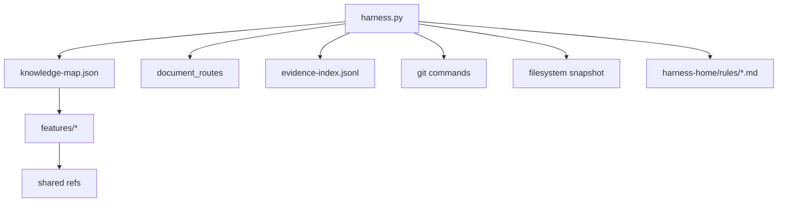

# 关系建立机制

<cite>
**本文引用的文件**   
- [scripts/harness.py](file://scripts/harness.py)
- [tests/test_harness.py](file://tests/test_harness.py)
- [package.json](file://package.json)
- [SKILL.md](file://SKILL.md)
</cite>

## 目录
1. [简介](#简介)
2. [项目结构](#项目结构)
3. [核心组件](#核心组件)
4. [架构总览](#架构总览)
5. [详细组件分析](#详细组件分析)
6. [依赖分析](#依赖分析)
7. [性能考虑](#性能考虑)
8. [故障排除指南](#故障排除指南)
9. [结论](#结论)
10. [附录](#附录)

## 简介
本文件系统化阐述 Docs Harness 的“关系建立机制”，覆盖以下关键主题：
- 依赖关系检测算法：导入语句分析、函数调用追踪、模块依赖解析（面向任务包与知识地图）
- 引用解析过程：跨文档引用、外部链接处理、版本关联
- 关系类型定义：父子关系、依赖关系、引用关系、版本关系的建立规则
- 关系验证机制：循环依赖检测、完整性检查、一致性验证
- 配置策略与自定义扩展：规则、Gate、证据类型、范围合同等
- 实际应用场景与故障排除

该机制以“任务包/编译状态/冻结快照”为核心，围绕知识地图、文档路由、证据收据与工作包依赖进行统一建模与校验。

## 项目结构
- scripts/harness.py：控制器主逻辑，包含任务准入、上下文调度、Git 预检/后检、知识地图解析、文档路由、证据装载与归因、工作包进度推进等
- tests/test_harness.py：契约与行为测试，覆盖意图分类、Git 操作、知识上下文、交付物判定等
- package.json：元数据与脚本入口
- SKILL.md：技能说明与使用约定

**图表来源** 
- [scripts/harness.py](file://scripts/harness.py)
- [tests/test_harness.py](file://tests/test_harness.py)
- [package.json](file://package.json)
- [SKILL.md](file://SKILL.md)

**章节来源**
- [package.json:1-23](file://package.json#L1-L23)
- [SKILL.md:1-106](file://SKILL.md#L1-L106)

## 核心组件
- 任务包与编译态：任务包描述意图、范围、Gate、上下文调度；编译态驱动执行流与下一步动作
- 冻结快照：锁定任务包指纹、工作区快照、环境指纹，用于漂移检测与一致性校验
- 知识地图与文档路由：功能维度组织知识文档，按 Gate 类别按需加载；支持显式配置与自动发现
- 证据系统：声明/收据双形态，绑定任务包与目标身份，支持读集指纹漂移失效与增量继承
- Git 预检/后检：对 fetch/sync 等操作进行前置约束与后置校验，确保 ref 范围与 LFS/Submodule 可用
- 工作包依赖与进度：基于事件重放的状态机，保证依赖顺序与并发安全

**章节来源**
- [scripts/harness.py:3000-3076](file://scripts/harness.py#L3000-L3076)
- [scripts/harness.py:3229-3262](file://scripts/harness.py#L3229-L3262)
- [scripts/harness.py:1403-1459](file://scripts/harness.py#L1403-L1459)
- [scripts/harness.py:5203-5395](file://scripts/harness.py#L5203-L5395)
- [scripts/harness.py:801-878](file://scripts/harness.py#L801-L878)
- [scripts/harness.py:5682-5799](file://scripts/harness.py#L5682-L5799)

## 架构总览
Docs Harness 的关系建立贯穿“任务准入 → 上下文构建 → 方案冻结 → 授权 → 执行 → 证据 → 验证”全链路，并以知识地图与文档路由为上下文依据，以 Git 预检/后检保障变更边界。

**图表来源** 
- [scripts/harness.py:2320-2399](file://scripts/harness.py#L2320-L2399)
- [scripts/harness.py:1939-2043](file://scripts/harness.py#L1939-L2043)
- [scripts/harness.py:1403-1459](file://scripts/harness.py#L1403-L1459)
- [scripts/harness.py:3000-3076](file://scripts/harness.py#L3000-L3076)
- [scripts/harness.py:1115-1138](file://scripts/harness.py#L1115-L1138)
- [scripts/harness.py:680-794](file://scripts/harness.py#L680-L794)
- [scripts/harness.py:5510-5516](file://scripts/harness.py#L5510-L5516)
- [scripts/harness.py:5405-5507](file://scripts/harness.py#L5405-L5507)

## 详细组件分析

### 依赖关系检测算法
- 任务意图与候选意图推断：基于关键词模式与否定守卫，区分当前意图、可延后意图与已完成语义，避免误升级写入权限
- 范围与动作推导：根据意图映射到 mutation_profile，并生成 allowed_actions
- 知识依赖选择：按 Gate 类别筛选知识文档，结合任务文本与 scope 匹配功能特征，必要时回退 repowiki 只消费模式

**图表来源** 
- [scripts/harness.py:2320-2399](file://scripts/harness.py#L2320-L2399)
- [scripts/harness.py:1939-2043](file://scripts/harness.py#L1939-L2043)

**章节来源**
- [scripts/harness.py:2320-2399](file://scripts/harness.py#L2320-L2399)
- [scripts/harness.py:1939-2043](file://scripts/harness.py#L1939-L2043)

### 引用解析过程（跨文档、外部链接、版本关联）
- 文档路由解析：支持显式配置与自动发现，校验路径安全性与类型，生成指纹合同
- 知识地图规范化：强制 L2 目标、功能 ID 唯一性、四类文档位置约束、共享引用与依赖校验
- 外部知识库（repowiki）：仅消费模式，按 name/scope/category 命中知识卡，不产生写动作
- 版本关联：通过 knowledge_map fingerprint、reviewed_revision、knowledge_status.source 等字段体现

**图表来源** 
- [scripts/harness.py:1290-1348](file://scripts/harness.py#L1290-L1348)
- [scripts/harness.py:1351-1388](file://scripts/harness.py#L1351-L1388)
- [scripts/harness.py:1403-1459](file://scripts/harness.py#L1403-L1459)
- [scripts/harness.py:1722-1761](file://scripts/harness.py#L1722-L1761)
- [scripts/harness.py:1529-1591](file://scripts/harness.py#L1529-L1591)

**章节来源**
- [scripts/harness.py:1290-1348](file://scripts/harness.py#L1290-L1348)
- [scripts/harness.py:1351-1388](file://scripts/harness.py#L1351-L1388)
- [scripts/harness.py:1403-1459](file://scripts/harness.py#L1403-L1459)
- [scripts/harness.py:1722-1761](file://scripts/harness.py#L1722-L1761)
- [scripts/harness.py:1529-1591](file://scripts/harness.py#L1529-L1591)

### 关系类型与建立规则
- 父子关系：任务包中的 work_packages 通过 dependencies 形成有向无环依赖；进度推进基于事件重放与依赖完成状态
- 依赖关系：知识地图中 feature.dependencies 指向其他 feature_id，需存在于已注册集合
- 引用关系：context_schedule.plan/action/acceptance 阶段声明 rule_ids 与 project_fact_refs，作为上下文依赖
- 版本关系：package_fingerprint、plan_contract_fingerprint、authorization_contract_fingerprint 以及 knowledge map fingerprint 构成版本锚点

**图表来源** 
- [scripts/harness.py:3000-3076](file://scripts/harness.py#L3000-L3076)
- [scripts/harness.py:1529-1591](file://scripts/harness.py#L1529-L1591)

**章节来源**
- [scripts/harness.py:3000-3076](file://scripts/harness.py#L3000-L3076)
- [scripts/harness.py:1529-1591](file://scripts/harness.py#L1529-L1591)

### 关系验证机制
- 循环依赖检测：知识地图 normalize_knowledge_map 要求 dependencies 必须存在且唯一，避免未知依赖；工作包依赖在 begin 前校验全部依赖 verified
- 完整性检查：workspace_snapshot 与 freeze 对比，read_set 指纹漂移触发证据失效；git_postcheck 校验 ref 范围与 LFS/Submodule 可用性
- 一致性验证：contract_disposition 比较 package/plan/auth 指纹，决定 full_readmission/incremental_admission/evidence_only/context_only/no_change

**图表来源** 
- [scripts/harness.py:1141-1142](file://scripts/harness.py#L1141-L1142)
- [scripts/harness.py:5518-5536](file://scripts/harness.py#L5518-L5536)
- [scripts/harness.py:5405-5507](file://scripts/harness.py#L5405-L5507)
- [scripts/harness.py:801-878](file://scripts/harness.py#L801-L878)
- [scripts/harness.py:3154-3172](file://scripts/harness.py#L3154-L3172)

**章节来源**
- [scripts/harness.py:1141-1142](file://scripts/harness.py#L1141-L1142)
- [scripts/harness.py:5518-5536](file://scripts/harness.py#L5518-L5536)
- [scripts/harness.py:5405-5507](file://scripts/harness.py#L5405-L5507)
- [scripts/harness.py:801-878](file://scripts/harness.py#L801-L878)
- [scripts/harness.py:3154-3172](file://scripts/harness.py#L3154-L3172)

### 配置策略与自定义扩展
- 规则扩展：harness-home/rules/*.md 通过 frontmatter 声明 rule_id、gates、keywords、plan_fields、evidence_types、failure_mode；load_active_rules 校验内容指纹与结构
- Gate 体系：GATE_DEFS 与 SAFETY_FLOOR_GATES 组合，floor_term_matches 带否定守卫精确匹配
- 证据类型白名单：known_evidence_types() 限定可接受类型，mint_evidence_receipt 由控制器代铸 v2 收据
- 范围合同：scope_contract_fingerprint 聚合 read/write/git/external/actions/topology/work_packages 生成稳定指纹

**图表来源** 
- [scripts/harness.py:2223-2289](file://scripts/harness.py#L2223-L2289)
- [scripts/harness.py:2300-2317](file://scripts/harness.py#L2300-L2317)
- [scripts/harness.py:5176-5200](file://scripts/harness.py#L5176-L5200)
- [scripts/harness.py:5203-5240](file://scripts/harness.py#L5203-L5240)
- [scripts/harness.py:3082-3098](file://scripts/harness.py#L3082-L3098)

**章节来源**
- [scripts/harness.py:2223-2289](file://scripts/harness.py#L2223-L2289)
- [scripts/harness.py:2300-2317](file://scripts/harness.py#L2300-L2317)
- [scripts/harness.py:5176-5200](file://scripts/harness.py#L5176-L5200)
- [scripts/harness.py:5203-5240](file://scripts/harness.py#L5203-L5240)
- [scripts/harness.py:3082-3098](file://scripts/harness.py#L3082-L3098)

## 依赖分析
- 组件耦合：控制器集中编排任务包、知识地图、文档路由、证据与工作包；通过指纹与快照实现松耦合校验
- 直接依赖：Git 命令封装、JSON/JSONL 读写、文件系统快照、正则与 fnmatch 匹配
- 间接依赖：外部知识库 repowiki 只消费；规则文件与 Gate 词表影响准入与上下文
- 潜在循环：知识地图依赖需满足存在性与唯一性；工作包依赖在状态机中受 begin/submit/block 约束

**图表来源** 
- [scripts/harness.py:1403-1459](file://scripts/harness.py#L1403-L1459)
- [scripts/harness.py:1529-1591](file://scripts/harness.py#L1529-L1591)
- [scripts/harness.py:5510-5516](file://scripts/harness.py#L5510-L5516)
- [scripts/harness.py:1115-1138](file://scripts/harness.py#L1115-L1138)
- [scripts/harness.py:2223-2289](file://scripts/harness.py#L2223-L2289)

**章节来源**
- [scripts/harness.py:1403-1459](file://scripts/harness.py#L1403-L1459)
- [scripts/harness.py:1529-1591](file://scripts/harness.py#L1529-L1591)
- [scripts/harness.py:5510-5516](file://scripts/harness.py#L5510-L5516)
- [scripts/harness.py:1115-1138](file://scripts/harness.py#L1115-L1138)
- [scripts/harness.py:2223-2289](file://scripts/harness.py#L2223-L2289)

## 性能考虑
- 快照与指纹：workspace_snapshot 对大文件采用 size:mtime 摘要，限制非 Git 工作区文件数量，避免截断基线
- 事件重放：events.jsonl 增量追加，replay_progress 线性扫描，适合长生命周期任务
- 规则匹配：按文件名排序与 active 过滤，content_fingerprint 快速校验，减少无效解析
- Git 操作：preflight/postcheck 批量收集信息，避免多次往返；LFS/Submodule 可用性一次性探测

[本节为通用指导，不直接分析具体文件]

## 故障排除指南
- 常见错误码与原因：
  - invalid_json/invalid_state：JSON 格式或状态文件损坏
  - missing_file/target 不存在：路径或目标目录问题
  - git_remote_unavailable/git_ref_scope_violation：远端不可用或 ref 越界
  - evidence_expired/untrusted_evidence_producer：证据过期或生产者不可信
  - archive_source_drift/disposition_index_locked：归档源漂移或并发锁冲突
- 定位步骤：
  - 查看 events.jsonl 最近事件与 reason_code
  - 检查 evidence-index.json 中失效证据与 read_set 漂移
  - 确认 git_postcheck 的 checks 与 outside_refs
  - 核对 contract_disposition 的指纹差异，判断是否需要 full_readmission

**章节来源**
- [scripts/harness.py:5203-5395](file://scripts/harness.py#L5203-L5395)
- [scripts/harness.py:5518-5536](file://scripts/harness.py#L5518-L5536)
- [scripts/harness.py:801-878](file://scripts/harness.py#L801-L878)
- [scripts/harness.py:3154-3172](file://scripts/harness.py#L3154-L3172)

## 结论
Docs Harness 的关系建立机制以“任务包/知识地图/文档路由/证据/工作包”为核心，通过严格的指纹与快照校验、Git 预检/后检、规则与 Gate 体系，实现了高可信度的依赖检测、引用解析与关系验证。其配置化与可扩展设计便于在不同项目中落地，同时提供完善的故障定位与恢复能力。

[本节为总结性内容，不直接分析具体文件]

## 附录
- 使用示例与契约验证参考测试用例，覆盖 run/verify/background/ledger 等场景
- 安装与部署参考 package.json 脚本与 SKILL.md 说明

**章节来源**
- [tests/test_harness.py:1-800](file://tests/test_harness.py#L1-L800)
- [package.json:17-21](file://package.json#L17-L21)
- [SKILL.md:13-24](file://SKILL.md#L13-L24)