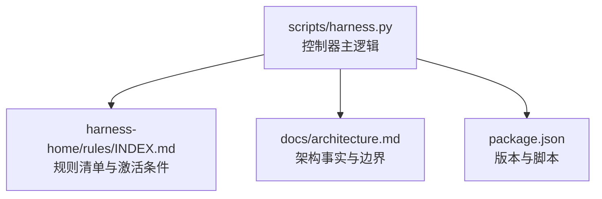
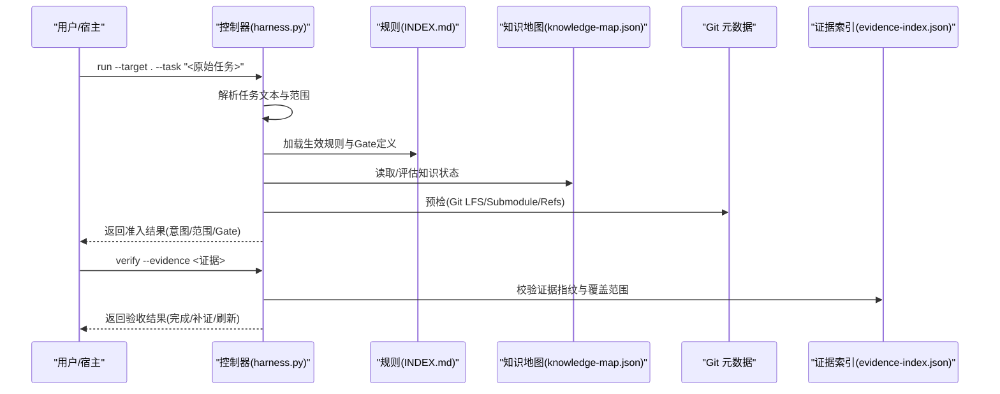
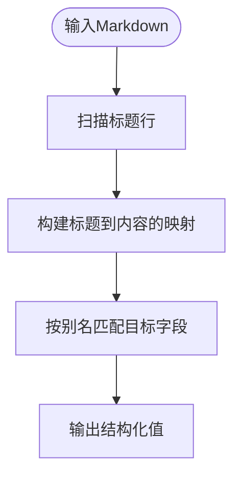
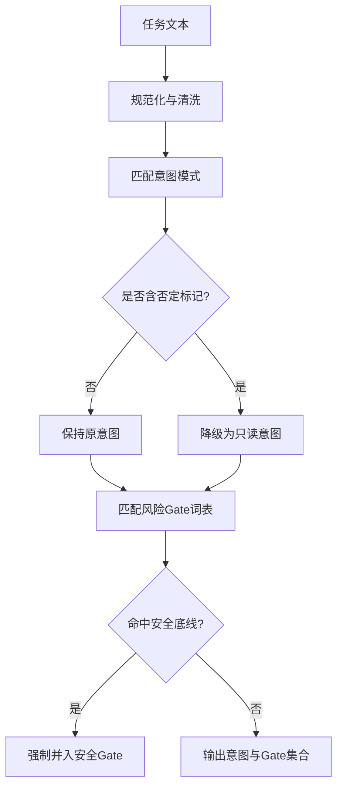
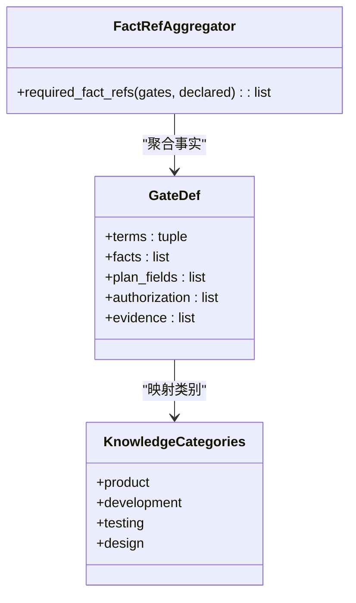
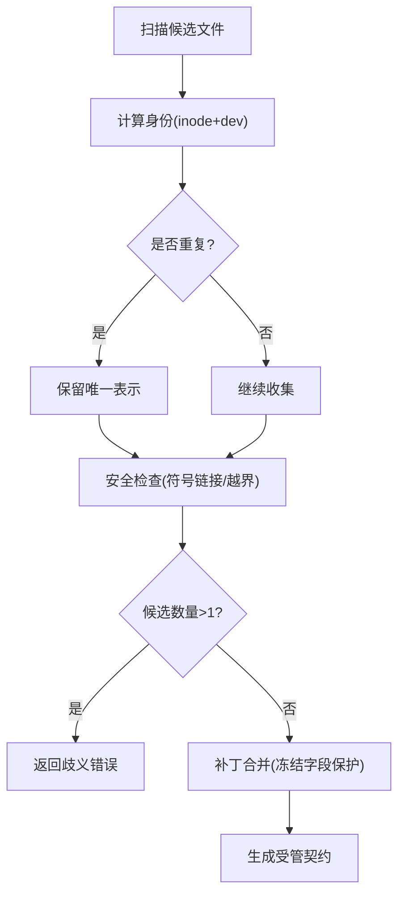
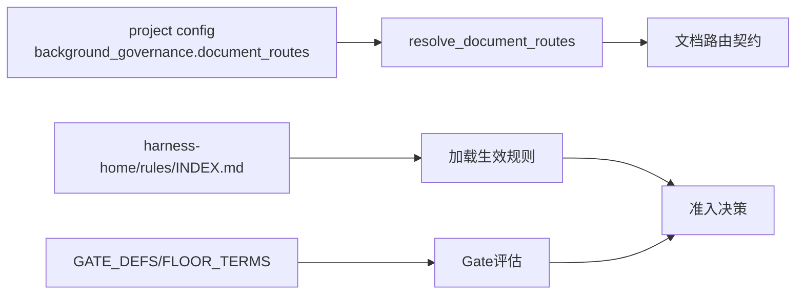
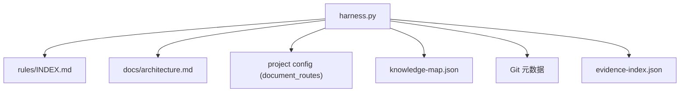

# 实体识别算法

<cite>
**本文引用的文件**   
- [scripts/harness.py](file://scripts/harness.py)
- [tests/test_harness.py](file://tests/test_harness.py)
- [harness-home/rules/INDEX.md](file://harness-home/rules/INDEX.md)
- [docs/architecture.md](file://docs/architecture.md)
- [package.json](file://package.json)
</cite>

## 目录
1. [简介](#简介)
2. [项目结构](#项目结构)
3. [核心组件](#核心组件)
4. [架构总览](#架构总览)
5. [详细组件分析](#详细组件分析)
6. [依赖关系分析](#依赖关系分析)
7. [性能考量](#性能考量)
8. [故障排查指南](#故障排查指南)
9. [结论](#结论)
10. [附录](#附录)

## 简介
本文件面向 Docs Harness 的“实体识别算法”相关能力，围绕文档解析、关键词提取、语义分析、实体去重与合并、配置扩展与性能优化进行系统化说明。该能力由控制器脚本统一实现，贯穿任务准入、知识治理、证据验收与后台作业等流程。通过结构化规则与受管契约，确保在复杂工程环境中具备可审计、可回滚、失败关闭的执行特性。

## 项目结构
- 控制器源码位于 scripts/harness.py，承担任务编排、文档路由解析、知识地图处理、Git 元数据校验、证据索引与验收、后台 Job 状态机等职责。
- 规则快照位于 harness-home/rules/INDEX.md，定义生效规则清单与激活条件。
- 架构事实位于 docs/architecture.md，描述运行边界、控制面与数据面分离原则。
- package.json 提供版本信息与测试入口。

**图示来源** 
- [scripts/harness.py:1-100](file://scripts/harness.py#L1-L100)
- [harness-home/rules/INDEX.md:1-41](file://harness-home/rules/INDEX.md#L1-L41)
- [docs/architecture.md:1-26](file://docs/architecture.md#L1-L26)
- [package.json:1-23](file://package.json#L1-L23)

**章节来源**
- [scripts/harness.py:1-100](file://scripts/harness.py#L1-L100)
- [harness-home/rules/INDEX.md:1-41](file://harness-home/rules/INDEX.md#L1-L41)
- [docs/architecture.md:1-26](file://docs/architecture.md#L1-L26)
- [package.json:1-23](file://package.json#L1-L23)

## 核心组件
- Markdown 解析与结构化提取：基于标题层级将文档切分为结构化段落，用于计划字段抽取与上下文构建。
- 关键词与意图识别：通过模式匹配与词表驱动的任务意图推断，结合否定守卫降低误报。
- 语义分析与概念映射：依据 Gate 定义与知识分类，将任务语义映射到所需事实与证据类型。
- 实体去重与冲突解决：对文档路由候选进行身份去重（inode），并处理多候选歧义与安全拒绝。
- 配置与扩展点：通过 project config 中的 background_governance.document_routes 显式声明或自动发现文档路由；支持自定义规则与证据类型。

**章节来源**
- [scripts/harness.py:3797-3804](file://scripts/harness.py#L3797-L3804)
- [scripts/harness.py:222-230](file://scripts/harness.py#L222-L230)
- [scripts/harness.py:260-342](file://scripts/harness.py#L260-L342)
- [scripts/harness.py:1348-1385](file://scripts/harness.py#L1348-L1385)
- [scripts/harness.py:1287-1345](file://scripts/harness.py#L1287-L1345)

## 架构总览
Docs Harness 以“意图优先、证据可复用、失败关闭”为核心设计原则。任务进入后先编译 task_intent、candidate_intents 与 deferred_intents，再根据最高 mutation_profile 与风险 Gate 决定执行路径。文档解析、知识治理与证据验收均受控于受管契约与指纹校验，确保变更可追溯与回滚安全。

**图示来源** 
- [scripts/harness.py:197-230](file://scripts/harness.py#L197-L230)
- [scripts/harness.py:260-342](file://scripts/harness.py#L260-L342)
- [scripts/harness.py:1287-1345](file://scripts/harness.py#L1287-L1345)
- [scripts/harness.py:1348-1385](file://scripts/harness.py#L1348-L1385)
- [harness-home/rules/INDEX.md:1-41](file://harness-home/rules/INDEX.md#L1-L41)

## 详细组件分析

### Markdown 解析与结构化内容提取
- 使用正则按标题层级切分文档，生成“标题→内容”映射，便于后续字段抽取与上下文组装。
- 支持 JSON 与 Markdown 两种计划格式，统一通过 plan_value 抽象访问。

**图示来源** 
- [scripts/harness.py:3797-3804](file://scripts/harness.py#L3797-L3804)
- [scripts/harness.py:3807-3821](file://scripts/harness.py#L3807-L3821)

**章节来源**
- [scripts/harness.py:3797-3821](file://scripts/harness.py#L3797-L3821)

### 关键词提取与术语识别
- 通过 INTENT_PATTERNS 与 GATE_DEFS 的词表进行意图与风险 Gate 匹配。
- 引入否定标记 NEGATION_MARKERS 抑制误报，保证只读查询不被错误升级为写入。
- SAFETY_FLOOR_GATES 与 FLOOR_TERMS 提供强制安全底线，不可被宿主声明豁免。

**图示来源** 
- [scripts/harness.py:222-230](file://scripts/harness.py#L222-L230)
- [scripts/harness.py:260-342](file://scripts/harness.py#L260-L342)
- [scripts/harness.py:382-389](file://scripts/harness.py#L382-L389)

**章节来源**
- [scripts/harness.py:222-230](file://scripts/harness.py#L222-L230)
- [scripts/harness.py:260-342](file://scripts/harness.py#L260-L342)
- [scripts/harness.py:382-389](file://scripts/harness.py#L382-L389)

### 语义分析与概念映射
- 将任务语义映射至知识分类（product/development/testing/design）与 Gate 所需的事实引用。
- 通过 required_fact_refs 聚合 Gate 与声明的事实，形成最小必要上下文。

**图示来源** 
- [scripts/harness.py:260-342](file://scripts/harness.py#L260-L342)
- [scripts/harness.py:2502-2506](file://scripts/harness.py#L2502-L2506)

**章节来源**
- [scripts/harness.py:260-342](file://scripts/harness.py#L260-L342)
- [scripts/harness.py:2502-2506](file://scripts/harness.py#L2502-L2506)

### 实体去重策略与合并算法
- 文档路由候选通过 inode 与设备号进行身份去重，避免大小写不同但同一文件的重复。
- 多候选时返回歧义错误，要求显式配置；存在不安全候选（符号链接、越界路径）直接拒绝。
- 合并阶段仅允许补齐缺失字段，冻结字段不可改写，确保契约一致性。

**图示来源** 
- [scripts/harness.py:1348-1385](file://scripts/harness.py#L1348-L1385)
- [scripts/harness.py:1400-1456](file://scripts/harness.py#L1400-L1456)
- [scripts/harness.py:3915-3948](file://scripts/harness.py#L3915-L3948)

**章节来源**
- [scripts/harness.py:1348-1385](file://scripts/harness.py#L1348-L1385)
- [scripts/harness.py:1400-1456](file://scripts/harness.py#L1400-L1456)
- [scripts/harness.py:3915-3948](file://scripts/harness.py#L3915-L3948)

### 配置选项与自定义扩展
- 文档路由可通过 project config 的 background_governance.document_routes 显式声明，或按约定自动发现。
- 规则清单与激活条件由 harness-home/rules/INDEX.md 管理，新增规则需满足 status: active、ID 唯一、指纹正确。
- 证据类型与 Gate 定义可扩展，但安全底线 Gate 不可被宿主声明移除。

**图示来源** 
- [scripts/harness.py:1287-1345](file://scripts/harness.py#L1287-L1345)
- [scripts/harness.py:1400-1456](file://scripts/harness.py#L1400-L1456)
- [harness-home/rules/INDEX.md:1-41](file://harness-home/rules/INDEX.md#L1-L41)
- [scripts/harness.py:260-342](file://scripts/harness.py#L260-L342)

**章节来源**
- [scripts/harness.py:1287-1345](file://scripts/harness.py#L1287-L1345)
- [scripts/harness.py:1400-1456](file://scripts/harness.py#L1400-L1456)
- [harness-home/rules/INDEX.md:1-41](file://harness-home/rules/INDEX.md#L1-L41)
- [scripts/harness.py:260-342](file://scripts/harness.py#L260-L342)

### 实际代码示例（路径引用）
- Markdown 章节提取：[extract_markdown_sections:3797-3804](file://scripts/harness.py#L3797-L3804)
- 计划字段抽取：[plan_value:3807-3821](file://scripts/harness.py#L3807-L3821)
- 任务路径提取：[extract_task_paths:2313-2331](file://scripts/harness.py#L2313-L2331)
- 文档路由解析：[resolve_document_routes:1400-1456](file://scripts/harness.py#L1400-L1456)
- 知识地图读取与评估：[read_knowledge_map:1591-1598](file://scripts/harness.py#L1591-L1598)、[evaluate_candidate_knowledge:1621-1638](file://scripts/harness.py#L1621-L1638)
- Git 预检与后验：[git_preflight_contract:677-788](file://scripts/harness.py#L677-L788)、[git_postcheck:793-800](file://scripts/harness.py#L793-L800)

**章节来源**
- [scripts/harness.py:3797-3821](file://scripts/harness.py#L3797-L3821)
- [scripts/harness.py:2313-2331](file://scripts/harness.py#L2313-L2331)
- [scripts/harness.py:1400-1456](file://scripts/harness.py#L1400-L1456)
- [scripts/harness.py:1591-1638](file://scripts/harness.py#L1591-L1638)
- [scripts/harness.py:677-800](file://scripts/harness.py#L677-L800)

## 依赖关系分析
- 控制器依赖规则清单与架构事实，确保执行边界与合规性。
- 文档路由解析依赖项目配置与文件系统约束，防止越权与不安全路径。
- 知识地图与背景 Job 状态机依赖稳定的契约与指纹校验，保障增量同步与回滚安全。

**图示来源** 
- [scripts/harness.py:1287-1456](file://scripts/harness.py#L1287-L1456)
- [harness-home/rules/INDEX.md:1-41](file://harness-home/rules/INDEX.md#L1-L41)
- [docs/architecture.md:1-26](file://docs/architecture.md#L1-L26)

**章节来源**
- [scripts/harness.py:1287-1456](file://scripts/harness.py#L1287-L1456)
- [harness-home/rules/INDEX.md:1-41](file://harness-home/rules/INDEX.md#L1-L41)
- [docs/architecture.md:1-26](file://docs/architecture.md#L1-L26)

## 性能考量
- 文件指纹与哈希：对大文件采用分块读取与 SHA-256 计算，避免内存峰值。
- 正则与模式匹配：意图与 Gate 匹配使用预编译常量与有限词表，减少回溯开销。
- 文件系统操作：原子写入与临时文件清理，降低并发竞争与 I/O 抖动。
- Git 预检限制：对删除数量、LFS、Submodule 可用性进行快速失败，避免长时间阻塞。

**章节来源**
- [scripts/harness.py:407-416](file://scripts/harness.py#L407-L416)
- [scripts/harness.py:419-434](file://scripts/harness.py#L419-L434)
- [scripts/harness.py:677-788](file://scripts/harness.py#L677-L788)

## 故障排查指南
- 常见错误码与原因：
  - invalid_scope_description：scope 包含自然语言描述而非结构化路径。
  - invalid_document_route_config：文档路由配置非法或路径不安全。
  - git_preflight_failed / git_remote_unavailable：Git 预检失败或远端不可用。
  - managed_plan_unavailable：受管计划副本不可用，需重新提交完整方案。
- 定位步骤：
  - 检查任务 facts 与 scope 是否符合结构化要求。
  - 确认 document_routes 配置与文件系统一致性。
  - 验证 Git 环境（LFS/Submodule）与远端可达性。
  - 核对受管工件指纹与契约一致性。

**章节来源**
- [scripts/harness.py:2334-2353](file://scripts/harness.py#L2334-L2353)
- [scripts/harness.py:1287-1345](file://scripts/harness.py#L1287-L1345)
- [scripts/harness.py:677-788](file://scripts/harness.py#L677-L788)
- [scripts/harness.py:3915-3948](file://scripts/harness.py#L3915-L3948)

## 结论
Docs Harness 的实体识别算法以规则驱动、契约约束与失败关闭为核心，实现了从 Markdown 解析、关键词与意图识别、语义映射到实体去重与合并的全链路可控能力。通过严格的配置与指纹校验，确保在复杂工程环境中具备高可靠性与可审计性。建议在生产使用中遵循最小权限与显式声明原则，充分利用预检与后验机制提升稳定性。

## 附录
- 测试用例参考：[test_harness.py](file://tests/test_harness.py) 中涵盖 Git fetch/sync、意图推断、Gate 评估、证据验收等场景。
- 版本与脚本：[package.json](file://package.json) 提供测试与自检命令。

**章节来源**
- [tests/test_harness.py:1-100](file://tests/test_harness.py#L1-L100)
- [package.json:1-23](file://package.json#L1-L23)