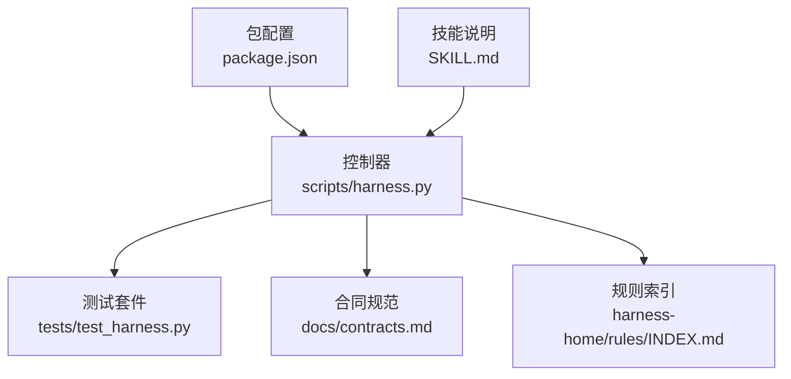
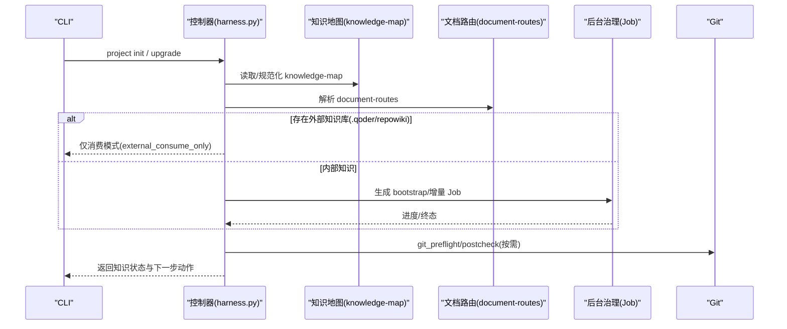
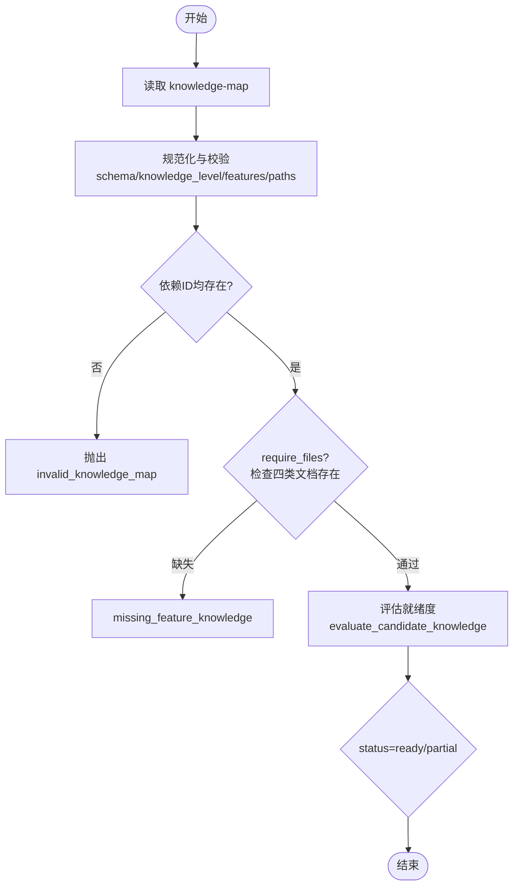
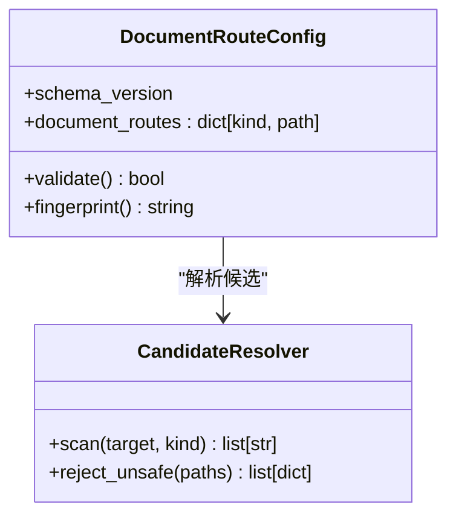
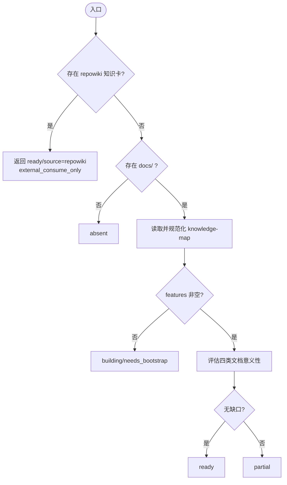
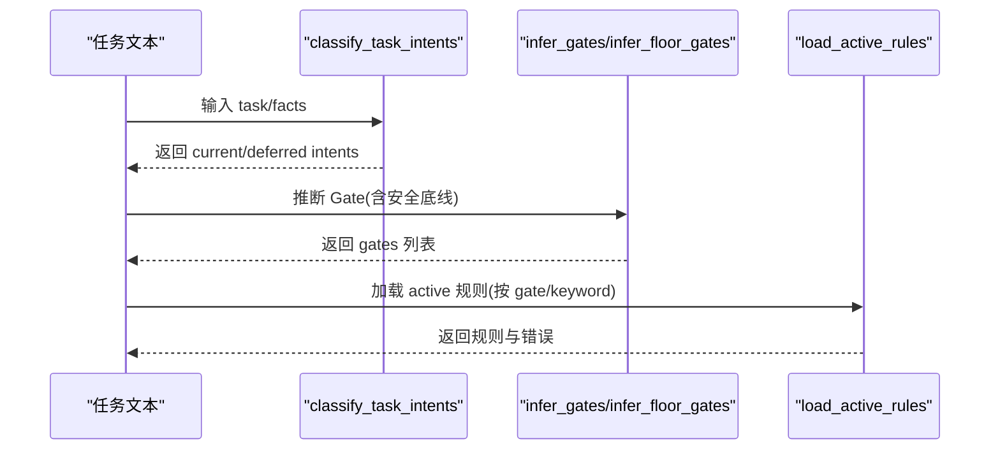
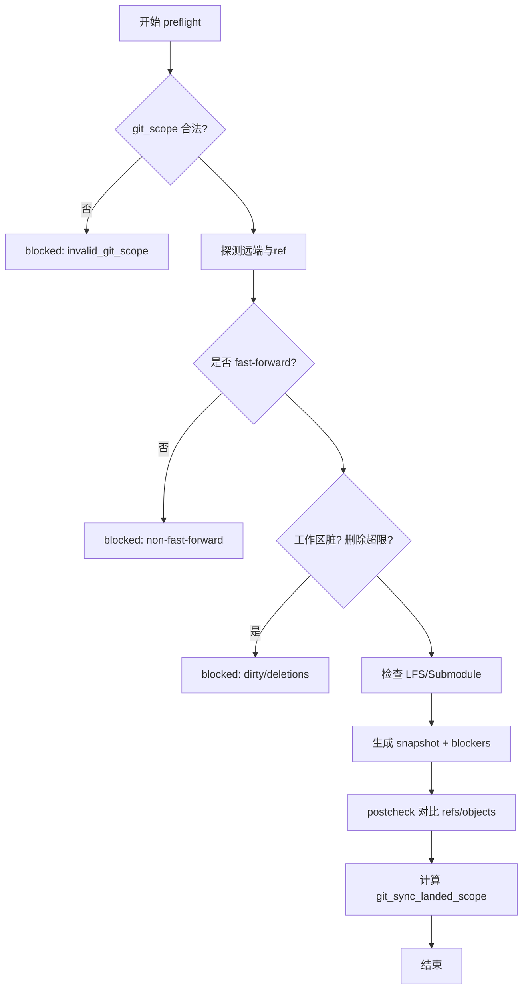
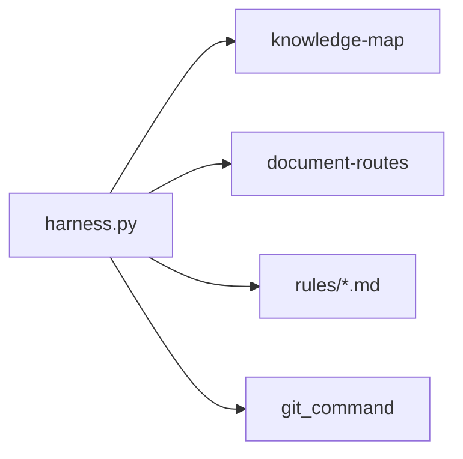

# 层次结构维护

<cite>
**本文引用的文件**   
- [scripts/harness.py](file://scripts/harness.py)
- [tests/test_harness.py](file://tests/test_harness.py)
- [package.json](file://package.json)
- [SKILL.md](file://SKILL.md)
- [docs/contracts.md](file://docs/contracts.md)
- [harness-home/rules/INDEX.md](file://harness-home/rules/INDEX.md)
</cite>

## 目录
1. [简介](#简介)
2. [项目结构](#项目结构)
3. [核心组件](#核心组件)
4. [架构总览](#架构总览)
5. [详细组件分析](#详细组件分析)
6. [依赖关系分析](#依赖关系分析)
7. [性能与优化](#性能与优化)
8. [故障排查指南](#故障排查指南)
9. [结论](#结论)
10. [附录：查询接口与遍历方法](#附录查询接口与遍历方法)

## 简介
本文件面向 Docs Harness 的“层次结构维护系统”，聚焦知识地图（knowledge-map）与文档真源路由（document-routes）两大层次化能力，覆盖父子关系管理、层级验证规则、一致性检查算法、层次结构优化策略、查询接口与遍历方法，并提供实际使用示例与常见问题解决方案。该体系确保项目文档与功能知识的结构化、可演进、可审计与可交付。

## 项目结构
Docs Harness 以 Python 控制器为核心，配合测试、规则与合同文档共同构成完整闭环。关键路径包括：
- 控制器脚本：scripts/harness.py
- 单元测试：tests/test_harness.py
- 包元数据：package.json
- 技能说明：SKILL.md
- 合同规范：docs/contracts.md
- 规则索引：harness-home/rules/INDEX.md

**图表来源**
- [scripts/harness.py](file://scripts/harness.py)
- [tests/test_harness.py](file://tests/test_harness.py)
- [package.json](file://package.json)
- [SKILL.md](file://SKILL.md)
- [docs/contracts.md](file://docs/contracts.md)
- [harness-home/rules/INDEX.md](file://harness-home/rules/INDEX.md)

**章节来源**
- [package.json:1-23](file://package.json#L1-L23)
- [SKILL.md:1-106](file://SKILL.md#L1-L106)

## 核心组件
- 知识地图（knowledge-map）：定义功能维度（product/development/testing/design）与共享引用，约束文档位置、命名与依赖关系。
- 文档真源路由（document-routes）：声明 architecture/changelog/todo/adr_root/reviews_root 等类别的真实路径，驱动后台治理 Job。
- 知识状态评估与交接：根据 knowledge-map 与 repowiki 外部知识库判定 ready/partial/needs_bootstrap/audit 等状态，并生成交接合同。
- 规则加载与 Gate 推断：基于 active 规则与任务语义推导风险 Gate，保障安全底线。
- Git 前置/后置校验：对 git_fetch/git_sync 进行范围锁定、漂移检测与自动归因。

**章节来源**
- [scripts/harness.py:1500-1800](file://scripts/harness.py#L1500-L1800)
- [scripts/harness.py:1290-1394](file://scripts/harness.py#L1290-L1394)
- [docs/contracts.md:1-372](file://docs/contracts.md#L1-L372)

## 架构总览
下图展示知识地图与文档路由在控制器中的交互流程，以及它们如何影响后台治理与验收。

**图表来源**
- [scripts/harness.py:1500-1800](file://scripts/harness.py#L1500-L1800)
- [scripts/harness.py:1290-1394](file://scripts/harness.py#L1290-L1394)
- [docs/contracts.md:300-372](file://docs/contracts.md#L300-L372)

## 详细组件分析

### 知识地图（knowledge-map）层次结构
- 父子关系管理
  - feature_id 作为节点标识，documents 下按 product/development/testing/design 四类形成子节点；shared_refs 为跨功能共享引用。
  - dependencies 声明功能间依赖，normalize_knowledge_map 会校验依赖是否存在于已见 ID 集合。
- 层级创建与更新
  - empty_knowledge_map 提供初始结构；read_knowledge_map 读取并规范化；evaluate_candidate_knowledge 依据真实文档内容评估就绪度。
- 继承机制
  - shared_refs 允许功能复用公共事实；category_refs 与 loaded_categories 用于上下文加载时的分类聚合。
- 深度限制与命名规范
  - feature_id 必须 kebab-case；documents 路径必须以 docs/features/{feature_id}/ 开头；禁止符号链接与越界路径。
- 结构约束
  - schema_version 固定为 KNOWLEDGE_MAP_SCHEMA；knowledge_level 强制 L2；features 数组上限 500。

**图表来源**
- [scripts/harness.py:1504-1591](file://scripts/harness.py#L1504-L1591)
- [scripts/harness.py:1690-1705](file://scripts/harness.py#L1690-L1705)

**章节来源**
- [scripts/harness.py:1504-1591](file://scripts/harness.py#L1504-L1591)
- [scripts/harness.py:1690-1705](file://scripts/harness.py#L1690-L1705)

### 文档真源路由（document-routes）层次结构
- 类别与类型
  - 文件类：architecture/changelog/todo；目录类：adr_root/reviews_root。
- 父子关系与路径约束
  - 值必须是项目内 POSIX 相对路径；文件类需为常规文件，目录类需为目录；路径链不得包含符号链接。
- 候选解析与安全校验
  - document_route_candidates 扫描根与 docs 下的候选，拒绝不安全或类型不匹配的路径。
- 契约指纹
  - document_route_fingerprint 对 contract 计算稳定指纹，用于幂等与变更检测。

**图表来源**
- [scripts/harness.py:1290-1394](file://scripts/harness.py#L1290-L1394)

**章节来源**
- [scripts/harness.py:1290-1394](file://scripts/harness.py#L1290-L1394)

### 知识状态与交接（bootstrap/audit/external_consume_only）
- 外部知识库优先
  - 若存在 .qoder/repowiki/knowledge/<locale>/ 且含 .md 卡片，则直接返回 ready，source="repowiki"，进入 external_consume_only 模式。
- 内部知识状态
  - 无 docs/ 时 absent；有 docs/ 但缺少 knowledge-map.json 时 needs_audit；无 features 时 building/needs_bootstrap；存在有效 features 且文档有意义时 ready/partial。
- 交接合同
  - knowledge_handoff 统一输出 mode、operation、requires_user_consent_before_update、dispatch_status、next_action 等字段，供 init/upgrade/后台路由使用。

**图表来源**
- [scripts/harness.py:1722-1761](file://scripts/harness.py#L1722-L1761)
- [scripts/harness.py:1764-1800](file://scripts/harness.py#L1764-L1800)

**章节来源**
- [scripts/harness.py:1722-1761](file://scripts/harness.py#L1722-L1761)
- [scripts/harness.py:1764-1800](file://scripts/harness.py#L1764-L1800)

### 规则加载与 Gate 推断（安全底线）
- 规则加载
  - load_active_rules 扫描 harness-home/rules/*.md，校验 status/rule_id/content_fingerprint/必需标题等，返回匹配规则集。
- Gate 推断
  - infer_gates 结合任务文本与 mutation_profile 推断 Gate；infer_floor_gates 使用精确词表与否定守卫强制安全底线。
- 意图分类
  - classify_task_intents 从任务文本与 facts 推导当前意图、候选意图与延迟意图，决定 mutation_profile 与 allowed_actions。

**图表来源**
- [scripts/harness.py:2223-2289](file://scripts/harness.py#L2223-L2289)
- [scripts/harness.py:2315-2318](file://scripts/harness.py#L2315-L2318)
- [scripts/harness.py:2320-2394](file://scripts/harness.py#L2320-L2394)

**章节来源**
- [scripts/harness.py:2223-2289](file://scripts/harness.py#L2223-L2289)
- [scripts/harness.py:2315-2318](file://scripts/harness.py#L2315-L2318)
- [scripts/harness.py:2320-2394](file://scripts/harness.py#L2320-L2394)

### Git 前置/后置校验与自动归因
- 前置校验（git_preflight_contract）
  - 校验远端可用、fast-forward、工作区干净、删除数量阈值、LFS/Submodule 可用性，生成 snapshot 与 blockers。
- 后置校验（git_postcheck）
  - 对比执行前后 refs/objects 变化，记录 changed_refs/outside_refs，确保变更受控。
- 自动归因（git_sync_landed_scope）
  - 远端漂移重新准入时，diff 旧/新 HEAD 得到 pull 落盘文件，累积到 git_sync_landed_scope 并入 write_scope，避免误判 ref 越界。

**图表来源**
- [scripts/harness.py:680-794](file://scripts/harness.py#L680-L794)
- [scripts/harness.py:796-800](file://scripts/harness.py#L796-L800)

**章节来源**
- [scripts/harness.py:680-794](file://scripts/harness.py#L680-L794)
- [scripts/harness.py:796-800](file://scripts/harness.py#L796-L800)

## 依赖关系分析
- 控制器与知识地图/文档路由强耦合，二者共同决定知识就绪度与后台治理 Job 的 scope。
- 规则加载与 Gate 推断依赖 harness-home/rules 快照与项目配置 rules_root。
- Git 操作通过 git_command 封装，前置/后置校验与自动归因保证变更边界与可追溯性。

**图表来源**
- [scripts/harness.py:1500-1800](file://scripts/harness.py#L1500-L1800)
- [scripts/harness.py:1290-1394](file://scripts/harness.py#L1290-L1394)
- [scripts/harness.py:2223-2289](file://scripts/harness.py#L2223-L2289)

**章节来源**
- [scripts/harness.py:1500-1800](file://scripts/harness.py#L1500-L1800)
- [scripts/harness.py:1290-1394](file://scripts/harness.py#L1290-L1394)
- [scripts/harness.py:2223-2289](file://scripts/harness.py#L2223-L2289)

## 性能与优化
- 扁平化处理
  - 将目录型 scope 展开为文件级路径，限制最大展开数（如 200），避免巨型目录导致性能退化。
- 分组重组
  - category_refs 与 shared_refs 聚合分类引用，减少重复加载；pending_knowledge_jobs 合并待处理 Job，降低调度开销。
- 性能调优
  - meaningful_knowledge_doc 快速过滤无效文档；repowiki_cards 限制卡片数量上限；evaluate_candidate_knowledge 仅基于必要字段复算状态。

**章节来源**
- [scripts/harness.py:2455-2477](file://scripts/harness.py#L2455-L2477)
- [scripts/harness.py:1647-1664](file://scripts/harness.py#L1647-L1664)
- [scripts/harness.py:1690-1705](file://scripts/harness.py#L1690-L1705)

## 故障排查指南
- 常见错误码与原因
  - invalid_knowledge_map：schema/knowledge_level/features/paths 校验失败。
  - missing_feature_knowledge：四类文档缺失。
  - invalid_document_route_config：未知键、类型不匹配、路径不安全。
  - git_preflight_failed / git_remote_unavailable：Git 前置校验失败或远端不可用。
- 定位步骤
  - 检查 knowledge-map.json 结构与路径合法性；确认四类文档存在且有实质内容。
  - 校验 document-routes 配置是否符合文件/目录类型要求。
  - 运行 project check 获取 findings，关注 missing_harness_home、invalid_config 等项。
- 修复建议
  - 修正 feature_id 命名与 documents 前缀；补充缺失文档或清理占位内容。
  - 修正 document-routes 路径为项目内相对路径，避免符号链接与越界。
  - 确保 Git LFS/Submodule 可用，工作区干净且满足 fast-forward。

**章节来源**
- [scripts/harness.py:1529-1591](file://scripts/harness.py#L1529-L1591)
- [scripts/harness.py:1290-1394](file://scripts/harness.py#L1290-L1394)
- [tests/test_harness.py:356-375](file://tests/test_harness.py#L356-L375)

## 结论
Docs Harness 的层次结构维护系统以 knowledge-map 与 document-routes 为核心，通过严格的规范化、校验与状态评估，确保文档与知识结构的稳定性与可演进性。结合 Git 前置/后置校验与自动归因，系统在变更边界、漂移检测与可追溯性方面提供了坚实保障。规则加载与 Gate 推断进一步强化了安全底线与风险控制。整体架构清晰、职责分明，便于扩展与维护。

## 附录：查询接口与遍历方法
- 查询接口
  - read_knowledge_map(target, require_files=True)：读取并规范化 knowledge-map。
  - document_route_config(target)：解析并校验 document-routes 配置。
  - knowledge_status(target)：返回知识就绪状态与细节。
  - repowiki_cards(target)：枚举外部知识库卡片。
- 遍历方法
  - evaluate_candidate_knowledge(target, normalized_map)：基于候选 map 评估就绪度。
  - expand_scope_paths_for_inference(paths, target)：展开目录型路径为文件级。
  - source_root_for/target 相关工具函数用于定位规则与配置根。

**章节来源**
- [scripts/harness.py:1594-1599](file://scripts/harness.py#L1594-L1599)
- [scripts/harness.py:1290-1394](file://scripts/harness.py#L1290-L1394)
- [scripts/harness.py:1690-1705](file://scripts/harness.py#L1690-L1705)
- [scripts/harness.py:1647-1664](file://scripts/harness.py#L1647-L1664)
- [scripts/harness.py:2455-2477](file://scripts/harness.py#L2455-L2477)