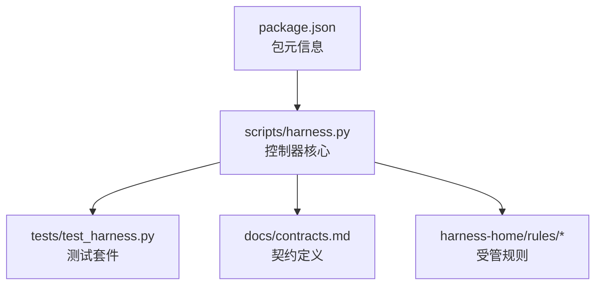
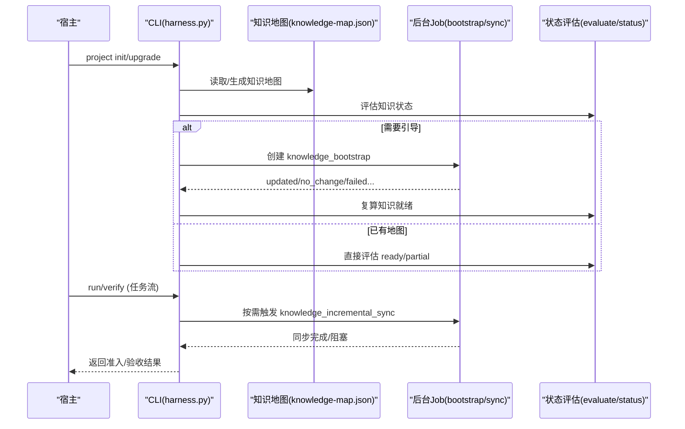
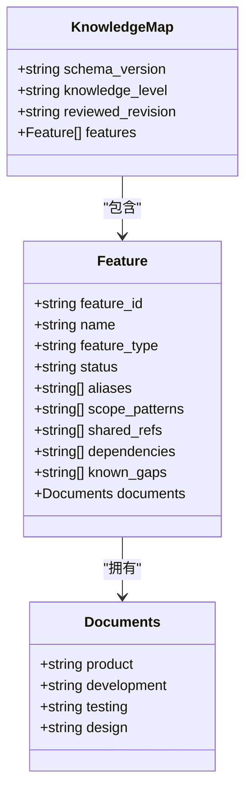
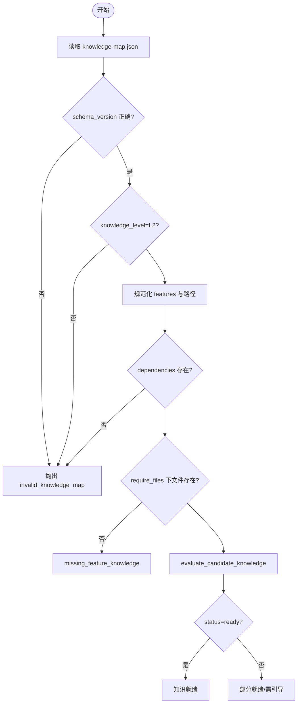
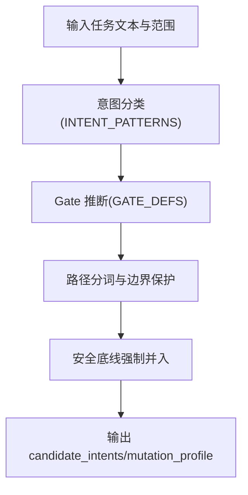
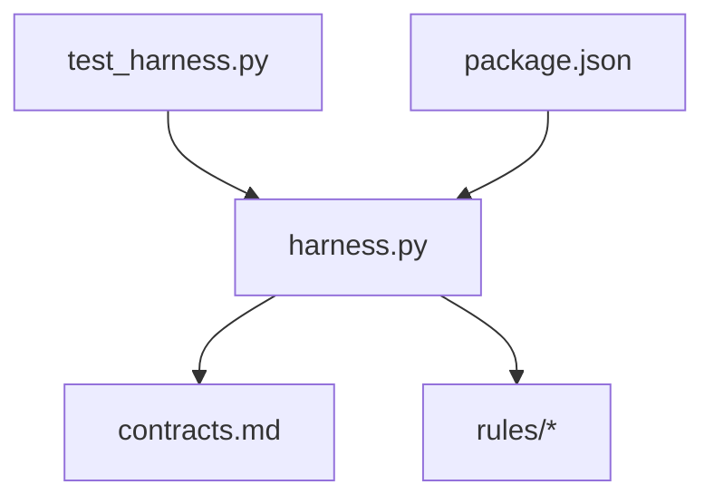

# 知识图谱构建

<cite>
**本文引用的文件**
- [scripts/harness.py](file://scripts/harness.py)
- [tests/test_harness.py](file://tests/test_harness.py)
- [docs/contracts.md](file://docs/contracts.md)
- [SKILL.md](file://SKILL.md)
- [package.json](file://package.json)
</cite>

## 目录
1. [简介](#简介)
2. [项目结构](#项目结构)
3. [核心组件](#核心组件)
4. [架构总览](#架构总览)
5. [详细组件分析](#详细组件分析)
6. [依赖关系分析](#依赖关系分析)
7. [性能考量](#性能考量)
8. [故障排查指南](#故障排查指南)
9. [结论](#结论)
10. [附录](#附录)

## 简介
本文件面向 Docs Harness 的知识图谱构建系统，系统性阐述知识地图数据模型、实体类型与关系映射机制、实体识别算法（文档解析、关键词提取、语义分析）、关系建立策略（依赖检测、引用解析、版本关联）、层次结构维护（父子关系管理、层级验证、一致性检查）、更新策略（增量更新、冲突检测、合并算法）以及查询接口与使用示例。内容严格基于仓库中的控制器实现与合同文档进行归纳与可视化说明，便于非技术读者理解并指导实践。

## 项目结构
Docs Harness 的核心由 Python 控制器脚本、测试套件、合同与规则文档组成：
- scripts/harness.py：控制器源码，包含知识地图读写、校验、状态评估、后台 Job 管理与任务流水线控制等全部关键逻辑。
- tests/test_harness.py：覆盖安装、知识引导、Git 操作、准入与验收流程的单元测试。
- docs/contracts.md：对外契约定义，包括证据收据、上下文授权、Git 状态、工作区漂移归因、后台治理与退出码等。
- harness-home/rules/*：受管规则集，驱动 Gate 推断与计划字段要求。
- package.json：包元信息与脚本入口。

图表来源
- [scripts/harness.py:1-120](file://scripts/harness.py#L1-L120)
- [docs/contracts.md:1-120](file://docs/contracts.md#L1-L120)
- [package.json:1-22](file://package.json#L1-L22)

章节来源
- [scripts/harness.py:1-120](file://scripts/harness.py#L1-L120)
- [docs/contracts.md:1-120](file://docs/contracts.md#L1-L120)
- [package.json:1-22](file://package.json#L1-L22)

## 核心组件
- 知识地图数据模型：以 KNOWLEDGE_MAP_SCHEMA 标识的知识地图 JSON 文件为核心，约束功能清单、类别文档、共享引用与依赖关系。
- 实体类型系统：feature_id 作为稳定 kebab-case 标识；每个 feature 必须包含产品、研发、测试、设计四类文档路径，支持别名、范围模式、共享引用、依赖与已知缺口。
- 关系映射机制：通过 dependencies 声明 feature 间依赖；shared_refs 指向公共事实文档；scope_patterns 将代码路径与功能绑定，用于 Gate 推断与上下文选择。
- 知识状态评估：evaluate_candidate_knowledge 与 knowledge_status 依据文档内容与缺失情况判定 ready/partial/needs_bootstrap 等状态。
- 后台 Job 协同：knowledge_bootstrap/knowledge_incremental_sync 等任务类型驱动知识基线构建与增量同步，阻塞或释放等待者取决于 bootstrap 终态与复算结果。

章节来源
- [scripts/harness.py:1497-1689](file://scripts/harness.py#L1497-L1689)
- [docs/contracts.md:300-370](file://docs/contracts.md#L300-L370)

## 架构总览
知识图谱构建在控制器中贯穿“安装/升级 → 知识引导 → 评估 → 后台 Job → 增量同步”的全生命周期，并与任务准入、证据与验收流程紧密耦合。

图表来源
- [scripts/harness.py:1497-1689](file://scripts/harness.py#L1497-L1689)
- [docs/contracts.md:300-370](file://docs/contracts.md#L300-L370)

## 详细组件分析

### 知识地图数据模型与实体类型系统
- schema_version：固定为 KNOWLEDGE_MAP_SCHEMA，确保版本一致。
- knowledge_level：强制 L2，表示具备功能级结构化知识。
- features：有界数组，每项包含：
  - feature_id：稳定 kebab-case，唯一且不可重复。
  - name：必填名称。
  - documents：四分类文档路径（product/development/testing/design），必须位于独立功能目录 docs/features/{feature_id}/。
  - aliases：别名列表，用于自然语言匹配。
  - scope_patterns：项目内相对路径或 glob，用于范围绑定与 Gate 推断。
  - shared_refs：公共事实文档引用。
  - dependencies：依赖的其他 feature_id，必须在 features 中存在。
  - known_gaps：已知缺口描述。
- reviewed_revision：可选审查修订标记。

图表来源
- [scripts/harness.py:1526-1588](file://scripts/harness.py#L1526-L1588)

章节来源
- [scripts/harness.py:1526-1588](file://scripts/harness.py#L1526-L1588)

### 关系映射机制与依赖检测
- dependencies：声明 feature 间的依赖关系，normalize_knowledge_map 会校验未知依赖并报错。
- scope_patterns：将代码路径与功能绑定，用于后续 Gate 推断、上下文选择与变更影响分析。
- shared_refs：公共事实文档引用，供多个 feature 复用，增强知识一致性。
- meaningful_knowledge_doc：过滤无效/占位文档，仅当正文长度与内容满足阈值才视为有效。

图表来源
- [scripts/harness.py:1526-1588](file://scripts/harness.py#L1526-L1588)
- [scripts/harness.py:1598-1635](file://scripts/harness.py#L1598-L1635)

章节来源
- [scripts/harness.py:1526-1588](file://scripts/harness.py#L1526-L1588)
- [scripts/harness.py:1598-1635](file://scripts/harness.py#L1598-L1635)

### 实体识别算法（文档解析、关键词提取、语义分析）
- 文档解析：按 feature_id 与 category 定位 Markdown 文件，过滤占位文本与过大文件，计算有效正文长度。
- 关键词提取：通过 INTENT_PATTERNS 与 GATE_DEFS 对任务文本与路径做分词与匹配，区分 query/audit/git_inspect/git_fetch/git_sync/modify/external_write 等意图，并推断 Gate。
- 语义分析：结合 scope_patterns 与路径分词（驼峰/帕斯卡/分隔符处理）提升匹配精度，避免误命中；安全底线 Gate 使用精确词表与否定守卫。

图表来源
- [scripts/harness.py:197-342](file://scripts/harness.py#L197-L342)
- [docs/contracts.md:42-46](file://docs/contracts.md#L42-L46)

章节来源
- [scripts/harness.py:197-342](file://scripts/harness.py#L197-L342)
- [docs/contracts.md:42-46](file://docs/contracts.md#L42-L46)

### 关系建立策略（依赖检测、引用解析、版本关联）
- 依赖检测：normalize_knowledge_map 校验 dependencies 集合，拒绝未知依赖。
- 引用解析：shared_refs 指向公共文档，read_knowledge_map 与 evaluate_candidate_knowledge 在评估时考虑这些引用。
- 版本关联：reviewed_revision 标记审查修订；knowledge_status 输出 map_fingerprint 用于增量判断；knowledge_handoff 提供交接合同供后台 Job 使用。

章节来源
- [scripts/harness.py:1526-1588](file://scripts/harness.py#L1526-L1588)
- [scripts/harness.py:1653-1689](file://scripts/harness.py#L1653-L1689)

### 层次结构维护（父子关系管理、层级验证、一致性检查）
- 父子关系：feature_id 作为根节点，dependencies 形成有向无环图（由 normalize_knowledge_map 校验）。
- 层级验证：documents 必须位于 docs/features/{feature_id}/ 下，禁止符号链接与越界路径。
- 一致性检查：meaningful_knowledge_doc 保证文档有效性；knowledge_status 汇总 gaps 并输出 status。

章节来源
- [scripts/harness.py:1526-1588](file://scripts/harness.py#L1526-L1588)
- [scripts/harness.py:1598-1635](file://scripts/harness.py#L1598-L1635)

### 更新策略（增量更新、冲突检测、合并算法）
- 增量更新：knowledge_ready_for_incremental 与 pending_knowledge_jobs 决定是否需要增量同步；bootstrap 成功且复算 ready 才释放等待者。
- 冲突检测：knowledge_dependency_outcome 根据 bootstrap 状态返回 success/blocked/pending/unknown；map_fingerprint 变化触发重新评估。
- 合并算法：project init/upgrade 采用 preserve-and-merge，只同步受管区块；非法路由或缺少路由合同的在途治理 Job 返回 needs_manual_migration，不覆盖真源配置。

章节来源
- [scripts/harness.py:1638-1689](file://scripts/harness.py#L1638-L1689)
- [docs/contracts.md:340-344](file://docs/contracts.md#L340-L344)

### 查询接口与使用示例
- 读取知识地图：read_knowledge_map(target, require_files=True)
- 评估候选知识：evaluate_candidate_knowledge(target, normalized_map)
- 获取知识状态：knowledge_status(target)
- 获取交付路径：knowledge_delivery_paths(target)
- 按 Gate 推导类别：knowledge_categories_for_gates(gates)
- 查找待处理 Job：pending_knowledge_jobs(target, feature_ids)

示例（伪代码）：
- 初始化后读取知识地图并评估状态。
- 若状态为 partial，触发 knowledge_bootstrap 后台 Job。
- bootstrap 完成后再次评估，若 ready，则允许增量同步。

章节来源
- [scripts/harness.py:1591-1689](file://scripts/harness.py#L1591-L1689)

## 依赖关系分析
- 控制器依赖契约文档定义的证据、授权、Git 状态与工作区漂移归因规则。
- 测试套件覆盖安装、知识引导、Git 操作、准入与验收流程，确保行为符合契约。
- 包元信息提供版本与脚本入口，与控制器版本常量保持一致。

图表来源
- [scripts/harness.py:1-120](file://scripts/harness.py#L1-L120)
- [docs/contracts.md:1-120](file://docs/contracts.md#L1-L120)
- [tests/test_harness.py:1-120](file://tests/test_harness.py#L1-L120)
- [package.json:1-22](file://package.json#L1-L22)

章节来源
- [scripts/harness.py:1-120](file://scripts/harness.py#L1-L120)
- [docs/contracts.md:1-120](file://docs/contracts.md#L1-L120)
- [tests/test_harness.py:1-120](file://tests/test_harness.py#L1-L120)
- [package.json:1-22](file://package.json#L1-L22)

## 性能考量
- 文档过滤：meaningful_knowledge_doc 限制文件大小与正文长度，避免大文件与占位内容影响评估。
- 增量评估：knowledge_ready_for_incremental 与 map_fingerprint 减少全量重算。
- 后台 Job 幂等：active_knowledge_bootstrap 复用活动 Job，避免重复创建。
- 验证命令缓存：按输入指纹与 TTL 复用已通过命令，降低重复执行成本。

[本节为通用指导，无需特定文件来源]

## 故障排查指南
- 知识地图无效：检查 schema_version、knowledge_level、features 结构与路径合法性。
- 文档缺失：确认 require_files 模式下所有文档存在且非符号链接。
- 依赖错误：确保 dependencies 中的 feature_id 存在于 features。
- 状态阻塞：查看 knowledge_status.gaps 与 active_job_id，定位 bootstrap 或 sync 问题。
- 验证失败：根据 contracts 的五级处置（provide_evidence/refresh_evidence/retry_verification/incremental_admission/full_readmission）定位原因。

章节来源
- [scripts/harness.py:1526-1689](file://scripts/harness.py#L1526-L1689)
- [docs/contracts.md:134-163](file://docs/contracts.md#L134-L163)

## 结论
Docs Harness 的知识图谱构建系统以知识地图为核心，通过严格的 schema 校验、实体类型约束与关系映射，确保知识的结构化与一致性。结合 Gate 推断、证据与验收流程，系统在增量更新、冲突检测与合并方面提供了稳健的实现。通过清晰的查询接口与使用示例，用户可高效地构建与维护项目知识图谱。

[本节为总结性内容，无需特定文件来源]

## 附录
- 常用 CLI 命令参考 SKILL.md 与 contracts.md。
- 风险 Gate 与安全底线见 GATE_DEFS 与 SAFETY_FLOOR_GATES。
- 后台 Job 状态机见 BACKGROUND_KNOWN_STATES 与 BACKGROUND_TERMINAL_STATES。

章节来源
- [SKILL.md:1-105](file://SKILL.md#L1-L105)
- [scripts/harness.py:260-382](file://scripts/harness.py#L260-L382)
- [scripts/harness.py:97-124](file://scripts/harness.py#L97-L124)