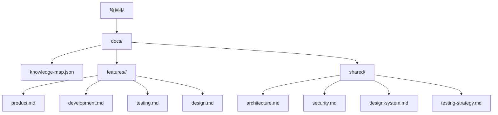
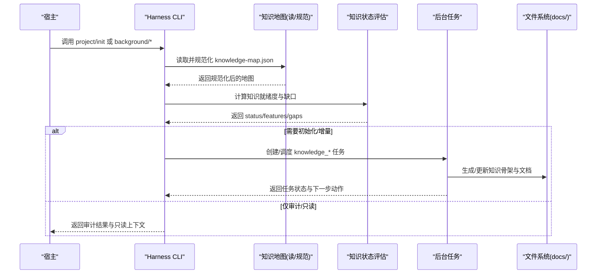
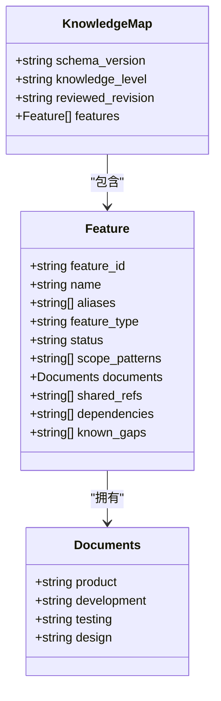
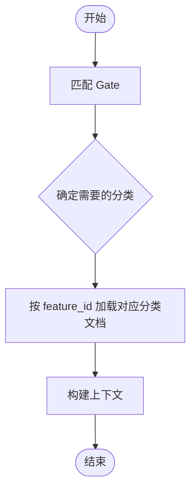
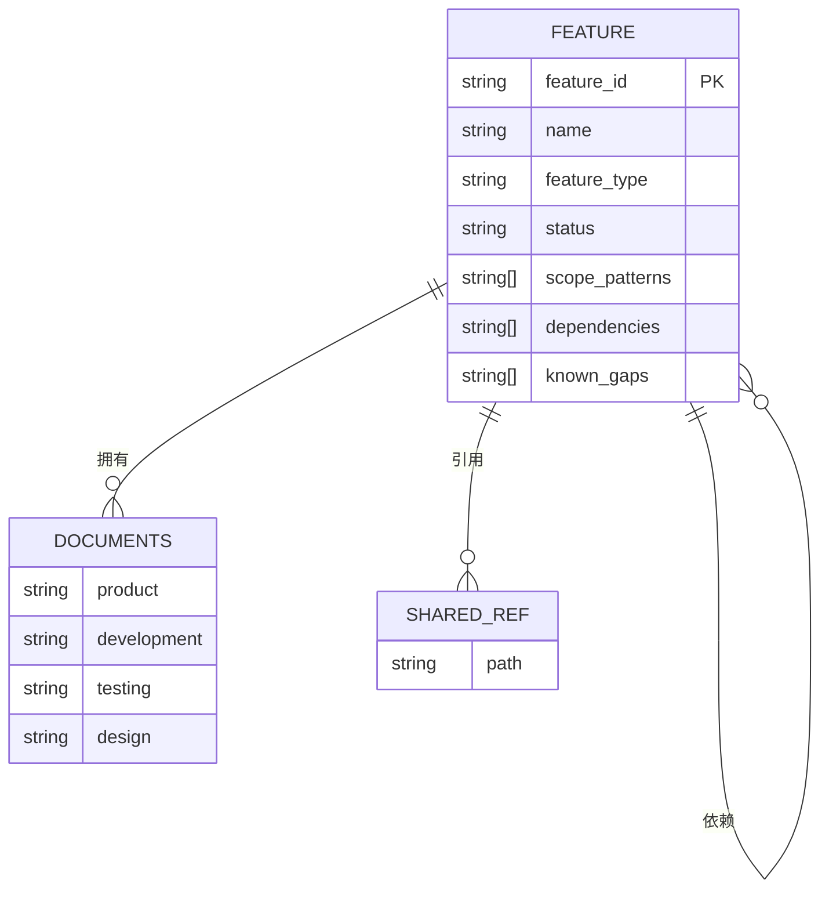
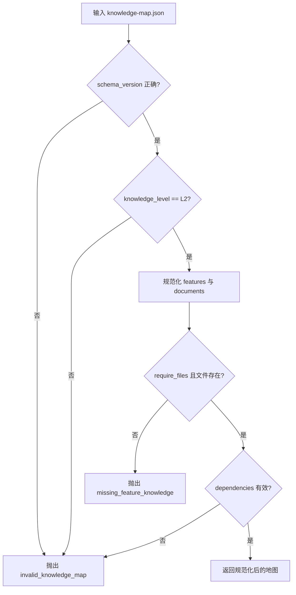
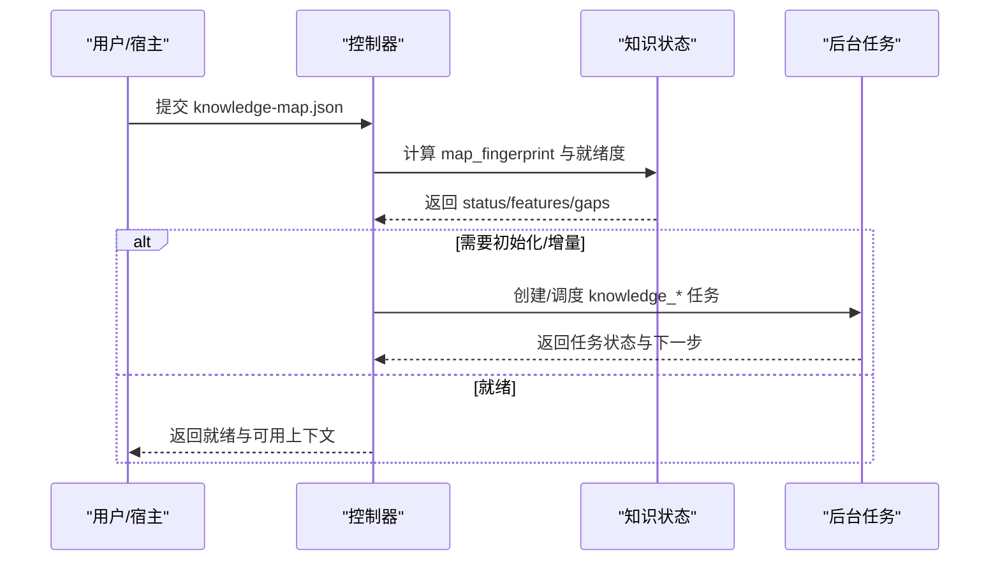
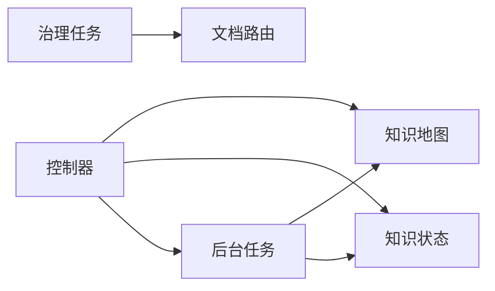

# 知识数据模型

<cite>
**本文引用的文件**   
- [scripts/harness.py](file://scripts/harness.py)
- [tests/test_harness.py](file://tests/test_harness.py)
</cite>

## 目录
1. [简介](#简介)
2. [项目结构](#项目结构)
3. [核心组件](#核心组件)
4. [架构总览](#架构总览)
5. [详细组件分析](#详细组件分析)
6. [依赖关系分析](#依赖关系分析)
7. [性能考量](#性能考量)
8. [故障排查指南](#故障排查指南)
9. [结论](#结论)
10. [附录](#附录)

## 简介
本文件系统化阐述 Docs Harness 的知识数据模型，重点围绕 KNOWLEDGE_MAP_SCHEMA（知识地图 v1）的定义与校验、实体分类体系、知识图谱的核心数据结构（节点/边/层次）、版本与变更追踪机制，以及使用示例与最佳实践。该模型以“功能（feature）”为基本单元，通过四类文档（产品、研发、测试、设计）构建稳定的知识边界，并通过后台任务驱动知识初始化、增量同步与治理。

## 项目结构
- 知识根目录：docs
- 知识地图文件：docs/knowledge-map.json
- 功能文档目录：docs/features/<feature_id>/
- 公共文档目录：docs/shared/
- 运行时与后台工件：.docs-harness/background/jobs/<job-id>/

**图示来源** 
- [scripts/harness.py:91-93](file://scripts/harness.py#L91-L93)
- [scripts/harness.py:353-367](file://scripts/harness.py#L353-L367)

**章节来源**
- [scripts/harness.py:91-93](file://scripts/harness.py#L91-L93)
- [scripts/harness.py:353-367](file://scripts/harness.py#L353-L367)

## 核心组件
- 知识地图 Schema：docs-harness/knowledge-map/v1
- 知识评估 Schema：docs-harness/knowledge-assessment/v1
- 知识同意回执 Schema：docs-harness/knowledge-consent/v1
- 工作负载估算 Schema：docs-harness/workload-estimate/v1
- 背景任务 Schema：docs-harness/background-job/v2（含 knowledge_* 任务）
- 文档路由 Schema：docs-harness/document-routes/v1

上述常量在控制器中统一定义，确保所有读写路径对同一 schema 版本进行校验与兼容处理。

**章节来源**
- [scripts/harness.py:49-52](file://scripts/harness.py#L49-L52)
- [scripts/harness.py:61](file://scripts/harness.py#L61)

## 架构总览
知识数据模型围绕“知识地图”组织，由控制器负责读取、规范化、状态评估与后台任务编排。关键流程包括：
- 读取并规范化 knowledge-map.json
- 基于功能文档内容评估知识就绪度
- 根据 Gate 与范围决定加载哪些类别的文档
- 通过后台任务完成知识初始化、增量同步与治理

**图示来源** 
- [scripts/harness.py:1501-1588](file://scripts/harness.py#L1501-L1588)
- [scripts/harness.py:1621-1684](file://scripts/harness.py#L1621-L1684)
- [scripts/harness.py:1687-1728](file://scripts/harness.py#L1687-L1728)

## 详细组件分析

### KNOWLEDGE_MAP_SCHEMA 定义与结构
- 顶层字段
  - schema_version：固定为 docs-harness/knowledge-map/v1
  - knowledge_level：必须为 L2
  - reviewed_revision：可选，用于关联审查修订
  - features：功能清单数组（最多 500 项）
- 功能对象字段
  - feature_id：稳定 kebab-case 标识符，唯一且不可重复
  - name：非空名称
  - aliases：别名列表
  - feature_type：类型（默认 user_capability）
  - status：状态（默认 implemented）
  - scope_patterns：作用域模式（项目内相对路径）
  - documents：四类文档映射（product/development/testing/design），每个值必须是 docs/features/<feature_id>/ 下的独立文件
  - shared_refs：共享引用（docs/shared/*.md）
  - dependencies：依赖的功能 ID 集合（必须存在于 features 中）
  - known_gaps：已知缺口列表

**图示来源** 
- [scripts/harness.py:1501-1588](file://scripts/harness.py#L1501-L1588)

**章节来源**
- [scripts/harness.py:1501-1588](file://scripts/harness.py#L1501-L1588)

### 实体分类体系与加载策略
- 分类集合：product、development、testing、design
- Gate 到分类的映射：不同 Gate 触发时仅加载所需类别的文档，减少上下文噪声
- 动态选择：根据任务意图与 Gate 匹配结果，从知识地图中筛选出对应功能的指定类别文档

**图示来源** 
- [scripts/harness.py:93](file://scripts/harness.py#L93)
- [scripts/harness.py:369-379](file://scripts/harness.py#L369-L379)

**章节来源**
- [scripts/harness.py:93](file://scripts/harness.py#L93)
- [scripts/harness.py:369-379](file://scripts/harness.py#L369-L379)

### 知识图谱核心数据结构
- 节点：功能（feature）作为知识节点，包含标识、名称、类型、状态、作用域、文档路径、共享引用、依赖与缺口
- 边：dependencies 表示功能间的依赖关系；shared_refs 表示跨功能共享的文档引用
- 层次：docs/features/<feature_id>/ 下按分类组织文档，形成“功能-分类”二维层次

**图示来源** 
- [scripts/harness.py:1501-1588](file://scripts/harness.py#L1501-L1588)

**章节来源**
- [scripts/harness.py:1501-1588](file://scripts/harness.py#L1501-L1588)

### 数据验证规则与错误处理
- schema_version 必须匹配 KNOWLEDGE_MAP_SCHEMA
- knowledge_level 必须为 L2
- features 数组长度不超过 500
- feature_id 必须符合 kebab-case 正则且唯一
- documents 必须包含四类键且路径位于 docs/features/<feature_id>/
- 当 require_files=true 时，检查四类文档是否存在
- 依赖项必须在 features 中存在
- 路径安全校验：不允许绝对路径、越界、符号链接

**图示来源** 
- [scripts/harness.py:1526-1588](file://scripts/harness.py#L1526-L1588)

**章节来源**
- [scripts/harness.py:1526-1588](file://scripts/harness.py#L1526-L1588)

### 版本管理与变更追踪
- 知识地图指纹：通过 file_fingerprint(knowledge_map_path) 计算 map_fingerprint，用于检测地图变更
- 审查修订：reviewed_revision 字段可绑定审查版本
- 知识就绪度：evaluate_candidate_knowledge 与 knowledge_status 基于文档内容与缺失情况给出 ready/partial/needs_bootstrap/absent/quarantined 等状态
- 后台任务：knowledge_bootstrap、knowledge_incremental_sync 等任务驱动知识初始化与增量同步，并在状态变化时触发重新准入或审计

**图示来源** 
- [scripts/harness.py:1621-1684](file://scripts/harness.py#L1621-L1684)
- [scripts/harness.py:1687-1728](file://scripts/harness.py#L1687-L1728)

**章节来源**
- [scripts/harness.py:1621-1684](file://scripts/harness.py#L1621-L1684)
- [scripts/harness.py:1687-1728](file://scripts/harness.py#L1687-L1728)

### 使用示例与最佳实践
- 最小化知识骨架：新项目中先安装并生成共享文档模板，再逐步完善各功能四类文档
- 明确作用域：scope_patterns 应精确限定代码/配置范围，避免过度宽泛
- 合理声明依赖：dependencies 仅指向已存在的 feature_id，保持图无环且可解析
- 渐进式充实：优先补齐关键 Gate 所需的分类文档，提升知识就绪度
- 使用同意回执：在审计现有文档时，通过 knowledge-consent 授权受控范围，避免误改

参考测试用例中的初始化与知识构造流程，可复现标准用法。

**章节来源**
- [tests/test_harness.py:108-144](file://tests/test_harness.py#L108-L144)
- [tests/test_harness.py:377-392](file://tests/test_harness.py#L377-L392)

## 依赖关系分析
- 控制器对知识地图的依赖：读取、规范化、状态评估、按需加载分类文档
- 后台任务对知识状态的依赖：根据就绪度决定是否允许增量同步或需重新审计
- 文档路由对治理交付物的依赖：在 delivery_governance 任务中，依据 required_kinds 锁定文档类型与作用域

**图示来源** 
- [scripts/harness.py:1501-1588](file://scripts/harness.py#L1501-L1588)
- [scripts/harness.py:1621-1684](file://scripts/harness.py#L1621-L1684)
- [scripts/harness.py:8105-8193](file://scripts/harness.py#L8105-L8193)

**章节来源**
- [scripts/harness.py:1501-1588](file://scripts/harness.py#L1501-L1588)
- [scripts/harness.py:1621-1684](file://scripts/harness.py#L1621-L1684)
- [scripts/harness.py:8105-8193](file://scripts/harness.py#L8105-L8193)

## 性能考量
- 知识地图规模限制：features 最多 500 项，避免过大导致规范化与校验耗时
- 文档大小限制：单个知识文档超过 1MB 视为无效，防止大文件拖慢扫描
- 按需加载：仅加载 Gate 所需的分类文档，降低上下文体积
- 指纹计算：map_fingerprint 仅在必要时计算，避免频繁哈希开销

[本节为通用指导，不直接分析具体文件]

## 故障排查指南
- invalid_knowledge_map：检查 schema_version、knowledge_level、feature_id 格式与唯一性
- missing_feature_knowledge：确认四类文档存在且路径正确
- knowledge_consent_mismatch/stale：核对 authorized_scope 覆盖性与指纹一致性
- knowledge_status 为 quarantined：查看 reason_code 与 gaps 定位问题

**章节来源**
- [scripts/harness.py:1526-1588](file://scripts/harness.py#L1526-L1588)
- [scripts/harness.py:1653-1684](file://scripts/harness.py#L1653-L1684)
- [scripts/harness.py:8054-8077](file://scripts/harness.py#L8054-L8077)

## 结论
Docs Harness 的知识数据模型以知识地图为核心，通过严格的 schema 校验、分类加载策略与后台任务编排，实现了稳定、可演进、可审计的知识体系。遵循本文档的结构与最佳实践，可在复杂项目中高效维护高质量的知识上下文，支撑意图优先的任务执行与治理。

[本节为总结，不直接分析具体文件]

## 附录
- 常用命令与入口：project init、background prepare/dispatch/progress/verify、knowledge audit
- 关键常量与路径：KNOWLEDGE_ROOT_RELATIVE、KNOWLEDGE_MAP_RELATIVE、KNOWLEDGE_CATEGORIES
- 风险 Gate 与证据类型：见控制器中 GATE_DEFS 与 HIGH_RISK_EVIDENCE_TYPES

**章节来源**
- [scripts/harness.py:91-93](file://scripts/harness.py#L91-L93)
- [scripts/harness.py:260-342](file://scripts/harness.py#L260-L342)
- [scripts/harness.py:250-257](file://scripts/harness.py#L250-L257)