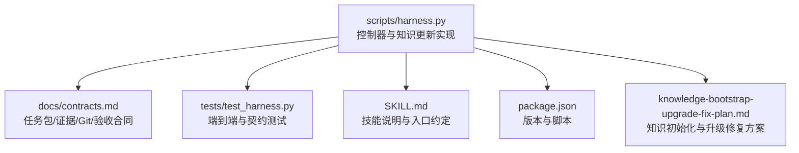
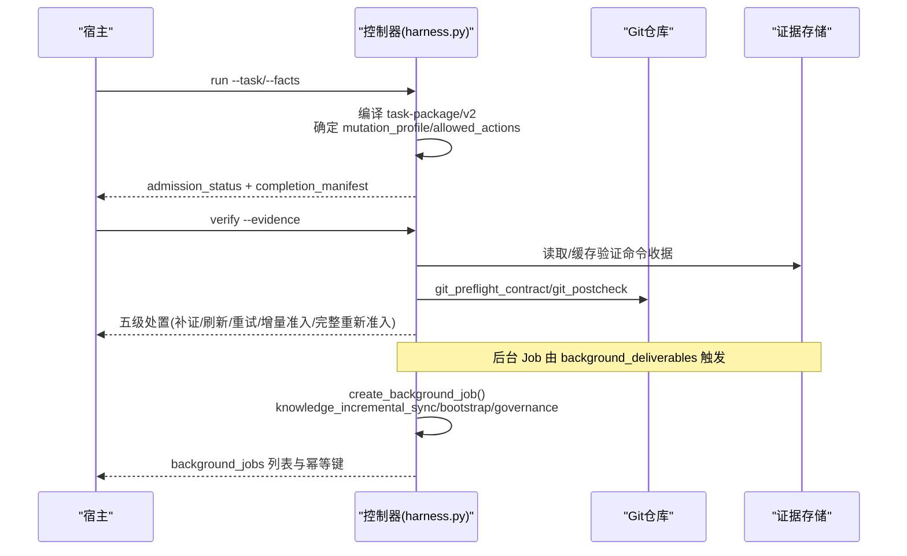
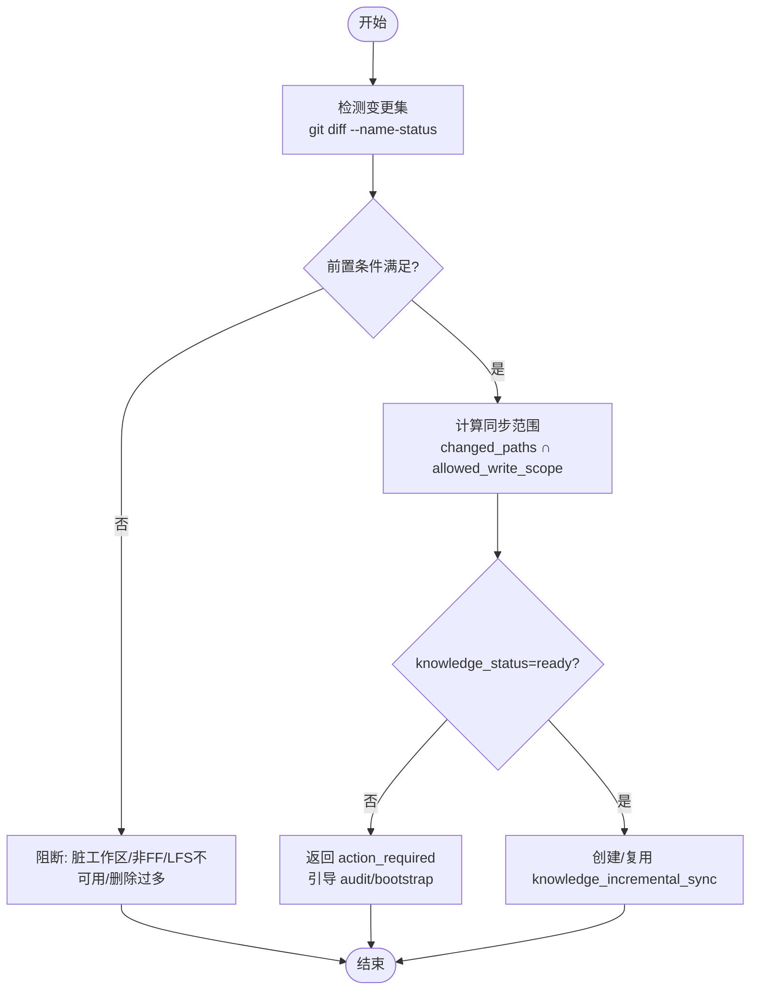
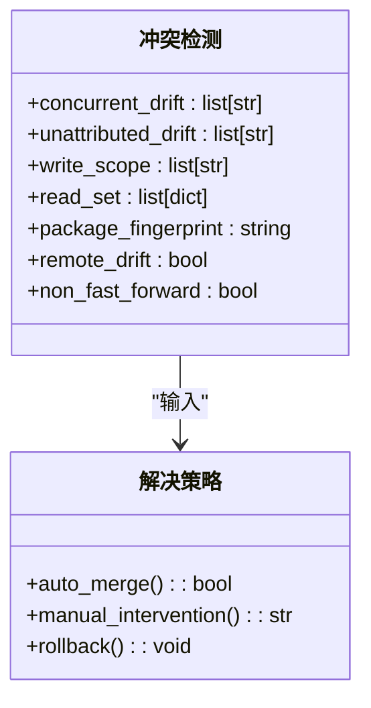
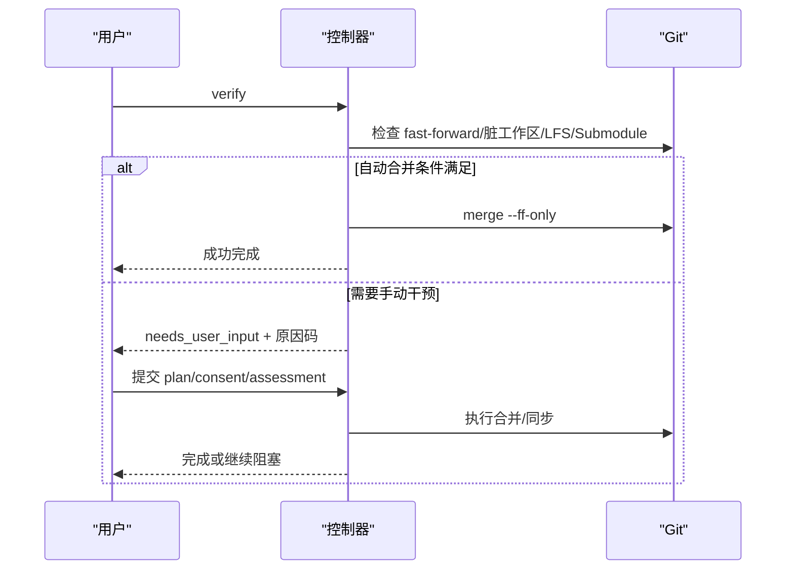
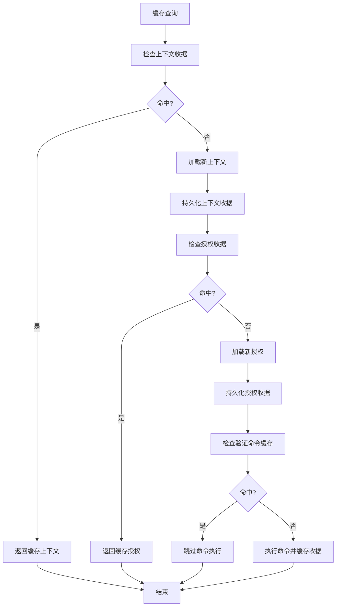
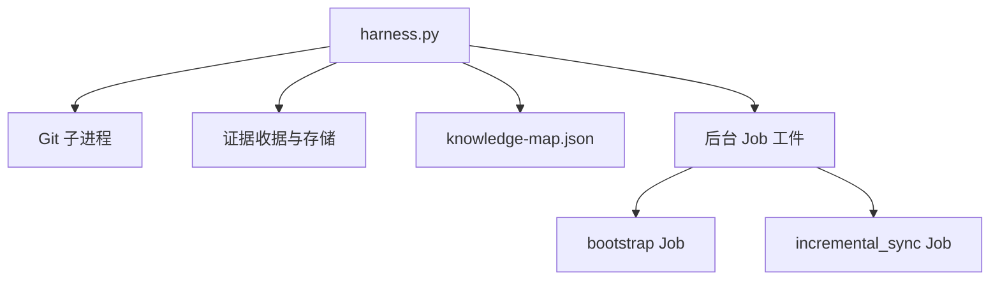

# 知识更新策略

<cite>
**本文引用的文件**   
- [scripts/harness.py](file://scripts/harness.py)
- [tests/test_harness.py](file://tests/test_harness.py)
- [docs/contracts.md](file://docs/contracts.md)
- [SKILL.md](file://SKILL.md)
- [package.json](file://package.json)
- [docs/plans/knowledge-bootstrap-upgrade-fix-plan.md](file://docs/plans/knowledge-bootstrap-upgrade-fix-plan.md)
</cite>

## 目录
1. [简介](#简介)
2. [项目结构](#项目结构)
3. [核心组件](#核心组件)
4. [架构总览](#架构总览)
5. [详细组件分析](#详细组件分析)
6. [依赖关系分析](#依赖关系分析)
7. [性能考虑](#性能考虑)
8. [故障排查指南](#故障排查指南)
9. [结论](#结论)
10. [附录](#附录)

## 简介
本文件系统性阐述 Docs Harness 的知识更新策略，重点覆盖：
- 增量更新机制：变更检测、差异计算与选择性同步
- 冲突检测算法：并发修改识别、版本冲突解决与合并策略
- 合并算法实现：自动合并、手动干预与回滚机制
- 知识缓存策略：缓存失效、性能优化与内存管理
- 更新操作的 API 接口与批量处理方法
- 更新监控、日志记录与错误恢复

该策略以“任务包 v2”和“后台 Job v2”为核心契约，通过 Git 状态快照、工作区指纹与证据收据驱动可审计的增量同步流程。

## 项目结构
- 控制器主入口与核心逻辑集中在 scripts/harness.py
- 行为契约与验收规则在 docs/contracts.md
- 技能说明与使用约定在 SKILL.md
- 自动化测试覆盖关键路径在 tests/test_harness.py
- 版本与打包元数据在 package.json
- 知识初始化与升级修复方案在 docs/plans/knowledge-bootstrap-upgrade-fix-plan.md

**图表来源** 
- [scripts/harness.py:1-120](file://scripts/harness.py#L1-L120)
- [docs/contracts.md:1-120](file://docs/contracts.md#L1-L120)

**章节来源**
- [scripts/harness.py:1-120](file://scripts/harness.py#L1-L120)
- [docs/contracts.md:1-120](file://docs/contracts.md#L1-L120)
- [package.json:1-23](file://package.json#L1-L23)

## 核心组件
- 知识生命周期与就绪判定
  - knowledge_status(target)：返回 ready/partial/needs_audit/needs_bootstrap/building/quarantined 等状态
  - knowledge_ready_for_incremental(target)：仅当 status=ready 允许增量
  - knowledge_handoff(target, operation, docs_preexisted)：统一 init/upgrade 的知识交接合同
- 增量 Job 创建与等待
  - create_post_completion_governance_job()：按 background_deliverables 派生治理 Job（含 feature_knowledge_incremental_sync）
  - create_background_job()：幂等创建/复用 Job，处理 idempotency_key、package_fingerprint 与 rebase
  - waiting_for_bootstrap_merge：依赖 bootstrap 完成且知识 ready 后才释放
- Git 预检与后检
  - git_preflight_contract()：生成 git_state_snapshot，校验 fast-forward、脏工作区、LFS/Submodule
  - git_postcheck()：验证受控 ref 变化范围与 diff scope
- 证据与命令缓存
  - evidence-receipt/v2：绑定 task_id、target_identity、package_fingerprint、read_set/write_set
  - verification_command_cache_enabled：逐项收据缓存命中/重跑策略

**章节来源**
- [scripts/harness.py:1700-1899](file://scripts/harness.py#L1700-L1899)
- [scripts/harness.py:7680-7879](file://scripts/harness.py#L7680-L7879)
- [docs/contracts.md:97-221](file://docs/contracts.md#L97-L221)

## 架构总览
Docs Harness 的知识更新采用“任务包 + 后台 Job + 证据收据”的三段式架构：
- 任务包 v2 冻结意图、范围、Gate 与交付物清单
- 后台 Job v2 承载知识 bootstrap/incremental_sync/governance 的执行计划与进度
- 证据收据 v2 提供可复用的验收凭证，支持命令级缓存与自动归因

**图表来源** 
- [scripts/harness.py:7680-7879](file://scripts/harness.py#L7680-L7879)
- [docs/contracts.md:9-133](file://docs/contracts.md#L9-L133)

## 详细组件分析

### 增量更新机制：变更检测、差异计算与选择性同步
- 变更检测
  - 基于 Git diff 与 name-status 解析变更路径集合，过滤删除数量阈值与 LFS/Submodule 可用性
  - 工作区快照指纹用于基线对比与漂移检测
- 差异计算
  - 对目标 OID 与 HEAD 执行 diff，得到新增/修改/删除/重命名路径清单
  - 将远端漂移导致的已落盘文件纳入 git_sync_landed_scope，跨多次漂移累积
- 选择性同步
  - 仅对 changed_paths 与 allowed_write_scope 交集进行知识更新
  - 若 knowledge_status≠ready 且无活动 bootstrap，则不创建增量 Job，返回 action_required 并引导 audit/bootstrap

**图表来源** 
- [scripts/harness.py:680-794](file://scripts/harness.py#L680-L794)
- [scripts/harness.py:7680-7769](file://scripts/harness.py#L7680-L7769)

**章节来源**
- [scripts/harness.py:680-794](file://scripts/harness.py#L680-L794)
- [scripts/harness.py:7680-7769](file://scripts/harness.py#L7680-L7769)

### 冲突检测算法：并发修改识别、版本冲突解决与合并策略
- 并发修改识别
  - concurrent_drift：由可信生产者证明来自并发进程的变化；与读写范围重叠时阻断或告警
  - unattributed_drift：无法证明来源的变化，超出 write_scope 直接失败关闭
- 版本冲突解决
  - package_fingerprint 变化或 changed_paths 不一致时，旧 Job 标记 needs_rebase
  - 远端漂移导致 ref 越界或非 FF，强制重新准入
- 合并策略
  - 自动合并：fast-forward 且无脏工作区重叠时可直接 merge
  - 手动干预：非 FF、分支分歧、危险删除阈值超限需人工介入
  - 回滚机制：v1→v2 迁移中断全对象备份回滚；任务取消只写控制面，不改动既有证据

**图表来源** 
- [docs/contracts.md:134-163](file://docs/contracts.md#L134-L163)
- [scripts/harness.py:7680-7769](file://scripts/harness.py#L7680-L7769)

**章节来源**
- [docs/contracts.md:134-163](file://docs/contracts.md#L134-L163)
- [scripts/harness.py:7680-7769](file://scripts/harness.py#L7680-L7769)

### 合并算法实现：自动合并、手动干预与回滚机制
- 自动合并
  - 满足 fast-forward、无脏工作区重叠、LFS/Submodule 可用时，控制器允许直接 merge
  - 远端漂移后，git_sync_landed_scope 自动归因已落盘文件并入 write_scope
- 手动干预
  - 非 FF、分支分歧、删除数量超过阈值、LFS/Submodule 不可用时进入 needs_user_input
  - 用户需提供 plan/consent/assessment 等受控输入
- 回滚机制
  - v1→v2 迁移失败时按全对象备份回滚，保持首次 workspace 基线不变
  - 任务取消只更新 control_status 与事件，不改写任务包/证据/上下文收据

**图表来源** 
- [scripts/harness.py:680-794](file://scripts/harness.py#L680-L794)
- [docs/contracts.md:97-133](file://docs/contracts.md#L97-L133)

**章节来源**
- [scripts/harness.py:680-794](file://scripts/harness.py#L680-L794)
- [docs/contracts.md:97-133](file://docs/contracts.md#L97-L133)

### 知识缓存策略：缓存失效、性能优化与内存管理
- 上下文缓存
  - context-receipt/v2 按 task_id/target_identity/stage/compiler_contract/content_set_fingerprint 复用
  - 跨修订或内容集合变化必须重载，避免重复加载规则与事实正文
- 授权收据缓存
  - authorization-receipt/v2 始终绑定当前 package fingerprint，不按内容集合跨修订复用
- 验证命令缓存
  - verification-command-receipt/v1 按 argv/produces/输入指纹缓存，命中则跳过执行
  - 可通过 project config 整体关闭缓存
- 内存管理
  - 事件与收据仅保存有界字段，避免敏感信息泄露
  - 大文件指纹计算分块读取，降低内存峰值

**图表来源** 
- [docs/contracts.md:222-234](file://docs/contracts.md#L222-L234)
- [scripts/harness.py:1191-1201](file://scripts/harness.py#L1191-L1201)

**章节来源**
- [docs/contracts.md:222-234](file://docs/contracts.md#L222-L234)
- [scripts/harness.py:1191-1201](file://scripts/harness.py#L1191-L1201)

### 更新操作的 API 接口与批量处理方法
- 知识操作
  - knowledge status/estimate/audit/bootstrap/update/verify
  - update 支持 --assessment/--consent，返回 job_id 与幂等性
- 后台 Job 管理
  - background prepare/dispatch/progress/verify/retry
  - 复杂路线支持 goal/plan/work_packages 多阶段推进
- 批量处理
  - pending_knowledge_jobs(target, feature_ids)：按功能 ID 筛选待处理 Job
  - list_background_jobs()/read_knowledge_job()/write_background_job()：批量读写 Job 工件

**章节来源**
- [scripts/harness.py:9270-9469](file://scripts/harness.py#L9270-L9469)
- [scripts/harness.py:1841-1871](file://scripts/harness.py#L1841-L1871)

### 更新监控、日志记录与错误恢复机制
- 监控
  - project check 输出 knowledge_status/knowledge_flow/next_action
  - 非终态 Job 超过 stale_after 给出 yellow/action-required 提醒
- 日志记录
  - events.jsonl 仅保存脱敏字段：phase/duration_ms/reason_code/package_revision/context_cache_hit 等
  - 禁止保存用户任务正文、原始工具输出、环境变量、凭证或完整日志
- 错误恢复
  - 迁移中断按全对象备份回滚
  - 任务取消幂等去重，不同原因返回冲突
  - 验证失败重试、证据刷新、增量准入等五级处置

**章节来源**
- [docs/contracts.md:283-301](file://docs/contracts.md#L283-L301)
- [docs/contracts.md:236-282](file://docs/contracts.md#L236-L282)

## 依赖关系分析
- 控制器依赖 Git 子进程进行状态探测与操作
- 证据收据依赖受管 artifact store，原始文件删除不影响已采纳证据
- 知识地图与功能文档作为真源，被准入上下文选择性加载
- 后台 Job 与工作包状态机强耦合，依赖 bootstrap 完成才能释放增量任务

**图表来源** 
- [scripts/harness.py:549-613](file://scripts/harness.py#L549-L613)
- [scripts/harness.py:7680-7879](file://scripts/harness.py#L7680-L7879)

**章节来源**
- [scripts/harness.py:549-613](file://scripts/harness.py#L549-L613)
- [scripts/harness.py:7680-7879](file://scripts/harness.py#L7680-L7879)

## 性能考虑
- 变更集裁剪：仅扫描 changed_paths 与 allowed_write_scope 交集，避免全仓扫描
- 指纹计算：文件指纹分块读取，减少内存占用
- 缓存命中：上下文/授权/验证命令缓存显著降低重复开销
- 事件脱敏：仅保留有界字段，降低 I/O 与存储压力

## 故障排查指南
- 常见阻断原因
  - 脏工作区与 sync 范围重叠、非 fast-forward、删除数量超限、LFS/Submodule 不可用
  - 知识未 ready 且无活动 bootstrap，返回 action_required
- 诊断步骤
  - 运行 project check 查看 knowledge_status/knowledge_flow
  - 检查 events.jsonl 中的 reason_code 与 package_revision
  - 验证 git_preflight_contract 与 git_postcheck 结果
- 恢复措施
  - 清理脏工作区或显式 plan 解决分歧
  - 提供 consent/assessment 完成知识初始化
  - 重试验证命令或刷新证据

**章节来源**
- [scripts/harness.py:680-794](file://scripts/harness.py#L680-L794)
- [docs/contracts.md:153-163](file://docs/contracts.md#L153-L163)

## 结论
Docs Harness 的知识更新策略以契约驱动、证据可复用与失败关闭为核心原则，通过 Git 状态快照、工作区指纹与后台 Job 状态机实现安全可控的增量同步。其设计兼顾性能与可观测性，提供完整的冲突检测、合并策略与错误恢复机制，确保知识库在复杂协作场景下的正确性与一致性。

## 附录
- 技能说明与入口约定见 SKILL.md
- 完整契约定义见 docs/contracts.md
- 知识初始化与升级修复方案见 knowledge-bootstrap-upgrade-fix-plan.md
- 自动化测试覆盖关键路径见 tests/test_harness.py