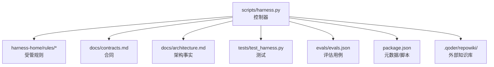
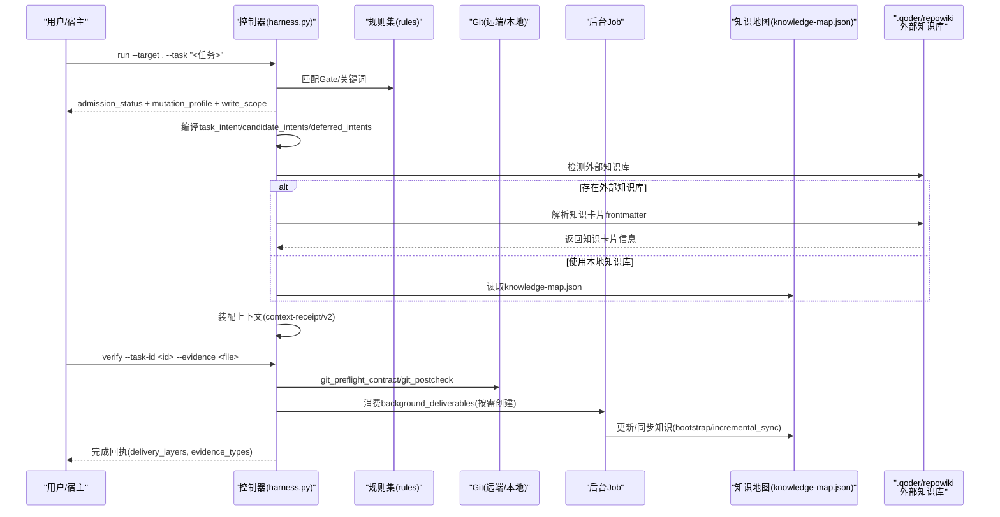
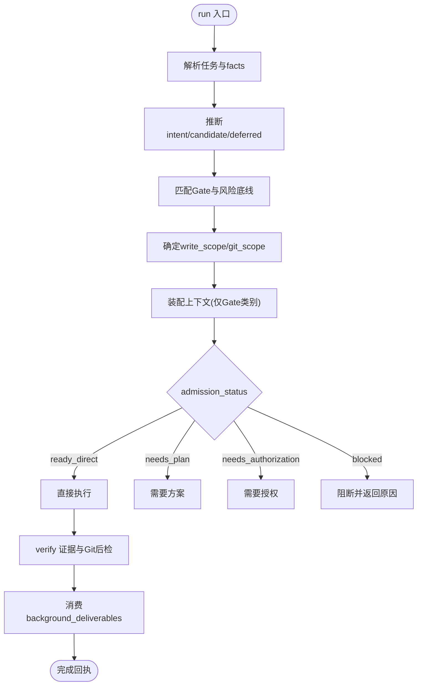
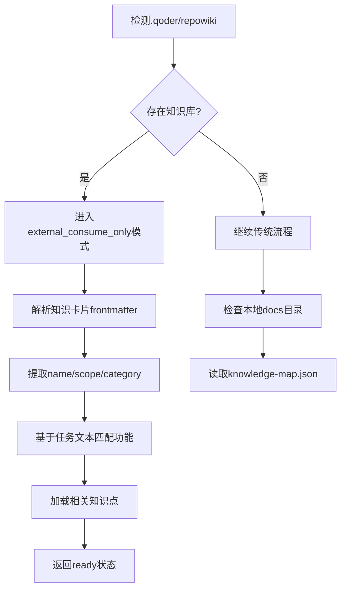
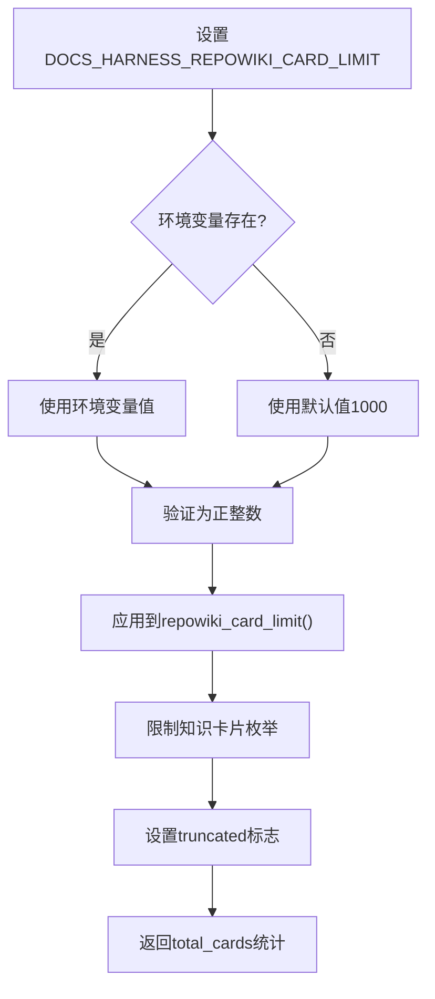
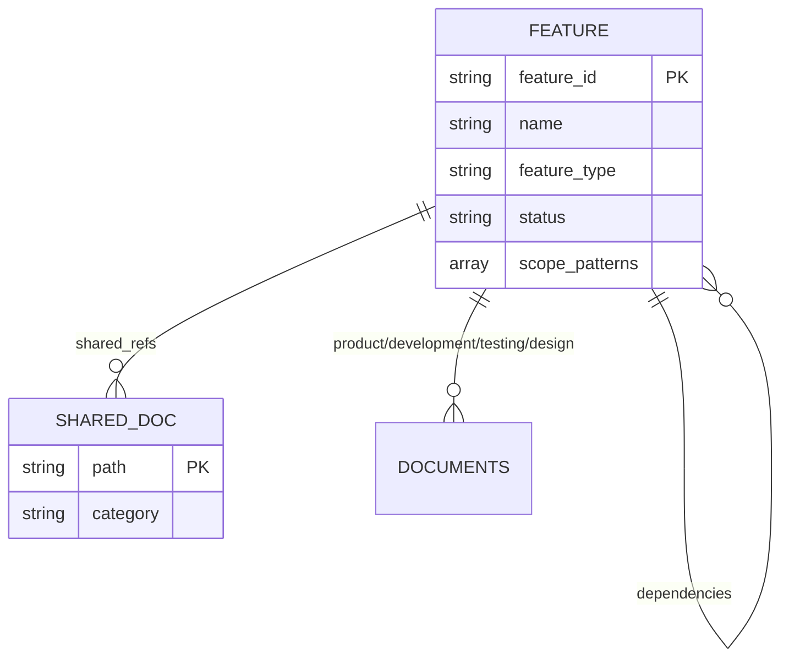
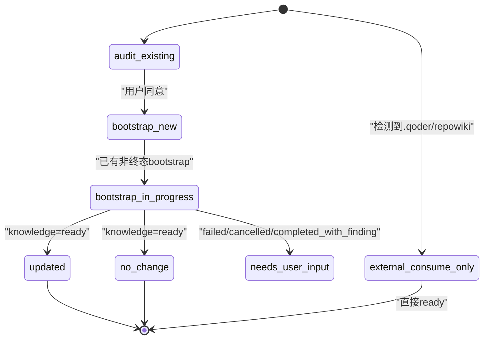
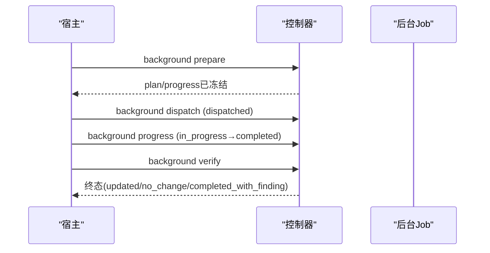
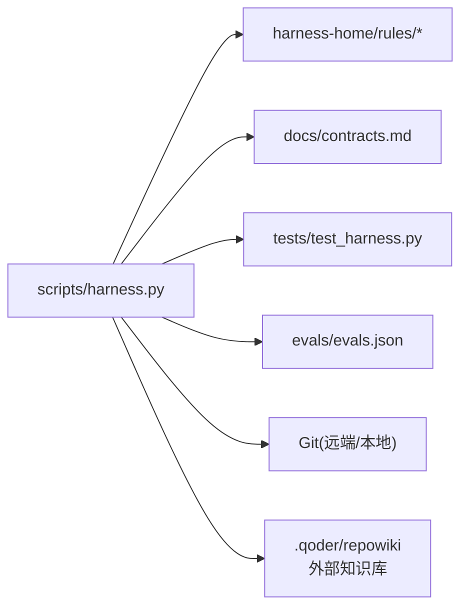

# 知识管理

<cite>
**本文引用的文件**   
- [scripts/harness.py](file://scripts/harness.py)
- [tests/test_harness.py](file://tests/test_harness.py)
- [docs/contracts.md](file://docs/contracts.md)
- [package.json](file://package.json)
- [evals/evals.json](file://evals/evals.json)
- [harness-home/rules/INDEX.md](file://harness-home/rules/INDEX.md)
- [harness-home/rules/api-compatibility.md](file://harness-home/rules/api-compatibility.md)
- [harness-home/rules/documentation-changes.md](file://harness-home/rules/documentation-changes.md)
- [harness-home/rules/external-input-security.md](file://harness-home/rules/external-input-security.md)
- [harness-home/rules/testing-release.md](file://harness-home/rules/testing-release.md)
- [docs/plans/knowledge-bootstrap-upgrade-fix-plan.md](file://docs/plans/knowledge-bootstrap-upgrade-fix-plan.md)
</cite>

## 更新摘要
**所做更改**   
- repowiki 知识卡片限制从 200 增加到 1000，提升外部知识库处理能力
- 新增 DOCS_HARNESS_REPOWIKI_CARD_LIMIT 环境变量支持，允许动态配置卡片数量限制
- 增强可观察性，在 knowledge_status 和 knowledge_context 中返回 total_cards 和 truncated 字段
- 优化知识处理管道透明度，提供截断状态和总数统计信息

## 目录
1. [引言](#引言)
2. [项目结构](#项目结构)
3. [核心组件](#核心组件)
4. [架构总览](#架构总览)
5. [详细组件分析](#详细组件分析)
6. [依赖分析](#依赖分析)
7. [性能考虑](#性能考虑)
8. [故障排查指南](#故障排查指南)
9. [结论](#结论)
10. [附录](#附录)

## 引言
本文件面向 Docs Harness 知识管理系统，系统性阐述其文档组织结构、知识图谱构建、上下文自动生成、质量评估与估算、知识引导（bootstrap）流程、迁移与升级策略，并给出配置示例与最佳实践。系统以"意图优先、证据可复用、失败关闭"为核心原则，通过控制器 CLI、规则集、合同与后台 Job 状态机，实现任务准入、范围治理、Git 交付检查、证据与验收闭环以及知识库的增量同步与版本演进。

**更新** 新增对外部知识库的支持，特别是 .qoder/repowiki 集成，提供外部只消费模式，无需本地知识库即可使用完整的知识管理能力。最新改进包括将知识卡片限制提升至 1000 张，并提供更丰富的可观察性指标。

## 项目结构
Docs Harness 采用"控制器 + 规则 + 合同 + 测试 + 评估"的分层组织：
- scripts/harness.py：独立控制器源码真源，负责安装/升级、任务准入、上下文、验收、知识生命周期与后台 Job 状态机。
- harness-home/rules：发布包内受管规则快照，随项目安装到目标项目的 .docs-harness/harness-home/rules/。
- docs：对外行为与契约说明，包含架构事实、合同、测试事实与计划方案。
- tests：单元测试与集成用例，覆盖安装、任务流、知识生命周期、后台 Job、兼容迁移等。
- evals：评估用例清单，用于自动化断言关键路径与回归。
- package.json：元数据与脚本入口，定义自检与打包检查。

图表来源
- [scripts/harness.py:1-120](file://scripts/harness.py#L1-L120)
- [docs/architecture.md:1-26](file://docs/architecture.md#L1-L26)
- [docs/contracts.md:1-120](file://docs/contracts.md#L1-L120)
- [harness-home/rules/INDEX.md:1-41](file://harness-home/rules/INDEX.md#L1-L41)
- [package.json:1-23](file://package.json#L1-L23)

章节来源
- [docs/architecture.md:1-26](file://docs/architecture.md#L1-L26)
- [package.json:1-23](file://package.json#L1-L23)

## 核心组件
- 控制器（CLI）：提供 project/run/background/verify/task 等命令，统一编排任务准入、上下文装配、证据校验、Git 预检/后检、后台 Job 状态机与知识生命周期。
- 规则集：按 Gate 与关键词匹配激活，约束方案字段、证据类型与失败模式，确保 API 兼容、外部输入安全、文档变更、测试放行等。
- 合同：定义 task-package/v2、evidence-receipt/v2、context-receipt/v2、background-job/v2 等数据结构与行为不变量。
- 测试与评估：覆盖正向、负向、幂等、兼容、状态恢复与真实下游升级；评估用例驱动回归与一致性验证。
- 知识地图与模板：knowledge-map.json 描述功能与共享文档映射，配合 KNOWLEDGE_SCAFFOLD 生成最小骨架。
- **新增** 外部知识库支持：.qoder/repowiki 集成，提供外部只消费模式，无需本地知识库初始化。

章节来源
- [scripts/harness.py:1-200](file://scripts/harness.py#L1-L200)
- [docs/contracts.md:1-200](file://docs/contracts.md#L1-L200)
- [harness-home/rules/INDEX.md:1-41](file://harness-home/rules/INDEX.md#L1-L41)

## 架构总览
Docs Harness 以控制器为中心，串联"任务意图 → Gate 判定 → 范围授权 → 上下文装配 → 执行与证据 → Git 交付检查 → 后台治理 → 知识同步"。

图表来源
- [scripts/harness.py:1-200](file://scripts/harness.py#L1-L200)
- [docs/contracts.md:1-200](file://docs/contracts.md#L1-L200)
- [docs/architecture.md:1-26](file://docs/architecture.md#L1-L26)

## 详细组件分析

### 控制器与任务流（run/verify/context）
- 任务入口：run 先编译意图与风险 Gate，再取最高 mutation_profile；只读查询使用 read_only + write_scope=[]。
- 幂等复用：同一 target、任务文本、事实与工作区快照命中活动任务时返回 active_task_reused，不重复建立上下文与授权。
- 证据与验收：verify 支持五级处置（provide_evidence/refresh_evidence/retry_verification/incremental_admission/full_readmission），命令收据缓存与 volatile 副产物白名单。
- Git 预检/后检：git_fetch/git_sync 绑定 git_state_snapshot，严格限制 ref 变化、工作区漂移与非 fast-forward。

图表来源
- [scripts/harness.py:1-200](file://scripts/harness.py#L1-L200)
- [docs/contracts.md:1-200](file://docs/contracts.md#L1-L200)

章节来源
- [SKILL.md:1-105](file://SKILL.md#L1-L105)
- [docs/contracts.md:1-200](file://docs/contracts.md#L1-L200)
- [scripts/harness.py:1-200](file://scripts/harness.py#L1-L200)

### 外部知识库集成（.qoder/repowiki）
**新增** 系统现在支持外部知识库集成，特别是 .qoder/repowiki 格式的知识库。该功能提供以下特性：

- **外部只消费模式**：当检测到 `.qoder/repowiki/knowledge/<locale>/` 目录时，系统进入 external_consume_only 模式，不进行任何写操作。
- **知识卡片解析**：支持解析 Markdown 文件的 frontmatter，提取 name、scope、category 等关键字段。
- **自动功能匹配**：基于任务文本和 scope 参数自动匹配相关的知识卡片。
- **零初始化成本**：无需运行 bootstrap 或创建本地知识库结构。
- **增强的可观察性**：提供 total_cards 和 truncated 字段，显示知识卡片的总数和是否被截断。

**更新** 知识卡片限制已从 200 提升到 1000 张，并通过 DOCS_HARNESS_REPOWIKI_CARD_LIMIT 环境变量支持动态配置。

图表来源
- [scripts/harness.py:1601-1611](file://scripts/harness.py#L1601-L1611)
- [scripts/harness.py:1614-1644](file://scripts/harness.py#L1614-L1644)
- [scripts/harness.py:1647-1664](file://scripts/harness.py#L1647-L1664)

章节来源
- [scripts/harness.py:1601-1611](file://scripts/harness.py#L1601-L1611)
- [scripts/harness.py:1614-1644](file://scripts/harness.py#L1614-L1644)
- [scripts/harness.py:1647-1664](file://scripts/harness.py#L1647-L1664)
- [tests/test_harness.py:3629-3685](file://tests/test_harness.py#L3629-L3685)

### 知识卡片限制与环境变量配置
**新增** 系统现在支持灵活的知识卡片数量限制配置：

- **默认限制**：REPOWIKI_CARD_LIMIT = 1000，提供更大的知识库处理能力
- **环境变量覆盖**：DOCS_HARNESS_REPOWIKI_CARD_LIMIT 允许运行时动态调整限制
- **截断检测**：当卡片数量超过限制时，truncated 字段标记为 true
- **总数统计**：total_cards 字段始终返回磁盘上的实际卡片总数

图表来源
- [scripts/harness.py:1601-1606](file://scripts/harness.py#L1601-L1606)
- [scripts/harness.py:1655-1676](file://scripts/harness.py#L1655-L1676)

章节来源
- [scripts/harness.py:95](file://scripts/harness.py#L95)
- [scripts/harness.py:1601-1606](file://scripts/harness.py#L1601-L1606)
- [scripts/harness.py:1655-1676](file://scripts/harness.py#L1655-L1676)
- [tests/test_harness.py:3665-3691](file://tests/test_harness.py#L3665-L3691)

### 知识图谱构建与维护
- 实体识别：features 与 shared 文档作为实体，knowledge-map.json 声明 feature_id、name、scope_patterns、documents、shared_refs、dependencies、known_gaps。
- 关系映射：feature 与 shared 文档双向引用，dependencies 表达功能间依赖。
- 层次结构维护：KNOWLEDGE_SCAFFOLD 提供最小骨架；FEATURE_DOC_TEMPLATES 为四类事实模板；knowledge_map.json 由 bootstrap/incremental_sync 作业维护。

图表来源
- [scripts/harness.py:350-380](file://scripts/harness.py#L350-L380)
- [tests/test_harness.py:120-145](file://tests/test_harness.py#L120-L145)

章节来源
- [scripts/harness.py:350-380](file://scripts/harness.py#L350-L380)
- [tests/test_harness.py:120-145](file://tests/test_harness.py#L120-L145)

### 上下文自动生成机制
- 依赖分析：按 Gate 决定 categories，仅加载相关类别的事实，减少上下文体积。
- 引用解析：context-receipt/v2 基于 task/target/stage/compiler contract/content_set_fingerprint 复用，避免重复加载。
- 版本同步：completion-manifest/v1 固定收尾要求，contract_delta 记录新增证据/条件项，跨阶段复用上下文正文。
- **新增** 外部知识库上下文：在 external_consume_only 模式下，直接从 .qoder/repowiki 解析知识卡片，无需本地映射。
- **增强** 可观察性：knowledge_context 包含 truncated 和 total_cards 字段，提供处理透明度。

章节来源
- [docs/contracts.md:1-200](file://docs/contracts.md#L1-L200)
- [scripts/harness.py:1-200](file://scripts/harness.py#L1-L200)

### 知识估算与质量评估算法
- 完整性检查：assessment 与 consent 绑定 knowledge_inventory_fingerprint，过滤运行产物与二进制资产，返回 excluded_summary。
- 一致性验证：evaluate_candidate_knowledge 对候选地图与实际功能文档纯读取复算，只有 ready 才落盘。
- 覆盖率分析：change_scoped/project_wide 两种估算 basis，source_fingerprint 绑定范围内文件指纹或全量库存指纹。
- **新增** 外部知识库质量评估：对于 repowiki 源，直接返回 complete 质量，无需额外验证。
- **增强** 截断处理：当知识卡片被截断时，quality 评估仍然保持准确性。

章节来源
- [docs/plans/knowledge-bootstrap-upgrade-fix-plan.md:340-380](file://docs/plans/knowledge-bootstrap-upgrade-fix-plan.md#L340-L380)
- [docs/contracts.md:300-350](file://docs/contracts.md#L300-L350)

### 知识引导（bootstrap）流程
- 新项目初始化：project init 创建最小骨架，返回 knowledge_flow.mode=bootstrap_new，非阻塞安装。
- 增量更新：父任务 verify 按 background_deliverables 决定是否创建 knowledge_incremental_sync。
- 冲突解决：waiting_for_bootstrap_merge 等待 bootstrap 终态；失败/取消/需人工处理则进入 needs_user_input。
- **新增** 外部知识库引导：在 external_consume_only 模式下，跳过所有 bootstrap 流程，直接返回 ready 状态。

图表来源
- [docs/plans/knowledge-bootstrap-upgrade-fix-plan.md:120-200](file://docs/plans/knowledge-bootstrap-upgrade-fix-plan.md#L120-L200)
- [docs/contracts.md:300-350](file://docs/contracts.md#L300-L350)

章节来源
- [docs/plans/knowledge-bootstrap-upgrade-fix-plan.md:120-200](file://docs/plans/knowledge-bootstrap-upgrade-fix-plan.md#L120-L200)
- [docs/contracts.md:300-350](file://docs/contracts.md#L300-L350)

### 后台治理与 Job 状态机
- 路线：background_direct/background_goal/background_goal_phased，复杂路线需 prepare → dispatched → running → progress → verify。
- 能力不足：queued_manual，不得静默降级。
- 写入面：业务数据面限 allowed_write_scope；控制面仅限 CLI 在受管 Runtime 内写入。
- **新增** 外部知识库 Job 短路：在 external_consume_only 模式下，所有知识相关 Job 创建请求都返回 knowledge_external_consume_only 错误码。

图表来源
- [docs/contracts.md:300-350](file://docs/contracts.md#L300-L350)
- [scripts/harness.py:1-200](file://scripts/harness.py#L1-L200)

章节来源
- [docs/contracts.md:300-350](file://docs/contracts.md#L300-L350)
- [scripts/harness.py:1-200](file://scripts/harness.py#L1-L200)

### 规则与 Gate 体系
- 规则索引：INDEX.md 列出 active_rules，按 rule_id、content_fingerprint、gates、keywords、plan_fields、evidence_types 生效。
- 典型规则：API 兼容、文档修改、外部输入安全、测试放行等，均明确失败模式与验收条件。

章节来源
- [harness-home/rules/INDEX.md:1-41](file://harness-home/rules/INDEX.md#L1-L41)
- [harness-home/rules/api-compatibility.md:1-29](file://harness-home/rules/api-compatibility.md#L1-L29)
- [harness-home/rules/documentation-changes.md:1-29](file://harness-home/rules/documentation-changes.md#L1-L29)
- [harness-home/rules/external-input-security.md:1-29](file://harness-home/rules/external-input-security.md#L1-L29)
- [harness-home/rules/testing-release.md:1-29](file://harness-home/rules/testing-release.md#L1-L29)

## 依赖分析
- 控制器依赖规则集进行 Gate 匹配与方案字段约束。
- 合同定义任务包、证据、上下文、后台 Job 的数据结构与不变量。
- 测试与评估用例驱动控制器行为一致性，覆盖安装、任务流、知识生命周期、后台 Job、兼容迁移。
- Git 操作通过 git_preflight_contract/git_postcheck 保证远端与本地一致性。
- **新增** 外部知识库依赖：.qoder/repowiki 目录结构和知识卡片格式。

图表来源
- [scripts/harness.py:1-200](file://scripts/harness.py#L1-L200)
- [docs/contracts.md:1-200](file://docs/contracts.md#L1-L200)
- [tests/test_harness.py:1-200](file://tests/test_harness.py#L1-L200)
- [evals/evals.json:1-175](file://evals/evals.json#L1-L175)

章节来源
- [scripts/harness.py:1-200](file://scripts/harness.py#L1-L200)
- [docs/contracts.md:1-200](file://docs/contracts.md#L1-L200)

## 性能考虑
- 上下文复用：按 content_set_fingerprint 与 compiler contract 复用，避免重复加载。
- 证据缓存：verification-command-receipt/v1 逐项收据缓存，输入不变直接复用。
- 知识扫描过滤：排除运行产物与二进制资产，降低审查与估算开销。
- Git 预检优化：一次性收集 refs、index_tree、worktree_fingerprint，减少多次调用。
- **新增** 外部知识库性能优化：知识卡片数量限制为 1000 张（可通过环境变量调整），避免大规模扫描开销。
- **增强** 可观察性：通过 truncated 和 total_cards 字段提供处理透明度，便于监控和优化。

[本节为通用指导，无需特定文件来源]

## 故障排查指南
- 常见退出码：0成功、1检查失败、2输入/合同无效、3需方案/授权/证据/迁移/用户动作、4范围/漂移/Gate/远端/授权/规则变化需重新准入。
- Git 问题：远端漂移、ref 越界、非 fast-forward、脏工作区重叠、LFS/Submodule 不可用均失败关闭。
- 证据问题：过期、跨任务/目标、不可信生产者、非零退出或摘要无效拒绝；高风险证据必须来自可信 v2 生产者。
- 规则问题：缺失、增加或变化导致失败关闭，需通过来源包升级或人工 preserve-and-merge。
- **新增** 外部知识库问题：如果检测到 .qoder/repowiki 但无法解析知识卡片，会返回 unresolved 状态，需要检查卡片格式和内容质量。
- **新增** 卡片限制问题：如果 truncated 为 true，表示知识卡片被截断，可以通过设置 DOCS_HARNESS_REPOWIKI_CARD_LIMIT 环境变量提高限制。

章节来源
- [docs/contracts.md:350-370](file://docs/contracts.md#L350-L370)
- [scripts/harness.py:600-800](file://scripts/harness.py#L600-L800)

## 结论
Docs Harness 通过严格的合同与规则、可控的任务准入与证据链、健壮的 Git 交付检查与后台 Job 状态机，实现了知识管理的闭环与可演进性。其设计兼顾安全性、可审计性与可扩展性，适合在复杂项目中作为知识治理与控制面的核心基础设施。

**更新** 新增的外部知识库支持进一步增强了系统的灵活性，允许项目直接使用现有的知识库资源，无需额外的初始化和维护成本。最新的改进包括将知识卡片限制提升至 1000 张，并提供更丰富的可观察性指标，使知识处理过程更加透明和可控。

[本节为总结，无需特定文件来源]

## 附录

### 配置示例与最佳实践
- 项目安装：使用 project init/upgrade 生成最小骨架与知识交接，遵循 knowledge_flow 指引。
- 规则管理：保持 rules_root 相对路径，确保 clone_ready=true 前 HEAD 包含完整安装清单。
- 证据提交：优先使用 evidence-declaration/v1 简化声明，由控制器代铸 v2 收据；高风险证据必须来自可信生产者。
- 背景治理：复杂路线严格按 prepare → dispatched → running → progress → verify 序列执行，禁止静默降级。
- 知识同步：仅在 background_deliverables 声明时创建知识 Job，未 ready 时走 audit/consent/bootstrap 流程。
- **新增** 外部知识库配置：确保 .qoder/repowiki/knowledge/<locale>/ 目录结构正确，知识卡片包含有效的 frontmatter。
- **新增** 卡片限制配置：通过 DOCS_HARNESS_REPOWIKI_CARD_LIMIT 环境变量动态调整知识卡片数量限制，默认值为 1000。

章节来源
- [SKILL.md:1-105](file://SKILL.md#L1-L105)
- [docs/contracts.md:1-200](file://docs/contracts.md#L1-L200)
- [harness-home/rules/INDEX.md:1-41](file://harness-home/rules/INDEX.md#L1-L41)