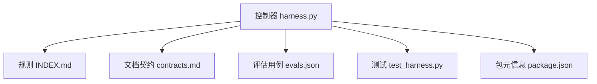
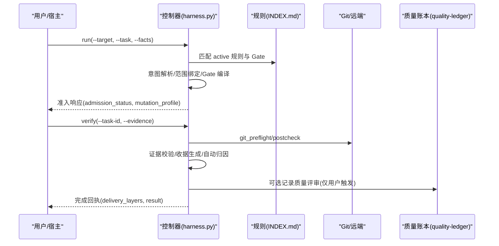
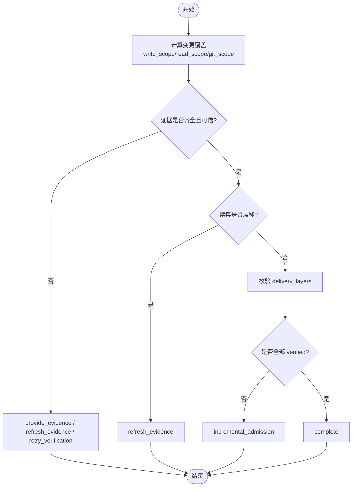
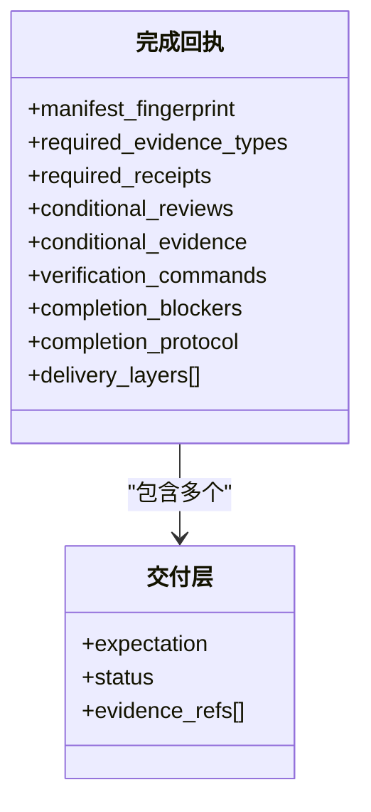
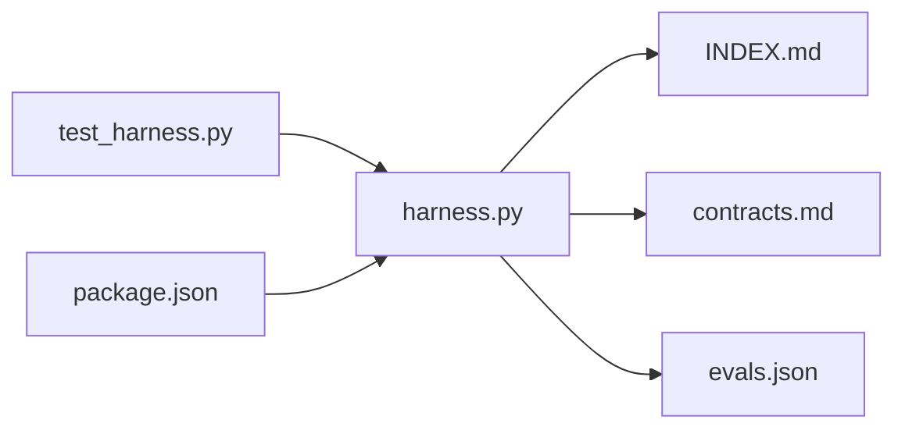

# 质量评估系统

<cite>
**本文引用的文件**
- [harness.py](file://scripts/harness.py)
- [contracts.md](file://docs/contracts.md)
- [evals.json](file://evals/evals.json)
- [INDEX.md](file://harness-home/rules/INDEX.md)
- [documentation-changes.md](file://harness-home/rules/documentation-changes.md)
- [testing-release.md](file://harness-home/rules/testing-release.md)
- [api-compatibility.md](file://harness-home/rules/api-compatibility.md)
- [scope-change-readmission.md](file://harness-home/rules/scope-change-readmission.md)
- [test_harness.py](file://tests/test_harness.py)
- [package.json](file://package.json)
</cite>

## 目录
1. [引言](#引言)
2. [项目结构](#项目结构)
3. [核心组件](#核心组件)
4. [架构总览](#架构总览)
5. [详细组件分析](#详细组件分析)
6. [依赖关系分析](#依赖关系分析)
7. [性能考量](#性能考量)
8. [故障排查指南](#故障排查指南)
9. [结论](#结论)
10. [附录](#附录)

## 引言
本文件面向 Docs Harness 质量评估系统，系统性阐述质量指标体系、评估算法、数据与存储格式、可视化与报告机制、阈值配置与管理、改进建议与自动化修复方案，并给出实际案例与最佳实践。该系统以“意图优先、证据可复用、失败关闭”为核心原则，围绕完整性、一致性、准确性、时效性等维度构建可审计的质量闭环。

## 项目结构
- 控制器源码：scripts/harness.py（任务准入、上下文、验收、知识生命周期、后台 Job、Git 交付检查等）
- 规则集：harness-home/rules/*（受管规则快照，按 Gate 与关键词匹配生效）
- 合同与说明：docs/contracts.md（对外行为与数据结构契约）
- 评估用例：evals/evals.json（评估用例与期望断言）
- 测试套件：tests/test_harness.py（端到端与契约测试）
- 元信息：package.json（版本与脚本）

图表来源
- [harness.py:1-120](file://scripts/harness.py#L1-L120)
- [INDEX.md:1-41](file://harness-home/rules/INDEX.md#L1-L41)
- [contracts.md:1-120](file://docs/contracts.md#L1-L120)
- [evals.json:1-175](file://evals/evals.json#L1-L175)
- [test_harness.py:1-120](file://tests/test_harness.py#L1-L120)
- [package.json:1-23](file://package.json#L1-L23)

章节来源
- [harness.py:1-120](file://scripts/harness.py#L1-L120)
- [package.json:1-23](file://package.json#L1-L23)

## 核心组件
- 质量记录与账本：QUALITY_RECORD_SCHEMA、质量记录路径与校验、读取限制与脱敏
- 证据与收据：evidence-receipt/v2、verification-command-receipt/v1、workspace_attribution 自动归因
- Gate 与规则：GATE_DEFS、FLOOR_TERMS、NEGATION_MARKERS、active rules 索引与指纹校验
- Git 状态与交付层：git_state_snapshot、preflight/postcheck、delivery_layers
- 上下文与授权：context-receipt/v2、authorization-receipt/v2、内容指纹跨阶段复用
- 后台治理：background-job/v2、prepare/dispatched/running/verify 流程

章节来源
- [harness.py:47-180](file://scripts/harness.py#L47-L180)
- [contracts.md:150-220](file://docs/contracts.md#L150-L220)
- [INDEX.md:1-41](file://harness-home/rules/INDEX.md#L1-L41)

## 架构总览
Docs Harness 质量评估系统由“控制器 + 规则 + 契约 + 证据 + 账本”构成，贯穿任务全生命周期：
- 准入阶段：意图解析、范围绑定、Gate 编译、风险判定
- 执行阶段：上下文加载、计划冻结、授权、工作区写入与漂移归因
- 验收阶段：逐命令验证、证据采纳、交付层核验、完成回执
- 治理阶段：后台 Job、增量合并、知识就绪、质量账本记录

图表来源
- [harness.py:677-791](file://scripts/harness.py#L677-L791)
- [contracts.md:1-120](file://docs/contracts.md#L1-L120)
- [INDEX.md:1-41](file://harness-home/rules/INDEX.md#L1-L41)

## 详细组件分析

### 质量指标体系与评估维度
- 完整性：覆盖范围是否完整（read_scope/write_scope/git_scope/external_scope），证据类型是否齐全（source_trace/test_result/security_acceptance 等），交付层是否全部满足（source/local_verification/git_head/remote_delivery/fresh_clone/release_artifact/ui/external_state）
- 一致性：任务包修订与证据/上下文/授权的一致性；contract_delta 的处置是否合理；规则指纹与激活清单一致
- 准确性：证据生产者可信度、命令退出码与输出摘要、工作区无额外交付写入、漂移归因正确
- 时效性：证据 TTL、命令缓存命中、重复任务幂等复用、事件遥测中的 phase-duration-reason

章节来源
- [contracts.md:78-120](file://docs/contracts.md#L78-L120)
- [harness.py:143-175](file://scripts/harness.py#L143-L175)
- [evals.json:1-175](file://evals/evals.json#L1-L175)

### 评估算法实现要点
- 覆盖率分析：基于 write_scope/read_scope/git_scope/external_scope 与 changed_paths 计算覆盖；未覆盖项标记为 not_verified
- 引用验证：read_set 中路径指纹与当前快照比对；漂移时触发 refresh_evidence 或 incremental_admission/full_readmission
- 内容质量检测：证据白名单校验、命令缓存（verification-command-receipt/v1）、volatile_paths 白名单、artifact store 受管副本

图表来源
- [contracts.md:150-220](file://docs/contracts.md#L150-L220)
- [harness.py:677-791](file://scripts/harness.py#L677-L791)

章节来源
- [contracts.md:150-220](file://docs/contracts.md#L150-L220)
- [harness.py:677-791](file://scripts/harness.py#L677-L791)

### 质量记录存储格式（QUALITY_RECORD_SCHEMA）与数据管理策略
- 存储位置：Git 项目下 <git-dir>/docs-harness/quality-ledger/records；非 Git 项目下 .docs-harness/quality-ledger/records
- 字段校验：schema_version、task_id、recorded_at、trigger_source、package_fingerprint、content_fingerprint、复盘文本规范化与长度限制
- 读取限制：单次读取上限、文本最大字符数、列表最大条目数，防止滥用
- 幂等与冲突：同一任务一次快照，冲突不覆盖；支持按 task-id 或关键词查询

章节来源
- [harness.py:911-916](file://scripts/harness.py#L911-L916)
- [harness.py:6795-6852](file://scripts/harness.py#L6795-L6852)
- [harness.py:176-180](file://scripts/harness.py#L176-L180)
- [contracts.md:350-357](file://docs/contracts.md#L350-L357)

### 评估结果可视化与报告生成机制
- 完成回执：包含 delivery_layers 结构化层级，每层 expectation/status/evidence_refs
- 事件遥测：phase/duration_ms/reason_code/package_revision/context_cache_hit/evidence_round_count 等
- 评估用例：evals.json 定义预期标签集合，用于回归与验收

图表来源
- [contracts.md:60-96](file://docs/contracts.md#L60-L96)
- [contracts.md:350-370](file://docs/contracts.md#L350-L370)
- [evals.json:1-175](file://evals/evals.json#L1-L175)

章节来源
- [contracts.md:60-96](file://docs/contracts.md#L60-L96)
- [contracts.md:350-370](file://docs/contracts.md#L350-L370)
- [evals.json:1-175](file://evals/evals.json#L1-L175)

### 质量阈值配置与管理（不同项目类型）
- 规则激活与指纹：INDEX.md 声明 active_rules，运行时不得依赖绝对路径；缺失或指纹漂移失败关闭
- Gate 阈值：GATE_DEFS 与 FLOOR_TERMS 定义安全底线与精确词表，否定守卫避免误报
- 验证命令缓存：verification.command_cache_enabled 控制全局开关；auto_attribute_in_scope 控制自动归因
- 临时副产物白名单：verification.volatile_paths 支持固定根 glob 白名单，越界拒绝

章节来源
- [INDEX.md:1-41](file://harness-home/rules/INDEX.md#L1-L41)
- [harness.py:260-342](file://scripts/harness.py#L260-L342)
- [harness.py:382-389](file://scripts/harness.py#L382-L389)
- [contracts.md:190-220](file://docs/contracts.md#L190-L220)

### 质量改进建议与自动化修复方案
- 补证与重读：provide_evidence/refresh_evidence 引导宿主补齐证据或刷新基线
- 重试与增量准入：retry_verification/incremental_admission 降低重复成本
- 自动归因：workspace_attribution 在写范围内部署自动认领，减少人工补证
- 命令缓存：对输入不变的通过命令直接复用收据，避免重复执行
- 背景治理：background prepare/dispatch/progress/verify 规范复杂任务收尾

章节来源
- [contracts.md:150-220](file://docs/contracts.md#L150-L220)
- [harness.py:677-791](file://scripts/harness.py#L677-L791)
- [contracts.md:303-348](file://docs/contracts.md#L303-L348)

### 实际质量评估案例与最佳实践
- 只读查询：v2-read-only-intent 期望 read_only、ready_direct、write_scope=[]
- 混合意图：v2-mixed-intent-upper-bound 取最高 mutation_profile（workspace_write）
- Git 预检与后检：v2-git-preflight-postcheck 要求 remote-oid-frozen、dirty-overlap-blocked
- 证据收据：v2-evidence-receipt 要求 task-target-package-binding、trusted-producer、ttl、produces-whitelist
- 验证命令收据：v164-verification-command-receipts 要求 per-command-receipt、cache-hit 复用
- 质量账本隔离：quality-ledger-local-isolation 排除 workspace-snapshot 与 git-delivery

章节来源
- [evals.json:1-175](file://evals/evals.json#L1-L175)
- [test_harness.py:339-354](file://tests/test_harness.py#L339-L354)
- [test_harness.py:503-576](file://tests/test_harness.py#L503-L576)

## 依赖关系分析
- 控制器依赖规则索引与指纹校验，确保 active 规则一致性与安全性
- 契约驱动数据结构与流程，保证证据、上下文、授权的可追溯与复用
- 评估用例与测试套件保障回归稳定性与契约一致性

图表来源
- [harness.py:1-120](file://scripts/harness.py#L1-L120)
- [INDEX.md:1-41](file://harness-home/rules/INDEX.md#L1-L41)
- [contracts.md:1-120](file://docs/contracts.md#L1-L120)
- [evals.json:1-175](file://evals/evals.json#L1-L175)
- [test_harness.py:1-120](file://tests/test_harness.py#L1-L120)
- [package.json:1-23](file://package.json#L1-L23)

章节来源
- [harness.py:1-120](file://scripts/harness.py#L1-L120)
- [test_harness.py:1-120](file://tests/test_harness.py#L1-L120)

## 性能考量
- 上下文正文跨阶段复用：按 task/target/compiler contract 与内容指纹复用，避免重复加载
- 验证命令缓存：输入不变则复用收据，减少昂贵命令执行
- 事件遥测有界化：只保存必要计数与原因码，避免泄露敏感信息
- 批量处理与幂等：active_task_key 去重、任务幂等复用、后台 Job 重试归档

章节来源
- [contracts.md:202-218](file://docs/contracts.md#L202-L218)
- [contracts.md:283-302](file://docs/contracts.md#L283-L302)
- [harness.py:176-180](file://scripts/harness.py#L176-L180)

## 故障排查指南
- 常见错误码：missing_file/invalid_json/invalid_target/git_preflight_timeout/git_remote_unavailable/git_sync_scope_ambiguous
- 恢复动作：provide_evidence/refresh_evidence/retry_verification/incremental_admission/full_readmission
- 日志与事件：events.jsonl 记录 phase/duration_ms/reason_code，便于定位循环与瓶颈
- 规则问题：INDEX.md 缺失或指纹变化导致失败关闭，需升级或人工 preserve-and-merge

章节来源
- [harness.py:437-483](file://scripts/harness.py#L437-L483)
- [harness.py:572-583](file://scripts/harness.py#L572-L583)
- [harness.py:661-675](file://scripts/harness.py#L661-L675)
- [contracts.md:359-370](file://docs/contracts.md#L359-L370)
- [INDEX.md:1-41](file://harness-home/rules/INDEX.md#L1-L41)

## 结论
Docs Harness 质量评估系统以契约与证据为核心，结合规则与 Gate 机制，形成从准入到验收的闭环。通过分层处置、命令缓存、自动归因与后台治理，显著降低重复成本并提升可审计性。建议在项目中启用质量账本与评估用例，持续优化阈值与规则，确保质量稳定演进。

## 附录
- 规则示例：documentation-changes.md/testing-release.md/api-compatibility.md/scope-change-readmission.md
- 评估用例：evals.json 提供多场景断言，覆盖意图、Git、证据、验证命令、质量账本等

章节来源
- [documentation-changes.md:1-29](file://harness-home/rules/documentation-changes.md#L1-L29)
- [testing-release.md:1-29](file://harness-home/rules/testing-release.md#L1-L29)
- [api-compatibility.md:1-29](file://harness-home/rules/api-compatibility.md#L1-L29)
- [scope-change-readmission.md:1-29](file://harness-home/rules/scope-change-readmission.md#L1-L29)
- [evals.json:1-175](file://evals/evals.json#L1-L175)