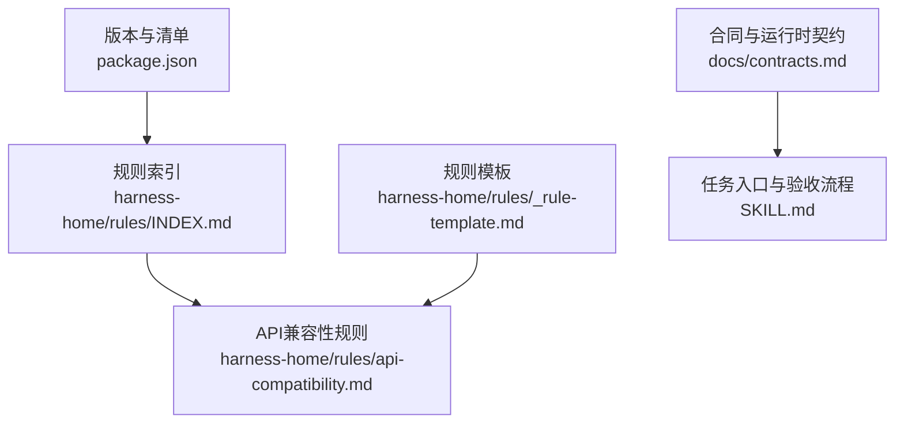
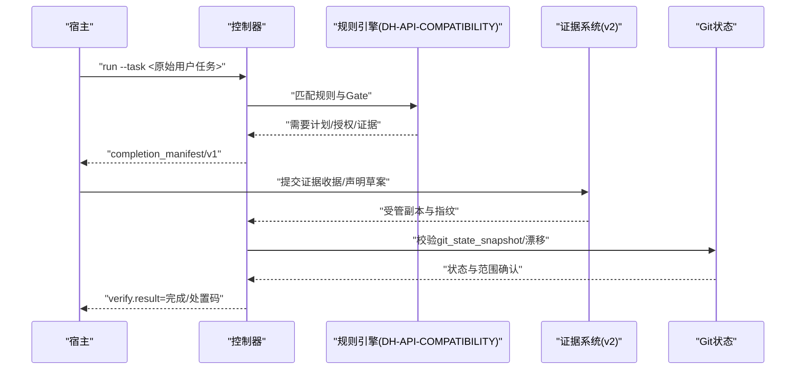
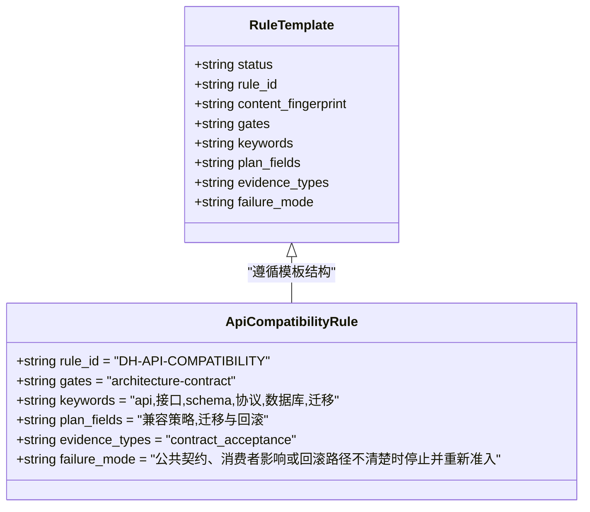
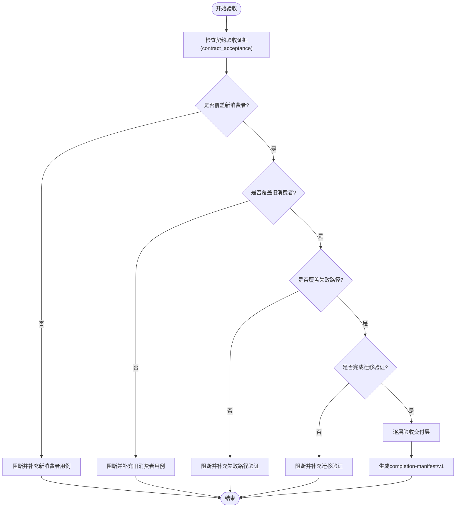
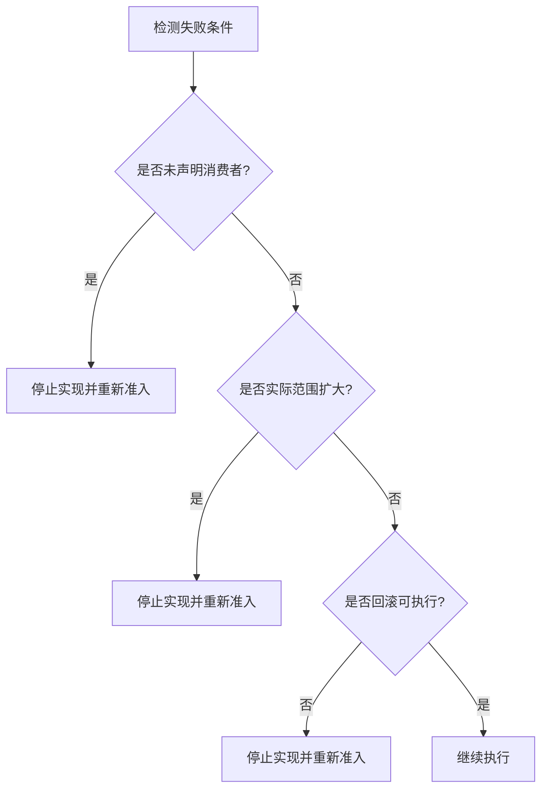
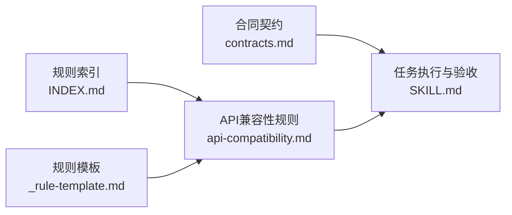

# API兼容性规则

<cite>
**本文引用的文件**   
- [harness-home/rules/api-compatibility.md](file://harness-home/rules/api-compatibility.md)
- [harness-home/rules/INDEX.md](file://harness-home/rules/INDEX.md)
- [harness-home/rules/_rule-template.md](file://harness-home/rules/_rule-template.md)
- [docs/contracts.md](file://docs/contracts.md)
- [SKILL.md](file://SKILL.md)
- [package.json](file://package.json)
</cite>

## 目录
1. [简介](#简介)
2. [项目结构](#项目结构)
3. [核心组件](#核心组件)
4. [架构总览](#架构总览)
5. [详细组件分析](#详细组件分析)
6. [依赖关系分析](#依赖关系分析)
7. [性能考量](#性能考量)
8. [故障排查指南](#故障排查指南)
9. [结论](#结论)
10. [附录：配置示例与最佳实践](#附录配置示例与最佳实践)

## 简介
本文件为“API兼容性规则”的权威说明，用于检查API、Schema、协议、持久化结构与跨模块公共契约的变更是否兼容。该规则在修改接口、数据结构定义、通信协议或数据库迁移时触发，要求方案中明确兼容策略、受影响消费者、迁移顺序与可执行回滚路径；验收需提供契约验收证据，覆盖新旧消费者场景、失败路径与必要的迁移验证；当发现未声明消费者、实际范围扩大或回滚不可执行时，将停止实现并重新准入。

## 项目结构
- 规则定义位于 harness-home/rules 目录，其中 api-compatibility.md 为当前规则的完整定义。
- 通用规则索引 INDEX.md 列出所有生效规则及加载约定。
- 规则模板 _rule-template.md 定义了规则文件的元数据字段与章节结构。
- 合同文档 docs/contracts.md 描述任务包、证据收据、Git状态、验收层等运行时契约，为规则落地提供执行上下文。
- SKILL.md 给出任务入口、验收流程与关键行为约束，作为规则执行的运行环境说明。
- package.json 标识版本与打包清单，确保规则快照随版本管理。

**图表来源** 
- [harness-home/rules/INDEX.md:12-21](file://harness-home/rules/INDEX.md#L12-L21)
- [harness-home/rules/api-compatibility.md:1-29](file://harness-home/rules/api-compatibility.md#L1-L29)
- [harness-home/rules/_rule-template.md:1-21](file://harness-home/rules/_rule-template.md#L1-L21)
- [docs/contracts.md:1-10](file://docs/contracts.md#L1-L10)
- [SKILL.md:25-55](file://SKILL.md#L25-L55)
- [package.json:1-23](file://package.json#L1-L23)

**章节来源**
- [harness-home/rules/api-compatibility.md:1-29](file://harness-home/rules/api-compatibility.md#L1-L29)
- [harness-home/rules/INDEX.md:1-41](file://harness-home/rules/INDEX.md#L1-L41)
- [harness-home/rules/_rule-template.md:1-21](file://harness-home/rules/_rule-template.md#L1-L21)
- [docs/contracts.md:1-10](file://docs/contracts.md#L1-L10)
- [SKILL.md:25-55](file://SKILL.md#L25-L55)
- [package.json:1-23](file://package.json#L1-L23)

## 核心组件
- 规则ID与门控：DH-API-COMPATIBILITY，绑定 architecture-contract Gate，关键词包含 api、schema、协议、数据库、迁移。
- 适用条件：修改API、Schema、协议、持久化结构、跨模块公共契约或迁移路径时生效。
- 必需方案字段：兼容策略、受影响消费者、迁移顺序、可执行回滚路径。
- 验收条件：必须提供契约验收证据（contract_acceptance），覆盖新旧消费者、失败路径与必要迁移验证。
- 失败处理：发现未声明消费者、实际范围扩大或回滚不可执行时，停止实现并重新准入。

**章节来源**
- [harness-home/rules/api-compatibility.md:1-29](file://harness-home/rules/api-compatibility.md#L1-L29)

## 架构总览
API兼容性规则在任务生命周期中与控制器、证据系统与Git状态协同工作：
- 任务入口与准入：通过 run 编译意图与风险Gate，结合规则匹配决定是否需要计划与授权。
- 证据与验收：使用 v2 证据收据与声明草案，按交付层（source、local_verification、git_head、remote_delivery、fresh_clone、release_artifact、ui、external_state）逐项验收。
- Git状态与漂移：git_sync/fetch/inspect 绑定 git_state_snapshot，漂移与越界会触发重新准入或阻断。
- 完成回执：返回 completion-manifest/v1，固定 required_evidence_types、required_receipts、verification_commands 等。

**图表来源** 
- [SKILL.md:25-55](file://SKILL.md#L25-L55)
- [docs/contracts.md:48-78](file://docs/contracts.md#L48-L78)
- [docs/contracts.md:97-132](file://docs/contracts.md#L97-L132)
- [docs/contracts.md:165-218](file://docs/contracts.md#L165-L218)

**章节来源**
- [SKILL.md:25-55](file://SKILL.md#L25-L55)
- [docs/contracts.md:48-78](file://docs/contracts.md#L48-L78)
- [docs/contracts.md:97-132](file://docs/contracts.md#L97-L132)
- [docs/contracts.md:165-218](file://docs/contracts.md#L165-L218)

## 详细组件分析

### 规则元数据与章节结构
- 元数据字段：status、rule_id、content_fingerprint、gates、keywords、plan_fields、evidence_types、failure_mode。
- 章节结构：适用条件、必需的方案字段、验收条件、失败处理方式。
- 模板一致性：_rule-template.md 规定了规则文件的统一结构，便于解析与审计。

**图表来源** 
- [harness-home/rules/_rule-template.md:1-21](file://harness-home/rules/_rule-template.md#L1-L21)
- [harness-home/rules/api-compatibility.md:1-29](file://harness-home/rules/api-compatibility.md#L1-L29)

**章节来源**
- [harness-home/rules/_rule-template.md:1-21](file://harness-home/rules/_rule-template.md#L1-L21)
- [harness-home/rules/api-compatibility.md:1-29](file://harness-home/rules/api-compatibility.md#L1-L29)

### 适用条件与触发点
- 触发面：API接口变更、Schema定义变更、通信协议变更、持久化结构变更、跨模块公共契约变更、迁移路径变更。
- 与Gate联动：architecture-contract Gate 负责契约层面的审查与放行。

**章节来源**
- [harness-home/rules/api-compatibility.md:14-16](file://harness-home/rules/api-compatibility.md#L14-L16)
- [harness-home/rules/INDEX.md:12-21](file://harness-home/rules/INDEX.md#L12-L21)

### 必需的方案字段
- 兼容策略：明确向后/向前兼容策略（如字段新增默认值、废弃字段保留期、版本协商）。
- 受影响消费者：识别并声明所有消费者（上游/下游、同步/异步调用方）。
- 迁移顺序：规划多阶段部署顺序（如先发布兼容层、再切换消费者、最后清理旧逻辑）。
- 可执行回滚路径：设计可逆步骤与回滚窗口，保证失败时可快速恢复。

**章节来源**
- [harness-home/rules/api-compatibility.md:18-20](file://harness-home/rules/api-compatibility.md#L18-L20)

### 验收条件与契约证据
- 证据类型：contract_acceptance。
- 覆盖范围：新旧消费者场景、失败路径处理、必要的迁移验证。
- 交付层：source、local_verification、git_head、remote_delivery、fresh_clone、release_artifact、ui、external_state。
- 完成清单：completion-manifest/v1 固定 required_evidence_types、required_receipts、verification_commands 等。

**图表来源** 
- [docs/contracts.md:63-78](file://docs/contracts.md#L63-L78)
- [docs/contracts.md:82-95](file://docs/contracts.md#L82-L95)
- [harness-home/rules/api-compatibility.md:22-24](file://harness-home/rules/api-compatibility.md#L22-L24)

**章节来源**
- [harness-home/rules/api-compatibility.md:22-24](file://harness-home/rules/api-compatibility.md#L22-L24)
- [docs/contracts.md:63-78](file://docs/contracts.md#L63-L78)
- [docs/contracts.md:82-95](file://docs/contracts.md#L82-L95)

### 失败处理机制
- 触发条件：未声明消费者、实际范围扩大、回滚不可执行。
- 处理动作：停止实现并重新准入（full_readmission），需补充方案与证据后再次准入。

**图表来源** 
- [harness-home/rules/api-compatibility.md:26-28](file://harness-home/rules/api-compatibility.md#L26-L28)
- [docs/contracts.md:153-162](file://docs/contracts.md#L153-L162)

**章节来源**
- [harness-home/rules/api-compatibility.md:26-28](file://harness-home/rules/api-compatibility.md#L26-L28)
- [docs/contracts.md:153-162](file://docs/contracts.md#L153-L162)

### 与运行时契约的集成
- 任务包与证据：v2 证据收据与声明草案，绑定 task_id、target_identity、package_fingerprint、producer、读写集合等。
- Git状态：git_state_snapshot 约束 fetch/sync/inspect 的行为与漂移处理。
- 完成回执：delivery_layers 与 acceptance_layers 明确各层期望与状态，避免静默增加隐藏要求。

**章节来源**
- [docs/contracts.md:165-218](file://docs/contracts.md#L165-L218)
- [docs/contracts.md:97-132](file://docs/contracts.md#L97-L132)
- [docs/contracts.md:82-95](file://docs/contracts.md#L82-L95)

## 依赖关系分析
- 规则与索引：INDEX.md 声明 active_rules 与规则文件映射，确保规则快照一致性与完整性。
- 规则与模板：_rule-template.md 规定字段与章节，保证规则可解析与审计。
- 规则与合同：contracts.md 提供运行时契约，支撑证据、Git状态与验收层的执行。
- 规则与技能：SKILL.md 定义任务入口、验收流程与关键行为，作为规则落地的运行环境。

**图表来源** 
- [harness-home/rules/INDEX.md:12-21](file://harness-home/rules/INDEX.md#L12-L21)
- [harness-home/rules/_rule-template.md:1-21](file://harness-home/rules/_rule-template.md#L1-L21)
- [docs/contracts.md:1-10](file://docs/contracts.md#L1-L10)
- [SKILL.md:25-55](file://SKILL.md#L25-L55)

**章节来源**
- [harness-home/rules/INDEX.md:1-41](file://harness-home/rules/INDEX.md#L1-L41)
- [harness-home/rules/_rule-template.md:1-21](file://harness-home/rules/_rule-template.md#L1-L21)
- [docs/contracts.md:1-10](file://docs/contracts.md#L1-L10)
- [SKILL.md:25-55](file://SKILL.md#L25-L55)

## 性能考量
- 证据复用：验证命令带收据缓存，输入不变直接复用，减少重复执行。
- 增量准入：仅追加普通Gate且合同不变时走 incremental_admission，避免全量重跑。
- 自动归因：write_scope 内写入由控制器代铸 workspace_attribution 收据，降低补证成本。
- 临时产物容忍：已知缓存与中间产物不计入额外写入，减少误报与重试。

**章节来源**
- [docs/contracts.md:190-220](file://docs/contracts.md#L190-L220)
- [docs/contracts.md:153-162](file://docs/contracts.md#L153-L162)
- [docs/contracts.md:218-220](file://docs/contracts.md#L218-L220)

## 故障排查指南
- 常见失败原因：未声明消费者、范围扩大、回滚不可执行。
- 排查步骤：
  - 检查方案字段是否完整（兼容策略、消费者、迁移顺序、回滚路径）。
  - 核对证据类型是否为 contract_acceptance，覆盖新旧消费者与失败路径。
  - 确认交付层验收状态，定位未验证层。
  - 查看Git状态与漂移，必要时重新准入。
- 处置码参考：provide_evidence、refresh_evidence、retry_verification、incremental_admission、full_readmission。

**章节来源**
- [harness-home/rules/api-compatibility.md:26-28](file://harness-home/rules/api-compatibility.md#L26-L28)
- [docs/contracts.md:153-162](file://docs/contracts.md#L153-L162)

## 结论
API兼容性规则以明确的适用条件、方案字段与验收证据为核心，结合运行时契约与Git状态管理，确保接口与契约变更的可控与可回滚。通过严格的失败处理与性能优化，保障系统在演进过程中的稳定性与可维护性。

## 附录：配置示例与最佳实践
- 配置要点：
  - 在 .docs-harness/config.json 中设置 verification.volatile_paths 白名单，限定临时产物根目录。
  - 关闭 command_cache_enabled=false 以禁用验证命令缓存，便于问题复现。
  - 关闭 verification.auto_attribute_in_scope=false 以恢复补证据流程。
- 最佳实践：
  - 变更前先识别消费者并制定兼容策略。
  - 分阶段迁移，先发布兼容层，再切换消费者，最后清理旧逻辑。
  - 设计可执行回滚路径，确保失败时快速恢复。
  - 提供完整的契约验收证据，覆盖新旧消费者与失败路径。
  - 使用交付层逐项验收，避免静默增加隐藏要求。

**章节来源**
- [docs/contracts.md:190-220](file://docs/contracts.md#L190-L220)
- [harness-home/rules/api-compatibility.md:18-24](file://harness-home/rules/api-compatibility.md#L18-L24)